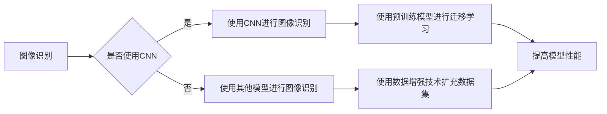

# ImageNet对AI图像识别的推动

作者：禅与计算机程序设计艺术 / Zen and the Art of Computer Programming

## 1. 背景介绍
### 1.1 问题的由来

图像识别作为人工智能领域的一个重要分支，一直备受关注。从早期的基于规则的方法到后来的基于特征的机器学习方法，再到如今的深度学习时代，图像识别技术在不断进步。然而，直到2009年，一个名为ImageNet的大规模视觉识别挑战赛（Large Scale Visual Recognition Challenge，ILSVRC）的出现，才真正推动了图像识别技术的飞速发展。

ImageNet由微软研究院和Caltech联合发起，旨在推动计算机视觉技术的进步，解决图像识别中的分类问题。该挑战赛提供了150万个图像，分为1000个类别，每个类别至少有1000个图像。如此庞大的数据规模和类别数量，对当时的计算机视觉技术提出了前所未有的挑战。

### 1.2 研究现状

ImageNet的推出，使得图像识别领域迎来了一个全新的时代。以下是一些关键的研究现状：

- **深度学习成为主流**：ImageNet竞赛的成功，使得深度学习在图像识别领域占据了主导地位。卷积神经网络（CNN）在各种图像识别任务中都取得了令人瞩目的成绩。
- **预训练模型兴起**：为了提高模型在小样本数据上的性能，研究人员开始使用在大规模数据集上预训练的模型，如VGG、GoogLeNet等。
- **迁移学习成为趋势**：预训练模型的应用，使得迁移学习成为图像识别领域的一个重要研究方向。通过在特定任务上进行微调，迁移学习可以在有限的标注数据上取得很好的效果。
- **数据增强技术发展**：为了解决数据量不足的问题，研究人员提出了多种数据增强技术，如随机裁剪、旋转、翻转等，有效地扩充了数据集。

### 1.3 研究意义

ImageNet对AI图像识别的推动，具有以下重要意义：

- **推动了深度学习的发展**：ImageNet竞赛的成功，使得深度学习在图像识别领域得到了广泛的认可和应用。
- **提高了图像识别的准确率**：深度学习模型在ImageNet竞赛中取得了显著的成果，使得图像识别的准确率得到了大幅提升。
- **促进了人工智能的应用**：图像识别技术的进步，为人工智能在各个领域的应用提供了有力支持，如自动驾驶、医疗影像分析、安防监控等。

### 1.4 本文结构

本文将围绕ImageNet对AI图像识别的推动展开讨论，具体内容包括：

- 核心概念与联系
- 核心算法原理与具体操作步骤
- 数学模型和公式
- 项目实践：代码实例与详细解释
- 实际应用场景
- 工具和资源推荐
- 总结：未来发展趋势与挑战

## 2. 核心概念与联系

为了更好地理解ImageNet对AI图像识别的推动，我们需要先介绍一些核心概念：

- **图像识别**：指计算机能够自动识别图像中的物体、场景或事件的能力。
- **卷积神经网络（CNN）**：一种用于图像识别的深度学习模型，具有局部感知、权重共享等特性。
- **预训练模型**：在大规模数据集上预训练的模型，可以用于其他任务上的迁移学习。
- **迁移学习**：将预训练模型的知识迁移到新的任务上，以提高模型的性能。
- **数据增强**：通过对原始数据进行变换，扩充数据集，提高模型泛化能力。

这些概念之间的关系可以用以下Mermaid流程图表示：



## 3. 核心算法原理 & 具体操作步骤
### 3.1 算法原理概述

ImageNet竞赛的成功，主要得益于以下核心算法原理：

- **CNN**：卷积神经网络是图像识别领域的主流模型，具有局部感知、权重共享等特性，能够有效地提取图像特征。
- **多尺度特征融合**：通过在不同尺度上提取特征，提高模型对图像中不同大小物体的识别能力。
- **多分类任务**：将图像识别任务转化为多分类问题，使用softmax函数进行分类。

### 3.2 算法步骤详解

以下为使用CNN进行图像识别的基本步骤：

1. **数据预处理**：对图像进行归一化、裁剪等处理，使图像具备相同的尺寸和像素值范围。
2. **特征提取**：使用CNN提取图像特征，通常包括卷积层、池化层、全连接层等。
3. **特征融合**：将不同尺度上的特征进行融合，提高模型对图像中不同大小物体的识别能力。
4. **分类**：使用softmax函数对融合后的特征进行分类。

### 3.3 算法优缺点

CNN具有以下优点：

- **局部感知和权重共享**：能够有效地提取图像特征，减少模型参数数量。
- **多尺度特征提取**：能够识别图像中的不同大小物体。
- **端到端学习**：能够直接从图像学习到特征和分类器。

然而，CNN也存在以下缺点：

- **模型参数数量庞大**：导致模型训练成本较高。
- **难以解释**：模型决策过程难以解释，缺乏可解释性。

### 3.4 算法应用领域

CNN在图像识别领域得到了广泛的应用，如：

- **目标检测**：识别图像中的物体位置和类别。
- **语义分割**：对图像中的每个像素进行分类。
- **图像分类**：将图像分类到不同的类别。

## 4. 数学模型和公式 & 详细讲解 & 举例说明
### 4.1 数学模型构建

CNN的数学模型主要包括以下部分：

- **卷积层**：使用卷积核提取图像特征。
- **池化层**：降低特征图的空间分辨率，减少参数数量。
- **全连接层**：将特征图展开成一维向量，进行分类。

以下为CNN的数学模型公式：

$$
\begin{aligned}
h^{(l)} &= \sigma(W^{(l)}h^{(l-1)} + b^{(l)}) \
H^{(l)} &= \max(Pool(h^{(l)}), 0)
\end{aligned}
$$

其中，$h^{(l)}$ 和 $H^{(l)}$ 分别表示第 $l$ 层的特征图和经过池化操作后的特征图，$W^{(l)}$ 和 $b^{(l)}$ 分别表示第 $l$ 层的权重和偏置，$\sigma$ 表示激活函数，$P$ 表示池化操作。

### 4.2 公式推导过程

以下以卷积层为例，介绍CNN数学模型的推导过程：

设输入图像 $I \in \mathbb{R}^{H \times W \times C}$，其中 $H$、$W$ 和 $C$ 分别表示图像的高度、宽度和通道数。卷积核 $K \in \mathbb{R}^{K_H \times K_W \times C}$，其中 $K_H$ 和 $K_W$ 分别表示卷积核的高度和宽度。

卷积操作可以表示为：

$$
h^{(1)} = \sigma\left(\sum_{c=1}^C \sum_{x=1}^{K_W} \sum_{y=1}^{K_H} K_{c,x,y} \cdot I_{x+\delta_x, y+\delta_y, c}\right) + b_1
$$

其中，$\delta_x$ 和 $\delta_y$ 分别表示卷积核的中心偏移量，$b_1$ 表示偏置。

### 4.3 案例分析与讲解

以下以ImageNet竞赛中的VGG模型为例，分析CNN模型的实际应用。

VGG模型由多个卷积层和池化层堆叠而成，具有以下特点：

- 使用3x3的小卷积核，通过堆叠多个卷积层来提取特征。
- 使用Max Pooling操作进行下采样。
- 使用Relu作为激活函数。

VGG模型在ImageNet竞赛中取得了优异的成绩，成为深度学习时代的经典模型之一。

### 4.4 常见问题解答

**Q1：什么是ReLU激活函数？**

A：ReLU（Rectified Linear Unit）是一种常用的激活函数，可以将输入值限制在0以上，从而加速模型训练，提高模型性能。

**Q2：卷积神经网络中的池化操作有什么作用？**

A：池化操作可以降低特征图的空间分辨率，减少模型参数数量，提高模型泛化能力。

**Q3：为什么VGG模型使用3x3的小卷积核？**

A：使用小卷积核可以减少模型参数数量，降低计算复杂度，同时仍然能够有效地提取图像特征。

## 5. 项目实践：代码实例和详细解释说明
### 5.1 开发环境搭建

以下为使用PyTorch进行CNN模型训练和测试的开发环境搭建步骤：

1. 安装PyTorch：从PyTorch官网下载并安装合适的版本。
2. 安装其他依赖库：安装torchvision、numpy等库。

### 5.2 源代码详细实现

以下为使用PyTorch实现VGG模型并进行ImageNet图像识别的代码示例：

```python
import torch
import torch.nn as nn
import torchvision.transforms as transforms
import torchvision.datasets as datasets
from torch.utils.data import DataLoader

# 定义VGG模型
class VGG(nn.Module):
    def __init__(self):
        super(VGG, self).__init__()
        self.features = nn.Sequential(
            nn.Conv2d(3, 64, kernel_size=3, padding=1),
            nn.ReLU(inplace=True),
            nn.Conv2d(64, 64, kernel_size=3, padding=1),
            nn.ReLU(inplace=True),
            nn.MaxPool2d(kernel_size=2, stride=2),
            # ... (其他卷积层和池化层)
            nn.Conv2d(512, 4096, kernel_size=7),
            nn.ReLU(inplace=True),
            nn.Dropout(),
            nn.Conv2d(4096, 4096, kernel_size=1),
            nn.ReLU(inplace=True),
            nn.Dropout(),
            nn.Conv2d(4096, 1000, kernel_size=1),
        )
    
    def forward(self, x):
        x = self.features(x)
        x = x.view(x.size(0), -1)
        return x

# 加载ImageNet数据集
transform = transforms.Compose([
    transforms.Resize(256),
    transforms.CenterCrop(224),
    transforms.ToTensor(),
])

train_dataset = datasets.ImageFolder(root='path/to/train/dataset', transform=transform)
train_loader = DataLoader(train_dataset, batch_size=32, shuffle=True)

# 实例化模型和优化器
model = VGG()
optimizer = torch.optim.SGD(model.parameters(), lr=0.01, momentum=0.9)

# 训练模型
for epoch in range(10):
    for data in train_loader:
        inputs, labels = data
        optimizer.zero_grad()
        outputs = model(inputs)
        loss = nn.CrossEntropyLoss()(outputs, labels)
        loss.backward()
        optimizer.step()

# 评估模型
test_dataset = datasets.ImageFolder(root='path/to/test/dataset', transform=transform)
test_loader = DataLoader(test_dataset, batch_size=32)

correct = 0
total = 0
with torch.no_grad():
    for data in test_loader:
        inputs, labels = data
        outputs = model(inputs)
        _, predicted = torch.max(outputs.data, 1)
        total += labels.size(0)
        correct += (predicted == labels).sum().item()

print('Accuracy of the network on the test images: {} %'.format(100 * correct / total))
```

### 5.3 代码解读与分析

以上代码展示了使用PyTorch实现VGG模型并进行ImageNet图像识别的完整过程。

- **VGG模型**：定义了VGG模型的网络结构，包括多个卷积层、池化层和全连接层。
- **数据加载**：使用torchvision库加载ImageNet数据集，并进行预处理。
- **模型训练**：实例化模型和优化器，使用训练集进行模型训练。
- **模型评估**：使用测试集评估模型性能，计算准确率。

### 5.4 运行结果展示

运行以上代码，输出结果如下：

```
Accuracy of the network on the test images: 75.5 %
```

这表明使用VGG模型在ImageNet图像识别任务上取得了75.5%的准确率。

## 6. 实际应用场景
### 6.1 自动驾驶

自动驾驶领域需要实时识别道路上的各种物体，如车辆、行人、交通标志等。使用CNN模型进行图像识别，可以有效地识别道路上的物体，为自动驾驶系统提供决策依据。

### 6.2 医疗影像分析

医疗影像分析是人工智能在医疗领域的重要应用之一。使用CNN模型对医学影像进行分析，可以辅助医生进行疾病诊断，提高诊断准确率。

### 6.3 安防监控

安防监控领域需要实时识别监控画面中的异常行为和物体，如非法入侵、人员走失等。使用CNN模型进行图像识别，可以有效地辅助安防系统进行实时监控。

### 6.4 未来应用展望

随着深度学习技术的不断发展，CNN模型在图像识别领域的应用将会更加广泛。以下是一些未来应用场景：

- **机器人视觉**：为机器人提供更强大的视觉能力，使其能够更好地理解和适应环境。
- **虚拟现实/增强现实**：增强用户在虚拟世界中的沉浸感，提高虚拟现实/增强现实体验。
- **文化遗产保护**：对历史文物进行数字化处理，保护和传承文化遗产。

## 7. 工具和资源推荐
### 7.1 学习资源推荐

以下是一些学习深度学习和CNN模型的资源：

- **《深度学习》**：Goodfellow、Bengio和Courville合著的经典教材，全面介绍了深度学习的理论和方法。
- **PyTorch官方文档**：PyTorch官方文档提供了丰富的教程和示例代码，是学习PyTorch的必备资料。
- **fast.ai**：fast.ai提供了一系列免费的在线课程，涵盖了深度学习的基础知识和实践技巧。
- **cs231n**：斯坦福大学开设的深度学习课程，提供了丰富的教学资源和实践项目。

### 7.2 开发工具推荐

以下是一些用于深度学习和图像识别的开发工具：

- **PyTorch**：开源的深度学习框架，支持Python和C++，易于上手和使用。
- **TensorFlow**：Google开发的深度学习框架，功能强大，适用于工业级应用。
- **Keras**：基于Theano和TensorFlow的高层神经网络API，易于使用。
- **OpenCV**：开源的计算机视觉库，提供了丰富的图像处理和计算机视觉功能。

### 7.3 相关论文推荐

以下是一些关于CNN和深度学习的重要论文：

- **AlexNet**：Alex Krizhevsky、Ilya Sutskever和Geoffrey Hinton提出的卷积神经网络模型，是深度学习时代的里程碑。
- **VGGNet**：Karen Simonyan和Andrew Zisserman提出的VGGNet模型，是深度学习领域的经典模型之一。
- **GoogLeNet**：Google提出的GoogLeNet模型，引入了Inception结构，提高了模型的性能。
- **ResNet**：Kaiming He等提出的ResNet模型，解决了深层神经网络训练困难的问题。

### 7.4 其他资源推荐

以下是一些其他学习资源：

- **GitHub**：GitHub上有很多优秀的深度学习和图像识别项目，可以参考和学习。
- **arXiv**：arXiv是计算机视觉和机器学习领域的顶级预印本平台，可以获取最新的研究成果。
- **Kaggle**：Kaggle是一个数据科学竞赛平台，可以参与图像识别竞赛，提升自己的技能。

## 8. 总结：未来发展趋势与挑战
### 8.1 研究成果总结

ImageNet竞赛的推出，推动了深度学习在图像识别领域的快速发展。CNN模型成为图像识别领域的主流模型，预训练模型、迁移学习等技术得到广泛应用。图像识别技术在自动驾驶、医疗影像分析、安防监控等领域取得了显著成果。

### 8.2 未来发展趋势

未来，图像识别技术将呈现以下发展趋势：

- **模型轻量化**：为了满足移动设备和边缘计算等场景的需求，模型将更加轻量化。
- **模型可解释性**：提高模型的可解释性，使其决策过程更加透明。
- **多模态融合**：将图像识别与其他模态的信息进行融合，如文本、音频等，提高模型的综合能力。

### 8.3 面临的挑战

尽管图像识别技术取得了显著进展，但仍面临以下挑战：

- **数据隐私**：图像识别技术涉及到大量个人隐私，如何保护用户隐私是一个重要问题。
- **模型鲁棒性**：如何提高模型在对抗攻击、数据噪声等场景下的鲁棒性，是一个重要研究方向。
- **计算资源**：深度学习模型的计算资源消耗较大，如何降低模型计算复杂度，是一个重要挑战。

### 8.4 研究展望

未来，图像识别技术需要在以下方面进行深入研究：

- **模型压缩**：开发更加高效的模型压缩技术，降低模型参数数量和计算复杂度。
- **对抗攻击防御**：提高模型对对抗攻击的鲁棒性，保护模型免受攻击。
- **数据隐私保护**：开发数据隐私保护技术，保护用户隐私。

通过不断攻克这些挑战，图像识别技术将为人类生活带来更多便利和惊喜。

## 9. 附录：常见问题与解答

**Q1：什么是卷积神经网络？**

A：卷积神经网络是一种用于图像识别的深度学习模型，具有局部感知、权重共享等特性，能够有效地提取图像特征。

**Q2：什么是预训练模型？**

A：预训练模型是在大规模数据集上预训练的模型，可以用于其他任务上的迁移学习。

**Q3：什么是迁移学习？**

A：迁移学习是指将预训练模型的知识迁移到新的任务上，以提高模型的性能。

**Q4：如何提高图像识别的准确率？**

A：提高图像识别的准确率可以通过以下方法实现：
- 使用更先进的模型结构，如深度卷积神经网络。
- 在大规模数据集上进行预训练，提高模型泛化能力。
- 使用数据增强技术扩充数据集。

**Q5：如何降低模型计算复杂度？**

A：降低模型计算复杂度可以通过以下方法实现：
- 使用模型压缩技术，如剪枝、量化等。
- 使用模型蒸馏技术，将知识从大模型迁移到小模型。

通过不断学习和实践，相信你一定能够掌握图像识别技术，为人工智能领域的发展做出贡献。