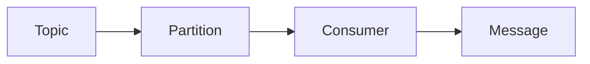

# KafkaConsumer的原理与代码实例

作者：禅与计算机程序设计艺术 / Zen and the Art of Computer Programming

## 1. 背景介绍
### 1.1 问题的由来

随着大数据时代的到来，分布式消息队列系统在处理大规模数据流、实现高并发、低延迟的数据传输方面发挥着越来越重要的作用。Apache Kafka 是当今最流行的开源消息队列之一，它具有高吞吐量、可扩展性强、持久化存储等特点，广泛应用于金融、电商、物流等领域。在 Kafka 集群中，KafkaConsumer 作为客户端组件，负责从 Kafka 集群中消费消息，实现数据的接收和处理。本文将深入探讨 KafkaConsumer 的原理，并通过代码实例展示其应用方法。

### 1.2 研究现状

近年来，随着 Kafka 版本的迭代升级，KafkaConsumer 也不断优化和改进。目前，KafkaConsumer 支持多种消息消费模式，如单线程、多线程、自定义分区分配策略等，能够满足不同场景下的消费需求。此外，KafkaConsumer 还提供了丰富的 API 接口，方便开发者进行消息消费和数据处理。

### 1.3 研究意义

深入研究 KafkaConsumer 的原理，有助于开发者更好地理解 Kafka 集群的架构和工作机制，提高 Kafka 应用的开发效率。同时，掌握 KafkaConsumer 的使用方法，可以帮助开发者实现高效、稳定的数据消费和处理。

### 1.4 本文结构

本文将分为以下几个部分：
- 介绍 KafkaConsumer 的核心概念和联系。
- 阐述 KafkaConsumer 的工作原理和具体操作步骤。
- 分析 KafkaConsumer 的优缺点和应用领域。
- 通过代码实例展示 KafkaConsumer 的应用方法。
- 探讨 KafkaConsumer 的实际应用场景和未来发展趋势。

## 2. 核心概念与联系

在深入研究 KafkaConsumer 原理之前，我们需要了解以下核心概念：

- Kafka：一个分布式流处理平台，用于构建实时数据管道和流应用程序。
- Topic：Kafka 集群中的消息分类，类似于数据库中的表。
- Partition：Topic 中的消息分区，可以提高消息吞吐量。
- Consumer：从 Kafka 集群中消费消息的客户端应用程序。
- Offset：消息在 Partition 中的位置，用于标记消息消费的位置。

这些概念之间的联系如下：



在 Kafka 集群中，消息被存储在 Topic 中的多个 Partition 中。每个 Partition 都是一个有序的、不可变的消息序列。Consumer 从 Partition 中消费消息，并按照顺序处理消息。

## 3. 核心算法原理 & 具体操作步骤
### 3.1 算法原理概述

KafkaConsumer 的核心算法原理主要涉及以下几个方面：

1. 分区分配：KafkaConsumer 需要根据配置策略将 Topic 的多个 Partition 分配给不同的 Consumer。
2. 消息消费：Consumer 从分配到的 Partition 中读取消息，并按照顺序进行处理。
3. 事务处理：KafkaConsumer 支持事务处理，保证消息消费的原子性和一致性。
4. 分组消费：多个 Consumer 可以组成一个消费组，共同消费一个 Topic 的多个 Partition。

### 3.2 算法步骤详解

以下为 KafkaConsumer 的具体操作步骤：

1. 创建 KafkaConsumer 实例：配置消费者参数，如 bootstrap.servers、group.id、key.deserializer、value.deserializer 等。
2. 获取 Topic 的 Partition 列表：调用 KafkaConsumer 的 partitionsFor 方法，获取指定 Topic 的 Partition 列表。
3. 分区分配：根据配置的策略，将 Topic 的 Partition 分配给不同的 Consumer。
4. 消费消息：使用 KafkaConsumer 的 poll 方法消费消息，并处理消息。
5. 事务提交：在处理完一条消息后，调用 KafkaConsumer 的 commitSync 方法提交事务，保证消息消费的原子性和一致性。
6. 关闭 KafkaConsumer：完成消息消费后，调用 KafkaConsumer 的 close 方法关闭连接。

### 3.3 算法优缺点

KafkaConsumer 的优点：

- 支持多种消费模式，如单线程、多线程、自定义分区分配策略等，满足不同场景下的消费需求。
- 支持事务处理，保证消息消费的原子性和一致性。
- 提供丰富的 API 接口，方便开发者进行消息消费和数据处理。
- 兼容性良好，支持多种编程语言。

KafkaConsumer 的缺点：

- 消费者消费性能受到网络延迟、分区数等因素的影响。
- 处理消息异常时，需要开发者自行处理，缺乏自动恢复机制。

### 3.4 算法应用领域

KafkaConsumer 可应用于以下领域：

- 实时数据处理：如日志收集、实时监控、实时分析等。
- 分布式系统解耦：如服务解耦、异步通信、数据同步等。
- 流处理系统：如 Apache Flink、Apache Spark Streaming 等流处理框架。
- 消息队列系统：如 Apache Kafka、RabbitMQ、RocketMQ 等。

## 4. 数学模型和公式 & 详细讲解 & 举例说明
### 4.1 数学模型构建

KafkaConsumer 的数学模型主要涉及以下概念：

- 消费者数量：N
- Topic 数量：M
- Partition 数量：P
- 消费者组数量：G

### 4.2 公式推导过程

以下为分区分配的数学模型推导过程：

1. 消费者组内消费者数量：$c = \frac{P}{G}$
2. 每个消费者分配到的 Partition 数量：$p = \frac{P}{c}$
3. 每个消费者处理的消息数量：$m = N \times p$

### 4.3 案例分析与讲解

假设 Kafka 集群中有 1 个 Topic，3 个 Partition，2 个消费者，消费者组为 group1。

1. 消费者组内消费者数量：$c = \frac{3}{2} = 1.5$，向上取整为 2。
2. 每个消费者分配到的 Partition 数量：$p = \frac{3}{2} = 1.5$，向上取整为 2。
3. 每个消费者处理的平均消息数量：$m = 2 \times 2 = 4$。

因此，每个消费者负责消费 2 个 Partition 的消息，每个消费者平均处理 4 条消息。

### 4.4 常见问题解答

**Q1：如何选择合适的分区分配策略？**

A：选择合适的分区分配策略需要考虑以下因素：

- 消费者数量：消费者数量与 Partition 数量的比例。
- 消息类型：消息大小、实时性要求等。
- 消费者能力：处理消息的能力，如 CPU、内存、网络等。

**Q2：如何处理消息异常？**

A：在处理消息时，如果发生异常，可以采取以下措施：

- 重试：尝试重新消费该消息。
- 跳过：跳过异常消息，继续消费后续消息。
- 记录日志：记录异常信息，便于后续分析。
- 报警：触发报警，通知开发人员处理。

## 5. 项目实践：代码实例和详细解释说明
### 5.1 开发环境搭建

在进行 KafkaConsumer 开发之前，需要搭建以下开发环境：

- 安装 Java 开发环境
- 安装 Kafka 集群
- 安装 Maven 或 Gradle 等 Java 依赖管理工具

### 5.2 源代码详细实现

以下为使用 Java 语言实现 KafkaConsumer 的示例代码：

```java
import org.apache.kafka.clients.consumer.ConsumerConfig;
import org.apache.kafka.clients.consumer.ConsumerRecord;
import org.apache.kafka.clients.consumer.KafkaConsumer;

import java.time.Duration;
import java.util.Arrays;
import java.util.Properties;

public class KafkaConsumerExample {
    public static void main(String[] args) {
        // 创建 KafkaConsumer 实例
        Properties props = new Properties();
        props.put(ConsumerConfig.BOOTSTRAP_SERVERS_CONFIG, "localhost:9092");
        props.put(ConsumerConfig.GROUP_ID_CONFIG, "group1");
        props.put(ConsumerConfig.KEY_DESERIALIZER_CLASS_CONFIG, "org.apache.kafka.common.serialization.StringDeserializer");
        props.put(ConsumerConfig.VALUE_DESERIALIZER_CLASS_CONFIG, "org.apache.kafka.common.serialization.StringDeserializer");

        KafkaConsumer<String, String> consumer = new KafkaConsumer<>(props);

        // 获取 Topic 的 Partition 列表
        consumer.partitionsFor("test").forEach(partition -> {
            consumer.assign(Arrays.asList(partition));
        });

        // 消费消息
        try {
            while (true) {
                ConsumerRecords<String, String> records = consumer.poll(Duration.ofMillis(100));
                for (ConsumerRecord<String, String> record : records) {
                    System.out.printf("offset = %d, key = %s, value = %s%n", record.offset(), record.key(), record.value());
                }
            }
        } finally {
            consumer.close();
        }
    }
}
```

### 5.3 代码解读与分析

以上代码演示了如何使用 Java 语言实现 KafkaConsumer，主要包含以下步骤：

1. 创建 KafkaConsumer 实例：配置消费者参数，如 bootstrap.servers、group.id、key.deserializer、value.deserializer 等。
2. 获取 Topic 的 Partition 列表：调用 KafkaConsumer 的 partitionsFor 方法，获取指定 Topic 的 Partition 列表。
3. 分区分配：使用 KafkaConsumer 的 assign 方法，将 Topic 的 Partition 分配给当前 Consumer。
4. 消费消息：调用 KafkaConsumer 的 poll 方法消费消息，并处理消息。
5. 关闭 KafkaConsumer：完成消息消费后，调用 KafkaConsumer 的 close 方法关闭连接。

### 5.4 运行结果展示

运行以上代码，将输出消费到的消息内容，如：

```
offset = 0, key = test_key, value = test_value
offset = 1, key = test_key2, value = test_value2
offset = 2, key = test_key3, value = test_value3
```

## 6. 实际应用场景
### 6.1 日志收集

KafkaConsumer 可用于收集来自各个系统的日志信息，实现对日志数据的实时监控和分析。

### 6.2 实时监控

KafkaConsumer 可用于实时监控系统的运行状态，如 CPU 使用率、内存使用率、网络流量等。

### 6.3 实时分析

KafkaConsumer 可用于实时分析用户行为、市场趋势、业务数据等，为业务决策提供数据支持。

### 6.4 未来应用展望

随着 Kafka 集群的不断发展，KafkaConsumer 将在更多领域得到应用，如：

- 分布式计算框架：如 Apache Flink、Apache Spark Streaming 等。
- 实时推荐系统：如电商、金融、社交等领域的推荐系统。
- 实时搜索系统：如搜索引擎、内容推荐等领域的实时搜索。
- 物联网：物联网设备产生的海量数据可以通过 KafkaConsumer 进行实时处理和分析。

## 7. 工具和资源推荐
### 7.1 学习资源推荐

以下是一些学习 KafkaConsumer 的资源：

- Apache Kafka 官方文档：https://kafka.apache.org/documentation/
- Kafka 中文社区：https://kafka.apachecn.org/
- 《Kafka权威指南》：https://www.amazon.com/Kafka-Definitive-Guide-Thomas-Kean-Manu/dp/1491979419

### 7.2 开发工具推荐

以下是一些用于 KafkaConsumer 开发的工具：

- IntelliJ IDEA：https://www.jetbrains.com/idea/
- Eclipse：https://www.eclipse.org/
- Maven：https://maven.apache.org/

### 7.3 相关论文推荐

以下是一些与 KafkaConsumer 相关的论文：

- Kafka: A Distributed Streaming Platform https://www.usenix.org/conference/nsdi14/technical-sessions/presentation/yan
- Design and Implementation of Apache Kafka https://www.ics.uci.edu/~eppstein/pubs/kafka-ics14.pdf

### 7.4 其他资源推荐

以下是一些其他与 KafkaConsumer 相关的资源：

- Kafka 社区论坛：https://community.apache.org/kafka/
- Kafka 邮件列表：https://lists.apache.org/listinfo.cgi/kafka-dev

## 8. 总结：未来发展趋势与挑战
### 8.1 研究成果总结

本文深入探讨了 KafkaConsumer 的原理、应用方法以及实际场景。通过代码实例，展示了如何使用 KafkaConsumer 进行消息消费。同时，本文还介绍了 KafkaConsumer 在日志收集、实时监控、实时分析等领域的应用。

### 8.2 未来发展趋势

随着 Kafka 集群的不断发展，KafkaConsumer 将在以下方面取得新的突破：

- 支持更多编程语言和平台。
- 提高消息消费的吞吐量和性能。
- 加强与其他大数据技术的融合。
- 优化消息消费的可靠性和容错性。

### 8.3 面临的挑战

KafkaConsumer 在未来发展中仍面临以下挑战：

- 消费者性能优化：提高消费者在低延迟、高吞吐量场景下的性能。
- 跨语言支持：支持更多编程语言和平台，降低使用门槛。
- 消息可靠性保障：提高消息消费的可靠性和容错性，确保数据不丢失。

### 8.4 研究展望

随着技术的不断发展，KafkaConsumer 将在以下方面进行深入研究：

- 消费者性能优化：研究更高效的消费算法，提高消费者在低延迟、高吞吐量场景下的性能。
- 跨语言支持：研究跨语言的 KafkaConsumer 实现，降低使用门槛。
- 消息可靠性保障：研究更可靠的消费模式，提高消息消费的可靠性和容错性。
- 智能化消费：研究基于人工智能技术的智能化消费模式，提高消费效率。

相信在开发者、研究者以及社区的共同努力下，KafkaConsumer 将在 Kafka 集群中发挥更加重要的作用，为大数据时代的实时数据处理提供有力支持。

## 9. 附录：常见问题与解答

**Q1：KafkaConsumer 支持哪些消息消费模式？**

A：KafkaConsumer 支持以下消息消费模式：

- 单线程消费：单个线程消费 Topic 的多个 Partition。
- 多线程消费：多个线程并行消费 Topic 的多个 Partition。
- 自定义分区分配策略：根据需求自定义分区分配策略。

**Q2：如何处理消息异常？**

A：在处理消息时，如果发生异常，可以采取以下措施：

- 重试：尝试重新消费该消息。
- 跳过：跳过异常消息，继续消费后续消息。
- 记录日志：记录异常信息，便于后续分析。
- 报警：触发报警，通知开发人员处理。

**Q3：如何提高 KafkaConsumer 的性能？**

A：以下是一些提高 KafkaConsumer 性能的方法：

- 选择合适的分区分配策略。
- 调整消费者数量和线程数。
- 优化消息处理逻辑。
- 使用异步处理方式。
- 使用批处理方式。

**Q4：KafkaConsumer 与其他消息队列系统的区别是什么？**

A：KafkaConsumer 与其他消息队列系统的区别主要体现在以下几个方面：

- 性能：Kafka 具有更高的吞吐量和更强的可扩展性。
- 功能：Kafka 支持事务处理、跨语言客户端等更多功能。
- 可靠性：Kafka 支持持久化存储，保证数据不丢失。

作者：禅与计算机程序设计艺术 / Zen and the Art of Computer Programming