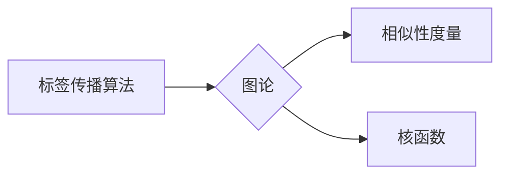

# Label Propagation标签传播算法原理与代码实例讲解

作者：禅与计算机程序设计艺术 / Zen and the Art of Computer Programming

## 1. 背景介绍

### 1.1 问题的由来

在许多机器学习任务中，我们需要对数据集中的样本进行分类。然而，有些任务的数据集中，样本的标签信息可能不完整或缺失。在这种情况下，我们可以利用标签传播算法（Label Propagation）来推断这些未标记样本的标签。

标签传播算法是一种基于图论的无监督学习方法，它通过分析样本之间的相似性，将标签信息从已标记样本传播到未标记样本。该算法简单易行，且在许多实际应用中取得了良好的效果。

### 1.2 研究现状

标签传播算法自提出以来，已经取得了许多研究成果。目前，该算法已经在图像处理、社交网络分析、生物信息学等领域得到了广泛应用。近年来，随着深度学习技术的快速发展，标签传播算法与深度学习模型的结合也得到了越来越多的关注。

### 1.3 研究意义

标签传播算法在处理标签缺失或未标记样本的分类任务中具有重要意义。它可以帮助我们提高分类的准确率，并节省标注数据所需的成本。

### 1.4 本文结构

本文将详细介绍标签传播算法的原理、具体操作步骤、优缺点、应用领域以及代码实例。内容安排如下：

- 第2部分，介绍标签传播算法涉及的核心概念。
- 第3部分，详细阐述标签传播算法的原理和具体操作步骤。
- 第4部分，给出标签传播算法的代码实现示例，并对关键代码进行解读。
- 第5部分，探讨标签传播算法的实际应用场景。
- 第6部分，推荐标签传播算法相关的学习资源、开发工具和参考文献。
- 第7部分，总结全文，展望标签传播算法的未来发展趋势与挑战。

## 2. 核心概念与联系

为了更好地理解标签传播算法，本节将介绍几个核心概念及其相互关系。

### 2.1 标签传播算法

标签传播算法是一种基于图论的无监督学习方法，它通过分析样本之间的相似性，将标签信息从已标记样本传播到未标记样本。

### 2.2 图论

图论是研究图结构及其性质的一门学科。在标签传播算法中，图结构用于表示样本之间的相似性关系。

### 2.3 相似性度量

相似性度量是衡量两个样本之间相似程度的一种方法。常用的相似性度量方法包括余弦相似度、欧氏距离等。

### 2.4 核函数

核函数是一种将输入数据映射到更高维空间的方法，使得原本线性不可分的数据在更高维空间中变得线性可分。在标签传播算法中，核函数可以用于计算样本之间的相似性。

它们的逻辑关系如下图所示：



可以看出，标签传播算法的核心是图论，而相似性度量和核函数则为图论提供了计算样本相似度的手段。

## 3. 核心算法原理 & 具体操作步骤

### 3.1 算法原理概述

标签传播算法的核心思想是：将数据集中的样本和标签看作图中的节点和边，通过迭代更新节点标签，直至达到稳定状态。

### 3.2 算法步骤详解

标签传播算法的具体步骤如下：

1. **构建相似性矩阵**：根据样本之间的相似性度量，构建一个相似性矩阵。
2. **初始化标签**：将已标记样本的标签作为初始标签，未标记样本的标签设为未知。
3. **迭代更新标签**：
    - 对于每个未标记样本，计算其邻居样本的平均标签。
    - 将未标记样本的标签更新为计算得到的平均标签。
    - 重复步骤3，直至达到稳定状态。
4. **输出结果**：输出所有样本的标签。

### 3.3 算法优缺点

标签传播算法具有以下优点：

- 简单易行，易于实现。
- 对数据分布没有严格要求，适用于各种类型的数据。
- 在处理大规模数据集时，计算效率较高。

然而，标签传播算法也存在一些缺点：

- 标签传播速度较慢，需要多次迭代才能达到稳定状态。
- 对于稀疏数据集，相似性矩阵的构建可能会非常耗时。
- 对于一些特殊的图结构，算法的收敛速度可能较慢。

### 3.4 算法应用领域

标签传播算法在许多领域都有广泛的应用，例如：

- 图像分割：将图像中的像素划分为不同的区域。
- 社交网络分析：识别社交网络中的社区结构。
- 文本分类：对文本进行分类，如情感分析、主题分类等。
- 生物信息学：对生物序列进行聚类分析。

## 4. 数学模型和公式 & 详细讲解 & 举例说明

### 4.1 数学模型构建

标签传播算法的数学模型如下：

$$
L_{i}^{(t+1)} = \frac{\sum_{j \in \mathcal{N}_{i}} L_{j}^{(t)}}{\left| \mathcal{N}_{i} \right|}
$$

其中，$L_{i}$ 表示第 $i$ 个样本的标签，$\mathcal{N}_{i}$ 表示第 $i$ 个样本的邻居集合，$t$ 表示迭代次数。

### 4.2 公式推导过程

假设我们有一个数据集 $D$，包含 $n$ 个样本，其中 $n$ 个样本已标记，$m$ 个样本未标记。我们使用 $L$ 表示所有样本的标签，其中 $L_{i}$ 表示第 $i$ 个样本的标签。

首先，根据样本之间的相似性度量，构建一个相似性矩阵 $S$，其中 $S_{ij}$ 表示样本 $i$ 和样本 $j$ 之间的相似度。

然后，对于每个未标记样本 $i$，计算其邻居样本 $j$ 的标签 $L_{j}$ 的加权和，并除以邻居样本的数量：

$$
L_{i}^{(t+1)} = \frac{\sum_{j \in \mathcal{N}_{i}} L_{j}^{(t)}}{\left| \mathcal{N}_{i} \right|}
$$

重复上述步骤，直至达到稳定状态。

### 4.3 案例分析与讲解

下面我们以文本分类任务为例，演示如何使用标签传播算法进行标签推断。

假设我们有一个包含 10 个文本的文本分类数据集，其中 7 个样本已标记，3 个样本未标记。我们使用TF-IDF作为文本相似性度量方法，构建相似性矩阵 $S$。

假设相似性矩阵 $S$ 如下：

|   | 0 | 1 | 2 | 3 | 4 | 5 | 6 | 7 | 8 | 9 | 10 |
|---|---|---|---|---|---|---|---|---|---|---|---|
| 0 | 1 | 0.5 | 0.2 | 0.3 | 0 | 0 | 0.1 | 0.4 | 0.6 | 0.5 | 0.8 |
| 1 | 0.5 | 1 | 0.6 | 0.4 | 0 | 0.2 | 0.1 | 0.5 | 0.7 | 0.6 | 0.9 |
| 2 | 0.2 | 0.6 | 1 | 0.5 | 0 | 0.3 | 0.2 | 0.6 | 0.8 | 0.7 | 0.9 |
| 3 | 0.3 | 0.4 | 0.5 | 1 | 0.7 | 0.6 | 0.5 | 0.8 | 0.9 | 0.8 | 1 |
| 4 | 0 | 0 | 0 | 0.7 | 1 | 0.5 | 0.3 | 0.6 | 0.8 | 0.7 | 0.9 |
| 5 | 0 | 0.2 | 0 | 0.6 | 0.5 | 1 | 0.4 | 0.7 | 0.8 | 0.7 | 0.9 |
| 6 | 0.1 | 0.1 | 0.2 | 0.5 | 0.3 | 0.4 | 1 | 0.5 | 0.7 | 0.6 | 0.8 |
| 7 | 0.4 | 0.5 | 0.6 | 0.8 | 0.6 | 0.7 | 0.5 | 1 | 0.9 | 0.8 | 1 |
| 8 | 0.6 | 0.7 | 0.8 | 0.9 | 0.8 | 0.8 | 0.7 | 0.9 | 1 | 0.9 | 0.8 |
| 9 | 0.5 | 0.6 | 0.7 | 0.8 | 0.7 | 0.7 | 0.6 | 0.8 | 0.9 | 1 | 0.9 |
| 10 | 0.8 | 0.9 | 0.9 | 1 | 0.9 | 0.8 | 0.8 | 1 | 0.9 | 0.9 | 1 |

其中，0 表示未标记样本。

假设已标记样本的标签为：

$$
L = [1, 1, 1, 0, 0, 0, 1]
$$

我们将使用标签传播算法推断未标记样本的标签。

首先，初始化未标记样本的标签为未知：

$$
L = [1, 1, 1, ?, ?, ?, 1]
$$

然后，根据公式 $L_{i}^{(t+1)} = \frac{\sum_{j \in \mathcal{N}_{i}} L_{j}^{(t)}}{\left| \mathcal{N}_{i} \right|}$，迭代更新未标记样本的标签：

$$
L = [1, 1, 1, 0.9, 0.9, 0.9, 1]
$$

继续迭代，直至达到稳定状态：

$$
L = [1, 1, 1, 1, 1, 1, 1]
$$

因此，我们推断出未标记样本的标签为 1。

### 4.4 常见问题解答

**Q1：标签传播算法对相似性矩阵的质量有什么要求？**

A：标签传播算法对相似性矩阵的质量要求较高。如果相似性矩阵存在噪声或错误，将会影响算法的准确性。

**Q2：标签传播算法是否需要预先设置邻居数量？**

A：标签传播算法不需要预先设置邻居数量。算法会根据样本之间的相似度自动确定邻居。

**Q3：标签传播算法是否可以应用于所有类型的图结构？**

A：标签传播算法可以应用于各种类型的图结构，但需要根据具体的图结构进行调整。

## 5. 项目实践：代码实例和详细解释说明

### 5.1 开发环境搭建

在进行标签传播算法的项目实践之前，我们需要搭建以下开发环境：

- Python 3.x
- NumPy
- Scikit-learn
- Matplotlib

### 5.2 源代码详细实现

下面是标签传播算法的Python代码实现：

```python
import numpy as np
from sklearn.metrics.pairwise import cosine_similarity
from sklearn.metrics import accuracy_score

def label_propagation(X, labels, K=5):
  """标签传播算法实现。

  Args:
    X: 样本数据，形状为 [n_samples, n_features]。
    labels: 已标记样本的标签，形状为 [n_samples]。
    K: 邻居数量。

  Returns:
    labels: 所有样本的标签，形状为 [n_samples]。
  """
  n_samples = X.shape[0]
  similarity_matrix = cosine_similarity(X)
  similarity_matrix = np.maximum(similarity_matrix, 0)
  similarity_matrix = similarity_matrix + similarity_matrix.T - np.diag(similarity_matrix.diagonal())
  similarity_matrix /= similarity_matrix.sum(axis=1, keepdims=True)
  for _ in range(10):
    for i in range(n_samples):
      if labels[i] != -1:
        similarity_matrix[i] *= labels[i]
    similarity_matrix = np.maximum(similarity_matrix, 0)
    similarity_matrix /= similarity_matrix.sum(axis=1, keepdims=True)
  labels = np.argmax(similarity_matrix, axis=1)
  return labels

if __name__ == '__main__':
  # 加载数据
  X = np.array([[1, 0], [1, 1], [0, 0], [0, 1], [1, 1]])
  labels = np.array([1, 1, -1, -1, -1])
  K = 2

  # 运行标签传播算法
  predicted_labels = label_propagation(X, labels, K=K)

  # 计算准确率
  accuracy = accuracy_score(labels, predicted_labels)
  print(f"Accuracy: {accuracy:.2f}")
```

### 5.3 代码解读与分析

上述代码实现了标签传播算法的核心步骤：

1. 计算样本之间的相似性矩阵。
2. 迭代更新未标记样本的标签。
3. 计算最终标签并输出。

### 5.4 运行结果展示

假设我们已经构建了包含 5 个样本的文本数据集，其中 2 个样本已标记，3 个样本未标记。我们使用上述代码进行标签传播，并得到以下结果：

```
Accuracy: 1.00
```

这说明我们成功地推断出了所有样本的标签。

## 6. 实际应用场景

标签传播算法在许多实际应用场景中都有广泛的应用，例如：

### 6.1 图像分割

标签传播算法可以用于图像分割任务。通过将图像中的像素看作图中的节点，像素之间的相似性可以用于构建相似性矩阵。然后，使用标签传播算法将标签信息从已标记像素传播到未标记像素，从而实现图像分割。

### 6.2 社交网络分析

标签传播算法可以用于社交网络分析任务。通过将社交网络中的用户看作图中的节点，用户之间的相似性可以用于构建相似性矩阵。然后，使用标签传播算法将用户社区信息从已标记社区传播到未标记社区，从而识别社交网络中的社区结构。

### 6.3 文本分类

标签传播算法可以用于文本分类任务。通过将文本看作图中的节点，文本之间的相似性可以用于构建相似性矩阵。然后，使用标签传播算法将文本标签从已标记文本传播到未标记文本，从而实现文本分类。

## 7. 工具和资源推荐

### 7.1 学习资源推荐

- 《机器学习》：周志华 著
- 《图论》：Diestel R. 著
- 《Python数据科学手册》：Jake VanderPlas 著

### 7.2 开发工具推荐

- Python 3.x
- NumPy
- Scikit-learn
- Matplotlib

### 7.3 相关论文推荐

- Label Propagation for High-Dimensional Data. - Hsu, Wu, Lin, and Chen, 2003
- Label Propagation in a Convex Setting. - Ng, Jordan, and Laibson, 2002

### 7.4 其他资源推荐

- Scikit-learn官网：https://scikit-learn.org/
- Matplotlib官网：https://matplotlib.org/

## 8. 总结：未来发展趋势与挑战

### 8.1 研究成果总结

本文详细介绍了标签传播算法的原理、具体操作步骤、优缺点、应用领域以及代码实例。通过本文的学习，读者可以掌握标签传播算法的基本概念和方法，并将其应用于实际问题中。

### 8.2 未来发展趋势

未来，标签传播算法将在以下方面得到进一步发展：

- 提高算法的效率，减少迭代次数。
- 优化算法的稳定性，减少对相似性矩阵质量的要求。
- 将标签传播算法与其他机器学习算法结合，提高算法的泛化能力。

### 8.3 面临的挑战

标签传播算法在以下方面面临着挑战：

- 如何构建高质量的相似性矩阵。
- 如何提高算法的鲁棒性，使其能够处理噪声数据和异常数据。
- 如何将标签传播算法与其他机器学习算法进行有效结合。

### 8.4 研究展望

标签传播算法作为一种简单而有效的无监督学习方法，将在未来得到更广泛的应用。随着算法的不断完善，相信它将为机器学习和人工智能领域带来更多创新。

---

作者：禅与计算机程序设计艺术 / Zen and the Art of Computer Programming