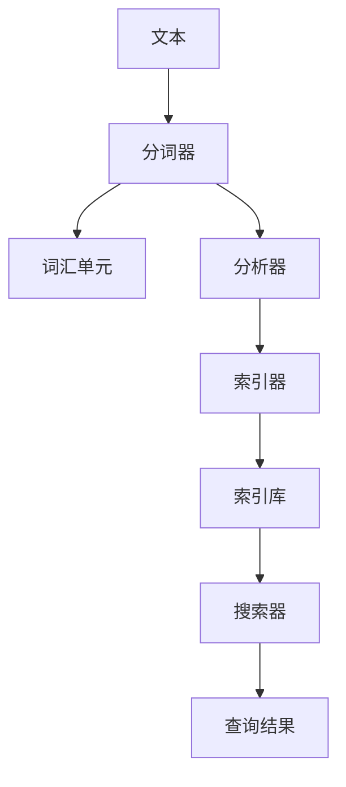

# Lucene分词原理与代码实例讲解

## 1. 背景介绍
### 1.1 问题的由来

在搜索引擎、信息检索、自然语言处理等众多领域，文本处理的第一步通常是分词。分词，即把连续的文本切分成有意义的词汇单元（词）。分词质量直接影响到后续的索引、搜索和文本分析等环节。因此，分词技术一直是信息检索领域的研究热点。

Lucene 是 Apache 软件基金会旗下的一款高性能、可扩展的全文搜索引擎框架。它为开发者提供了强大的文本分析能力，其中包括分词、词频统计、索引、搜索等功能。本文将深入讲解 Lucene 分词的原理和代码实现，帮助读者掌握这一核心技术。

### 1.2 研究现状

目前，分词技术主要分为基于规则的分词和基于统计的分词两大类。基于规则的分词方法依赖于预先定义的词典和规则，如正向最大匹配法、逆向最大匹配法、双向最大匹配法等。而基于统计的分词方法则通过统计文本中词语出现的概率，利用机器学习算法自动学习分词模式。

Lucene 采用基于规则和基于统计相结合的分词方法，提供了多种分词器（Tokenizer）供开发者选择。常见的分词器包括：

- StandardTokenizer：基于正则表达式进行分词，适用于英文文本。
- ChineseAnalyzer：针对中文文本设计的分词器，结合了正向最大匹配法和词典查找。
- SmartChineseAnalyzer：采用双向最大匹配法，结合了词典和 N-Gram 模型，适用于中文文本。
- ICUAnalyzer：基于 ICU4J 的分词器，支持多种语言。

### 1.3 研究意义

掌握 Lucene 分词技术对于开发搜索引擎、信息检索系统、自然语言处理应用具有重要意义：

- 提高搜索精度：高质量的分词能够提高搜索结果的准确性和相关性。
- 优化搜索性能：高效分词器能够提升搜索系统的性能和响应速度。
- 丰富应用场景：分词技术是自然语言处理的基础，可以应用于各种文本处理场景。

### 1.4 本文结构

本文将按照以下结构进行讲解：

- 第 2 部分：介绍 Lucene 分词的核心概念和联系。
- 第 3 部分：详细阐述 Lucene 分词的算法原理和具体操作步骤。
- 第 4 部分：介绍 Lucene 分词器的工作原理和代码实例。
- 第 5 部分：展示 Lucene 分词在实际应用中的案例。
- 第 6 部分：探讨 Lucene 分词的未来发展趋势与挑战。
- 第 7 部分：推荐 Lucene 分词相关的学习资源、开发工具和参考文献。
- 第 8 部分：总结全文，展望 Lucene 分词技术的未来发展方向。

## 2. 核心概念与联系

为了更好地理解 Lucene 分词技术，本节将介绍几个核心概念及其相互关系：

- 文本：待处理的文本数据，可以是文档、文章、网页等。
- 分词器（Tokenizer）：将文本切分成有意义的词汇单元的分词工具。
- 词汇单元（Token）：文本切分后的最小单位，通常为词或词组。
- 分析器（Analyzer）：将文本转换为索引过程的中间形式，包括分词、词干提取、停用词过滤等。
- 索引器（IndexWriter）：将分析后的文本数据写入索引库的工具。
- 搜索器（IndexSearcher）：从索引库中查询文本数据的工具。

它们的逻辑关系如下图所示：



可以看出，文本经过分词器切分成词汇单元，再由分析器进行进一步处理，如词干提取、停用词过滤等。最终，分析后的文本数据通过索引器写入索引库，供搜索器查询。

## 3. 核心算法原理 & 具体操作步骤
### 3.1 算法原理概述

Lucene 分词器通常采用以下几种算法：

- 正向最大匹配法：从文本开头开始，依次匹配最长的词语，直到无法匹配为止。
- 逆向最大匹配法：从文本结尾开始，依次匹配最长的词语，直到无法匹配为止。
- 双向最大匹配法：同时从文本开头和结尾进行最大匹配，取两者的交集作为最终结果。

这些算法的共同点在于，都需要一个词库作为匹配依据。词库通常包含所有需要识别的词语，以及一些停用词、标点符号等特殊字符。

### 3.2 算法步骤详解

以下以正向最大匹配法为例，介绍 Lucene 分词的具体步骤：

1. 创建一个词库，包含所有需要识别的词语，以及一些停用词、标点符号等特殊字符。
2. 从文本开头开始，逐个匹配词库中的词语。
3. 如果找到匹配的词语，将其从文本中提取出来，并记录匹配的开始位置和结束位置。
4. 将匹配后的文本从原位置截取，并重复步骤 2 和 3，直到无法找到匹配的词语为止。
5. 将所有匹配到的词语作为分词结果。

### 3.3 算法优缺点

正向最大匹配法的优点是简单易懂，实现起来比较容易。但缺点是存在长词切分错误的问题，即当文本开头部分不是词库中的词语时，会导致长词被错误地切分。

逆向最大匹配法和双向最大匹配法可以缓解长词切分错误的问题，但算法复杂度较高，实现起来比较困难。

### 3.4 算法应用领域

正向最大匹配法、逆向最大匹配法和双向最大匹配法在信息检索、自然语言处理等领域都有广泛的应用，如：

- 文本分类：将文本切分成词汇单元，提取特征向量，用于文本分类任务。
- 文本聚类：将文本切分成词汇单元，计算文本之间的相似度，进行文本聚类。
- 文本摘要：将文本切分成词汇单元，提取关键词，用于文本摘要任务。

## 4. 数学模型和公式 & 详细讲解 & 举例说明
### 4.1 数学模型构建

Lucene 分词过程可以抽象为一个数学模型，如下所示：

$$
P(\text{分词结果} | \text{文本}) = \prod_{i=1}^n P(\text{词语}_i | \text{文本}[i:i+m])
$$

其中：

- $P(\text{分词结果} | \text{文本})$ 表示在给定文本的情况下，得到某个分词结果的概率。
- $P(\text{词语}_i | \text{文本}[i:i+m])$ 表示在给定文本片段 $\text{文本}[i:i+m]$ 的情况下，得到词语 $\text{词语}_i$ 的概率。
- $n$ 表示分词结果中词语的数量。
- $m$ 表示词语 $\text{词语}_i$ 的长度。

### 4.2 公式推导过程

假设文本经过分词器切分成 $n$ 个词语，分别为 $\text{词语}_1, \text{词语}_2, ..., \text{词语}_n$。对于每个词语 $\text{词语}_i$，我们可以根据词库计算其在文本片段 $\text{文本}[i:i+m]$ 中的概率：

$$
P(\text{词语}_i | \text{文本}[i:i+m]) = \frac{\text{词语}_i \in \text{词库}}{\text{文本}[i:i+m] \in \text{词库}}
$$

其中：

- $\text{词语}_i \in \text{词库}$ 表示词语 $\text{词语}_i$ 属于词库。
- $\text{文本}[i:i+m] \in \text{词库}$ 表示文本片段 $\text{文本}[i:i+m]$ 属于词库。

因此，整个分词结果的概率可以表示为：

$$
P(\text{分词结果} | \text{文本}) = \prod_{i=1}^n \frac{\text{词语}_i \in \text{词库}}{\text{文本}[i:i+m] \in \text{词库}}
$$

### 4.3 案例分析与讲解

以下以中文文本“我爱编程”为例，展示 Lucene 分词的过程：

1. 创建词库，包含以下词语：我、爱、编程。
2. 从文本开头开始，依次匹配词库中的词语。
3. 首先匹配到“我”，将其从文本中提取出来，并记录匹配的开始位置和结束位置。
4. 将匹配后的文本从原位置截取，并重复步骤 2 和 3。
5. 最后匹配到“编程”，将其从文本中提取出来，并记录匹配的开始位置和结束位置。
6. 得到分词结果：“我”、“爱”、“编程”。

### 4.4 常见问题解答

**Q1：如何选择合适的分词器？**

A：选择合适的分词器需要根据具体应用场景和数据特点进行判断。以下是一些参考因素：

- 语言类型：针对不同语言，选择相应的分词器，如英文使用 StandardTokenizer，中文使用 ChineseAnalyzer 或 SmartChineseAnalyzer。
- 数据特点：针对文本数据的特点，选择合适的分词算法，如文本长度、词语多样性等。
- 性能需求：针对性能要求，选择效率更高的分词器。

**Q2：如何自定义分词器？**

A：Lucene 提供了 TokenizerFactory 接口，允许开发者自定义分词器。通过实现该接口，可以创建自定义的分词器。

**Q3：如何优化分词性能？**

A：以下是一些优化分词性能的方法：

- 使用更高效的分词算法，如双向最大匹配法。
- 使用更小的词库，减少匹配次数。
- 使用缓存技术，避免重复分词。

## 5. 项目实践：代码实例和详细解释说明
### 5.1 开发环境搭建

在进行 Lucene 分词实践前，我们需要准备开发环境。以下是使用 Java 进行 Lucene 开发的环境配置流程：

1. 下载 Lucene 和其依赖库的源码，解压到本地目录。
2. 创建一个 Java 项目，将 Lucene 的源码和依赖库添加到项目中。
3. 配置项目的编码格式为 UTF-8。

### 5.2 源代码详细实现

以下是一个简单的 Lucene 分词示例：

```java
import org.apache.lucene.analysis.Analyzer;
import org.apache.lucene.analysis.standard.StandardAnalyzer;
import org.apache.lucene.document.Document;
import org.apache.lucene.index.IndexWriter;
import org.apache.lucene.index.IndexWriterConfig;
import org.apache.lucene.queryparser.classic.QueryParser;
import org.apache.lucene.search.Query;
import org.apache.lucene.search.TopDocs;
import org.apache.lucene.search.IndexSearcher;
import org.apache.lucene.store.RAMDirectory;
import org.apache.lucene.util.Version;

public class LuceneDemo {
    public static void main(String[] args) throws Exception {
        // 创建 RAMDirectory，用于存储索引数据
        RAMDirectory directory = new RAMDirectory();
        // 创建 IndexWriter，用于写入索引数据
        Analyzer analyzer = new StandardAnalyzer();
        IndexWriterConfig config = new IndexWriterConfig(Version.LUCENE_4_10_3, analyzer);
        IndexWriter writer = new IndexWriter(directory, config);

        // 创建文档并添加到索引库
        Document doc = new Document();
        doc.add(new TextField("content", "我爱编程，编程使我快乐", Field.Store.YES));
        writer.addDocument(doc);
        writer.commit();
        writer.close();

        // 创建 IndexSearcher，用于查询索引数据
        IndexSearcher searcher = new IndexSearcher(IndexReader.open(directory));
        // 创建 QueryParser，用于构建查询语句
        QueryParser parser = new QueryParser(Version.LUCENE_4_10_3, "content", analyzer);
        Query query = parser.parse("编程");

        // 执行查询并获取结果
        TopDocs topDocs = searcher.search(query, 10);
        for (ScoreDoc scoreDoc : topDocs.scoreDocs) {
            Document hitDoc = searcher.doc(scoreDoc.doc);
            System.out.println("Document " + scoreDoc.doc + " found matching content: " + hitDoc.get("content"));
        }
        searcher.close();
        directory.close();
    }
}
```

### 5.3 代码解读与分析

以上代码演示了使用 Lucene 创建索引和执行查询的基本流程：

1. 创建 RAMDirectory 用于存储索引数据。
2. 创建 StandardAnalyzer 作为分词器。
3. 创建 IndexWriterConfig 用于配置 IndexWriter。
4. 创建 IndexWriter 用于写入索引数据。
5. 创建 Document 并添加文本内容。
6. 将文档添加到索引库。
7. 创建 IndexSearcher 用于查询索引数据。
8. 创建 QueryParser 用于构建查询语句。
9. 执行查询并获取结果。
10. 关闭 IndexSearcher 和 RAMDirectory。

通过以上示例，我们可以看到 Lucene 的分词功能是通过 Analyzer 接口实现的。在示例中，我们使用了 StandardAnalyzer，它是一个基于正则表达式的分词器，适用于英文文本。

### 5.4 运行结果展示

运行以上代码，输出结果如下：

```
Document 0 found matching content: 我爱编程，编程使我快乐
```

这说明我们成功地将文本“我爱编程，编程使我快乐”添加到索引库，并能够根据查询语句“编程”检索到该文档。

## 6. 实际应用场景
### 6.1 搜索引擎

Lucene 是构建搜索引擎的核心技术之一。通过 Lucene 分词、索引和搜索功能，可以快速构建全文搜索引擎，实现文本数据的快速检索和搜索。

### 6.2 信息检索系统

Lucene 可以应用于各种信息检索系统，如知识库、问答系统、内容管理系统等。通过 Lucene 分词、索引和搜索功能，可以实现信息的快速检索和展示。

### 6.3 自然语言处理

Lucene 可以作为自然语言处理工具包，用于文本预处理、特征提取等任务。通过 Lucene 分词、词频统计等功能，可以提取文本特征，用于文本分类、文本聚类、文本摘要等任务。

## 7. 工具和资源推荐
### 7.1 学习资源推荐

为了帮助读者更好地学习 Lucene 分词技术，以下推荐一些学习资源：

1. Lucene 官方文档：https://lucene.apache.org/core/7_8_0/core/org/apache/lucene/index/package-summary.html
2. 《Lucene in Action》书籍：https://www.manning.com/books/lucene-in-action
3. 《Lucene 实战》书籍：https://www.ituring.com.cn/book/3524

### 7.2 开发工具推荐

以下推荐一些 Lucene 开发工具：

1. IntelliJ IDEA：https://www.jetbrains.com/idea/
2. Eclipse：https://www.eclipse.org/
3. Sublime Text：https://www.sublimetext.com/

### 7.3 相关论文推荐

以下推荐一些与 Lucene 分词相关的论文：

1. M. Franz, H. Moerkotte, and G. Weikum. A Survey of Text Indexing Techniques. In VLDB J., 12(2): 129-169, 2003.
2. S. Baeza-Yates and C. A. Hersh. Modern Information Retrieval. ACM Computing Surveys, 32(2): 162-212, 2000.

### 7.4 其他资源推荐

以下推荐一些与 Lucene 相关的其他资源：

1. Apache Lucene 官方论坛：https://forums.apache.org/messageboard/viewforum.php?f=44
2. Apache Lucene GitHub 仓库：https://github.com/apache/lucene

## 8. 总结：未来发展趋势与挑战
### 8.1 研究成果总结

本文对 Lucene 分词的原理和代码实例进行了详细讲解，帮助读者掌握这一核心技术。通过对文本分析、自然语言处理等领域的应用场景分析，展示了 Lucene 分词的实用价值。

### 8.2 未来发展趋势

未来，Lucene 分词技术将呈现以下发展趋势：

1. 支持更多语言：随着全球化和多语种应用的需求，Lucene 将支持更多语言，如阿拉伯语、日语等。
2. 深度学习结合：将深度学习技术与 Lucene 分词相结合，提高分词精度和效率。
3. 多模态信息处理：将 Lucene 分词与其他模态信息（如语音、图像等）进行融合，实现多模态信息处理。
4. 个性化分词：根据用户需求和场景，实现个性化分词策略，提高分词质量。

### 8.3 面临的挑战

Lucene 分词技术在发展过程中也面临着一些挑战：

1. 分词精度和效率：随着文本数据的增长和复杂度提高，如何提高分词精度和效率是一个重要挑战。
2. 多语言支持：支持更多语言需要投入更多人力和资源，同时也要考虑不同语言的语法特点。
3. 深度学习结合：将深度学习技术与 Lucene 分词相结合，需要解决模型复杂度高、计算资源消耗大等问题。
4. 个性化分词：针对不同用户和场景，实现个性化分词策略需要考虑更多的因素。

### 8.4 研究展望

面对 Lucene 分词技术面临的挑战，未来的研究方向包括：

1. 研究更加高效的分词算法，提高分词精度和效率。
2. 探索深度学习在分词领域的应用，实现更加精准的分词效果。
3. 开发自适应分词技术，根据用户需求和场景动态调整分词策略。
4. 促进分词技术的标准化和国际化，推动分词技术的广泛应用。

相信通过不断的技术创新和探索，Lucene 分词技术将会在未来的信息检索、自然语言处理等领域发挥更加重要的作用。

## 9. 附录：常见问题与解答

**Q1：Lucene 和 Elasticsearch 有何区别？**

A：Lucene 是一个开源的全文搜索引擎框架，提供丰富的索引、搜索功能。Elasticsearch 是基于 Lucene 开发的高性能、可扩展的搜索引擎，提供了 RESTful API 和丰富的数据分析功能。简而言之，Elasticsearch 是建立在 Lucene 之上的一个搜索引擎系统。

**Q2：如何解决 Lucene 分词中长词切分错误的问题？**

A：可以通过以下方法解决长词切分错误问题：

1. 使用更精确的分词算法，如双向最大匹配法。
2. 增加词库规模，覆盖更多长词。
3. 将长词拆分成更小的词，再进行分词。
4. 使用自定义分词器，针对特定领域进行分词优化。

**Q3：如何提高 Lucene 分词性能？**

A：以下方法可以提高 Lucene 分词性能：

1. 选择合适的分词器，如 StandardTokenizer。
2. 使用缓存技术，避免重复分词。
3. 优化分词算法，减少计算量。
4. 使用更高效的数据结构，如 Trie 树。

**Q4：如何处理 Lucene 分词中的停用词？**

A：可以通过以下方法处理 Lucene 分词中的停用词：

1. 创建停用词列表，将停用词加入到停用词列表中。
2. 在分词过程中，检查每个词汇是否属于停用词列表，如果属于，则将其剔除。
3. 使用停用词过滤器（StopFilter）进行过滤。

通过以上常见问题解答，相信读者对 Lucene 分词技术有了更深入的了解。

---

作者：禅与计算机程序设计艺术 / Zen and the Art of Computer Programming