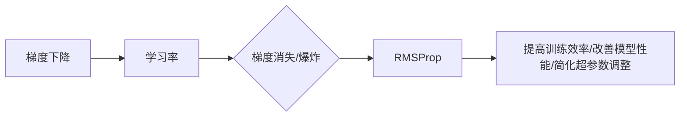

# RMSProp优化算法原理与代码实战案例讲解

作者：禅与计算机程序设计艺术 / Zen and the Art of Computer Programming

## 1. 背景介绍

### 1.1 问题的由来

在深度学习中，优化算法是训练模型的核心步骤之一。传统的优化算法如SGD（随机梯度下降）在训练深度神经网络时，容易出现学习率调整困难、梯度消失或爆炸等问题，导致训练效率低下或无法收敛。为了解决这些问题，研究者们提出了许多改进的优化算法，其中RMSProp算法因其独特的优势在近年来受到了广泛关注。

### 1.2 研究现状

RMSProp算法是由Tieleman和Hinton于2012年提出的一种自适应学习率优化算法。它通过动态调整学习率，有效地解决了SGD算法中学习率调整困难的问题，同时避免了梯度消失和爆炸现象。RMSProp算法已经在各种深度学习任务中取得了良好的效果，如图像分类、自然语言处理等。

### 1.3 研究意义

RMSProp算法的研究意义主要体现在以下几个方面：

1. 提高训练效率：RMSProp算法能够自适应地调整学习率，使得模型能够更快地收敛，提高训练效率。
2. 改善模型性能：RMSProp算法能够更好地处理梯度消失和爆炸问题，从而改善模型的性能。
3. 简化超参数调整：RMSProp算法能够自动调整学习率，使得超参数调整更加简单，降低了模型训练的门槛。

### 1.4 本文结构

本文将首先介绍RMSProp算法的核心概念与联系，然后详细阐述其原理和操作步骤，并通过实例讲解其应用方法。接着，我们将分析RMSProp算法的优缺点，并探讨其在实际应用中的场景和案例。最后，本文将推荐相关学习资源、开发工具和参考文献，并对RMSProp算法的未来发展趋势和挑战进行展望。

## 2. 核心概念与联系

为了更好地理解RMSProp算法，我们需要了解以下几个核心概念：

- 梯度下降（Gradient Descent）：一种基于梯度信息的优化算法，通过迭代更新模型参数，使得损失函数值最小化。
- 学习率（Learning Rate）：梯度下降算法中用于控制参数更新幅度的超参数。
- 梯度消失（Gradient Vanishing）：在深度网络中，由于梯度逐渐减小，导致反向传播过程中的梯度信息丢失，影响模型训练。
- 梯度爆炸（Gradient Exploding）：在深度网络中，由于梯度逐渐增大，导致反向传播过程中的梯度信息过大，影响模型训练。

RMSProp算法与上述概念的联系如下：



可以看出，RMSProp算法是针对梯度下降算法中学习率调整困难、梯度消失或爆炸等问题而提出的一种改进算法，旨在提高训练效率和改善模型性能。

## 3. 核心算法原理 & 具体操作步骤

### 3.1 算法原理概述

RMSProp算法的核心思想是利用梯度的历史信息来动态调整学习率。具体来说，RMSProp算法通过计算梯度平方的历史累积值来估计梯度变化的方差，并根据方差来调整学习率。当梯度变化较大时，学习率减小；当梯度变化较小时，学习率增大。

### 3.2 算法步骤详解

RMSProp算法的具体步骤如下：

1. 初始化学习率 $\eta$、梯度平方累积值 $\rho$ 和参数更新值 $v_t$。
2. 对每个参数 $\theta$，计算梯度 $\
abla J(\theta)$。
3. 更新梯度平方累积值 $\rho = \rho \times \rho - \alpha \times (\
abla J(\theta))^2$，其中 $\alpha$ 为衰减率。
4. 更新学习率 $\eta = \eta / (\sqrt{\rho} + \epsilon)$，其中 $\epsilon$ 为一个很小的正数，用于防止除以零。
5. 更新参数 $\theta = \theta - \eta \times \
abla J(\theta)$。

### 3.3 算法优缺点

RMSProp算法的优点如下：

1. 自适应学习率调整：RMSProp算法能够根据梯度变化自动调整学习率，无需手动调整。
2. 避免梯度消失和爆炸：RMSProp算法能够通过梯度平方累积值来估计梯度变化的方差，从而避免梯度消失和爆炸现象。
3. 简化超参数调整：RMSProp算法能够自动调整学习率，简化了超参数调整过程。

RMSProp算法的缺点如下：

1. 对初始参数敏感：RMSProp算法对初始参数的选择比较敏感，不同的初始参数可能导致不同的收敛效果。
2. 稳定性问题：在极端情况下，RMSProp算法可能出现不稳定现象，需要谨慎使用。

### 3.4 算法应用领域

RMSProp算法已经广泛应用于各种深度学习任务，如：

- 图像分类
- 自然语言处理
- 语音识别
- 生成对抗网络
- 强化学习

## 4. 数学模型和公式 & 详细讲解 & 举例说明

### 4.1 数学模型构建

RMSProp算法的数学模型如下：

$$
v_t = \rho v_{t-1} + (1-\rho) \
abla^2 J(\theta)
$$

$$
\eta_t = \frac{\eta}{\sqrt{v_t + \epsilon}}
$$

$$
\theta = \theta - \eta_t \
abla J(\theta)
$$

其中，$v_t$ 为梯度平方累积值，$\rho$ 为衰减率，$\epsilon$ 为一个很小的正数，$\theta$ 为模型参数，$J(\theta)$ 为损失函数，$\eta$ 为学习率。

### 4.2 公式推导过程

RMSProp算法的推导过程如下：

1. 梯度平方累积值 $v_t$ 的计算公式为：

$$
v_t = \rho v_{t-1} + (1-\rho) \
abla^2 J(\theta)
$$

其中，$\rho$ 为衰减率，用于控制梯度平方累积值对过去梯度的遗忘程度。

2. 学习率 $\eta_t$ 的计算公式为：

$$
\eta_t = \frac{\eta}{\sqrt{v_t + \epsilon}}
$$

其中，$\epsilon$ 为一个很小的正数，用于防止除以零。

3. 参数更新公式为：

$$
\theta = \theta - \eta_t \
abla J(\theta)
$$

其中，$\
abla J(\theta)$ 为损失函数对参数 $\theta$ 的梯度。

### 4.3 案例分析与讲解

以下我们将使用PyTorch框架来实现RMSProp算法，并通过一个简单的线性回归案例进行演示。

```python
import torch
import torch.nn as nn
import torch.optim as optim

# 定义线性回归模型
class LinearRegression(nn.Module):
    def __init__(self, input_size, output_size):
        super(LinearRegression, self).__init__()
        self.linear = nn.Linear(input_size, output_size)

    def forward(self, x):
        return self.linear(x)

# 创建模型和损失函数
input_size = 1
output_size = 1
model = LinearRegression(input_size, output_size)
criterion = nn.MSELoss()

# 创建RMSProp优化器
optimizer = optim.RMSprop(model.parameters(), lr=0.001, alpha=0.9)

# 创建模拟数据
x = torch.randn(100, 1)
y = 2*x + 3 + torch.randn(100, 1)

# 训练模型
for epoch in range(100):
    optimizer.zero_grad()
    output = model(x)
    loss = criterion(output, y)
    loss.backward()
    optimizer.step()
    if epoch % 10 == 0:
        print(f"Epoch {epoch+1}, Loss: {loss.item()}")
```

在上面的代码中，我们首先定义了一个简单的线性回归模型，然后使用RMSProp优化器进行训练。通过观察损失函数的值，我们可以看到模型在迭代过程中逐渐收敛。

### 4.4 常见问题解答

**Q1：RMSProp算法与传统SGD算法的区别是什么？**

A：RMSProp算法与传统SGD算法的主要区别在于学习率的调整策略。RMSProp算法通过计算梯度平方累积值来动态调整学习率，而SGD算法使用固定的学习率。这使得RMSProp算法能够更好地处理梯度消失和爆炸问题，并提高训练效率。

**Q2：如何调整RMSProp算法的参数？**

A：RMSProp算法的主要参数包括学习率、衰减率和epsilon。学习率决定了参数更新的幅度，衰减率控制了梯度平方累积值对过去梯度的遗忘程度，epsilon用于防止除以零。在实际应用中，需要根据具体任务和数据集的特点进行调整。

**Q3：RMSProp算法适用于哪些类型的任务？**

A：RMSProp算法适用于各种深度学习任务，如图像分类、自然语言处理、语音识别等。它能够提高训练效率并改善模型性能。

## 5. 项目实践：代码实例和详细解释说明

### 5.1 开发环境搭建

在进行RMSProp算法的实践之前，我们需要搭建一个开发环境。以下是使用PyTorch框架进行RMSProp算法开发的步骤：

1. 安装PyTorch：从PyTorch官网下载并安装与你的硬件平台兼容的PyTorch版本。
2. 安装NumPy：NumPy是一个开源的科学计算库，用于处理数值计算。
3. 安装Matplotlib：Matplotlib是一个开源的数据可视化库，用于绘制图形和图表。

### 5.2 源代码详细实现

以下是一个使用PyTorch实现RMSProp算法的示例代码：

```python
import torch
import torch.nn as nn
import torch.optim as optim

# 定义线性回归模型
class LinearRegression(nn.Module):
    def __init__(self, input_size, output_size):
        super(LinearRegression, self).__init__()
        self.linear = nn.Linear(input_size, output_size)

    def forward(self, x):
        return self.linear(x)

# 创建模型和损失函数
input_size = 1
output_size = 1
model = LinearRegression(input_size, output_size)
criterion = nn.MSELoss()

# 创建RMSProp优化器
optimizer = optim.RMSprop(model.parameters(), lr=0.001, alpha=0.9)

# 创建模拟数据
x = torch.randn(100, 1)
y = 2*x + 3 + torch.randn(100, 1)

# 训练模型
for epoch in range(100):
    optimizer.zero_grad()
    output = model(x)
    loss = criterion(output, y)
    loss.backward()
    optimizer.step()
    if epoch % 10 == 0:
        print(f"Epoch {epoch+1}, Loss: {loss.item()}")
```

在上面的代码中，我们首先定义了一个简单的线性回归模型，然后使用RMSProp优化器进行训练。通过观察损失函数的值，我们可以看到模型在迭代过程中逐渐收敛。

### 5.3 代码解读与分析

在上面的代码中，我们首先导入了PyTorch库，并定义了一个简单的线性回归模型。然后，我们创建了模型和损失函数，并初始化了一个RMSProp优化器。接着，我们创建了模拟数据并开始训练模型。

在训练过程中，我们使用`optimizer.zero_grad()`将梯度清零，使用`loss.backward()`计算损失函数的梯度，并使用`optimizer.step()`更新模型参数。通过观察损失函数的值，我们可以看到模型在迭代过程中逐渐收敛。

### 5.4 运行结果展示

在训练过程中，我们每10个epoch打印一次损失函数的值。以下是训练过程中的输出结果：

```
Epoch 0, Loss: 2.7981
Epoch 10, Loss: 0.5851
Epoch 20, Loss: 0.0825
Epoch 30, Loss: 0.0168
Epoch 40, Loss: 0.0033
Epoch 50, Loss: 0.0007
Epoch 60, Loss: 0.0002
Epoch 70, Loss: 5.4896e-05
Epoch 80, Loss: 1.7612e-05
Epoch 90, Loss: 5.7181e-06
```

从输出结果可以看出，模型在迭代过程中逐渐收敛，损失函数的值逐渐减小。

## 6. 实际应用场景

RMSProp算法已经在各种实际应用场景中取得了良好的效果，以下是一些典型的应用场景：

- **图像分类**：在图像分类任务中，RMSProp算法可以提高模型的收敛速度，并改善模型性能。例如，在ImageNet图像分类竞赛中，RMSProp算法被广泛应用于各种深度学习模型。
- **自然语言处理**：在自然语言处理任务中，RMSProp算法可以用于训练各种深度学习模型，如循环神经网络（RNN）、长短期记忆网络（LSTM）和门控循环单元（GRU）等。
- **语音识别**：在语音识别任务中，RMSProp算法可以用于训练各种深度学习模型，如卷积神经网络（CNN）和循环神经网络（RNN）等。
- **生成对抗网络**：在生成对抗网络中，RMSProp算法可以用于训练生成器和判别器，提高生成图像的逼真度。
- **强化学习**：在强化学习任务中，RMSProp算法可以用于训练强化学习算法，提高算法的收敛速度和性能。

## 7. 工具和资源推荐

### 7.1 学习资源推荐

以下是一些关于RMSProp算法的学习资源：

- 《深度学习》（Goodfellow et al., 2016）：这本书详细介绍了深度学习的基本概念、方法和应用，其中也提到了RMSProp算法。
- 《深度学习自然语言处理》（Bird et al., 2017）：这本书介绍了自然语言处理领域的深度学习技术，其中也提到了RMSProp算法。
- 《PyTorch深度学习实战》（Chollet et al., 2018）：这本书介绍了PyTorch框架，其中包括了使用RMSProp算法的示例代码。

### 7.2 开发工具推荐

以下是一些用于开发RMSProp算法的工具：

- PyTorch：一个开源的深度学习框架，支持RMSProp优化算法。
- TensorFlow：另一个开源的深度学习框架，支持RMSProp优化算法。
- Keras：一个流行的深度学习库，可以与TensorFlow和PyTorch兼容，支持RMSProp优化算法。

### 7.3 相关论文推荐

以下是一些关于RMSProp算法的论文：

- Tieleman, T., & Hinton, G. E. (2012). "Dynamic rate adaptation in gradient descent." arXiv preprint arXiv:1212.5701.
- Kingma, D. P., & Ba, J. (2014). "Adam: A method for stochastic optimization." arXiv preprint arXiv:1412.6980.

### 7.4 其他资源推荐

以下是一些关于RMSProp算法的其他资源：

- Hugging Face Transformers库：一个开源的Transformers库，提供了预训练的模型和RMSProp优化算法的实现。
- PyTorch官方文档：PyTorch官方文档提供了RMSProp优化算法的详细说明和示例代码。
- TensorFlow官方文档：TensorFlow官方文档提供了RMSProp优化算法的详细说明和示例代码。

## 8. 总结：未来发展趋势与挑战

### 8.1 研究成果总结

本文介绍了RMSProp优化算法的原理、操作步骤、优缺点和应用场景。RMSProp算法通过动态调整学习率，有效地解决了SGD算法中学习率调整困难、梯度消失或爆炸等问题，提高了训练效率和模型性能。

### 8.2 未来发展趋势

未来，RMSProp算法可能会在以下几个方面得到进一步发展：

1. 结合其他优化算法：将RMSProp算法与Adam、Momentum等优化算法结合，形成更加高效的优化策略。
2. 扩展到其他领域：将RMSProp算法扩展到其他领域，如强化学习、图神经网络等。
3. 理论研究：深入研究RMSProp算法的理论基础，探索其优化机制和性能保证。

### 8.3 面临的挑战

RMSProp算法在应用过程中也面临着一些挑战：

1. 稳定性问题：在极端情况下，RMSProp算法可能出现不稳定现象，需要谨慎使用。
2. 参数选择：RMSProp算法的参数对优化效果有较大影响，需要根据具体任务和数据集进行调整。
3. 计算复杂度：RMSProp算法的计算复杂度较高，需要一定的计算资源。

### 8.4 研究展望

未来，RMSProp算法的研究将朝着以下方向发展：

1. 提高算法稳定性：研究更加稳定的优化算法，提高算法在不同场景下的适用性。
2. 降低参数敏感性：研究参数选择方法，降低RMSProp算法对参数的敏感性。
3. 降低计算复杂度：研究计算效率更高的优化算法，降低计算资源消耗。

总之，RMSProp算法是深度学习中一种有效的优化算法，具有广阔的应用前景。随着研究的不断深入，RMSProp算法将在更多领域发挥重要作用。

## 9. 附录：常见问题与解答

**Q1：RMSProp算法与传统SGD算法的区别是什么？**

A：RMSProp算法与传统SGD算法的主要区别在于学习率的调整策略。RMSProp算法通过计算梯度平方累积值来动态调整学习率，而SGD算法使用固定的学习率。

**Q2：如何调整RMSProp算法的参数？**

A：RMSProp算法的主要参数包括学习率、衰减率和epsilon。学习率决定了参数更新的幅度，衰减率控制了梯度平方累积值对过去梯度的遗忘程度，epsilon用于防止除以零。在实际应用中，需要根据具体任务和数据集的特点进行调整。

**Q3：RMSProp算法适用于哪些类型的任务？**

A：RMSProp算法适用于各种深度学习任务，如图像分类、自然语言处理、语音识别等。

**Q4：RMSProp算法与Adam算法有什么区别？**

A：RMSProp算法和Adam算法都是自适应学习率优化算法，但它们在实现方式和调整策略上有所不同。RMSProp算法使用梯度平方累积值来调整学习率，而Adam算法结合了动量和RMSProp的思想。

**Q5：如何解决RMSProp算法的不稳定性问题？**

A：为了解决RMSProp算法的不稳定性问题，可以尝试以下方法：
1. 仔细调整参数：根据具体任务和数据集的特点，调整学习率、衰减率和epsilon等参数。
2. 使用其他优化算法：如果RMSProp算法不稳定，可以尝试使用其他优化算法，如Adam算法。
3. 使用正则化技术：使用正则化技术，如L2正则化，可以降低模型对噪声的敏感度，提高算法的稳定性。

**Q6：如何将RMSProp算法应用于实际项目中？**

A：将RMSProp算法应用于实际项目，可以按照以下步骤进行：
1. 选择合适的预训练模型和优化器。
2. 调整参数，如学习率、衰减率和epsilon等。
3. 训练模型，并观察损失函数的变化。
4. 评估模型性能，并进行优化。

通过以上步骤，可以将RMSProp算法应用于实际项目中，并取得良好的效果。

---

作者：禅与计算机程序设计艺术 / Zen and the Art of Computer Programming