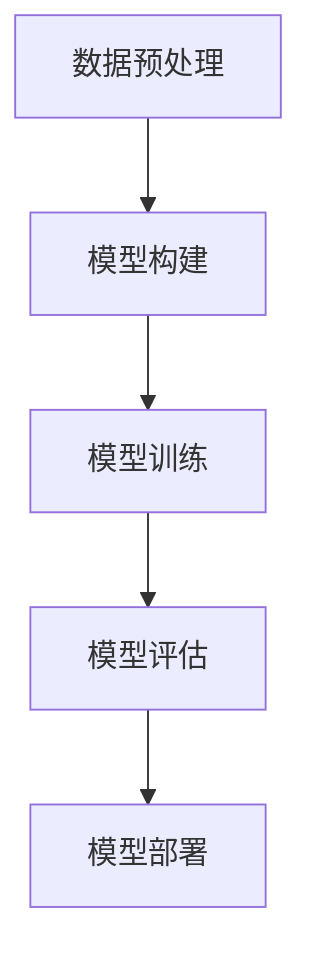

# AI人工智能深度学习算法：设计深度学习任务处理流程

## 1.背景介绍

### 1.1 深度学习的兴起

深度学习作为人工智能的一个重要分支，近年来取得了显著的进展。其在图像识别、自然语言处理、语音识别等领域的成功应用，使得深度学习成为了学术界和工业界的研究热点。深度学习的核心在于通过多层神经网络对数据进行特征提取和模式识别，从而实现复杂任务的自动化处理。

### 1.2 深度学习任务处理流程的重要性

设计一个高效的深度学习任务处理流程，对于提升模型的性能和应用的效果至关重要。一个完善的处理流程不仅能够提高模型的准确性，还能减少训练时间和资源消耗。因此，理解和掌握深度学习任务处理流程的设计方法，对于从事人工智能研究和应用的人员来说，是一项必备的技能。

### 1.3 文章目标

本文旨在详细介绍深度学习任务处理流程的设计方法，涵盖核心概念、算法原理、数学模型、项目实践、实际应用场景、工具和资源推荐等内容。通过本文的学习，读者将能够系统地掌握深度学习任务处理流程的设计方法，并应用于实际项目中。

## 2.核心概念与联系

### 2.1 深度学习的基本概念

深度学习是一种基于人工神经网络的机器学习方法，其特点是通过多层网络结构对数据进行逐层抽象和特征提取。深度学习的基本单元是神经元，每个神经元通过权重和偏置对输入数据进行线性变换，并通过激活函数引入非线性。

### 2.2 神经网络的层次结构

神经网络通常由输入层、隐藏层和输出层组成。输入层接收原始数据，隐藏层通过多层神经元对数据进行特征提取，输出层生成最终的预测结果。隐藏层的层数和每层的神经元数量是影响模型性能的重要参数。

### 2.3 训练和优化

深度学习模型的训练过程是通过反向传播算法对网络参数进行优化，使得模型在训练数据上的预测误差最小化。常用的优化算法包括梯度下降、Adam等。训练过程中需要设置学习率、批量大小等超参数，这些参数对模型的收敛速度和最终性能有重要影响。

### 2.4 损失函数

损失函数用于衡量模型预测结果与真实标签之间的差异，是模型优化的目标。常用的损失函数包括均方误差（MSE）、交叉熵损失等。选择合适的损失函数对于模型的训练效果至关重要。

### 2.5 评估指标

评估指标用于衡量模型在测试数据上的表现，常用的评估指标包括准确率、精确率、召回率、F1-score等。不同任务需要选择不同的评估指标，以全面评估模型的性能。

## 3.核心算法原理具体操作步骤

### 3.1 数据预处理

数据预处理是深度学习任务处理流程的第一步，主要包括数据清洗、数据增强、数据标准化等步骤。数据清洗是去除数据中的噪声和异常值，数据增强是通过旋转、翻转、缩放等操作增加数据的多样性，数据标准化是将数据转换为均值为0、方差为1的标准正态分布。

### 3.2 模型构建

模型构建是根据任务需求设计神经网络的结构，包括选择网络层数、每层神经元数量、激活函数等。常用的网络结构包括卷积神经网络（CNN）、循环神经网络（RNN）、生成对抗网络（GAN）等。

### 3.3 模型训练

模型训练是通过反向传播算法对网络参数进行优化，使得模型在训练数据上的预测误差最小化。训练过程中需要设置学习率、批量大小等超参数，并通过交叉验证选择最优参数。

### 3.4 模型评估

模型评估是通过测试数据衡量模型的性能，常用的评估指标包括准确率、精确率、召回率、F1-score等。评估结果用于判断模型的泛化能力和实际应用效果。

### 3.5 模型部署

模型部署是将训练好的模型应用于实际任务中，包括模型的保存、加载、推理等步骤。常用的部署工具包括TensorFlow Serving、ONNX等。



## 4.数学模型和公式详细讲解举例说明

### 4.1 神经网络的数学模型

神经网络的基本单元是神经元，每个神经元通过权重和偏置对输入数据进行线性变换，并通过激活函数引入非线性。假设输入数据为 $x$，权重为 $w$，偏置为 $b$，激活函数为 $f$，则神经元的输出为：

$$
y = f(w \cdot x + b)
$$

### 4.2 反向传播算法

反向传播算法用于计算网络参数的梯度，并通过梯度下降法对参数进行更新。假设损失函数为 $L$，网络参数为 $\theta$，则参数的更新公式为：

$$
\theta = \theta - \eta \frac{\partial L}{\partial \theta}
$$

其中，$\eta$ 为学习率，$\frac{\partial L}{\partial \theta}$ 为损失函数对参数的梯度。

### 4.3 卷积神经网络

卷积神经网络（CNN）通过卷积层对输入数据进行特征提取，卷积层的输出为输入数据与卷积核的卷积结果。假设输入数据为 $x$，卷积核为 $w$，则卷积层的输出为：

$$
y = x * w
$$

### 4.4 循环神经网络

循环神经网络（RNN）通过循环结构对序列数据进行建模，隐藏状态 $h_t$ 的更新公式为：

$$
h_t = f(W_h h_{t-1} + W_x x_t + b)
$$

其中，$W_h$ 和 $W_x$ 为权重矩阵，$b$ 为偏置，$f$ 为激活函数。

### 4.5 生成对抗网络

生成对抗网络（GAN）由生成器和判别器组成，生成器通过随机噪声生成样本，判别器用于判断样本的真假。生成器的目标是最大化判别器的误差，判别器的目标是最小化误差。生成器和判别器的损失函数分别为：

$$
L_G = -\log(D(G(z)))
$$

$$
L_D = -\log(D(x)) - \log(1 - D(G(z)))
$$

其中，$G$ 为生成器，$D$ 为判别器，$z$ 为随机噪声，$x$ 为真实样本。

## 5.项目实践：代码实例和详细解释说明

### 5.1 数据预处理

以下是一个简单的图像数据预处理示例，使用Python和OpenCV库：

```python
import cv2
import numpy as np

# 读取图像
image = cv2.imread('image.jpg')

# 转换为灰度图像
gray_image = cv2.cvtColor(image, cv2.COLOR_BGR2GRAY)

# 图像标准化
normalized_image = gray_image / 255.0

# 图像增强：旋转
rows, cols = normalized_image.shape
M = cv2.getRotationMatrix2D((cols/2, rows/2), 45, 1)
rotated_image = cv2.warpAffine(normalized_image, M, (cols, rows))

# 显示处理后的图像
cv2.imshow('Processed Image', rotated_image)
cv2.waitKey(0)
cv2.destroyAllWindows()
```

### 5.2 模型构建

以下是一个简单的卷积神经网络（CNN）模型构建示例，使用Keras库：

```python
from keras.models import Sequential
from keras.layers import Conv2D, MaxPooling2D, Flatten, Dense

# 构建模型
model = Sequential()

# 添加卷积层
model.add(Conv2D(32, (3, 3), activation='relu', input_shape=(64, 64, 1)))
model.add(MaxPooling2D(pool_size=(2, 2)))

# 添加全连接层
model.add(Flatten())
model.add(Dense(128, activation='relu'))
model.add(Dense(10, activation='softmax'))

# 编译模型
model.compile(optimizer='adam', loss='categorical_crossentropy', metrics=['accuracy'])
```

### 5.3 模型训练

以下是模型训练的示例代码：

```python
from keras.preprocessing.image import ImageDataGenerator

# 数据生成器
train_datagen = ImageDataGenerator(rescale=1./255)
train_generator = train_datagen.flow_from_directory('data/train', target_size=(64, 64), batch_size=32, class_mode='categorical')

# 训练模型
model.fit(train_generator, steps_per_epoch=8000, epochs=10, validation_data=validation_generator, validation_steps=2000)
```

### 5.4 模型评估

以下是模型评估的示例代码：

```python
# 评估模型
loss, accuracy = model.evaluate(validation_generator)
print(f'Validation Loss: {loss}')
print(f'Validation Accuracy: {accuracy}')
```

### 5.5 模型部署

以下是模型部署的示例代码，使用TensorFlow Serving：

```bash
# 保存模型
model.save('my_model.h5')

# 启动TensorFlow Serving
docker run -p 8501:8501 --name=tf_serving -v "$(pwd)/my_model:/models/my_model" -e MODEL_NAME=my_model -t tensorflow/serving
```

## 6.实际应用场景

### 6.1 图像识别

深度学习在图像识别领域取得了显著的成功，常用于人脸识别、物体检测、图像分类等任务。例如，卷积神经网络（CNN）在ImageNet图像分类比赛中取得了优异的成绩，推动了图像识别技术的发展。

### 6.2 自然语言处理

深度学习在自然语言处理领域也有广泛的应用，包括机器翻译、情感分析、文本生成等任务。循环神经网络（RNN）和变换器（Transformer）是常用的模型结构，能够有效地处理序列数据。

### 6.3 语音识别

深度学习在语音识别领域的应用主要包括语音转文字、语音合成等任务。长短期记忆网络（LSTM）和卷积神经网络（CNN）是常用的模型结构，能够有效地处理语音信号。

### 6.4 自动驾驶

深度学习在自动驾驶领域的应用主要包括环境感知、路径规划、决策控制等任务。卷积神经网络（CNN）和生成对抗网络（GAN）是常用的模型结构，能够有效地处理图像和视频数据。

### 6.5 医疗诊断

深度学习在医疗诊断领域的应用主要包括医学影像分析、疾病预测等任务。卷积神经网络（CNN）和循环神经网络（RNN）是常用的模型结构，能够有效地处理医学图像和时间序列数据。

## 7.工具和资源推荐

### 7.1 深度学习框架

- TensorFlow：谷歌开发的开源深度学习框架，支持多种平台和设备，具有丰富的社区资源和文档。
- PyTorch：Facebook开发的开源深度学习框架，具有动态计算图和易于调试的特点，广泛应用于学术研究和工业界。
- Keras：基于TensorFlow的高级神经网络API，简化了深度学习模型的构建和训练过程，适合快速原型开发。

### 7.2 数据集

- ImageNet：包含超过1400万张标注图像的图像分类数据集，是图像识别领域的重要基准数据集。
- COCO：包含超过20万张图像和250万标注的物体检测、分割和关键点检测数据集，广泛应用于计算机视觉研究。
- MNIST：包含6万张手写数字图像的图像分类数据集，是深度学习入门的经典数据集。

### 7.3 开发工具

- Jupyter Notebook：交互式计算环境，支持Python代码的编写、运行和可视化，适合深度学习模型的开发和调试。
- Google Colab：基于云的Jupyter Notebook环境，提供免费的GPU和TPU资源，适合深度学习模型的训练和实验。
- VS Code：微软开发的开源代码编辑器，具有丰富的插件和扩展，支持多种编程语言和开发环境。

## 8.总结：未来发展趋势与挑战

### 8.1 未来发展趋势

深度学习作为人工智能的重要分支，未来的发展趋势主要包括以下几个方面：

- 模型结构的创新：随着研究的深入，新的模型结构不断涌现，如变换器（Transformer）、图神经网络（GNN）等，能够更好地处理复杂任务。
- 训练方法的改进：新的训练方法和优化算法不断提出，如自监督学习、元学习等，能够提高模型的训练效率和性能。
- 应用领域的拓展：深度学习的应用领域不断拓展，如金融、教育、娱乐等，能够解决更多实际问题。

### 8.2 面临的挑战

尽管深度学习取得了显著的进展，但仍面临一些挑战：

- 数据需求：深度学习模型的训练需要大量标注数据，数据获取和标注成本较高。
- 计算资源：深度学习模型的训练需要大量计算资源，特别是大规模模型的训练，对硬件设备和计算能力要求较高。
- 模型解释性：深度学习模型的黑箱特性使得其决策过程难以解释，影响了其在某些领域的应用。

## 9.附录：常见问题与解答

### 9.1 深度学习模型过拟合怎么办？

过拟合是指模型在训练数据上表现良好，但在测试数据上表现较差。解决过拟合的方法包括：

- 增加数据量：通过数据增强、获取更多标注数据等方法增加数据量，提升模型的泛化能力。
- 正则化：通过L1、L2正则化、Dropout等方法对模型进行正则化，防止模型过拟合。
- 简化模型：通过减少网络层数、神经元数量等方法简化模型，降低模型的复杂度。

### 9.2 如何选择合适的激活函数？

激活函数用于引入非线性，常用的激活函数包括ReLU、Sigmoid、Tanh等。选择激活函数的方法包括：

- ReLU：适用于大多数深度学习模型，具有计算简单、收敛速度快的特点。
- Sigmoid：适用于输出为概率的任务，如二分类任务，但容易出现梯度消失问题。
- Tanh：适用于需要输出为零均值的任务，但计算复杂度较高。

### 9.3 如何提高模型的训练速度？

提高模型训练速度的方法包括：

- 使用GPU/TPU：通过使用GPU/TPU等硬件加速设备，提高模型的训练速度。
- 数据并行：通过数据并行的方法，将数据分批次输入模型，进行并行计算，提高训练效率。
- 模型并行：通过模型并行的方法，将模型分割成多个部分，进行并行计算，提高训练效率。

### 9.4 如何选择合适的优化算法？

优化算法用于对模型参数进行更新，常用的优化算法包括梯度下降、Adam等。选择优化算法的方法包括：

- 梯度下降：适用于大多数深度学习模型，具有计算简单、收敛速度快的特点。
- Adam：适用于需要自适应学习率的任务，具有收敛速度快、稳定性高的特点。

### 9.5 如何评估模型的性能？

评估模型性能的方法包括：

- 交叉验证：通过将数据集划分为训练集和验证集，进行多次训练和验证，评估模型的性能。
- 测试集评估：通过在测试集上评估模型的性能，衡量模型的泛化能力。
- 评估指标：通过准确率、精确率、召回率、F1-score等评估指标，全面评估模型的性能。

---

作者：禅与计算机程序设计艺术 / Zen and the Art of Computer Programming