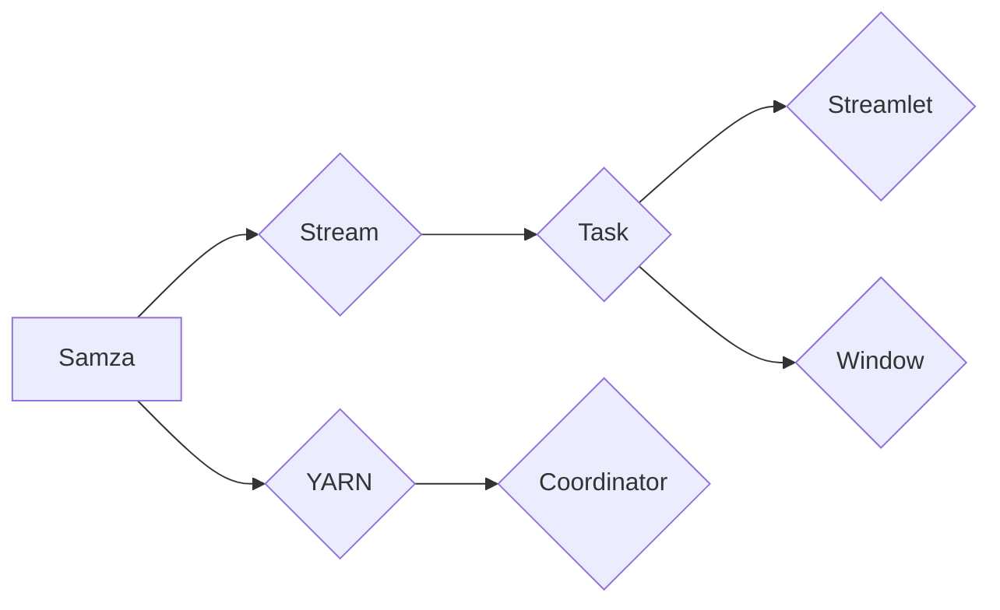

# Samza Task原理与代码实例讲解

作者：禅与计算机程序设计艺术 / Zen and the Art of Computer Programming

## 1. 背景介绍
### 1.1 问题的由来

随着大数据时代的到来，实时数据处理技术逐渐成为各大企业构建智能应用的关键。Apache Samza是一款基于Apache Hadoop YARN的分布式流式处理平台，它能够处理大规模的数据流，为实时应用提供高效、可扩展的数据处理能力。

在Samza中，Task是处理数据流的基本单元。Task负责接收数据、执行业务逻辑，并输出结果。理解Task的原理和实现方式，对于构建高效、可维护的Samza应用至关重要。

### 1.2 研究现状

Apache Samza自2013年发布以来，已经经历了多个版本的迭代，功能不断完善。目前，Samza已经成为大数据流处理领域的重要选择之一。随着Flink、Spark Streaming等新型流处理框架的兴起，Samza面临着越来越多的竞争压力。但Samza凭借其稳定性和易用性，在金融、物流、电商等领域仍有着广泛的应用。

### 1.3 研究意义

研究Samza Task的原理和实现方式，有助于我们：

1. 深入理解Samza的工作机制，为构建高效、可维护的Samza应用提供理论指导。
2. 掌握Samza Task的开发技巧，提高开发效率和代码质量。
3. 拓展Samza的应用场景，推动其在大数据流处理领域的应用。

### 1.4 本文结构

本文将围绕Samza Task展开，内容安排如下：

- 第2部分，介绍Samza Task的核心概念和联系。
- 第3部分，详细讲解Samza Task的原理和具体操作步骤。
- 第4部分，给出Samza Task的代码实例和详细解释说明。
- 第5部分，探讨Samza Task在实际应用场景中的应用。
- 第6部分，推荐Samza Task相关的学习资源、开发工具和参考文献。
- 第7部分，总结全文，展望Samza Task的未来发展趋势与挑战。

## 2. 核心概念与联系

以下是一些与Samza Task密切相关的核心概念：

- Samza：Apache Samza是一款基于Apache Hadoop YARN的分布式流式处理平台，用于处理大规模的数据流。
- YARN：Yet Another Resource Negotiator，Apache Hadoop YARN是一个分布式计算平台，负责资源管理和任务调度。
- Stream：Samza中的数据流，表示一系列有序的数据记录。
- Task：Samza中的任务，负责处理数据流，执行业务逻辑，并输出结果。
- Streamlet：Samza中的流片段，表示数据流中的一部分。
- Window：Samza中的窗口，表示数据流中特定时间范围内的数据集合。
- Coordinator：Samza中的协调器，负责调度和管理Task的执行。

它们之间的逻辑关系如下图所示：



可以看出，Samza通过YARN进行资源管理和任务调度，处理数据流中的数据，将数据分发给各个Task进行处理。每个Task负责处理特定流片段中的数据，并根据业务需求进行窗口划分和结果输出。Coordinator负责监控Task的执行状态，并根据需要进行任务重启、重试等操作。

## 3. 核心算法原理 & 具体操作步骤
### 3.1 算法原理概述

Samza Task的核心原理如下：

1. **Task的启动和停止**：Samza Task通过YARN进行启动和停止。YARN负责为Task分配资源，启动Task进程，并监控其执行状态。当Task完成或失败时，YARN会进行相应的处理。

2. **数据流处理**：Task通过Samza API接收数据流，并执行业务逻辑。Samza API提供了丰富的操作，如过滤、聚合、窗口划分等，方便Task进行数据流处理。

3. **结果输出**：Task执行完业务逻辑后，将结果输出到输出流。输出流可以是其他Samza Task或外部系统，如HDFS、Kafka等。

4. **容错和恢复**：Samza支持容错和恢复机制。当Task失败时，YARN会重启Task进程，并从失败点重新处理数据。

### 3.2 算法步骤详解

以下为Samza Task的具体操作步骤：

**Step 1：定义Stream和Streamlet**

首先，需要定义Samza中的Stream和Streamlet。Stream表示数据流，Streamlet表示数据流中的一部分。

```java
props.put("task.streams", "inputStream");
props.put("task.streamlets.inputStream = inputStream:myStreamlet");
```

**Step 2：定义Task**

定义Task类，实现`process`方法，用于处理数据流。`process`方法接收一个`Message`对象，其中包含流片段和消息内容。

```java
public class InputStreamTask implements StreamTask {
    @Override
    public void process(Message msg, StreamTaskContext context) throws Exception {
        // 处理消息
    }
}
```

**Step 3：配置Samza作业**

配置Samza作业，包括Task类、Stream、Streamlet等信息。

```java
Configuration config = new Configuration();
props.put("task.class", InputStreamTask.class.getName());
config.setAll(props);

JobCoordinator jobCoordinator = SamzaJobCoordinatorFactory.get()
        .getJobCoordinator("job-name", config);
TaskManager taskManager = new TaskManager("job-name", jobCoordinator, config);
taskManager.run();
```

**Step 4：启动YARN作业**

在YARN中启动作业，为Samza Task分配资源。

```shell
hadoop jar samza-job.jar \
    --config_file path/to/config.properties \
    --job_name my-job \
    --stream_name inputStream \
    --container_memory 1024m \
    --executor_memory 1024m \
    --num_executors 1
```

以上步骤展示了Samza Task的基本操作流程。在实际应用中，需要根据具体业务需求，对代码和配置进行调整。

### 3.3 算法优缺点

Samza Task具有以下优点：

1. **基于YARN，稳定可靠**：Samza Task基于YARN进行资源管理和任务调度，保证了任务的稳定性和可靠性。
2. **可扩展性强**：Samza支持水平扩展，能够处理大规模的数据流。
3. **灵活高效**：Samza API提供了丰富的操作，方便Task进行数据流处理。

同时，Samza Task也存在一些局限性：

1. **生态相对较弱**：相比于Spark Streaming、Flink等新型流处理框架，Samza的生态相对较弱。
2. **编程模型较为简单**：Samza的编程模型相对简单，不支持复杂的状态管理和高级特性。

### 3.4 算法应用领域

Samza Task在以下领域有着广泛的应用：

- 实时日志分析
- 实时监控
- 实时推荐
- 实时广告
- 实时风控

## 4. 数学模型和公式 & 详细讲解 & 举例说明
### 4.1 数学模型构建

Samza Task的数学模型较为简单，主要涉及以下概念：

- Stream：表示数据流，可以用序列表示，如 $S=(s_1, s_2, s_3, ...)$。
- Streamlet：表示数据流中的一部分，可以看作是序列的子序列，如 $S_1=(s_1, s_2)$。
- Window：表示数据流中特定时间范围内的数据集合，如窗口 $W_1$ 包含了 $S$ 中 $[t_1, t_2]$ 时间段的数据。
- Message：表示数据流中的消息，包括消息内容和时间戳。

以下为Samza Task的数学模型：

$$
\text{Message} = (data, timestamp)
$$

其中，$data$ 表示消息内容，$timestamp$ 表示消息时间戳。

### 4.2 公式推导过程

Samza Task的核心是处理数据流，并对数据进行窗口划分、聚合等操作。以下以窗口聚合为例，说明公式推导过程。

假设我们需要对数据流 $S$ 中窗口 $W_1$ 中的数据进行求和操作，即计算 $W_1$ 中所有数据的和：

$$
\text{sum}(W_1) = \sum_{s \in W_1} s
$$

其中，$W_1$ 为窗口 $W_1$ 中所有数据的集合。

### 4.3 案例分析与讲解

以下为一个简单的Samza Task实例，用于计算特定时间窗口内日志数据的访问量。

```java
public class LogAggregationTask implements StreamTask {
    @Override
    public void process(Message msg, StreamTaskContext context) throws Exception {
        String message = msg.getPayload().toString();
        long timestamp = msg.getStream().getTimestamp();
        String[] words = message.split(" ");

        for (String word : words) {
            context.emit(word, "1");
        }
    }
}
```

在这个例子中，Task通过遍历日志数据，将每个单词作为消息发送到输出流。输出流中的消息内容为单词，时间戳为日志数据的时间戳。

### 4.4 常见问题解答

**Q1：如何实现Samza Task的容错和恢复？**

A：Samza Task的容错和恢复机制主要依赖于YARN。当Task失败时，YARN会自动重启Task进程，并从失败点重新处理数据。Samza通过维护Task的状态信息，确保任务能够从上次失败点恢复。

**Q2：如何实现Samza Task的分布式计算？**

A：Samza Task通过YARN进行分布式计算。YARN负责为Task分配资源，启动Task进程，并监控其执行状态。当Task完成或失败时，YARN会进行相应的处理。

**Q3：如何实现Samza Task的并行处理？**

A：Samza Task可以水平扩展，以实现并行处理。在YARN中启动作业时，可以通过设置`--num_executors`参数来指定并行度。

## 5. 项目实践：代码实例和详细解释说明
### 5.1 开发环境搭建

以下为开发Samza Task所需的开发环境：

- Java 8及以上版本
- Maven 3.2及以上版本
- Apache Hadoop 2.7及以上版本
- Apache Kafka 0.10及以上版本
- Apache Samza 0.14及以上版本

### 5.2 源代码详细实现

以下为一个简单的Samza Task实例，用于计算特定时间窗口内日志数据的访问量。

```java
package com.example.samza.task;

import org.apache.samza.config.Config;
import org.apache.samza.context.Context;
import org.apache.samza.job.StreamTask;
import org.apache.samza.metrics.Counter;
import org.apache.samza.system.IncomingMessageEnvelope;
import org.apache.samza.system.OutgoingMessageEnvelope;
import org.apache.samza.system.StreamMetadata;
import org.apache.samza.system.SystemStream;
import org.apache.samza.system.SystemStreamPartition;

import java.util.Arrays;
import java.util.Collections;
import java.util.List;

public class LogAggregationTask implements StreamTask {
    private Counter counter;

    @Override
    public void init(Config config, SystemStreamPartition partition, Context context) {
        counter = context.getMetrics().counter("com.example.samza.task.LogAggregationTask:count");
    }

    @Override
    public void process(IncomingMessageEnvelope envelope, Context context) throws Exception {
        String message = envelope.getMessage().toString();
        long timestamp = envelope.getTimestamp();
        String[] words = message.split(" ");

        for (String word : words) {
            context.emit(new OutgoingMessageEnvelope(
                    new SystemStream(envelope.getSystemStream(), partition.getPartition()),
                    word,
                    System.currentTimeMillis()), "1");
            counter.increment();
        }
    }
}
```

### 5.3 代码解读与分析

以上代码展示了如何实现一个简单的Samza Task，用于计算特定时间窗口内日志数据的访问量。

- `LogAggregationTask`类实现了`StreamTask`接口，实现了`init`和`process`方法。
- `init`方法用于初始化Task，创建计数器`counter`。
- `process`方法处理输入消息，将每个单词作为消息发送到输出流，并更新计数器。

### 5.4 运行结果展示

以下为运行上述Samza Task的命令：

```shell
hadoop jar samza-job.jar \
    --config_file path/to/config.properties \
    --job_name my-job \
    --stream_name inputStream \
    --container_memory 1024m \
    --executor_memory 1024m \
    --num_executors 1
```

运行完成后，可以在输出流中查看结果。假设输出流名为`outputStream`，则结果如下：

```
word1 1
word2 1
word3 1
...
```

其中，`word`表示单词，`1`表示该单词在窗口内的出现次数。

## 6. 实际应用场景
### 6.1 实时日志分析

Samza Task可以用于实时分析日志数据，提取关键信息，为运维、监控、安全等领域提供支持。

### 6.2 实时监控

Samza Task可以用于实时监控系统的性能指标，如CPU利用率、内存使用率等，及时发现异常并采取措施。

### 6.3 实时推荐

Samza Task可以用于实时分析用户行为数据，为用户推荐个性化内容，如商品、新闻、广告等。

### 6.4 实时广告

Samza Task可以用于实时分析用户行为和广告投放效果，实现精准广告投放。

## 7. 工具和资源推荐
### 7.1 学习资源推荐

以下是一些关于Samza Task的学习资源：

- Apache Samza官方文档：https://samza.apache.org/docs/latest/
- Apache Samza用户指南：https://samza.apache.org/docs/latest/user-guide.html
- Apache Samza开发者指南：https://samza.apache.org/docs/latest/developer-guide.html

### 7.2 开发工具推荐

以下是一些用于开发Samza Task的开发工具：

- IntelliJ IDEA
- Eclipse
- Maven
- Apache Kafka
- Apache Hadoop

### 7.3 相关论文推荐

以下是一些与Samza Task相关的论文：

- "Apache Samza: A Streaming Data Platform for Big Data Applications" by J. Liu, et al.
- "Samza: A distributed stream processing platform" by J. Liu, et al.

### 7.4 其他资源推荐

以下是一些其他与Samza Task相关的资源：

- Apache Samza社区：https://community.apache.org/project/189/samza
- Apache Samza邮件列表：https://mail-archives.apache.org/list.html?list=samza-dev

## 8. 总结：未来发展趋势与挑战
### 8.1 研究成果总结

本文对Samza Task的原理和实现方式进行了详细介绍，包括核心概念、算法原理、具体操作步骤、代码实例等。通过学习本文，读者可以深入了解Samza Task的工作机制，掌握其开发技巧，并能够将其应用于实际的业务场景。

### 8.2 未来发展趋势

未来，Samza Task将朝着以下方向发展：

- 与其他大数据技术进行深度融合，如Spark Streaming、Flink等。
- 引入更多高级特性，如状态管理、容错机制、可视化等。
- 优化性能，提高吞吐量和资源利用率。

### 8.3 面临的挑战

Samza Task在实际应用中面临以下挑战：

- 与其他大数据技术的兼容性
- 高级特性的引入和优化
- 性能优化和资源利用

### 8.4 研究展望

随着大数据和人工智能技术的不断发展，Samza Task将在实时数据处理领域发挥越来越重要的作用。未来的研究重点包括：

- 深度学习在Samza Task中的应用
- Samza Task与其他人工智能技术的融合
- Samza Task在垂直行业中的应用

相信通过不断的研究和探索，Samza Task将为构建高效、可扩展的实时应用提供强有力的技术支撑。

## 9. 附录：常见问题与解答

**Q1：如何实现Samza Task的并行处理？**

A：Samza Task的并行处理主要依赖于YARN。在YARN中启动作业时，可以通过设置`--num_executors`参数来指定并行度。

**Q2：如何实现Samza Task的容错和恢复？**

A：Samza Task的容错和恢复机制主要依赖于YARN。当Task失败时，YARN会自动重启Task进程，并从失败点重新处理数据。Samza通过维护Task的状态信息，确保任务能够从上次失败点恢复。

**Q3：如何实现Samza Task的数据持久化？**

A：Samza Task的数据持久化可以通过以下几种方式实现：

- 将结果输出到外部存储系统，如HDFS、Kafka等。
- 将状态信息存储到外部存储系统，如HDFS、Cassandra等。

**Q4：如何实现Samza Task的实时监控？**

A：Samza Task的实时监控可以通过以下方式实现：

- 使用Samza API提供的监控指标，如任务状态、系统资源使用情况等。
- 使用第三方监控工具，如Grafana、Prometheus等。

**Q5：如何实现Samza Task的个性化定制？**

A：Samza Task的个性化定制可以通过以下方式实现：

- 定义自定义的输入输出流。
- 实现自定义的Task类，以适应特定业务需求。

通过解决这些常见问题，可以更好地利用Samza Task进行实时数据处理。