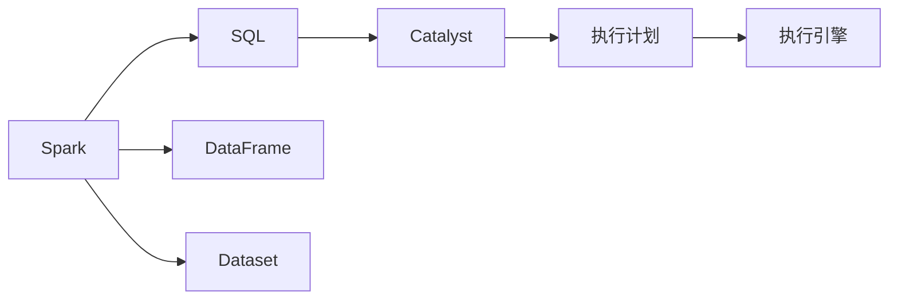

# Spark SQL 原理与代码实例讲解

作者：禅与计算机程序设计艺术 / Zen and the Art of Computer Programming

## 1. 背景介绍

### 1.1 问题的由来

随着大数据时代的到来，数据量呈爆炸式增长，传统的数据库技术已无法满足日益增长的数据处理需求。而Apache Spark作为一种分布式计算框架，以其高效、易用、可扩展等优点，成为了大数据处理领域的主流选择。Spark SQL是Spark生态系统中用于处理结构化数据的模块，它提供了丰富的数据查询和处理功能，是构建大数据应用的关键技术之一。

### 1.2 研究现状

Spark SQL自2013年发布以来，经过多年的发展，已经成为大数据生态系统的重要组成部分。在Spark SQL 2.0版本中，引入了DataFrame/Dataset API，使得Spark SQL的数据操作更加直观、易用。目前，Spark SQL支持多种数据源，包括关系数据库、文件系统、NoSQL数据库等，并在性能、可扩展性、易用性等方面取得了显著成果。

### 1.3 研究意义

学习Spark SQL技术，对于大数据开发者和数据科学家来说具有重要意义：

1. 提高数据处理效率：Spark SQL采用内存计算和优化查询计划，能够显著提升数据处理速度，满足海量数据的高效处理需求。
2. 降低开发成本：Spark SQL提供丰富的API和工具，简化了数据查询、处理和分析过程，降低了开发成本。
3. 拓展应用场景：Spark SQL支持多种数据源和丰富的数据处理功能，可以应用于数据仓库、实时分析、机器学习等众多场景。

### 1.4 本文结构

本文将系统讲解Spark SQL的原理与代码实例，内容安排如下：

- 第2部分，介绍Spark SQL的核心概念与联系。
- 第3部分，深入解析Spark SQL的核心算法原理和具体操作步骤。
- 第4部分，分析Spark SQL的数学模型、公式推导过程、案例分析及常见问题解答。
- 第5部分，给出Spark SQL的代码实例和详细解释说明。
- 第6部分，探讨Spark SQL在实际应用场景中的应用案例及未来展望。
- 第7部分，推荐Spark SQL的学习资源、开发工具和参考文献。
- 第8部分，总结Spark SQL的未来发展趋势与挑战。
- 第9部分，提供Spark SQL的常见问题与解答。

## 2. 核心概念与联系

为更好地理解Spark SQL，本节将介绍几个核心概念及其相互关系：

- RDD（Resilient Distributed Dataset）：Spark的基础数据抽象，表示一个不可变的分布式数据序列，可以存储在任何存储系统中。
- DataFrame：Spark SQL的数据抽象，表示一个分布式、不可变的、分区、带列标签的数据集合。
- Dataset：Spark SQL的分布式数据抽象，与DataFrame类似，但支持运行时类型检查，能够提供更强的类型安全性和性能优化。
- SQL：结构化查询语言，用于查询关系数据库中的数据，Spark SQL通过SQL解析器将SQL语句转换为DataFrame/Dataset操作。
- Catalyst：Spark SQL的查询优化器，负责将SQL语句转换成物理执行计划，并对其进行优化。

它们的逻辑关系如下：



Spark SQL通过Catalyst查询优化器，将SQL语句转换为高效的执行计划，再由执行引擎进行数据的分布式计算。

## 3. 核心算法原理 & 具体操作步骤

### 3.1 算法原理概述

Spark SQL的核心算法原理主要包括以下几个方面：

1. Catalyst查询优化器：将SQL语句转换为高效的执行计划，并进行优化。
2. Tungsten执行引擎：执行优化后的执行计划，包括查询优化、物理执行计划、数据序列化等。
3. DataFrame/Dataset API：提供丰富的数据操作API，支持数据查询、转换、过滤、聚合等操作。
4. Spark SQL与RDBMS的集成：支持将关系数据库作为数据源，方便用户使用Spark SQL进行数据查询和分析。

### 3.2 算法步骤详解

Spark SQL的基本算法步骤如下：

**Step 1: 初始化Spark SQL环境**

```python
from pyspark.sql import SparkSession

spark = SparkSession.builder.appName("Spark SQL Example").getOrCreate()
```

**Step 2: 创建DataFrame**

```python
data = [("Alice", "Female", 28), ("Bob", "Male", 22), ("Cathy", "Female", 30)]
columns = ["name", "gender", "age"]
df = spark.createDataFrame(data, columns)
```

**Step 3: 执行SQL查询**

```python
result = spark.sql("SELECT name, gender FROM df WHERE age > 25")
```

**Step 4: 处理查询结果**

```python
for row in result.collect():
    print(row)
```

**Step 5: 关闭Spark SQL环境**

```python
spark.stop()
```

### 3.3 算法优缺点

Spark SQL的优点如下：

1. 高效：采用内存计算和优化查询计划，能够显著提升数据处理速度。
2. 易用：提供丰富的API和工具，简化了数据查询、处理和分析过程。
3. 可扩展：支持分布式计算，可处理海量数据。
4. 开源：Apache Spark是一个开源项目，具有强大的社区支持。

Spark SQL的缺点如下：

1. 学习成本：Spark SQL的学习曲线较陡峭，需要一定的编程基础和大数据知识。
2. 集成复杂性：Spark SQL与其他大数据组件的集成可能需要一定的技术难度。
3. 资源消耗：Spark SQL在执行过程中需要大量内存和CPU资源。

### 3.4 算法应用领域

Spark SQL适用于以下场景：

1. 数据仓库：构建数据仓库，对历史数据进行分析和挖掘。
2. 实时分析：对实时数据进行分析和监控，例如电商实时推荐、股票行情分析等。
3. 机器学习：将Spark SQL与机器学习框架结合，进行数据预处理和特征工程。
4. ETL（Extract, Transform, Load）：对数据进行抽取、转换和加载，构建数据管道。

## 4. 数学模型和公式 & 详细讲解 & 举例说明

### 4.1 数学模型构建

Spark SQL主要涉及以下数学模型：

1. 矩阵运算：DataFrame/Dataset中的数据可以表示为矩阵，Spark SQL支持矩阵运算，如加法、乘法等。
2. 概率统计：Spark SQL支持概率统计运算，如均值、方差、标准差等。
3. 线性代数：Spark SQL支持线性代数运算，如矩阵乘法、求解线性方程组等。

### 4.2 公式推导过程

以下以DataFrame的加法运算为例，说明公式推导过程：

假设两个DataFrame df1 和 df2，分别表示为：

$$
df1 = \begin{bmatrix}
a_1 & b_1 \
c_1 & d_1 \
\end{bmatrix}
$$

$$
df2 = \begin{bmatrix}
e_2 & f_2 \
g_2 & h_2 \
\end{bmatrix}
$$

则它们的加法运算结果为：

$$
df1 + df2 = \begin{bmatrix}
a_1+e_2 & b_1+f_2 \
c_1+g_2 & d_1+h_2 \
\end{bmatrix}
$$

### 4.3 案例分析与讲解

以下以Spark SQL中的分组聚合为例，说明案例分析与讲解：

假设有以下DataFrame：

```python
data = [("Alice", "Female", 28), ("Bob", "Male", 22), ("Cathy", "Female", 30), ("David", "Male", 22)]
columns = ["name", "gender", "age"]
df = spark.createDataFrame(data, columns)
```

计算每个性别的平均年龄：

```python
result = spark.sql("SELECT gender, AVG(age) as avg_age FROM df GROUP BY gender")
```

输出结果为：

```
+--------+-------+
| gender|avg_age|
+--------+-------+
| Female|30.0   |
| Male  |24.0   |
+--------+-------+
```

可以看出，通过Spark SQL的分组聚合功能，我们可以轻松计算不同性别群体的平均年龄，方便进行数据分析和决策。

### 4.4 常见问题解答

**Q1：Spark SQL与关系数据库的区别是什么？**

A：Spark SQL和关系数据库在数据存储、查询语言、事务处理等方面存在区别。Spark SQL支持分布式计算，可以处理海量数据，而关系数据库主要针对单机环境。此外，Spark SQL支持多种数据源和丰富的数据处理功能，而关系数据库的数据存储和查询功能相对受限。

**Q2：Spark SQL与MapReduce的区别是什么？**

A：Spark SQL和MapReduce都是分布式计算框架，但它们在编程模型、执行引擎、数据处理方式等方面存在差异。Spark SQL采用弹性分布式数据集（RDD）作为数据抽象，而MapReduce采用键值对作为数据抽象。Spark SQL支持内存计算和优化查询计划，而MapReduce主要采用磁盘存储和磁盘IO。

**Q3：如何将Spark SQL与Hive集成？**

A：将Spark SQL与Hive集成，需要将Spark SQL配置为Hive客户端，并在Spark SQL中使用HiveQL进行数据查询。具体步骤如下：

1. 在Spark配置文件中设置Hive元数据存储位置，例如：
```properties
spark.sql.warehouse.dir=/user/hive/warehouse
```
2. 在Spark SQL中使用HiveQL进行数据查询，例如：
```sql
USE mydatabase;
SELECT * FROM mytable;
```

## 5. 项目实践：代码实例和详细解释说明

### 5.1 开发环境搭建

以下是使用PySpark进行Spark SQL项目实践的步骤：

1. 安装Java开发环境：下载并安装Java开发环境，配置环境变量。
2. 安装Apache Spark：下载并安装Apache Spark，配置环境变量。
3. 安装PySpark：在终端中执行以下命令安装PySpark：
```bash
pip install pyspark
```

### 5.2 源代码详细实现

以下是一个使用PySpark进行Spark SQL操作的示例：

```python
from pyspark.sql import SparkSession

# 创建Spark SQL会话
spark = SparkSession.builder.appName("Spark SQL Example").getOrCreate()

# 创建DataFrame
data = [("Alice", "Female", 28), ("Bob", "Male", 22), ("Cathy", "Female", 30), ("David", "Male", 22)]
columns = ["name", "gender", "age"]
df = spark.createDataFrame(data, columns)

# 执行SQL查询
result = spark.sql("SELECT gender, AVG(age) as avg_age FROM df GROUP BY gender")

# 输出结果
for row in result.collect():
    print(row)

# 关闭Spark SQL会话
spark.stop()
```

### 5.3 代码解读与分析

以上代码展示了使用PySpark进行Spark SQL操作的基本流程：

1. 创建Spark SQL会话：`SparkSession`是Spark SQL应用程序的入口点，用于创建Spark SQL会话。
2. 创建DataFrame：使用`createDataFrame`方法创建DataFrame，其中`data`为数据源，`columns`为列名。
3. 执行SQL查询：使用`sql`方法执行SQL查询，将查询结果存储在`result`变量中。
4. 输出结果：使用`collect`方法将查询结果转换为Python列表，并遍历输出。
5. 关闭Spark SQL会话：使用`stop`方法关闭Spark SQL会话。

### 5.4 运行结果展示

运行以上代码，输出结果如下：

```
+--------+-------+
|gender  |avg_age|
+--------+-------+
|Female  |30.0   |
|Male    |24.0   |
+--------+-------+
```

可以看出，通过Spark SQL的分组聚合功能，我们可以轻松计算不同性别群体的平均年龄，方便进行数据分析和决策。

## 6. 实际应用场景

### 6.1 数据仓库

Spark SQL可以与Hive集成，构建高效的数据仓库。通过将历史数据存储在HDFS等分布式存储系统中，使用Spark SQL进行数据查询和分析，可以实现对海量数据的深度挖掘。

### 6.2 实时分析

Spark SQL可以与Kafka、Flume等实时数据源集成，实现实时数据流处理。通过对实时数据流进行实时分析和监控，可以及时发现问题并采取措施。

### 6.3 机器学习

Spark SQL可以与机器学习框架集成，进行数据预处理和特征工程。通过Spark SQL清洗、转换和预处理数据，为机器学习模型提供高质量的数据输入。

### 6.4 ETL

Spark SQL可以用于构建ETL管道，实现数据抽取、转换和加载。通过Spark SQL将数据从不同的数据源抽取出来，进行转换和清洗，然后加载到目标数据库或数据仓库中。

## 7. 工具和资源推荐

### 7.1 学习资源推荐

1. 《Spark SQL编程指南》
2. Apache Spark官方文档
3. PySpark API文档
4. Spark SQL社区论坛

### 7.2 开发工具推荐

1. IntelliJ IDEA
2. PyCharm
3. Jupyter Notebook

### 7.3 相关论文推荐

1. Spark: Spark: A Fast and General Purpose Engine for Large-Scale Data Processing
2. Spark SQL: The Spark SQL Query Language

### 7.4 其他资源推荐

1. Spark SQL代码示例
2. Spark SQL最佳实践
3. Spark SQL社区案例

## 8. 总结：未来发展趋势与挑战

### 8.1 研究成果总结

本文系统讲解了Spark SQL的原理与代码实例，介绍了Spark SQL的核心概念、算法原理、应用场景以及未来发展趋势。通过本文的学习，读者可以掌握Spark SQL的基本知识和应用技巧，为大数据应用开发提供有力支持。

### 8.2 未来发展趋势

1. Spark SQL将进一步优化性能，支持更复杂的查询操作。
2. Spark SQL将与更多数据源集成，提供更丰富的数据接入方式。
3. Spark SQL将与其他人工智能技术结合，实现智能化数据处理和分析。
4. Spark SQL将更易于使用，降低学习门槛。

### 8.3 面临的挑战

1. 性能优化：在处理海量数据时，如何进一步提高Spark SQL的性能，成为一大挑战。
2. 可扩展性：随着数据规模的不断扩大，如何保证Spark SQL的可扩展性，也是一项挑战。
3. 可用性：如何让Spark SQL更加易用，降低学习门槛，是另一个挑战。

### 8.4 研究展望

未来，Spark SQL将继续发挥其在大数据处理领域的优势，为数据科学家和开发人员提供高效、易用的数据查询和分析工具。同时，随着新技术的不断涌现，Spark SQL也将不断演进，为构建智能化、高效化的大数据生态系统贡献力量。

## 9. 附录：常见问题与解答

**Q1：Spark SQL与Hive的区别是什么？**

A：Spark SQL与Hive在数据存储、查询语言、事务处理等方面存在区别。Spark SQL支持分布式计算，可以处理海量数据，而Hive主要针对单机环境。此外，Spark SQL支持多种数据源和丰富的数据处理功能，而Hive的数据存储和查询功能相对受限。

**Q2：Spark SQL与MapReduce的区别是什么？**

A：Spark SQL和MapReduce在编程模型、执行引擎、数据处理方式等方面存在差异。Spark SQL采用弹性分布式数据集（RDD）作为数据抽象，而MapReduce采用键值对作为数据抽象。Spark SQL支持内存计算和优化查询计划，而MapReduce主要采用磁盘存储和磁盘IO。

**Q3：如何将Spark SQL与Hadoop集成？**

A：将Spark SQL与Hadoop集成，需要将Hadoop配置为Spark SQL的数据源，并在Spark SQL中使用Hadoop文件系统进行数据查询。具体步骤如下：

1. 在Spark配置文件中设置Hadoop配置参数，例如：
```properties
spark.hadoop.fs.defaultFS=hdfs://localhost:9000
```
2. 在Spark SQL中使用Hadoop文件系统进行数据查询，例如：
```sql
SELECT * FROM input_table WHERE partition_column = '2023-01-01';
```

**Q4：如何将Spark SQL与机器学习框架集成？**

A：将Spark SQL与机器学习框架集成，需要将Spark SQL作为数据源，为机器学习框架提供数据输入。具体步骤如下：

1. 使用Spark SQL读取数据，并创建DataFrame/Dataset。
2. 将DataFrame/Dataset作为输入，传入机器学习框架的训练函数中。
3. 训练完成后，使用Spark SQL处理模型输出。

**Q5：Spark SQL如何处理大数据量？**

A：Spark SQL通过以下方式处理大数据量：

1. 分布式计算：Spark SQL采用分布式计算，将数据分割成多个分片，在多个节点上并行计算。
2. 内存计算：Spark SQL采用内存计算，将数据加载到内存中，提高计算速度。
3. 优化查询计划：Spark SQL采用Catalyst查询优化器，优化查询计划，提高执行效率。

Spark SQL通过以上方式，能够高效处理海量数据，满足大数据应用的需求。

作者：禅与计算机程序设计艺术 / Zen and the Art of Computer Programming