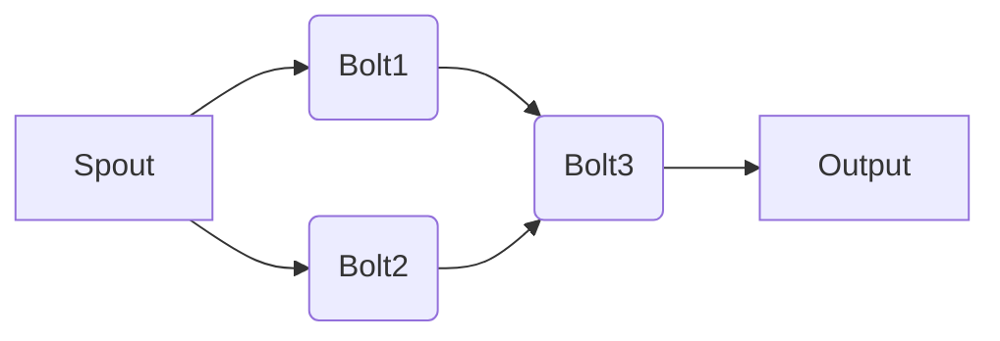

# Storm实时流处理框架原理与代码实例讲解

## 1. 背景介绍

### 1.1 问题的由来

随着互联网技术的飞速发展，数据量呈爆炸式增长。传统的离线批处理系统在面对海量数据时，处理速度和效率难以满足实时性要求。为了处理实时数据流，并实时分析、处理这些数据，我们需要一种能够实时处理数据流的分布式计算框架。

Storm 是 Apache 软件基金会下的一个开源分布式实时计算系统，由 Twitter 开源。它提供了强大的流处理能力，能够可靠地处理来自各种数据源的海量实时数据流，并执行实时计算任务。

### 1.2 研究现状

当前，实时流处理框架主要分为以下几类：

- **Apache Storm**：Twitter 开源的分布式实时计算系统，提供高吞吐量和容错性。
- **Apache Kafka**：分布式流处理平台，主要用于构建实时数据流处理应用程序。
- **Apache Flink**：由 DataArtisans 开发，用于实时处理数据流的分布式计算框架，具有高性能、高可用性和可扩展性。
- **Apache Samza**：由 LinkedIn 开发，用于实时数据处理的分布式计算框架，提供高吞吐量和容错性。

其中，Apache Storm 以其易用性和高性能而受到广泛关注。

### 1.3 研究意义

Storm 具有以下研究意义：

- **高吞吐量和低延迟**：Storm 能够以极低的延迟处理大规模实时数据流，满足实时处理需求。
- **高可用性和容错性**：Storm 具有良好的容错性，能够保证数据处理的可靠性。
- **易用性**：Storm 提供了丰富的 API 和组件，易于使用和扩展。
- **灵活性和可扩展性**：Storm 支持多种数据源和多种处理操作，能够满足各种实时数据处理需求。

### 1.4 本文结构

本文将详细介绍 Storm 实时流处理框架的原理、算法、代码实例以及应用场景。具体结构如下：

- 第 2 部分：介绍 Storm 的核心概念与联系。
- 第 3 部分：阐述 Storm 的核心算法原理和具体操作步骤。
- 第 4 部分：讲解 Storm 的数学模型、公式、案例分析和常见问题解答。
- 第 5 部分：给出 Storm 的代码实例和详细解释说明。
- 第 6 部分：探讨 Storm 在实际应用场景中的案例。
- 第 7 部分：推荐 Storm 相关的学习资源、开发工具和参考文献。
- 第 8 部分：总结 Storm 的未来发展趋势与挑战。
- 第 9 部分：附录，提供常见问题与解答。

## 2. 核心概念与联系

本节将介绍 Storm 的核心概念，并阐述其与其他相关技术的联系。

### 2.1 核心概念

- **Spout**：数据源组件，负责从外部数据源（如 Kafka、Twitter 等）读取数据。
- **Bolt**：执行计算操作的组件，负责接收来自 Spout 或其他 Bolt 的数据，进行处理，并将结果发送给其他 Bolt 或输出组件。
- **Stream Grouping**：定义数据如何在 Bolt 之间传输。
- **Topologies**：拓扑结构，由 Spout、Bolt 和 Stream Grouping 组成，定义了实时数据流的处理流程。
- **Zookeeper**：用于集群管理，存储拓扑状态信息。
- **Nimbus**：集群管理节点，负责拓扑的提交、监控和资源分配。

### 2.2 联系

- **Spout 与 Bolt**：Spout 负责从数据源读取数据，并将其发送给 Bolt 进行处理。Bolt 接收来自 Spout 或其他 Bolt 的数据，进行处理，并将结果发送给其他 Bolt 或输出组件。
- **Stream Grouping 与 Topologies**：Stream Grouping 定义了数据如何在 Bolt 之间传输。Topologies 由 Spout、Bolt 和 Stream Grouping 组成，定义了实时数据流的处理流程。
- **Zookeeper 与 Nimbus**：Zookeeper 用于存储拓扑状态信息，Nimbus 负责集群管理，包括拓扑的提交、监控和资源分配。

以下为 Storm 框架的 Mermaid 流程图：



## 3. 核心算法原理 & 具体操作步骤

### 3.1 算法原理概述

Storm 使用分布式计算原理，将实时数据流分解成多个小批次，在集群中并行处理，最后将结果合并输出。其核心算法包括：

- **Spout 发射数据**：Spout 从数据源读取数据，并将数据发射到 Bolt 中。
- **Bolt 处理数据**：Bolt 接收来自 Spout 或其他 Bolt 的数据，进行处理，并将结果发送给其他 Bolt 或输出组件。
- **数据传输**：数据在 Bolt 之间通过 Stream Grouping 进行传输。
- **结果输出**：处理结果最终输出到输出组件。

### 3.2 算法步骤详解

以下是 Storm 的基本步骤：

1. **创建拓扑结构**：定义拓扑结构，包括 Spout、Bolt 和 Stream Grouping。
2. **配置集群资源**：配置集群资源，包括集群规模、节点配置等。
3. **提交拓扑**：将拓扑提交到 Storm 集群，启动拓扑。
4. **监控拓扑**：监控拓扑运行状态，包括拓扑健康、资源使用情况等。
5. **停止拓扑**：根据需要停止拓扑。

### 3.3 算法优缺点

- **优点**：
  - 高吞吐量和低延迟
  - 高可用性和容错性
  - 易用性和可扩展性
- **缺点**：
  - 集群管理复杂
  - 需要一定的学习成本

### 3.4 算法应用领域

Storm 广泛应用于以下领域：

- 实时监控
- 实时推荐
- 实时分析
- 实时数据挖掘
- 实时广告系统
- 实时搜索引擎

## 4. 数学模型和公式 & 详细讲解 & 举例说明

### 4.1 数学模型构建

Storm 的数学模型主要基于分布式计算原理，通过并行计算来提高数据处理速度。其核心模型如下：

- **数据流模型**：将实时数据流视为无限小的数据点序列。
- **并行计算模型**：将数据流分割成多个小批次，在集群中并行处理。
- **结果合并模型**：将并行处理的结果合并输出。

### 4.2 公式推导过程

以下为数据流模型和并行计算模型的公式推导：

- **数据流模型**：

$$
X = \{x_1, x_2, ..., x_n, ..., x_t\}
$$

其中，$X$ 表示实时数据流，$x_t$ 表示时间 $t$ 时的数据点。

- **并行计算模型**：

假设集群中有 $m$ 个节点，每个节点处理 $n/m$ 个数据点。

$$
Y_i = \{y_{i1}, y_{i2}, ..., y_{in/m}\}
$$

其中，$Y_i$ 表示第 $i$ 个节点处理的结果，$y_{in/m}$ 表示第 $i$ 个节点处理的数据点。

### 4.3 案例分析与讲解

以下以实时监控为例，讲解 Storm 的应用。

假设我们想实时监控服务器 CPU 使用率，将服务器 CPU 使用率作为实时数据流输入到 Storm，通过 Storm 进行计算，实时输出 CPU 使用率。

- **数据源**：服务器 CPU 使用率采集系统
- **Spout**：从服务器 CPU 使用率采集系统读取数据
- **Bolt**：计算每个时间窗口内的 CPU 使用率平均值
- **Stream Grouping**：将数据按时间窗口进行分组
- **输出组件**：将 CPU 使用率平均值输出到控制台

### 4.4 常见问题解答

**Q1：Storm 如何保证数据的实时性？**

A：Storm 通过以下方式保证数据的实时性：

- **时间窗口**：将实时数据流划分为时间窗口，在每个时间窗口内处理数据，保证数据处理的实时性。
- **任务调度**：Storm 中的任务调度机制能够保证数据及时处理。

**Q2：Storm 如何保证数据处理的可靠性？**

A：Storm 通过以下方式保证数据处理的可靠性：

- **容错性**：Storm 支持节点故障恢复，当节点故障时，能够自动恢复数据处理任务。
- **事务性**：Storm 支持事务性处理，保证数据处理的原子性。

## 5. 项目实践：代码实例和详细解释说明

### 5.1 开发环境搭建

以下是使用 Java 语言开发 Storm 应用所需的开发环境搭建步骤：

1. 安装 Java 开发环境（如 JDK 1.8）
2. 安装 Maven
3. 添加 Storm 依赖

```xml
<dependencies>
    <dependency>
        <groupId>org.apache.storm</groupId>
        <artifactId>storm-core</artifactId>
        <version>2.2.1</version>
    </dependency>
</dependencies>
```

### 5.2 源代码详细实现

以下是一个简单的 Storm 应用实例，用于监控服务器 CPU 使用率。

```java
import org.apache.storm.topology.TopologyBuilder;
import org.apache.storm.topology.IRichBolt;
import org.apache.storm.topology.IRichSpout;
import org.apache.storm.task.TopologyContext;
import org.apache.storm.tuple.Fields;
import org.apache.storm.tuple.Tuple;
import java.util.Map;

public class ServerCpuMonitor {

    public static class CpuSpout implements IRichSpout {
        @Override
        public void open(Map<String, Object> conf, TopologyContext context, Map<String, Object> componentConf) {
            // 初始化 Spout...
        }

        @Override
        public void close() {
            // 关闭 Spout...
        }

        @Override
        public void activate() {
            // 激活 Spout...
        }

        @Override
        public void deactivate() {
            // 停止 Spout...
        }

        @Override
        public void nextTuple() {
            // 读取服务器 CPU 使用率数据，并发射数据...
        }

        @Override
        public void Ack(Tuple tuple) {
            // 确认数据已经处理...
        }

        @Override
        public void fail(Tuple tuple) {
            // 处理数据失败...
        }

        @Override
        public Map<String, Object> getComponentConfiguration() {
            // 获取组件配置...
            return null;
        }
    }

    public static class CpuBolt implements IRichBolt {
        @Override
        public void prepare(Map<String, Object> conf, TopologyContext context, Map<String, Object> componentConf) {
            // 初始化 Bolt...
        }

        @Override
        public void execute(Tuple input) {
            // 处理数据...
            System.out.println("CPU 使用率：" + input.getString(0));
        }

        @Override
        public void cleanup() {
            // 清理资源...
        }

        @Override
        public Map<String, Object> getComponentConfiguration() {
            // 获取组件配置...
            return null;
        }

        @Override
        public void declareOutputFields(OutputFieldsDeclarer declarer) {
            // 定义输出字段...
            declarer.declare(new Fields("cpu_usage"));
        }
    }

    public static void main(String[] args) {
        TopologyBuilder builder = new TopologyBuilder();
        builder.setSpout("cpu_spout", new CpuSpout());
        builder.setBolt("cpu_bolt", new CpuBolt()).shuffleGrouping("cpu_spout");

        Config conf = new Config();
        conf.setNumWorkers(2);
        conf.setMaxSpoutPending(10);

        try {
            StormSubmitter.submitTopology("server-cpu-monitor", conf, builder.createTopology());
        } catch (InterruptedException e) {
            e.printStackTrace();
        } catch (IOException e) {
            e.printStackTrace();
        }
    }
}
```

### 5.3 代码解读与分析

- **CpuSpout 类**：从服务器 CPU 使用率采集系统读取数据，并发射数据到 Bolt。
- **CpuBolt 类**：接收来自 Spout 的数据，计算每个时间窗口内的 CPU 使用率平均值，并输出到控制台。
- **main 方法**：创建拓扑结构，配置集群资源，提交拓扑。

### 5.4 运行结果展示

运行上述代码后，将实时输出服务器 CPU 使用率。

## 6. 实际应用场景

### 6.1 实时监控

Storm 在实时监控领域有着广泛的应用，如：

- **网络监控**：实时监控网络流量、服务器性能、数据库性能等。
- **应用监控**：实时监控应用程序性能、错误日志等。
- **设备监控**：实时监控物联网设备的运行状态、传感器数据等。

### 6.2 实时推荐

Storm 在实时推荐领域有着广泛的应用，如：

- **内容推荐**：实时推荐新闻、文章、商品等。
- **广告推荐**：实时推荐广告位、广告内容等。

### 6.3 实时分析

Storm 在实时分析领域有着广泛的应用，如：

- **市场分析**：实时分析市场趋势、用户行为等。
- **金融分析**：实时分析股票市场、金融市场等。

### 6.4 未来应用展望

随着实时数据量的不断增长，Storm 在未来将会有更广泛的应用场景，如：

- **智能城市**：实时监控城市运行状态、交通流量、环境监测等。
- **工业互联网**：实时监控工业设备运行状态、生产数据等。
- **物联网**：实时监控物联网设备运行状态、传感器数据等。

## 7. 工具和资源推荐

### 7.1 学习资源推荐

以下是一些 Storm 相关的学习资源：

- Apache Storm 官方文档：https://storm.apache.org/
- Storm 深入浅出：https://www.jianshu.com/p/4e4b9b1c2e72
- Storm 源码分析：https://github.com/apache/storm

### 7.2 开发工具推荐

以下是一些 Storm 开发工具：

- Storm UI：https://stormui.com/
- Storm Driller：https://github.com/davidmberg/storm-driller

### 7.3 相关论文推荐

以下是一些 Storm 相关的论文：

- Storm: A Distributed and Fault-Tolerant Streaming Platform
- Streaming Systems

### 7.4 其他资源推荐

以下是一些与 Storm 相关的其他资源：

- Storm 社区：https://groups.google.com/forum/#!forum/storm-users
- Storm Meetup：https://www.meetup.com/topics/storm-nlp/

## 8. 总结：未来发展趋势与挑战

### 8.1 研究成果总结

本文详细介绍了 Storm 实时流处理框架的原理、算法、代码实例以及应用场景。通过本文的学习，读者可以了解 Storm 的基本概念、工作原理和应用场景，并能够使用 Storm 开发实时流处理应用。

### 8.2 未来发展趋势

以下是 Storm 的未来发展趋势：

- **更强大的性能**：随着硬件性能的提升，Storm 的性能将会进一步提升。
- **更易用的 API**：Storm 将推出更易用的 API，降低用户的学习成本。
- **更丰富的生态**：Storm 的生态将更加丰富，包括更多数据源、Bolt 和工具。
- **与其他技术的融合**：Storm 将与其他技术（如机器学习、大数据等）进行融合，拓展应用场景。

### 8.3 面临的挑战

以下是 Storm 面临的挑战：

- **集群管理**：Storm 集群管理相对复杂，需要专业的运维人员。
- **数据安全性**：实时数据处理涉及到数据安全问题，需要加强数据安全性保障。
- **可扩展性**：随着数据量的增长，Storm 的可扩展性需要进一步提升。

### 8.4 研究展望

Storm 作为实时流处理领域的领先框架，将继续保持其领先地位。未来，随着技术的不断发展，Storm 将会更加成熟，为实时数据处理领域带来更多创新。

## 9. 附录：常见问题与解答

**Q1：Storm 与其他实时流处理框架的区别是什么？**

A：Storm 与其他实时流处理框架（如 Kafka、Flink、Samza）的主要区别在于：

- **Storm**：支持有界和无界流处理，容错性强，易于扩展。
- **Kafka**：主要用于构建实时数据流处理应用程序，不提供直接的流处理能力。
- **Flink**：支持有界和无界流处理，具有高性能、高可用性和可扩展性。
- **Samza**：由 LinkedIn 开发，用于实时数据处理的分布式计算框架，提供高吞吐量和容错性。

**Q2：Storm 如何保证数据处理的实时性？**

A：Storm 通过以下方式保证数据处理的实时性：

- **时间窗口**：将实时数据流划分为时间窗口，在每个时间窗口内处理数据，保证数据处理的实时性。
- **任务调度**：Storm 中的任务调度机制能够保证数据及时处理。

**Q3：Storm 如何保证数据处理的可靠性？**

A：Storm 通过以下方式保证数据处理的可靠性：

- **容错性**：Storm 支持节点故障恢复，当节点故障时，能够自动恢复数据处理任务。
- **事务性**：Storm 支持事务性处理，保证数据处理的原子性。

**Q4：Storm 如何进行数据分区？**

A：Storm 提供了多种数据分区方式，包括：

- **随机分区**：将数据随机分配到 Bolt 中。
- **字段分区**：根据字段值将数据分配到 Bolt 中。
- **轮询分区**：将数据依次分配到 Bolt 中。

**Q5：Storm 如何进行负载均衡？**

A：Storm 通过以下方式实现负载均衡：

- **动态资源分配**：根据任务负载动态分配资源。
- **负载均衡策略**：根据任务负载选择最优的执行节点。

**Q6：Storm 如何进行性能优化？**

A：Storm 的性能优化可以从以下几个方面入手：

- **硬件优化**：使用高性能的硬件设备。
- **任务调度优化**：优化任务调度策略，提高资源利用率。
- **数据分区优化**：优化数据分区策略，减少数据传输延迟。
- **Bolt 优化**：优化 Bolt 的处理逻辑，提高处理速度。

作者：禅与计算机程序设计艺术 / Zen and the Art of Computer Programming