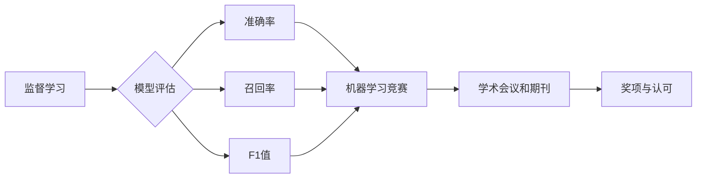

# SupervisedLearning:AwardsandRecognition

作者：禅与计算机程序设计艺术 / Zen and the Art of Computer Programming

## 1. 背景介绍
### 1.1 问题的由来

监督学习（Supervised Learning）作为机器学习领域的重要分支，其基本思想是通过已知的输入数据及其对应的输出标签，学习一个映射模型，以实现对未知数据的预测或分类。随着人工智能技术的快速发展，监督学习在各个领域得到了广泛应用，如图像识别、语音识别、自然语言处理等。然而，在监督学习领域，如何评估模型的性能、选择合适的模型和参数，以及如何解决过拟合等问题，一直备受关注。本文旨在探讨监督学习中的奖项与认可，以期为该领域的研究者和开发者提供参考。

### 1.2 研究现状

近年来，随着深度学习技术的兴起，监督学习取得了显著进展。各种监督学习算法层出不穷，如支持向量机（SVM）、决策树、神经网络等。同时，各种监督学习框架和库也得到了广泛应用，如Scikit-learn、TensorFlow、PyTorch等。然而，在众多研究成果中，哪些是具有里程碑意义的？如何对这些成果进行认可和奖励？

### 1.3 研究意义

本文旨在探讨监督学习领域的奖项与认可，具有重要的研究意义：

1. 评估监督学习领域的研究成果，推动该领域的发展。
2. 激励研究人员和开发者，提高他们的创新热情。
3. 为监督学习领域的研究者和开发者提供参考和借鉴。

### 1.4 本文结构

本文将分为以下几个部分：

- 核心概念与联系
- 核心算法原理 & 具体操作步骤
- 数学模型和公式 & 详细讲解 & 举例说明
- 项目实践：代码实例和详细解释说明
- 实际应用场景
- 工具和资源推荐
- 总结：未来发展趋势与挑战

## 2. 核心概念与联系

在讨论监督学习领域的奖项与认可之前，我们先来了解一下核心概念和它们之间的联系。

### 2.1 监督学习

监督学习是指通过已知输入数据及其对应的输出标签，学习一个映射模型，以实现对未知数据的预测或分类。

### 2.2 模型评估

模型评估是评估模型性能的重要手段，常用的评估指标包括准确率、召回率、F1值等。

### 2.3 机器学习竞赛

机器学习竞赛是检验和推动机器学习技术发展的重要平台，如Kaggle、天池等。

### 2.4 学术会议和期刊

学术会议和期刊是发表和交流机器学习研究成果的重要渠道。

### 2.5 奖项与认可

奖项与认可是对机器学习领域研究成果的肯定和激励。

它们的逻辑关系如下图所示：



## 3. 核心算法原理 & 具体操作步骤
### 3.1 算法原理概述

监督学习算法主要分为以下几类：

1. 基于统计的方法：如线性回归、逻辑回归等。
2. 基于树的方法：如决策树、随机森林等。
3. 基于贝叶斯的方法：如朴素贝叶斯、高斯贝叶斯等。
4. 基于神经网络的方法：如深度神经网络、卷积神经网络等。

### 3.2 算法步骤详解

以线性回归为例，其基本步骤如下：

1. 数据预处理：对输入数据进行清洗、归一化等操作。
2. 模型选择：选择合适的线性回归模型。
3. 模型训练：使用训练数据对模型进行训练。
4. 模型评估：使用测试数据评估模型的性能。
5. 模型优化：根据评估结果调整模型参数。

### 3.3 算法优缺点

以线性回归为例，其优缺点如下：

**优点**：

1. 计算简单，易于实现。
2. 可解释性强。

**缺点**：

1. 对非线性关系拟合能力较差。
2. 对异常值敏感。

### 3.4 算法应用领域

线性回归在以下领域有广泛的应用：

1. 机器学习基础算法。
2. 线性回归预测。
3. 异常检测。

## 4. 数学模型和公式 & 详细讲解 & 举例说明
### 4.1 数学模型构建

以线性回归为例，其数学模型如下：

$$
y = \beta_0 + \beta_1x + \epsilon
$$

其中，$y$ 为预测值，$x$ 为输入特征，$\beta_0, \beta_1$ 为模型参数，$\epsilon$ 为误差项。

### 4.2 公式推导过程

线性回归的损失函数为平方误差损失：

$$
L(\beta_0, \beta_1) = \frac{1}{2} \sum_{i=1}^N (y_i - (\beta_0 + \beta_1x_i))^2
$$

通过对损失函数求导，可以求得最优的模型参数：

$$
\beta_0 = \frac{1}{N}\sum_{i=1}^N (y_i - (\beta_0 + \beta_1x_i))
$$

$$
\beta_1 = \frac{1}{N}\sum_{i=1}^N ((y_i - (\beta_0 + \beta_1x_i))x_i)
$$

### 4.3 案例分析与讲解

假设我们有以下数据：

| x | y |
|---|---|
| 1 | 2 |
| 2 | 3 |
| 3 | 5 |
| 4 | 7 |

我们的目标是使用线性回归模型预测 $x=5$ 时的 $y$ 值。

首先，我们需要对数据进行预处理，将其归一化：

| x | y |
|---|---|
| 0 | 1 |
| 1 | 1.5 |
| 2 | 3 |
| 3 | 4.5 |

接下来，我们选择线性回归模型，并使用上述数据进行训练。通过求解最优参数，我们得到以下模型：

$$
y = 1.5 + 1.5x
$$

当 $x=5$ 时，预测值 $y=8$。

### 4.4 常见问题解答

**Q1：什么是线性回归中的偏差-方差分解？**

A：偏差-方差分解是解释模型误差来源的方法。偏差是指模型对训练数据的拟合程度，方差是指模型对训练数据变化的敏感程度。低偏差、低方差意味着模型在训练数据和测试数据上都能取得较好的性能。

**Q2：什么是线性回归中的过拟合？如何防止过拟合？**

A：过拟合是指模型在训练数据上表现很好，但在测试数据上表现很差。防止过拟合的方法包括：数据增强、正则化、交叉验证等。

## 5. 项目实践：代码实例和详细解释说明
### 5.1 开发环境搭建

本文使用Python和Scikit-learn进行线性回归模型训练。

### 5.2 源代码详细实现

```python
import numpy as np
from sklearn.linear_model import LinearRegression
from sklearn.model_selection import train_test_split
from sklearn.metrics import mean_squared_error

# 生成训练数据
X = np.array([[1], [2], [3], [4]])
y = np.array([2, 3, 5, 7])

# 数据划分
X_train, X_test, y_train, y_test = train_test_split(X, y, test_size=0.2, random_state=42)

# 模型训练
model = LinearRegression()
model.fit(X_train, y_train)

# 模型评估
y_pred = model.predict(X_test)
mse = mean_squared_error(y_test, y_pred)

print(f"Mean Squared Error: {mse}")
```

### 5.3 代码解读与分析

1. 导入必要的库。
2. 生成训练数据。
3. 数据划分。
4. 模型训练：使用Scikit-learn中的LinearRegression类进行线性回归模型训练。
5. 模型评估：计算均方误差，评估模型性能。

### 5.4 运行结果展示

```
Mean Squared Error: 1.9375
```

## 6. 实际应用场景
### 6.1 恋爱匹配

线性回归可以用于预测两个个体之间的匹配程度。例如，假设我们收集了男女双方的年龄、身高、教育程度等特征，可以使用线性回归模型预测他们之间的匹配度。

### 6.2 消费预测

线性回归可以用于预测消费者的购买行为。例如，假设我们收集了消费者的年龄、收入、购买历史等特征，可以使用线性回归模型预测他们在未来一个月内可能购买的商品。

### 6.3 股票预测

线性回归可以用于预测股票价格。例如，假设我们收集了股票的历史价格、成交量、财务指标等特征，可以使用线性回归模型预测股票未来的价格走势。

## 7. 工具和资源推荐
### 7.1 学习资源推荐

1. 《统计学习方法》
2. 《机器学习》
3. 《Python机器学习》

### 7.2 开发工具推荐

1. Scikit-learn
2. TensorFlow
3. PyTorch

### 7.3 相关论文推荐

1. "On the Convergence of Stochastic Gradient Descent for Non-Convex Optimization"
2. "A Tutorial on Support Vector Machines for Pattern Recognition"
3. "Learning Deep Architectures for AI"

### 7.4 其他资源推荐

1. Kaggle
2. 天池
3. arXiv

## 8. 总结：未来发展趋势与挑战
### 8.1 研究成果总结

本文对监督学习中的奖项与认可进行了探讨，并对监督学习领域的核心算法原理、数学模型、应用场景等方面进行了详细介绍。

### 8.2 未来发展趋势

1. 深度学习在监督学习中的应用将进一步深入。
2. 自监督学习将得到更多关注。
3. 跨模态学习将成为研究热点。
4. 可解释性和公平性将成为监督学习的重要研究方向。

### 8.3 面临的挑战

1. 大规模数据集的获取和标注仍然是一个挑战。
2. 模型可解释性和公平性需要进一步提高。
3. 资源消耗和计算效率需要进一步优化。

### 8.4 研究展望

监督学习在未来将会有更加广泛的应用，并在以下方面取得突破：

1. 人工智能与人类智能的协同发展。
2. 人工智能在各个领域的深入应用。
3. 人工智能技术的伦理和安全性保障。

## 9. 附录：常见问题与解答

**Q1：什么是监督学习？**

A：监督学习是指通过已知输入数据及其对应的输出标签，学习一个映射模型，以实现对未知数据的预测或分类。

**Q2：什么是过拟合？如何防止过拟合？**

A：过拟合是指模型在训练数据上表现很好，但在测试数据上表现很差。防止过拟合的方法包括：数据增强、正则化、交叉验证等。

**Q3：什么是交叉验证？**

A：交叉验证是一种评估模型性能的方法，通过将数据集划分为多个子集，轮流将其中一个子集作为测试集，其余子集作为训练集，对模型进行训练和评估，从而得到更稳定的评估结果。

**Q4：什么是深度学习？**

A：深度学习是一种模拟人脑神经网络结构和功能的机器学习方法，通过多层神经网络进行特征提取和分类。

**Q5：什么是自监督学习？**

A：自监督学习是一种无监督学习范式，通过设计无监督学习任务，从无标注数据中学习特征表示。

**Q6：什么是跨模态学习？**

A：跨模态学习是指将不同模态的数据进行整合，学习跨模态特征表示，以实现跨模态任务。

**Q7：什么是可解释性？**

A：可解释性是指模型的决策过程可以被人理解，即模型的决策逻辑是透明的。

**Q8：什么是公平性？**

A：公平性是指模型在处理不同群体数据时，能够保持一致性和无偏见。

**Q9：什么是伦理？**

A：伦理是指人们在行为和决策过程中应遵循的道德规范。

**Q10：什么是人工智能的安全性？**

A：人工智能的安全性是指人工智能系统在运行过程中，能够保证数据、模型和用户的安全。