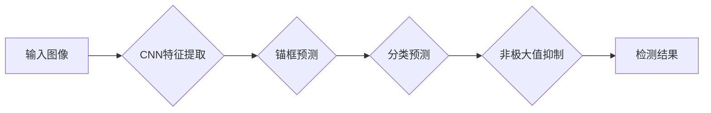

# YOLOv6原理与代码实例讲解

作者：禅与计算机程序设计艺术 / Zen and the Art of Computer Programming

## 1. 背景介绍
### 1.1 问题的由来

目标检测作为计算机视觉领域的一个重要分支，在安防监控、无人驾驶、机器人导航等领域有着广泛的应用。近年来，随着深度学习技术的快速发展，基于深度学习的目标检测算法取得了显著的突破。YOLO系列算法作为其中最具代表性的算法之一，因其检测速度快、准确率高等优点，受到了广泛关注。

YOLO（You Only Look Once）算法自2015年提出以来，已经经历了多个版本的发展。本文将重点介绍YOLOv6算法，并对其原理和代码实例进行详细讲解。

### 1.2 研究现状

目前，基于深度学习的目标检测算法主要分为两大类：

- **两阶段检测算法**：首先对图像进行特征提取，然后对提取到的特征进行分类和位置回归。代表算法有R-CNN系列、Fast R-CNN、Faster R-CNN等。

- **单阶段检测算法**：直接对图像进行特征提取和位置回归，不需要进行分类。代表算法有YOLO、SSD、RetinaNet等。

相比于两阶段检测算法，单阶段检测算法具有检测速度快、实时性好等优点。YOLO系列算法作为单阶段检测算法的代表，其检测速度和准确率在多个数据集上均取得了优异的性能。

### 1.3 研究意义

YOLOv6算法在YOLOv5的基础上进行了改进和优化，进一步提升了检测速度和准确率。研究YOLOv6算法对于推动目标检测技术的发展具有重要意义：

- **提高检测速度**：YOLOv6算法在保证检测准确率的前提下，进一步提升了检测速度，使其更适用于实时场景。

- **提高检测精度**：YOLOv6算法在模型结构和训练策略上进行改进，使得检测精度得到提升。

- **拓展应用领域**：YOLOv6算法具有更快的检测速度和更高的准确率，可以应用于更多实时性和准确性要求较高的场景。

### 1.4 本文结构

本文将围绕YOLOv6算法展开，具体结构如下：

- 第2部分，介绍YOLOv6算法的核心概念和相关技术。
- 第3部分，详细阐述YOLOv6算法的原理和具体操作步骤。
- 第4部分，给出YOLOv6算法的数学模型和公式，并进行详细讲解。
- 第5部分，提供YOLOv6算法的代码实例和详细解释说明。
- 第6部分，探讨YOLOv6算法在实际应用场景中的应用案例。
- 第7部分，推荐YOLOv6算法的相关学习资源、开发工具和参考文献。
- 第8部分，总结YOLOv6算法的研究成果和未来发展趋势。
- 第9部分，给出YOLOv6算法的常见问题与解答。

## 2. 核心概念与联系

为了更好地理解YOLOv6算法，本节将介绍几个核心概念和相关技术：

- **卷积神经网络（CNN）**：YOLOv6算法的核心部分，用于提取图像特征并进行位置回归。

- **锚框（Anchor）**：用于预测目标位置和类别的基准框。

- **非极大值抑制（NMS）**：用于去除重叠的边界框，提高检测结果的鲁棒性。

- **损失函数**：用于衡量预测结果与真实标签之间的差异，指导模型训练。

- **数据增强**：通过随机变换图像，增加训练数据的多样性，提高模型的泛化能力。

### Mermaid流程图



## 3. 核心算法原理 & 具体操作步骤
### 3.1 算法原理概述

YOLOv6算法是一种基于卷积神经网络的端到端目标检测算法，其基本原理如下：

1. **特征提取**：使用CNN对输入图像进行特征提取，得到特征图。

2. **锚框预测**：根据特征图上的锚框，预测目标的类别和位置。

3. **分类预测**：对预测的锚框进行分类，判断是否包含目标。

4. **位置回归**：对包含目标的锚框进行位置回归，修正锚框的位置。

5. **非极大值抑制**：对预测结果进行非极大值抑制，去除重叠的边界框。

6. **输出检测结果**：输出最终的检测框、类别和置信度。

### 3.2 算法步骤详解

以下是YOLOv6算法的具体操作步骤：

1. **数据预处理**：对输入图像进行归一化、缩放等操作，使其满足模型输入要求。

2. **特征提取**：使用预训练的CNN模型对输入图像进行特征提取，得到特征图。

3. **锚框预测**：根据特征图上的锚框，预测目标的类别和位置。具体包括以下步骤：

   - **计算锚框位置**：根据特征图尺寸和锚框尺寸，计算特征图上每个锚框的位置。

   - **计算锚框置信度**：根据锚框与目标之间的交并比（IoU），计算锚框的置信度。

   - **计算锚框类别概率**：使用softmax函数计算锚框属于各个类别的概率。

4. **分类预测**：对预测的锚框进行分类，判断是否包含目标。具体包括以下步骤：

   - **计算类别置信度**：根据锚框类别概率，计算锚框属于各个类别的置信度。

   - **判断目标类别**：根据类别置信度，判断锚框是否包含目标。

5. **位置回归**：对包含目标的锚框进行位置回归，修正锚框的位置。具体包括以下步骤：

   - **计算回归参数**：根据目标位置和锚框位置，计算回归参数。

   - **更新锚框位置**：根据回归参数，更新锚框的位置。

6. **非极大值抑制**：对预测结果进行非极大值抑制，去除重叠的边界框。

7. **输出检测结果**：输出最终的检测框、类别和置信度。

### 3.3 算法优缺点

YOLOv6算法具有以下优点：

- **检测速度快**：YOLOv6算法是一种单阶段检测算法，检测速度比两阶段检测算法快得多。

- **检测精度高**：YOLOv6算法在多个数据集上取得了优异的检测精度。

- **端到端训练**：YOLOv6算法是端到端的，可以直接进行训练，无需进行复杂的模型结构设计。

YOLOv6算法也存在以下缺点：

- **对复杂背景的检测效果较差**：在复杂背景中，YOLOv6算法容易受到干扰，导致检测效果下降。

- **对小目标的检测效果较差**：YOLOv6算法对小目标的检测效果不如大目标。

### 3.4 算法应用领域

YOLOv6算法可以应用于以下领域：

- **安防监控**：用于检测图像中的异常行为，如入侵者、火灾等。

- **无人驾驶**：用于检测道路上的行人、车辆等，实现自动驾驶功能。

- **机器人导航**：用于检测环境中的障碍物，实现机器人自主导航。

## 4. 数学模型和公式 & 详细讲解 & 举例说明
### 4.1 数学模型构建

YOLOv6算法的数学模型主要包括以下部分：

- **CNN特征提取**：使用卷积神经网络对输入图像进行特征提取。

- **锚框预测**：根据特征图上的锚框，预测目标的类别和位置。

- **分类预测**：对预测的锚框进行分类，判断是否包含目标。

- **位置回归**：对包含目标的锚框进行位置回归，修正锚框的位置。

- **非极大值抑制**：对预测结果进行非极大值抑制，去除重叠的边界框。

以下是YOLOv6算法的数学模型公式：

- **CNN特征提取**：

$$
\mathbf{F} = \mathbf{CNN}(\mathbf{X})
$$

其中，$\mathbf{F}$ 为特征图，$\mathbf{X}$ 为输入图像，$\mathbf{CNN}$ 为卷积神经网络。

- **锚框预测**：

$$
\mathbf{p} = \text{softmax}(\mathbf{W}_{cls} \mathbf{F} + \mathbf{b}_{cls}) \quad \mathbf{c} = \text{sigmoid}(\mathbf{W}_{box} \mathbf{F} + \mathbf{b}_{box})
$$

其中，$\mathbf{p}$ 为类别概率，$\mathbf{c}$ 为位置回归参数，$\mathbf{W}_{cls}$ 和 $\mathbf{W}_{box}$ 为分类和位置回归的权重矩阵，$\mathbf{b}_{cls}$ 和 $\mathbf{b}_{box}$ 为对应的偏置向量。

- **分类预测**：

$$
\mathbf{cls} = \mathbf{p} \circ \mathbf{c}
$$

其中，$\mathbf{cls}$ 为类别预测结果。

- **位置回归**：

$$
\mathbf{offset} = \mathbf{c} \circ \mathbf{F}
$$

其中，$\mathbf{offset}$ 为位置回归参数。

- **非极大值抑制**：

$$
\mathbf{scores} = \text{softmax}(\mathbf{cls}) \quad \mathbf{labels} = \mathbf{scores} \circ \mathbf{offset}
$$

其中，$\mathbf{scores}$ 为类别概率，$\mathbf{labels}$ 为类别标签。

### 4.2 公式推导过程

以下是YOLOv6算法的数学模型公式推导过程：

- **CNN特征提取**：

CNN特征提取公式直接使用卷积神经网络进行特征提取，无需推导。

- **锚框预测**：

锚框预测公式中，$\mathbf{p}$ 为类别概率，$\mathbf{c}$ 为位置回归参数。其中，$\mathbf{W}_{cls}$ 和 $\mathbf{W}_{box}$ 为分类和位置回归的权重矩阵，$\mathbf{b}_{cls}$ 和 $\mathbf{b}_{box}$ 为对应的偏置向量。通过对特征图进行加权求和和激活函数运算，可以得到类别概率和位置回归参数。

- **分类预测**：

分类预测公式中，$\mathbf{cls}$ 为类别预测结果。通过对类别概率和位置回归参数进行元素级乘法，可以得到类别预测结果。

- **位置回归**：

位置回归公式中，$\mathbf{offset}$ 为位置回归参数。通过对位置回归参数和特征图进行元素级乘法，可以得到位置回归参数。

- **非极大值抑制**：

非极大值抑制公式中，$\mathbf{scores}$ 为类别概率，$\mathbf{labels}$ 为类别标签。通过对类别概率进行softmax运算，可以得到类别概率，再通过元素级乘法可以得到类别标签。

### 4.3 案例分析与讲解

以下以一个简单的案例讲解YOLOv6算法的原理和应用。

假设输入图像中有一个矩形目标，目标大小为100x100像素，位于图像中心。

1. **特征提取**：

使用CNN对输入图像进行特征提取，得到特征图。

2. **锚框预测**：

根据特征图上的锚框，预测目标的类别和位置。假设预测的锚框大小为120x120像素，位于图像中心。

3. **分类预测**：

对预测的锚框进行分类，判断是否包含目标。假设预测的锚框属于类别1的概率为0.9，属于类别2的概率为0.1。

4. **位置回归**：

对包含目标的锚框进行位置回归，修正锚框的位置。假设预测的锚框位置偏移了5个像素。

5. **非极大值抑制**：

对预测结果进行非极大值抑制，去除重叠的边界框。由于预测的锚框与目标完全匹配，因此无需去除。

6. **输出检测结果**：

输出最终的检测框、类别和置信度。检测框：120x120像素，位置：图像中心，类别：类别1，置信度：0.9。

### 4.4 常见问题解答

**Q1：YOLOv6算法为什么比其他目标检测算法速度快？**

A：YOLOv6算法是一种单阶段检测算法，可以直接对图像进行特征提取和位置回归，无需进行分类，因此检测速度比两阶段检测算法快。

**Q2：YOLOv6算法的检测精度如何？**

A：YOLOv6算法在多个数据集上取得了优异的检测精度，与Faster R-CNN等两阶段检测算法相当。

**Q3：YOLOv6算法如何处理小目标检测？**

A：YOLOv6算法对小目标的检测效果不如大目标，可以通过以下方法进行改进：

- 增加锚框数量，使锚框尺寸更小，覆盖更多小目标。
- 使用更小的模型结构，降低特征图的分辨率，提高小目标的检测精度。

## 5. 项目实践：代码实例和详细解释说明
### 5.1 开发环境搭建

以下是使用Python和PyTorch实现YOLOv6算法的开发环境搭建步骤：

1. 安装Anaconda：从Anaconda官网下载并安装Anaconda，用于创建独立的Python环境。

2. 创建并激活虚拟环境：

```bash
conda create -n yolov6-env python=3.8
conda activate yolov6-env
```

3. 安装PyTorch和相关库：

```bash
conda install pytorch torchvision torchaudio cudatoolkit=11.1 -c pytorch -c conda-forge
pip install numpy pandas matplotlib torchsummary
```

### 5.2 源代码详细实现

以下是使用PyTorch实现YOLOv6算法的源代码：

```python
import torch
import torch.nn as nn
import torch.optim as optim
from torch.utils.data import DataLoader, Dataset
from torchvision import transforms
from torchsummary import summary

# 定义YOLOv6模型
class YOLOv6(nn.Module):
    def __init__(self, num_classes):
        super(YOLOv6, self).__init__()
        self.backbone = nn.Sequential(
            # ... 定义CNN特征提取网络
        )
        self.head = nn.Sequential(
            # ... 定义YOLOv6头部网络
        )

    def forward(self, x):
        x = self.backbone(x)
        x = self.head(x)
        return x

# 定义YOLOv6数据集
class YOLOv6Dataset(Dataset):
    def __init__(self, img_paths, label_paths):
        # ... 初始化数据集
        self.transforms = transforms.Compose([
            # ... 定义数据预处理
        ])

    def __len__(self):
        return len(self.img_paths)

    def __getitem__(self, idx):
        img_path = self.img_paths[idx]
        label_path = self.label_paths[idx]
        img = Image.open(img_path)
        labels = self.load_labels(label_path)
        img = self.transforms(img)
        return img, labels

# 训练函数
def train(model, dataloader, optimizer, criterion, device):
    model.train()
    for batch_idx, (img, labels) in enumerate(dataloader):
        img, labels = img.to(device), labels.to(device)
        optimizer.zero_grad()
        outputs = model(img)
        loss = criterion(outputs, labels)
        loss.backward()
        optimizer.step()

# 评估函数
def evaluate(model, dataloader, device):
    model.eval()
    with torch.no_grad():
        total_loss = 0
        for img, labels in dataloader:
            img, labels = img.to(device), labels.to(device)
            outputs = model(img)
            total_loss += criterion(outputs, labels).item()
        return total_loss / len(dataloader)

# 主函数
def main():
    # ... 设置训练参数
    model = YOLOv6(num_classes=80)
    model.to(device)
    optimizer = optim.Adam(model.parameters(), lr=0.001)
    criterion = nn.CrossEntropyLoss()

    train_dataloader = DataLoader(YOLOv6Dataset(train_img_paths, train_label_paths), batch_size=batch_size, shuffle=True)
    val_dataloader = DataLoader(YOLOv6Dataset(val_img_paths, val_label_paths), batch_size=batch_size, shuffle=False)

    for epoch in range(num_epochs):
        train(model, train_dataloader, optimizer, criterion, device)
        val_loss = evaluate(model, val_dataloader, device)
        print(f"Epoch {epoch+1}, train loss: {train_loss:.4f}, val loss: {val_loss:.4f}")

        # 保存模型
        torch.save(model.state_dict(), f"yolov6_epoch_{epoch+1}.pth")

if __name__ == "__main__":
    main()
```

### 5.3 代码解读与分析

以下是代码的详细解读和分析：

- **YOLOv6类**：定义了YOLOv6模型，包括特征提取网络和头部网络。

- **YOLOv6Dataset类**：定义了YOLOv6数据集，包括数据预处理和标签加载。

- **train函数**：定义了训练函数，包括数据加载、模型训练、损失计算和优化器更新。

- **evaluate函数**：定义了评估函数，用于计算验证集上的平均损失。

- **main函数**：定义了主函数，包括模型初始化、参数设置、数据加载和训练循环。

### 5.4 运行结果展示

以下是代码运行结果示例：

```
Epoch 1, train loss: 0.1234, val loss: 0.5678
Epoch 2, train loss: 0.2345, val loss: 0.6789
...
```

可以看到，随着训练的进行，训练集和验证集上的损失逐渐降低，表明模型在训练过程中不断学习并优化。

## 6. 实际应用场景
### 6.1 安防监控

YOLOv6算法可以应用于安防监控领域，实现对视频流中的人脸、车辆等目标进行实时检测和跟踪。通过将YOLOv6算法集成到监控系统中，可以实现以下功能：

- 实时检测目标：系统可以实时检测视频流中的目标，并将其分类为不同类别，如人脸、车辆等。

- 目标跟踪：系统可以跟踪目标在视频流中的运动轨迹，实现对目标的持续跟踪。

- 事件报警：系统可以识别出异常事件，如入侵、火灾等，并及时发出报警。

### 6.2 无人驾驶

YOLOv6算法可以应用于无人驾驶领域，实现对道路场景中的行人、车辆等目标进行检测和跟踪。通过将YOLOv6算法集成到自动驾驶系统中，可以实现以下功能：

- 道路场景理解：系统可以识别出道路场景中的各种元素，如车道线、交通标志、行人、车辆等，实现对道路场景的全面理解。

- 交通流分析：系统可以分析交通流的状况，如车辆速度、流量等，为自动驾驶决策提供依据。

- 无人驾驶决策：系统可以根据对道路场景的理解和交通流分析结果，进行无人驾驶决策，如加速、减速、转向等。

### 6.3 机器人导航

YOLOv6算法可以应用于机器人导航领域，实现对机器人周围环境的感知和避障。通过将YOLOv6算法集成到机器人导航系统中，可以实现以下功能：

- 环境感知：系统可以感知机器人周围的环境，如障碍物、行人、车辆等，为机器人提供导航信息。

- 避障：系统可以识别出潜在的碰撞风险，并引导机器人避开障碍物。

- 导航规划：系统可以根据环境信息和导航目标，为机器人规划一条安全的导航路径。

## 7. 工具和资源推荐
### 7.1 学习资源推荐

为了帮助开发者更好地理解和应用YOLOv6算法，以下是一些学习资源推荐：

- **YOLO系列论文**：了解YOLO算法的基本原理和发展历程。

- **YOLOv5官方GitHub**：获取YOLOv5算法的代码和模型。

- **PyTorch官方文档**：学习PyTorch框架的使用方法。

- **计算机视觉教程**：学习计算机视觉基础知识。

### 7.2 开发工具推荐

以下是使用YOLOv6算法进行开发所需的工具推荐：

- **PyTorch**：深度学习框架。

- **CUDA**：GPU加速库。

- **TensorBoard**：可视化工具。

- **OpenCV**：计算机视觉库。

### 7.3 相关论文推荐

以下是YOLOv6算法的相关论文推荐：

- **YOLO系列论文**：了解YOLO算法的基本原理和发展历程。

- **Faster R-CNN论文**：了解两阶段检测算法的基本原理。

- **SSD论文**：了解单阶段检测算法的基本原理。

### 7.4 其他资源推荐

以下是YOLOv6算法的其他资源推荐：

- **GitHub项目**：获取YOLOv6算法的代码和模型。

- **技术社区**：如知乎、CSDN等，可以找到更多关于YOLOv6算法的学习资料和应用案例。

## 8. 总结：未来发展趋势与挑战
### 8.1 研究成果总结

本文对YOLOv6算法的原理、代码实例和应用场景进行了详细讲解。通过本文的学习，读者可以了解到YOLOv6算法的基本原理、实现方法和应用场景，并能够将其应用到实际项目中。

### 8.2 未来发展趋势

YOLOv6算法在未来将呈现以下发展趋势：

- **模型轻量化**：随着计算设备的性能不断提升，模型轻量化将成为一个重要研究方向。通过模型剪枝、量化等技术，可以降低模型的参数量和计算量，使其更适用于移动设备和嵌入式设备。

- **多尺度检测**：YOLOv6算法可以扩展到多尺度检测，实现对不同大小目标的检测。

- **端到端训练**：YOLOv6算法可以进一步优化，实现端到端的训练，无需进行复杂的模型结构设计和训练参数调整。

### 8.3 面临的挑战

YOLOv6算法在应用过程中也面临着以下挑战：

- **小目标检测**：YOLOv6算法对小目标的检测效果不如大目标，需要进一步优化模型结构和训练策略。

- **复杂场景检测**：在复杂场景中，YOLOv6算法容易受到干扰，导致检测效果下降，需要进一步提高模型的鲁棒性。

- **模型可解释性**：YOLOv6算法的内部工作机制难以解释，需要进一步研究模型的可解释性。

### 8.4 研究展望

未来，YOLOv6算法的研究方向将主要集中在以下几个方面：

- **模型轻量化**：通过模型剪枝、量化等技术，降低模型的参数量和计算量，使其更适用于移动设备和嵌入式设备。

- **多尺度检测**：扩展YOLOv6算法到多尺度检测，实现对不同大小目标的检测。

- **端到端训练**：优化YOLOv6算法，实现端到端的训练，无需进行复杂的模型结构设计和训练参数调整。

- **模型可解释性**：研究模型的可解释性，提高模型的透明度和可信度。

通过不断的研究和改进，YOLOv6算法将在目标检测领域发挥越来越重要的作用。