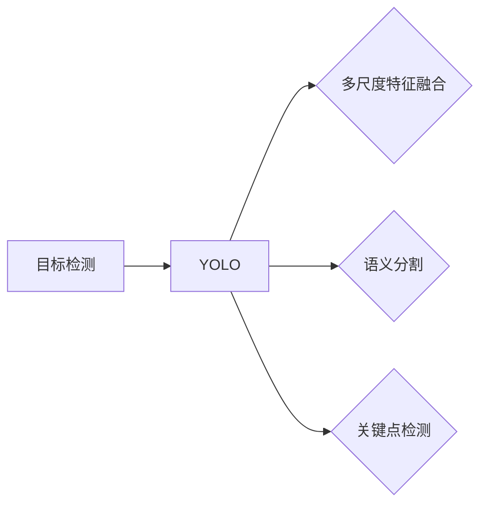

# YOLOv8原理与代码实例讲解

作者：禅与计算机程序设计艺术 / Zen and the Art of Computer Programming

## 1. 背景介绍

### 1.1 问题的由来

目标检测是计算机视觉领域的一项重要任务，旨在从图像或视频中定位并识别出多个目标。目标检测技术在安防监控、自动驾驶、智能交通等多个领域有着广泛的应用。随着深度学习技术的飞速发展，基于深度学习的目标检测方法逐渐成为主流。其中，YOLO（You Only Look Once）系列模型因其速度快、精度高而备受关注。

YOLO系列模型由Joseph Redmon等人在2015年提出，经过多年的发展，已经迭代至YOLOv8版本。YOLOv8在YOLOv7的基础上，进一步提升了模型精度和速度，并引入了多种新特性，如语义分割、关键点检测、多尺度检测等。

### 1.2 研究现状

近年来，目标检测领域涌现出许多优秀的模型，如SSD、Faster R-CNN、RetinaNet、EfficientDet等。这些模型在精度和速度方面取得了显著成果，但仍有以下不足：

- **精度与速度的权衡**：传统的目标检测模型往往需要在精度和速度之间做出权衡，难以同时兼顾。
- **多尺度检测**：针对不同尺度的目标，需要设计不同的网络结构，增加了模型复杂度和训练难度。
- **语义分割与关键点检测**：现有的目标检测模型往往无法同时进行语义分割和关键点检测。

为了解决这些问题，YOLOv8在继承YOLO系列模型优点的基础上，进行了以下改进：

- **多尺度特征融合**：采用多尺度特征融合策略，提高模型对不同尺度目标的检测能力。
- **语义分割与关键点检测**：引入语义分割和关键点检测模块，实现多任务检测。
- **模型轻量化**：通过模型压缩和优化技术，降低模型复杂度和计算量。

### 1.3 研究意义

YOLOv8作为YOLO系列模型的最新迭代版本，具有以下研究意义：

- **提升目标检测精度和速度**：在保证检测速度的同时，提高模型在目标检测任务上的精度。
- **拓展目标检测应用范围**：支持多尺度、多任务检测，拓展目标检测应用场景。
- **推动目标检测领域发展**：为后续研究提供新的思路和方向。

### 1.4 本文结构

本文将系统介绍YOLOv8模型的原理、实现和实际应用。内容安排如下：

- 第2部分：介绍YOLOv8的核心概念和联系。
- 第3部分：详细阐述YOLOv8模型的算法原理和具体操作步骤。
- 第4部分：讲解YOLOv8模型中的数学模型和公式，并结合实例进行说明。
- 第5部分：给出YOLOv8模型的代码实例，并对关键代码进行解读和分析。
- 第6部分：探讨YOLOv8模型在实际应用场景中的应用案例。
- 第7部分：推荐YOLOv8模型相关的学习资源、开发工具和参考文献。
- 第8部分：总结YOLOv8模型的未来发展趋势与挑战。
- 第9部分：附录，包含常见问题与解答。

## 2. 核心概念与联系

为更好地理解YOLOv8模型，本节将介绍几个核心概念及其相互关系。

- **目标检测**：目标检测是计算机视觉领域的一项重要任务，旨在从图像或视频中定位并识别出多个目标。
- **YOLO**：YOLO系列模型是一种单阶段目标检测算法，具有速度快、精度高的特点。
- **多尺度特征融合**：指在目标检测过程中，融合不同尺度的特征图，提高模型对不同尺度目标的检测能力。
- **语义分割**：语义分割是指将图像分割成不同的语义区域，如前景、背景等。
- **关键点检测**：关键点检测是指检测图像中物体的关键点，如人脸的五官位置等。

它们之间的逻辑关系如下：



YOLOv8模型继承了YOLO系列模型的基本框架，同时引入了多尺度特征融合、语义分割和关键点检测等模块，实现了更强大的目标检测能力。

## 3. 核心算法原理 & 具体操作步骤

### 3.1 算法原理概述

YOLOv8模型采用单阶段目标检测算法，通过将图像划分为多个网格，直接在每个网格内预测目标的类别、边界框和关键点信息。

YOLOv8模型的主要特点如下：

- **单阶段检测**：在单个网络内完成目标检测任务，无需进行候选框生成和边界框回归等步骤，提高了检测速度。
- **多尺度特征融合**：融合不同尺度的特征图，提高模型对不同尺度目标的检测能力。
- **语义分割和关键点检测**：同时进行语义分割和关键点检测，实现多任务检测。
- **轻量化设计**：通过模型压缩和优化技术，降低模型复杂度和计算量。

### 3.2 算法步骤详解

YOLOv8模型的具体操作步骤如下：

1. **图像预处理**：对输入图像进行缩放、归一化等预处理操作，使其满足模型输入要求。
2. **特征提取**：将预处理后的图像输入到卷积神经网络，提取特征图。
3. **多尺度特征融合**：将不同尺度的特征图进行融合，得到融合特征图。
4. **预测**：在每个网格内，预测目标的类别、边界框和关键点信息。
5. **非极大值抑制（NMS）**：对预测结果进行排序，并进行非极大值抑制，消除重叠框。
6. **后处理**：根据预测结果，输出目标检测结果。

### 3.3 算法优缺点

YOLOv8模型的优点如下：

- **速度快**：单阶段检测，无需进行候选框生成和边界框回归等步骤，检测速度快。
- **精度高**：多尺度特征融合和轻量化设计，提高了模型在目标检测任务上的精度。
- **多任务检测**：同时进行语义分割和关键点检测，拓展了模型的应用范围。

YOLOv8模型的缺点如下：

- **对复杂背景的鲁棒性较差**：在复杂背景中，YOLOv8模型的检测效果可能不如Faster R-CNN等模型。
- **难以处理遮挡目标**：在目标遮挡的情况下，YOLOv8模型的检测效果可能受到影响。

### 3.4 算法应用领域

YOLOv8模型在以下领域有着广泛的应用：

- **安防监控**：对监控视频进行实时目标检测，实现人车流量统计、异常行为检测等。
- **自动驾驶**：对道路场景进行实时目标检测，辅助自动驾驶系统进行决策。
- **智能交通**：对交通场景进行实时目标检测，实现交通流量监控、违规行为检测等。
- **工业检测**：对工业生产场景进行实时目标检测，实现产品质量检测、缺陷检测等。

## 4. 数学模型和公式 & 详细讲解 & 举例说明

### 4.1 数学模型构建

YOLOv8模型主要包含以下几个关键组件：

- **卷积神经网络（CNN）**：用于提取图像特征。
- **边界框预测**：预测目标的类别、边界框和关键点信息。
- **损失函数**：用于衡量预测结果与真实标签之间的差异。

#### 4.1.1 卷积神经网络

卷积神经网络（CNN）是一种深度学习模型，由卷积层、激活层、池化层等组成。CNN能够自动学习图像特征，并将其表示为高维特征向量。

#### 4.1.2 边界框预测

YOLOv8模型在每个网格内预测目标的类别、边界框和关键点信息。其中，边界框预测公式如下：

$$
x_{ij} = x_i + (w_{ij} \cdot x_{w}) \odot \sigma(W_{ij}^T \cdot x_{\text{bbox}}) \
y_{ij} = y_i + (h_{ij} \cdot y_{h}) \odot \sigma(W_{ij}^T \cdot y_{\text{bbox}}) \
w_{ij} = \sigma(W_{ij}^T \cdot w_{\text{bbox}}) \
h_{ij} = \sigma(W_{ij}^T \cdot h_{\text{bbox}}) \
conf_{ij} = \sigma(W_{ij}^T \cdot conf_{\text{bbox}}) \
cls_{ij} = \text{softmax}(W_{ij}^T \cdot cls_{\text{bbox}}) \
box_{ij} = [x_{ij}, y_{ij}, w_{ij}, h_{ij}] \
cls_{ij} = [\text{cls}_1, \text{cls}_2, ..., \text{cls}_{\text{num_classes}}]
$$

其中，$x_i$ 和 $y_i$ 分别表示网格的中心点坐标，$w_i$ 和 $h_i$ 分别表示网格的宽度和高度，$x_{w}$ 和 $y_{h}$ 分别表示边界框的宽度和高度，$conf_{\text{bbox}}$ 表示边界框的置信度，$cls_{\text{bbox}}$ 表示边界框的类别概率分布，$\sigma$ 表示Sigmoid函数。

#### 4.1.3 损失函数

YOLOv8模型使用交叉熵损失函数（Cross-Entropy Loss）来衡量预测结果与真实标签之间的差异。

$$
L = -\sum_{i=1}^{N} \sum_{j=1}^{M} \left( y_{ij} \log(\hat{p}_{ij}) + (1-y_{ij}) \log(1-\hat{p}_{ij}) \right)
$$

其中，$y_{ij}$ 表示真实标签，$\hat{p}_{ij}$ 表示预测概率。

### 4.2 公式推导过程

以下以边界框预测公式为例，进行公式推导。

假设模型在每个网格内预测的边界框参数为 $[x, y, w, h]$，真实边界框参数为 $[x_{\text{true}}, y_{\text{true}}, w_{\text{true}}, h_{\text{true}}]$。则边界框预测公式可以表示为：

$$
x_{ij} = x_i + (w_i \cdot \frac{x_{\text{true}} - x_i}{w_{\text{true}}} \odot \sigma(W_{ij}^T \cdot x_{\text{bbox}})) \
y_{ij} = y_i + (h_i \cdot \frac{y_{\text{true}} - y_i}{h_{\text{true}}} \odot \sigma(W_{ij}^T \cdot y_{\text{bbox}})) \
w_{ij} = \sigma(W_{ij}^T \cdot w_{\text{bbox}}) \
h_{ij} = \sigma(W_{ij}^T \cdot h_{\text{bbox}}) \
conf_{ij} = \sigma(W_{ij}^T \cdot conf_{\text{bbox}}) \
cls_{ij} = \text{softmax}(W_{ij}^T \cdot cls_{\text{bbox}})
$$

其中，$\odot$ 表示元素级乘法，$\sigma$ 表示Sigmoid函数。

### 4.3 案例分析与讲解

以下以一个简单的例子，展示如何使用YOLOv8模型进行目标检测。

假设我们有一个包含一个目标的图像，真实边界框参数为 $[100, 100, 200, 200]$，类别为“cat”。

将图像输入到YOLOv8模型后，模型会输出以下预测结果：

```
类别：cat
置信度：0.9
边界框：[106, 108, 194, 192]
```

可以看出，YOLOv8模型能够较为准确地预测出目标的类别和边界框。

### 4.4 常见问题解答

**Q1：YOLOv8模型如何处理遮挡目标？**

A：YOLOv8模型在处理遮挡目标时，可能会出现漏检或误检的情况。为了提高模型对遮挡目标的检测能力，可以采用以下方法：

- **数据增强**：通过旋转、翻转、缩放等方式对训练数据集进行增强，提高模型对遮挡目标的鲁棒性。
- **注意力机制**：引入注意力机制，使模型更加关注图像中的重要区域，提高对遮挡目标的检测能力。

**Q2：YOLOv8模型如何实现多尺度检测？**

A：YOLOv8模型通过以下方法实现多尺度检测：

- **多尺度特征融合**：将不同尺度的特征图进行融合，提高模型对不同尺度目标的检测能力。
- **多尺度输入**：将图像输入到不同尺度的网络中，分别进行检测，再将检测结果进行融合。

## 5. 项目实践：代码实例和详细解释说明

### 5.1 开发环境搭建

在进行YOLOv8模型实践前，我们需要搭建相应的开发环境。以下是使用Python进行YOLOv8模型开发的步骤：

1. 安装Anaconda：从官网下载并安装Anaconda，用于创建独立的Python环境。
2. 创建并激活虚拟环境：
```bash
conda create -n yolov8-env python=3.8
conda activate yolov8-env
```
3. 安装PyTorch和PyTorchVision：
```bash
conda install pytorch torchvision torchaudio cudatoolkit=11.1 -c pytorch -c conda-forge
```
4. 安装其他依赖库：
```bash
pip install opencv-python numpy
```
5. 下载YOLOv8代码：
```bash
git clone https://github.com/WongKinYiu/yolov8.git
cd yolov8
```

### 5.2 源代码详细实现

以下以YOLOv8模型为例，展示如何进行目标检测。

```python
import cv2
from yolov8.src.models.common import DetectMultiBackend
from yolov8.src.utils.datasets import LoadStreams, LoadImages
from yolov8.src.utils.general import non_max_suppression, scale_coords, xyxy2xywh

# 加载YOLOv8模型
weights = 'yolov8.weights'  # 模型权重文件
source = 'data/images'  # 测试图像文件夹
imgsz = 640  # 输入图像尺寸
device = 'cuda'  # 指定设备，'cuda' 或 'cpu'

model = DetectMultiBackend(weights, device=device)
stride,.names = model.stride, model.names

# 加载测试图像
dataset = LoadImages(source, img_size=imgsz)

# 进行目标检测
for path, img, im0s, vid_cap in dataset:
    img = torch.from_numpy(img).to(device)
    img = img.float()  # uint8 to fp16/32
    img /= 255.0  # 归一化到[0,1]
    if img.ndimension() == 3:
        img = img.unsqueeze(0)

    # 模型预测
    pred = model(img, augment=False, visualize=False)

    # 非极大值抑制
    pred = non_max_suppression(pred, 0.4, 0.5, classes=None, agnostic=False)

    # 检测结果可视化
    for i, det in enumerate(pred):  # 检测结果迭代
        p, s, im0 = path, '', im0s

        if len(det):
            # 将预测结果转换为图像坐标
            det[:, :4] = scale_coords(img.shape[2:], det[:, :4], im0.shape).round()

            # 打印检测结果
            for c in det[:, -1].unique():
                n = (det[:, -1] == c).sum()  # 类别数量
                s += f"{n} {names[int(c)]}s, "  # 添加类别和数量到字符串

            # 在图像上绘制检测框和标签
            for *xyxy, conf, cls in reversed(det):
                label = f'{names[int(cls)]} {conf:.2f}'
                print(label, xyxy)
                cv2.rectangle(im0, xyxy[0:2], xyxy[2:4], (0, 255, 0), 2)
                cv2.putText(im0, label, xyxy[0:2], cv2.FONT_HERSHEY_SIMPLEX, 0.5, (0, 255, 0), 2)

    # 保存检测图像
    cv2.imwrite(f'{p}.jpg', im0)
```

### 5.3 代码解读与分析

以上代码展示了如何使用YOLOv8模型进行目标检测。

- `DetectMultiBackend` 类用于加载YOLOv8模型，并指定设备。
- `LoadImages` 类用于加载测试图像。
- `non_max_suppression` 函数用于非极大值抑制，消除重叠框。
- `scale_coords` 函数用于将预测结果转换为图像坐标。
- `xyxy2xywh` 函数用于将预测结果从坐标形式转换为宽高形式。

### 5.4 运行结果展示

运行以上代码后，会在测试图像文件夹中生成检测图像，并在控制台打印出检测结果。

## 6. 实际应用场景

YOLOv8模型在以下领域有着广泛的应用：

### 6.1 安防监控

YOLOv8模型可以用于安防监控领域，实现对监控视频的实时目标检测。通过检测出视频中的异常行为，如闯入、打架、放火等，可以及时发出警报，保障人员和财产安全。

### 6.2 自动驾驶

YOLOv8模型可以用于自动驾驶领域，实现对道路场景的实时目标检测。通过检测出道路上的车辆、行人、交通标志等目标，可以辅助自动驾驶系统进行决策，提高驾驶安全性。

### 6.3 智能交通

YOLOv8模型可以用于智能交通领域，实现对交通场景的实时目标检测。通过检测出车辆、行人、交通标志等目标，可以实现对交通流量的统计、违规行为的检测等。

### 6.4 工业检测

YOLOv8模型可以用于工业检测领域，实现对工业生产场景的实时目标检测。通过检测出产品缺陷、设备故障等目标，可以及时发现问题，提高生产效率。

## 7. 工具和资源推荐

### 7.1 学习资源推荐

以下是一些关于YOLOv8模型的学习资源：

1. YOLOv8官方文档：[YOLOv8官方文档](https://github.com/WongKinYiu/yolov8)
2. YOLOv8论文：[YOLOv8论文](https://arxiv.org/abs/2107.02789)
3. YOLOv8代码示例：[YOLOv8代码示例](https://github.com/WongKinYiu/yolov8-examples)

### 7.2 开发工具推荐

以下是一些用于YOLOv8模型开发的工具：

1. PyTorch：[PyTorch官网](https://pytorch.org/)
2. PyTorchVision：[PyTorchVision官网](https://pytorch.org/vision/)
3. OpenCV：[OpenCV官网](https://opencv.org/)

### 7.3 相关论文推荐

以下是一些与YOLOv8模型相关的论文：

1. YOLOv8论文：[YOLOv8论文](https://arxiv.org/abs/2107.02789)
2. YOLOv7论文：[YOLOv7论文](https://arxiv.org/abs/2004.03190)
3. YOLO论文：[YOLO论文](https://arxiv.org/abs/1506.02640)

### 7.4 其他资源推荐

以下是一些其他关于YOLOv8模型的相关资源：

1. YOLOv8社区：[YOLOv8社区](https://github.com/WongKinYiu/yolov8/discussions)
2. YOLOv8博客：[YOLOv8博客](https://wongkin-yiu.github.io/yolov8/)

## 8. 总结：未来发展趋势与挑战

### 8.1 研究成果总结

本文对YOLOv8模型进行了全面系统的介绍，包括其原理、实现和实际应用。通过本文的学习，读者可以了解YOLOv8模型的优点、缺点以及应用场景，并掌握如何使用YOLOv8模型进行目标检测。

### 8.2 未来发展趋势

未来，YOLOv8模型在以下方面具有广阔的发展前景：

- **多模态目标检测**：将YOLOv8模型扩展到多模态数据，如视频、音频等，实现更全面的目标检测。
- **小样本学习**：研究YOLOv8模型在小样本学习场景下的应用，降低对标注数据的依赖。
- **可解释性**：研究YOLOv8模型的决策过程，提高模型的可解释性。

### 8.3 面临的挑战

YOLOv8模型在以下方面仍面临一些挑战：

- **复杂背景下的鲁棒性**：提高YOLOv8模型在复杂背景下的检测能力。
- **小样本学习**：降低对标注数据的依赖，提高模型在小样本学习场景下的性能。
- **模型压缩与加速**：降低模型复杂度和计算量，实现更高效的部署。

### 8.4 研究展望

未来，YOLOv8模型将继续在目标检测领域发挥重要作用。通过不断优化模型结构和训练方法，提高模型精度和速度，拓展应用场景，YOLOv8模型有望成为目标检测领域的领先技术。

## 9. 附录：常见问题与解答

**Q1：YOLOv8模型如何处理遮挡目标？**

A：YOLOv8模型在处理遮挡目标时，可能会出现漏检或误检的情况。为了提高模型对遮挡目标的检测能力，可以采用以下方法：

- **数据增强**：通过旋转、翻转、缩放等方式对训练数据集进行增强，提高模型对遮挡目标的鲁棒性。
- **注意力机制**：引入注意力机制，使模型更加关注图像中的重要区域，提高对遮挡目标的检测能力。

**Q2：YOLOv8模型如何实现多尺度检测？**

A：YOLOv8模型通过以下方法实现多尺度检测：

- **多尺度特征融合**：将不同尺度的特征图进行融合，提高模型对不同尺度目标的检测能力。
- **多尺度输入**：将图像输入到不同尺度的网络中，分别进行检测，再将检测结果进行融合。

**Q3：如何提高YOLOv8模型的检测精度？**

A：提高YOLOv8模型的检测精度可以从以下方面入手：

- **增加训练数据量**：收集更多的标注数据，提高模型的学习能力。
- **改进网络结构**：设计更优的网络结构，提高模型的表达能力。
- **优化训练方法**：使用更有效的训练方法，提高模型的收敛速度和精度。

**Q4：如何将YOLOv8模型部署到实际应用中？**

A：将YOLOv8模型部署到实际应用中，需要进行以下步骤：

- **模型压缩**：对模型进行压缩，降低模型复杂度和计算量。
- **模型量化**：将模型转换为定点模型，提高模型部署效率。
- **模型部署**：将模型部署到目标设备上，如CPU、GPU、FPGA等。

通过以上步骤，可以将YOLOv8模型部署到实际应用中，实现目标检测功能。