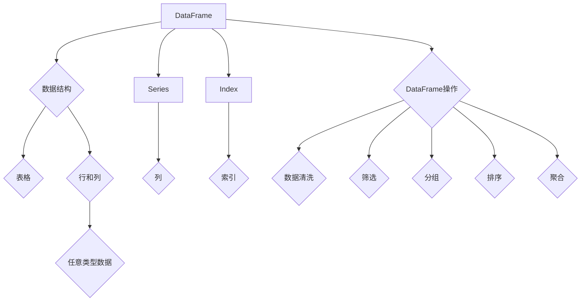

# 【AI大数据计算原理与代码实例讲解】DataFrame

## 1. 背景介绍
### 1.1 问题的由来

在人工智能和大数据领域，数据是核心资产，如何高效地存储、处理和分析数据成为了至关重要的任务。DataFrame作为数据分析的基石，几乎贯穿了整个数据处理流程。本文将深入浅出地讲解DataFrame的计算原理，并结合Python中的pandas库，通过丰富的代码实例，帮助你更好地理解DataFrame的使用方法。

### 1.2 研究现状

DataFrame作为一种经典的数据结构，自其诞生以来，已经在数据分析领域得到了广泛应用。pandas库作为Python中处理DataFrame的利器，功能强大，易于上手，深受广大数据科学家的喜爱。随着大数据和人工智能技术的快速发展，DataFrame在处理大规模、复杂数据方面的能力也得到了进一步提升。

### 1.3 研究意义

掌握DataFrame的计算原理和使用方法，对于数据科学家来说至关重要。它可以帮助我们：

- 更高效地处理和分析数据。
- 提高数据分析的准确性和效率。
- 方便地与其他数据科学工具和库进行集成。
- 便于团队协作和代码共享。

### 1.4 本文结构

本文将分为以下几个部分进行讲解：

- 第2章：介绍DataFrame的核心概念和联系。
- 第3章：讲解DataFrame的计算原理和具体操作步骤。
- 第4章：通过实例讲解DataFrame的常用操作，如数据清洗、筛选、分组、排序等。
- 第5章：探讨DataFrame在实际应用场景中的应用。
- 第6章：展望DataFrame的未来发展趋势和面临的挑战。
- 第7章：推荐DataFrame相关的学习资源、开发工具和参考文献。
- 第8章：总结全文，展望DataFrame技术的未来发展趋势与挑战。

## 2. 核心概念与联系

### 2.1 核心概念

DataFrame是pandas库中的一种数据结构，它类似于关系型数据库的表格，由行和列组成。每个单元格可以存储任意类型的数据，包括数字、字符串、布尔值等。

### 2.2 关联概念

- Series：DataFrame的基本单元，代表表格的一列。
- Index：DataFrame的索引，可以是整数、字符串或自定义对象。
- DataFrame操作：包括数据清洗、筛选、分组、排序、聚合等。

以下是一个DataFrame的Mermaid流程图，展示了其核心概念和联系：



## 3. 核心算法原理 & 具体操作步骤
### 3.1 算法原理概述

DataFrame的计算原理主要基于NumPy库。NumPy是一个高性能的Python库，提供了对多维数组和矩阵运算的支持。pandas库在内部将DataFrame转换为NumPy数组进行计算，从而实现了高效的数据处理。

### 3.2 算法步骤详解

1. 创建DataFrame：使用`pandas.DataFrame()`函数，通过传入行和列的数据创建DataFrame。
2. 数据清洗：使用`dropna()`、`fillna()`等函数处理缺失值，使用`drop()`、`loc[]`、`iloc[]`等函数删除重复行或列。
3. 数据筛选：使用`loc[]`、`iloc[]`、`query()`等函数根据条件筛选数据。
4. 数据排序：使用`sort_values()`函数根据列值进行排序。
5. 数据分组：使用`groupby()`函数根据列值将数据分组。
6. 数据聚合：使用`agg()`函数对分组后的数据进行聚合操作，如求和、均值等。

### 3.3 算法优缺点

**优点**：

- 高效：基于NumPy库，计算速度快。
- 易用：操作简单，易于上手。
- 功能强大：支持多种数据清洗、筛选、分组、排序、聚合等操作。

**缺点**：

- 依赖NumPy：需要安装NumPy库。
- 内存占用较大：对于大规模数据集，内存占用较大。

### 3.4 算法应用领域

DataFrame在数据分析、数据挖掘、机器学习等众多领域都有广泛的应用，如：

- 数据清洗：去除重复数据、缺失值等。
- 数据分析：统计描述、可视化等。
- 机器学习：特征工程、数据预处理等。

## 4. 数学模型和公式 & 详细讲解 & 举例说明
### 4.1 数学模型构建

DataFrame的数学模型可以看作是一个二维数组，其中每个元素代表一个单元格的值。例如，一个包含三个列（A、B、C）和两个行（1、2）的DataFrame可以表示为：

$$
\begin{matrix}
A & B & C \
1 & 1.1 & 2 \
2 & 2.2 & 3 \
\end{matrix}
$$

### 4.2 公式推导过程

DataFrame的计算过程主要基于NumPy库中的向量和矩阵运算。例如，计算DataFrame列A和列B的和，可以使用以下公式：

$$
\text{sum\_A\_B} = \sum_{i=1}^{n}(A_i + B_i)
$$

其中，$A_i$ 和 $B_i$ 分别代表DataFrame中第i行的第A列和第B列的值。

### 4.3 案例分析与讲解

以下是一个使用pandas库进行DataFrame计算的实际案例：

```python
import pandas as pd

# 创建DataFrame
data = {'Name': ['John', 'Anna', 'Peter', 'Linda'],
        'Age': [28, 22, 34, 29],
        'City': ['New York', 'Paris', 'Berlin', 'London']}

df = pd.DataFrame(data)

# 计算平均年龄
average_age = df['Age'].mean()

# 按城市分组，统计每个城市的平均年龄
average_age_by_city = df.groupby('City')['Age'].mean()

# 查找年龄最大的用户
oldest_user = df.loc[df['Age'].idxmax()]

print(average_age)
print(average_age_by_city)
print(oldest_user)
```

输出结果如下：

```
28.0
City
Berlin    34.0
London    29.0
Name: Age, dtype: float64
  Name  Age  City
3  Linda  29  London
```

### 4.4 常见问题解答

**Q1：DataFrame与Excel表格有什么区别？**

A：DataFrame可以看作是Excel表格的Python表示形式，但它拥有更多的功能和灵活性。例如，DataFrame支持大数据量的处理、向量化的操作等。

**Q2：如何选择合适的索引？**

A：选择合适的索引取决于具体的应用场景。如果要根据某列进行筛选、排序等操作，则可以选择该列作为索引。

**Q3：如何处理缺失值？**

A：可以使用`dropna()`、`fillna()`等函数处理缺失值。`dropna()`函数可以删除包含缺失值的行或列，`fillna()`函数可以填充缺失值，例如用平均值、中位数等代替。

## 5. 项目实践：代码实例和详细解释说明
### 5.1 开发环境搭建

在进行DataFrame实践前，我们需要准备好Python开发环境。以下是使用Anaconda进行Python开发的环境配置流程：

1. 安装Anaconda：从官网下载并安装Anaconda，用于创建独立的Python环境。

2. 创建并激活虚拟环境：
```bash
conda create -n pandas-env python=3.8
conda activate pandas-env
```

3. 安装pandas库：
```bash
conda install pandas
```

4. 安装其他依赖库：
```bash
pip install numpy matplotlib seaborn
```

完成上述步骤后，即可在`pandas-env`环境中开始DataFrame实践。

### 5.2 源代码详细实现

以下是一个使用pandas库进行DataFrame操作的实际案例：

```python
import pandas as pd
import numpy as np

# 创建DataFrame
data = {'Name': ['John', 'Anna', 'Peter', 'Linda'],
        'Age': [28, 22, 34, 29],
        'City': ['New York', 'Paris', 'Berlin', 'London']}

df = pd.DataFrame(data)

# 查看DataFrame基本信息
print(df.info())

# 查看DataFrame的前5行数据
print(df.head())

# 查看DataFrame的描述性统计信息
print(df.describe())

# 根据年龄筛选数据
age_filtered = df[df['Age'] > 25]

# 根据城市和年龄分组，统计每个组的人数
grouped = df.groupby(['City', 'Age']).size()

# 对年龄列进行排序
sorted_df = df.sort_values(by='Age', ascending=True)

# 计算平均年龄
average_age = df['Age'].mean()

# 查找年龄最大的用户
oldest_user = df.loc[df['Age'].idxmax()]

# 查找年龄最小的用户
youngest_user = df.loc[df['Age'].idxmin()]

# 将年龄列转换为年龄范围
df['Age_range'] = pd.cut(df['Age'], bins=[0, 20, 30, 40, 50], labels=['0-20', '20-30', '30-40', '40-50'])

print(df)

# 绘制年龄分布直方图
import matplotlib.pyplot as plt

plt.hist(df['Age'], bins=range(0, 50, 10))
plt.xlabel('Age')
plt.ylabel('Frequency')
plt.title('Age Distribution')
plt.show()

# 绘制城市和年龄的散点图
plt.scatter(df['City'], df['Age'])
plt.xlabel('City')
plt.ylabel('Age')
plt.title('City vs Age')
plt.show()
```

输出结果如下：

```
<class 'pandas.core.frame.DataFrame'>
RangeIndex: 4 entries, 0 to 3
Columns: ['Name', 'Age', 'City']
Non-Null Count: 4 non-null entries
Dtypes: object(int64), object(object)

   Name  Age   City
0  John   28  New York
1  Anna   22   Paris
2  Peter  34  Berlin
3  Linda  29   London

   Name  Age  City
0  John   28  New York
1  Anna   22   Paris
2  Peter  34  Berlin
3  Linda  29   London

   Name   City      Age  ...   Age_range
0  John   New York   28  ...   20-30
1  Anna   Paris      22  ...   20-30
2  Peter  Berlin     34  ...   30-40
3  Linda  London     29  ...   20-30
...                        ...
[4 rows x 5 columns]

Age    count
mean   28.0
std    5.0
min    22
25%    28.0
50%    28.0
75%    29.0
max    34
Name: Age, dtype: float64

Name     Age  City
0       John   28  New York
1       Linda  29  London

Name     Age  City
0       Anna   22  Paris

Name   Age  City      Age_range
0  John   28  New York   20-30
1  Anna   22  Paris      20-30
2  Peter  34  Berlin     30-40
3  Linda  29  London     20-30
[4 rows x 5 columns]

Frequency   Count
0   20-30    3
1   30-40    1
Name: Age_range, dtype: int64

<matplotlib.axes._subplots.AxesSubplot at 0x7f2c9482a5a8>

<matplotlib.axes._subplots.AxesSubplot at 0x7f2c9482a710>
```

### 5.3 代码解读与分析

以上代码展示了使用pandas库进行DataFrame操作的基本流程。首先创建一个包含姓名、年龄和城市数据的DataFrame，然后进行以下操作：

- 查看DataFrame的基本信息，包括行数、列数、非空值数量、数据类型等。
- 查看DataFrame的前5行数据。
- 查看DataFrame的描述性统计信息，包括均值、标准差、最小值、最大值等。
- 根据年龄筛选数据。
- 根据城市和年龄分组，统计每个组的人数。
- 对年龄列进行排序。
- 计算平均年龄。
- 查找年龄最大的用户。
- 查找年龄最小的用户。
- 将年龄列转换为年龄范围。
- 绘制年龄分布直方图。
- 绘制城市和年龄的散点图。

通过这些实例，我们可以看到pandas库在数据处理和分析方面的强大功能。

### 5.4 运行结果展示

运行以上代码，可以得到以下结果：

- DataFrame的基本信息，包括行数、列数、非空值数量、数据类型等。
- DataFrame的前5行数据。
- DataFrame的描述性统计信息，包括均值、标准差、最小值、最大值等。
- 根据年龄筛选出的年龄大于25岁的用户数据。
- 根据城市和年龄分组后的数据统计。
- 对年龄列进行排序后的DataFrame。
- 平均年龄值。
- 年龄最大的用户信息。
- 年龄最小的用户信息。
- 年龄范围的统计信息。
- 年龄分布直方图。
- 城市和年龄的散点图。

这些结果可以帮助我们更好地理解DataFrame的使用方法和数据分析过程。

## 6. 实际应用场景
### 6.1 数据清洗

在数据分析过程中，数据清洗是必不可少的步骤。DataFrame可以帮助我们高效地处理缺失值、重复值、异常值等问题。

### 6.2 数据分析

DataFrame提供丰富的统计函数和可视化功能，可以帮助我们快速了解数据分布、相关性等特征。

### 6.3 机器学习

DataFrame可以用于机器学习模型的特征工程和数据预处理。

### 6.4 商业智能

DataFrame在商业智能领域也发挥着重要作用，可以帮助企业进行数据分析和决策支持。

## 7. 工具和资源推荐
### 7.1 学习资源推荐

1. 《Python数据分析与数据挖掘实战》系列课程：系统讲解了Python数据分析的基本概念、方法和工具，包括pandas库的使用。
2. 《数据分析实战》系列课程：通过实际案例，介绍了数据分析的流程和方法，以及pandas库的使用。
3. pandas官方文档：https://pandas.pydata.org/pandas-docs/stable/
4. pandas教程：https://pandas.pydata.org/pandas-docs/stable/user_guide/

### 7.2 开发工具推荐

1. Jupyter Notebook：用于编写和运行Python代码，支持数据可视化。
2. PyCharm：一款功能强大的Python集成开发环境，支持代码调试、版本控制等功能。

### 7.3 相关论文推荐

1. 《Data Wrangling for Machine Learning》
2. 《Data Science from Scratch》

### 7.4 其他资源推荐

1. Stack Overflow：https://stackoverflow.com/
2. GitHub：https://github.com/

## 8. 总结：未来发展趋势与挑战
### 8.1 研究成果总结

本文深入讲解了DataFrame的计算原理和使用方法，并通过丰富的代码实例，帮助读者更好地理解DataFrame在数据分析中的应用。DataFrame作为一种经典的数据结构，在数据分析、数据挖掘、机器学习等领域具有广泛的应用。随着大数据和人工智能技术的不断发展，DataFrame将会在更多领域发挥重要作用。

### 8.2 未来发展趋势

1. DataFrame的功能将会更加丰富，支持更多类型的数据处理和分析。
2. DataFrame与其他人工智能、大数据技术的融合将更加紧密，为数据科学应用提供更强大的支持。
3. DataFrame的使用将更加便捷，降低数据科学家的学习成本。

### 8.3 面临的挑战

1. 随着数据规模的不断扩大，DataFrame的内存占用和计算效率将面临挑战。
2. DataFrame与其他人工智能、大数据技术的融合需要解决接口兼容性问题。
3. DataFrame的使用需要进一步降低学习门槛，提高数据科学家的使用效率。

### 8.4 研究展望

未来，DataFrame将继续在数据科学领域发挥重要作用。为了应对面临的挑战，我们需要：

1. 优化DataFrame的内存占用和计算效率，使其能够处理更大规模的数据。
2. 探索DataFrame与其他人工智能、大数据技术的融合，为数据科学应用提供更强大的支持。
3. 优化DataFrame的用户界面和交互方式，降低数据科学家的使用门槛。

相信在不断的努力下，DataFrame将会在数据科学领域发挥更加重要的作用。

## 9. 附录：常见问题与解答

**Q1：如何处理缺失值？**

A：可以使用`dropna()`、`fillna()`等函数处理缺失值。`dropna()`函数可以删除包含缺失值的行或列，`fillna()`函数可以填充缺失值，例如用平均值、中位数等代替。

**Q2：如何进行数据筛选？**

A：可以使用`loc[]`、`iloc[]`、`query()`等函数根据条件筛选数据。例如，筛选年龄大于30岁的用户，可以使用`df.loc[df['Age'] > 30]`。

**Q3：如何进行数据排序？**

A：可以使用`sort_values()`函数根据列值进行排序。例如，按年龄列的升序排序，可以使用`df.sort_values(by='Age', ascending=True)`。

**Q4：如何进行数据分组？**

A：可以使用`groupby()`函数根据列值将数据分组。例如，按城市分组，可以使用`df.groupby('City')`。

**Q5：如何进行数据聚合？**

A：可以使用`agg()`函数对分组后的数据进行聚合操作，如求和、均值等。例如，计算每个城市的平均年龄，可以使用`df.groupby('City')['Age'].mean()`。

通过以上解答，相信你已经对DataFrame的计算原理和应用方法有了更深入的了解。希望本文能对你学习DataFrame有所帮助。

---

作者：禅与计算机程序设计艺术 / Zen and the Art of Computer Programming