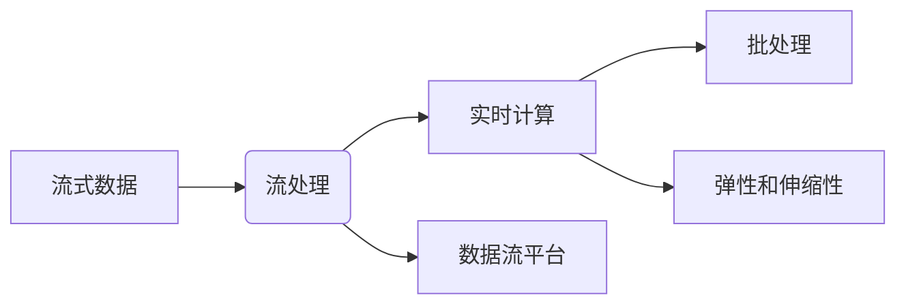

# 【AI大数据计算原理与代码实例讲解】流处理

作者：禅与计算机程序设计艺术 / Zen and the Art of Computer Programming

## 1. 背景介绍

### 1.1 问题的由来

随着互联网和物联网的快速发展，数据量呈爆炸式增长。传统的批处理计算方式已无法满足实时性要求，流处理技术应运而生。流处理是一种能够对实时数据流进行快速处理和分析的计算范式，广泛应用于金融风控、网络安全、智能交通、智能医疗等场景。

### 1.2 研究现状

近年来，随着大数据处理技术的快速发展，流处理技术也取得了显著进展。主流的开源流处理框架包括Apache Kafka、Apache Flink、Apache Storm、Spark Streaming等。这些框架提供了丰富的流处理能力，能够实现数据的实时采集、传输、存储、处理和分析。

### 1.3 研究意义

流处理技术在人工智能领域具有广泛的应用前景。通过对实时数据流的快速处理和分析，可以帮助我们更好地了解用户行为、预测市场趋势、优化业务流程等。此外，流处理技术还可以与其他人工智能技术相结合，如机器学习、深度学习等，构建更加智能化的应用系统。

### 1.4 本文结构

本文将系统介绍流处理技术的原理、方法、应用场景和未来发展趋势。内容安排如下：

- 第2部分，介绍流处理的核心概念与联系。
- 第3部分，详细阐述流处理的核心算法原理和具体操作步骤。
- 第4部分，讲解流处理中的常见算法和框架，并结合实例进行分析。
- 第5部分，给出流处理的应用案例和代码实例。
- 第6部分，探讨流处理技术的未来发展趋势与挑战。
- 第7部分，推荐流处理相关的学习资源、开发工具和参考文献。
- 第8部分，总结全文，展望流处理技术的未来发展趋势与挑战。
- 第9部分，提供常见问题与解答。

## 2. 核心概念与联系

为更好地理解流处理技术，本节将介绍几个核心概念：

- 流式数据(Streaming Data)：指按时间顺序连续产生的数据，如传感器数据、网络流量数据、日志数据等。
- 流处理(Stream Processing)：指对实时数据流进行快速处理和分析的计算范式。
- 批处理(Batch Processing)：指将数据集划分为多个批次，逐一进行处理和分析的计算范式。
- 数据流平台(Data Streaming Platform)：指提供数据采集、传输、存储、处理和分析功能的平台，如Apache Kafka、Apache Flink等。
- 实时计算(Real-Time Computing)：指在短时间内对数据进行处理和分析的计算范式，如流处理。
- 弹性伸缩(Elastic Scaling)：指根据系统负载动态调整资源规模的能力，如CPU、内存、存储等。

它们的逻辑关系如下图所示：



可以看出，流式数据经过流处理平台进行实时处理和分析，形成实时计算结果。实时计算可以与批处理进行结合，形成更加灵活的计算范式。同时，流处理平台需要具备弹性伸缩能力，以应对数据量波动和系统负载变化。

## 3. 核心算法原理 & 具体操作步骤

### 3.1 算法原理概述

流处理的核心思想是将数据流划分为多个时间窗口进行处理，每个时间窗口内的数据被当作一个批处理任务进行处理。常见的窗口类型包括滑动窗口、固定窗口、会话窗口等。

- 滑动窗口(Sliding Window)：指在数据流中以固定的时间间隔滑动窗口，对每个窗口内的数据进行处理。滑动窗口可以进一步细分为固定步长滑动窗口和固定时间间隔滑动窗口。
- 固定窗口(Fixed Window)：指在数据流中以固定的时间长度划分窗口，对每个窗口内的数据进行处理。
- 会话窗口(Session Window)：指根据用户行为序列的特定模式划分窗口，对每个窗口内的数据进行处理。

### 3.2 算法步骤详解

流处理算法的步骤通常包括以下几个关键环节：

**Step 1: 数据采集与传输**

- 使用传感器、网络爬虫等手段采集实时数据。
- 使用数据采集工具(如Flume、Kafka等)将采集到的数据传输到数据流平台。

**Step 2: 数据存储**

- 将数据存储到分布式存储系统(如HDFS、Cassandra等)。

**Step 3: 数据预处理**

- 对采集到的数据进行清洗、转换等预处理操作，保证数据质量。

**Step 4: 数据处理**

- 使用流处理框架对数据进行实时处理和分析。
- 根据窗口类型，将数据划分为不同的窗口进行计算。

**Step 5: 数据输出**

- 将处理结果存储到数据库、文件系统等存储系统。
- 将处理结果输出到监控平台、可视化平台等。

### 3.3 算法优缺点

流处理算法具有以下优点：

1. 实时性：能够对实时数据流进行快速处理和分析，满足实时性要求。
2. 高效性：能够并行处理大量数据，提高数据处理效率。
3. 可扩展性：能够根据数据量动态调整资源规模，满足不同场景的需求。

流处理算法也存在以下局限性：

1. 复杂度：流处理算法相对复杂，需要具备一定的编程能力。
2. 资源消耗：流处理需要大量的计算资源和存储资源。
3. 容错性：流处理系统需要具备一定的容错能力，以保证系统的高可用性。

### 3.4 算法应用领域

流处理算法在以下领域得到广泛应用：

- 金融风控：实时监控交易数据，发现异常交易行为，防止欺诈。
- 网络安全：实时检测网络流量，发现恶意攻击行为，保障网络安全。
- 智能交通：实时监控交通流量，优化交通信号灯，提高道路通行效率。
- 智能医疗：实时监测患者生命体征，及时发现异常情况，保障患者安全。
- 智能推荐：实时分析用户行为，推荐个性化内容，提升用户体验。

## 4. 数学模型和公式 & 详细讲解 & 举例说明

### 4.1 数学模型构建

流处理中的数学模型主要包括窗口函数、统计模型等。

- 窗口函数：用于划分时间窗口，常见的窗口函数包括滑动窗口函数、固定窗口函数和会话窗口函数。
- 统计模型：用于对数据进行统计分析和计算，常见的统计模型包括均值、方差、标准差等。

### 4.2 公式推导过程

以下以滑动窗口函数为例，介绍其公式推导过程。

假设数据流中第 $i$ 个数据点的值为 $x_i$，滑动窗口的长度为 $n$，步长为 $k$。则滑动窗口函数 $f(n,k)$ 可以表示为：

$$
f(n,k) = \sum_{i=n-k+1}^{n} x_i
$$

### 4.3 案例分析与讲解

以下以金融风控场景为例，介绍流处理在金融风控中的应用。

假设银行希望实时监控交易数据，发现异常交易行为，防止欺诈。可以使用以下步骤进行流处理：

1. 使用数据采集工具(如Flume)采集交易数据。
2. 使用流处理框架(如Apache Flink)对交易数据进行实时处理，包括以下步骤：
   - 使用滑动窗口函数将交易数据按时间窗口进行划分。
   - 对每个时间窗口内的交易数据进行统计分析，如计算交易金额、交易次数、交易频率等。
   - 使用机器学习算法对交易数据进行分类，识别异常交易行为。
3. 将处理结果输出到监控平台，实时展示异常交易数据。

### 4.4 常见问题解答

**Q1：流处理与批处理有何区别？**

A: 流处理和批处理的主要区别在于处理数据的实时性。流处理能够对实时数据流进行快速处理和分析，满足实时性要求；而批处理则将数据集划分为多个批次进行处理，无法满足实时性要求。

**Q2：流处理框架如何保证数据一致性？**

A: 流处理框架通常采用分布式架构，通过数据分区、分布式锁等技术保证数据一致性。此外，还可以使用消息队列等中间件来保证数据传输的可靠性和一致性。

**Q3：流处理算法如何应对海量数据？**

A: 流处理算法可以采用并行计算、分布式计算等技术来应对海量数据。同时，还可以使用数据压缩、数据抽样等技术来降低数据存储和传输的负担。

## 5. 项目实践：代码实例和详细解释说明

### 5.1 开发环境搭建

以下以Apache Flink为例，介绍流处理项目的开发环境搭建。

1. 下载Flink官方安装包：https://flink.apache.org/download/
2. 解压安装包，进入bin目录，运行以下命令启动Flink集群：
```
./start-cluster.sh
```
3. 启动Flink客户端：
```
./start-client.sh
```
4. 在Flink客户端中编写流处理程序。

### 5.2 源代码详细实现

以下以Apache Flink为例，给出一个简单的流处理程序示例。

```java
import org.apache.flink.api.common.functions.MapFunction;
import org.apache.flink.streaming.api.datastream.DataStream;
import org.apache.flink.streaming.api.environment.StreamExecutionEnvironment;

public class StreamProcessingExample {
    public static void main(String[] args) throws Exception {
        // 创建Flink执行环境
        StreamExecutionEnvironment env = StreamExecutionEnvironment.getExecutionEnvironment();

        // 创建数据源
        DataStream<String> dataStream = env.fromElements("Hello", "World", "Flink");

        // 处理数据
        DataStream<String> processedDataStream = dataStream.map(new MapFunction<String, String>() {
            @Override
            public String map(String value) throws Exception {
                return value.toUpperCase();
            }
        });

        // 输出结果
        processedDataStream.print();

        // 执行程序
        env.execute("Stream Processing Example");
    }
}
```

### 5.3 代码解读与分析

以上代码示例展示了如何使用Apache Flink进行简单的流处理。

- 首先，创建Flink执行环境`StreamExecutionEnvironment`。
- 然后，创建数据源`DataStream<String>`，这里使用`fromElements`方法创建一个包含三个字符串的数据流。
- 接下来，使用`map`方法对数据流进行处理，将字符串转换为大写。
- 最后，使用`print`方法将处理后的数据流输出到控制台，并执行程序。

### 5.4 运行结果展示

在Flink客户端运行以上程序后，输出结果如下：

```
HELLO
WORLD
FLINK
```

## 6. 实际应用场景

### 6.1 金融风控

在金融风控领域，流处理技术可以用于实时监控交易数据，发现异常交易行为，防止欺诈。

- 通过实时分析交易数据，可以及时发现异常交易行为，如洗钱、欺诈等。
- 可以根据交易行为模式、用户画像等信息，建立风控模型，对交易进行风险评估。

### 6.2 网络安全

在网络安全领域，流处理技术可以用于实时监控网络流量，发现恶意攻击行为，保障网络安全。

- 通过实时分析网络流量，可以及时发现恶意攻击行为，如DDoS攻击、入侵等。
- 可以根据攻击特征、网络流量模式等信息，建立安全模型，对网络流量进行安全评估。

### 6.3 智能交通

在智能交通领域，流处理技术可以用于实时监控交通流量，优化交通信号灯，提高道路通行效率。

- 通过实时分析交通流量数据，可以及时发现交通拥堵、交通事故等情况。
- 可以根据交通流量数据，动态调整交通信号灯，优化道路通行效率。

### 6.4 未来应用展望

随着流处理技术的不断发展，其在人工智能领域的应用前景将更加广阔。

- 与机器学习、深度学习等人工智能技术相结合，可以构建更加智能化的应用系统。
- 可以应用于更多领域，如智能医疗、智能推荐、智能客服等。
- 可以与云计算、物联网等技术相结合，构建更加智能化的基础设施。

## 7. 工具和资源推荐

### 7.1 学习资源推荐

- Apache Flink官方文档：https://flink.apache.org/docs/
- Apache Kafka官方文档：https://kafka.apache.org/documentation/
- Spark Streaming官方文档：https://spark.apache.org/docs/latest/streaming/

### 7.2 开发工具推荐

- IntelliJ IDEA：https://www.jetbrains.com/idea/
- PyCharm：https://www.jetbrains.com/pycharm/
- Visual Studio Code：https://code.visualstudio.com/

### 7.3 相关论文推荐

-实时数据处理框架Apache Kafka：https://www.cs.cornell.edu/~azhu/papers/kafka.pdf
-流处理框架Apache Flink：https://link.springer.com/chapter/10.1007/978-3-319-91341-6_5
-流处理框架Apache Storm：https://www.cs.cmu.edu/~binglin/papers/streaming-ml-storm.pdf
-流处理框架Apache Spark Streaming：https://arxiv.org/abs/1409.5597

### 7.4 其他资源推荐

- 阿里云流处理平台：https://www.aliyun.com/product/stream computing
- 百度智能云流处理平台：https://cloud.baidu.com/product/streaming.html
- 腾讯云流处理平台：https://cloud.tencent.com/product/tcsp

## 8. 总结：未来发展趋势与挑战

### 8.1 研究成果总结

本文对流处理技术进行了系统介绍，包括其背景、原理、方法、应用场景和未来发展趋势。通过对流处理技术的深入探讨，我们可以看到，流处理技术在人工智能领域具有广阔的应用前景。

### 8.2 未来发展趋势

- 流处理技术与人工智能、云计算、物联网等技术的深度融合，将推动流处理技术的发展。
- 开发更加高效、可扩展、易用的流处理框架，降低流处理技术的使用门槛。
- 流处理技术将应用于更多领域，为各行各业带来创新和发展。

### 8.3 面临的挑战

- 流处理技术需要面对海量数据、实时性、可靠性、安全性等挑战。
- 需要解决流处理算法的复杂度问题，提高算法效率和可扩展性。
- 需要加强流处理技术的标准化和开源生态建设。

### 8.4 研究展望

随着流处理技术的不断发展，相信其在人工智能领域的应用将会更加广泛，为人类社会带来更多便利和进步。

## 9. 附录：常见问题与解答

**Q1：流处理与批处理有何区别？**

A: 流处理和批处理的主要区别在于处理数据的实时性。流处理能够对实时数据流进行快速处理和分析，满足实时性要求；而批处理则将数据集划分为多个批次进行处理，无法满足实时性要求。

**Q2：流处理框架如何保证数据一致性？**

A: 流处理框架通常采用分布式架构，通过数据分区、分布式锁等技术保证数据一致性。此外，还可以使用消息队列等中间件来保证数据传输的可靠性和一致性。

**Q3：流处理算法如何应对海量数据？**

A: 流处理算法可以采用并行计算、分布式计算等技术来应对海量数据。同时，还可以使用数据压缩、数据抽样等技术来降低数据存储和传输的负担。

**Q4：流处理技术有哪些应用场景？**

A: 流处理技术在金融风控、网络安全、智能交通、智能医疗、智能推荐等领域得到广泛应用。

**Q5：如何选择合适的流处理框架？**

A: 选择合适的流处理框架需要考虑以下因素：

- 数据规模：选择能够处理相应数据规模的流处理框架。
- 实时性要求：选择能够满足实时性要求的流处理框架。
- 易用性：选择易于开发和维护的流处理框架。
- 功能需求：选择满足特定功能需求的流处理框架。

作者：禅与计算机程序设计艺术 / Zen and the Art of Computer Programming