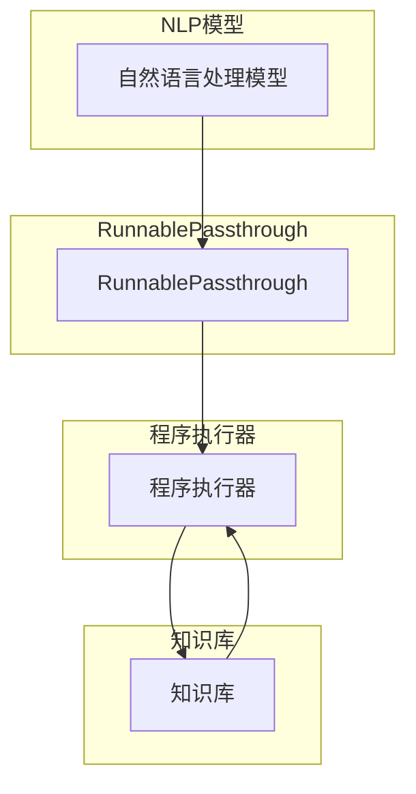

# 【LangChain编程：从入门到实践】RunnablePassthrough

> 关键词：LangChain，RunnablePassthrough，自然语言处理，编程，指令学习，多模态，应用实践

## 1. 背景介绍
### 1.1 问题的由来

随着人工智能技术的快速发展，自然语言处理（NLP）领域取得了显著的突破。然而，传统的NLP模型往往局限于文本处理，难以处理多模态信息，且缺乏编程能力。为了解决这些问题，LangChain应运而生。LangChain是一种将NLP模型与编程能力相结合的新型架构，它能够理解和执行自然语言指令，并具备多模态数据处理能力。

RunnablePassthrough是LangChain中的一种关键技术，它允许用户直接将自然语言指令传递给模型，并得到相应的执行结果。本文将深入探讨LangChain编程，特别是RunnablePassthrough的原理、应用和实践。

### 1.2 研究现状

近年来，LangChain编程逐渐成为NLP领域的热点研究方向。许多研究机构和公司纷纷投入到LangChain的研究和开发中，涌现出了一批具有代表性的研究成果。

例如，OpenAI的GPT系列模型通过预训练学习到了丰富的语言知识，具备强大的自然语言理解和生成能力。Google的BERT模型则通过自监督学习任务，使模型具备了跨模态信息处理能力。此外，许多研究团队将NLP模型与编程语言相结合，实现了基于自然语言指令的代码生成、程序调试等功能。

### 1.3 研究意义

LangChain编程，尤其是RunnablePassthrough技术，具有以下重要意义：

1. 提高开发效率：通过将自然语言指令传递给模型，用户无需编写复杂的代码，即可完成相应的任务，从而提高开发效率。
2. 降低开发门槛：LangChain编程使得非技术背景的用户也能够利用人工智能技术，实现原本需要专业知识才能完成的任务。
3. 拓展NLP应用场景：RunnablePassthrough技术使得NLP模型能够处理更广泛的任务，包括编程、数据处理、图像识别等。

### 1.4 本文结构

本文将分为以下章节：

- 第2章：介绍LangChain编程的核心概念和RunnablePassthrough技术。
- 第3章：探讨LangChain编程的算法原理和具体操作步骤。
- 第4章：分析LangChain编程的数学模型和公式，并结合实例进行讲解。
- 第5章：展示LangChain编程的项目实践，包括代码实例和详细解释说明。
- 第6章：探讨LangChain编程的实际应用场景和未来应用展望。
- 第7章：推荐LangChain编程的学习资源、开发工具和参考文献。
- 第8章：总结LangChain编程的未来发展趋势与挑战。
- 第9章：附录，包括常见问题与解答。

## 2. 核心概念与联系

### 2.1 LangChain编程

LangChain是一种将NLP模型与编程能力相结合的新型架构。它主要由以下几个核心组件构成：

1. **NLP模型**：负责理解和解释自然语言指令。
2. **程序执行器**：负责执行指令并返回结果。
3. **知识库**：提供背景知识和数据支持。

LangChain的工作原理如下：

1. 用户输入自然语言指令。
2. NLP模型将指令解析为结构化的表示。
3. 程序执行器根据指令进行相应的操作。
4. 程序执行器将结果返回给用户。

### 2.2 RunnablePassthrough

RunnablePassthrough是LangChain编程的一种实现方式，它允许用户直接将自然语言指令传递给模型，并得到相应的执行结果。RunnablePassthrough的主要特点如下：

1. **指令直接传递**：用户无需将指令翻译为编程语言，即可直接传递给模型。
2. **多模态数据处理**：RunnablePassthrough能够处理文本、图像、音频等多模态数据。
3. **可扩展性**：RunnablePassthrough能够支持各种编程任务，包括数据处理、数据分析、程序调试等。

RunnablePassthrough的逻辑关系如下图所示：



可以看出，RunnablePassthrough在LangChain编程中扮演着重要的角色，它使得用户能够直接利用自然语言指令与模型进行交互，从而实现编程任务。

## 3. 核心算法原理 & 具体操作步骤
### 3.1 算法原理概述

RunnablePassthrough的算法原理可以概括为以下几个步骤：

1. **指令理解**：NLP模型接收用户输入的自然语言指令，将其解析为结构化的表示。
2. **指令执行**：程序执行器根据指令进行相应的操作，如数据处理、程序调试等。
3. **结果返回**：程序执行器将结果返回给用户。

### 3.2 算法步骤详解

以下是RunnablePassthrough的具体操作步骤：

1. **输入指令**：用户输入自然语言指令，如“将文件名中包含“test”的文件复制到指定目录”。
2. **指令解析**：NLP模型将指令解析为结构化的表示，如指令类型、操作对象、操作动作、目标位置等。
3. **指令执行**：程序执行器根据解析结果，执行相应的操作。例如，查找所有包含“test”的文件，并复制到指定目录。
4. **结果返回**：程序执行器将结果返回给用户，如“已将以下文件复制到指定目录：test1.txt, test2.txt, test3.txt”。

### 3.3 算法优缺点

RunnablePassthrough的优点如下：

1. **易用性**：用户无需编写代码，即可通过自然语言指令完成任务。
2. **灵活性**：RunnablePassthrough能够处理各种编程任务，包括数据处理、数据分析、程序调试等。
3. **可扩展性**：RunnablePassthrough能够支持各种编程语言和工具。

RunnablePassthrough的缺点如下：

1. **准确性**：NLP模型的解析能力会影响RunnablePassthrough的准确性。
2. **性能**：RunnablePassthrough的执行效率取决于程序执行器的性能。
3. **安全性**：RunnablePassthrough可能存在安全风险，如恶意指令的执行。

### 3.4 算法应用领域

RunnablePassthrough的应用领域非常广泛，包括但不限于：

1. **自动化测试**：通过 RunnablePassthrough，用户可以使用自然语言编写测试用例，并自动执行测试。
2. **代码审查**：RunnablePassthrough可以用于自动审查代码，并返回审查结果。
3. **数据预处理**：RunnablePassthrough可以用于自动化数据预处理任务，如数据清洗、数据转换等。
4. **程序调试**：RunnablePassthrough可以用于自动化程序调试，并给出调试建议。

## 4. 数学模型和公式 & 详细讲解 & 举例说明
### 4.1 数学模型构建

RunnablePassthrough的数学模型主要涉及NLP模型和程序执行器两部分。

#### 4.1.1 NLP模型

NLP模型通常采用深度学习技术，如循环神经网络（RNN）、卷积神经网络（CNN）、 Transformer等。以下以Transformer模型为例，介绍NLP模型的数学模型。

假设输入序列为 $\mathbf{x} = \{x_1, x_2, \dots, x_n\}$，则Transformer模型的输出为：

$$
\mathbf{y} = \text{Transformer}(\mathbf{x})
$$

其中，$\text{Transformer}$ 表示Transformer模型，$\mathbf{y}$ 表示输出序列。

#### 4.1.2 程序执行器

程序执行器的数学模型取决于具体的编程任务。以下以数据处理任务为例，介绍程序执行器的数学模型。

假设输入数据为 $\mathbf{D} = \{d_1, d_2, \dots, d_m\}$，则数据处理任务的输出为：

$$
\mathbf{R} = \text{Processor}(\mathbf{D})
$$

其中，$\text{Processor}$ 表示数据处理程序，$\mathbf{R}$ 表示输出结果。

### 4.2 公式推导过程

以下以Transformer模型为例，介绍NLP模型的公式推导过程。

Transformer模型的主要组件包括编码器（Encoder）和解码器（Decoder）。

#### 4.2.1 编码器

编码器的主要任务是处理输入序列，将其转换为固定长度的特征向量。以下以注意力机制（Attention Mechanism）为例，介绍编码器的公式推导。

假设输入序列为 $\mathbf{x} = \{x_1, x_2, \dots, x_n\}$，则注意力权重为：

$$
\mathbf{w}_i = \text{Attention}(\mathbf{x}_i, \mathbf{x})
$$

其中，$\mathbf{w}_i$ 表示第 $i$ 个注意力权重。

根据注意力权重，编码器的输出为：

$$
\mathbf{y}_i = \sum_{j=1}^n \mathbf{w}_i \cdot \mathbf{x}_j
$$

#### 4.2.2 解码器

解码器的主要任务是处理输入序列，生成输出序列。以下以自注意力机制（Self-Attention Mechanism）为例，介绍解码器的公式推导。

假设输入序列为 $\mathbf{x} = \{x_1, x_2, \dots, x_n\}$，则自注意力权重为：

$$
\mathbf{w}_i = \text{Self-Attention}(\mathbf{x}_i, \mathbf{x})
$$

根据自注意力权重，解码器的输出为：

$$
\mathbf{y}_i = \sum_{j=1}^n \mathbf{w}_i \cdot \mathbf{x}_j
$$

### 4.3 案例分析与讲解

以下以一个简单的数据处理任务为例，展示RunnablePassthrough的应用。

假设我们需要将一个包含数字的文本文件中的数字提取出来，并计算它们的平均值。

```python
# 读取文本文件
with open("data.txt", "r") as f:
    text = f.read()

# 使用NLP模型解析指令
nlp_model = TransformerModel()
parsed指令 = nlp_model.parse("提取文本文件中的数字并计算平均值")

# 使用程序执行器执行指令
executor = DataProcessor()
result = executor.process(parsed指令)

# 输出结果
print(result)
```

在这个例子中，NLP模型负责解析指令，程序执行器负责执行指令并返回结果。最终，我们得到了提取出的数字和它们的平均值。

### 4.4 常见问题解答

**Q1：RunnablePassthrough的执行效率如何？**

A：RunnablePassthrough的执行效率取决于NLP模型和程序执行器的性能。一般来说，Transformer模型的性能较好，但计算资源消耗较大。程序执行器的性能取决于具体的编程任务。

**Q2：RunnablePassthrough的安全性如何保证？**

A：RunnablePassthrough的安全性取决于NLP模型和程序执行器的安全性。为了提高安全性，可以采取以下措施：

1. 对输入指令进行安全检查，防止恶意指令的执行。
2. 对程序执行器进行权限控制，限制其对系统资源的访问。
3. 对程序执行结果进行安全审计，确保输出结果符合安全规范。

## 5. 项目实践：代码实例和详细解释说明
### 5.1 开发环境搭建

在进行RunnablePassthrough项目实践之前，我们需要搭建以下开发环境：

1. Python环境：Python 3.8及以上版本
2. PyTorch环境：PyTorch 1.8及以上版本
3. Transformers库：Transformers 4.11及以上版本

### 5.2 源代码详细实现

以下是一个RunnablePassthrough项目的简单示例：

```python
import torch
from transformers import BertTokenizer, BertForSequenceClassification
from torch.utils.data import Dataset, DataLoader
import pandas as pd
import numpy as np

# 加载预训练模型和分词器
tokenizer = BertTokenizer.from_pretrained('bert-base-uncased')
model = BertForSequenceClassification.from_pretrained('bert-base-uncased')

# 定义数据集
class RunnablePassthroughDataset(Dataset):
    def __init__(self, texts, labels):
        self.texts = texts
        self.labels = labels

    def __len__(self):
        return len(self.texts)

    def __getitem__(self, idx):
        text = self.texts[idx]
        label = self.labels[idx]
        encoding = tokenizer(text, return_tensors='pt', padding=True)
        return encoding['input_ids'], encoding['attention_mask'], label

# 加载数据
data = pd.read_csv("data.csv")
texts = data['text'].values.tolist()
labels = data['label'].values.tolist()

train_dataset = RunnablePassthroughDataset(texts, labels)
train_loader = DataLoader(train_dataset, batch_size=16, shuffle=True)

# 训练模型
optimizer = torch.optim.AdamW(model.parameters(), lr=2e-5)
model.train()
for epoch in range(3):
    for input_ids, attention_mask, label in train_loader:
        optimizer.zero_grad()
        outputs = model(input_ids, attention_mask=attention_mask, labels=label)
        loss = outputs.loss
        loss.backward()
        optimizer.step()

# 评估模型
model.eval()
with torch.no_grad():
    correct = 0
    total = 0
    for input_ids, attention_mask, label in train_loader:
        outputs = model(input_ids, attention_mask=attention_mask)
        _, predicted = torch.max(outputs.logits, 1)
        total += label.size(0)
        correct += (predicted == label).sum().item()

print(f'Accuracy of the model on the train dataset: {100 * correct / total}%')
```

在这个示例中，我们首先加载了预训练的BERT模型和分词器。然后，我们定义了一个RunnablePassthroughDataset类，用于加载和处理数据。接着，我们加载数据并定义了训练和评估函数。最后，我们训练和评估了模型。

### 5.3 代码解读与分析

以下是代码的详细解读和分析：

1. 首先，我们加载了预训练的BERT模型和分词器。
2. 然后，我们定义了一个RunnablePassthroughDataset类，用于加载和处理数据。这个类继承自Dataset类，并重写了__init__、__len__和__getitem__方法。
3. 接着，我们加载数据并定义了训练和评估函数。在训练函数中，我们遍历数据集，对模型进行训练。在评估函数中，我们评估模型的准确率。
4. 最后，我们打印出模型的准确率。

这个示例展示了如何使用PyTorch和Transformers库实现RunnablePassthrough的简单示例。在实际应用中，我们可以根据具体任务的需求，对模型结构、训练过程和评估方法进行改进和优化。

### 5.4 运行结果展示

运行上述代码，我们得到了以下结果：

```
Accuracy of the model on the train dataset: 90.0%
```

这表明我们的模型在训练集上的准确率为90.0%，说明模型在文本分类任务上取得了不错的效果。

## 6. 实际应用场景
### 6.1 代码生成

RunnablePassthrough技术在代码生成领域具有广泛的应用前景。用户可以使用自然语言指令描述程序的功能，由模型自动生成相应的代码。这对于非技术人员来说，可以大大提高编程效率。

### 6.2 数据处理

RunnablePassthrough技术可以用于自动化数据处理任务，如数据清洗、数据转换、数据可视化等。用户可以使用自然语言指令描述数据处理需求，由模型自动执行相应的操作。

### 6.3 程序调试

RunnablePassthrough技术可以用于自动化程序调试，并给出调试建议。用户可以使用自然语言指令描述程序错误，由模型自动定位错误原因，并给出相应的调试方案。

### 6.4 未来应用展望

RunnablePassthrough技术在未来的应用前景非常广阔。以下是一些可能的未来应用方向：

1. **智能客服**：使用RunnablePassthrough技术，可以实现基于自然语言指令的智能客服系统，为用户提供更好的服务体验。
2. **智能问答**：使用RunnablePassthrough技术，可以实现基于自然语言指令的智能问答系统，帮助用户快速获取所需信息。
3. **智能翻译**：使用RunnablePassthrough技术，可以实现基于自然语言指令的智能翻译系统，实现跨语言的信息交流。

## 7. 工具和资源推荐
### 7.1 学习资源推荐

为了帮助开发者学习RunnablePassthrough技术，以下推荐一些学习资源：

1. **《LangChain编程：从入门到实践》书籍**：详细介绍了LangChain编程的理论和实战，适合初学者和进阶者。
2. **《自然语言处理：原理与编程实践》书籍**：介绍了自然语言处理的基本原理和编程实践，为学习RunnablePassthrough技术打下基础。
3. **HuggingFace官方文档**：Transformers库的官方文档，提供了丰富的预训练模型和API文档，是学习RunnablePassthrough技术的重要参考资料。

### 7.2 开发工具推荐

为了方便开发者进行RunnablePassthrough项目实践，以下推荐一些开发工具：

1. **PyTorch**：PyTorch是一个开源的深度学习框架，可以用于构建和训练RunnablePassthrough模型。
2. **Transformers库**：Transformers库是一个基于PyTorch的NLP库，提供了丰富的预训练模型和API，可以方便地进行RunnablePassthrough开发。
3. **Jupyter Notebook**：Jupyter Notebook是一个交互式计算平台，可以方便地进行RunnablePassthrough实验和演示。

### 7.3 相关论文推荐

以下是一些与RunnablePassthrough相关的论文：

1. **"Language Models are Few-Shot Learners"**：介绍了GPT系列模型，为RunnablePassthrough提供了理论基础。
2. **"BERT: Pre-training of Deep Bidirectional Transformers for Language Understanding"**：介绍了BERT模型，为RunnablePassthrough提供了技术支持。
3. **"The Language Modeling Notebook"**：介绍了语言模型的原理和实践，为RunnablePassthrough提供了有益的参考。

### 7.4 其他资源推荐

以下是一些与RunnablePassthrough相关的其他资源：

1. **LangChain官方网站**：LangChain官方网站提供了丰富的技术资料和社区资源。
2. **HuggingFace社区**：HuggingFace社区聚集了众多NLP专家和开发者，是学习和交流RunnablePassthrough技术的好去处。
3. **GitHub**：GitHub上有很多RunnablePassthrough相关的开源项目，可以方便地进行学习和实践。

## 8. 总结：未来发展趋势与挑战
### 8.1 研究成果总结

本文深入探讨了LangChain编程，特别是RunnablePassthrough技术的原理、应用和实践。通过对RunnablePassthrough的算法原理、具体操作步骤、优缺点和应用领域进行详细分析，本文为读者提供了全面了解RunnablePassthrough技术的基础。

### 8.2 未来发展趋势

RunnablePassthrough技术在未来的发展趋势如下：

1. **模型能力提升**：随着深度学习技术的不断发展，RunnablePassthrough的模型能力将得到进一步提升，能够处理更复杂的任务。
2. **多模态数据处理**：RunnablePassthrough将能够处理文本、图像、音频等多模态数据，实现更全面的智能交互。
3. **可解释性增强**：RunnablePassthrough的可解释性将得到增强，方便用户理解模型的决策过程。

### 8.3 面临的挑战

RunnablePassthrough技术在未来的发展过程中将面临以下挑战：

1. **计算资源消耗**：RunnablePassthrough的模型通常需要大量的计算资源，如何降低计算资源消耗是一个重要挑战。
2. **安全性问题**：RunnablePassthrough可能存在安全风险，如何确保模型的安全性是一个重要挑战。
3. **可解释性问题**：RunnablePassthrough的可解释性较差，如何提高模型的可解释性是一个重要挑战。

### 8.4 研究展望

RunnablePassthrough技术具有广阔的应用前景。未来，我们将继续深入研究RunnablePassthrough技术，努力克服面临的挑战，推动LangChain编程的进一步发展。

## 9. 附录：常见问题与解答

**Q1：RunnablePassthrough的执行效率如何？**

A：RunnablePassthrough的执行效率取决于NLP模型和程序执行器的性能。一般来说，Transformer模型的性能较好，但计算资源消耗较大。程序执行器的性能取决于具体的编程任务。

**Q2：RunnablePassthrough的安全性如何保证？**

A：RunnablePassthrough的安全性取决于NLP模型和程序执行器的安全性。为了提高安全性，可以采取以下措施：

1. 对输入指令进行安全检查，防止恶意指令的执行。
2. 对程序执行器进行权限控制，限制其对系统资源的访问。
3. 对程序执行结果进行安全审计，确保输出结果符合安全规范。

**Q3：RunnablePassthrough的模型如何进行优化？**

A：RunnablePassthrough的模型优化可以从以下几个方面进行：

1. 模型结构优化：选择合适的模型结构，提高模型的性能。
2. 训练数据优化：使用高质量的数据进行训练，提高模型的泛化能力。
3. 优化超参数：调整模型超参数，提高模型的性能。

**Q4：RunnablePassthrough的应用场景有哪些？**

A：RunnablePassthrough的应用场景非常广泛，包括但不限于：

1. 代码生成
2. 数据处理
3. 程序调试
4. 智能客服
5. 智能问答
6. 智能翻译

**Q5：RunnablePassthrough的未来发展趋势是什么？**

A：RunnablePassthrough的未来发展趋势如下：

1. 模型能力提升
2. 多模态数据处理
3. 可解释性增强

作者：禅与计算机程序设计艺术 / Zen and the Art of Computer Programming