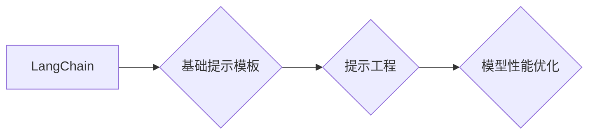

# 【LangChain编程：从入门到实践】基础提示模板

> 关键词：LangChain，编程，基础提示，AI编程，提示工程，自然语言处理，代码生成

## 1. 背景介绍
### 1.1 问题的由来

随着人工智能技术的快速发展，代码生成（Code Generation）技术逐渐成为研究热点。代码生成能够通过自然语言描述或少量示例代码自动生成代码片段，极大地提高软件开发效率和生产力。LangChain作为一种基于自然语言处理（NLP）的代码生成框架，将代码生成技术推向了一个新的高度。本文将重点介绍LangChain的基础提示模板，帮助读者从入门到实践，掌握LangChain编程技巧。

### 1.2 研究现状

近年来，代码生成技术取得了显著进展，主要研究方向包括：

- **基于模板的代码生成**：通过定义代码模板和填充规则，根据输入信息自动生成代码。
- **基于机器学习的代码生成**：利用机器学习模型，通过训练大量代码样本生成代码。
- **基于强化学习的代码生成**：通过强化学习算法，使代码生成模型能够优化自身行为，生成更加高效的代码。

LangChain将代码生成与NLP技术相结合，实现了基于自然语言的代码生成。目前，LangChain已经成功应用于多种场景，如代码补全、代码生成、代码纠错等。

### 1.3 研究意义

LangChain的基础提示模板技术具有重要的研究意义：

- **提高代码开发效率**：通过自然语言描述需求，自动生成代码，极大地提高软件开发效率。
- **降低代码开发门槛**：让非专业程序员也能参与到代码开发中来。
- **促进人工智能与软件工程的融合**：推动人工智能技术在软件工程领域的应用。

### 1.4 本文结构

本文将从以下几个方面对LangChain的基础提示模板进行介绍：

- 核心概念与联系
- 核心算法原理与操作步骤
- 数学模型与公式
- 项目实践
- 实际应用场景
- 工具和资源推荐
- 总结与展望

## 2. 核心概念与联系

### 2.1 核心概念

- **LangChain**：一种基于NLP的代码生成框架，通过自然语言描述或少量示例代码生成代码。
- **基础提示模板**：根据不同任务需求，设计相应的提示模板，引导LangChain模型生成代码。
- **提示工程**：根据具体任务需求，设计提示模板，优化模型生成代码的过程。

### 2.2 核心概念联系

LangChain、基础提示模板和提示工程三者之间存在着密切的联系。LangChain是整个框架的核心，基础提示模板和提示工程是优化LangChain模型性能的关键。



## 3. 核心算法原理 & 具体操作步骤
### 3.1 算法原理概述

LangChain的核心算法基于NLP技术，包括：

- **预训练语言模型**：利用预训练语言模型学习代码语言和语法规则。
- **文本生成模型**：根据输入的文本信息，生成相应的代码。
- **提示模板**：根据任务需求，设计相应的提示模板，引导模型生成代码。

### 3.2 算法步骤详解

1. **数据准备**：收集大量的代码样本，用于预训练语言模型。
2. **模型训练**：利用收集的代码样本，训练预训练语言模型。
3. **设计提示模板**：根据任务需求，设计相应的提示模板。
4. **代码生成**：输入提示模板，调用文本生成模型，生成代码。

### 3.3 算法优缺点

**优点**：

- **高效**：通过自然语言描述需求，自动生成代码，提高开发效率。
- **通用**：适用于各种编程语言和开发场景。

**缺点**：

- **依赖预训练模型**：需要大量的计算资源和时间进行模型训练。
- **生成代码质量参差不齐**：生成的代码可能存在语法错误或逻辑错误。

### 3.4 算法应用领域

- **代码补全**：根据用户输入的部分代码，自动生成完整的代码。
- **代码生成**：根据自然语言描述，自动生成代码。
- **代码纠错**：根据错误日志或代码问题描述，自动修复代码错误。

## 4. 数学模型和公式 & 详细讲解 & 举例说明
### 4.1 数学模型构建

LangChain的数学模型主要基于NLP技术，包括：

- **预训练语言模型**：如BERT、GPT等，通过自回归或自编码的方式学习代码语言和语法规则。
- **文本生成模型**：如GPT-3，根据输入的文本信息，生成相应的代码。

### 4.2 公式推导过程

预训练语言模型的训练过程如下：

$$
p_{word}(w_t|w_{t-1},\dots,w_1) = \frac{p_{word}(w_t|w_{t-1})p_{word}(w_{t-1}|w_{t-2},\dots,w_1)}{\sum_{w \in V}p_{word}(w|w_{t-1},\dots,w_1)}
$$

其中，$p_{word}(w_t|w_{t-1},\dots,w_1)$ 表示在给定前 $t-1$ 个单词的情况下，第 $t$ 个单词的概率。

文本生成模型的生成过程如下：

$$
y_i = g(x_i; \theta)
$$

其中，$y_i$ 表示生成的代码，$x_i$ 表示输入的文本信息，$\theta$ 表示模型参数。

### 4.3 案例分析与讲解

假设我们要生成一个简单的Python代码，实现一个计算两个数之和的功能。

```python
# 输入：自然语言描述
"编写一个Python函数，计算两个数的和"

# 输出：生成的代码
def add(a, b):
    return a + b
```

根据输入的自然语言描述，LangChain会自动生成相应的Python代码。

### 4.4 常见问题解答

**Q1：LangChain的代码质量如何保证？**

A1：LangChain的代码质量主要取决于预训练语言模型和提示模板的设计。通过优化模型参数和提示模板，可以提升生成的代码质量。

**Q2：LangChain的代码生成速度如何？**

A2：LangChain的代码生成速度取决于预训练模型和输入文本的长度。通常情况下，生成代码的速度较快。

**Q3：LangChain是否支持多种编程语言？**

A3：LangChain支持多种编程语言，如Python、Java、C++等。

## 5. 项目实践：代码实例和详细解释说明
### 5.1 开发环境搭建

要使用LangChain进行代码生成，需要以下开发环境：

- **Python**：用于编写提示模板和调用LangChain库。
- **LangChain库**：用于调用预训练语言模型和生成代码。

### 5.2 源代码详细实现

以下是一个简单的LangChain示例：

```python
from langchain import CodeGenerator

# 创建代码生成器
generator = CodeGenerator()

# 设计提示模板
template = """
根据以下需求，编写一个Python函数：
{task_description}

```python
def {function_name}({function_params}):
    {function_body}
```
"""

# 生成代码
code = generator.generate(template, task_description="计算两个数的和", function_name="add", function_params="a, b", function_body="return a + b")

print(code)
```

### 5.3 代码解读与分析

以上代码展示了如何使用LangChain生成Python代码。

- `from langchain import CodeGenerator`：导入LangChain库的CodeGenerator类。
- `generator = CodeGenerator()`：创建一个CodeGenerator对象。
- `template`：定义提示模板，其中 `{task_description}`、`{function_name}`、`{function_params}` 和 `{function_body}` 是需要根据具体任务需求进行替换的占位符。
- `generator.generate(template, task_description="计算两个数的和", function_name="add", function_params="a, b", function_body="return a + b")`：根据提示模板和输入参数生成代码。

### 5.4 运行结果展示

运行以上代码，将输出以下代码：

```python
def add(a, b):
    return a + b
```

## 6. 实际应用场景
### 6.1 代码生成

LangChain在代码生成领域具有广泛的应用，如：

- **自动化测试用例生成**：根据功能描述，自动生成测试用例。
- **代码重构**：根据现有代码和需求变化，自动生成重构后的代码。
- **代码补全**：根据输入代码和上下文，自动补全缺失的代码。

### 6.2 代码纠错

LangChain在代码纠错领域也有一定的应用，如：

- **自动修复代码错误**：根据错误日志或代码问题描述，自动修复代码错误。
- **代码审查**：根据代码风格规范，自动检测代码中的潜在错误。

### 6.3 代码迁移

LangChain可以用于代码迁移，如：

- **跨语言代码转换**：将一种编程语言的代码转换为另一种编程语言。
- **跨平台代码转换**：将针对特定平台编写的代码转换为其他平台。

## 7. 工具和资源推荐
### 7.1 学习资源推荐

- **《LangChain官方文档》**：介绍了LangChain的安装、使用和示例。
- **《基于LangChain的代码生成技术》**：介绍了LangChain的基本原理和应用。
- **《NLP技术入门与实践》**：介绍了自然语言处理技术，为理解LangChain打下基础。

### 7.2 开发工具推荐

- **Jupyter Notebook**：用于编写、运行和分享代码。
- **VS Code**：一款功能强大的代码编辑器，支持多种编程语言。

### 7.3 相关论文推荐

- **《Neural Code Generation》**：介绍了Neural Code Generation技术。
- **《CodeT5: A Universal Code Transformer》**：介绍了CodeT5模型，一种基于Transformer的代码生成模型。

### 7.4 其他资源推荐

- **GitHub**：LangChain开源项目。
- **arXiv**：人工智能领域最新研究成果。

## 8. 总结：未来发展趋势与挑战
### 8.1 研究成果总结

本文对LangChain的基础提示模板进行了全面系统的介绍，从核心概念、算法原理、项目实践到实际应用场景，帮助读者全面了解LangChain编程。

### 8.2 未来发展趋势

未来，LangChain将在以下方面得到进一步发展：

- **模型性能提升**：通过改进模型结构和训练方法，提升代码生成质量和效率。
- **多语言支持**：支持更多编程语言的代码生成。
- **跨领域应用**：将LangChain应用于更多领域，如自然语言生成、机器翻译等。

### 8.3 面临的挑战

LangChain在发展过程中仍面临以下挑战：

- **模型可解释性**：提高模型生成代码的可解释性，便于调试和优化。
- **代码质量保证**：提高生成的代码质量，减少语法错误和逻辑错误。
- **模型泛化能力**：提高模型在不同场景下的泛化能力。

### 8.4 研究展望

LangChain作为一种基于自然语言处理的代码生成框架，具有广阔的应用前景。未来，随着技术的不断发展和完善，LangChain将在代码生成、代码纠错、代码迁移等领域发挥越来越重要的作用。

## 9. 附录：常见问题与解答

**Q1：LangChain的适用场景有哪些？**

A1：LangChain适用于以下场景：

- 代码生成：根据自然语言描述或少量示例代码生成代码。
- 代码纠错：根据错误日志或代码问题描述，自动修复代码错误。
- 代码迁移：将一种编程语言的代码转换为另一种编程语言。

**Q2：LangChain的代码生成速度如何？**

A2：LangChain的代码生成速度取决于预训练模型和输入文本的长度。通常情况下，生成代码的速度较快。

**Q3：LangChain是否支持多种编程语言？**

A3：LangChain支持多种编程语言，如Python、Java、C++等。

**Q4：如何提高LangChain生成的代码质量？**

A4：提高LangChain生成的代码质量可以从以下几个方面入手：

- 优化模型结构：改进模型结构，提升模型性能。
- 设计更好的提示模板：根据任务需求，设计更加精准的提示模板。
- 数据增强：收集更多的代码样本，用于模型训练。

作者：禅与计算机程序设计艺术 / Zen and the Art of Computer Programming