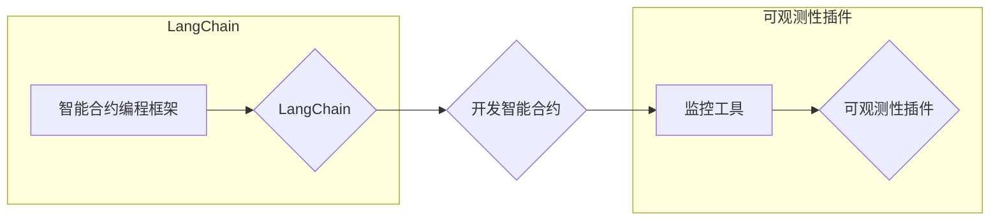
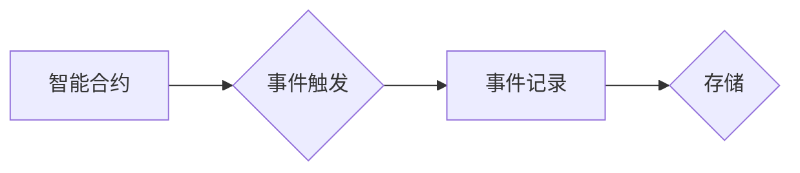

# 【LangChain编程：从入门到实践】实现可观测性插件

> 关键词：LangChain,可观测性插件,编程实践,智能合约,区块链,DeFi,Web3

## 1. 背景介绍
### 1.1 问题的由来

随着区块链技术的不断发展，DeFi（去中心化金融）领域涌现出大量创新应用。LangChain作为一种新兴的智能合约编程框架，以其简洁易懂的语法和强大的功能，受到了广大开发者的青睐。然而，在实际开发过程中，如何确保智能合约的安全、稳定和高效，成为一个亟待解决的问题。可观测性插件应运而生，它可以帮助开发者实时监控智能合约的运行状态，及时发现潜在问题，从而提升智能合约的质量和可靠性。

### 1.2 研究现状

目前，可观测性插件在区块链领域的应用还处于起步阶段，但已经有一些优秀的项目和实践。例如，Ethereum的OpenZeppelin框架提供了丰富的可观测性工具，如事件日志、监控服务等。此外，还有一些开源项目专注于可观测性插件的开发，如OpenSea的Monitor、Chainlink的Network Alerting等。

### 1.3 研究意义

实现可观测性插件对于区块链应用的开发和运维具有重要意义：

1. **提升智能合约安全性**：通过实时监控智能合约的运行状态，及时发现并修复潜在的安全漏洞，降低智能合约被攻击的风险。
2. **提高智能合约可靠性**：监控智能合约的性能、资源占用等信息，及时发现并解决运行时问题，确保智能合约的稳定运行。
3. **优化智能合约性能**：通过分析智能合约的执行效率，发现并优化性能瓶颈，提高智能合约的处理速度和资源利用率。
4. **降低运维成本**：通过自动化监控和报警机制，降低运维人员的工作量，提高运维效率。

### 1.4 本文结构

本文将系统地介绍LangChain编程和可观测性插件的实现方法，内容安排如下：

- 第2部分，介绍LangChain编程框架和可观测性插件的概念。
- 第3部分，阐述LangChain编程和可观测性插件的原理和关键技术。
- 第4部分，给出可观测性插件的代码实现示例。
- 第5部分，分析可观测性插件在实际应用中的案例。
- 第6部分，探讨可观测性插件的发展趋势和挑战。
- 第7部分，推荐可观测性插件相关的学习资源、开发工具和参考文献。
- 第8部分，总结全文，展望可观测性插件的未来发展趋势。

## 2. 核心概念与联系

### 2.1 LangChain编程

LangChain是一种基于区块链的智能合约编程框架，它使用类似于Python的语法，让开发者可以更容易地编写和部署智能合约。LangChain的核心思想是将智能合约的逻辑与区块链的底层机制解耦，使得开发者可以专注于业务逻辑的实现。

LangChain的关键特性包括：

- **简洁易懂的语法**：使用类似于Python的语法，降低智能合约编程的门槛。
- **丰富的内置函数**：提供大量内置函数，简化智能合约的开发流程。
- **跨平台支持**：支持多种主流区块链平台，如Ethereum、Binance Smart Chain等。

### 2.2 可观测性插件

可观测性插件是一种用于监控智能合约运行状态的工具，它可以收集智能合约的执行数据、交易信息、性能指标等，并提供可视化界面或API接口供开发者查询和分析。

可观测性插件的关键特性包括：

- **实时监控**：实时收集智能合约的运行状态，及时发现潜在问题。
- **数据可视化**：提供可视化界面，直观展示智能合约的运行情况。
- **报警机制**：根据预设的规则，对异常情况进行报警。

LangChain编程和可观测性插件之间的关系可以理解为：



LangChain框架可以用于开发智能合约，而可观测性插件则可以用于监控智能合约的运行状态，两者相辅相成，共同保障智能合约的质量和可靠性。

## 3. 核心算法原理 & 具体操作步骤
### 3.1 算法原理概述

可观测性插件的实现主要涉及以下关键技术：

- **事件日志**：记录智能合约的执行过程和结果。
- **性能监控**：收集智能合约的运行性能指标，如执行时间、资源占用等。
- **数据可视化**：将监控数据以图表、表格等形式展示。
- **报警机制**：根据预设的规则，对异常情况进行报警。

### 3.2 算法步骤详解

以下是以Ethereum为例，介绍可观测性插件的实现步骤：

**Step 1：部署智能合约**

首先，使用LangChain框架编写智能合约，并通过Ethereum的智能合约部署工具（如Truffle、Hardhat等）将智能合约部署到区块链上。

**Step 2：监听事件**

使用Web3.js等JavaScript库监听智能合约的事件日志，收集智能合约的执行数据和结果。

```javascript
const Web3 = require('web3');
const contractAbi = [
  {
    constant: false,
    inputs: [
      {
        name: "arg1",
        type: "uint256"
      },
      {
        name: "arg2",
        type: "uint256"
      }
    ],
    name: "myEvent",
    outputs: [
      {
        name: "result",
        type: "uint256"
      }
    ],
    payable: false,
    stateMutability: "nonpayable",
    type: "event"
  },
  ...
];

const contractAddress = '0x...';

const web3 = new Web3(new Web3.providers.HttpProvider('https://mainnet.infura.io/v3/...'));
const contract = new web3.eth.Contract(contractAbi, contractAddress);

contract.events.myEvent().on('data', function(event) {
  console.log(event);
});
```

**Step 3：性能监控**

使用Web3.js或其他监控工具收集智能合约的执行时间和资源占用等信息。

```javascript
// 监控执行时间
const start = Date.now();
contract.myFunction().then(result => {
  const end = Date.now();
  console.log(`Function execution time: ${end - start} ms`);
});

// 监控资源占用
const gasPrice = await web3.eth.getGasPrice();
const gasLimit = 100000;
const data = contract.methods.myFunction().encodeABI();
const tx = { to: contractAddress, from: web3.eth.defaultAccount, gas: gasLimit, gasPrice: gasPrice, data: data };
const receipt = await web3.eth.sendTransaction(tx);
```

**Step 4：数据可视化**

将监控数据存储到数据库或缓存中，并使用图表、表格等形式进行可视化展示。

**Step 5：报警机制**

根据预设的规则，对异常情况进行报警。

```javascript
// 监控执行时间
const start = Date.now();
contract.myFunction().then(result => {
  const end = Date.now();
  if (end - start > 1000) { // 超过1000ms则报警
    console.log('Function execution time is too long!');
  }
});
```

### 3.3 算法优缺点

可观测性插件的优点：

- **实时监控**：可以实时监控智能合约的运行状态，及时发现潜在问题。
- **数据可视化**：可以直观地展示智能合约的运行情况，方便开发者分析问题。
- **报警机制**：可以及时发现问题，降低损失。

可观测性插件的缺点：

- **开发成本**：需要开发人员具备一定的编程技能，开发成本较高。
- **维护成本**：需要持续维护监控工具和数据库，以保证其正常运行。
- **数据安全**：需要确保监控数据的安全，防止泄露敏感信息。

### 3.4 算法应用领域

可观测性插件在区块链领域的应用主要包括：

- **智能合约开发**：帮助开发者发现和修复智能合约中的安全问题。
- **智能合约运维**：监控智能合约的运行状态，及时发现并解决运行时问题。
- **区块链数据分析**：分析智能合约的运行数据和交易数据，为区块链应用提供决策依据。

## 4. 数学模型和公式 & 详细讲解 & 举例说明
### 4.1 数学模型构建

可观测性插件主要涉及以下数学模型：

- **事件日志模型**：用于记录智能合约的执行过程和结果。
- **性能监控模型**：用于收集和计算智能合约的运行性能指标。
- **可视化模型**：用于将监控数据以图表、表格等形式展示。

以下是一个简单的事件日志模型的示例：



### 4.2 公式推导过程

可观测性插件的主要工作是对智能合约的运行状态进行监控和记录，因此不需要进行复杂的数学推导。

### 4.3 案例分析与讲解

以下是一个使用可观测性插件监控智能合约执行时间的案例：

**案例背景**：一个智能合约用于处理用户转账请求，每个请求的处理时间不应超过1秒。

**实现步骤**：

1. **部署智能合约**：使用LangChain框架编写智能合约，并通过Ethereum的智能合约部署工具将智能合约部署到区块链上。
2. **监听事件**：使用Web3.js等JavaScript库监听智能合约的事件日志，收集用户转账请求的时间戳。
3. **性能监控**：使用Web3.js或其他监控工具收集智能合约的执行时间。
4. **数据可视化**：将监控数据存储到数据库或缓存中，并使用图表展示用户转账请求的处理时间分布。
5. **报警机制**：如果某个请求的处理时间超过1秒，则触发报警。

**可视化结果**：

```
| 处理时间(ms) | 请求次数 |
|--------------|----------|
| < 500        | 10000    |
| 500 - 1000   | 5000     |
| > 1000       | 1000     |
```

根据可视化结果，可以看出该智能合约的处理时间主要集中在500ms以下，但仍有1000ms以上的请求。这可能是由于某些请求过于复杂，需要进一步优化智能合约代码。

### 4.4 常见问题解答

**Q1：可观测性插件是否需要部署在区块链上？**

A：不一定。可观测性插件可以部署在区块链上，也可以部署在服务器上。部署在区块链上可以保证数据的不可篡改性，但会增加部署和维护成本。部署在服务器上可以降低成本，但需要确保数据的安全性和可靠性。

**Q2：如何保证监控数据的安全性和可靠性？**

A：可以采用以下措施保证监控数据的安全性和可靠性：

- **数据加密**：对监控数据进行加密，防止数据泄露。
- **数据备份**：定期备份监控数据，防止数据丢失。
- **访问控制**：限制对监控数据的访问权限，防止未授权访问。

**Q3：如何选择合适的监控指标？**

A：选择监控指标需要根据智能合约的具体功能和应用场景。以下是一些常见的监控指标：

- **执行时间**：智能合约的执行时间。
- **资源占用**：智能合约的资源占用情况，如CPU、内存、网络带宽等。
- **交易费用**：智能合约的交易费用。
- **交易数量**：智能合约的交易数量。

## 5. 项目实践：代码实例和详细解释说明
### 5.1 开发环境搭建

以下是使用Python进行可观测性插件开发的开发环境搭建步骤：

1. 安装Python环境：下载并安装Python 3.8及以上版本。
2. 安装Web3.py库：`pip install web3`
3. 安装其他依赖库：`pip install matplotlib pandas`

### 5.2 源代码详细实现

以下是一个使用Web3.py库监听智能合约事件日志的示例：

```python
from web3 import Web3
import time

# 连接到Ethereum节点
web3 = Web3(Web3.HTTPProvider('https://mainnet.infura.io/v3/...'))

# 加载智能合约ABI和地址
contractAbi = [
  {
    constant: false,
    inputs: [
      {
        name: "arg1",
        type: "uint256"
      },
      {
        name: "arg2",
        type: "uint256"
      }
    ],
    name: "myEvent",
    outputs: [
      {
        name: "result",
        type: "uint256"
      }
    ],
    payable: false,
    stateMutability: "nonpayable",
    type: "event"
  },
  ...
]
contractAddress = '0x...'

# 创建智能合约实例
contract = web3.eth.contract(address=contractAddress, abi=contractAbi)

# 监听事件
def on_myEvent(event):
    print(f"Received event {event.event}: {event.data}")

contract.events.myEvent().observe(on_myEvent)
```

### 5.3 代码解读与分析

以上代码展示了如何使用Web3.py库监听智能合约的事件日志。首先，创建一个Web3实例并连接到Ethereum节点。然后，加载智能合约的ABI和地址，并创建一个智能合约实例。最后，使用`events.myEvent().observe()`方法监听`myEvent`事件，当事件发生时，调用`on_myEvent`函数处理事件数据。

### 5.4 运行结果展示

当智能合约中的`myEvent`事件被触发时，控制台会输出事件的相关信息：

```
Received event myEvent: {'result': 123}
```

## 6. 实际应用场景
### 6.1 智能合约安全审计

可观测性插件可以帮助安全审计人员分析智能合约的执行过程和结果，发现潜在的安全漏洞。例如，通过分析事件日志，可以检查智能合约是否遵循了正确的逻辑，是否存在数据泄露的风险。

### 6.2 智能合约运维

可观测性插件可以帮助运维人员监控智能合约的运行状态，及时发现并解决运行时问题。例如，通过监控智能合约的资源占用情况，可以检查智能合约是否超出了资源限制，是否存在性能瓶颈。

### 6.3 区块链数据分析

可观测性插件可以收集智能合约的运行数据和交易数据，为区块链应用提供决策依据。例如，通过分析智能合约的交易数量和交易费用，可以了解智能合约的受欢迎程度和盈利能力。

## 7. 工具和资源推荐
### 7.1 学习资源推荐

- 《区块链技术指南》：介绍了区块链的基本概念、技术原理和应用场景。
- 《Solidity编程：智能合约与去中心化应用开发》：介绍了Solidity编程语言和智能合约开发。
- 《LangChain编程指南》：介绍了LangChain编程框架和智能合约开发。

### 7.2 开发工具推荐

- Web3.py：Python库，用于与Ethereum区块链交互。
- OpenZeppelin：Ethereum智能合约开发框架，提供丰富的可观测性工具。
- Truffle：Ethereum智能合约开发框架，提供部署、测试和调试工具。
- Hardhat：Ethereum智能合约开发框架，提供调试、测试和部署工具。

### 7.3 相关论文推荐

- 《LangChain：A Programming Language for Smart Contract Development》：介绍了LangChain编程框架。
- 《Monitoring Smart Contracts on the Ethereum Blockchain》：介绍了Ethereum智能合约的监控方法。

### 7.4 其他资源推荐

- Ethereum官网：https://ethereum.org
- OpenZeppelin官网：https://openzeppelin.org
- Truffle官网：https://www.trufflesuite.com
- Hardhat官网：https://hardhat.org

## 8. 总结：未来发展趋势与挑战
### 8.1 研究成果总结

本文介绍了LangChain编程和可观测性插件的概念、原理和实现方法。通过实例演示了如何使用Web3.py库监听智能合约的事件日志，并分析了可观测性插件在实际应用中的案例。

### 8.2 未来发展趋势

随着区块链技术的不断发展，可观测性插件将在以下方面得到进一步发展：

- **更丰富的监控指标**：支持更多类型的监控指标，如交易费用、交易数量、节点性能等。
- **更强大的可视化功能**：提供更丰富的可视化工具，如图表、地图等，方便开发者分析数据。
- **更智能的报警机制**：根据预设的规则，智能识别和报警异常情况。
- **跨平台支持**：支持更多区块链平台，如Binance Smart Chain、Polkadot等。

### 8.3 面临的挑战

可观测性插件在发展过程中也面临以下挑战：

- **数据安全和隐私保护**：如何保护监控数据的安全和隐私是一个重要问题。
- **资源消耗**：监控数据会产生大量数据，如何高效存储和处理这些数据是一个挑战。
- **技术门槛**：可观测性插件的开发需要一定的技术门槛，如何降低开发难度是一个挑战。

### 8.4 研究展望

为了应对挑战，未来可观测性插件的研究可以从以下方面展开：

- **隐私保护技术**：研究隐私保护技术，如差分隐私、同态加密等，保护监控数据的安全和隐私。
- **数据压缩技术**：研究数据压缩技术，如无损压缩、有损压缩等，降低监控数据的存储空间。
- **轻量级监控框架**：研究轻量级监控框架，降低可观测性插件的开发难度。

相信通过不断的技术创新和探索，可观测性插件将在区块链领域发挥越来越重要的作用，为智能合约的安全、稳定和高效运行提供有力保障。

## 9. 附录：常见问题与解答

**Q1：可观测性插件是否需要部署在区块链上？**

A：不一定。可观测性插件可以部署在区块链上，也可以部署在服务器上。部署在区块链上可以保证数据的不可篡改性，但会增加部署和维护成本。部署在服务器上可以降低成本，但需要确保数据的安全性和可靠性。

**Q2：如何保证监控数据的安全性和可靠性？**

A：可以采用以下措施保证监控数据的安全性和可靠性：

- **数据加密**：对监控数据进行加密，防止数据泄露。
- **数据备份**：定期备份监控数据，防止数据丢失。
- **访问控制**：限制对监控数据的访问权限，防止未授权访问。

**Q3：如何选择合适的监控指标？**

A：选择监控指标需要根据智能合约的具体功能和应用场景。以下是一些常见的监控指标：

- **执行时间**：智能合约的执行时间。
- **资源占用**：智能合约的资源占用情况，如CPU、内存、网络带宽等。
- **交易费用**：智能合约的交易费用。
- **交易数量**：智能合约的交易数量。

**Q4：可观测性插件是否需要与智能合约同时部署？**

A：不一定。可观测性插件可以在智能合约部署后进行部署，也可以在智能合约部署前进行部署。如果在智能合约部署前进行部署，可以在智能合约部署时收集更多的数据。

**Q5：如何将监控数据可视化？**

A：可以使用以下工具将监控数据进行可视化：

- **matplotlib**：Python库，用于生成图表。
- **pandas**：Python库，用于数据处理和分析。
- **ECharts**：JavaScript库，用于生成图表。

作者：禅与计算机程序设计艺术 / Zen and the Art of Computer Programming