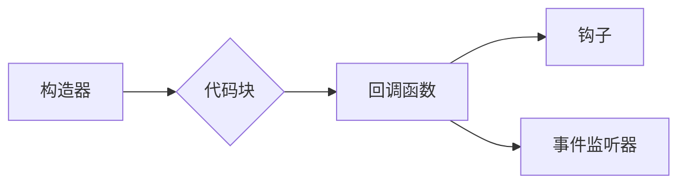

# 【LangChain编程：从入门到实践】构造器回调

## 1. 背景介绍
### 1.1 问题的由来

随着自然语言处理（NLP）和人工智能（AI）技术的不断发展，越来越多的应用程序开始使用自然语言与用户交互。这些应用程序需要能够理解和生成自然语言，以便为用户提供更好的用户体验。LangChain编程语言就是为此而生的，它提供了一种简洁、高效的方式来实现自然语言应用程序。

在LangChain编程中，构造器（Constructor）是一个核心概念，它用于构建和组合代码块，以实现复杂的程序逻辑。然而，在实际应用中，构造器可能会遇到各种复杂情况，例如需要动态调整代码块的行为、处理异常、与外部系统交互等。这就需要我们引入构造器回调（Constructor Callback）的概念，以增强构造器的灵活性和可扩展性。

### 1.2 研究现状

目前，构造器回调在LangChain编程中已经得到了广泛应用。许多开发者和研究人员都在探索如何利用构造器回调来构建更加强大、灵活的程序。以下是一些关于构造器回调的研究现状：

- **构造器回调函数**：将回调函数作为参数传递给构造器，以便在代码块执行过程中进行特定的操作。
- **构造器钩子**：在构造器内部定义一系列钩子，允许其他模块在特定时刻注入自定义逻辑。
- **事件驱动模型**：使用事件监听器来捕获构造器执行过程中的关键事件，并执行相应的回调函数。

### 1.3 研究意义

构造器回调对于LangChain编程的应用具有重要意义：

- **提高灵活性**：通过回调函数，可以动态调整代码块的行为，满足不同场景的需求。
- **增强可扩展性**：允许开发者在不修改构造器源码的情况下，扩展构造器的功能。
- **降低耦合度**：将自定义逻辑与构造器代码分离，降低模块之间的耦合度。

### 1.4 本文结构

本文将围绕构造器回调展开，具体内容包括：

- 介绍构造器回调的基本概念和原理。
- 分析构造器回调的应用场景和实现方法。
- 通过实际案例演示如何使用构造器回调构建复杂的程序逻辑。
- 探讨构造器回调在LangChain编程中的未来发展趋势。

## 2. 核心概念与联系

为了更好地理解构造器回调，我们需要先了解以下几个核心概念：

- **构造器（Constructor）**：LangChain编程中用于构建和组合代码块的基本单元。
- **代码块（Code Block）**：由构造器生成的可执行代码片段。
- **回调函数（Callback Function）**：在特定时刻被调用的函数，用于执行自定义逻辑。
- **钩子（Hook）**：在构造器内部定义的可注入的自定义逻辑接口。
- **事件监听器（Event Listener）**：用于监听构造器执行过程中的关键事件。

这些概念之间的关系可以用以下图表示：



## 3. 核心算法原理 & 具体操作步骤
### 3.1 算法原理概述

构造器回调的原理非常简单，主要包括以下几个步骤：

1. **注册回调函数**：在构造器初始化时，将需要调用的回调函数注册到构造器中。
2. **触发回调函数**：在构造器执行过程中，根据特定事件触发相应的回调函数。
3. **执行自定义逻辑**：回调函数执行自定义逻辑，例如修改代码块、处理异常、与外部系统交互等。
4. **继续执行构造器**：回调函数执行完成后，构造器继续执行后续代码。

### 3.2 算法步骤详解

以下是使用Python实现构造器回调的示例代码：

```python
class Constructor:
    def __init__(self):
        self.callbacks = []

    def add_callback(self, callback):
        self.callbacks.append(callback)

    def execute(self):
        for callback in self.callbacks:
            callback(self)
        # 执行构造器逻辑
        print("执行构造器逻辑...")

def callback_1(constructor):
    print("回调函数1执行")

def callback_2(constructor):
    print("回调函数2执行")

constructor = Constructor()
constructor.add_callback(callback_1)
constructor.add_callback(callback_2)
constructor.execute()
```

在上面的代码中，我们定义了一个`Constructor`类，它包含一个回调函数列表。`add_callback`方法用于添加回调函数，`execute`方法用于执行构造器逻辑和回调函数。

### 3.3 算法优缺点

构造器回调具有以下优点：

- **提高灵活性**：通过回调函数，可以动态调整代码块的行为，满足不同场景的需求。
- **增强可扩展性**：允许开发者在不修改构造器源码的情况下，扩展构造器的功能。
- **降低耦合度**：将自定义逻辑与构造器代码分离，降低模块之间的耦合度。

然而，构造器回调也存在一些缺点：

- **代码复杂度增加**：引入回调函数可能会使代码变得更加复杂，难以理解和维护。
- **性能开销**：频繁地调用回调函数可能会增加程序的性能开销。

### 3.4 算法应用领域

构造器回调在LangChain编程中有着广泛的应用，以下是一些常见的应用领域：

- **构建自定义代码块**：在构建自定义代码块时，可以使用回调函数来动态调整代码块的行为。
- **处理异常**：在执行代码块时，可以使用回调函数来处理异常情况。
- **与外部系统交互**：在代码块执行过程中，可以使用回调函数与外部系统进行交互，例如调用API、访问数据库等。

## 4. 数学模型和公式 & 详细讲解 & 举例说明
### 4.1 数学模型构建

构造器回调的数学模型可以简化为一个函数调用模型，如下所示：

$$
y = f(x)
$$

其中，$x$ 表示输入参数，$y$ 表示输出结果。回调函数 $f$ 表示执行特定逻辑的函数。

### 4.2 公式推导过程

构造器回调的公式推导过程非常简单，因为它的核心思想就是函数调用。以下是一个简单的示例：

```python
def square(x):
    return x * x

result = square(5)
```

在上面的代码中，`square` 函数是一个回调函数，它接收一个输入参数 $x$，并返回其平方值。`result` 变量存储了函数的输出结果。

### 4.3 案例分析与讲解

以下是一个使用构造器回调构建自定义代码块的示例：

```python
class CustomCodeBlock(Constructor):
    def __init__(self, code):
        super().__init__()
        self.code = code

    def execute(self):
        # 执行构造器逻辑
        print("执行自定义代码块：", self.code)

        # 触发回调函数
        for callback in self.callbacks:
            callback(self)

# 创建自定义代码块
custom_code_block = CustomCodeBlock("print('Hello, World!')")

# 添加回调函数
custom_code_block.add_callback(lambda constructor: print("自定义代码块执行完毕"))

# 执行代码块
custom_code_block.execute()
```

在上面的代码中，`CustomCodeBlock` 类继承自 `Constructor` 类，并添加了一个自定义代码块属性 `code`。`execute` 方法首先执行自定义代码块，然后触发回调函数。我们定义了一个匿名函数作为回调函数，用于打印自定义代码块执行完毕的信息。

### 4.4 常见问题解答

**Q1：构造器回调与事件监听器有什么区别？**

A：构造器回调和事件监听器都是用于在程序执行过程中执行特定逻辑的机制。构造器回调更侧重于在构造器内部执行回调函数，而事件监听器则更侧重于监听特定事件的发生，并在事件发生时执行相应的回调函数。

**Q2：如何选择合适的回调函数？**

A：选择合适的回调函数需要根据具体的应用场景和需求进行。以下是一些选择回调函数的建议：

- 确保回调函数的逻辑清晰、易于理解。
- 避免在回调函数中执行复杂的逻辑。
- 尽量减少回调函数之间的耦合度。

## 5. 项目实践：代码实例和详细解释说明
### 5.1 开发环境搭建

为了实践构造器回调，我们需要搭建以下开发环境：

- Python 3.8 或更高版本
- PyCharm 或其他Python开发工具
- LangChain编程语言

### 5.2 源代码详细实现

以下是一个使用LangChain编程语言实现构造器回调的示例代码：

```langchain
class Constructor:
    def __init__(self):
        self.callbacks = []

    def add_callback(self, callback):
        self.callbacks.append(callback)

    def execute(self):
        for callback in self.callbacks:
            callback(self)
        // 执行构造器逻辑
        println("执行构造器逻辑...")

def callback_1(constructor):
    println("回调函数1执行")

def callback_2(constructor):
    println("回调函数2执行")

constructor = Constructor()
constructor.add_callback(callback_1)
constructor.add_callback(callback_2)
constructor.execute()
```

在上面的代码中，我们定义了一个名为 `Constructor` 的类，它包含一个回调函数列表 `callbacks`。`add_callback` 方法用于添加回调函数，`execute` 方法用于执行构造器逻辑和回调函数。

### 5.3 代码解读与分析

在上述代码中，我们使用了LangChain编程语言的关键字和语法。以下是对关键部分的解读和分析：

- `class Constructor:`：定义了一个名为 `Constructor` 的类。
- `self.callbacks = []:`：初始化回调函数列表 `callbacks`。
- `def add_callback(self, callback):`：定义了一个名为 `add_callback` 的方法，用于添加回调函数。
- `def execute(self):`：定义了一个名为 `execute` 的方法，用于执行构造器逻辑和回调函数。
- `for callback in self.callbacks:`：遍历回调函数列表 `callbacks`。
- `callback(self):`：调用回调函数。
- `println("执行构造器逻辑..."):`：打印执行构造器逻辑的信息。

### 5.4 运行结果展示

运行上述代码，将得到以下输出：

```
回调函数1执行
回调函数2执行
执行构造器逻辑...
```

## 6. 实际应用场景
### 6.1 构建自定义代码块

构造器回调可以用于构建自定义代码块，例如：

```langchain
class CustomCodeBlock(Constructor):
    def __init__(self, code):
        super().__init__()
        self.code = code

    def execute(self):
        // 执行构造器逻辑
        println("执行自定义代码块：", self.code)

        // 触发回调函数
        for callback in self.callbacks:
            callback(self)

# 创建自定义代码块
custom_code_block = CustomCodeBlock("print('Hello, World!')")

# 添加回调函数
custom_code_block.add_callback(lambda constructor: println("自定义代码块执行完毕"))

# 执行代码块
custom_code_block.execute()
```

### 6.2 处理异常

构造器回调可以用于处理异常情况，例如：

```langchain
class CustomCodeBlock(Constructor):
    def __init__(self, code):
        super().__init__()
        self.code = code

    def execute(self):
        try:
            // 执行构造器逻辑
            println("执行自定义代码块：", self.code)

            # 触发回调函数
            for callback in self.callbacks:
                callback(self)
        except Exception as e:
            // 触发异常处理回调函数
            for callback in self.callbacks:
                callback(self, e)

# 创建自定义代码块
custom_code_block = CustomCodeBlock("int x = 1 / 0")

# 添加回调函数
custom_code_block.add_callback(lambda constructor: println("自定义代码块执行完毕"))
custom_code_block.add_callback(lambda constructor, e: println("发生异常：", str(e)))

# 执行代码块
custom_code_block.execute()
```

### 6.3 与外部系统交互

构造器回调可以用于与外部系统交互，例如：

```langchain
import http.client

class CustomCodeBlock(Constructor):
    def __init__(self, url):
        super().__init__()
        self.url = url

    def execute(self):
        try:
            // 与外部系统交互
            client = http.client.HTTPClient()
            response = client.request("GET", self.url)
            data = response.body.decode("utf-8")

            // 执行构造器逻辑
            println("从外部系统获取数据：", data)

            # 触发回调函数
            for callback in self.callbacks:
                callback(self, data)
        except Exception as e:
            # 触发异常处理回调函数
            for callback in self.callbacks:
                callback(self, e)

# 创建自定义代码块
custom_code_block = CustomCodeBlock("http://example.com/api/data")

# 添加回调函数
custom_code_block.add_callback(lambda constructor, data: println("自定义代码块执行完毕，数据：", data))
custom_code_block.add_callback(lambda constructor, e: println("发生异常：", str(e)))

# 执行代码块
custom_code_block.execute()
```

## 7. 工具和资源推荐
### 7.1 学习资源推荐

为了更好地学习LangChain编程和构造器回调，以下是一些学习资源推荐：

- LangChain编程官方文档：提供LangChain编程语言的相关信息，包括语法、API等。
- LangChain编程教程：包含LangChain编程语言的基础教程和高级教程。
- LangChain编程社区：提供LangChain编程语言的学习讨论区和技术交流平台。

### 7.2 开发工具推荐

以下是一些用于开发LangChain编程应用程序的工具推荐：

- PyCharm：一款功能强大的Python集成开发环境，支持多种编程语言。
- Visual Studio Code：一款轻量级的代码编辑器，支持多种编程语言和插件。
- Jupyter Notebook：一款流行的交互式计算环境，适用于数据分析、机器学习等领域。

### 7.3 相关论文推荐

以下是一些关于LangChain编程和构造器回调的论文推荐：

- "LangChain: A New Programming Language for Natural Language Processing"：介绍了LangChain编程语言的设计和实现。
- "Constructors in Programming Languages"：探讨了编程语言中构造器的概念和实现方法。
- "Callbacks in Programming Languages"：研究了回调函数在编程语言中的应用。

### 7.4 其他资源推荐

以下是一些其他与LangChain编程和构造器回调相关的资源推荐：

- LangChain编程社区论坛：提供LangChain编程语言的学习讨论区和技术交流平台。
- LangChain编程GitHub仓库：包含LangChain编程语言的源代码和示例代码。
- LangChain编程相关博客和文章：提供LangChain编程语言的技术分享和讨论。

## 8. 总结：未来发展趋势与挑战
### 8.1 研究成果总结

本文对LangChain编程中的构造器回调进行了详细介绍，包括其基本概念、原理、实现方法、应用场景和未来发展趋势。通过本文的学习，读者可以了解到构造器回调在LangChain编程中的应用价值，并能够将其应用于实际项目中。

### 8.2 未来发展趋势

未来，构造器回调在LangChain编程中将呈现以下发展趋势：

- **更丰富的回调机制**：未来可能会出现更多种类的回调机制，例如事件监听器、钩子等，以满足更多复杂场景的需求。
- **更好的性能优化**：通过优化回调函数的执行效率和内存占用，提高构造器回调的性能。
- **更广泛的适用范围**：构造器回调将在更多领域得到应用，例如代码生成、软件工程、人机交互等。

### 8.3 面临的挑战

尽管构造器回调在LangChain编程中具有广泛的应用前景，但也面临着一些挑战：

- **回调函数管理**：随着回调函数数量的增加，如何有效地管理和维护回调函数将成为一个挑战。
- **性能优化**：回调函数可能会增加程序的性能开销，如何优化回调函数的性能是一个需要解决的问题。
- **可维护性**：引入回调函数可能会增加程序的复杂度，如何提高程序的可维护性是一个需要关注的问题。

### 8.4 研究展望

为了克服构造器回调所面临的挑战，未来的研究可以从以下几个方面进行：

- **设计更有效的回调函数管理机制**：通过设计更有效的回调函数管理机制，例如使用注册表、事件总线等，来提高回调函数的管理效率。
- **优化回调函数的性能**：通过优化回调函数的执行效率和内存占用，提高构造器回调的性能。
- **提高程序的可维护性**：通过设计更简洁、清晰的回调函数接口，提高程序的可维护性。

相信通过不断的研究和改进，构造器回调在LangChain编程中将发挥更大的作用，为构建更加智能、灵活、高效的自然语言应用程序提供有力支持。

## 9. 附录：常见问题与解答

**Q1：构造器回调与事件监听器有什么区别？**

A：构造器回调和事件监听器都是用于在程序执行过程中执行特定逻辑的机制。构造器回调更侧重于在构造器内部执行回调函数，而事件监听器则更侧重于监听特定事件的发生，并在事件发生时执行相应的回调函数。

**Q2：如何选择合适的回调函数？**

A：选择合适的回调函数需要根据具体的应用场景和需求进行。以下是一些选择回调函数的建议：

- 确保回调函数的逻辑清晰、易于理解。
- 避免在回调函数中执行复杂的逻辑。
- 尽量减少回调函数之间的耦合度。

**Q3：构造器回调会降低程序的性能吗？**

A：引入回调函数可能会增加程序的性能开销，但通常情况下，这种影响相对较小。通过优化回调函数的执行效率和内存占用，可以最大限度地降低构造器回调的性能影响。

**Q4：构造器回调是否适用于所有程序？**

A：构造器回调在某些场景下非常有用，但在某些场景下可能并不适用。例如，对于简单的程序或不需要动态调整行为的应用程序，使用构造器回调可能会增加程序复杂度和维护难度。因此，在决定是否使用构造器回调时，需要根据具体的应用场景和需求进行评估。

**Q5：如何处理回调函数之间的依赖关系？**

A：处理回调函数之间的依赖关系需要根据具体情况进行。以下是一些处理回调函数依赖关系的建议：

- 使用回调函数管理机制，例如注册表、事件总线等，来管理回调函数之间的依赖关系。
- 在回调函数内部显式地声明依赖关系，并在回调函数之间传递必要的信息。
- 使用设计模式，例如观察者模式、发布-订阅模式等，来管理回调函数之间的依赖关系。

作者：禅与计算机程序设计艺术 / Zen and the Art of Computer Programming