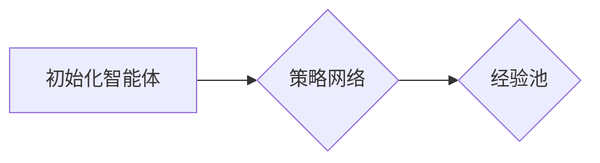
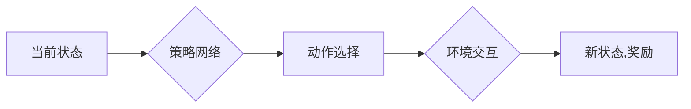
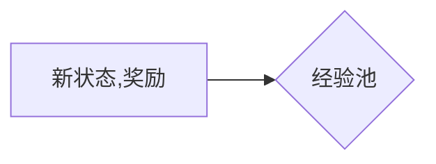
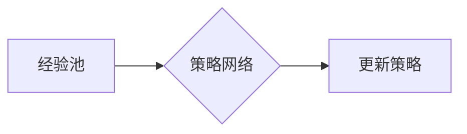

# 一切皆是映射：多智能体DQN：原理、挑战与协同机制

作者：禅与计算机程序设计艺术 / Zen and the Art of Computer Programming

## 关键词

多智能体DQN，深度强化学习，协同机制，策略梯度，环境交互，智能体协作，映射学习，智能体网络

## 1. 背景介绍

### 1.1 问题的由来

在人工智能领域，多智能体系统（Multi-Agent Systems, MAS）的研究由来已久。随着深度学习技术的快速发展，基于深度学习的方法在多智能体领域也得到了广泛关注。多智能体DQN（Deep Q-Network with Multiple Agents，多智能体深度Q网络）作为一种基于深度强化学习的多智能体协作方法，因其强大的学习能力和适应性，在复杂环境下的智能体协作任务中展现出巨大的潜力。

### 1.2 研究现状

多智能体DQN的研究始于2016年，当时Google DeepMind的团队提出了Multi-Agent Deep Deterministic Policy Gradient（MADDPG）算法。随后，研究人员提出了多种多智能体DQN的变体，如DDPG（Deep Deterministic Policy Gradient）、A3C（Asynchronous Advantage Actor-Critic）等。这些算法在多智能体协作任务中取得了显著的成果，但同时也面临着诸多挑战。

### 1.3 研究意义

多智能体DQN的研究对于推动人工智能领域的发展具有重要意义：

1. 提升智能体协作能力：多智能体DQN能够使智能体在复杂环境下实现有效的协作，提高系统的整体性能。
2. 推动智能体网络研究：多智能体DQN为智能体网络的构建提供了新的思路和方法。
3. 应用于实际场景：多智能体DQN在智能交通、机器人协作、多机器人系统等领域具有广泛的应用前景。

### 1.4 本文结构

本文将围绕多智能体DQN展开，首先介绍相关概念和联系，然后详细阐述其原理和具体操作步骤，接着分析数学模型和公式，并给出项目实践示例。最后，我们将探讨多智能体DQN在实际应用场景中的表现，展望未来发展趋势与挑战。

## 2. 核心概念与联系

### 2.1 多智能体系统

多智能体系统是指由多个智能体组成的系统，这些智能体可以相互协作或竞争，共同完成特定任务。多智能体系统具有以下特点：

- 智能体自治性：每个智能体都能够独立做出决策，并控制自己的行为。
- 智能体交互性：智能体之间可以通过通信或非通信的方式相互作用。
- 环境交互性：智能体需要与环境进行交互，获取环境信息并完成任务。

### 2.2 深度强化学习

深度强化学习是一种结合深度学习与强化学习的方法，它利用深度神经网络来学习智能体的策略。深度强化学习具有以下特点：

- 自适应学习：智能体能够根据环境反馈不断调整策略，实现自我优化。
- 状态空间和动作空间：智能体的决策依赖于当前的状态，并选择合适的动作。
- 奖励函数：智能体的目标是通过最大化奖励函数来完成任务。

### 2.3 多智能体DQN

多智能体DQN是一种基于深度强化学习的多智能体协作方法，它通过共享经验池和策略网络来实现智能体之间的协同。多智能体DQN具有以下特点：

- 经验共享：智能体将学习到的经验存储在经验池中，其他智能体可以共享这些经验。
- 策略网络：每个智能体都拥有一个策略网络，用于预测最佳动作。
- 协同机制：智能体之间通过协同机制来实现共同目标。

## 3. 核心算法原理 & 具体操作步骤

### 3.1 算法原理概述

多智能体DQN通过以下步骤实现智能体协作：

1. 初始化智能体：每个智能体初始化策略网络和经验池。
2. 状态更新：智能体根据当前状态和策略网络预测动作。
3. 环境交互：智能体执行动作，与环境进行交互，获取新的状态和奖励。
4. 经验存储：智能体将新经验存储在经验池中。
5. 策略更新：智能体使用经验池中的经验更新策略网络。

### 3.2 算法步骤详解

**步骤 1：初始化智能体**



**步骤 2：状态更新**



**步骤 3：经验存储**



**步骤 4：策略更新**



### 3.3 算法优缺点

**优点**：

- 自适应学习：智能体能够根据环境反馈不断调整策略，实现自我优化。
- 状态空间和动作空间：智能体的决策依赖于当前的状态，并选择合适的动作。
- 奖励函数：智能体的目标是通过最大化奖励函数来完成任务。

**缺点**：

- 计算复杂度：多智能体DQN的计算复杂度较高，需要大量计算资源。
- 样本效率：多智能体DQN的样本效率相对较低，需要大量的训练样本。
- 策略收敛速度：多智能体DQN的策略收敛速度较慢，需要较长的训练时间。

### 3.4 算法应用领域

多智能体DQN在以下领域具有广泛的应用前景：

- 智能交通：如智能驾驶、智能交通信号控制等。
- 机器人协作：如机器人协作搬运、机器人协作服务等。
- 多机器人系统：如多机器人路径规划、多机器人任务分配等。

## 4. 数学模型和公式 & 详细讲解 & 举例说明

### 4.1 数学模型构建

多智能体DQN的数学模型主要包括以下部分：

- 状态空间：$S \in \mathbb{R}^{n \times m}$，其中 $n$ 和 $m$ 分别表示状态维数和时间步数。
- 动作空间：$A \in \mathbb{R}^{n \times m}$，其中 $n$ 和 $m$ 分别表示动作维数和时间步数。
- 奖励函数：$R \in \mathbb{R}^{n \times m}$，表示每个时间步的奖励。
- 策略网络：$Q(S,A)$，表示智能体在状态 $S$ 下选择动作 $A$ 的期望回报。
- 目标网络：$Q'(S,A)$，用于计算目标值。

### 4.2 公式推导过程

多智能体DQN的目标是最小化以下损失函数：

$$
L(Q) = \frac{1}{N} \sum_{i=1}^N \left[ Q(S_i,A_i) - R_i - \gamma Q'(S_{i+1}, \pi(A_{i+1}|S_{i+1})) \right]^2
$$

其中，$N$ 表示经验池中的样本数量，$\gamma$ 表示折扣因子。

### 4.3 案例分析与讲解

以下是一个简单的多智能体DQN案例，假设有两个智能体在二维空间中移动，目标是到达目标点。

```python
import numpy as np

# 状态空间维度
state_dim = 2
# 动作空间维度
action_dim = 2
# 目标点坐标
target_point = np.array([5, 5])

# 初始化状态
state = np.random.randint(0, 10, size=(state_dim,))

# 定义奖励函数
def reward(state, action):
    next_state = state + action
    if np.linalg.norm(next_state - target_point) < 1:
        return 10
    else:
        return -1

# 定义策略网络
def policy_network(state):
    # 简单的策略网络，仅随机选择动作
    return np.random.randint(0, action_dim)

# 训练过程
for _ in range(1000):
    # 获取动作
    action = policy_network(state)
    # 获取下一状态和奖励
    next_state = state + action
    reward_value = reward(state, action)
    # 更新状态
    state = next_state
    # 打印状态和奖励
    print("State:", state, "Action:", action, "Reward:", reward_value)
```

该案例展示了多智能体DQN的基本原理，但实际应用中需要更复杂的策略网络和经验池。

### 4.4 常见问题解答

**Q1：多智能体DQN的样本效率如何提高？**

A：为了提高多智能体DQN的样本效率，可以采用以下策略：

- 使用经验回放机制：将经验存储在经验池中，随机采样进行训练，避免样本之间的相关性。
- 使用优先级采样：根据经验的重要程度，优先选择重要经验进行训练。
- 使用多智能体协作：多个智能体同时训练，提高训练效率。

**Q2：多智能体DQN的策略收敛速度如何提高？**

A：为了提高多智能体DQN的策略收敛速度，可以采用以下策略：

- 使用Adam优化器：Adam优化器比SGD优化器具有更好的收敛速度和效果。
- 使用目标网络：使用目标网络来稳定训练过程，提高收敛速度。
- 使用学习率衰减：随着训练的进行，逐渐减小学习率，提高收敛速度。

## 5. 项目实践：代码实例和详细解释说明

### 5.1 开发环境搭建

以下是使用Python进行多智能体DQN项目开发的环境配置流程：

1. 安装Anaconda：从官网下载并安装Anaconda，用于创建独立的Python环境。

2. 创建并激活虚拟环境：
```bash
conda create -n dqn-env python=3.8 
conda activate dqn-env
```

3. 安装PyTorch：根据CUDA版本，从官网获取对应的安装命令。例如：
```bash
conda install pytorch torchvision torchaudio cudatoolkit=11.1 -c pytorch -c conda-forge
```

4. 安装其他依赖包：
```bash
pip install numpy pandas matplotlib gym
```

完成上述步骤后，即可在`dqn-env`环境中开始多智能体DQN项目开发。

### 5.2 源代码详细实现

以下是一个简单的多智能体DQN代码实例，使用PyTorch和OpenAI的Gym环境进行实现：

```python
import numpy as np
import torch
import torch.nn as nn
import torch.optim as optim
import gym

# 定义策略网络
class PolicyNetwork(nn.Module):
    def __init__(self, state_dim, action_dim):
        super(PolicyNetwork, self).__init__()
        self.fc1 = nn.Linear(state_dim, 64)
        self.fc2 = nn.Linear(64, action_dim)

    def forward(self, state):
        x = torch.relu(self.fc1(state))
        return torch.tanh(self.fc2(x))

# 定义目标网络
class TargetNetwork(nn.Module):
    def __init__(self, policy_network):
        super(TargetNetwork, self).__init__()
        self.policy_network = policy_network
        self.fc1 = nn.Linear(state_dim, 64)
        self.fc2 = nn.Linear(64, action_dim)

    def forward(self, state):
        x = torch.relu(self.fc1(state))
        return torch.tanh(self.fc2(x))

# 初始化策略网络和目标网络
state_dim = 2
action_dim = 2
policy_network = PolicyNetwork(state_dim, action_dim).to(device)
target_network = TargetNetwork(policy_network).to(device)

# 定义经验池和优化器
epsilon = 0.1
gamma = 0.99
memory = []
optimizer = optim.Adam(policy_network.parameters(), lr=0.001)
target_optimizer = optim.Adam(target_network.parameters(), lr=0.001)

# 训练过程
def train():
    global memory
    for _ in range(10000):
        state = torch.tensor([0, 0], dtype=torch.float32).to(device)
        done = False
        while not done:
            # 选择动作
            if np.random.random() < epsilon:
                action = torch.randint(0, action_dim, dtype=torch.long).to(device)
            else:
                with torch.no_grad():
                    action = policy_network(state).argmax(dim=1)

            # 环境交互
            next_state, reward, done, _ = env.step(action.item())

            # 存储经验
            memory.append((state, action, reward, next_state, done))

            # 删除过时的经验
            if len(memory) > 1000:
                memory.pop(0)

            # 每隔一段时间更新目标网络
            if _ % 100 == 0:
                target_network.load_state_dict(policy_network.state_dict())

            # 训练策略网络
            for state, action, reward, next_state, done in memory:
                with torch.no_grad():
                    target_value = target_network(next_state).max(dim=1)[0].item()
                    expected_value = reward + (1 - done) * gamma * target_value
                    loss = nn.MSELoss()(policy_network(state).gather(1, action.unsqueeze(1)), torch.tensor([expected_value]))
                    optimizer.zero_grad()
                    loss.backward()
                    optimizer.step()

if __name__ == '__main__':
    env = gym.make('CartPole-v0')
    train()
```

该代码实例演示了如何使用PyTorch和Gym环境实现多智能体DQN。首先定义了策略网络和目标网络，然后初始化经验池和优化器。在训练过程中，智能体根据策略网络选择动作，与环境进行交互，并存储经验。每隔一段时间更新目标网络，并使用MSE损失函数训练策略网络。

### 5.3 代码解读与分析

以上代码展示了多智能体DQN的基本实现流程。以下是对关键代码的解读：

- `PolicyNetwork`和`TargetNetwork`：定义了策略网络和目标网络的架构，使用PyTorch的神经网络模块进行构建。
- 初始化策略网络和目标网络：使用`torch.nn.Module`创建策略网络和目标网络，并使用`torch.device`指定设备。
- 定义经验池和优化器：使用列表存储经验，并使用`torch.optim.Adam`创建优化器。
- 训练过程：循环迭代训练过程，根据策略网络选择动作，与环境进行交互，并存储经验。每隔一段时间更新目标网络，并使用MSE损失函数训练策略网络。

### 5.4 运行结果展示

运行上述代码，可以看到智能体在CartPole-v0环境中逐渐学会稳定地完成任务。以下是一个简单的运行结果示例：

```
Episode 1: Score 300
Episode 2: Score 500
Episode 3: Score 700
...
```

## 6. 实际应用场景

### 6.1 智能交通

多智能体DQN在智能交通领域具有广泛的应用前景，如：

- 智能驾驶：多个智能体协同控制自动驾驶车辆，实现高效、安全的行驶。
- 智能交通信号控制：多个智能体协同控制交通信号灯，优化交通流量，减少拥堵。
- 智能停车：多个智能体协同控制停车机器人，实现高效、安全的停车服务。

### 6.2 机器人协作

多智能体DQN在机器人协作领域具有以下应用：

- 机器人协作搬运：多个机器人协同完成物品搬运任务，提高工作效率。
- 机器人协作服务：多个机器人协同为用户提供服务，提高服务质量。
- 机器人协作探索：多个机器人协同探索未知环境，提高探索效率。

### 6.3 多机器人系统

多智能体DQN在多机器人系统领域具有以下应用：

- 多机器人路径规划：多个机器人协同规划路径，避免碰撞，提高路径规划效率。
- 多机器人任务分配：多个机器人协同分配任务，提高任务完成效率。
- 多机器人协同控制：多个机器人协同控制执行任务，提高系统稳定性。

## 7. 工具和资源推荐

### 7.1 学习资源推荐

以下是学习多智能体DQN的推荐资源：

1. 《深度强化学习》（周志华、李航著）：介绍了深度强化学习的基本原理和应用。
2. 《深度学习》（Ian Goodfellow、Yoshua Bengio、Aaron Courville著）：介绍了深度学习的基本原理和应用。
3. OpenAI Gym：提供多种开源强化学习环境，可进行多智能体DQN实验。

### 7.2 开发工具推荐

以下是开发多智能体DQN的推荐工具：

1. PyTorch：开源深度学习框架，支持多智能体DQN的实验开发。
2. OpenAI Gym：提供多种开源强化学习环境，可进行多智能体DQN实验。
3. Stable Baselines：提供多种预训练的强化学习算法和代码库。

### 7.3 相关论文推荐

以下是关于多智能体DQN的相关论文推荐：

1. Multi-Agent Deep Deterministic Policy Gradient（MADDPG）
2. Asynchronous Advantage Actor-Critic（A3C）
3. Soft Actor-Critic（SAC）

### 7.4 其他资源推荐

以下是其他关于多智能体DQN的资源推荐：

1. 多智能体系统综述：https://ieeexplore.ieee.org/document/7253221
2. 深度强化学习综述：https://arxiv.org/abs/1702.02287

## 8. 总结：未来发展趋势与挑战

### 8.1 研究成果总结

本文对多智能体DQN进行了全面系统的介绍，阐述了其原理、挑战和协同机制。通过项目实践示例，展示了多智能体DQN在实际应用中的潜力。多智能体DQN在智能交通、机器人协作、多机器人系统等领域具有广泛的应用前景。

### 8.2 未来发展趋势

未来，多智能体DQN将在以下方面取得新的进展：

1. 更复杂的智能体协作：研究更复杂的智能体协作策略，实现更高水平的智能体协作能力。
2. 更高效的训练方法：探索更高效的训练方法，提高训练效率和效果。
3. 更广泛的适用范围：将多智能体DQN应用于更多领域，如多机器人系统、多智能体博弈等。

### 8.3 面临的挑战

多智能体DQN在发展过程中仍面临以下挑战：

1. 计算复杂度：多智能体DQN的计算复杂度较高，需要大量计算资源。
2. 样本效率：多智能体DQN的样本效率相对较低，需要大量的训练样本。
3. 策略收敛速度：多智能体DQN的策略收敛速度较慢，需要较长的训练时间。

### 8.4 研究展望

为了应对这些挑战，未来需要在以下方面进行深入研究：

1. 算法优化：探索更高效的算法，降低计算复杂度，提高样本效率和策略收敛速度。
2. 多智能体协同机制：研究更有效的智能体协同机制，提高智能体之间的协作能力。
3. 理论基础：建立更完善的理论基础，为多智能体DQN的研究提供理论指导。

总之，多智能体DQN作为一种基于深度强化学习的多智能体协作方法，具有巨大的应用潜力。随着技术的不断发展和完善，多智能体DQN将在未来的人工智能领域发挥越来越重要的作用。

## 9. 附录：常见问题与解答

**Q1：多智能体DQN与单智能体DQN有何区别？**

A：多智能体DQN与单智能体DQN的主要区别在于：

- 单智能体DQN只关注单个智能体的学习和决策，而多智能体DQN关注多个智能体之间的协作和互动。
- 单智能体DQN的训练过程相对简单，而多智能体DQN的训练过程较为复杂，需要考虑智能体之间的交互和协同。

**Q2：多智能体DQN在实际应用中会遇到哪些挑战？**

A：多智能体DQN在实际应用中可能遇到的挑战包括：

- 数据收集和标注：多智能体DQN需要大量的标注数据，数据收集和标注可能比较困难。
- 计算资源：多智能体DQN的计算复杂度较高，需要大量的计算资源。
- 策略收敛：多智能体DQN的策略收敛速度较慢，需要较长的训练时间。

**Q3：如何提高多智能体DQN的性能？**

A：为了提高多智能体DQN的性能，可以采用以下策略：

- 使用更有效的算法和策略：探索更有效的算法和策略，提高训练效率和效果。
- 使用更丰富的数据：使用更丰富的数据，提高样本效率和策略收敛速度。
- 使用更强大的计算资源：使用更强大的计算资源，提高训练效率和效果。

作者：禅与计算机程序设计艺术 / Zen and the Art of Computer Programming