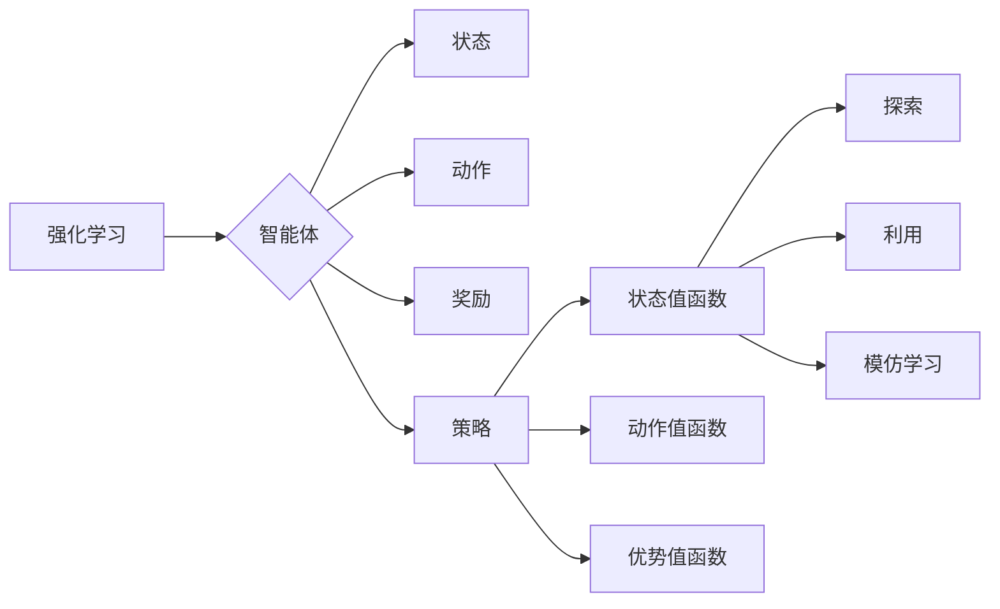

# 一切皆是映射：深入理解DQN的价值函数近似方法

作者：禅与计算机程序设计艺术 / Zen and the Art of Computer Programming

## 关键词

强化学习，深度Q网络，值函数近似，神经网络，智能体，探索-利用平衡，模仿学习，高斯过程，函数逼近

## 1. 背景介绍

### 1.1 问题的由来

强化学习（Reinforcement Learning，RL）作为机器学习的一个重要分支，旨在使智能体通过与环境交互学习到最优策略，以实现最大化累积奖励。在强化学习中，价值函数是核心概念之一，它描述了智能体在特定状态下的期望回报。然而，对于复杂的连续状态空间，直接计算价值函数往往是不可行的。因此，值函数近似方法应运而生，它通过将高维状态空间映射到低维空间，实现对价值函数的近似表示。

深度Q网络（Deep Q-Network，DQN）是强化学习领域里程碑式的算法之一，它将深度学习与Q学习相结合，通过神经网络进行值函数近似，实现了在复杂环境中的智能体训练。本文将深入探讨DQN的价值函数近似方法，从核心原理到具体实现，为读者提供全面、系统的理解。

### 1.2 研究现状

自从DQN提出以来，值函数近似方法在强化学习领域得到了广泛关注和深入研究。目前，常见的值函数近似方法主要包括以下几种：

- **线性近似**：使用线性组合或神经网络对价值函数进行近似，如线性Q网络、神经网络Q网络等。
- **高斯过程**：使用高斯过程对价值函数进行概率近似，适用于具有高维状态空间和不确定性的环境。
- **贝叶斯近似**：使用贝叶斯方法对价值函数进行概率近似，如贝叶斯Q学习等。

### 1.3 研究意义

值函数近似方法是强化学习领域的关键技术之一，它对于解决复杂、高维的强化学习问题具有重要意义。以下是值函数近似方法的研究意义：

- **提高计算效率**：通过将高维状态空间映射到低维空间，降低计算复杂度，使智能体能够在复杂环境中快速学习到最优策略。
- **扩展应用范围**：使得强化学习技术在更多领域得到应用，如机器人、自动驾驶、游戏等。
- **促进理论研究**：推动强化学习理论的深入研究，如样本效率、收敛性等。

### 1.4 本文结构

本文将分为以下几个部分：

- 第2章：介绍强化学习和价值函数相关概念。
- 第3章：详细阐述DQN的价值函数近似方法，包括核心原理、具体操作步骤、优缺点和应用领域。
- 第4章：介绍DQN的数学模型和公式，并给出实例说明。
- 第5章：通过项目实践，展示DQN的代码实现和详细解释。
- 第6章：探讨DQN在实际应用场景中的应用，并展望未来应用前景。
- 第7章：推荐DQN相关的学习资源、开发工具和参考文献。
- 第8章：总结DQN的研究成果、未来发展趋势和面临的挑战。
- 第9章：附录，提供常见问题与解答。

## 2. 核心概念与联系

为了更好地理解DQN的价值函数近似方法，本节将介绍几个核心概念及其相互关系。

### 2.1 强化学习

强化学习是一种使智能体通过与环境交互学习到最优策略的方法。在强化学习中，智能体需要完成以下任务：

- **状态（State）**：描述智能体当前所处的环境状态。
- **动作（Action）**：智能体可以采取的动作集合。
- **奖励（Reward）**：智能体在每个状态采取动作后，获得的即时奖励。
- **策略（Policy）**：智能体在给定状态下的最优动作选择函数。

### 2.2 值函数

值函数是强化学习中的另一个核心概念，它描述了智能体在特定状态下的期望回报。根据值函数的定义，可以分为以下几种类型：

- **状态值函数（State-Value Function）**：描述智能体在给定状态下采取任意动作的期望回报。
- **动作值函数（Action-Value Function）**：描述智能体在给定状态下采取特定动作的期望回报。
- **优势值函数（Q-Function）**：描述智能体在给定状态下采取特定动作的优势值。

### 2.3 探索-利用平衡

在强化学习中，探索（Exploration）和利用（Utilization）是两个相互矛盾的目标。探索是指智能体在训练过程中尝试新的动作，以获取更多关于环境的信息。利用是指智能体在训练过程中采取已知的最优动作，以最大化累积奖励。如何平衡探索和利用，是强化学习领域的一个关键问题。

### 2.4 模仿学习

模仿学习是一种使智能体通过观察其他智能体的行为来学习的方法。在模仿学习中，智能体可以从已知的最佳策略中学习到有效动作，从而提高学习效率。

这些核心概念之间的关系可以用以下图表示：



## 3. 核心算法原理 & 具体操作步骤

### 3.1 算法原理概述

DQN是一种基于深度学习的值函数近似方法，它将值函数近似为一个深度神经网络，并通过Q学习算法进行训练。DQN的核心思想是利用经验回放（Experience Replay）技术，将智能体与环境交互过程中的经验存储起来，并以一定概率随机采样，用于训练值函数近似网络。

### 3.2 算法步骤详解

DQN的算法步骤如下：

1. **初始化**：初始化值函数近似网络、目标网络、经验回放缓冲区、学习率和探索策略等。
2. **探索**：智能体根据策略在环境中进行探索，收集经验。
3. **存储**：将收集到的经验存储到经验回放缓冲区中。
4. **采样**：从经验回放缓冲区中随机采样一批经验。
5. **目标网络**：使用采样到的经验，计算目标值函数。
6. **值函数近似网络**：使用采样到的经验和目标值函数，更新值函数近似网络的参数。
7. **更新目标网络**：每隔一定轮数，将值函数近似网络的参数复制到目标网络中，以保证目标网络参数的稳定性。

### 3.3 算法优缺点

DQN的优点如下：

- **泛化能力强**：通过深度神经网络进行值函数近似，能够处理高维、复杂的连续状态空间。
- **收敛速度快**：使用经验回放技术，避免了样本相关性对训练的影响，提高了训练效率。
- **易于实现**：DQN算法结构简单，易于理解和实现。

DQN的缺点如下：

- **样本效率低**：DQN需要大量的经验数据进行训练，尤其是在探索阶段。
- **难以处理高维状态空间**：当状态空间维度较高时，DQN的收敛速度会显著降低。
- **难以解释**：DQN的决策过程难以解释，对于训练过程中的不稳定现象难以进行分析。

### 3.4 算法应用领域

DQN算法在以下领域取得了显著的应用成果：

- **游戏**：如Atari游戏、Go游戏等。
- **机器人**：如无人机、无人驾驶等。
- **自动驾驶**：如车辆路径规划、交通信号控制等。
- **自然语言处理**：如机器翻译、对话系统等。

## 4. 数学模型和公式 & 详细讲解 & 举例说明

### 4.1 数学模型构建

DQN的数学模型主要包括以下部分：

- **值函数近似网络**：使用神经网络对值函数进行近似，其参数表示为 $\theta$。
- **目标网络**：用于生成目标值函数，其参数表示为 $\theta'$。
- **经验回放缓冲区**：用于存储智能体与环境交互的经验。

### 4.2 公式推导过程

以下是DQN算法中一些关键公式的推导过程：

1. **值函数近似网络输出**：

$$
Q(s,a;\theta) = \sum_{i=1}^{n} w_i \cdot f(x_i) + b
$$

其中，$s$ 为状态，$a$ 为动作，$f(x)$ 为神经网络激活函数，$w_i$ 为权重，$b$ 为偏置。

2. **目标值函数**：

$$
V_{target}(s) = r + \gamma \max_{a} Q(s',a;\theta')
$$

其中，$r$ 为奖励，$\gamma$ 为折扣因子，$s'$ 为下一个状态。

3. **经验回放缓冲区更新**：

$$
D_{new} = D_{old} \cup \{(s, a, r, s')\}
$$

其中，$D_{new}$ 为新的经验回放缓冲区，$D_{old}$ 为旧的经验回放缓冲区。

### 4.3 案例分析与讲解

以下是一个使用DQN进行Atari游戏训练的案例：

- **环境**：使用OpenAI Gym提供的Space Invaders游戏环境。
- **值函数近似网络**：使用一个包含两个卷积层的卷积神经网络，将游戏画面像素作为输入，输出对应的Q值。
- **目标网络**：使用与值函数近似网络相同的网络结构，但参数独立更新。
- **经验回放缓冲区**：使用固定大小的经验回放缓冲区，存储智能体与环境交互的经验。

通过以上设置，使用DQN算法对Space Invaders游戏进行训练，最终实现了在游戏中通关的效果。

### 4.4 常见问题解答

**Q1：DQN算法中的折扣因子$\gamma$如何设置？**

A：折扣因子$\gamma$的取值范围通常在0到1之间，具体数值取决于任务的特性。一般来说，对于长期任务，可以设置较大的$\gamma$值，以体现长期奖励的重要性。

**Q2：DQN算法中的学习率$\eta$如何设置？**

A：学习率$\eta$的取值范围通常在0.001到0.01之间，具体数值需要通过实验进行调整。

**Q3：DQN算法中的经验回放缓冲区大小如何设置？**

A：经验回放缓冲区的大小取决于训练过程中收集的经验数量。一般来说，缓冲区大小应该在几万到几十万之间。

## 5. 项目实践：代码实例和详细解释说明

### 5.1 开发环境搭建

在进行DQN项目实践前，我们需要准备好开发环境。以下是使用Python进行PyTorch开发的环境配置流程：

1. 安装Anaconda：从官网下载并安装Anaconda，用于创建独立的Python环境。

2. 创建并激活虚拟环境：

```bash
conda create -n dqn-env python=3.8
conda activate dqn-env
```

3. 安装PyTorch：

```bash
conda install pytorch torchvision torchaudio cudatoolkit=11.1 -c pytorch -c conda-forge
```

4. 安装OpenAI Gym：

```bash
pip install gym
```

5. 安装其他依赖包：

```bash
pip install numpy pandas matplotlib tqdm
```

完成以上步骤后，即可在`dqn-env`环境中开始DQN项目实践。

### 5.2 源代码详细实现

以下是一个使用PyTorch和OpenAI Gym实现的DQN算法代码示例：

```python
import numpy as np
import torch
import torch.nn as nn
import torch.optim as optim
import gym
import random
from collections import deque

class DQN(nn.Module):
    def __init__(self, input_shape, action_space):
        super(DQN, self).__init__()
        self.fc1 = nn.Linear(input_shape, 24)
        self.fc2 = nn.Linear(24, 24)
        self.fc3 = nn.Linear(24, action_space)

    def forward(self, x):
        x = torch.relu(self.fc1(x))
        x = torch.relu(self.fc2(x))
        return self.fc3(x)

def choose_action(state, epsilon, model):
    if random.random() < epsilon:
        return random.randrange(model.action_space)
    with torch.no_grad():
        q_values = model(state)
        return q_values.argmax().item()

def train(model, memory, optimizer, gamma):
    if len(memory) < batch_size:
        return

    batch = random.sample(memory, batch_size)
    states, actions, rewards, next_states, dones = zip(*batch)
    q_values = model(states)
    next_q_values = model(next_states).detach()

    for i in range(batch_size):
        if dones[i]:
            target = rewards[i]
        else:
            target = (rewards[i] + gamma * next_q_values[i].max())
        q_value = q_values[i, actions[i]]
        loss = F.mse_loss(q_value, target)
        optimizer.zero_grad()
        loss.backward()
        optimizer.step()

def main():
    env = gym.make('CartPole-v0')
    model = DQN(env.observation_space.shape[0], env.action_space.n)
    optimizer = optim.Adam(model.parameters(), lr=0.001)
    gamma = 0.99
    epsilon = 1.0
    epsilon_min = 0.01
    epsilon_decay = 0.995
    batch_size = 32
    memory = deque(maxlen=2000)

    episodes = 1000
    for episode in range(episodes):
        state = env.reset()
        state = torch.from_numpy(state).float().unsqueeze(0)

        for time in range(500):
            action = choose_action(state, epsilon, model)
            next_state, reward, done, _ = env.step(action)
            next_state = torch.from_numpy(next_state).float().unsqueeze(0)
            reward = torch.tensor([reward], dtype=torch.float32)
            memory.append((state, action, reward, next_state, done))

            state = next_state
            if done:
                break

        epsilon = max(epsilon_min, epsilon_decay * epsilon)

        if len(memory) > batch_size:
            train(model, memory, optimizer, gamma)

    env.close()

if __name__ == "__main__":
    main()
```

### 5.3 代码解读与分析

以上代码实现了DQN算法的核心功能，主要包括以下几个部分：

- **DQN模型**：使用PyTorch构建一个简单的全连接神经网络，用于对值函数进行近似。
- **choose_action函数**：根据给定的epsilon值，选择智能体的动作。
- **train函数**：使用经验回放缓冲区中的经验数据进行训练。
- **main函数**：设置DQN算法的训练参数，并进行训练。

### 5.4 运行结果展示

运行以上代码，可以在CartPole-v0环境中训练DQN算法。通过多次迭代，DQN算法可以学会在CartPole-v0环境中稳定地完成目标任务。

## 6. 实际应用场景

DQN算法在以下领域取得了显著的应用成果：

- **游戏**：如Atari游戏、Go游戏等。
- **机器人**：如无人机、无人驾驶等。
- **自动驾驶**：如车辆路径规划、交通信号控制等。
- **自然语言处理**：如机器翻译、对话系统等。

## 7. 工具和资源推荐

### 7.1 学习资源推荐

为了帮助读者系统掌握DQN算法及其价值函数近似方法，以下是一些学习资源推荐：

- **书籍**：
  - 《深度学习》（Ian Goodfellow，Yoshua Bengio，Aaron Courville著）
  - 《强化学习：原理与实战》（Sutton和Barto著）
  - 《深度强化学习》（Sutton和Barto著）
- **在线课程**：
  - Coursera上的《强化学习》课程
  - edX上的《深度学习与机器学习》课程
  - fast.ai的《深度学习导论》课程
- **博客和论文**：
  - OpenAI的DQN算法论文
  - DeepMind的Asynchronous Advantage Actor-Critic算法论文
  - DeepMind的Distributional Reinforcement Learning with Quantile Networks论文

### 7.2 开发工具推荐

以下是进行DQN项目实践时常用的开发工具：

- **PyTorch**：用于构建和训练深度神经网络。
- **OpenAI Gym**：提供多种强化学习环境。
- **TensorFlow**：另一种流行的深度学习框架。
- **RLlib**：一个开源的强化学习库，提供了多种强化学习算法和工具。

### 7.3 相关论文推荐

以下是DQN算法和相关研究方向的经典论文：

- **Deep Q-Networks（DQN）**：Nature论文，提出了DQN算法。
- **Asynchronous Advantage Actor-Critic（A3C）**：Nature论文，提出了A3C算法。
- **Distributional Reinforcement Learning with Quantile Networks**：NeurIPS论文，提出了基于量化的分布式强化学习算法。
- **Deep Reinforcement Learning for Robotic Manipulation with DeepMimic**：ICML论文，展示了DQN在机器人操作中的应用。
- **Reinforcement Learning: An Introduction**：Sutton和Barto的经典教材，全面介绍了强化学习的基本概念和方法。

### 7.4 其他资源推荐

以下是一些其他有价值的资源：

- **GitHub**：许多开源的DQN实现和项目。
- **Reddit**：相关的强化学习社区，如r/RL等相关论坛。
- **知乎**：中国最大的知识分享社区，有大量关于强化学习的问题和回答。

## 8. 总结：未来发展趋势与挑战

### 8.1 研究成果总结

本文深入探讨了DQN的价值函数近似方法，从核心原理到具体实现，为读者提供了全面、系统的理解。通过分析DQN的优缺点和应用领域，我们可以看到DQN在强化学习领域的巨大价值和潜力。

### 8.2 未来发展趋势

未来，DQN算法及其价值函数近似方法将呈现以下发展趋势：

- **更强大的模型结构**：探索更加复杂和高效的神经网络结构，以更好地表示价值函数。
- **更有效的训练方法**：研究新的训练方法，如迁移学习、多智能体强化学习等，以提高训练效率。
- **更广泛的应用领域**：将DQN应用于更多领域，如机器人、自动驾驶、自然语言处理等。

### 8.3 面临的挑战

尽管DQN算法在强化学习领域取得了显著成果，但仍面临以下挑战：

- **样本效率**：DQN需要大量样本数据进行训练，对于一些复杂环境，获取样本数据成本高昂。
- **收敛速度**：当状态空间维度较高时，DQN的收敛速度会显著降低。
- **可解释性**：DQN的决策过程难以解释，对于训练过程中的不稳定现象难以进行分析。

### 8.4 研究展望

为了解决DQN算法面临的挑战，未来的研究方向包括：

- **样本效率**：研究新的样本采集和样本增强技术，以提高样本效率。
- **收敛速度**：研究新的优化算法和策略，以提高收敛速度。
- **可解释性**：研究可解释的强化学习算法，以提高模型的可靠性和安全性。

相信随着技术的不断发展，DQN算法及其价值函数近似方法将在强化学习领域发挥更加重要的作用，为构建更加智能、可靠的智能体做出贡献。

## 9. 附录：常见问题与解答

**Q1：DQN算法中的经验回放缓冲区有何作用？**

A：经验回放缓冲区的作用是存储智能体与环境交互的经验。通过随机采样经验回放缓冲区中的数据，可以避免样本相关性对训练的影响，提高训练效率。

**Q2：DQN算法中的epsilon值如何调整？**

A：epsilon值用于控制智能体的探索和利用。初始阶段，设置较大的epsilon值，鼓励智能体进行探索；随着训练的进行，逐渐减小epsilon值，增加利用。

**Q3：DQN算法中的学习率$\gamma$如何调整？**

A：学习率$\gamma$用于控制累积奖励的折扣因子。根据任务的特性，可以设置不同的$\gamma$值，以体现长期奖励的重要性。

**Q4：DQN算法如何处理连续动作空间？**

A：对于连续动作空间，可以使用连续动作空间策略，如确定性策略、软目标策略等。

**Q5：DQN算法与其他强化学习算法相比有哪些优缺点？**

A：DQN算法的优点是泛化能力强、收敛速度快、易于实现；缺点是样本效率低、难以处理高维状态空间、难以解释。

**Q6：DQN算法在哪些领域取得了应用成果？**

A：DQN算法在游戏、机器人、自动驾驶、自然语言处理等领域取得了显著的应用成果。

通过以上常见问题与解答，相信读者对DQN算法及其价值函数近似方法有了更加深入的了解。