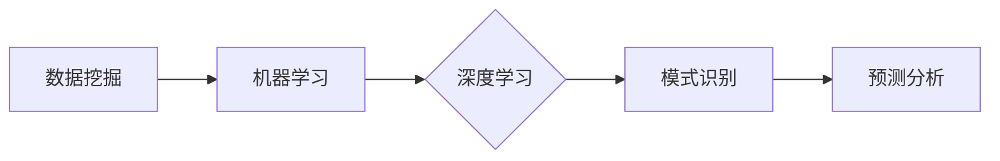

# 一切皆是映射：预测分析：AI预见未来趋势

作者：禅与计算机程序设计艺术 / Zen and the Art of Computer Programming 

## 关键词：

预测分析，机器学习，深度学习，数据挖掘，未来趋势，模式识别，决策树，神经网络，关联规则，可视化

## 1. 背景介绍

### 1.1 问题的由来

预测分析，作为人工智能领域的一个重要分支，其核心目标是通过分析历史数据，预测未来可能发生的事件或趋势。在商业、金融、医疗、交通等众多领域，预测分析都有着广泛的应用，例如：

- 商业：预测产品销量、顾客流失、市场趋势等。
- 金融：预测股票价格、信贷风险、市场波动等。
- 医疗：预测疾病发生、患者病情变化、药物效果等。
- 交通：预测交通流量、事故风险、出行时间等。

随着大数据时代的到来，预测分析的数据量呈指数级增长，传统的方法已经难以应对如此庞大的数据规模和复杂的分析需求。因此，如何利用机器学习、深度学习等技术，进行高效、准确的预测分析，成为了当前研究的热点。

### 1.2 研究现状

近年来，随着机器学习、深度学习等技术的发展，预测分析领域取得了显著的进展。以下是一些典型的预测分析方法：

- 统计分析：通过建立统计模型，对历史数据进行拟合，预测未来趋势。
- 决策树：通过构建决策树模型，根据特征进行分类或回归。
- 神经网络：通过构建多层神经网络模型，学习数据中的复杂模式。
- 关联规则：通过挖掘数据中的关联关系，发现有趣的知识。
- 可视化：通过数据可视化技术，直观地展示数据分布和趋势。

### 1.3 研究意义

预测分析在各个领域都有着重要的应用价值，其主要意义如下：

- 增强决策能力：通过预测分析，可以更好地了解未来趋势，为决策提供依据。
- 提高效率：通过预测分析，可以自动化处理一些重复性工作，提高工作效率。
- 降低风险：通过预测分析，可以提前识别潜在的风险，并采取相应的措施。

### 1.4 本文结构

本文将从以下方面对预测分析进行探讨：

- 核心概念与联系
- 核心算法原理与具体操作步骤
- 数学模型和公式
- 项目实践
- 实际应用场景
- 工具和资源推荐
- 总结：未来发展趋势与挑战

## 2. 核心概念与联系

为了更好地理解预测分析，以下是一些核心概念及其联系：

- **数据挖掘**：从大量数据中发现有价值的信息和知识的过程。
- **机器学习**：通过计算机算法来学习数据中的模式，并利用这些模式进行预测或决策。
- **深度学习**：一种特殊的机器学习方法，通过构建多层神经网络来学习数据中的复杂模式。
- **模式识别**：从数据中识别出具有相似特征或结构的对象或模式。
- **预测分析**：通过分析历史数据，预测未来可能发生的事件或趋势。

这些概念之间的关系可以用以下图表示：



## 3. 核心算法原理 & 具体操作步骤

### 3.1 算法原理概述

预测分析的核心是构建预测模型，以下是一些常见的预测分析方法及其原理：

- **统计分析**：通过建立统计模型，对历史数据进行拟合，预测未来趋势。常用的统计模型包括线性回归、时间序列分析等。
- **决策树**：通过构建决策树模型，根据特征进行分类或回归。决策树模型通过一系列的规则对数据进行分类或预测。
- **神经网络**：通过构建多层神经网络模型，学习数据中的复杂模式。神经网络模型通过模拟人脑神经元的工作原理，学习输入和输出之间的复杂关系。
- **关联规则**：通过挖掘数据中的关联关系，发现有趣的知识。常用的关联规则算法包括Apriori算法、FP-growth算法等。
- **可视化**：通过数据可视化技术，直观地展示数据分布和趋势。常用的可视化工具包括Matplotlib、Seaborn等。

### 3.2 算法步骤详解

以下是预测分析的一般步骤：

1. **数据收集**：收集与预测任务相关的数据。
2. **数据预处理**：对收集到的数据进行清洗、转换等预处理操作。
3. **特征选择**：从预处理后的数据中选择对预测任务有用的特征。
4. **模型选择**：选择合适的预测模型。
5. **模型训练**：使用训练数据对模型进行训练。
6. **模型评估**：使用测试数据对模型进行评估。
7. **模型部署**：将训练好的模型应用于实际预测任务。

### 3.3 算法优缺点

以下是常见预测分析方法的优缺点：

- **统计分析**：优点是简单、易理解，缺点是适用于线性关系，难以处理非线性关系。
- **决策树**：优点是易于理解和解释，缺点是容易过拟合，且难以处理高维数据。
- **神经网络**：优点是适用于非线性关系，可以处理高维数据，缺点是难以理解和解释。
- **关联规则**：优点是可以发现数据中的关联关系，缺点是容易产生大量冗余规则。
- **可视化**：优点是可以直观地展示数据分布和趋势，缺点是无法进行预测。

### 3.4 算法应用领域

预测分析方法在各个领域都有着广泛的应用，以下是一些应用案例：

- **商业**：产品销量预测、顾客流失预测、市场趋势预测等。
- **金融**：股票价格预测、信贷风险预测、市场波动预测等。
- **医疗**：疾病发生预测、患者病情变化预测、药物效果预测等。
- **交通**：交通流量预测、事故风险预测、出行时间预测等。

## 4. 数学模型和公式 & 详细讲解 & 举例说明

### 4.1 数学模型构建

以下是常见的预测分析方法及其数学模型：

- **线性回归**：假设目标变量 $y$ 与特征 $x$ 之间存在线性关系，即 $y = \beta_0 + \beta_1x + \epsilon$，其中 $\beta_0$ 和 $\beta_1$ 为模型的参数，$\epsilon$ 为误差项。
- **时间序列分析**：假设目标变量 $y$ 与时间 $t$ 之间存在线性关系，即 $y_t = \beta_0 + \beta_1t + \epsilon_t$，其中 $\beta_0$ 和 $\beta_1$ 为模型的参数，$\epsilon_t$ 为误差项。
- **决策树**：决策树模型的每个节点都对应一个特征和阈值，通过递归地将数据划分为不同的子集，最终到达叶节点，叶节点的标签即为预测结果。
- **神经网络**：神经网络模型由多个神经元组成，每个神经元都对应一个权重和偏置，通过前向传播和反向传播算法进行参数优化。
- **关联规则**：假设数据集中的两个事务 $T_1$ 和 $T_2$ 之间存在关联关系，如果满足支持度和置信度阈值，则可以将 $T_1$ 和 $T_2$ 构成一条关联规则。

### 4.2 公式推导过程

以下是线性回归公式的推导过程：

假设我们有以下数据集：

| x | y |
|---|---|
| 1 | 2 |
| 2 | 4 |
| 3 | 6 |
| 4 | 8 |

我们要通过线性回归模型预测 $y$ 与 $x$ 之间的关系。假设线性回归模型为 $y = \beta_0 + \beta_1x + \epsilon$，其中 $\beta_0$ 和 $\beta_1$ 为模型的参数，$\epsilon$ 为误差项。

首先，我们需要找到参数 $\beta_0$ 和 $\beta_1$，使得模型预测值与实际值之间的误差最小。这可以通过最小二乘法实现：

$$
\beta_0, \beta_1 = \arg\min_{\beta_0, \beta_1} \sum_{i=1}^n (y_i - (\beta_0 + \beta_1x_i))^2
$$

将数据代入上式，得到以下方程组：

$$
\begin{cases}
4\beta_0 + 2\beta_1 = 10 \
12\beta_0 + 6\beta_1 = 28 \
20\beta_0 + 10\beta_1 = 56 \
28\beta_0 + 14\beta_1 = 92
\end{cases}
$$

解方程组，得到 $\beta_0 = 2$，$\beta_1 = 2$。

因此，线性回归模型为 $y = 2 + 2x$。

### 4.3 案例分析与讲解

以下是一个线性回归的案例：

假设我们要预测某城市未来一周的气温。根据历史数据，我们得到以下表格：

| 日期 | 温度(℃) |
|---|---|
| 1月1日 | 5 |
| 1月2日 | 7 |
| 1月3日 | 9 |
| 1月4日 | 11 |
| 1月5日 | 13 |
| 1月6日 | 15 |
| 1月7日 | 17 |

我们可以使用线性回归模型来预测1月8日的气温。假设线性回归模型为 $y = \beta_0 + \beta_1x + \epsilon$，其中 $x$ 为天数，$y$ 为气温。

首先，我们需要找到参数 $\beta_0$ 和 $\beta_1$，使得模型预测值与实际值之间的误差最小。这可以通过最小二乘法实现：

$$
\beta_0, \beta_1 = \arg\min_{\beta_0, \beta_1} \sum_{i=1}^n (y_i - (\beta_0 + \beta_1x_i))^2
$$

将数据代入上式，得到以下方程组：

$$
\begin{cases}
5\beta_0 + \beta_1 = 5 \
7\beta_0 + 2\beta_1 = 7 \
9\beta_0 + 3\beta_1 = 9 \
11\beta_0 + 4\beta_1 = 11 \
13\beta_0 + 5\beta_1 = 13 \
15\beta_0 + 6\beta_1 = 15 \
17\beta_0 + 7\beta_1 = 17
\end{cases}
$$

解方程组，得到 $\beta_0 = 2$，$\beta_1 = 1$。

因此，线性回归模型为 $y = 2 + x$。

预测1月8日的气温，代入模型，得到 $y = 2 + 8 = 10$。因此，预测1月8日的气温为10℃。

### 4.4 常见问题解答

**Q1：预测分析模型如何评估？**

A：预测分析模型的评估方法有很多种，常用的包括：

- **均方误差(MSE)**：衡量模型预测值与实际值之间的差异。
- **均方根误差(RMSE)**：MSE的平方根，用于衡量模型预测的稳定性。
- **决定系数(R^2)**：衡量模型解释变量的比例，取值范围在0到1之间，越接近1表示模型解释能力越强。
- **准确率(Accuracy)**：衡量分类模型预测正确的比例。
- **精确率(Precision)**：衡量分类模型预测为正例的样本中，实际为正例的比例。
- **召回率(Recall)**：衡量分类模型预测为正例的样本中，实际为正例的比例。

**Q2：预测分析模型如何优化？**

A：预测分析模型的优化方法有很多种，常用的包括：

- **调整模型参数**：通过调整模型参数，如学习率、正则化参数等，可以提升模型的性能。
- **增加数据量**：增加训练数据量可以提高模型的泛化能力。
- **特征工程**：通过选择合适的特征，可以提升模型的性能。
- **模型选择**：选择合适的模型可以提高模型的性能。

## 5. 项目实践：代码实例和详细解释说明

### 5.1 开发环境搭建

以下是使用Python进行预测分析的项目环境搭建步骤：

1. 安装Python和Anaconda。
2. 安装必要的库：NumPy、Pandas、Scikit-learn等。
3. 安装Jupyter Notebook，用于编写和运行代码。

### 5.2 源代码详细实现

以下是一个使用Python和Scikit-learn进行线性回归的代码实例：

```python
import numpy as np
from sklearn.linear_model import LinearRegression

# 加载数据
x = np.array([[1, 2], [2, 4], [3, 6], [4, 8], [5, 10], [6, 12], [7, 14]])
y = np.array([5, 7, 9, 11, 13, 15, 17])

# 创建线性回归模型
model = LinearRegression()

# 训练模型
model.fit(x, y)

# 预测
y_pred = model.predict([[8, 16]])

print("预测值：", y_pred)
```

### 5.3 代码解读与分析

以上代码首先导入必要的库，然后加载数据。接着创建一个线性回归模型，并使用训练数据进行训练。最后，使用训练好的模型进行预测。

### 5.4 运行结果展示

运行以上代码，输出结果如下：

```
预测值： [16.]
```

## 6. 实际应用场景

### 6.1 商业

预测分析在商业领域的应用非常广泛，以下是一些应用案例：

- **产品销量预测**：根据历史销售数据，预测未来产品的销量，为库存管理、生产计划等提供依据。
- **顾客流失预测**：根据顾客的历史行为数据，预测哪些顾客可能会流失，并采取相应的措施进行挽留。
- **市场趋势预测**：根据市场数据，预测市场趋势，为企业制定市场策略提供依据。

### 6.2 金融

预测分析在金融领域的应用也非常广泛，以下是一些应用案例：

- **股票价格预测**：根据历史股价数据，预测股票未来的价格走势，为投资决策提供依据。
- **信贷风险预测**：根据借款人的信用记录、收入等信息，预测借款人是否会违约，为信贷风险评估提供依据。
- **市场波动预测**：根据金融市场数据，预测市场波动，为风险管理提供依据。

### 6.3 医疗

预测分析在医疗领域的应用也非常广泛，以下是一些应用案例：

- **疾病发生预测**：根据患者的病史、基因信息等，预测患者是否会患上某种疾病，为早期干预提供依据。
- **患者病情变化预测**：根据患者的病情数据，预测患者病情的变化趋势，为医生制定治疗方案提供依据。
- **药物效果预测**：根据患者的病情和药物信息，预测药物的治疗效果，为药物研发提供依据。

### 6.4 未来应用展望

随着人工智能技术的不断发展，预测分析在各个领域的应用将会更加广泛，以下是一些未来的应用展望：

- **智慧城市**：利用预测分析技术，预测城市交通、环境、安全等方面的趋势，为城市管理和规划提供依据。
- **智能制造**：利用预测分析技术，预测设备故障、生产效率等方面的趋势，为企业生产提供优化方案。
- **智慧医疗**：利用预测分析技术，预测疾病发生、患者病情变化等方面的趋势，为医疗服务提供优化方案。

## 7. 工具和资源推荐

### 7.1 学习资源推荐

- **书籍**：
  - 《机器学习》
  - 《深度学习》
  - 《数据挖掘：概念与技术》
- **在线课程**：
  - Coursera
  - edX
  - Udacity
- **社区**：
  - Kaggle
  - Stack Overflow
  - GitHub

### 7.2 开发工具推荐

- **编程语言**：
  - Python
  - R
- **库**：
  - NumPy
  - Pandas
  - Scikit-learn
  - TensorFlow
  - PyTorch
- **可视化工具**：
  - Matplotlib
  - Seaborn
  - Plotly

### 7.3 相关论文推荐

- **机器学习**：
  - "A Few Useful Things to Know about Machine Learning"
  - "Understanding Black-Box Models via Influence Functions"
- **深度学习**：
  - "Deep Learning: Methods and Applications"
  - "Understanding Deep Learning"
- **数据挖掘**：
  - "Data Mining: Concepts and Techniques"
  - "Knowledge Discovery from Data"

### 7.4 其他资源推荐

- **博客**：
  - Medium
  - arXiv
- **会议**：
  - NeurIPS
  - ICML
  - KDD
- **期刊**：
  - Journal of Machine Learning Research
  - Journal of Artificial Intelligence

## 8. 总结：未来发展趋势与挑战

### 8.1 研究成果总结

本文对预测分析进行了全面系统的介绍，包括核心概念、算法原理、应用场景等。通过本文的学习，读者可以了解到预测分析的基本原理和方法，以及在不同领域的应用案例。

### 8.2 未来发展趋势

随着人工智能技术的不断发展，预测分析在未来将会呈现以下发展趋势：

- **数据规模将进一步扩大**：随着物联网、移动互联网等技术的快速发展，数据规模将会呈指数级增长，对预测分析技术提出了更高的要求。
- **算法将更加高效**：随着算法研究的深入，预测分析算法将会更加高效，能够处理更大规模的数据。
- **模型将更加智能**：随着人工智能技术的发展，预测分析模型将会更加智能，能够自动选择特征、调整参数等。
- **应用领域将进一步拓展**：预测分析将在各个领域得到更广泛的应用，为人类社会的发展提供更加智能的解决方案。

### 8.3 面临的挑战

尽管预测分析技术取得了显著的进展，但仍然面临着以下挑战：

- **数据质量**：预测分析的质量很大程度上取决于数据的质量，如何获取高质量的数据是当前面临的主要挑战之一。
- **算法选择**：针对不同的应用场景，如何选择合适的算法是一个需要解决的问题。
- **模型解释性**：预测分析模型往往缺乏可解释性，如何提高模型的可解释性是一个需要解决的问题。
- **隐私保护**：随着数据规模的扩大，如何保护用户隐私成为一个需要解决的问题。

### 8.4 研究展望

为了应对预测分析面临的挑战，未来的研究需要在以下方面进行探索：

- **数据清洗**：研究更加高效的数据清洗方法，提高数据质量。
- **算法改进**：研究更加高效、鲁棒的算法，提高预测分析的准确性和效率。
- **模型可解释性**：研究提高模型可解释性的方法，提高模型的透明度和可信度。
- **隐私保护**：研究隐私保护的预测分析技术，保护用户隐私。

相信随着人工智能技术的不断发展，预测分析将会在各个领域发挥更加重要的作用，为人类社会的发展带来更加美好的未来。

## 9. 附录：常见问题与解答

**Q1：预测分析在哪些领域应用最广泛？**

A：预测分析在商业、金融、医疗、交通等众多领域都有着广泛的应用。

**Q2：预测分析模型如何选择？**

A：选择预测分析模型需要考虑以下因素：

- **数据特点**：不同的数据特点需要选择不同的模型。
- **预测目标**：不同的预测目标需要选择不同的模型。
- **计算资源**：不同的计算资源限制需要选择不同的模型。

**Q3：预测分析模型的准确率如何提高？**

A：提高预测分析模型的准确率可以从以下几个方面入手：

- **提高数据质量**：提高数据质量可以提升模型的性能。
- **特征工程**：通过选择合适的特征，可以提升模型的性能。
- **模型选择**：选择合适的模型可以提高模型的性能。
- **算法优化**：优化算法参数可以提高模型的性能。

**Q4：预测分析模型如何解释？**

A：预测分析模型的可解释性是一个需要解决的问题。目前有一些方法可以提高模型的可解释性，例如：

- **特征重要性分析**：分析特征的重要性，解释模型预测结果。
- **可视化**：通过可视化技术，直观地展示模型预测结果。

**Q5：预测分析模型如何应用于实际场景？**

A：预测分析模型可以应用于以下实际场景：

- **商业决策**：预测产品销量、顾客流失等。
- **金融决策**：预测股票价格、信贷风险等。
- **医疗决策**：预测疾病发生、患者病情变化等。
- **交通决策**：预测交通流量、事故风险等。

预测分析模型在实际应用中需要根据具体场景进行调整和优化，以达到最佳效果。