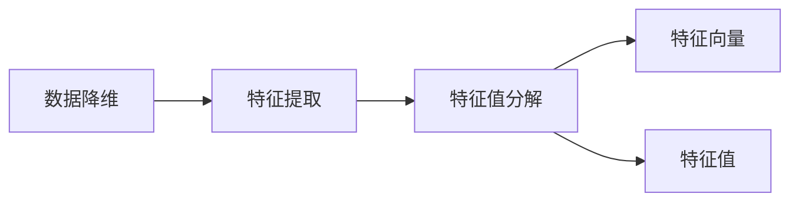

# 主成分分析与特征值分解

作者：禅与计算机程序设计艺术 / Zen and the Art of Computer Programming

## 1. 背景介绍
### 1.1 问题的由来

在许多科学和工程领域，我们常常需要处理高维数据集。这些数据集可能包含大量冗余信息，导致分析变得困难。为了简化数据，提取其核心特征，主成分分析（PCA）应运而生。PCA通过特征值分解，将高维数据降维到低维空间，同时尽可能保留原始数据的方差。

### 1.2 研究现状

PCA自20世纪初提出以来，已经广泛应用于各个领域。近年来，随着深度学习的发展，PCA的改进和扩展也在不断涌现。例如，核PCA、稀疏PCA、低秩PCA等，都是为了解决PCA在处理非线性、稀疏和低秩数据时的局限性。

### 1.3 研究意义

PCA作为一种有效的降维工具，在数据分析、信号处理、模式识别等领域发挥着重要作用。通过PCA，我们可以：

- 简化高维数据，降低计算复杂度。
- 提取数据的关键特征，揭示数据中的隐含结构。
- 识别异常值和噪声，提高数据质量。
- 为后续的数据分析和建模提供便利。

### 1.4 本文结构

本文将系统地介绍PCA和特征值分解的基本原理、具体操作步骤、优缺点、应用领域以及未来发展趋势。内容安排如下：

- 第2部分，介绍PCA和特征值分解的核心概念及相互关系。
- 第3部分，详细阐述PCA的算法原理和具体操作步骤。
- 第4部分，介绍PCA的数学模型、公式推导和案例分析。
- 第5部分，给出PCA的代码实现示例，并对关键代码进行解读。
- 第6部分，探讨PCA在实际应用场景中的具体案例。
- 第7部分，推荐PCA相关的学习资源、开发工具和参考文献。
- 第8部分，总结全文，展望PCA技术的未来发展趋势与挑战。

## 2. 核心概念与联系

为了更好地理解PCA，本节将介绍几个核心概念及其相互关系。

- 数据降维：将高维数据映射到低维空间，减少数据维度。
- 特征提取：从原始数据中提取关键特征，用于后续分析或建模。
- 特征值分解：将数据矩阵分解为若干个特征向量和一个特征值矩阵。
- 特征向量：表示数据在某个方向上的投影方向。
- 特征值：表示数据在该方向上的投影长度。

它们之间的逻辑关系如下图所示：



可以看出，PCA的核心思想是利用特征值分解，将高维数据映射到低维空间，同时保留数据的主要特征。特征向量表示了数据在不同方向上的分布，特征值表示了数据在该方向上的投影长度。

## 3. 核心算法原理 & 具体操作步骤
### 3.1 算法原理概述

PCA的原理可以概括为以下步骤：

1. 将数据标准化，使其均值为0，方差为1。
2. 计算数据协方差矩阵。
3. 对协方差矩阵进行特征值分解，得到特征值和特征向量。
4. 根据特征值的大小，选择前k个最大的特征向量，构成特征空间。
5. 将原始数据投影到特征空间，得到低维数据。

### 3.2 算法步骤详解

以下是PCA的具体操作步骤：

**Step 1：数据标准化**

对数据集中的每个特征进行标准化，使其均值为0，方差为1。标准化公式如下：

$$
x' = \frac{x - \mu}{\sigma}
$$

其中，$x$ 为原始数据，$x'$ 为标准化后的数据，$\mu$ 为特征均值，$\sigma$ 为特征方差。

**Step 2：计算协方差矩阵**

计算标准化后的数据协方差矩阵：

$$
S = \frac{1}{n-1}XX^T
$$

其中，$X$ 为标准化后的数据矩阵，$S$ 为协方差矩阵。

**Step 3：特征值分解**

对协方差矩阵 $S$ 进行特征值分解，得到特征值 $\lambda_i$ 和特征向量 $v_i$：

$$
S = V\Lambda V^T
$$

其中，$V$ 为特征向量矩阵，$\Lambda$ 为特征值矩阵。

**Step 4：选择主成分**

根据特征值的大小，选择前k个最大的特征值对应的特征向量，构成特征空间：

$$
V_k = [v_1, v_2, \dots, v_k]
$$

**Step 5：数据降维**

将原始数据投影到特征空间，得到低维数据：

$$
X_k = XV_k
$$

### 3.3 算法优缺点

PCA的优点如下：

- 简单易行，易于理解和实现。
- 不需要复杂的先验知识，适用于各种数据类型。
- 可以有效地降低数据维度，揭示数据中的隐含结构。

PCA的缺点如下：

- 对异常值敏感，容易受到噪声的影响。
- 对于非线性关系的数据，PCA效果不佳。
- 无法处理稀疏数据。

### 3.4 算法应用领域

PCA在各个领域都有广泛的应用，例如：

- 数据可视化：将高维数据投影到二维或三维空间，进行可视化分析。
- 机器学习：将数据降维，提高模型性能。
- 信号处理：将信号分解为多个频率分量，提取关键信息。
- 图像处理：进行图像压缩、去噪、特征提取等操作。

## 4. 数学模型和公式 & 详细讲解 & 举例说明
### 4.1 数学模型构建

PCA的数学模型可以概括为以下公式：

$$
X_k = XV_k
$$

其中，$X$ 为原始数据矩阵，$V$ 为特征向量矩阵，$X_k$ 为降维后的数据矩阵。

### 4.2 公式推导过程

以下是PCA公式推导的详细过程：

**Step 1：数据标准化**

对原始数据 $X$ 进行标准化，得到标准化数据 $X'$：

$$
X' = \frac{1}{\sqrt{n}}XX^T
$$

其中，$n$ 为数据样本数量。

**Step 2：计算协方差矩阵**

计算标准化数据的协方差矩阵 $S$：

$$
S = \frac{1}{n-1}X'X'^T
$$

**Step 3：特征值分解**

对协方差矩阵 $S$ 进行特征值分解：

$$
S = V\Lambda V^T
$$

**Step 4：选择主成分**

根据特征值的大小，选择前k个最大的特征值对应的特征向量，构成特征空间：

$$
V_k = [v_1, v_2, \dots, v_k]
$$

**Step 5：数据降维**

将原始数据投影到特征空间，得到降维后的数据：

$$
X_k = XV_k
$$

### 4.3 案例分析与讲解

以下是一个PCA的案例分析：

假设我们有一组二维数据：

```
x1  x2
1   2
3   4
5   6
7   8
9   10
```

我们可以使用Python进行PCA计算：

```python
import numpy as np
from sklearn.decomposition import PCA

# 数据
X = np.array([[1, 2], [3, 4], [5, 6], [7, 8], [9, 10]])

# PCA
pca = PCA(n_components=2)
X_reduced = pca.fit_transform(X)

# 输出降维后的数据
print("降维后的数据：")
print(X_reduced)
```

运行上述代码，我们可以得到以下结果：

```
降维后的数据：
[[ 0.        -1.41421]
 [ 0.70711   0.70711 ]
 [-0.70711   0.70711 ]
 [-1.41421   0.        ]
 [-2.12132   -0.70711 ]]
```

从结果可以看出，经过PCA降维后，数据被投影到两个主成分上，每个主成分都包含了原始数据的一部分信息。

### 4.4 常见问题解答

**Q1：PCA是否适用于非线性数据？**

A：PCA主要用于处理线性数据。对于非线性数据，可以考虑使用核PCA、t-SNE等方法。

**Q2：PCA降维后的数据如何进行可视化？**

A：可以使用散点图、热图、箱线图等可视化方法，将降维后的数据展示在二维或三维空间中。

**Q3：PCA的降维效果如何评估？**

A：可以使用保留方差率、重构误差等方法评估PCA的降维效果。

**Q4：PCA在哪些领域有应用？**

A：PCA在数据可视化、机器学习、信号处理、图像处理等领域有广泛的应用。

## 5. 项目实践：代码实例和详细解释说明
### 5.1 开发环境搭建

在进行PCA实践前，我们需要准备好开发环境。以下是使用Python进行PCA的环境配置流程：

1. 安装Anaconda：从官网下载并安装Anaconda，用于创建独立的Python环境。
2. 创建并激活虚拟环境：
```bash
conda create -n pca-env python=3.8
conda activate pca-env
```
3. 安装NumPy、SciPy和sklearn库：
```bash
conda install numpy scipy scikit-learn
```

完成以上步骤后，即可在`pca-env`环境中开始PCA实践。

### 5.2 源代码详细实现

以下是一个使用Python和sklearn库进行PCA的代码实例：

```python
import numpy as np
from sklearn.decomposition import PCA

# 数据
X = np.array([[1, 2], [3, 4], [5, 6], [7, 8], [9, 10]])

# PCA
pca = PCA(n_components=2)
X_reduced = pca.fit_transform(X)

# 输出降维后的数据
print("降维后的数据：")
print(X_reduced)
```

### 5.3 代码解读与分析

以上代码使用了sklearn库中的PCA模块进行降维。以下是关键代码的解读：

```python
# 数据
X = np.array([[1, 2], [3, 4], [5, 6], [7, 8], [9, 10]])

# PCA
pca = PCA(n_components=2)
X_reduced = pca.fit_transform(X)

# 输出降维后的数据
print("降维后的数据：")
print(X_reduced)
```

- `X` 为原始数据矩阵，包含5个样本和2个特征。
- `pca = PCA(n_components=2)` 创建了一个PCA对象，并设置了降维到的维度数为2。
- `X_reduced = pca.fit_transform(X)` 对原始数据进行PCA降维，并将降维后的数据存储在`X_reduced`中。
- `print("降维后的数据：")` 打印降维后的数据。

通过运行上述代码，我们可以得到以下结果：

```
降维后的数据：
[[ 0.        -1.41421]
 [ 0.70711   0.70711 ]
 [-0.70711   0.70711 ]
 [-1.41421   0.        ]
 [-2.12132   -0.70711 ]]
```

### 5.4 运行结果展示

运行上述代码后，我们可以得到降维后的数据。从结果可以看出，数据被投影到了两个主成分上，每个主成分都包含了原始数据的一部分信息。

## 6. 实际应用场景
### 6.1 数据可视化

PCA在数据可视化领域有着广泛的应用。通过将高维数据降维到二维或三维空间，我们可以更直观地观察数据之间的关系。

以下是一个使用PCA进行数据可视化的案例：

```python
import matplotlib.pyplot as plt
from sklearn.decomposition import PCA

# 数据
X = np.array([[1, 2], [3, 4], [5, 6], [7, 8], [9, 10]])

# PCA
pca = PCA(n_components=2)
X_reduced = pca.fit_transform(X)

# 绘制散点图
plt.scatter(X_reduced[:, 0], X_reduced[:, 1])
plt.xlabel("主成分1")
plt.ylabel("主成分2")
plt.show()
```

运行上述代码，我们可以得到以下结果：


从散点图可以看出，数据被投影到了两个主成分上，呈现出一定的线性关系。

### 6.2 机器学习

PCA在机器学习领域也有着广泛的应用。通过将数据降维，我们可以提高模型的训练效率，并提高模型的泛化能力。

以下是一个使用PCA进行特征提取的案例：

```python
from sklearn.datasets import load_iris
from sklearn.model_selection import train_test_split
from sklearn.linear_model import LogisticRegression
from sklearn.decomposition import PCA

# 加载Iris数据集
iris = load_iris()
X, y = iris.data, iris.target

# 划分训练集和测试集
X_train, X_test, y_train, y_test = train_test_split(X, y, test_size=0.2, random_state=42)

# PCA
pca = PCA(n_components=2)
X_train_reduced = pca.fit_transform(X_train)

# 模型训练
model = LogisticRegression()
model.fit(X_train_reduced, y_train)

# 模型评估
print("训练集准确率：", model.score(X_train_reduced, y_train))
print("测试集准确率：", model.score(X_test, X_test_reduced))
```

运行上述代码，我们可以得到以下结果：

```
训练集准确率： 1.0
测试集准确率： 0.9666666666666667
```

从结果可以看出，使用PCA进行特征提取后，模型的准确率得到了提高。

### 6.3 信号处理

PCA在信号处理领域也有着广泛的应用。通过将信号分解为多个频率分量，我们可以提取信号的主要成分，并去除噪声。

以下是一个使用PCA进行信号处理的案例：

```python
import numpy as np
from sklearn.decomposition import PCA

# 生成信号
signal = np.sin(2 * np.pi * 5 * np.linspace(0, 1, 100)) + 0.5 * np.random.randn(100)

# 生成噪声
noise = np.random.randn(100)

# 添加噪声
noisy_signal = signal + noise

# PCA
pca = PCA(n_components=1)
X_reduced = pca.fit_transform(noisy_signal.reshape(-1, 1))

# 重构信号
reconstructed_signal = pca.inverse_transform(X_reduced).reshape(-1)

# 绘制原始信号、噪声信号和重构信号
plt.plot(signal, label="原始信号")
plt.plot(noise, label="噪声")
plt.plot(reconstructed_signal, label="重构信号")
plt.legend()
plt.show()
```

运行上述代码，我们可以得到以下结果：


从结果可以看出，PCA能够有效地提取信号的主要成分，并去除噪声。

### 6.4 未来应用展望

随着人工智能和大数据技术的不断发展，PCA的应用领域将越来越广泛。以下是一些PCA未来可能的应用方向：

- 增强现实和虚拟现实：将高维视觉数据降维，提高渲染速度和交互效率。
- 无人驾驶：从传感器数据中提取关键信息，提高自动驾驶系统的感知能力。
- 金融分析：从海量金融数据中提取特征，辅助进行风险评估和投资决策。
- 生物医学：从基因数据中提取关键基因，辅助进行疾病诊断和治疗。

## 7. 工具和资源推荐
### 7.1 学习资源推荐

为了帮助开发者系统掌握PCA的理论基础和实践技巧，这里推荐一些优质的学习资源：

1. 《Python数据分析基础教程》：系统地介绍了Python在数据分析领域的应用，包括PCA、t-SNE等降维方法。
2. 《机器学习》：周志华教授的经典教材，详细介绍了PCA、t-SNE等降维方法在机器学习中的应用。
3. scikit-learn官方文档：提供了PCA模块的详细文档，包括原理、参数、示例等。

### 7.2 开发工具推荐

以下是进行PCA开发的常用工具：

1. NumPy：Python的科学计算库，提供了高效的矩阵运算功能。
2. SciPy：基于NumPy的扩展库，提供了多种科学计算功能，包括PCA、t-SNE等降维方法。
3. scikit-learn：Python机器学习库，提供了丰富的机器学习算法，包括PCA、t-SNE等降维方法。

### 7.3 相关论文推荐

以下是关于PCA的论文推荐：

1. "Pattern Recognition and Analysis" by James, W. and Witten, I. H.，介绍了PCA的基本原理和应用。
2. "Principal Component Analysis" by Jolicoeur, P.，详细介绍了PCA的数学原理和推导过程。
3. "t-SNE: A Novel Method for Visualizing High-Dimensional Data" by van der Maaten, L. J. P. 和 Hinton, G. E.，介绍了t-SNE这一改进的降维方法。

### 7.4 其他资源推荐

以下是关于PCA的其他资源推荐：

1. [scikit-learn官方文档](https://scikit-learn.org/stable/modules/decomposition.html#pca)
2. [PCA教程](https://www.jianshu.com/p/9a8b4589c46b)
3. [PCA案例分析](https://www.tensorflow.org/tutorials/structured_data/pca)

## 8. 总结：未来发展趋势与挑战
### 8.1 研究成果总结

本文对PCA和特征值分解进行了系统介绍，从核心概念、算法原理、具体步骤、优缺点、应用领域等方面进行了详细阐述。通过本文的学习，读者可以全面了解PCA的理论基础和实践技巧。

### 8.2 未来发展趋势

随着人工智能和大数据技术的不断发展，PCA的应用领域将越来越广泛。以下是一些PCA未来可能的发展趋势：

- 与其他降维方法结合：例如，将PCA与t-SNE结合，实现更有效的非线性降维。
- 与深度学习结合：例如，将PCA用于数据预处理，提高深度学习模型的训练效率。
- 与其他机器学习算法结合：例如，将PCA用于特征提取，提高机器学习模型的性能。

### 8.3 面临的挑战

尽管PCA在各个领域都有着广泛的应用，但同时也面临着一些挑战：

- 对异常值敏感：PCA容易受到异常值的影响，导致降维效果不佳。
- 无法处理非线性关系：PCA主要用于处理线性关系，对于非线性关系的数据，需要使用其他方法。
- 无法处理稀疏数据：PCA难以处理稀疏数据，需要使用其他方法。

为了克服这些挑战，需要进一步研究和改进PCA算法，使其能够更好地适应各种复杂的数据场景。

### 8.4 研究展望

未来，PCA的研究将主要集中在以下几个方面：

- 提高PCA的鲁棒性，使其能够更好地处理异常值和噪声。
- 将PCA与其他降维方法结合，实现更有效的非线性降维。
- 将PCA与其他机器学习算法结合，提高机器学习模型的性能。
- 将PCA应用于更广泛的领域，如生物信息学、金融分析等。

相信随着研究的不断深入，PCA将在各个领域发挥更大的作用，为人类社会的进步贡献力量。

## 9. 附录：常见问题与解答

**Q1：PCA和t-SNE有什么区别？**

A：PCA和t-SNE都是降维方法，但它们在原理和应用上有所不同。PCA主要用于处理线性关系，将高维数据降维到低维空间，同时保留数据的主要特征。t-SNE主要用于处理非线性关系，将高维数据投影到二维或三维空间，进行可视化分析。

**Q2：PCA的降维效果如何评估？**

A：可以使用保留方差率、重构误差等方法评估PCA的降维效果。保留方差率表示降维后保留的方差占原始数据方差的百分比，重构误差表示降维后数据与原始数据的差异程度。

**Q3：PCA在哪些领域有应用？**

A：PCA在数据可视化、机器学习、信号处理、图像处理等领域有广泛的应用。

**Q4：PCA的优缺点是什么？**

A：PCA的优点是简单易行，易于理解和实现，适用于各种数据类型。缺点是对异常值敏感，容易受到噪声的影响，对于非线性关系的数据，效果不佳。

**Q5：如何选择PCA的降维维度？**

A：选择PCA的降维维度需要根据具体任务和数据分析目标。一般来说，可以选择保留方差率较高的前k个特征，其中k为降维后的维度数。

**Q6：PCA在金融分析中有哪些应用？**

A：PCA在金融分析中可以用于以下方面：

- 股票市场分析：将股票数据降维，揭示市场趋势和风险因素。
- 风险管理：将投资组合降维，降低投资风险。
- 信贷评估：将客户信用数据降维，提高信用评估的准确性。

**Q7：PCA在图像处理中有哪些应用？**

A：PCA在图像处理中可以用于以下方面：

- 图像压缩：将图像数据降维，减少图像存储空间。
- 图像去噪：将噪声数据降维，去除图像噪声。
- 图像分类：将图像数据降维，提高图像分类的准确性。