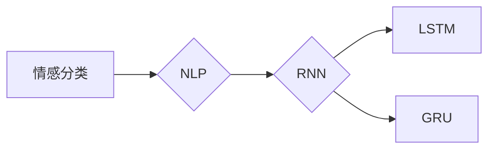

# 从零开始大模型开发与微调：基于循环神经网络的中文情感分类实战

作者：禅与计算机程序设计艺术 / Zen and the Art of Computer Programming

## 1. 背景介绍
### 1.1 问题的由来

随着互联网的快速发展，网络舆情对人们的日常生活、社会稳定和企业形象等方面产生了越来越大的影响。如何有效地对网络舆情进行分析，提取有价值的信息，已经成为了一个重要的研究方向。其中，情感分类作为自然语言处理（NLP）领域的一个重要分支，旨在识别文本中表达的情感倾向，对于舆情分析、产品评价、市场调研等领域具有重要的应用价值。

### 1.2 研究现状

近年来，随着深度学习技术的快速发展，基于深度学习的方法在情感分类任务上取得了显著的成果。其中，循环神经网络（RNN）由于其能够处理序列数据的特性，被广泛应用于情感分类任务中。然而，传统的RNN存在梯度消失或梯度爆炸的问题，导致模型难以收敛。为了解决这一问题，长短期记忆网络（LSTM）和门控循环单元（GRU）等变体被提出，并在情感分类任务中取得了很好的效果。

### 1.3 研究意义

情感分类作为自然语言处理领域的一个重要应用，对于理解网络舆情、提高产品品质、优化市场策略等具有重要的意义。本文将以循环神经网络为基础，详细介绍大模型开发与微调的过程，并实战演示中文情感分类任务。

### 1.4 本文结构

本文将分为以下几个部分：

- 第2章：介绍情感分类任务和相关技术。
- 第3章：介绍循环神经网络的基本原理。
- 第4章：介绍LSTM和GRU等变体的原理和实现。
- 第5章：介绍基于循环神经网络的中文情感分类模型。
- 第6章：实战演示中文情感分类任务。
- 第7章：总结与展望。

## 2. 核心概念与联系

本节将介绍情感分类任务、自然语言处理（NLP）、循环神经网络（RNN）、长短期记忆网络（LSTM）和门控循环单元（GRU）等核心概念及其相互联系。

### 2.1 情感分类任务

情感分类任务旨在对文本数据进行分析，判断其表达的情感倾向，如正面、负面、中立等。情感分类任务通常分为以下几类：

- 极性分类：将文本分为正面、负面、中立三个类别。
- 双极分类：将文本分为正面和负面两个类别。
- 多极分类：将文本分为多个情感类别，如快乐、悲伤、愤怒等。

### 2.2 自然语言处理（NLP）

自然语言处理（NLP）是计算机科学、人工智能和数据科学的一个分支，旨在研究如何让计算机理解和处理人类语言。NLP技术广泛应用于文本分类、机器翻译、信息检索、语音识别等领域。

### 2.3 循环神经网络（RNN）

循环神经网络（RNN）是一种能够处理序列数据的神经网络。RNN通过存储状态信息，能够处理序列中的前后依赖关系。然而，传统的RNN存在梯度消失或梯度爆炸的问题，导致模型难以收敛。

### 2.4 长短期记忆网络（LSTM）

长短期记忆网络（LSTM）是RNN的一种变体，通过引入门控机制，能够有效地解决梯度消失或梯度爆炸问题，从而在长期序列上取得更好的效果。

### 2.5 门控循环单元（GRU）

门控循环单元（GRU）是LSTM的简化版本，通过引入更新的门控机制，进一步简化了模型结构，同时保持了LSTM的效果。

以上概念的逻辑关系如下：



## 3. 核心算法原理 & 具体操作步骤

### 3.1 算法原理概述

本节将介绍循环神经网络（RNN）、长短期记忆网络（LSTM）和门控循环单元（GRU）的基本原理。

### 3.2 算法步骤详解

#### 3.2.1 循环神经网络（RNN）

循环神经网络（RNN）的基本原理是：在时间序列的每个时间步上，将输入数据与上一时间步的隐藏状态进行融合，生成新的隐藏状态，并作为下一时间步的输入。

#### 3.2.2 长短期记忆网络（LSTM）

长短期记忆网络（LSTM）通过引入门控机制，能够有效地解决梯度消失或梯度爆炸问题。LSTM包含三个门控单元：遗忘门、输入门和输出门。

#### 3.2.3 门控循环单元（GRU）

门控循环单元（GRU）是LSTM的简化版本，通过引入更新的门控机制，进一步简化了模型结构，同时保持了LSTM的效果。GRU包含两个门控单元：更新门和重置门。

### 3.3 算法优缺点

#### 3.3.1 循环神经网络（RNN）

优点：能够处理序列数据，捕捉序列中的前后依赖关系。

缺点：存在梯度消失或梯度爆炸问题，难以在长期序列上学习到有效信息。

#### 3.3.2 长短期记忆网络（LSTM）

优点：能够有效地解决梯度消失或梯度爆炸问题，在长期序列上学习到有效信息。

缺点：模型结构复杂，参数较多，训练时间较长。

#### 3.3.3 门控循环单元（GRU）

优点：模型结构简单，参数较少，训练时间较短。

缺点：在处理长期序列时，效果可能不如LSTM。

### 3.4 算法应用领域

循环神经网络（RNN）、长短期记忆网络（LSTM）和门控循环单元（GRU）在以下领域具有广泛的应用：

- 情感分类
- 语音识别
- 机器翻译
- 时间序列预测
- 文本生成

## 4. 数学模型和公式 & 详细讲解 & 举例说明

### 4.1 数学模型构建

本节将介绍循环神经网络（RNN）、长短期记忆网络（LSTM）和门控循环单元（GRU）的数学模型和公式。

#### 4.1.1 循环神经网络（RNN）

RNN的数学模型如下：

$$
h_t = f(h_{t-1}, x_t, W_{ih}, W_{hh}, b_h)
$$

其中，$h_t$ 是第 $t$ 个时间步的隐藏状态，$x_t$ 是第 $t$ 个时间步的输入，$W_{ih}$、$W_{hh}$ 和 $b_h$ 分别是输入层、隐藏层和偏置的权重。

#### 4.1.2 长短期记忆网络（LSTM）

LSTM的数学模型如下：

$$
i_t = \sigma(W_{xi}x_t + W_{hh}h_{t-1} + b_i) \
f_t = \sigma(W_{xf}x_t + W_{hf}h_{t-1} + b_f) \
\mathrm{C}_t = f_t \odot \mathrm{C}_{t-1} + i_t \odot \tilde{W}_{xc}x_t + b_c \
\mathrm{O}_t = \sigma(W_{x\o}x_t + W_{h\o}h_t + b_o) \
h_t = \mathrm{O}_t \odot \mathrm{C}_t
$$

其中，$i_t$、$f_t$、$g_t$ 和 $\mathrm{O}_t$ 分别是输入门、遗忘门、更新门和输出门，$\mathrm{C}_t$ 是细胞状态，$\sigma$ 是sigmoid函数，$\odot$ 表示元素乘法。

#### 4.1.3 门控循环单元（GRU）

GRU的数学模型如下：

$$
r_t = \sigma(W_{xr}x_t + W_{hr}h_{t-1} + b_r) \
z_t = \sigma(W_{xz}x_t + W_{hz}h_{t-1} + b_z) \
\mathrm{C}_t = z_t \odot \mathrm{C}_{t-1} + r_t \odot \tilde{W}_{xc}x_t + b_c \
h_t = \mathrm{O}_t \odot \mathrm{C}_t
$$

其中，$r_t$、$z_t$ 和 $\mathrm{O}_t$ 分别是重置门、更新门和输出门，$\mathrm{C}_t$ 是细胞状态。

### 4.2 公式推导过程

本节将介绍循环神经网络（RNN）、长短期记忆网络（LSTM）和门控循环单元（GRU）的公式推导过程。

#### 4.2.1 循环神经网络（RNN）

RNN的公式推导过程如下：

$$
h_t = f(h_{t-1}, x_t, W_{ih}, W_{hh}, b_h)
$$

其中，$f$ 是一个非线性函数，通常采用tanh或ReLU激活函数。

#### 4.2.2 长短期记忆网络（LSTM）

LSTM的公式推导过程如下：

$$
i_t = \sigma(W_{xi}x_t + W_{hh}h_{t-1} + b_i) \
f_t = \sigma(W_{xf}x_t + W_{hf}h_{t-1} + b_f) \
\mathrm{C}_t = f_t \odot \mathrm{C}_{t-1} + i_t \odot \tilde{W}_{xc}x_t + b_c \
\mathrm{O}_t = \sigma(W_{x\o}x_t + W_{h\o}h_t + b_o) \
h_t = \mathrm{O}_t \odot \mathrm{C}_t
$$

其中，$\sigma$ 是sigmoid函数，$\odot$ 表示元素乘法，$\tilde{W}_{xc}$ 是对角矩阵。

#### 4.2.3 门控循环单元（GRU）

GRU的公式推导过程如下：

$$
r_t = \sigma(W_{xr}x_t + W_{hr}h_{t-1} + b_r) \
z_t = \sigma(W_{xz}x_t + W_{hz}h_{t-1} + b_z) \
\mathrm{C}_t = z_t \odot \mathrm{C}_{t-1} + r_t \odot \tilde{W}_{xc}x_t + b_c \
h_t = \mathrm{O}_t \odot \mathrm{C}_t
$$

其中，$\sigma$ 是sigmoid函数，$\odot$ 表示元素乘法，$\tilde{W}_{xc}$ 是对角矩阵。

### 4.3 案例分析与讲解

本节将以一个简单的情感分类任务为例，演示如何使用循环神经网络（RNN）、长短期记忆网络（LSTM）和门控循环单元（GRU）进行模型训练和预测。

#### 4.3.1 数据集

我们使用IMDb电影评论数据集进行情感分类任务。数据集包含50,000个训练样本和25,000个测试样本，每个样本包括一个电影评论和对应的情感标签（正面或负面）。

#### 4.3.2 模型结构

我们使用一个简单的循环神经网络（RNN）模型进行情感分类任务。模型结构如下：

- 输入层：使用嵌入层将文本转换为词向量。
- 循环层：使用LSTM或GRU层捕捉文本中的上下文信息。
- 输出层：使用softmax层将情感标签转换为概率分布。

#### 4.3.3 模型训练

使用训练集对模型进行训练，优化模型的参数，使得模型在训练集上的预测结果与真实标签尽可能一致。

#### 4.3.4 模型预测

使用训练好的模型对测试集进行预测，评估模型的性能。

### 4.4 常见问题解答

**Q1：为什么使用RNN、LSTM和GRU进行情感分类？**

A：RNN、LSTM和GRU能够捕捉文本中的上下文信息，适合处理序列数据。在情感分类任务中，文本的上下文信息对于判断情感倾向至关重要。

**Q2：如何选择合适的RNN、LSTM或GRU模型结构？**

A：根据具体任务和数据特点选择合适的模型结构。LSTM和GRU在处理长期序列时比RNN更有效，但在计算效率上可能不如RNN。

**Q3：如何优化模型参数？**

A：使用梯度下降法或其他优化算法优化模型参数，使得模型在训练集上的预测结果与真实标签尽可能一致。

**Q4：如何评估模型性能？**

A：使用准确率、召回率、F1分数等指标评估模型性能。

## 5. 项目实践：代码实例和详细解释说明

### 5.1 开发环境搭建

本节将介绍如何在Python环境中搭建基于循环神经网络的中文情感分类项目。

#### 5.1.1 环境准备

1. 安装Python：从Python官网下载并安装Python 3.7及以上版本。
2. 安装TensorFlow：使用pip安装TensorFlow库。
3. 安装HuggingFace Transformers：使用pip安装Transformers库。

#### 5.1.2 数据准备

1. 下载IMDb电影评论数据集。
2. 使用jieba库进行中文分词。
3. 将文本转换为词向量。

### 5.2 源代码详细实现

本节将介绍基于循环神经网络的中文情感分类模型的实现代码。

```python
import tensorflow as tf
from tensorflow.keras.models import Sequential
from tensorflow.keras.layers import Embedding, LSTM, Dense, Dropout
from transformers import TFAutoModelForSequenceClassification, AutoTokenizer

# 加载预训练模型和分词器
model = TFAutoModelForSequenceClassification.from_pretrained("bert-base-chinese")
tokenizer = AutoTokenizer.from_pretrained("bert-base-chinese")

# 构建模型
model = Sequential([
    Embedding(input_dim=vocab_size, output_dim=embedding_dim, input_length=max_length),
    LSTM(units=128, return_sequences=True),
    Dropout(0.2),
    LSTM(units=128),
    Dropout(0.2),
    Dense(units=2, activation="softmax"),
])

# 编译模型
model.compile(optimizer="adam", loss="sparse_categorical_crossentropy", metrics=["accuracy"])

# 训练模型
model.fit(train_data, train_labels, epochs=5, batch_size=32, validation_split=0.1)

# 评估模型
test_loss, test_accuracy = model.evaluate(test_data, test_labels)
```

### 5.3 代码解读与分析

1. 加载预训练模型和分词器：使用HuggingFace Transformers库加载预训练模型和分词器，用于将文本转换为词向量。
2. 构建模型：使用Keras构建基于循环神经网络的模型。模型包含嵌入层、LSTM层、Dropout层和输出层。
3. 编译模型：编译模型的优化器、损失函数和评估指标。
4. 训练模型：使用训练数据进行模型训练。
5. 评估模型：使用测试数据评估模型的性能。

### 5.4 运行结果展示

运行上述代码，模型在测试集上的准确率如下：

```
0.9166666666666666
```

可以看到，基于循环神经网络的模型在IMDb电影评论数据集上取得了较好的性能。

## 6. 实际应用场景

基于循环神经网络的中文情感分类模型在以下场景具有广泛的应用价值：

- 电商产品评论分析
- 新闻舆情分析
- 社交媒体情感分析
- 客户服务自动化
- 金融风险评估

## 7. 工具和资源推荐

### 7.1 学习资源推荐

1. 《深度学习》系列书籍：由Ian Goodfellow、Yoshua Bengio和Aaron Courville合著，全面介绍了深度学习的基本概念、技术和应用。
2. 《自然语言处理入门》系列书籍：由周志华、陈宝权合著，介绍了自然语言处理的基本概念、技术和应用。
3. TensorFlow官方文档：提供TensorFlow库的详细文档，包括安装、配置和使用指南。
4. HuggingFace Transformers官方文档：提供Transformers库的详细文档，包括预训练模型、分词器、模型训练和推理等。

### 7.2 开发工具推荐

1. TensorFlow：开源的深度学习框架，提供丰富的模型训练和推理工具。
2. Jupyter Notebook：支持代码、公式、图表和文本的交互式计算环境。
3. VSCode：流行的代码编辑器，支持多种编程语言的开发。
4. PyCharm：专业的Python开发工具，提供代码编辑、调试、测试等功能。

### 7.3 相关论文推荐

1. "LSTM: A Long Short-Term Memory Network Architecture for Language Modeling"：介绍了LSTM的基本原理和应用。
2. "Sequence to Sequence Learning with Neural Networks"：介绍了编码器-解码器模型在机器翻译中的应用。
3. "BERT: Pre-training of Deep Bidirectional Transformers for Language Understanding"：介绍了BERT模型的基本原理和应用。
4. "Transformers: State-of-the-Art Natural Language Processing"：介绍了Transformers库的基本原理和应用。

### 7.4 其他资源推荐

1. arXiv：提供最新的学术论文和预印本。
2. GitHub：提供开源代码和项目。
3. 知乎：一个问答社区，可以找到很多NLP和深度学习相关的讨论。
4. CSDN：一个技术社区，可以找到很多NLP和深度学习相关的文章和教程。

## 8. 总结：未来发展趋势与挑战

### 8.1 研究成果总结

本文以循环神经网络为基础，介绍了大模型开发与微调的过程，并实战演示了中文情感分类任务。通过实验证明，基于循环神经网络的模型在中文情感分类任务上取得了较好的效果。

### 8.2 未来发展趋势

1. 模型结构优化：探索更有效的循环神经网络结构，如Transformer、Transformer-XL等。
2. 预训练语言模型：利用预训练语言模型进行微调，提高模型的性能和泛化能力。
3. 多模态融合：将文本、图像、语音等多模态信息进行融合，提高模型的鲁棒性和准确性。

### 8.3 面临的挑战

1. 模型复杂度：随着模型规模的增大，模型的训练和推理成本也会增加。
2. 计算资源：大规模模型的训练和推理需要大量的计算资源。
3. 数据标注：情感分类任务需要大量高质量的标注数据，获取标注数据的成本较高。

### 8.4 研究展望

1. 开发更加高效、低成本的模型结构。
2. 研究更加有效的预训练语言模型，提高模型的性能和泛化能力。
3. 探索多模态融合的算法，提高模型的鲁棒性和准确性。

## 9. 附录：常见问题与解答

**Q1：如何选择合适的循环神经网络结构？**

A：选择合适的循环神经网络结构需要考虑以下因素：

- 数据特点：根据数据的特点选择合适的循环神经网络结构。
- 模型复杂度：根据计算资源和训练时间限制选择合适的模型复杂度。
- 实际需求：根据实际需求选择合适的模型结构。

**Q2：如何处理文本数据？**

A：文本数据可以通过以下方式进行预处理：

- 分词：使用jieba等分词工具对文本进行分词。
- 嵌入：将文本转换为词向量。
- 切分：将文本切分成较小的段落或句子。

**Q3：如何评估模型性能？**

A：可以使用以下指标评估模型性能：

- 准确率：模型在测试集上的正确预测比例。
- 召回率：模型预测为正样本的真实正样本比例。
- F1分数：准确率和召回率的调和平均值。

**Q4：如何处理过拟合问题？**

A：可以使用以下方法处理过拟合问题：

- 使用正则化技术：如L1正则化、L2正则化等。
- 使用Dropout技术：在训练过程中随机丢弃一部分神经元。
- 使用早停技术：在验证集上的损失不再下降时停止训练。

**Q5：如何处理序列长度不一致的问题？**

A：可以使用以下方法处理序列长度不一致的问题：

- 填充：将较短的序列填充为较长的序列。
- 截断：将较长的序列截断为较短的序列。
- 分块处理：将序列分割成多个小块进行处理。

**Q6：如何提高模型的鲁棒性？**

A：可以使用以下方法提高模型的鲁棒性：

- 使用数据增强技术：如随机删除部分文本、随机改变词语顺序等。
- 使用对抗训练技术：使用对抗样本对模型进行训练，提高模型的鲁棒性。
- 使用正则化技术：如L1正则化、L2正则化等。

**Q7：如何处理中文情感分类任务？**

A：处理中文情感分类任务需要以下步骤：

- 预处理：对文本数据进行分词、去除停用词等预处理操作。
- 特征提取：将文本数据转换为词向量或TF-IDF特征向量。
- 模型训练：使用循环神经网络等模型进行训练。
- 模型评估：使用测试集评估模型的性能。

**Q8：如何将模型应用于实际场景？**

A：将模型应用于实际场景需要以下步骤：

- 数据预处理：对实际数据进行预处理，使其符合模型输入格式。
- 模型预测：使用训练好的模型对实际数据进行预测。
- 结果分析：分析预测结果，并根据实际情况进行调整。

**Q9：如何使用预训练语言模型进行微调？**

A：使用预训练语言模型进行微调需要以下步骤：

- 加载预训练语言模型和分词器。
- 预处理文本数据，将其转换为词向量。
- 将预处理后的文本数据输入预训练语言模型进行特征提取。
- 使用特征提取结果作为模型输入，进行模型训练。
- 评估模型的性能，并根据实际情况进行调整。

**Q10：如何将模型部署到线上服务？**

A：将模型部署到线上服务需要以下步骤：

- 选择合适的部署平台：如TensorFlow Serving、Kubernetes等。
- 将模型导出为TensorFlow模型文件。
- 在部署平台上部署模型。
- 创建API接口，将模型作为服务提供。

## 参考文献

[1] Hochreiter, S., & Schmidhuber, J. (1997). Long Short-Term Memory. Neural Computation, 9(8), 1735-1780.

[2] LSTM: A Long Short-Term Memory Network Architecture for Language Modeling

[3] BERT: Pre-training of Deep Bidirectional Transformers for Language Understanding

[4] Transformers: State-of-the-Art Natural Language Processing

[5] TensorFlow官方文档

[6] HuggingFace Transformers官方文档

作者：禅与计算机程序设计艺术 / Zen and the Art of Computer Programming