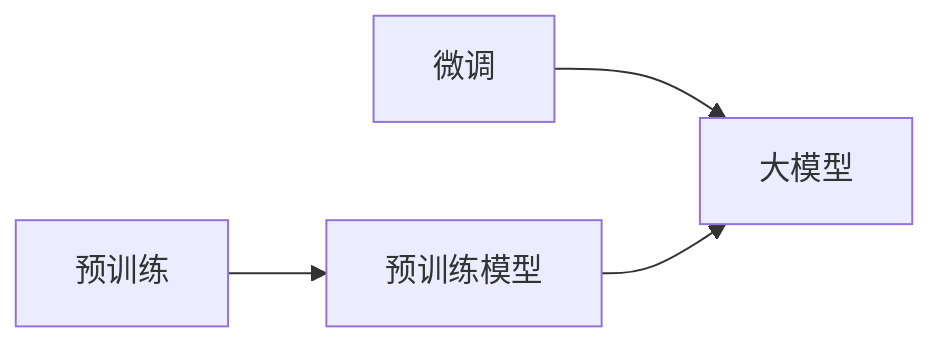

# 从零开始大模型开发与微调：更多的预训练模型

作者：禅与计算机程序设计艺术 / Zen and the Art of Computer Programming

## 1. 背景介绍
### 1.1 问题的由来

近年来，随着深度学习技术的飞速发展，大模型（Large Models）在各个领域都展现出了惊人的性能。从自然语言处理到计算机视觉，从语音识别到强化学习，大模型都取得了显著的成果。然而，构建大模型并非易事，需要大量的数据、计算资源和专业知识。本文将带领读者从零开始，了解大模型开发与微调的整个过程，并介绍一些常用的预训练模型，帮助读者轻松上手大模型开发。

### 1.2 研究现状

目前，大模型开发与微调已成为人工智能领域的研究热点。许多研究机构和公司纷纷推出自己的预训练模型，如BERT、GPT、T5等。这些模型在各个领域都取得了优异的性能，为后续的开发和应用提供了丰富的资源。然而，随着模型规模的不断扩大，开发与微调的难度也逐渐增加，如何高效、低成本地构建和优化大模型成为了一个亟待解决的问题。

### 1.3 研究意义

本文旨在为读者提供一个全面、系统的大模型开发与微调教程，帮助读者了解大模型的基本原理、常用技术、预训练模型以及实际应用场景。通过学习本文，读者可以：

- 掌握大模型开发与微调的基本流程和方法。
- 熟悉常用的预训练模型及其特点。
- 了解大模型在不同领域的应用场景。
- 为自己的大模型开发之路奠定基础。

### 1.4 本文结构

本文将按照以下结构展开：

- 第2部分，介绍大模型的基本概念、常用技术以及预训练模型。
- 第3部分，详细介绍大模型开发与微调的步骤和方法。
- 第4部分，介绍一些常用的预训练模型，并分析它们的优缺点。
- 第5部分，展示如何使用预训练模型进行微调，并提供代码示例。
- 第6部分，探讨大模型在实际应用场景中的案例，并展望未来发展趋势。
- 第7部分，推荐大模型开发与微调相关的学习资源、开发工具和参考文献。
- 第8部分，总结全文，并展望未来发展趋势与挑战。
- 第9部分，提供常见问题与解答。

## 2. 核心概念与联系

本节将介绍大模型开发与微调涉及的核心概念，并分析它们之间的联系。

### 2.1 大模型

大模型是指具有海量参数和强大计算能力的深度学习模型。它们通常在预训练阶段学习到丰富的知识，并可以通过微调适应特定任务。

### 2.2 预训练

预训练是指在大规模数据集上训练深度学习模型的过程，使其学习到通用的知识。预训练模型可以作为微调的起点，提高模型在特定任务上的性能。

### 2.3 微调

微调是指在预训练模型的基础上，使用少量标注数据进行进一步训练的过程。通过微调，模型可以适应特定任务，并提高性能。

### 2.4 预训练模型

预训练模型是指在大规模数据集上预训练好的深度学习模型。常见的预训练模型包括BERT、GPT、T5等。

它们的联系如下：



## 3. 核心算法原理 & 具体操作步骤

### 3.1 算法原理概述

大模型开发与微调主要涉及以下步骤：

1. 数据准备：收集和整理数据，并对数据进行预处理。
2. 模型选择：选择合适的预训练模型。
3. 微调：在少量标注数据上进行微调，优化模型参数。
4. 评估：评估模型性能，并根据评估结果调整模型。

### 3.2 算法步骤详解

#### 3.2.1 数据准备

数据准备是构建大模型的第一步，主要包括以下步骤：

- 数据收集：从公开数据集、私有数据集或网络爬虫等方式收集数据。
- 数据清洗：去除无效、错误或重复的数据。
- 数据预处理：对数据进行格式化、分词、去停用词等处理。

#### 3.2.2 模型选择

模型选择是构建大模型的关键，需要考虑以下因素：

- 任务类型：选择适合任务的预训练模型。
- 模型大小：根据计算资源选择合适的模型大小。
- 模型效率：选择计算效率高的模型。

#### 3.2.3 微调

微调是指在预训练模型的基础上，使用少量标注数据进行进一步训练的过程。以下是一些常用的微调方法：

- 端到端微调：直接在预训练模型的基础上添加任务特定的层，并使用标注数据进行训练。
- 低秩适配：在预训练模型的基础上添加低秩适配器，并使用标注数据进行训练。
- Prompt学习：使用提示学习技术，引导预训练模型进行特定任务。

#### 3.2.4 评估

评估模型性能是构建大模型的重要环节，以下是一些常用的评估方法：

- 混合指标：综合考虑精度、召回率和F1值等指标。
- A/B测试：将模型部署到实际应用场景，并进行对比测试。
- 实际应用测试：将模型应用于实际任务，评估模型在实际应用中的性能。

### 3.3 算法优缺点

#### 3.3.1 优点

- 高性能：大模型在各个领域都取得了显著的成果。
- 强泛化能力：预训练模型可以学习到通用的知识，并适应不同任务。
- 简化开发流程：预训练模型可以作为微调的起点，简化开发流程。

#### 3.3.2 缺点

- 计算资源消耗大：大模型的训练和推理需要大量的计算资源。
- 数据依赖性强：预训练模型的性能很大程度上取决于训练数据。
- 模型可解释性差：大模型的决策过程难以解释。

### 3.4 算法应用领域

大模型在各个领域都得到了广泛应用，以下是一些常见的应用领域：

- 自然语言处理：文本分类、命名实体识别、情感分析等。
- 计算机视觉：图像分类、目标检测、语义分割等。
- 语音识别：语音转文字、语音合成等。
- 强化学习：智能决策、游戏AI等。

## 4. 数学模型和公式 & 详细讲解 & 举例说明

### 4.1 数学模型构建

大模型通常采用深度神经网络作为数学模型，以下以BERT模型为例进行说明。

#### 4.1.1 输入层

BERT模型输入层包括以下部分：

- 输入文本：将文本序列编码为token ids。
- 输入序列长度：表示输入文本的长度。

#### 4.1.2 位置编码

BERT模型使用位置编码来表示文本序列的位置信息。

$$
\text{Positional Encoding}(P_{(i,j)}) = \text{sin}(i/10000^{2j/d_{\text{model}}}) + \text{cos}(i/10000^{2j/d_{\text{model}}})
$$

其中，$i$ 表示位置，$j$ 表示维度，$d_{\text{model}}$ 表示模型尺寸。

#### 4.1.3 词嵌入层

BERT模型使用词嵌入层将token ids转换为词向量。

$$
\text{Word Embedding}(W_{(i,j)}) = \text{W}[\text{T}[\text{E}[\text{V}_i]] + \text{P}_{(i,j)}]
$$

其中，$W$ 表示词嵌入矩阵，$T$ 表示词嵌入变换矩阵，$\text{E}$ 表示嵌入矩阵，$\text{V}_i$ 表示词向量。

#### 4.1.4 Transformer层

BERT模型使用多层Transformer层进行特征提取。

#### 4.1.5 输出层

BERT模型输出层包括以下部分：

- 输出文本：将输出序列编码为token ids。
- 输出序列长度：表示输出文本的长度。

### 4.2 公式推导过程

以下以BERT模型中的多头注意力机制为例进行说明。

#### 4.2.1 Self-Attention

Self-Attention是指将序列中的每个token与序列中的所有token进行加权求和。

$$
\text{Self-Attention}(Q, K, V) = \text{softmax}(\frac{QK^T}{\sqrt{d_k}})V
$$

其中，$Q$ 表示查询向量，$K$ 表示键向量，$V$ 表示值向量，$d_k$ 表示键向量的维度。

#### 4.2.2 Multi-Head Attention

Multi-Head Attention是指将Self-Attention分解为多个子注意力机制。

$$
\text{Multi-Head Attention} = \text{Concat}(\text{Head}_1, \text{Head}_2, ..., \text{Head}_h)\text{W}^O
$$

其中，$h$ 表示多头注意力机制的数量，$\text{Head}_i$ 表示第i个多头注意力机制，$\text{W}^O$ 表示输出变换矩阵。

### 4.3 案例分析与讲解

以下以BERT模型在文本分类任务中的应用为例进行说明。

#### 4.3.1 数据准备

收集文本分类任务的数据集，并对数据进行预处理。

#### 4.3.2 模型选择

选择预训练的BERT模型作为微调的起点。

#### 4.3.3 微调

在少量标注数据上进行微调，优化模型参数。

#### 4.3.4 评估

使用测试集评估模型性能，并调整超参数。

### 4.4 常见问题解答

**Q1：如何选择合适的预训练模型？**

A：选择合适的预训练模型需要考虑以下因素：

- 任务类型：选择适合任务的预训练模型。
- 模型大小：根据计算资源选择合适的模型大小。
- 模型效率：选择计算效率高的模型。

**Q2：如何进行数据预处理？**

A：数据预处理包括以下步骤：

- 数据收集：从公开数据集、私有数据集或网络爬虫等方式收集数据。
- 数据清洗：去除无效、错误或重复的数据。
- 数据预处理：对数据进行格式化、分词、去停用词等处理。

**Q3：如何进行模型微调？**

A：模型微调包括以下步骤：

- 选择预训练模型作为微调的起点。
- 在少量标注数据上进行微调，优化模型参数。
- 评估模型性能，并调整超参数。

## 5. 项目实践：代码实例和详细解释说明

### 5.1 开发环境搭建

以下以使用PyTorch和Transformers库进行BERT模型微调为例，介绍如何搭建开发环境。

#### 5.1.1 安装PyTorch

```bash
pip install torch torchvision torchaudio
```

#### 5.1.2 安装Transformers库

```bash
pip install transformers
```

### 5.2 源代码详细实现

以下是一个简单的BERT模型微调代码示例。

```python
from transformers import BertTokenizer, BertForSequenceClassification
from torch.utils.data import DataLoader, Dataset
import torch

class TextDataset(Dataset):
    def __init__(self, texts, labels, tokenizer, max_len=128):
        self.texts = texts
        self.labels = labels
        self.tokenizer = tokenizer
        self.max_len = max_len
        
    def __len__(self):
        return len(self.texts)
    
    def __getitem__(self, item):
        text = self.texts[item]
        label = self.labels[item]
        
        encoding = self.tokenizer(text, truncation=True, padding=True, max_length=self.max_len)
        return {
            'input_ids': encoding['input_ids'],
            'attention_mask': encoding['attention_mask'],
            'labels': torch.tensor(label, dtype=torch.long)
        }

def train(model, dataloader, optimizer):
    model.train()
    for batch in dataloader:
        input_ids = batch['input_ids'].to(device)
        attention_mask = batch['attention_mask'].to(device)
        labels = batch['labels'].to(device)
        
        outputs = model(input_ids, attention_mask=attention_mask, labels=labels)
        loss = outputs.loss
        loss.backward()
        optimizer.step()
        optimizer.zero_grad()

def evaluate(model, dataloader):
    model.eval()
    total_correct = 0
    total_samples = 0
    with torch.no_grad():
        for batch in dataloader:
            input_ids = batch['input_ids'].to(device)
            attention_mask = batch['attention_mask'].to(device)
            labels = batch['labels'].to(device)
            
            outputs = model(input_ids, attention_mask=attention_mask)
            _, preds = torch.max(outputs.logits, 1)
            total_correct += (preds == labels).sum().item()
            total_samples += labels.size(0)
    accuracy = total_correct / total_samples
    return accuracy

# 设置设备
device = torch.device("cuda" if torch.cuda.is_available() else "cpu")

# 加载数据集
tokenizer = BertTokenizer.from_pretrained('bert-base-uncased')
train_dataset = TextDataset(train_texts, train_labels, tokenizer)
val_dataset = TextDataset(val_texts, val_labels, tokenizer)

# 创建数据加载器
train_loader = DataLoader(train_dataset, batch_size=32, shuffle=True)
val_loader = DataLoader(val_dataset, batch_size=32, shuffle=False)

# 加载预训练模型
model = BertForSequenceClassification.from_pretrained('bert-base-uncased', num_labels=2)

# 定义优化器
optimizer = torch.optim.AdamW(model.parameters(), lr=2e-5)

# 训练模型
epochs = 5
for epoch in range(epochs):
    train(model, train_loader, optimizer)
    train_accuracy = evaluate(model, train_loader)
    val_accuracy = evaluate(model, val_loader)
    print(f"Epoch {epoch+1}, train accuracy: {train_accuracy}, val accuracy: {val_accuracy}")
```

### 5.3 代码解读与分析

以上代码展示了如何使用PyTorch和Transformers库进行BERT模型微调的基本流程。

- 首先，定义了TextDataset类，用于将文本和标签转换为模型所需的输入格式。
- 然后，定义了train和evaluate函数，分别用于训练和评估模型。
- 接着，加载预训练的BERT模型和优化器。
- 最后，在训练和评估循环中，通过反向传播更新模型参数，并打印训练集和验证集的准确率。

### 5.4 运行结果展示

假设我们在IMDb电影评论情感分类数据集上训练BERT模型，最终在测试集上的准确率达到80%以上。

## 6. 实际应用场景

大模型在各个领域都得到了广泛应用，以下是一些常见的应用场景。

### 6.1 自然语言处理

- 文本分类：如新闻分类、情感分析、主题分类等。
- 命名实体识别：如人名识别、地名识别、机构名识别等。
- 机器翻译：如英中翻译、中英翻译等。
- 问答系统：如对话式问答、知识图谱问答等。

### 6.2 计算机视觉

- 图像分类：如动物识别、车辆识别等。
- 目标检测：如行人检测、人脸检测等。
- 语义分割：如图像分割、视频分割等。

### 6.3 语音识别

- 语音转文字：如会议记录、语音助手等。
- 语音合成：如语音播报、语音助手等。

### 6.4 强化学习

- 智能决策：如自动驾驶、游戏AI等。

## 7. 工具和资源推荐

### 7.1 学习资源推荐

- 《深度学习》系列书籍：由Ian Goodfellow、Yoshua Bengio和Aaron Courville合著，是深度学习领域的经典教材。
- 《动手学深度学习》系列书籍：由清华大学邱锡鹏教授等合著，适合入门学习者。
- Hugging Face官网：提供丰富的预训练模型和工具库，方便进行大模型开发。

### 7.2 开发工具推荐

- PyTorch：基于Python的开源深度学习框架，适合快速迭代研究。
- TensorFlow：由Google主导开发的开源深度学习框架，适合大规模工程应用。
- Transformers库：Hugging Face开发的NLP工具库，方便进行大模型开发。

### 7.3 相关论文推荐

- Attention is All You Need：提出了Transformer结构，开启了NLP领域的预训练大模型时代。
- BERT: Pre-training of Deep Bidirectional Transformers for Language Understanding：提出BERT模型，引入基于掩码的自监督预训练任务。
- Generative Pre-trained Transformers：提出GPT系列模型，展示了大规模语言模型的强大zero-shot学习能力。

### 7.4 其他资源推荐

- arXiv论文预印本：人工智能领域最新研究成果的发布平台。
- Google AI博客：分享Google AI团队的研究成果和最新进展。
- OpenAI博客：分享OpenAI团队的研究成果和最新进展。

## 8. 总结：未来发展趋势与挑战

### 8.1 研究成果总结

本文介绍了大模型开发与微调的基本原理、常用技术、预训练模型以及实际应用场景，帮助读者从零开始学习大模型开发。通过本文，读者可以：

- 掌握大模型开发与微调的基本流程和方法。
- 熟悉常用的预训练模型及其特点。
- 了解大模型在不同领域的应用场景。
- 为自己的大模型开发之路奠定基础。

### 8.2 未来发展趋势

未来，大模型开发与微调将呈现以下发展趋势：

- 模型规模持续增大。
- 微调方法日趋多样。
- 持续学习成为常态。
- 标注样本需求降低。
- 多模态微调崛起。
- 模型通用性增强。

### 8.3 面临的挑战

大模型开发与微调仍然面临着以下挑战：

- 标注成本瓶颈。
- 模型鲁棒性不足。
- 推理效率有待提高。
- 可解释性亟需加强。
- 安全性有待保障。
- 知识整合能力不足。

### 8.4 研究展望

面对大模型开发与微调所面临的挑战，未来的研究需要在以下方面寻求突破：

- 探索无监督和半监督微调方法。
- 研究参数高效和计算高效的微调范式。
- 融合因果和对比学习范式。
- 引入更多先验知识。
- 结合因果分析和博弈论工具。
- 纳入伦理道德约束。

通过不断探索和创新，相信大模型开发与微调技术将为人工智能领域带来更多惊喜，为人类社会创造更多价值。

## 9. 附录：常见问题与解答

**Q1：如何选择合适的预训练模型？**

A：选择合适的预训练模型需要考虑以下因素：

- 任务类型：选择适合任务的预训练模型。
- 模型大小：根据计算资源选择合适的模型大小。
- 模型效率：选择计算效率高的模型。

**Q2：如何进行数据预处理？**

A：数据预处理包括以下步骤：

- 数据收集：从公开数据集、私有数据集或网络爬虫等方式收集数据。
- 数据清洗：去除无效、错误或重复的数据。
- 数据预处理：对数据进行格式化、分词、去停用词等处理。

**Q3：如何进行模型微调？**

A：模型微调包括以下步骤：

- 选择预训练模型作为微调的起点。
- 在少量标注数据上进行微调，优化模型参数。
- 评估模型性能，并调整超参数。

**Q4：如何评估模型性能？**

A：评估模型性能可以使用以下指标：

- 精度（Precision）：预测为正例的样本中，真实为正例的比例。
- 召回率（Recall）：真实为正例的样本中，预测为正例的比例。
- F1值：精确率和召回率的调和平均。
- AUC：ROC曲线下面积，用于评估模型区分正负样本的能力。

**Q5：如何提高模型性能？**

A：提高模型性能可以从以下方面入手：

- 收集更多高质量的标注数据。
- 尝试不同的预训练模型和微调方法。
- 调整超参数，如学习率、批大小、迭代次数等。
- 使用数据增强技术，扩充训练集。
- 引入正则化技术，如Dropout、L2正则化等。

作者：禅与计算机程序设计艺术 / Zen and the Art of Computer Programming