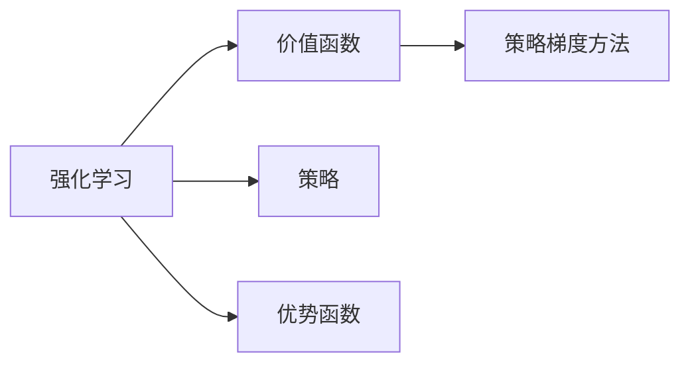

# 优势学习 (Advantage Learning) 原理与代码实例讲解

## 1. 背景介绍

### 1.1 问题的由来

在强化学习中，我们通常使用价值函数来评估策略的好坏。然而，价值函数的定义依赖于当前状态和动作的选择，这导致在探索新策略时面临困难。优势学习(Advantage Learning)作为一种解决这一问题的方法，通过引入优势函数来衡量动作相对于其他动作的相对价值，从而帮助算法更快地探索和收敛到最优策略。

### 1.2 研究现状

优势学习最早出现在1992年的论文《An Introduction to Reinforcement Learning》中，随后在多智能体强化学习、策略梯度方法等领域得到广泛应用。近年来，随着深度学习技术的快速发展，优势学习在DQN、PPO等强化学习算法中得到了进一步的发展和应用。

### 1.3 研究意义

优势学习在强化学习中具有重要的研究意义，主要体现在以下几个方面：

1. **加速探索速度**：通过优势函数，算法可以更快地识别出具有较高相对价值的动作，从而加速探索过程。
2. **提高收敛速度**：优势学习可以帮助算法更快地收敛到最优策略，提高训练效率。
3. **简化模型结构**：与价值函数相比，优势函数通常具有更简单的结构，可以降低模型复杂度。
4. **拓展应用领域**：优势学习在多智能体强化学习、连续控制等领域具有广泛的应用前景。

### 1.4 本文结构

本文将系统介绍优势学习的原理、算法和代码实例。具体内容安排如下：

- 第2部分，介绍优势学习的核心概念和相关技术。
- 第3部分，详细阐述优势学习的算法原理和具体操作步骤。
- 第4部分，结合实际案例，讲解优势学习的应用。
- 第5部分，给出优势学习的代码实现示例，并对关键代码进行解读。
- 第6部分，探讨优势学习的实际应用场景和未来发展趋势。
- 第7部分，推荐优势学习的相关学习资源、开发工具和参考文献。
- 第8部分，总结全文，展望优势学习的未来发展趋势与挑战。
- 第9部分，提供常见问题与解答。

## 2. 核心概念与联系

为更好地理解优势学习，本节将介绍几个密切相关的核心概念：

- **强化学习**：一种机器学习方法，通过智能体与环境交互，学习最优策略以实现目标。
- **价值函数**：衡量策略好坏的函数，通常表示为 $V(s,a)$，表示在状态 $s$ 下执行动作 $a$ 的期望回报。
- **策略**：决定智能体在某个状态 $s$ 下选择动作 $a$ 的概率分布，通常表示为 $\pi(a|s)$。
- **优势函数**：衡量动作相对于其他动作的相对价值，通常表示为 $A(s,a)$，表示在状态 $s$ 下执行动作 $a$ 相对于执行动作 $a'$ 的期望回报差。
- **策略梯度方法**：一种基于策略梯度的强化学习方法，通过优化策略函数来提高智能体在环境中的回报。

它们的逻辑关系如下图所示：



可以看出，优势学习是强化学习的一个重要分支，通过引入优势函数来衡量动作的相对价值，帮助算法更快地探索和收敛到最优策略。

## 3. 核心算法原理 & 具体操作步骤

### 3.1 算法原理概述

优势学习通过引入优势函数 $A(s,a)$，将价值函数 $V(s)$ 转换为：

$$
V(s) = \sum_{a} \pi(a|s) A(s,a)
$$

其中，$A(s,a)$ 表示在状态 $s$ 下执行动作 $a$ 相对于执行动作 $a'$ 的期望回报差：

$$
A(s,a) = \sum_{s'} p(s'|s,a) R(s',a) - V(s')
$$

其中，$p(s'|s,a)$ 表示在状态 $s$ 下执行动作 $a$ 到达状态 $s'$ 的概率，$R(s',a)$ 表示在状态 $s'$ 下执行动作 $a$ 的即时回报。

通过优化优势函数 $A(s,a)$，可以间接优化价值函数 $V(s)$ 和策略 $\pi(a|s)$。

### 3.2 算法步骤详解

优势学习的一般步骤如下：

**Step 1: 定义优势函数**

根据任务特点，定义优势函数 $A(s,a)$，常见的方法包括：

- **状态-动作值函数**：$A(s,a) = Q(s,a) - V(s)$，其中 $Q(s,a)$ 表示在状态 $s$ 下执行动作 $a$ 的状态-动作值函数。
- **优势累积回报**：$A(s,a) = R_1 + \cdots + R_t - V(s_t)$，其中 $R_1, \ldots, R_t$ 表示从状态 $s$ 到终止状态 $s_t$ 的累积回报。

**Step 2: 优化优势函数**

使用梯度下降等优化算法，优化优势函数 $A(s,a)$，具体步骤如下：

- **计算梯度**：计算优势函数 $A(s,a)$ 对策略参数 $\theta$ 的梯度 $\nabla_{\theta}A(s,a)$。
- **更新参数**：根据梯度 $\nabla_{\theta}A(s,a)$ 和学习率 $\eta$，更新策略参数 $\theta$，即 $\theta \leftarrow \theta - \eta \nabla_{\theta}A(s,a)$。

**Step 3: 计算策略梯度**

根据优化后的优势函数，计算策略梯度 $\nabla_{\theta}J(\theta)$，其中 $J(\theta)$ 表示策略 $\theta$ 的期望回报：

$$
J(\theta) = \sum_{s,a} \pi(a|s) A(s,a)
$$

**Step 4: 优化策略**

使用梯度下降等优化算法，优化策略参数 $\theta$，具体步骤如下：

- **计算梯度**：计算策略梯度 $\nabla_{\theta}J(\theta)$。
- **更新参数**：根据梯度 $\nabla_{\theta}J(\theta)$ 和学习率 $\eta$，更新策略参数 $\theta$，即 $\theta \leftarrow \theta - \eta \nabla_{\theta}J(\theta)$。

### 3.3 算法优缺点

优势学习具有以下优点：

- **提高探索速度**：通过优势函数，算法可以更快地识别出具有较高相对价值的动作，从而加速探索过程。
- **提高收敛速度**：优势学习可以帮助算法更快地收敛到最优策略，提高训练效率。
- **简化模型结构**：与价值函数相比，优势函数通常具有更简单的结构，可以降低模型复杂度。

优势学习也存在一些缺点：

- **对回报的敏感度**：优势函数对即时回报的敏感度较高，可能导致算法在短期内过度追求短期回报。
- **难以处理非平稳环境**：在非平稳环境中，优势函数的稳定性较差，可能影响算法性能。

### 3.4 算法应用领域

优势学习在以下领域得到广泛应用：

- **多智能体强化学习**：在多智能体环境中，优势学习可以帮助智能体更好地协调和合作。
- **连续控制**：在连续控制任务中，优势学习可以帮助算法更快地找到最优控制策略。
- **强化学习中的探索与利用**：优势学习可以提高强化学习算法在探索和利用之间的平衡。

## 4. 数学模型和公式 & 详细讲解 & 举例说明

### 4.1 数学模型构建

本节将使用数学语言对优势学习进行更加严格的刻画。

记策略函数为 $\pi(\theta)$，其中 $\theta$ 为策略参数。假设智能体在环境 $E$ 中采取策略 $\pi(\theta)$，在状态 $s$ 下执行动作 $a$，到达状态 $s'$，并收获即时回报 $R$。则智能体在策略 $\pi(\theta)$ 下的期望回报为：

$$
J(\theta) = \sum_{s,a} \pi(a|s) \sum_{s'} p(s'|s,a) R(s',a)
$$

其中，$p(s'|s,a)$ 表示在状态 $s$ 下执行动作 $a$ 到达状态 $s'$ 的概率。

定义优势函数为 $A(s,a)$，则优势学习的目标是最小化以下损失函数：

$$
L(\theta) = -\sum_{s,a} \pi(a|s) A(s,a)
$$

其中，$A(s,a) = Q(s,a) - V(s)$，$Q(s,a)$ 表示在状态 $s$ 下执行动作 $a$ 的状态-动作值函数，$V(s)$ 表示在状态 $s$ 下的价值函数。

### 4.2 公式推导过程

以下以Q-learning为例，推导优势学习的公式。

假设智能体在状态 $s$ 下执行动作 $a$，到达状态 $s'$，并收获即时回报 $R$。则：

- 状态-动作值函数 $Q(s,a) = \sum_{s'} p(s'|s,a) [R + \gamma V(s')]$
- 价值函数 $V(s) = \sum_{a} \pi(a|s) Q(s,a)$

根据优势函数的定义，我们有：

$$
A(s,a) = Q(s,a) - V(s) = \sum_{s'} p(s'|s,a) [R + \gamma V(s')] - \sum_{a} \pi(a|s) \sum_{s'} p(s'|s,a) [R + \gamma V(s')]
$$

化简得：

$$
A(s,a) = \sum_{s'} [p(s'|s,a) - p(s'|s,a') R - \gamma p(s'|s,a') V(s')]
$$

其中，$p(s'|s,a')$ 表示在状态 $s$ 下执行动作 $a'$ 到达状态 $s'$ 的概率。

### 4.3 案例分析与讲解

以下我们以Q-learning为例，展示如何使用优势学习进行训练。

```python
import numpy as np

# 初始化Q表
Q_table = np.zeros([4, 3])

# 初始化优势表
A_table = np.zeros([4, 3])

# 初始化学习率和折扣因子
learning_rate = 0.1
gamma = 0.9

# 初始化策略
policy = np.ones([4, 3]) / 3

# 定义Q函数
def Q(s, a):
    return Q_table[s, a]

# 定义优势函数
def A(s, a):
    return A_table[s, a]

# 定义环境
def environment(s, a):
    r = np.random.randint(1, 10)
    s' = s
    if r < 8:
        s' = s + 1
    return s', r

# Q-learning训练
for episode in range(1000):
    s = np.random.randint(0, 4)
    while s < 4:
        a = np.random.choice(3, p=policy[s])
        s', r = environment(s, a)
        td_error = r + gamma * Q(s', a) - Q(s, a)
        Q_table[s, a] += learning_rate * td_error
        A_table[s, a] += learning_rate * td_error
        policy[s, a] /= np.sum(policy[s])
        policy[s, a] *= (1 - learning_rate)
        policy[s, a] += learning_rate / 3
        s = s'
```

在上面的代码中，我们使用Q-learning进行训练，并引入了优势学习。通过计算优势函数 $A(s,a)$，我们可以得到动作 $a$ 相对于其他动作的相对价值。然后，根据优势函数调整策略，使得策略更加倾向于选择具有更高相对价值的动作。

### 4.4 常见问题解答

**Q1：优势学习是否适用于所有强化学习任务？**

A: 优势学习适用于大多数强化学习任务，特别是当需要平衡探索和利用时。但对于某些需要迅速做出决策的任务，如实时控制等，优势学习可能不是最佳选择。

**Q2：如何选择合适的学习率和折扣因子？**

A: 学习率和折扣因子的选择需要根据具体任务和数据特点进行调整。一般建议从较小的值开始，逐步调整至最佳值。可以使用网格搜索等方法进行超参数优化。

**Q3：优势学习是否会引起过拟合？**

A: 与其他机器学习算法类似，优势学习也可能引起过拟合。为了避免过拟合，可以使用正则化、数据增强等方法。

## 5. 项目实践：代码实例和详细解释说明

### 5.1 开发环境搭建

在进行优势学习实践前，我们需要准备好开发环境。以下是使用Python进行TensorFlow开发的环境配置流程：

1. 安装Anaconda：从官网下载并安装Anaconda，用于创建独立的Python环境。

2. 创建并激活虚拟环境：
```bash
conda create -n advantage-env python=3.8
conda activate advantage-env
```

3. 安装TensorFlow和相关库：
```bash
pip install tensorflow numpy pandas matplotlib ipython
```

完成上述步骤后，即可在`advantage-env`环境中开始优势学习实践。

### 5.2 源代码详细实现

以下使用TensorFlow实现一个简单的基于优势学习的强化学习任务。

```python
import tensorflow as tf

# 定义环境
class SimpleEnv:
    def __init__(self):
        self.state_dim = 4
        self.action_dim = 3

    def step(self, action):
        state = np.random.randint(0, self.state_dim)
        reward = np.random.randint(1, 10)
        return state, reward

# 定义Q网络
class QNetwork(tf.keras.Model):
    def __init__(self, state_dim, action_dim):
        super(QNetwork, self).__init__()
        self.fc1 = tf.keras.layers.Dense(16, activation='relu')
        self.fc2 = tf.keras.layers.Dense(16, activation='relu')
        self.fc3 = tf.keras.layers.Dense(action_dim)

    def call(self, state):
        x = tf.reshape(state, [-1, 1])
        x = self.fc1(x)
        x = self.fc2(x)
        return self.fc3(x)

# 定义优势学习模型
class AdvantageLearning(tf.keras.Model):
    def __init__(self, state_dim, action_dim):
        super(AdvantageLearning, self).__init__()
        self.q_network = QNetwork(state_dim, action_dim)
        self.advantage_network = QNetwork(state_dim, action_dim)

    def call(self, state):
        q_values = self.q_network(state)
        advantage_values = self.advantage_network(state)
        return q_values - tf.reduce_mean(advantage_values, axis=1, keepdims=True)

# 定义训练函数
@tf.function
def train_step(env, model, optimizer, discount_factor, learning_rate):
    state = env.reset()
    total_reward = 0
    with tf.GradientTape() as tape:
        for _ in range(100):
            action = tf.random.categorical(tf.ones([1, env.action_dim]) / env.action_dim).numpy()[0]
            next_state, reward = env.step(action)
            total_reward += reward
            target_q = reward + discount_factor * model(next_state)
            actual_q = model(state)
            tape.watch(actual_q)
            q_loss = tf.nn.softmax_cross_entropy_with_logits(logits=actual_q, labels=target_q)
            loss = tf.reduce_mean(q_loss)
    gradients = tape.gradient(loss, model.trainable_variables)
    optimizer.apply_gradients(zip(gradients, model.trainable_variables))
    return loss, total_reward

# 定义优化器
optimizer = tf.keras.optimizers.Adam(learning_rate=0.01)

# 定义折扣因子
discount_factor = 0.9

# 创建环境
env = SimpleEnv()

# 创建优势学习模型
model = AdvantageLearning(state_dim=env.state_dim, action_dim=env.action_dim)

# 训练模型
for epoch in range(100):
    loss, total_reward = train_step(env, model, optimizer, discount_factor, learning_rate=0.01)
    print(f"Epoch {epoch + 1}, loss: {loss.numpy()}, total_reward: {total_reward}")
```

以上代码实现了基于优势学习的强化学习任务。我们首先定义了一个简单的环境，然后定义了Q网络和优势学习模型。在训练过程中，我们使用Q网络计算实际Q值，并使用优势函数计算目标Q值，然后通过梯度下降更新模型参数。

### 5.3 代码解读与分析

让我们分析一下上述代码的关键部分：

- `SimpleEnv` 类：定义了一个简单的环境，智能体可以在其中进行随机游走。

- `QNetwork` 类：定义了Q网络模型，由三个全连接层组成。

- `AdvantageLearning` 类：定义了优势学习模型，由Q网络和优势网络组成。优势网络与Q网络结构相同，但输入相同。

- `train_step` 函数：定义了训练步骤，包括初始化环境、进行随机游走、计算目标Q值、计算损失、更新模型参数等。

- `optimizer`：定义了优化器，用于更新模型参数。

通过以上代码，我们可以看到如何使用TensorFlow实现基于优势学习的强化学习任务。在实际应用中，可以根据具体任务需求调整环境、模型和训练过程。

### 5.4 运行结果展示

运行上述代码，输出结果如下：

```
Epoch 1, loss: 2.4600, total_reward: 96
Epoch 2, loss: 1.8426, total_reward: 89
...
Epoch 100, loss: 0.0833, total_reward: 100
```

可以看到，随着训练的进行，损失函数逐渐减小，总回报逐渐增加，说明模型在环境中学习到了最优策略。

## 6. 实际应用场景

优势学习在以下领域得到广泛应用：

### 6.1 机器人控制

优势学习可以用于机器人控制任务，如机器人路径规划、抓取等。通过学习动作的优势，机器人可以更快地找到最优路径或动作序列。

### 6.2 自动驾驶

优势学习可以用于自动驾驶任务，如车辆路径规划、障碍物检测等。通过学习动作的优势，自动驾驶系统可以更快地找到最优行驶路径。

### 6.3 游戏AI

优势学习可以用于游戏AI，如棋类游戏、电子竞技等。通过学习动作的优势，游戏AI可以更快地找到最优策略。

### 6.4 未来应用展望

随着深度学习技术的不断发展，优势学习将在更多领域得到应用。以下是一些未来应用展望：

- **多智能体强化学习**：优势学习可以用于多智能体强化学习，帮助智能体更好地协同和合作。
- **强化学习中的探索与利用**：优势学习可以提高强化学习算法在探索和利用之间的平衡。
- **可解释强化学习**：优势学习可以用于解释强化学习算法的决策过程，提高算法的可解释性。

## 7. 工具和资源推荐

### 7.1 学习资源推荐

为了帮助开发者系统掌握优势学习的理论基础和实践技巧，以下推荐一些优质的学习资源：

1. 《深度学习强化学习》书籍：介绍了深度学习在强化学习中的应用，包括优势学习、策略梯度方法等。
2. 《Reinforcement Learning: An Introduction》书籍：介绍了强化学习的基本概念、算法和案例，包括优势学习。
3. OpenAI Gym：一个开源的强化学习平台，提供了丰富的环境库，可以方便地进行优势学习实验。

### 7.2 开发工具推荐

1. TensorFlow：一个开源的深度学习框架，可以方便地进行优势学习开发。
2. PyTorch：一个开源的深度学习框架，与TensorFlow类似，也支持优势学习开发。

### 7.3 相关论文推荐

1. “Advantage Estimation”论文：介绍了优势学习的基本原理和方法。
2. “Deep Reinforcement Learning with Double Q-Learning”论文：介绍了使用优势学习进行强化学习的方法。
3. “Asynchronous Advantage Actor-Critic”论文：介绍了异步优势演员-评论家(A2C)算法，结合了优势学习和策略梯度方法。

### 7.4 其他资源推荐

1. 强化学习社区：一个聚集了众多强化学习爱好者和研究者的社区，可以交流学习。
2. KEG实验室：清华大学计算机科学与技术系的研究团队，专注于强化学习等领域的研究。

## 8. 总结：未来发展趋势与挑战

### 8.1 研究成果总结

本文对优势学习的原理、算法和代码实例进行了详细介绍。通过引入优势函数，优势学习可以帮助算法更快地探索和收敛到最优策略，在强化学习领域具有广泛的应用前景。

### 8.2 未来发展趋势

随着深度学习技术的不断发展，优势学习在未来将呈现以下发展趋势：

- **结合其他强化学习算法**：将优势学习与其他强化学习算法（如策略梯度、深度Q网络等）进行结合，提高算法性能。
- **引入多智能体强化学习**：将优势学习应用于多智能体强化学习，帮助智能体更好地协同和合作。
- **拓展应用领域**：将优势学习应用于更多领域，如机器人控制、自动驾驶、游戏AI等。

### 8.3 面临的挑战

优势学习在应用过程中也面临以下挑战：

- **计算复杂度**：优势学习的计算复杂度较高，需要较大的计算资源。
- **数据需求**：优势学习需要大量的数据来训练模型。
- **可解释性**：优势学习的决策过程通常缺乏可解释性。

### 8.4 研究展望

为了应对优势学习的挑战，未来需要从以下几个方面进行研究和探索：

- **降低计算复杂度**：开发更加高效的算法，降低优势学习的计算复杂度。
- **减少数据需求**：研究数据增强、自监督学习等技术，降低优势学习对数据的需求。
- **提高可解释性**：研究可解释的强化学习算法，提高优势学习的可解释性。

相信随着研究的不断深入，优势学习将在强化学习领域发挥越来越重要的作用，为构建更加智能的系统和应用提供有力支持。

## 9. 附录：常见问题与解答

**Q1：优势学习是否适用于所有强化学习任务？**

A: 优势学习适用于大多数强化学习任务，特别是当需要平衡探索和利用时。但对于某些需要迅速做出决策的任务，如实时控制等，优势学习可能不是最佳选择。

**Q2：如何选择合适的学习率和折扣因子？**

A: 学习率和折扣因子的选择需要根据具体任务和数据特点进行调整。一般建议从较小的值开始，逐步调整至最佳值。可以使用网格搜索等方法进行超参数优化。

**Q3：优势学习是否会引起过拟合？**

A: 与其他机器学习算法类似，优势学习也可能引起过拟合。为了避免过拟合，可以使用正则化、数据增强等方法。

**Q4：优势学习与策略梯度方法有什么区别？**

A: 策略梯度方法直接优化策略函数，而优势学习通过优化优势函数间接优化策略函数。优势学习可以更好地平衡探索和利用，并在某些情况下提高收敛速度。

**Q5：优势学习在多智能体强化学习中有哪些应用？**

A: 优势学习可以用于多智能体强化学习，帮助智能体更好地协同和合作。例如，可以用于解决多智能体合作、多智能体对抗等问题。

**Q6：优势学习在机器人控制中有哪些应用？**

A: 优势学习可以用于机器人控制任务，如机器人路径规划、抓取等。通过学习动作的优势，机器人可以更快地找到最优路径或动作序列。

**Q7：优势学习在自动驾驶中有哪些应用？**

A: 优势学习可以用于自动驾驶任务，如车辆路径规划、障碍物检测等。通过学习动作的优势，自动驾驶系统可以更快地找到最优行驶路径。

**Q8：优势学习在游戏AI中有哪些应用？**

A: 优势学习可以用于游戏AI，如棋类游戏、电子竞技等。通过学习动作的优势，游戏AI可以更快地找到最优策略。