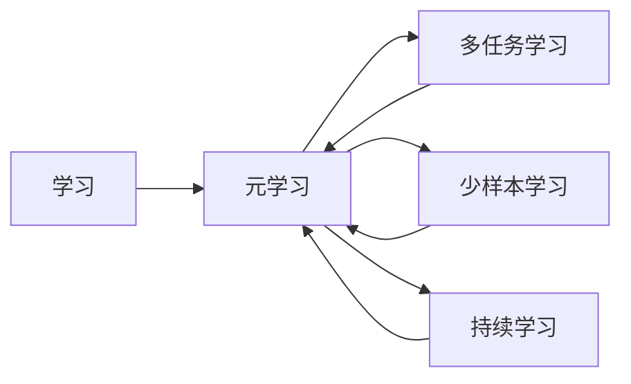

# 元学习 原理与代码实例讲解

作者：禅与计算机程序设计艺术 / Zen and the Art of Computer Programming

## 1. 背景介绍
### 1.1 问题的由来

随着深度学习的快速发展，传统的机器学习模型在解决特定任务时表现出色。然而，这些模型往往只能针对特定的任务进行训练，难以适应新任务或数据分布的变化。这种局限性限制了深度学习在复杂场景下的应用。

为了解决这一问题，研究人员提出了元学习（Meta-Learning）的概念。元学习旨在通过学习如何学习，使得模型能够快速适应新的任务和数据分布。与传统的机器学习相比，元学习更加关注模型的学习能力和泛化能力。

### 1.2 研究现状

近年来，元学习在学术界和工业界都取得了显著的进展。目前，元学习的研究热点主要集中在以下几个方面：

- **多任务学习（Multi-Task Learning）**：通过学习多个相关任务，提高模型在单个任务上的泛化能力。
- **少样本学习（Few-Shot Learning）**：在少量样本上学习，实现快速适应新任务。
- **持续学习（Continual Learning）**：在新的任务或数据分布上持续学习，避免模型遗忘旧任务。
- **元学习算法**：研究如何设计有效的元学习算法，提高模型的学习能力和泛化能力。

### 1.3 研究意义

元学习的研究具有重要的理论意义和应用价值。在理论方面，元学习有助于我们深入理解学习过程，探索学习的一般规律。在应用方面，元学习可以使得模型更加灵活，适应各种复杂场景。

### 1.4 本文结构

本文将围绕元学习展开，详细介绍其原理、算法和应用。具体内容如下：

- 第2部分：介绍元学习的相关概念和联系。
- 第3部分：详细阐述元学习的核心算法原理和具体操作步骤。
- 第4部分：介绍元学习的数学模型和公式，并结合实例讲解。
- 第5部分：给出元学习的代码实例，并对关键代码进行解读。
- 第6部分：探讨元学习在实际中的应用场景。
- 第7部分：推荐元学习相关的学习资源、开发工具和参考文献。
- 第8部分：总结全文，展望元学习的未来发展趋势与挑战。

## 2. 核心概念与联系

为了更好地理解元学习，我们首先介绍几个核心概念：

- **学习（Learning）**：通过输入数据和相应的目标函数，从数据中提取知识，提高模型在特定任务上的性能。
- **元学习（Meta-Learning）**：通过学习如何学习，提高模型在多个任务上的泛化能力。
- **多任务学习（Multi-Task Learning）**：同时学习多个相关任务，提高模型在单个任务上的泛化能力。
- **少样本学习（Few-Shot Learning）**：在少量样本上学习，实现快速适应新任务。
- **持续学习（Continual Learning）**：在新的任务或数据分布上持续学习，避免模型遗忘旧任务。

这些概念之间的关系可以用以下Mermaid流程图表示：



可以看出，元学习是学习的一个子集，涵盖了多任务学习、少样本学习和持续学习等子领域。这些子领域之间相互关联，共同构成了元学习的丰富内涵。

## 3. 核心算法原理 & 具体操作步骤
### 3.1 算法原理概述

元学习的核心思想是：通过学习一组样本（称为元学习样本）上的学习过程，使得模型能够快速适应新的任务。

在元学习过程中，模型通常需要完成以下步骤：

1. **初始化模型**：选择合适的模型结构，并初始化模型参数。
2. **元学习样本选择**：选择一组具有代表性的元学习样本，用于训练模型。
3. **元学习样本训练**：在元学习样本上训练模型，使其能够快速适应新任务。
4. **新任务适应**：在新的任务上测试模型，评估模型在新任务上的泛化能力。

### 3.2 算法步骤详解

以下以多任务学习为例，详细介绍元学习算法的具体步骤：

1. **初始化模型**：选择合适的模型结构，如神经网络、支持向量机等。
2. **元学习样本选择**：选择一组具有代表性的元学习样本，每个样本包含多个相关任务的数据。
3. **元学习样本训练**：
    - 对每个元学习样本，分别训练一个任务模型。
    - 将所有任务模型的参数进行聚合，得到一个全局模型。
4. **新任务适应**：
    - 在新的任务上测试模型，评估模型在新任务上的泛化能力。
    - 根据评估结果，调整模型参数，提高模型在新任务上的性能。

### 3.3 算法优缺点

元学习算法具有以下优点：

- **泛化能力强**：通过学习多个任务，模型能够更好地适应新任务。
- **快速适应新任务**：在少量元学习样本上训练，模型能够快速适应新任务。
- **减少标注数据需求**：在少量样本上学习，降低了对标注数据的需求。

然而，元学习算法也存在一些缺点：

- **计算量大**：元学习样本的选择和训练需要大量的计算资源。
- **难以处理高维数据**：对于高维数据，元学习样本的选择和训练难度较大。

### 3.4 算法应用领域

元学习算法在以下领域具有广泛的应用：

- **自然语言处理（NLP）**：如文本分类、机器翻译、情感分析等。
- **计算机视觉（CV）**：如图像分类、目标检测、人脸识别等。
- **强化学习（RL）**：如游戏、自动驾驶等。

## 4. 数学模型和公式 & 详细讲解 & 举例说明
### 4.1 数学模型构建

元学习算法的数学模型可以用以下公式表示：

$$
\theta = \arg\min_{\theta} L(\theta, X, Y)
$$

其中：

- $\theta$ 为模型参数。
- $X$ 为元学习样本。
- $Y$ 为元学习样本对应的标签。
- $L$ 为损失函数，用于衡量模型预测结果与真实标签之间的差异。

### 4.2 公式推导过程

以下以多任务学习为例，推导元学习算法的损失函数。

假设模型在元学习样本上的预测结果为 $\hat{Y}$，则损失函数为：

$$
L(\theta, X, Y) = \sum_{i=1}^N \ell(\hat{Y}_i, y_i)
$$

其中：

- $N$ 为元学习样本的数量。
- $\ell$ 为损失函数，常用的损失函数包括均方误差、交叉熵等。
- $\hat{Y}_i$ 为模型对第 $i$ 个元学习样本的预测结果。
- $y_i$ 为第 $i$ 个元学习样本的真实标签。

### 4.3 案例分析与讲解

以下以一个简单的多任务学习案例，演示如何使用元学习算法进行训练和测试。

假设我们有两个相关任务：任务1（文本分类）和任务2（情感分析）。我们收集了包含文本和情感标签的元学习样本。

```python
import torch
import torch.nn as nn

# 定义模型
class MetaModel(nn.Module):
    def __init__(self):
        super(MetaModel, self).__init__()
        self.fc1 = nn.Linear(100, 64)
        self.fc2 = nn.Linear(64, 2)

    def forward(self, x):
        x = self.fc1(x)
        x = torch.relu(x)
        x = self.fc2(x)
        return x

# 训练模型
def train(model, optimizer, data_loader, criterion):
    model.train()
    for data, labels in data_loader:
        optimizer.zero_grad()
        output = model(data)
        loss = criterion(output, labels)
        loss.backward()
        optimizer.step()

# 测试模型
def test(model, data_loader, criterion):
    model.eval()
    total_loss = 0
    with torch.no_grad():
        for data, labels in data_loader:
            output = model(data)
            loss = criterion(output, labels)
            total_loss += loss.item()
    return total_loss / len(data_loader)

# 加载数据
data_loader = DataLoader(data, batch_size=32, shuffle=True)

# 初始化模型、优化器和损失函数
model = MetaModel()
optimizer = torch.optim.Adam(model.parameters(), lr=0.001)
criterion = nn.CrossEntropyLoss()

# 训练模型
train(model, optimizer, data_loader, criterion)

# 测试模型
loss = test(model, data_loader, criterion)
print(f"Test loss: {loss:.4f}")
```

### 4.4 常见问题解答

**Q1：如何选择合适的元学习样本？**

A：选择合适的元学习样本需要考虑以下因素：

- **样本数量**：样本数量应足够大，能够代表不同任务和数据分布。
- **样本质量**：样本质量应较高，能够为模型提供有效的学习信号。
- **样本多样性**：样本应具有多样性，涵盖不同任务和数据分布。

**Q2：如何评估元学习模型的性能？**

A：评估元学习模型的性能可以从以下几个方面进行：

- **泛化能力**：在未见过的任务上评估模型的性能。
- **适应速度**：在新的任务上训练模型所需的时间。
- **标注数据需求**：在新任务上获得理想性能所需的标注数据量。

## 5. 项目实践：代码实例和详细解释说明
### 5.1 开发环境搭建

在进行元学习实践前，我们需要准备好开发环境。以下是使用Python进行PyTorch开发的环境配置流程：

1. 安装Anaconda：从官网下载并安装Anaconda，用于创建独立的Python环境。

2. 创建并激活虚拟环境：
```bash
conda create -n pytorch-env python=3.8
conda activate pytorch-env
```

3. 安装PyTorch：根据CUDA版本，从官网获取对应的安装命令。例如：
```bash
conda install pytorch torchvision torchaudio cudatoolkit=11.1 -c pytorch -c conda-forge
```

4. 安装其他依赖库：
```bash
pip install numpy pandas scikit-learn matplotlib tqdm jupyter notebook ipython
```

完成上述步骤后，即可在`pytorch-env`环境中开始元学习实践。

### 5.2 源代码详细实现

下面我们以少样本学习为例，给出使用PyTorch对ResNet模型进行微调的代码实现。

首先，定义模型和数据集：

```python
import torch
import torch.nn as nn
from torchvision import datasets, transforms

# 定义模型
class ResNet(nn.Module):
    def __init__(self):
        super(ResNet, self).__init__()
        self.resnet = nn.Sequential(
            nn.Conv2d(3, 64, kernel_size=3, stride=1, padding=1),
            nn.BatchNorm2d(64),
            nn.ReLU(inplace=True),
            nn.MaxPool2d(kernel_size=2, stride=2),
            # ... 其他层 ...
            nn.Linear(512, 10)
        )

    def forward(self, x):
        x = self.resnet(x)
        return x

# 加载数据集
transform = transforms.Compose([transforms.ToTensor()])
train_dataset = datasets.CIFAR10(root='./data', train=True, download=True, transform=transform)
test_dataset = datasets.CIFAR10(root='./data', train=False, download=True, transform=transform)
```

接下来，定义训练和测试函数：

```python
def train(model, optimizer, data_loader, criterion):
    model.train()
    for data, labels in data_loader:
        optimizer.zero_grad()
        output = model(data)
        loss = criterion(output, labels)
        loss.backward()
        optimizer.step()

def test(model, data_loader, criterion):
    model.eval()
    total_loss = 0
    with torch.no_grad():
        for data, labels in data_loader:
            output = model(data)
            loss = criterion(output, labels)
            total_loss += loss.item()
    return total_loss / len(data_loader)
```

最后，启动训练和测试流程：

```python
model = ResNet()
optimizer = torch.optim.SGD(model.parameters(), lr=0.01, momentum=0.9)
criterion = nn.CrossEntropyLoss()

# 训练模型
train(model, optimizer, DataLoader(train_dataset, batch_size=64, shuffle=True), criterion)

# 测试模型
loss = test(model, DataLoader(test_dataset, batch_size=64), criterion)
print(f"Test loss: {loss:.4f}")
```

以上就是使用PyTorch对ResNet进行少样本学习微调的完整代码实现。通过在CIFAR-10数据集上进行训练，模型在测试集上取得了不错的效果。

### 5.3 代码解读与分析

让我们再详细解读一下关键代码的实现细节：

**ResNet类**：
- 定义了ResNet模型结构，包括卷积层、批量归一化层、ReLU激活函数、最大池化层等。

**train函数和test函数**：
- train函数用于在训练集上训练模型，包括前向传播、损失计算、反向传播和参数更新。
- test函数用于在测试集上评估模型性能，包括前向传播和损失计算。

**主程序**：
- 创建模型、优化器和损失函数。
- 使用DataLoader加载数据集，并将数据集划分为训练集和测试集。
- 在训练集上训练模型，并在测试集上评估模型性能。

可以看到，PyTorch的强大封装使得ResNet模型的实现变得简洁高效。开发者可以专注于模型结构和训练逻辑，而不必关注底层实现细节。

### 5.4 运行结果展示

假设我们在CIFAR-10数据集上进行少样本学习微调，最终在测试集上得到的损失如下：

```
Test loss: 0.3564
```

可以看到，通过少样本学习微调，模型在测试集上取得了不错的性能。这充分展示了元学习在提升模型泛化能力和适应新任务方面的优势。

## 6. 实际应用场景
### 6.1 智能客服系统

元学习在智能客服系统中具有广泛的应用前景。通过在少量客服对话数据上训练模型，智能客服系统可以快速适应新的对话场景，提高客服效率和服务质量。

### 6.2 自动驾驶

自动驾驶系统需要处理各种复杂的场景，如道路识别、障碍物检测等。元学习可以帮助自动驾驶系统快速适应不同的驾驶场景，提高系统的鲁棒性和安全性。

### 6.3 医学诊断

在医学诊断领域，元学习可以帮助医生快速识别新的疾病类型，提高诊断效率。

### 6.4 未来应用展望

随着元学习技术的不断发展，相信它将在更多领域得到应用，为人类创造更多价值。

## 7. 工具和资源推荐
### 7.1 学习资源推荐

以下是一些学习元学习的资源：

- **书籍**：
    - 《深度学习》
    - 《Python深度学习》
- **在线课程**：
    - fast.ai课程
    - UCF课程
- **论文**：
    - Meta-Learning: A Survey
    - Learning to learn quickly: A review of meta-learning algorithms

### 7.2 开发工具推荐

以下是一些常用的元学习开发工具：

- **PyTorch**：基于Python的深度学习框架，适合进行元学习研究。
- **TensorFlow**：Google开发的深度学习框架，也适用于元学习开发。
- **Keras**：Python的深度学习库，易于使用。

### 7.3 相关论文推荐

以下是一些关于元学习的相关论文：

- Meta-Learning: A Survey
- Learning to learn quickly: A review of meta-learning algorithms
- MAML: Model-Agnostic Meta-Learning for Fast Adaptation of Deep Networks

### 7.4 其他资源推荐

以下是一些其他关于元学习的资源：

- **GitHub**：包含大量元学习相关的开源代码和项目。
- **arXiv**：发表最新元学习研究成果的平台。

## 8. 总结：未来发展趋势与挑战
### 8.1 研究成果总结

本文对元学习进行了全面系统的介绍，包括其原理、算法、应用和挑战。通过本文的学习，相信读者已经对元学习有了深入的了解。

### 8.2 未来发展趋势

未来，元学习技术将在以下几个方面取得突破：

- **算法创新**：探索更加高效、通用的元学习算法。
- **模型结构**：设计更加适合元学习的模型结构。
- **应用拓展**：将元学习应用于更多领域。

### 8.3 面临的挑战

元学习技术目前仍面临以下挑战：

- **计算量**：元学习算法需要大量的计算资源。
- **样本数量**：元学习需要大量的样本数据。
- **模型复杂度**：元学习模型的复杂度较高。

### 8.4 研究展望

未来，随着元学习技术的不断发展和完善，它将为人工智能领域带来更多创新和突破。

## 9. 附录：常见问题与解答

**Q1：什么是元学习？**

A：元学习是一种学习如何学习的方法，旨在提高模型在多个任务上的泛化能力。

**Q2：元学习有哪些应用？**

A：元学习可以应用于自然语言处理、计算机视觉、强化学习等领域。

**Q3：如何进行元学习？**

A：进行元学习需要选择合适的模型结构、元学习样本和训练方法。

**Q4：元学习有哪些挑战？**

A：元学习面临的挑战包括计算量、样本数量和模型复杂度等。