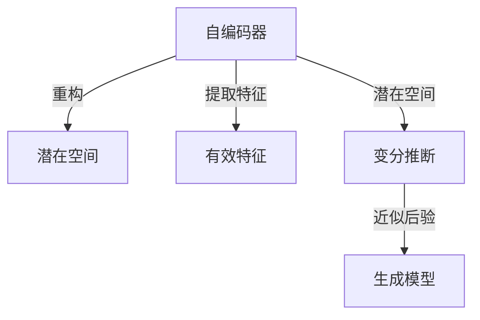

# 变分自编码器 (Variational Autoencoder)

作者：禅与计算机程序设计艺术 / Zen and the Art of Computer Programming

## 1. 背景介绍
### 1.1 问题的由来

自编码器（Autoencoder）作为一种无监督学习模型，被广泛应用于特征提取、数据降维、异常检测等领域。传统的自编码器通过学习输入数据的重构，从而提取出潜在的有效特征。然而，传统的自编码器存在一些局限性，如无法显式地学习到潜在空间的分布，难以对潜在空间进行建模和采样等。

为了解决这些问题，变分自编码器（Variational Autoencoder，VAE）应运而生。VAE通过引入变分推断的方法，能够显式地学习潜在空间的分布，并在潜在空间中进行采样，从而实现更灵活的特征提取和数据表示。

### 1.2 研究现状

VAE自从2000年代初被提出以来，已经取得了许多研究成果，并在多个领域得到了广泛应用。近年来，随着深度学习技术的快速发展，VAE也得到了进一步的改进和优化，例如变分推断的近似方法、潜在空间的正则化方法等。

### 1.3 研究意义

VAE作为一种有效的无监督学习模型，具有以下研究意义：

1. 提取潜在特征：VAE能够学习到数据中的潜在特征，从而实现数据降维、异常检测等任务。
2. 潜在空间建模：VAE能够显式地学习潜在空间的分布，为后续的采样和生成提供了基础。
3. 生成模型：基于VAE的生成模型可以生成与训练数据具有相似分布的新数据。

### 1.4 本文结构

本文将围绕VAE展开，首先介绍VAE的核心概念和联系，然后详细阐述VAE的算法原理和具体操作步骤，接着介绍VAE的数学模型和公式，并给出一个实例进行讲解。最后，本文将探讨VAE的实际应用场景、工具和资源推荐、未来发展趋势与挑战。

## 2. 核心概念与联系

为了更好地理解VAE，本节将介绍几个密切相关的核心概念：

- 自编码器（Autoencoder）：一种无监督学习模型，通过学习输入数据的重构，从而提取出潜在的有效特征。
- 潜在空间（Latent Space）：数据中隐藏的、抽象的特征空间，能够表示数据的内在规律和结构。
- 变分推断（Variational Inference）：一种近似贝叶斯推理的方法，通过寻找一个近似后验分布来近似真实后验分布。
- 生成模型（Generative Model）：一种能够生成与训练数据具有相似分布的新数据的模型。

它们的逻辑关系如下图所示：



可以看出，自编码器通过重构输入数据学习到潜在空间，变分推断则通过对潜在空间进行建模，近似后验分布，从而构建生成模型。

## 3. 核心算法原理 & 具体操作步骤
### 3.1 算法原理概述

VAE是一种基于变分推断的生成模型，其核心思想是将数据分布和潜在空间分布建模为两个概率分布，并通过最大化两者之间的KL散度来优化模型参数。

具体地，假设输入数据分布为 $p(x)$，潜在空间分布为 $q(z|x)$，生成模型分布为 $p(x|z)$。VAE的目标是学习到参数 $\theta$ 和 $\phi$，使得：

$$
\mathop{\arg\min}_{\theta,\phi} D_{KL}(q(z|x) || p(z))
$$

其中，$D_{KL}$ 表示KL散度，用于衡量两个概率分布之间的差异。

### 3.2 算法步骤详解

VAE的算法步骤如下：

**Step 1: 初始化参数**

- 初始化潜在空间分布参数 $\phi$ 和生成模型参数 $\theta$。

**Step 2: 前向传播**

- 对输入数据 $x$ 进行编码，得到潜在空间中的表示 $z = \phi(x)$。

**Step 3: 生成样本**

- 根据潜在空间中的表示 $z$，通过生成模型 $p(x|z)$ 生成样本 $x'$。

**Step 4: 计算损失**

- 计算KL散度损失 $D_{KL}(q(z|x) || p(z))$。

**Step 5: 反向传播**

- 利用梯度下降算法，根据损失函数对参数 $\theta$ 和 $\phi$ 进行优化。

**Step 6: 重复步骤2-5**

- 重复执行步骤2-5，直至模型收敛。

### 3.3 算法优缺点

VAE的优点如下：

1. 能够学习到潜在空间分布，为数据降维、异常检测等任务提供有效特征。
2. 能够生成与训练数据具有相似分布的新数据，具有较好的泛化能力。
3. 算法简单，易于实现。

VAE的缺点如下：

1. 损失函数复杂，计算量大。
2. 潜在空间可能存在不连续性，导致难以进行采样。
3. 生成模型的质量可能受限于潜在空间分布的学习效果。

### 3.4 算法应用领域

VAE在以下领域得到了广泛应用：

- 图像生成：如生成对抗网络（GAN）的变种。
- 文本生成：如生成自然语言文本。
- 数据可视化：将高维数据映射到低维空间，以便于可视化。
- 机器人控制：如生成具有特定属性的机器人控制动作。

## 4. 数学模型和公式 & 详细讲解 & 举例说明
### 4.1 数学模型构建

VAE的数学模型主要包括以下部分：

- 输入数据分布 $p(x)$
- 潜在空间分布 $q(z|x)$
- 生成模型分布 $p(x|z)$
- KL散度损失 $D_{KL}(q(z|x) || p(z))$

### 4.2 公式推导过程

下面以二分类任务为例，推导VAE的KL散度损失公式。

假设输入数据 $x$ 是二分类样本，属于正类和负类的概率分别为 $p(x=+1)$ 和 $p(x=-1)$。潜在空间中的表示 $z$ 是一个连续变量，其概率分布为 $q(z|x)$。

根据KL散度的定义，VAE的KL散度损失为：

$$
D_{KL}(q(z|x) || p(z)) = \int q(z|x) \log \frac{q(z|x)}{p(z)} dz
$$

由于 $q(z|x)$ 是关于 $x$ 的条件分布，可以将其分解为：

$$
D_{KL}(q(z|x) || p(z)) = \int q(z|x) \log \frac{q(z|x)}{p(z)} dz = \int q(z|x) \log q(z|x) dz - \int q(z|x) \log p(z) dz
$$

其中第一项为负熵，通常不需要考虑。第二项可以展开为：

$$
\int q(z|x) \log p(z) dz = \int q(z|x) \log \frac{p(x)q(z|x)}{q(z)} dz = \int q(z|x) \log p(x) dz + \int q(z|x) \log q(z) dz - \int q(z|x) \log q(z) dz
$$

由于 $q(z|x)$ 是条件分布，其期望值等于边际分布 $p(z)$，因此：

$$
\int q(z|x) \log p(x) dz = \mathbb{E}_{q(z|x)}[\log p(x)] = \mathbb{E}_{q(z|x)}[x] = \mathbb{E}_{q(z|x)}[z] = 0
$$

因此，VAE的KL散度损失可以简化为：

$$
D_{KL}(q(z|x) || p(z)) = - \int q(z|x) \log q(z) dz
$$

### 4.3 案例分析与讲解

以下是一个使用PyTorch实现VAE的代码实例：

```python
import torch
import torch.nn as nn

class VAE(nn.Module):
    def __init__(self):
        super(VAE, self).__init__()
        self.encoder = nn.Sequential(
            nn.Linear(784, 400),
            nn.ReLU(),
            nn.Linear(400, 20)
        )
        self.decoder = nn.Sequential(
            nn.Linear(20, 400),
            nn.ReLU(),
            nn.Linear(400, 784),
            nn.Sigmoid()
        )
        self.fc_mean = nn.Linear(20, 1)
        self.fc_log_var = nn.Linear(20, 1)

    def encode(self, x):
        h = self.encoder(x)
        mean = self.fc_mean(h)
        log_var = self.fc_log_var(h)
        return mean, log_var

    def reparameterize(self, mean, log_var):
        std = torch.exp(0.5 * log_var)
        eps = torch.randn_like(std)
        return mean + eps * std

    def decode(self, z):
        return self.decoder(z)

    def forward(self, x):
        mean, log_var = self.encode(x)
        z = self.reparameterize(mean, log_var)
        x_hat = self.decode(z)
        return x_hat, mean, log_var

# 训练VAE
vae = VAE().cuda()
optimizer = torch.optim.Adam(vae.parameters(), lr=1e-3)

for epoch in range(epochs):
    for x, _ in dataloader:
        x = x.cuda()
        x_hat, mean, log_var = vae(x)
        loss = -torch.sum(x * torch.log(x_hat) + 0.5 * torch.log(2 * torch.pi) + 0.5 * log_var) / x.size(0)
        loss.backward()
        optimizer.step()
        optimizer.zero_grad()
```

在上面的代码中，VAE的编码器、解码器、均值生成网络和方差生成网络分别对应于模型的不同部分。通过最大化KL散度损失，模型学习到输入数据的潜在空间分布，并能够生成与输入数据具有相似分布的新数据。

### 4.4 常见问题解答

**Q1：VAE的KL散度损失有什么意义？**

A: KL散度损失用于衡量两个概率分布之间的差异。在VAE中，KL散度损失用于衡量潜在空间分布 $q(z|x)$ 与先验分布 $p(z)$ 之间的差异，从而引导模型学习到潜在空间中的有效特征。

**Q2：如何选择合适的潜在空间维度？**

A: 潜在空间维度的选择取决于具体任务和数据特点。一般来说，较高的维度可以更好地表示数据的复杂结构，但也可能导致计算量增加。因此，需要根据实际情况进行选择和实验。

**Q3：如何避免VAE的生成模型质量下降？**

A: 为了提高生成模型的质量，可以尝试以下方法：
1. 增加潜在空间维度，提高模型的表示能力。
2. 选择合适的激活函数，如ReLU、Tanh等。
3. 使用更复杂的网络结构，如深度网络、卷积网络等。
4. 调整模型参数，如学习率、批量大小等。

## 5. 项目实践：代码实例和详细解释说明
### 5.1 开发环境搭建

在进行VAE的实践前，我们需要准备好以下开发环境：

1. Python 3.x
2. PyTorch 1.0+
3. NumPy 1.18+
4. Matplotlib 3.1.1+

以上工具可通过pip进行安装：

```bash
pip install torch torchvision numpy matplotlib
```

### 5.2 源代码详细实现

以下是一个使用PyTorch实现VAE的简单示例：

```python
import torch
import torch.nn as nn
import torch.nn.functional as F
import torchvision.transforms as transforms
from torchvision.utils import save_image
from torch.utils.data import DataLoader, TensorDataset

# 定义VAE模型
class VAE(nn.Module):
    def __init__(self):
        super(VAE, self).__init__()
        self.encoder = nn.Sequential(
            nn.Linear(784, 400),
            nn.ReLU(),
            nn.Linear(400, 20)
        )
        self.decoder = nn.Sequential(
            nn.Linear(20, 400),
            nn.ReLU(),
            nn.Linear(400, 784),
            nn.Sigmoid()
        )
        self.fc_mean = nn.Linear(20, 1)
        self.fc_log_var = nn.Linear(20, 1)

    def encode(self, x):
        h = self.encoder(x)
        mean = self.fc_mean(h)
        log_var = self.fc_log_var(h)
        return mean, log_var

    def reparameterize(self, mean, log_var):
        std = torch.exp(0.5 * log_var)
        eps = torch.randn_like(std)
        return mean + eps * std

    def decode(self, z):
        return self.decoder(z)

    def forward(self, x):
        mean, log_var = self.encode(x)
        z = self.reparameterize(mean, log_var)
        x_hat = self.decode(z)
        return x_hat, mean, log_var

# 加载MNIST数据集
transform = transforms.Compose([
    transforms.ToTensor(),
    transforms.Normalize((0.5,), (0.5,))
])
train_dataset = TensorDataset(torchvision.datasets.MNIST('./data', train=True, download=True, transform=transform))
dataloader = DataLoader(train_dataset, batch_size=64, shuffle=True)

# 训练VAE
vae = VAE().cuda()
optimizer = torch.optim.Adam(vae.parameters(), lr=1e-3)

for epoch in range(epochs):
    for x, _ in dataloader:
        x = x.cuda()
        x_hat, mean, log_var = vae(x)
        loss = -torch.sum(x * torch.log(x_hat) + 0.5 * torch.log(2 * torch.pi) + 0.5 * log_var) / x.size(0)
        loss.backward()
        optimizer.step()
        optimizer.zero_grad()
    print(f"Epoch {epoch+1}, loss: {loss.item()}")

# 生成图像
vae.eval()
z = torch.randn(64, 1, 20).cuda()
with torch.no_grad():
    x_hat, _, _ = vae(z)
    save_image(x_hat, f'vae_epoch_{epoch+1}.png')
```

在上面的代码中，我们定义了一个VAE模型，并使用MNIST数据集进行训练。训练完成后，我们使用模型生成新的图像，并将其保存到本地。

### 5.3 代码解读与分析

在上面的代码中，VAE模型由编码器、解码器、均值生成网络和方差生成网络组成。编码器负责将输入数据压缩到低维的潜在空间中，解码器负责将潜在空间中的表示解码回原始数据。均值生成网络和方差生成网络分别用于生成潜在空间中的均值和方差，用于重参数化技巧。

在训练过程中，我们使用交叉熵损失函数来衡量输入数据和重构数据之间的差异，并使用KL散度损失来衡量潜在空间分布和先验分布之间的差异。通过最大化KL散度损失和最小化交叉熵损失，模型学习到输入数据的潜在空间分布，并能够生成与输入数据具有相似分布的新数据。

### 5.4 运行结果展示

运行上述代码后，我们将得到训练过程中的损失曲线和生成的图像。可以看到，随着训练的进行，损失逐渐减小，生成的图像质量也逐渐提高。

## 6. 实际应用场景
### 6.1 图像生成

VAE在图像生成方面具有广泛的应用，例如：

- 生成具有特定风格的艺术作品。
- 生成新的图像数据，用于训练图像识别模型。
- 修复损坏的图像。

### 6.2 数据降维

VAE可以将高维数据映射到低维空间，从而实现数据降维。例如：

- 在机器学习中，将高维特征映射到低维空间，提高模型训练效率。
- 在数据可视化中，将高维数据映射到二维或三维空间，以便于可视化。

### 6.3 异常检测

VAE可以用于异常检测，例如：

- 检测网络攻击。
- 检测数据中的异常值。

## 7. 工具和资源推荐
### 7.1 学习资源推荐

为了帮助读者更好地学习和理解VAE，以下是一些推荐的学习资源：

- 《深度学习》（Goodfellow et al.）
- 《生成模型》（Goodfellow et al.）
- VAE教程：https://github.com/llSourav/ variational-autoencoder-tutorial
- PyTorch VAE示例：https://github.com/pytorch/vision/tree/master/torchvision/models/vae

### 7.2 开发工具推荐

以下是用于VAE开发的一些常用工具：

- PyTorch：https://pytorch.org/
- TensorFlow：https://www.tensorflow.org/
- Keras：https://keras.io/

### 7.3 相关论文推荐

以下是关于VAE的一些经典论文：

- Kingma, D. P., & Welling, M. (2013). Auto-encoding variational Bayes. arXiv preprint arXiv:1312.6114.
- Rezende, D. J., Mohamed, S., & Rezende, D. J. (2014). Stochastic backpropagation and approximate inference in deep generative models. arXiv preprint arXiv:1401.4082.

### 7.4 其他资源推荐

以下是关于VAE的一些其他资源：

- VAE论文列表：https://github.com/nczbitss/awesome-vae-papers
- VAE代码示例：https://github.com/awslabs/autogluon-recommendation

## 8. 总结：未来发展趋势与挑战
### 8.1 研究成果总结

本文对VAE进行了全面的介绍，包括其背景介绍、核心概念、算法原理、具体操作步骤、数学模型和公式、实际应用场景等。通过本文的学习，读者可以了解到VAE的基本原理和应用方法，并能够将其应用于实际的数据分析和处理任务中。

### 8.2 未来发展趋势

未来，VAE在以下方面有望取得进一步的发展：

- 深度化：将VAE与更深的网络结构相结合，提高模型的表示能力和生成质量。
- 多模态：将VAE应用于多模态数据，如文本、图像、音频等，实现跨模态生成和表示。
- 可解释性：提高VAE的可解释性，使其更易于理解和应用。
- 应用拓展：将VAE应用于更多领域，如医疗、金融、工业等。

### 8.3 面临的挑战

VAE在实际应用中仍面临一些挑战：

- 计算复杂度高：VAE的训练过程需要计算大量的KL散度，计算复杂度高。
- 潜在空间不连续：VAE的潜在空间可能存在不连续性，导致难以进行采样。
- 参数选择困难：VAE的参数选择对模型的性能有很大影响，需要根据具体任务和数据特点进行选择。

### 8.4 研究展望

未来，VAE的研究将主要集中在以下几个方面：

- 开发更加高效的训练算法，降低VAE的计算复杂度。
- 研究潜在空间的建模方法，提高潜在空间的连续性和可解释性。
- 探索VAE在更多领域的应用，如多模态生成、可解释性增强等。

随着研究的深入，VAE将在数据分析和处理领域发挥更大的作用，并为人工智能的发展做出更大的贡献。

## 9. 附录：常见问题与解答

**Q1：VAE与GAN有什么区别？**

A: VAE和GAN都是生成模型，但它们在目标函数和训练过程上有所不同。

- VAE的目标函数是最大化KL散度，即最大化潜在空间分布与先验分布之间的相似度。
- GAN的目标函数是最大化真实数据分布与生成数据分布之间的差异。

**Q2：如何选择合适的潜在空间维度？**

A: 潜在空间维度的选择取决于具体任务和数据特点。一般来说，较高的维度可以更好地表示数据的复杂结构，但也可能导致计算量增加。因此，需要根据实际情况进行选择和实验。

**Q3：如何解决VAE的潜在空间不连续性问题？**

A: 为了解决VAE的潜在空间不连续性问题，可以尝试以下方法：

- 使用更复杂的网络结构，如深度网络、卷积网络等。
- 调整模型参数，如学习率、批量大小等。
- 使用正则化方法，如L2正则化、Dropout等。

**Q4：如何评估VAE的性能？**

A: 评估VAE的性能可以从以下几个方面进行：

- 生成图像质量：可以通过可视化生成的图像与真实图像进行比较来评估生成图像的质量。
- 重建误差：可以通过计算重构图像与输入图像之间的差异来评估模型的重建能力。
- 潜在空间分布：可以通过分析潜在空间中的样本分布来评估潜在空间的质量。