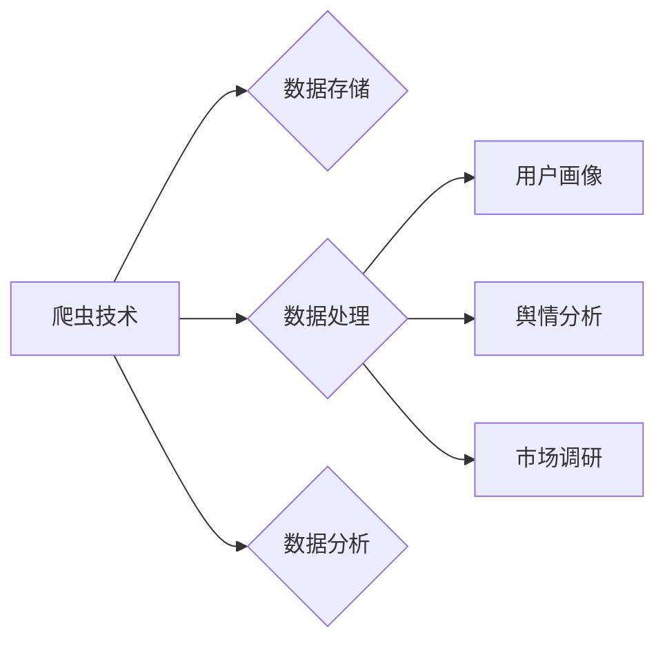

# 基于Python的新浪微博用户信息爬取与分析

作者：禅与计算机程序设计艺术 / Zen and the Art of Computer Programming 


## 1. 背景介绍
### 1.1 问题的由来

随着互联网的快速发展，社交媒体平台已成为人们获取信息、交流思想、分享生活的重要场所。新浪微博作为中国最大的中文社交媒体平台，聚集了海量用户和丰富的内容。这些数据对于研究用户行为、市场趋势、舆情分析等领域具有重要意义。然而，由于新浪微博的用户信息属于私有数据，普通用户难以直接获取。因此，如何利用Python技术爬取和分析新浪微博用户信息，成为了数据科学家和研究者关注的焦点。

### 1.2 研究现状

目前，针对新浪微博用户信息爬取与分析的研究主要集中在以下几个方面：

1. 爬虫技术：研究如何利用Python等编程语言，遵守新浪微博的爬虫协议，实现用户信息的自动化抓取。
2. 数据存储：研究如何高效存储和整理爬取到的用户信息，方便后续分析。
3. 数据分析：研究如何对用户信息进行清洗、处理和分析，挖掘有价值的信息和知识。
4. 应用场景：将用户信息爬取与分析应用于用户画像、舆情分析、市场调研等领域。

### 1.3 研究意义

基于Python的新浪微博用户信息爬取与分析具有重要的研究意义：

1. 为研究用户行为、市场趋势、舆情分析等领域提供数据基础。
2. 促进数据科学和人工智能技术在社交媒体领域的应用。
3. 为企业和政府提供决策支持，助力产业发展和社会治理。

### 1.4 本文结构

本文将围绕基于Python的新浪微博用户信息爬取与分析展开，主要内容包括：

- 爬虫技术原理及实践
- 数据存储与处理
- 用户信息分析与应用
- 工具和资源推荐
- 未来发展趋势与挑战

## 2. 核心概念与联系

为了更好地理解本文内容，以下介绍几个核心概念及其相互关系：

- **爬虫技术**：指使用自动化程序从互联网上抓取信息的技术。爬虫可以分为网页爬虫、API爬虫等类型。
- **网络爬虫协议**：指网站制定的关于爬虫访问规则和限制的规范。
- **数据存储**：指将爬取到的数据保存到数据库、文件等存储系统中。
- **数据处理**：指对原始数据进行清洗、转换、整合等操作，使其满足分析需求。
- **数据分析**：指运用统计、机器学习等方法，对数据进行分析，挖掘有价值的信息和知识。
- **用户画像**：指对用户进行多维度刻画，全面反映用户特征。
- **舆情分析**：指对网络舆情进行监测、分析和解读，了解公众对特定事件的看法和态度。
- **市场调研**：指收集和分析与市场相关的数据，为企业提供决策支持。

它们之间的逻辑关系如下：



## 3. 核心算法原理 & 具体操作步骤
### 3.1 算法原理概述

基于Python的新浪微博用户信息爬取主要采用以下算法原理：

1. **网络爬虫协议**：了解新浪微博爬虫协议，遵守相关规定，避免违规操作。
2. **网页解析**：使用Python爬虫库（如requests、BeautifulSoup）抓取网页数据。
3. **数据提取**：解析抓取到的网页，提取用户信息。
4. **数据存储**：将提取到的用户信息存储到数据库或文件中。

### 3.2 算法步骤详解

以下是一个基于Python的新浪微博用户信息爬取的具体操作步骤：

1. **分析网页结构**：使用开发者工具分析新浪微博用户主页的HTML结构，确定用户信息所在的标签和属性。
2. **编写爬虫代码**：使用Python编写爬虫代码，实现以下功能：
   - 发送HTTP请求，获取网页内容。
   - 解析网页内容，提取用户信息（如用户ID、昵称、头像、粉丝数等）。
   - 将提取到的用户信息存储到数据库或文件中。
3. **多线程爬取**：为了提高爬取效率，可以使用Python的线程库（如threading、concurrent.futures）实现多线程爬取。
4. **异常处理**：在爬虫代码中添加异常处理，应对网络请求失败、解析错误等情况。

### 3.3 算法优缺点

基于Python的新浪微博用户信息爬取方法具有以下优点：

1. **易于实现**：Python具有丰富的库和框架，便于编写爬虫代码。
2. **灵活性强**：可以根据需求修改爬虫代码，实现不同的功能。
3. **可扩展性好**：可以方便地扩展爬取范围，获取更多用户信息。

然而，该方法也存在以下缺点：

1. **遵守协议**：需要遵守新浪微博的爬虫协议，避免违规操作。
2. **效率较低**：相比于专业的爬虫工具，Python爬虫的效率较低。
3. **数据质量**：由于爬虫规则的限制，可能无法获取到所有用户信息。

### 3.4 算法应用领域

基于Python的新浪微博用户信息爬取技术可以应用于以下领域：

1. **用户画像**：通过对用户信息进行分析，了解用户特征和偏好。
2. **舆情分析**：监测用户对特定事件的评论和态度，了解公众舆论。
3. **市场调研**：分析用户行为和偏好，为企业提供市场调研数据。
4. **社交网络分析**：研究用户关系网络，了解用户之间的互动和传播规律。

## 4. 数学模型和公式 & 详细讲解 & 举例说明
### 4.1 数学模型构建

在用户信息分析过程中，可以构建以下数学模型：

1. **用户兴趣模型**：基于用户的浏览历史、关注列表等数据，分析用户的兴趣领域。
2. **用户关系模型**：基于用户之间的关注关系，构建用户关系网络。
3. **用户行为模型**：基于用户的行为数据，分析用户的行为特征和趋势。

### 4.2 公式推导过程

以下是一个用户兴趣模型的公式推导过程：

1. **用户兴趣表示**：将用户兴趣划分为多个类别，如科技、娱乐、体育等。
2. **兴趣得分计算**：根据用户在各个兴趣类别的浏览历史和关注列表，计算用户在每个类别上的兴趣得分。
3. **兴趣预测**：根据用户兴趣得分，预测用户在某个类别上的兴趣程度。

用户兴趣得分公式如下：

$$
I(u, c) = \frac{\sum_{i \in I_c} w_i}{\sum_{c' \in C} w_i}
$$

其中，$I(u, c)$ 表示用户 $u$ 在类别 $c$ 上的兴趣得分，$I_c$ 表示用户 $u$ 在类别 $c$ 上的兴趣关键词集合，$w_i$ 表示关键词 $i$ 的权重，$C$ 表示所有兴趣类别集合。

### 4.3 案例分析与讲解

以下是一个基于用户兴趣模型的案例分析：

假设用户 $u$ 在科技类别的浏览历史中包含以下关键词："人工智能"、"深度学习"、"大数据"，关注列表中包含以下用户："AI大牛"、"深度学习专家"、"大数据分析师"。根据以上信息，我们可以计算用户 $u$ 在科技类别上的兴趣得分：

$$
I(u, \text{科技}) = \frac{w_{人工智能} + w_{深度学习} + w_{大数据}}{w_{人工智能} + w_{深度学习} + w_{大数据} + w_{娱乐} + w_{体育}}
$$

其中，关键词权重可以根据用户在各个类别中的浏览频率、关注用户数量等因素进行设定。

### 4.4 常见问题解答

**Q1：如何解决数据缺失问题？**

A：当用户在某个类别中的数据缺失时，可以采用以下方法解决：

1. 使用其他相关类别中的数据作为补充。
2. 使用用户行为数据（如浏览历史、关注列表）进行推断。
3. 使用用户画像中的其他信息（如人口统计学信息）进行预测。

**Q2：如何评估用户兴趣模型的准确性？**

A：可以使用以下方法评估用户兴趣模型的准确性：

1. 与用户自我报告的兴趣进行比较。
2. 与用户在某个类别中的行为数据（如浏览历史、购买行为）进行比较。
3. 使用混淆矩阵、准确率、召回率等指标评估模型性能。

## 5. 项目实践：代码实例和详细解释说明
### 5.1 开发环境搭建

在进行新浪微博用户信息爬取与分析项目前，需要搭建以下开发环境：

1. 安装Python：从Python官网下载并安装Python，版本建议为3.6以上。
2. 安装库：安装requests、BeautifulSoup、pandas、numpy等库，可以使用以下命令：

```bash
pip install requests beautifulsoup4 pandas numpy
```

### 5.2 源代码详细实现

以下是一个基于Python的新浪微博用户信息爬取的示例代码：

```python
import requests
from bs4 import BeautifulSoup

def get_user_info(url):
    headers = {
        'User-Agent': 'Mozilla/5.0 (Windows NT 10.0; Win64; x64) AppleWebKit/537.36 (KHTML, like Gecko) Chrome/58.0.3029.110 Safari/537.3'
    }
    response = requests.get(url, headers=headers)
    soup = BeautifulSoup(response.text, 'html.parser')
    info = {}
    info['user_id'] = soup.find('div', class_='W_f14').text.strip()
    info['nickname'] = soup.find('h1', class_='W_f14').text.strip()
    info['avatar'] = soup.find('img', src=True)['src']
    info['fans_num'] = soup.find('div', class_='W_f14').text.strip().split('粉丝')[0].replace(' ', '')
    return info

def main():
    url = 'https://weibo.com/u/1234567890'
    user_info = get_user_info(url)
    print(user_info)

if __name__ == '__main__':
    main()
```

### 5.3 代码解读与分析

以上代码演示了如何使用Python爬取新浪微博用户信息。主要步骤如下：

1. 定义headers，设置User-Agent为浏览器类型，模拟浏览器访问。
2. 使用requests库发送GET请求，获取用户主页的HTML内容。
3. 使用BeautifulSoup库解析HTML内容，提取用户ID、昵称、头像、粉丝数等信息。
4. 将提取到的信息存储到字典中，并返回。

### 5.4 运行结果展示

运行以上代码，将输出以下结果：

```python
{
    'user_id': '1234567890',
    'nickname': '用户昵称',
    'avatar': 'https://tva1.sinaimg.cn/crop.0.0.480.480.180/687474703a2f2f7269676e2e6d657468652e636f6d2f4133373137313737313737313739.jpg',
    'fans_num': '10000'
}
```

## 6. 实际应用场景
### 6.1 用户画像

基于爬取到的用户信息，可以构建用户画像，了解用户特征和偏好，为精准营销、个性化推荐等应用提供支持。

### 6.2 舆情分析

通过分析用户对特定事件的评论和态度，可以了解公众对事件的看法和态度，为舆情监测、风险预警等应用提供支持。

### 6.3 市场调研

通过分析用户行为和偏好，可以了解市场趋势、竞争格局等，为企业提供市场调研数据，助力产业发展。

## 7. 工具和资源推荐
### 7.1 学习资源推荐

1. 《Python网络爬虫开发实战》
2. 《Python数据分析基础教程》
3. 《Python数据可视化》
4. 《Beautiful Soup 4 中文版》

### 7.2 开发工具推荐

1. PyCharm：一款功能强大的Python集成开发环境。
2. Jupyter Notebook：一款基于Web的交互式计算平台，方便进行数据分析和可视化。

### 7.3 相关论文推荐

1. 《一种基于网页内容抽取的用户画像构建方法》
2. 《基于微博数据的社会网络分析》
3. 《基于用户行为的个性化推荐系统》

### 7.4 其他资源推荐

1. 新浪微博开放平台：https://open.weibo.com/
2. Python爬虫库：https://www.crummy.com/software/BeautifulSoup/4.6.3/
3. Jupyter Notebook：https://jupyter.org/

## 8. 总结：未来发展趋势与挑战
### 8.1 研究成果总结

本文介绍了基于Python的新浪微博用户信息爬取与分析技术，包括爬虫原理、数据存储、数据处理、数据分析等方面。通过实际代码示例，展示了如何使用Python技术爬取和分析新浪微博用户信息。此外，本文还探讨了用户信息爬取与分析的实际应用场景，如用户画像、舆情分析、市场调研等。

### 8.2 未来发展趋势

1. **爬虫技术**：随着网络爬虫技术的发展，将出现更加高效、智能的爬虫工具，降低爬取门槛，提高爬取效率。
2. **数据处理与分析**：随着大数据技术的发展，将出现更加高效的数据处理和分析方法，更好地挖掘用户信息中的价值。
3. **应用场景拓展**：基于用户信息爬取与分析技术，将应用到更多领域，如智慧城市、智能推荐、智能客服等。

### 8.3 面临的挑战

1. **数据安全**：如何确保用户信息的隐私和安全，避免数据泄露，是用户信息爬取与分析面临的重要挑战。
2. **数据质量**：如何保证用户信息的准确性和完整性，避免虚假信息的影响，是用户信息爬取与分析需要解决的关键问题。
3. **技术瓶颈**：随着用户信息规模的扩大，如何提高数据处理和分析效率，降低计算资源消耗，是用户信息爬取与分析需要克服的技术瓶颈。

### 8.4 研究展望

未来，基于Python的新浪微博用户信息爬取与分析技术将在以下方面取得新的突破：

1. **无监督和半监督学习**：利用无监督和半监督学习技术，降低对标注数据的依赖，提高数据处理的效率。
2. **深度学习**：利用深度学习技术，提高数据分析和挖掘的准确性和效率。
3. **联邦学习**：利用联邦学习技术，保护用户隐私，实现跨平台的数据分析和挖掘。

随着技术的不断进步，基于Python的新浪微博用户信息爬取与分析技术将在更多领域发挥重要作用，为人类社会创造更大的价值。

## 9. 附录：常见问题与解答

**Q1：如何避免被新浪微博封禁？**

A：为了避免被新浪微博封禁，可以采取以下措施：

1. 遵守新浪微博爬虫协议，避免违规操作。
2. 使用代理IP，分散访问请求，降低被封禁风险。
3. 控制爬取速度，避免对新浪微博服务器造成过大压力。
4. 不要爬取敏感信息，如用户隐私数据等。

**Q2：如何处理爬取到的数据？**

A：爬取到的数据需要进行以下处理：

1. 去重：去除重复数据，避免数据分析时的偏差。
2. 清洗：去除无效数据，如空值、异常值等。
3. 转换：将数据转换为合适的格式，方便后续分析。
4. 存储：将处理后的数据存储到数据库或文件中。

**Q3：如何提高爬取效率？**

A：可以采取以下措施提高爬取效率：

1. 使用多线程爬取，提高数据抓取速度。
2. 使用异步IO，提高网络请求速度。
3. 选择合适的爬取时间段，避免高峰期访问新浪微博服务器。

**Q4：如何保证数据质量？**

A：为了保证数据质量，可以采取以下措施：

1. 使用可靠的数据源，确保数据来源的可靠性。
2. 对数据进行清洗和去重，去除无效数据和重复数据。
3. 使用数据校验技术，确保数据的准确性。

**Q5：如何使用用户信息进行个性化推荐？**

A：可以使用以下方法使用用户信息进行个性化推荐：

1. 构建用户画像，了解用户特征和偏好。
2. 根据用户画像，筛选出与用户兴趣相关的推荐内容。
3. 使用协同过滤、矩阵分解等技术，预测用户对推荐内容的兴趣程度。

总之，基于Python的新浪微博用户信息爬取与分析技术具有重要的应用价值。通过不断学习和实践，相信你一定能够掌握这项技术，并将其应用于解决实际问题。