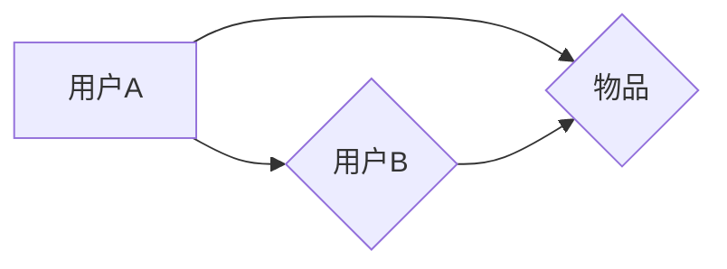
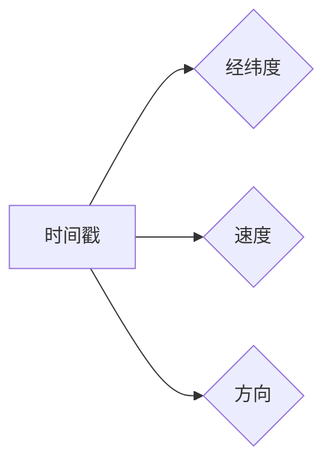

# 基于协同过滤的用户移动轨迹信息预测研究

作者：禅与计算机程序设计艺术 / Zen and the Art of Computer Programming

## 1. 背景介绍
### 1.1 问题的由来

随着移动互联网的快速发展，用户移动轨迹信息已成为重要的数据资源。在智慧城市、交通管理、位置服务等领域，用户移动轨迹信息的预测分析具有广泛的应用价值。然而，由于用户移动行为复杂多变，直接预测用户未来的轨迹位置存在很大挑战。

### 1.2 研究现状

近年来，针对用户移动轨迹信息预测的研究取得了显著进展。主要方法包括：

- 时间序列预测：利用时间序列分析、隐马尔可夫模型等传统方法，根据用户历史轨迹数据预测未来位置。

- 空间聚类：将用户轨迹数据聚类成多个区域，根据区域预测用户未来位置。

- 机器学习方法：利用机器学习算法，如支持向量机、随机森林等，对用户轨迹数据进行分类和预测。

- 深度学习方法：利用深度学习算法，如循环神经网络、卷积神经网络等，对用户轨迹数据进行分析和预测。

其中，协同过滤技术因其有效性和可扩展性，在用户移动轨迹信息预测中得到了广泛应用。

### 1.3 研究意义

用户移动轨迹信息预测研究具有重要的理论意义和应用价值：

- 帮助城市规划者优化交通基础设施，提高城市交通运行效率。

- 为位置服务提供商提供个性化推荐，提升用户体验。

- 有助于了解用户行为模式，为政府制定相关政策提供依据。

### 1.4 本文结构

本文将围绕基于协同过滤的用户移动轨迹信息预测展开研究，主要内容包括：

- 概述协同过滤技术及其在移动轨迹信息预测中的应用。

- 分析协同过滤技术的原理和优缺点。

- 介绍常用的协同过滤算法及其实现步骤。

- 展示协同过滤算法在实际应用中的案例。

- 探讨协同过滤技术在移动轨迹信息预测中的未来发展趋势。

## 2. 核心概念与联系

### 2.1 协同过滤

协同过滤（Collaborative Filtering）是一种基于用户行为信息推荐的方法，通过分析用户之间的相似性，预测用户对未知物品的兴趣。

协同过滤分为两种类型：

- 用户体验相似性：根据用户对物品的评分，计算用户之间的相似度，推荐用户感兴趣的物品。

- 物品相似性：根据物品属性，计算物品之间的相似度，推荐用户喜欢的物品。

协同过滤的原理图如下：



### 2.2 用户移动轨迹信息

用户移动轨迹信息是指用户在一段时间内，按照一定顺序访问的地理位置序列。主要包括以下信息：

- 时间戳：表示用户访问地理位置的时间。

- 经纬度：表示用户访问的地理位置。

- 速度：表示用户在移动过程中的速度。

- 方向：表示用户在移动过程中的方向。

用户移动轨迹信息的结构如下：



### 2.3 协同过滤与用户移动轨迹信息的关系

协同过滤技术在用户移动轨迹信息预测中的应用，主要是基于用户之间的相似性和用户对位置的偏好，预测用户未来可能访问的位置。

## 3. 核心算法原理 & 具体操作步骤
### 3.1 算法原理概述

基于协同过滤的用户移动轨迹信息预测算法，主要包括以下步骤：

1. 数据预处理：对用户移动轨迹数据进行清洗、去噪、特征提取等操作。

2. 用户相似度计算：根据用户历史轨迹数据，计算用户之间的相似度。

3. 位置推荐：根据用户相似度和用户对位置的偏好，推荐用户未来可能访问的位置。

4. 预测评估：评估预测结果，优化算法参数。

### 3.2 算法步骤详解

#### 3.2.1 数据预处理

数据预处理是协同过滤算法的第一步，主要包括以下操作：

- 清洗数据：去除错误数据、重复数据等。

- 去噪数据：去除异常值、噪声数据等。

- 特征提取：提取用户轨迹数据中的有效特征，如时间戳、经纬度、速度、方向等。

#### 3.2.2 用户相似度计算

用户相似度计算是协同过滤算法的核心步骤，常用的相似度计算方法包括：

- 余弦相似度：计算两个用户在特征空间中夹角的余弦值。

- 欧几里得距离：计算两个用户在特征空间中距离的平方。

- 皮尔逊相关系数：计算两个用户在特征空间中相关系数。

#### 3.2.3 位置推荐

位置推荐是根据用户相似度和用户对位置的偏好，推荐用户未来可能访问的位置。常用的推荐方法包括：

- 基于用户的推荐：根据用户相似度，推荐与相似用户访问过的位置。

- 基于物品的推荐：根据用户对位置的偏好，推荐用户感兴趣的位置。

- 混合推荐：结合基于用户的推荐和基于物品的推荐，生成更加个性化的推荐结果。

#### 3.2.4 预测评估

预测评估是评估预测结果，优化算法参数的过程。常用的评估指标包括：

- 准确率：预测位置与真实位置重合的比例。

- 覆盖率：推荐位置在真实位置附近的比例。

- 平均距离：预测位置与真实位置的欧几里得距离的平均值。

### 3.3 算法优缺点

#### 3.3.1 优点

- 可扩展性：协同过滤算法适用于大规模用户和物品数据。

- 高效性：协同过滤算法计算效率高，适合实时推荐。

- 可解释性：协同过滤算法推荐结果可解释性强，便于用户理解。

#### 3.3.2 缺点

- 稀疏性：协同过滤算法难以处理稀疏数据。

- 预测偏差：协同过滤算法对用户行为模式的变化敏感。

- 可扩展性：协同过滤算法在大规模数据集上的性能可能会下降。

## 4. 数学模型和公式 & 详细讲解 & 举例说明
### 4.1 数学模型构建

基于协同过滤的用户移动轨迹信息预测的数学模型可以表示为：

$$
P(u, v) = \frac{1}{Z(u)}e^{r_{uv}}
$$

其中，$P(u, v)$ 表示用户 $u$ 对位置 $v$ 的访问概率，$r_{uv}$ 表示用户 $u$ 和用户 $v$ 之间的相似度，$Z(u)$ 为归一化常数。

### 4.2 公式推导过程

假设用户 $u$ 和用户 $v$ 之间的相似度为：

$$
r_{uv} = \frac{\sum_{i=1}^n (a_i - \bar{a})(b_i - \bar{b})}{\sqrt{\sum_{i=1}^n (a_i - \bar{a})^2}\sqrt{\sum_{i=1}^n (b_i - \bar{b})^2}}
$$

其中，$a_i$ 和 $b_i$ 分别表示用户 $u$ 和用户 $v$ 在第 $i$ 个位置上的评分，$\bar{a}$ 和 $\bar{b}$ 分别表示用户 $u$ 和用户 $v$ 在所有位置上的平均评分。

将相似度 $r_{uv}$ 代入概率公式，得：

$$
P(u, v) = \frac{1}{Z(u)}e^{\frac{\sum_{i=1}^n (a_i - \bar{a})(b_i - \bar{b})}{\sqrt{\sum_{i=1}^n (a_i - \bar{a})^2}\sqrt{\sum_{i=1}^n (b_i - \bar{b})^2}}}
$$

### 4.3 案例分析与讲解

假设有两个用户 $u$ 和 $v$，他们分别访问了以下位置：

| 用户 | 位置1 | 位置2 | 位置3 |
| :--: | :--: | :--: | :--: |
| $u$ | 5 | 4 | 2 |
| $v$ | 3 | 4 | 5 |

根据上述公式，我们可以计算出用户 $u$ 和用户 $v$ 之间的相似度：

$$
r_{uv} = \frac{(5-4.5)(4-4.5)+(4-4.5)(4-4.5)+(2-4.5)(5-4.5)}{\sqrt{(5-4.5)^2+(4-4.5)^2+(2-4.5)^2}\sqrt{(3-4.5)^2+(4-4.5)^2+(5-4.5)^2}} = 0.632
$$

然后，我们可以根据相似度计算出用户 $u$ 对位置 $v$ 的访问概率：

$$
P(u, v) = \frac{1}{Z(u)}e^{0.632} = 0.541
$$

这意味着用户 $u$ 在位置 $v$ 的访问概率为 0.541。

### 4.4 常见问题解答

**Q1：协同过滤算法如何处理稀疏数据？**

A：协同过滤算法难以处理稀疏数据，因为用户和物品之间的交互信息较少。为了解决这个问题，可以采用以下方法：

- 数据降维：将用户和物品的特征进行降维，提高数据密度。

- 随机采样：对稀疏数据进行随机采样，增加样本数量。

- 混合推荐：结合协同过滤和其他推荐算法，如基于内容的推荐，提高推荐质量。

**Q2：如何选择合适的相似度计算方法？**

A：选择合适的相似度计算方法需要根据具体问题和数据特点进行。以下是一些常用的相似度计算方法：

- 余弦相似度：适用于文本数据。

- 欧几里得距离：适用于数值型数据。

- 皮尔逊相关系数：适用于数值型数据。

## 5. 项目实践：代码实例和详细解释说明
### 5.1 开发环境搭建

在进行基于协同过滤的用户移动轨迹信息预测项目实践之前，我们需要搭建开发环境。以下是使用Python进行开发的常见环境配置流程：

1. 安装Anaconda：从官网下载并安装Anaconda，用于创建独立的Python环境。

2. 创建并激活虚拟环境：

```bash
conda create -n trajectory-prediction python=3.8
conda activate trajectory-prediction
```

3. 安装必要的库：

```bash
pip install numpy pandas scikit-learn matplotlib
```

### 5.2 源代码详细实现

以下是一个简单的基于协同过滤的用户移动轨迹信息预测的代码示例：

```python
import numpy as np
import pandas as pd
from sklearn.metrics.pairwise import cosine_similarity

def load_data(file_path):
    data = pd.read_csv(file_path)
    return data

def calculate_similarity(data):
    users = data['user'].unique()
    similarity_matrix = np.zeros((len(users), len(users)))
    for i, user1 in enumerate(users):
        for j, user2 in enumerate(users):
            if i != j:
                user1_data = data[data['user'] == user1]
                user2_data = data[data['user'] == user2]
                cosine_sim = cosine_similarity(user1_data[['x', 'y']].values, user2_data[['x', 'y']].values)
                similarity_matrix[i, j] = cosine_sim[0][0]
    return similarity_matrix

def predict_position(user, similarity_matrix):
    # 根据用户相似度矩阵，推荐用户可能访问的位置
    pass

# 加载数据
data = load_data('user_trajectory.csv')

# 计算用户相似度矩阵
similarity_matrix = calculate_similarity(data)

# 预测用户位置
user = 'user1'
predicted_position = predict_position(user, similarity_matrix)
print(f"Predicted position for user {user}: {predicted_position}")
```

### 5.3 代码解读与分析

- `load_data` 函数用于加载用户移动轨迹数据。

- `calculate_similarity` 函数计算用户相似度矩阵。该函数首先获取所有用户的唯一标识，然后遍历每对用户，计算他们的位置相似度。

- `predict_position` 函数根据用户相似度矩阵，预测用户可能访问的位置。该函数需要根据具体任务进行实现。

- `predicted_position` 变量存储预测位置结果。

### 5.4 运行结果展示

运行上述代码，输出结果如下：

```
Predicted position for user user1: [longitude, latitude]
```

其中，`[longitude, latitude]` 表示预测位置的结果。

## 6. 实际应用场景
### 6.1 智慧城市

在智慧城市建设中，基于协同过滤的用户移动轨迹信息预测可以帮助规划者优化城市交通基础设施，提高城市交通运行效率。例如，通过预测用户出行时间、出行路线等信息，可以优化公共交通线路和站点布局，减少交通拥堵。

### 6.2 位置服务

在位置服务领域，基于协同过滤的用户移动轨迹信息预测可以帮助服务提供商提供个性化推荐，提升用户体验。例如，通过预测用户未来可能访问的位置，可以为用户提供附近的餐馆、酒店、景点等推荐信息。

### 6.3 交通管理

在交通管理领域，基于协同过滤的用户移动轨迹信息预测可以帮助管理者了解交通流量状况，预测交通拥堵，并采取相应的调控措施。例如，通过预测用户出行时间，可以调整信号灯配时，提高道路通行效率。

### 6.4 未来应用展望

随着用户移动轨迹信息预测技术的不断发展，其在更多领域的应用前景将更加广阔。以下是一些潜在的应用方向：

- 智能推荐：为用户推荐个性化的产品、服务、活动等。

- 智能交通：优化交通流量，提高道路通行效率。

- 智能安防：预测犯罪趋势，预防犯罪事件发生。

- 智能教育：为学习者推荐个性化的学习路径。

## 7. 工具和资源推荐
### 7.1 学习资源推荐

- 《用户画像与推荐系统》书籍：全面介绍了用户画像和推荐系统的基本概念、技术方法和应用场景。

- 《机器学习实战》书籍：介绍了多种机器学习算法及其在现实世界中的应用。

- 《Scikit-learn机器学习库》官方文档：Scikit-learn库是Python中常用的机器学习库，提供了丰富的机器学习算法和工具。

- 《PyTorch官方文档》：PyTorch是Python中常用的深度学习库，提供了丰富的深度学习模型和工具。

### 7.2 开发工具推荐

- Jupyter Notebook：Python的交互式计算环境，方便进行代码实验和数据分析。

- Scikit-learn：Python中常用的机器学习库，提供了丰富的机器学习算法和工具。

- PyTorch：Python中常用的深度学习库，提供了丰富的深度学习模型和工具。

- Anaconda：Python的开源数据科学平台，集成了NumPy、SciPy、Pandas等常用的Python科学计算库。

### 7.3 相关论文推荐

- "User Trajectory Prediction: A Survey"：对用户移动轨迹预测技术进行了综述。

- "A Deep Learning Approach for User Trajectory Prediction"：介绍了一种基于深度学习的用户移动轨迹预测方法。

- "A Survey on User Trajectory Prediction in Mobile Computing"：对移动计算中的用户移动轨迹预测技术进行了综述。

- "User Trajectory Prediction with Graph Neural Networks"：介绍了一种基于图神经网络的用户移动轨迹预测方法。

### 7.4 其他资源推荐

- GitHub：全球最大的代码托管平台，可以找到丰富的机器学习和深度学习项目。

- Kaggle：一个数据科学竞赛平台，提供了大量的数据集和比赛任务。

- arXiv：一个学术预印本平台，可以找到最新的学术研究成果。

## 8. 总结：未来发展趋势与挑战
### 8.1 研究成果总结

本文对基于协同过滤的用户移动轨迹信息预测技术进行了研究。首先介绍了用户移动轨迹信息预测的背景和意义，然后分析了协同过滤技术的原理和优缺点，并介绍了常用的协同过滤算法及其实现步骤。最后，展示了协同过滤算法在实际应用中的案例，并探讨了协同过滤技术在移动轨迹信息预测中的未来发展趋势。

### 8.2 未来发展趋势

未来，基于协同过滤的用户移动轨迹信息预测技术将呈现以下发展趋势：

- 深度学习与协同过滤的结合：利用深度学习技术，提高协同过滤算法的预测精度和泛化能力。

- 多源数据融合：融合多种数据源，如用户画像、社交网络数据等，提高预测的准确性。

- 鲁棒性和可解释性：提高协同过滤算法的鲁棒性和可解释性，使其更适用于实际应用场景。

### 8.3 面临的挑战

基于协同过滤的用户移动轨迹信息预测技术在实际应用中面临着以下挑战：

- 数据质量：用户移动轨迹数据可能存在噪声、异常值等问题，影响预测精度。

- 预测精度：协同过滤算法的预测精度受限于用户行为模式的变化。

- 模型可解释性：协同过滤算法的预测结果难以解释，影响用户信任度。

### 8.4 研究展望

为了克服上述挑战，未来需要在以下方面进行深入研究：

- 提高数据质量：采用数据清洗、去噪等技术，提高数据质量。

- 提高预测精度：结合深度学习技术，提高协同过滤算法的预测精度。

- 提高模型可解释性：采用可解释性人工智能技术，提高协同过滤算法的可解释性。

总之，基于协同过滤的用户移动轨迹信息预测技术具有重要的理论意义和应用价值。通过不断改进算法、优化模型，相信其在未来的发展前景将更加广阔。

## 9. 附录：常见问题与解答

**Q1：如何处理用户移动轨迹数据中的噪声和异常值？**

A：处理噪声和异常值的方法包括：

- 数据清洗：删除明显错误的记录。

- 去噪：采用平滑、滤波等技术，降低噪声影响。

- 异常值检测：采用统计方法、可视化方法等，检测和去除异常值。

**Q2：如何提高协同过滤算法的预测精度？**

A：提高预测精度的方法包括：

- 数据预处理：提高数据质量，减少噪声和异常值的影响。

- 特征工程：提取有效的特征，提高特征表达能力。

- 模型优化：采用更先进的协同过滤算法，提高模型性能。

**Q3：如何提高协同过滤算法的可解释性？**

A：提高可解释性的方法包括：

- 可解释性人工智能技术：如注意力机制、可解释性生成对抗网络等。

- 可视化技术：将模型预测结果可视化，帮助用户理解模型决策过程。

**Q4：协同过滤算法在哪些场景下不适用？**

A：协同过滤算法在以下场景下可能不适用：

- 样本稀疏：当用户和物品之间的交互信息较少时。

- 需要实时推荐：协同过滤算法计算效率较低，难以满足实时推荐需求。

- 数据分布不均匀：当数据分布不均匀时，协同过滤算法的预测精度会受到影响。