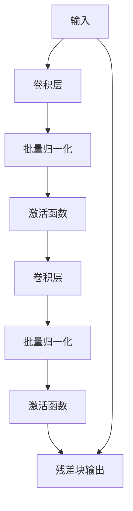
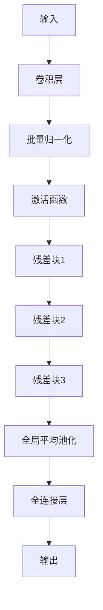

## 1. 背景介绍

深度学习在计算机视觉领域的应用已经取得了很大的成功，但是在训练深度神经网络时，会遇到梯度消失和梯度爆炸等问题，导致网络无法收敛。为了解决这个问题，ResNet网络被提出。ResNet网络是一种残差网络，通过引入残差块，使得网络可以更好地学习到输入和输出之间的差异，从而提高了网络的性能。

本文将介绍如何从零开始实现ResNet网络，并进行微调，以达到更好的性能。

## 2. 核心概念与联系

### 2.1 残差块

残差块是ResNet网络的核心组成部分，它可以使得网络更好地学习到输入和输出之间的差异。残差块的结构如下图所示：



其中，输入通过卷积层、批量归一化和激活函数后，再通过另一个卷积层、批量归一化和激活函数，最后与输入相加得到残差块的输出。

### 2.2 ResNet网络

ResNet网络是由多个残差块组成的深度神经网络，它可以解决深度神经网络中的梯度消失和梯度爆炸问题。ResNet网络的结构如下图所示：



ResNet网络由一个卷积层、批量归一化和激活函数组成的初始层，多个残差块组成的中间层，一个全局平均池化层和一个全连接层组成。最后通过全连接层得到输出。

## 3. 核心算法原理具体操作步骤

### 3.1 数据预处理

在训练ResNet网络之前，需要对数据进行预处理。常见的预处理方法包括：将像素值归一化到[0,1]之间、对图像进行随机裁剪和水平翻转等。

### 3.2 模型构建

ResNet网络的模型构建包括两个部分：残差块的构建和整个网络的构建。

#### 3.2.1 残差块的构建

残差块的构建包括两个卷积层、两个批量归一化层和一个残差块输出。其中，每个卷积层都包括卷积核、步长和填充等参数。每个批量归一化层都包括批量归一化的参数。

#### 3.2.2 整个网络的构建

整个网络的构建包括一个卷积层、多个残差块和一个全连接层。其中，卷积层和全连接层的构建与残差块的构建类似。多个残差块的构建可以通过循环来实现。

### 3.3 模型训练

模型训练包括模型的编译和模型的训练。模型的编译包括选择损失函数、优化器和评估指标等。模型的训练包括设置训练参数、训练模型和保存模型等。

### 3.4 模型微调

模型微调是指在已经训练好的模型上，对某些层进行重新训练，以适应新的数据集或任务。模型微调包括选择需要微调的层、设置微调参数和微调模型等。

## 4. 数学模型和公式详细讲解举例说明

ResNet网络的数学模型和公式如下：

$$y = F(x) + x$$

其中，$x$表示输入，$F(x)$表示残差块的输出，$y$表示残差块的最终输出。

## 5. 项目实践：代码实例和详细解释说明

以下是使用Keras框架实现ResNet网络的代码实例：

```python
from keras.layers import Input, Conv2D, BatchNormalization, Activation, Add, GlobalAveragePooling2D, Dense
from keras.models import Model

def residual_block(input_tensor, filters, strides=(1, 1)):
    x = Conv2D(filters=filters, kernel_size=(3, 3), strides=strides, padding='same')(input_tensor)
    x = BatchNormalization()(x)
    x = Activation('relu')(x)
    x = Conv2D(filters=filters, kernel_size=(3, 3), strides=(1, 1), padding='same')(x)
    x = BatchNormalization()(x)
    if strides != (1, 1):
        input_tensor = Conv2D(filters=filters, kernel_size=(1, 1), strides=strides, padding='same')(input_tensor)
        input_tensor = BatchNormalization()(input_tensor)
    x = Add()([x, input_tensor])
    x = Activation('relu')(x)
    return x

def ResNet(input_shape, num_classes):
    input_tensor = Input(shape=input_shape)
    x = Conv2D(filters=64, kernel_size=(7, 7), strides=(2, 2), padding='same')(input_tensor)
    x = BatchNormalization()(x)
    x = Activation('relu')(x)
    x = residual_block(x, filters=64, strides=(1, 1))
    x = residual_block(x, filters=64, strides=(1, 1))
    x = residual_block(x, filters=64, strides=(1, 1))
    x = residual_block(x, filters=128, strides=(2, 2))
    x = residual_block(x, filters=128, strides=(1, 1))
    x = residual_block(x, filters=128, strides=(1, 1))
    x = residual_block(x, filters=256, strides=(2, 2))
    x = residual_block(x, filters=256, strides=(1, 1))
    x = residual_block(x, filters=256, strides=(1, 1))
    x = residual_block(x, filters=512, strides=(2, 2))
    x = residual_block(x, filters=512, strides=(1, 1))
    x = residual_block(x, filters=512, strides=(1, 1))
    x = GlobalAveragePooling2D()(x)
    x = Dense(units=num_classes, activation='softmax')(x)
    model = Model(inputs=input_tensor, outputs=x)
    return model
```

以上代码实现了一个50层的ResNet网络，包括一个卷积层、多个残差块和一个全连接层。其中，每个残差块包括两个卷积层、两个批量归一化层和一个残差块输出。

## 6. 实际应用场景

ResNet网络在计算机视觉领域的应用非常广泛，例如图像分类、目标检测和语义分割等。在图像分类任务中，ResNet网络可以达到非常高的准确率，甚至超过人类的识别能力。

## 7. 工具和资源推荐

- Keras：一个高层次的神经网络API，可以在TensorFlow、CNTK或Theano上运行。
- TensorFlow：一个开源的人工智能框架，由Google Brain团队开发。
- PyTorch：一个开源的机器学习框架，由Facebook人工智能研究院开发。

## 8. 总结：未来发展趋势与挑战

ResNet网络是深度学习领域的重要进展之一，它可以解决深度神经网络中的梯度消失和梯度爆炸问题。未来，ResNet网络将继续在计算机视觉领域发挥重要作用，同时也面临着更多的挑战，例如如何进一步提高网络的性能和如何应对更加复杂的任务。

## 9. 附录：常见问题与解答

Q: ResNet网络的优点是什么？

A: ResNet网络可以解决深度神经网络中的梯度消失和梯度爆炸问题，从而提高网络的性能。

Q: 如何实现ResNet网络？

A: 可以使用Keras、TensorFlow或PyTorch等深度学习框架来实现ResNet网络。

Q: ResNet网络在哪些领域有应用？

A: ResNet网络在计算机视觉领域的应用非常广泛，例如图像分类、目标检测和语义分割等。