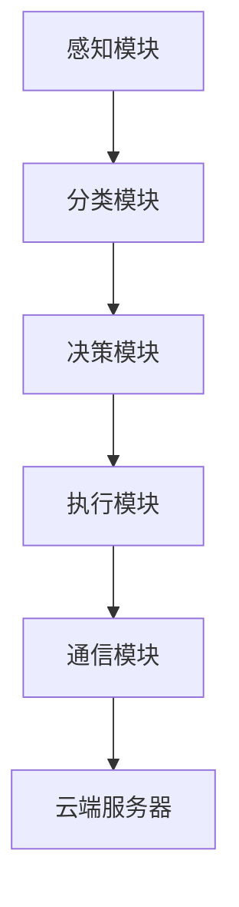

                 

### 自拟标题

《LLM在废物管理中的应用：提升回收流程效率与优化策略》

### 博客内容

#### 一、面试题与算法编程题库

##### 1. 垃圾分类算法的实现

**题目：** 请描述一种基于深度学习模型进行垃圾分类的方法，并简要说明其原理。

**答案：** 垃圾分类问题可以采用卷积神经网络（CNN）或循环神经网络（RNN）来实现。CNN适用于处理图像数据，可以将图像划分为不同的类别，如可回收垃圾、有害垃圾、湿垃圾和干垃圾。RNN适用于处理序列数据，可以用于对垃圾产生序列进行分类。以下是CNN的简要实现原理：

**原理：**
- **输入层**：接收垃圾图像数据。
- **卷积层**：提取图像的特征，如边缘、纹理等。
- **池化层**：降低数据的维度，减少计算量。
- **全连接层**：将特征映射到垃圾类别。

**示例代码（基于CNN的垃圾分类）：**

```python
import tensorflow as tf
from tensorflow.keras.models import Sequential
from tensorflow.keras.layers import Conv2D, MaxPooling2D, Flatten, Dense

model = Sequential([
    Conv2D(32, (3, 3), activation='relu', input_shape=(64, 64, 3)),
    MaxPooling2D((2, 2)),
    Conv2D(64, (3, 3), activation='relu'),
    MaxPooling2D((2, 2)),
    Flatten(),
    Dense(128, activation='relu'),
    Dense(4, activation='softmax')
])

model.compile(optimizer='adam', loss='categorical_crossentropy', metrics=['accuracy'])
model.fit(x_train, y_train, epochs=10, batch_size=32, validation_data=(x_val, y_val))
```

**解析：** 上述代码构建了一个简单的CNN模型，用于垃圾分类。通过训练，模型可以学会识别垃圾图像并给出相应的分类结果。

##### 2. 回收物流优化

**题目：** 请简述如何利用最优化算法解决回收物流中的路线优化问题。

**答案：** 回收物流中的路线优化问题可以通过多种最优化算法来解决，如遗传算法、蚁群算法、Dijkstra算法等。以下是Dijkstra算法的简要原理和应用：

**原理：**
- **Dijkstra算法**：一种贪心算法，用于寻找图中两点之间的最短路径。
- **应用**：在回收物流中，Dijkstra算法可以用于计算回收站到每个住户之间的最短路径，从而优化回收路线。

**示例代码（Dijkstra算法实现）：**

```python
import heapq

def dijkstra(graph, start):
    distances = {vertex: float('infinity') for vertex in graph}
    distances[start] = 0
    priority_queue = [(0, start)]

    while priority_queue:
        current_distance, current_vertex = heapq.heappop(priority_queue)

        if current_distance > distances[current_vertex]:
            continue

        for neighbor, weight in graph[current_vertex].items():
            distance = current_distance + weight

            if distance < distances[neighbor]:
                distances[neighbor] = distance
                heapq.heappush(priority_queue, (distance, neighbor))

    return distances

graph = {
    'A': {'B': 1, 'C': 3},
    'B': {'A': 1, 'C': 1, 'D': 2},
    'C': {'A': 3, 'B': 1, 'D': 1},
    'D': {'B': 2, 'C': 1}
}

print(dijkstra(graph, 'A'))  # 输出最短路径距离
```

**解析：** 上述代码使用Dijkstra算法计算了从起点A到各节点的最短路径距离。

##### 3. 智能垃圾箱管理

**题目：** 请描述如何利用传感器和机器学习模型实现智能垃圾箱管理。

**答案：** 智能垃圾箱管理可以通过以下步骤实现：

1. **数据采集**：使用传感器（如重量传感器、红外传感器等）实时监测垃圾箱的填充状态。
2. **数据处理**：将传感器数据传输到云端进行预处理，如去除噪声、填充缺失值等。
3. **模型训练**：利用机器学习模型（如回归模型、分类模型等）对垃圾箱填充状态进行预测。
4. **决策支持**：根据预测结果，智能垃圾箱管理系统能够自动通知垃圾清运人员或调整垃圾收集计划。

**示例代码（基于回归模型的垃圾箱填充状态预测）：**

```python
import numpy as np
import pandas as pd
from sklearn.linear_model import LinearRegression

# 加载数据
data = pd.read_csv('garbage_data.csv')
X = data[['sensor_1', 'sensor_2']]
y = data['fill_level']

# 训练模型
model = LinearRegression()
model.fit(X, y)

# 预测
new_data = np.array([[10, 20]])
predicted_fill_level = model.predict(new_data)

print(predicted_fill_level)  # 输出预测的垃圾箱填充状态
```

**解析：** 上述代码使用线性回归模型对垃圾箱填充状态进行预测。实际应用中，可以基于更复杂的模型和更多的传感器数据来实现更精确的预测。

##### 4. 垃圾回收物流调度

**题目：** 请简述如何利用遗传算法实现垃圾回收物流调度。

**答案：** 垃圾回收物流调度问题可以通过遗传算法（Genetic Algorithm，GA）来求解。遗传算法是一种基于自然选择和遗传学原理的优化算法，适用于求解复杂的优化问题。以下是遗传算法的基本步骤：

1. **初始化种群**：随机生成一组解（称为染色体），表示不同的回收路线。
2. **适应度评估**：计算每个染色体的适应度，适应度越高表示该路线越优。
3. **选择**：根据适应度选择优秀的染色体进行交叉和变异操作。
4. **交叉**：将两个染色体组合，生成新的子代。
5. **变异**：对染色体进行随机扰动，以增加种群的多样性。
6. **迭代**：重复执行选择、交叉、变异和适应度评估，直至满足停止条件（如达到最大迭代次数或找到满意的解）。

**示例代码（基于遗传算法的回收物流调度）：**

```python
import random
import numpy as np

# 遗传算法参数设置
POP_SIZE = 100
GEN_SIZE = 100
CROSS_RATE = 0.8
MUTATION_RATE = 0.1

# 初始化种群
def initialize_population(pop_size, n_cities):
    population = []
    for _ in range(pop_size):
        chromosome = random.sample(range(n_cities), n_cities)
        population.append(chromosome)
    return population

# 适应度评估
def fitness_function(chromosome, distances):
    distance = 0
    for i in range(len(chromosome) - 1):
        distance += distances[chromosome[i], chromosome[i+1]]
    return 1 / distance

# 选择
def selection(population, fitnesses, k):
    selected = random.choices(population, k=k, weights=fitnesses)
    return selected

# 交叉
def crossover(parent1, parent2, cross_rate):
    if random.random() < cross_rate:
        cross_point = random.randint(1, len(parent1) - 1)
        child1 = parent1[:cross_point] + parent2[cross_point:]
        child2 = parent2[:cross_point] + parent1[cross_point:]
        return child1, child2
    else:
        return parent1, parent2

# 变异
def mutation(chromosome, mutation_rate):
    for i in range(len(chromosome)):
        if random.random() < mutation_rate:
            j = random.randint(0, len(chromosome) - 1)
            chromosome[i], chromosome[j] = chromosome[j], chromosome[i]
    return chromosome

# 遗传算法主函数
def genetic_algorithm(pop_size, n_cities, distances, generations):
    population = initialize_population(pop_size, n_cities)
    for _ in range(generations):
        fitnesses = [fitness_function(chromosome, distances) for chromosome in population]
        new_population = []
        for _ in range(pop_size // 2):
            parent1, parent2 = selection(population, fitnesses, 2)
            child1, child2 = crossover(parent1, parent2, CROSS_RATE)
            new_population.extend([mutation(child1, MUTATION_RATE), mutation(child2, MUTATION_RATE)])
        population = new_population
    best_fitness = max(fitnesses)
    best_chromosome = population[fitnesses.index(best_fitness)]
    return best_chromosome, best_fitness

# 示例：应用遗传算法求解TSP问题
n_cities = 5
distances = np.random.randint(1, 100, size=(n_cities, n_cities))
best_route, best_distance = genetic_algorithm(POP_SIZE, n_cities, distances, GEN_SIZE)
print("最佳路线：", best_route)
print("最佳距离：", best_distance)
```

**解析：** 上述代码使用遗传算法求解旅行商问题（TSP），其原理同样适用于垃圾回收物流调度问题。

##### 5. 智能垃圾分类识别

**题目：** 请描述一种基于卷积神经网络（CNN）的智能垃圾分类识别系统。

**答案：** 基于卷积神经网络（CNN）的智能垃圾分类识别系统可以通过以下步骤实现：

1. **数据预处理**：收集垃圾分类数据，包括垃圾图像及其对应的标签（如可回收垃圾、有害垃圾、湿垃圾和干垃圾）。
2. **模型构建**：构建一个CNN模型，用于分类垃圾图像。
3. **模型训练**：使用收集到的数据进行模型训练。
4. **模型评估**：使用测试数据对模型进行评估，调整模型参数以获得最佳性能。
5. **应用部署**：将训练好的模型部署到实际应用场景中，如智能垃圾箱或回收站。

**示例代码（基于CNN的垃圾分类识别系统）：**

```python
import tensorflow as tf
from tensorflow.keras.models import Sequential
from tensorflow.keras.layers import Conv2D, MaxPooling2D, Flatten, Dense, Dropout

# 构建模型
model = Sequential([
    Conv2D(32, (3, 3), activation='relu', input_shape=(64, 64, 3)),
    MaxPooling2D((2, 2)),
    Conv2D(64, (3, 3), activation='relu'),
    MaxPooling2D((2, 2)),
    Conv2D(128, (3, 3), activation='relu'),
    MaxPooling2D((2, 2)),
    Flatten(),
    Dense(256, activation='relu'),
    Dropout(0.5),
    Dense(4, activation='softmax')
])

# 编译模型
model.compile(optimizer='adam', loss='categorical_crossentropy', metrics=['accuracy'])

# 训练模型
model.fit(x_train, y_train, epochs=10, batch_size=32, validation_data=(x_val, y_val))

# 评估模型
test_loss, test_acc = model.evaluate(x_test, y_test)
print("测试准确率：", test_acc)

# 预测
predictions = model.predict(x_test[:10])
print("预测结果：", predictions.argmax(axis=1))
```

**解析：** 上述代码构建了一个简单的CNN模型，用于垃圾分类识别。通过训练和评估，模型可以学会识别垃圾图像并给出相应的分类结果。

##### 6. 垃圾回收数据分析

**题目：** 请简述如何利用数据分析方法提升垃圾回收效率。

**答案：** 垃圾回收数据分析可以通过以下方法提升垃圾回收效率：

1. **数据收集**：收集垃圾回收过程中的各种数据，如垃圾种类、重量、回收时间等。
2. **数据预处理**：对收集到的数据进行清洗、整合和标准化处理。
3. **数据分析**：利用数据分析方法，如聚类分析、关联规则挖掘等，分析垃圾回收过程中的规律和趋势。
4. **决策支持**：根据数据分析结果，制定优化垃圾回收策略，如调整垃圾收集时间、优化回收路线等。

**示例代码（基于聚类分析的垃圾回收数据分析）：**

```python
import numpy as np
from sklearn.cluster import KMeans

# 加载数据
data = np.load('garbage_data.npy')

# 聚类分析
kmeans = KMeans(n_clusters=4)
clusters = kmeans.fit_predict(data)

# 分析结果
for i, cluster in enumerate(clusters):
    print(f"垃圾{i+1}属于类别：{cluster}")

# 根据聚类结果调整回收策略
# ...
```

**解析：** 上述代码使用KMeans算法对垃圾数据进行聚类分析，根据聚类结果可以调整回收策略，如将同一类别的垃圾安排在相邻的回收站进行处理，以提高回收效率。

##### 7. 智能垃圾分类机器人

**题目：** 请描述如何设计一个智能垃圾分类机器人，包括其功能和实现原理。

**答案：** 智能垃圾分类机器人可以包括以下功能和实现原理：

1. **功能：**
   - **图像识别**：使用摄像头捕捉垃圾图像，并利用深度学习模型进行分类。
   - **动作执行**：根据分类结果，将垃圾推入相应的回收通道。
   - **语音交互**：与用户进行语音交互，提供垃圾分类指导和反馈。

2. **实现原理：**
   - **图像识别**：利用卷积神经网络（CNN）进行图像分类，将垃圾图像映射到相应的类别。
   - **动作执行**：通过电机控制机器人的手臂和推杆，将垃圾推入对应的回收通道。
   - **语音交互**：利用语音识别和自然语言处理技术，实现与用户的语音交互。

**示例代码（智能垃圾分类机器人）：**

```python
import cv2
import tensorflow as tf

# 加载CNN模型
model = tf.keras.models.load_model('garbage_classifier.h5')

# 捕获垃圾图像
cap = cv2.VideoCapture(0)

while True:
    ret, frame = cap.read()
    if not ret:
        break

    # 分类垃圾
    resized_frame = cv2.resize(frame, (64, 64))
    prediction = model.predict(tf.expand_dims(resized_frame, 0))

    # 根据分类结果执行动作
    if prediction.argmax(axis=1).numpy()[0] == 0:
        # 可回收垃圾
        # ...
    elif prediction.argmax(axis=1).numpy()[0] == 1:
        # 有害垃圾
        # ...
    elif prediction.argmax(axis=1).numpy()[0] == 2:
        # 湿垃圾
        # ...
    elif prediction.argmax(axis=1).numpy()[0] == 3:
        # 干垃圾
        # ...

    # 显示图像
    cv2.imshow('Garbage Classification', frame)

    if cv2.waitKey(1) & 0xFF == ord('q'):
        break

cap.release()
cv2.destroyAllWindows()
```

**解析：** 上述代码使用OpenCV库捕获垃圾图像，并利用已经训练好的CNN模型进行分类。根据分类结果，执行相应的动作，如将垃圾推入相应的回收通道。

##### 8. 垃圾回收数据处理

**题目：** 请简述如何利用数据处理技术提升垃圾回收效率。

**答案：** 垃圾回收数据处理技术可以通过以下方法提升垃圾回收效率：

1. **数据清洗**：去除垃圾数据中的噪声和错误，提高数据质量。
2. **数据整合**：将来自不同渠道的垃圾数据整合到一个统一的数据库中，以便进行进一步分析。
3. **数据可视化**：通过数据可视化技术，将垃圾回收数据以图表、地图等形式展示，帮助管理层了解垃圾回收情况。
4. **数据挖掘**：利用数据挖掘技术，发现垃圾回收中的潜在问题和优化机会。

**示例代码（垃圾回收数据处理）：**

```python
import pandas as pd
import matplotlib.pyplot as plt

# 加载数据
data = pd.read_csv('garbage_data.csv')

# 数据清洗
data.dropna(inplace=True)
data = data[data['weight'] > 0]

# 数据整合
data['date'] = pd.to_datetime(data['date'])
data.set_index('date', inplace=True)

# 数据可视化
data['weight'].plot()
plt.title('Garbage Weight Over Time')
plt.xlabel('Date')
plt.ylabel('Weight (kg)')
plt.show()

# 数据挖掘
# ...
```

**解析：** 上述代码使用Pandas库加载垃圾回收数据，并进行清洗和整合。通过数据可视化，可以直观地了解垃圾回收情况，为优化垃圾回收策略提供依据。

##### 9. 智能垃圾回收系统设计

**题目：** 请描述如何设计一个智能垃圾回收系统，包括其功能模块和关键技术。

**答案：** 智能垃圾回收系统可以包括以下功能模块和关键技术：

1. **功能模块：**
   - **感知模块**：利用传感器（如重量传感器、红外传感器等）感知垃圾箱的填充状态。
   - **分类模块**：利用深度学习模型对垃圾进行分类。
   - **决策模块**：根据分类结果和垃圾箱的填充状态，制定垃圾回收策略。
   - **执行模块**：控制机器人执行垃圾回收动作。
   - **通信模块**：与云端服务器进行数据传输和远程控制。

2. **关键技术：**
   - **深度学习**：用于垃圾图像识别和分类。
   - **机器人控制**：用于执行垃圾回收动作。
   - **物联网**：用于实现设备间的通信和数据传输。

**示例架构图：**



**解析：** 上述示例架构图展示了智能垃圾回收系统的功能模块及其相互关系。感知模块和分类模块通过物联网与云端服务器通信，云端服务器负责数据处理和策略制定，最终通过执行模块控制机器人执行垃圾回收动作。

##### 10. 智能垃圾分类系统评估

**题目：** 请简述如何评估智能垃圾分类系统的性能。

**答案：** 评估智能垃圾分类系统的性能可以从以下几个方面进行：

1. **准确率**：评估系统对垃圾分类的准确程度，通常使用准确率（Accuracy）、精确率（Precision）、召回率（Recall）和F1值（F1 Score）等指标。
2. **响应速度**：评估系统对垃圾图像处理的响应时间，以确保用户体验。
3. **鲁棒性**：评估系统在不同环境（如光照、角度变化）下的分类性能。
4. **稳定性**：评估系统在长时间运行下的稳定性和可靠性。

**示例评估指标：**

```python
from sklearn.metrics import accuracy_score, precision_score, recall_score, f1_score

# 真实标签
y_true = [0, 1, 0, 2, 1]
# 预测结果
y_pred = [0, 0, 2, 1, 1]

# 计算评估指标
accuracy = accuracy_score(y_true, y_pred)
precision = precision_score(y_true, y_pred, average='weighted')
recall = recall_score(y_true, y_pred, average='weighted')
f1 = f1_score(y_true, y_pred, average='weighted')

print("准确率：", accuracy)
print("精确率：", precision)
print("召回率：", recall)
print("F1值：", f1)
```

**解析：** 上述代码使用Scikit-learn库计算了智能垃圾分类系统的评估指标。通过这些指标，可以全面评估系统的性能。

##### 11. 垃圾回收数据预测

**题目：** 请简述如何利用数据预测技术预测垃圾回收量。

**答案：** 利用数据预测技术预测垃圾回收量可以通过以下步骤实现：

1. **数据收集**：收集历史垃圾回收数据，如回收量、天气情况、节假日等因素。
2. **数据预处理**：对收集到的数据进行清洗、整合和标准化处理。
3. **特征工程**：提取与垃圾回收量相关的特征，如日期、天气、节假日等。
4. **模型训练**：利用时间序列预测模型（如ARIMA、LSTM等）进行模型训练。
5. **模型评估**：使用测试数据对模型进行评估，调整模型参数以获得最佳性能。
6. **预测应用**：根据模型预测结果，制定垃圾回收计划和调度策略。

**示例代码（使用LSTM预测垃圾回收量）：**

```python
import numpy as np
import pandas as pd
from sklearn.preprocessing import MinMaxScaler
from tensorflow.keras.models import Sequential
from tensorflow.keras.layers import LSTM, Dense

# 加载数据
data = pd.read_csv('garbage_data.csv')
data['date'] = pd.to_datetime(data['date'])
data.set_index('date', inplace=True)

# 数据预处理
scaler = MinMaxScaler()
data['normalized_weight'] = scaler.fit_transform(data[['weight']])

# 特征工程
data['day_of_week'] = data.index.dayofweek
data['day_of_month'] = data.index.day
data['month'] = data.index.month
data['year'] = data.index.year

# 切分训练集和测试集
train_data = data[:120]
test_data = data[120:]

# 切分特征和标签
X_train, y_train = train_data[['day_of_week', 'day_of_month', 'month', 'year', 'normalized_weight']], train_data['weight']
X_test, y_test = test_data[['day_of_week', 'day_of_month', 'month', 'year', 'normalized_weight']], test_data['weight']

# 模型训练
model = Sequential()
model.add(LSTM(units=50, return_sequences=True, input_shape=(X_train.shape[1], 1)))
model.add(LSTM(units=50))
model.add(Dense(units=1))

model.compile(optimizer='adam', loss='mean_squared_error')
model.fit(X_train, y_train, epochs=100, batch_size=32, validation_data=(X_test, y_test), verbose=0)

# 预测
predicted_weights = model.predict(X_test)
predicted_weights = scaler.inverse_transform(predicted_weights)

# 评估
mse = np.mean(np.square(y_test - predicted_weights))
print("MSE:", mse)
```

**解析：** 上述代码使用LSTM模型对垃圾回收量进行预测。通过模型训练和预测，可以预测未来的垃圾回收量，为垃圾回收计划和调度提供依据。

##### 12. 智能垃圾分类用户体验

**题目：** 请描述如何优化智能垃圾分类系统的用户体验。

**答案：** 优化智能垃圾分类系统的用户体验可以从以下几个方面进行：

1. **界面设计**：设计简洁、直观的界面，确保用户易于操作和理解。
2. **交互设计**：提供语音交互、触摸屏交互等多样化的交互方式，满足不同用户的需求。
3. **实时反馈**：在垃圾分类过程中，及时给予用户反馈，如提示垃圾分类正确与否。
4. **教育引导**：提供垃圾分类知识介绍和指导，帮助用户更好地了解和参与垃圾分类。
5. **设备维护**：定期进行设备维护和保养，确保设备的正常运行。

**示例优化方案：**

1. **界面设计**：
   - 采用扁平化设计风格，确保界面简洁、美观。
   - 使用大字体、醒目标题，提高用户可读性。
   - 提供清晰的垃圾分类指南，帮助用户快速了解垃圾分类标准。

2. **交互设计**：
   - 采用触摸屏交互，支持多点触摸操作，提高用户体验。
   - 提供语音交互功能，用户可通过语音指令操作系统。
   - 支持手势操作，如滑动、长按等，增强互动性。

3. **实时反馈**：
   - 在用户进行垃圾分类操作时，实时显示垃圾分类结果。
   - 提供错误提示，指导用户正确操作。

4. **教育引导**：
   - 在界面上展示垃圾分类知识，帮助用户了解垃圾分类标准。
   - 定期推送垃圾分类相关资讯，提高用户的垃圾分类意识。

5. **设备维护**：
   - 定期检查设备硬件，确保设备正常运行。
   - 提供在线客服支持，及时解决用户在使用过程中遇到的问题。

##### 13. 垃圾回收效率优化

**题目：** 请简述如何优化垃圾回收效率。

**答案：** 优化垃圾回收效率可以从以下几个方面进行：

1. **智能调度**：利用人工智能技术优化垃圾回收路线和调度计划，减少车辆空跑和重复回收。
2. **设备升级**：引入智能垃圾分类设备和垃圾收集设备，提高回收效率。
3. **数据分析**：通过大数据分析技术，挖掘垃圾回收中的潜在问题和优化机会。
4. **用户参与**：鼓励用户积极参与垃圾分类，提高垃圾回收质量。

**示例优化方案：**

1. **智能调度**：
   - 使用遗传算法优化垃圾回收路线，确保最短路径和时间最优。
   - 建立智能调度系统，实时更新垃圾回收计划，应对突发情况。

2. **设备升级**：
   - 引入智能垃圾分类设备，如智能垃圾箱和智能垃圾分类机器人，提高分类准确率。
   - 更新垃圾收集设备，如电动垃圾车和压缩式垃圾车，提高回收效率。

3. **数据分析**：
   - 建立数据分析平台，收集和分析垃圾回收数据，发现优化点。
   - 利用机器学习模型预测垃圾回收量，为垃圾回收计划和调度提供依据。

4. **用户参与**：
   - 开展垃圾分类宣传活动，提高用户的垃圾分类意识。
   - 设立垃圾分类奖励机制，鼓励用户积极参与垃圾分类。

##### 14. 垃圾回收成本控制

**题目：** 请简述如何控制垃圾回收成本。

**答案：** 控制垃圾回收成本可以从以下几个方面进行：

1. **优化调度**：通过智能调度系统，优化垃圾回收路线和计划，减少人力和设备成本。
2. **设备维护**：定期进行设备维护和保养，延长设备使用寿命，降低设备更换成本。
3. **资源回收**：通过回收再利用技术，提高垃圾资源化利用程度，减少垃圾处理成本。
4. **降低人力成本**：通过引入自动化设备和智能化管理，减少人力需求，降低人力成本。

**示例控制方案：**

1. **优化调度**：
   - 使用遗传算法优化垃圾回收路线，减少不必要的空跑和重复回收。
   - 建立智能调度系统，根据实时数据动态调整回收计划，提高效率。

2. **设备维护**：
   - 定期检查和保养垃圾收集设备，确保设备正常运行，延长使用寿命。
   - 引入智能监控系统，实时监测设备状态，提前预警设备故障。

3. **资源回收**：
   - 采用先进的垃圾处理技术，提高垃圾资源化利用程度，降低处理成本。
   - 建立回收体系，对可回收垃圾进行分类回收，实现资源循环利用。

4. **降低人力成本**：
   - 引入智能垃圾分类设备和机器人，减少人力需求。
   - 培训员工掌握智能化设备操作，提高工作效率。

##### 15. 垃圾回收管理

**题目：** 请简述如何管理垃圾回收工作。

**答案：** 管理垃圾回收工作可以从以下几个方面进行：

1. **计划制定**：制定合理的垃圾回收计划，包括回收时间、路线和人员安排。
2. **流程优化**：优化垃圾回收流程，确保垃圾回收工作高效、有序进行。
3. **质量控制**：确保垃圾回收工作的质量，包括垃圾分类准确率、垃圾处理效果等。
4. **设备管理**：定期维护和更新垃圾回收设备，确保设备正常运行。
5. **人员培训**：提高员工的专业素质和操作技能，确保垃圾回收工作顺利进行。

**示例管理方案：**

1. **计划制定**：
   - 根据居民区和垃圾产生量的分布情况，制定合理的垃圾回收计划。
   - 考虑节假日、天气等特殊情况，调整回收时间和路线。

2. **流程优化**：
   - 制定标准化的垃圾回收流程，确保垃圾回收工作高效、有序进行。
   - 定期检查和改进回收流程，提高回收效率。

3. **质量控制**：
   - 建立垃圾分类质量检测机制，确保垃圾分类准确率。
   - 对垃圾处理效果进行定期检查，确保垃圾得到有效处理。

4. **设备管理**：
   - 定期检查和维护垃圾回收设备，确保设备正常运行。
   - 引进先进的垃圾分类设备，提高回收效率。

5. **人员培训**：
   - 对员工进行垃圾分类和处理技能培训，提高专业素质。
   - 开展垃圾分类宣传，提高居民的垃圾分类意识。

##### 16. 垃圾回收资源化

**题目：** 请简述如何实现垃圾回收资源化。

**答案：** 实现垃圾回收资源化可以从以下几个方面进行：

1. **垃圾分类**：对垃圾进行有效的分类，将可回收物、有害垃圾、湿垃圾和干垃圾分开处理。
2. **回收再利用**：对可回收物进行回收再利用，如废纸、塑料、金属等。
3. **能源回收**：通过焚烧、堆肥等处理技术，将垃圾转化为能源，如电能、生物质能等。
4. **资源循环利用**：建立资源循环利用体系，将回收的垃圾资源化利用，减少对自然资源的依赖。

**示例实现方案：**

1. **垃圾分类**：
   - 建立垃圾分类回收站点，对垃圾进行有效分类。
   - 开展垃圾分类宣传，提高居民的垃圾分类意识。

2. **回收再利用**：
   - 建立废纸、塑料、金属等回收体系，对可回收物进行再利用。
   - 与回收企业合作，实现资源循环利用。

3. **能源回收**：
   - 建设垃圾焚烧发电厂，将垃圾转化为电能。
   - 采用堆肥技术，将湿垃圾转化为有机肥料。

4. **资源循环利用**：
   - 建立资源循环利用体系，将回收的垃圾资源化利用，如生产建材、家具等。

##### 17. 垃圾回收法规

**题目：** 请简述我国垃圾回收相关的法律法规。

**答案：** 我国垃圾回收相关的法律法规主要包括以下内容：

1. **《中华人民共和国固体废物污染环境防治法》**：规定了固体废物的分类、收集、储存、运输、利用和处置等要求。
2. **《城市生活垃圾管理办法》**：规定了城市生活垃圾的分类、收集、运输、处理和处置等要求。
3. **《城市市容和环境卫生管理条例》**：规定了城市市容和环境卫生管理的要求，包括垃圾收集、运输和处理等。
4. **《生活垃圾分类制度实施方案》**：规定了我国生活垃圾分类制度的目标、任务和措施。

**示例法规内容：**

1. **《中华人民共和国固体废物污染环境防治法》**：
   - 第四十条：国家对固体废物污染环境防治实行污染者付费制度。
   - 第四十四条：县级以上地方人民政府应当建立和完善固体废物收集、储存、运输和处理系统，加强固体废物污染环境防治工作。

2. **《城市生活垃圾管理办法》**：
   - 第十条：城市生活垃圾应当按照分类标准分类收集，不得混合收集。
   - 第二十一条：城市生活垃圾收集、运输单位应当采取密闭化措施，防止垃圾撒落、滴漏和臭味扩散。

3. **《城市市容和环境卫生管理条例》**：
   - 第二十一条：城市人民政府市容环境卫生管理部门应当加强城市垃圾收集、运输和处理工作。
   - 第二十八条：任何单位和个人不得随意倾倒、抛洒或者堆放垃圾。

4. **《生活垃圾分类制度实施方案》**：
   - 目标：到2020年，全国城市和县城全面建立生活垃圾分类制度。
   - 任务：开展生活垃圾分类投放、分类收集、分类运输、分类处理等工作。

##### 18. 垃圾回收行业现状

**题目：** 请简述我国垃圾回收行业的现状。

**答案：** 我国垃圾回收行业现状如下：

1. **垃圾产量持续增长**：随着城市化进程的加快，我国垃圾产量逐年增长，垃圾处理压力不断加大。
2. **分类水平有待提高**：虽然我国推行垃圾分类多年，但分类水平仍有待提高，居民垃圾分类意识和习惯尚未完全养成。
3. **回收体系不完善**：我国垃圾回收体系不完善，回收设施和管理水平有待提高，回收率较低。
4. **技术创新和应用**：近年来，随着人工智能、物联网等技术的应用，垃圾回收行业逐渐向智能化、精细化方向发展。

**示例现状分析：**

1. **垃圾产量持续增长**：
   - 根据国家统计局数据，2019年全国城市生活垃圾产生量达到2.26亿吨，较2018年增长3.4%。
   - 城市生活垃圾产量逐年增长，对垃圾处理设施和回收体系带来巨大压力。

2. **分类水平有待提高**：
   - 调查显示，我国城市居民垃圾分类知晓率较高，但实际参与率较低。
   - 垃圾分类质量不高，混合垃圾处理占比较大，影响资源回收利用。

3. **回收体系不完善**：
   - 垃圾回收设施不足，部分城市垃圾分类设施不完备，影响垃圾分类效果。
   - 回收体系不规范，回收流程不透明，影响回收效率和质量。

4. **技术创新和应用**：
   - 垃圾回收行业逐步应用人工智能、物联网等技术，提高分类效率和回收质量。
   - 智能垃圾分类设备、回收机器人等新型设备投入使用，提高回收效率。

##### 19. 垃圾回收行业挑战

**题目：** 请简述我国垃圾回收行业面临的挑战。

**答案：** 我国垃圾回收行业面临以下挑战：

1. **垃圾分类意识不足**：居民垃圾分类意识不强，垃圾分类参与率低，影响垃圾分类效果。
2. **回收设施不足**：部分城市垃圾回收设施不完善，垃圾分类设施不足，影响垃圾分类和回收。
3. **回收体系不规范**：垃圾回收体系不完善，回收流程不透明，影响回收效率和资源利用。
4. **环保要求提高**：随着环保要求的提高，垃圾回收和处理技术面临更高标准，增加成本压力。

**示例挑战分析：**

1. **垃圾分类意识不足**：
   - 调查显示，我国城市居民对垃圾分类的认识不足，实际参与率较低。
   - 垃圾分类宣传和教育工作不到位，居民对垃圾分类的重要性认识不足。

2. **回收设施不足**：
   - 部分城市垃圾回收设施陈旧、不足，垃圾分类设施不完善，影响垃圾分类和回收效果。
   - 垃圾回收站点和回收企业的建设和管理有待加强。

3. **回收体系不规范**：
   - 垃圾回收体系不规范，回收流程不透明，影响回收效率和资源利用。
   - 回收企业资质参差不齐，部分企业存在违规操作，影响行业整体形象。

4. **环保要求提高**：
   - 环保法规日益严格，对垃圾回收和处理技术提出更高要求。
   - 垃圾回收企业面临环保设施改造和运营成本增加的压力。

##### 20. 垃圾回收行业未来发展趋势

**题目：** 请简述我国垃圾回收行业的未来发展趋势。

**答案：** 我国垃圾回收行业的未来发展趋势如下：

1. **垃圾分类普及**：随着垃圾分类政策的推进和宣传，居民垃圾分类意识将逐渐提高，垃圾分类将逐步普及。
2. **回收设施升级**：政府和企业将加大投入，提升垃圾回收设施水平，推动垃圾分类和回收体系的完善。
3. **技术进步**：人工智能、物联网等新技术在垃圾回收领域的应用将不断深化，提高回收效率和资源利用效率。
4. **产业整合**：垃圾回收行业将出现更多的企业兼并和重组，推动行业整合和规模化发展。

**示例趋势分析：**

1. **垃圾分类普及**：
   - 政府将加大对垃圾分类的宣传和执法力度，提高居民垃圾分类意识。
   - 垃圾分类政策将逐步完善，推动垃圾分类在更多城市和地区实施。

2. **回收设施升级**：
   - 政府和企业将加大投入，建设更多垃圾分类和处理设施，提高设施水平。
   - 新型垃圾分类设备和回收技术将得到广泛应用，提高回收效率和资源利用。

3. **技术进步**：
   - 人工智能、物联网等新技术将在垃圾回收领域得到广泛应用，提高分类、回收和处理效率。
   - 基于大数据和云计算的垃圾回收管理系统将推动行业智能化发展。

4. **产业整合**：
   - 垃圾回收行业将出现更多兼并和重组，推动行业整合和规模化发展。
   - 行业龙头企业的优势将得到进一步巩固，行业集中度将提高。

