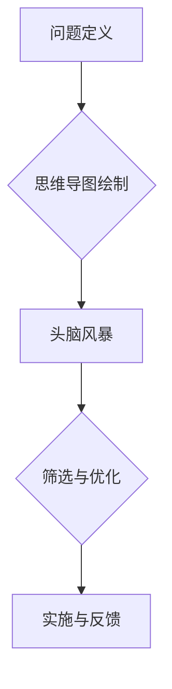
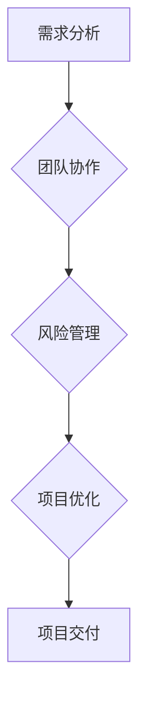
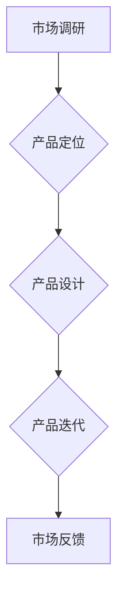
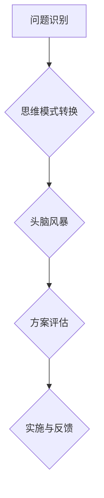

                 


### 标题：《思维体系如何激发企业管理的创新活力：实践与案例分析》

## 引言

在当今快速变化的市场环境中，企业要想保持竞争力，创新管理变得至关重要。而思维体系的构建，则是推动管理创新的重要动力。本文将探讨思维体系对管理创新的推动作用，并通过实际案例进行分析，为企业提供借鉴和启示。

## 面试题库与算法编程题库

### 1. 如何利用思维导图提升团队创新能力？

**题目：** 在团队管理中，如何运用思维导图提升团队的创新能力？

**答案：** 思维导图是一种有效的创新工具，可以帮助团队将复杂问题简化，促进团队成员的思维碰撞。以下是具体实施步骤：

1. **问题定义：** 确定需要解决的问题或挑战。
2. **思维导图绘制：** 围绕问题，使用关键词和连接线构建思维导图，鼓励团队成员自由发挥，不拘泥于传统思路。
3. **头脑风暴：** 根据思维导图展开头脑风暴，寻找创新解决方案。
4. **筛选与优化：** 对头脑风暴的结果进行筛选和优化，确定最具潜力的创新方案。

**实例：**



### 2. 创新思维在项目管理中的应用

**题目：** 在项目管理中，如何应用创新思维来提高项目成功率？

**答案：** 创新思维在项目管理中的应用主要包括以下几个方面：

1. **需求分析：** 采用创新的思维模式，深入挖掘客户需求，提供更贴合客户实际需求的项目方案。
2. **团队协作：** 利用思维导图、鱼骨图等工具，促进团队成员之间的沟通与合作，激发团队创新能力。
3. **风险管理：** 采用头脑风暴法，列举潜在风险，并通过创新思维寻找应对策略。
4. **项目优化：** 在项目执行过程中，不断收集反馈，通过创新思维优化项目流程和方案。

**实例：**



### 3. 如何通过思维训练提高员工的创新意识？

**题目：** 在企业培训中，如何设计课程来提高员工的创新意识？

**答案：** 提高员工的创新意识需要从以下几个方面入手：

1. **思维模式转换：** 通过案例分析和模拟演练，引导员工从传统思维模式向创新思维模式转变。
2. **思维训练课程：** 设计专门的思维训练课程，包括逻辑思维、系统思维、创造性思维等。
3. **实践应用：** 鼓励员工在实际工作中运用创新思维，通过实践不断提高创新能力。
4. **反馈与激励：** 对员工的创新成果给予及时反馈和激励，增强员工的创新动力。

**实例：**

```markdown
# 思维训练课程大纲

## 第一周：逻辑思维训练
- 逻辑思维导图绘制
- 逻辑思维案例分析

## 第二周：系统思维训练
- 系统思维案例分析
- 系统思维工具应用

## 第三周：创造性思维训练
- 头脑风暴技巧
- 创意思维游戏

## 第四周：创新思维综合应用
- 实践项目设计
- 创新成果展示
```

### 4. 创新思维在产品管理中的应用

**题目：** 在产品管理中，如何运用创新思维来提升产品竞争力？

**答案：** 创新思维在产品管理中的应用主要包括以下几个方面：

1. **市场调研：** 采用创新思维模式，深入挖掘用户需求，提供更具市场竞争力的产品方案。
2. **产品定位：** 通过创新思维，为产品找到独特的市场定位，提升产品差异化优势。
3. **产品设计：** 运用创新思维工具，如思维导图、原型设计等，提升产品设计的创新性和用户体验。
4. **产品迭代：** 在产品迭代过程中，持续运用创新思维，不断优化产品功能和用户体验。

**实例：**



### 5. 如何运用创新思维解决复杂问题？

**题目：** 在企业管理中，如何运用创新思维解决复杂问题？

**答案：** 运用创新思维解决复杂问题需要遵循以下步骤：

1. **问题识别：** 明确需要解决的复杂问题。
2. **思维模式转换：** 从传统思维模式转向创新思维模式，采用多元思维策略。
3. **头脑风暴：** 通过头脑风暴法，集思广益，寻找创新解决方案。
4. **方案评估：** 对创新解决方案进行评估和优化，确定最佳方案。
5. **实施与反馈：** 将创新方案付诸实施，并持续收集反馈，优化解决方案。

**实例：**



## 结论

思维体系对管理创新的推动作用不可忽视。通过运用创新思维，企业可以更好地应对市场变化，提升管理水平和竞争力。本文从多个角度分析了创新思维在企业管理中的应用，希望对企业管理者有所启发。

## 参考文献

[1] 陈文君. 创新思维训练教程[M]. 清华大学出版社, 2017.
[2] 王茂军. 创新思维与管理创新[M]. 中国人民大学出版社, 2015.
[3] 郑茂清. 思维导图应用与实践[M]. 电子工业出版社, 2016.

