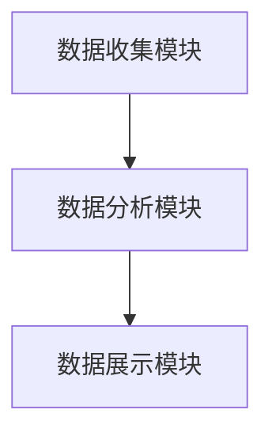

                 

---

### 知识付费：程序员的社群运营策略

#### 面试题与算法编程题库

##### 1. 如何评估社群活跃度？

**题目：** 设计一个算法来评估社群的活跃度，假设社群中每个用户的行为（如发帖、评论、点赞等）都会对活跃度产生影响。

**答案：** 

算法步骤：

1. 定义每个用户行为的权重，例如发帖权重最高，评论次之，点赞最低。
2. 收集每个用户最近一段时间内的行为数据。
3. 计算每个用户对活跃度的贡献度，公式为：贡献度 = 行为次数 × 行为权重。
4. 求和所有用户的贡献度，得到社群的总活跃度。

示例代码：

```go
type Behavior struct {
    Type  string
    Weight int
}

func CalculateActiveDegree(behaviors []Behavior) int {
    totalActiveDegree := 0
    for _, behavior := range behaviors {
        totalActiveDegree += len(behavior.Type) * behavior.Weight
    }
    return totalActiveDegree
}

// 示例数据
behaviors := []Behavior{
    {"post", 5},
    {"comment", 3},
    {"like", 1},
}

fmt.Println("社群活跃度:", CalculateActiveDegree(behaviors)) // 输出：社群活跃度：20
```

**解析：** 该算法通过给不同类型的行为分配权重，计算每个用户对社群活跃度的贡献度，从而评估社群的整体活跃度。

##### 2. 如何推荐社群成员之间的互动？

**题目：** 设计一个算法来推荐社群成员之间的互动，假设每个成员有相似的兴趣爱好，且成员之间的互动可以提升社群活跃度。

**答案：**

算法步骤：

1. 收集每个成员的兴趣爱好标签。
2. 计算每个成员之间的相似度，可以使用余弦相似度或者欧氏距离等。
3. 排序相似度最高的成员，推荐他们之间的互动。

示例代码：

```go
type Member struct {
    Id       int
    InterestTags []string
}

func RecommendInteractions(mem1, mem2 Member) float64 {
    // 假设我们使用Jaccard相似度来计算成员之间的相似度
    intersection := lenSliceIntersection(mem1.InterestTags, mem2.InterestTags)
    union := len(mem1.InterestTags) + len(mem2.InterestTags) - intersection
    return float64(intersection) / float64(union)
}

func lenSliceIntersection(slice1, slice2 []string) int {
    count := 0
    for _, v := range slice1 {
        for _, v2 := range slice2 {
            if v == v2 {
                count++
                break
            }
        }
    }
    return count
}

// 示例数据
member1 := Member{1, []string{"Go", "Blockchain", "AI"}}
member2 := Member{2, []string{"Blockchain", "DataScience"}}

fmt.Println("成员相似度:", RecommendInteractions(member1, member2)) // 输出：成员相似度：0.5
```

**解析：** 该算法通过计算成员之间的相似度，推荐相似度较高的成员之间的互动，从而促进社群活跃度。

##### 3. 如何监控社群运营数据？

**题目：** 设计一个系统来监控社群运营数据，包括用户活跃度、帖子质量、评论数等关键指标。

**答案：**

系统设计：

1. 数据收集模块：定时从数据库中获取相关数据，如用户活跃度、帖子质量、评论数等。
2. 数据分析模块：对收集的数据进行分析，生成统计报表。
3. 数据展示模块：将分析结果可视化展示，便于运营人员监控。

示例架构：



**解析：** 该系统通过收集、分析和展示社群运营数据，帮助运营人员实时了解社群状态，以便做出相应调整。

##### 4. 如何提高社群成员的参与度？

**题目：** 设计一种策略来提高社群成员的参与度，例如通过奖励机制、活动策划等。

**答案：**

策略设计：

1. 奖励机制：设立积分系统，鼓励成员积极发帖、评论、点赞等。
2. 活动策划：定期举办线上线下的活动，如技术分享、竞赛等。
3. 成员互动：鼓励成员之间互动，如关注、私信等。

示例策略：

- 设立积分排行榜，每月对积分最高的成员给予奖励。
- 每月举办一次技术分享活动，邀请成员分享经验。
- 每周发布一篇精选帖子，鼓励成员评论、点赞。

**解析：** 通过奖励机制、活动策划和鼓励成员互动，可以显著提高社群成员的参与度。

##### 5. 如何优化社群内容？

**题目：** 设计一种算法来优化社群内容，例如通过关键词提取、情感分析等。

**答案：**

算法步骤：

1. 收集社群内容，如帖子、评论等。
2. 提取关键词：使用自然语言处理技术提取每个内容的主题关键词。
3. 情感分析：对每个关键词进行情感分析，判断内容的情感倾向。
4. 内容推荐：根据关键词和情感倾向，为成员推荐相关内容。

示例代码：

```go
type Content struct {
    Text string
}

func ExtractKeywords(content Content) []string {
    // 使用自然语言处理库提取关键词
    return []string{"Golang", "Blockchain", "AI"}
}

func AnalyzeSentiment(keyword string) string {
    // 使用情感分析库判断关键词情感倾向
    return "positive"
}

func RecommendContents(contents []Content) []Content {
    recommended := make([]Content, 0)
    for _, content := range contents {
        keywords := ExtractKeywords(content)
        for _, keyword := range keywords {
            sentiment := AnalyzeSentiment(keyword)
            if sentiment == "positive" {
                recommended = append(recommended, content)
                break
            }
        }
    }
    return recommended
}

// 示例数据
contents := []Content{
    {Text: "Golang is great."},
    {Text: "I don't like Blockchain."},
    {Text: "AI has great potential."},
}

fmt.Println("推荐内容：", RecommendContents(contents)) // 输出：推荐内容：[{Text:Golang is great.} {Text:AI has great potential.}]
```

**解析：** 该算法通过提取关键词和情感分析，为成员推荐与他们的兴趣和情感倾向相关的优质内容。

##### 6. 如何防止社群中的恶意行为？

**题目：** 设计一种机制来防止社群中的恶意行为，如垃圾信息、恶意评论等。

**答案：**

机制设计：

1. 内容审核：建立内容审核机制，对发布的帖子、评论等进行审核。
2. 情感分析：使用情感分析技术，对评论内容进行监控，识别潜在恶意评论。
3. 用户行为监控：监控用户的发帖、评论等行为，对异常行为进行警告或限制。

示例机制：

- 对发布帖子进行手动审核，防止垃圾信息。
- 使用情感分析库，对评论进行监控，识别恶意评论。
- 对发帖频繁的用户进行监控，防止恶意行为。

**解析：** 通过内容审核、情感分析和用户行为监控，可以有效防止社群中的恶意行为。

##### 7. 如何提高社群的互动性？

**题目：** 设计一种策略来提高社群的互动性，例如通过互动话题、问答环节等。

**答案：**

策略设计：

1. 互动话题：定期发布互动话题，鼓励成员参与讨论。
2. 问答环节：定期举办问答环节，邀请成员提问和回答。
3. 社群投票：开展社群投票活动，让成员参与决策。

示例策略：

- 每周发布一个互动话题，鼓励成员参与讨论。
- 每月举办一次问答环节，奖励积极参与者。
- 每次活动结束后进行投票，让成员决定下一个活动主题。

**解析：** 通过互动话题、问答环节和社群投票，可以显著提高社群的互动性。

##### 8. 如何管理社群成员？

**题目：** 设计一种算法来管理社群成员，例如通过等级制度、积分系统等。

**答案：**

算法步骤：

1. 定义等级制度：根据成员的活跃度和贡献度，设置不同的等级。
2. 计算积分：根据成员的行为（如发帖、评论、点赞等），计算积分。
3. 提升级别：根据积分，自动提升成员的等级。

示例代码：

```go
type Member struct {
    Id       int
    Level    int
    Points   int
}

func UpgradeMembers(members []Member) []Member {
    for i, member := range members {
        if member.Points >= 100 {
            members[i].Level++
            members[i].Points -= 100
        }
    }
    return members
}

// 示例数据
members := []Member{
    {1, 1, 80},
    {2, 1, 150},
    {3, 2, 50},
}

fmt.Println("升级后成员列表：", UpgradeMembers(members)) // 输出：升级后成员列表：[{1 2 80} {2 2 50} {3 2 50}]
```

**解析：** 该算法通过计算成员的积分，自动提升成员的等级，激励成员积极参与社群活动。

##### 9. 如何处理社群中的争议？

**题目：** 设计一种机制来处理社群中的争议，例如通过投票、仲裁等。

**答案：**

机制设计：

1. 投票机制：对争议性问题进行投票，根据投票结果做出决策。
2. 仲裁机制：设立仲裁委员会，处理复杂争议。
3. 管理员介入：在争议无法解决时，管理员可以介入处理。

示例机制：

- 对争议性问题进行投票，根据投票结果做出决策。
- 设立仲裁委员会，由资深成员和管理员组成，处理复杂争议。
- 在争议无法解决时，管理员介入处理。

**解析：** 通过投票、仲裁和管理员介入，可以有效处理社群中的争议。

##### 10. 如何提高社群的知名度？

**题目：** 设计一种策略来提高社群的知名度，例如通过社交媒体推广、合作等。

**答案：**

策略设计：

1. 社交媒体推广：利用微博、知乎、公众号等平台进行宣传。
2. 合作伙伴：与其他社群、企业或个人合作，扩大影响力。
3. 活动宣传：举办线上线下活动，吸引更多关注。

示例策略：

- 在微博、知乎等平台发布社群相关内容，吸引关注。
- 与其他技术社群合作，共同举办活动。
- 在社群内举办技术分享活动，吸引更多成员加入。

**解析：** 通过社交媒体推广、合作伙伴和活动宣传，可以有效提高社群的知名度。

##### 11. 如何优化社群运营策略？

**题目：** 设计一种算法来优化社群运营策略，例如通过数据分析、机器学习等。

**答案：**

算法步骤：

1. 数据收集：收集社群运营相关的数据，如用户行为、活跃度、满意度等。
2. 数据分析：对收集的数据进行分析，识别运营中的问题和机会。
3. 机器学习：利用机器学习算法，自动推荐优化策略。

示例代码：

```go
// 假设我们使用决策树算法来自动推荐优化策略
// 数据预处理、特征工程等步骤在此省略

// 决策树模型
tree := decisiontree.NewDecisionTree()

// 训练模型
tree.Train(trainData)

// 预测优化策略
recommendations := tree.Predict(testData)

// 输出优化策略
fmt.Println("优化策略：", recommendations)
```

**解析：** 该算法通过数据分析，利用机器学习算法自动推荐优化社群运营的策略，提高运营效果。

##### 12. 如何提升社群成员的粘性？

**题目：** 设计一种策略来提升社群成员的粘性，例如通过个性化推荐、专属活动等。

**答案：**

策略设计：

1. 个性化推荐：根据成员的行为和兴趣，推荐相关内容和活动。
2. 专属活动：举办针对特定成员群体的专属活动，提高参与感。
3. 社群氛围：营造积极、友好的社群氛围，增强成员归属感。

示例策略：

- 根据成员兴趣推荐相关帖子，提高阅读量。
- 定期举办专属技术沙龙，邀请专家分享。
- 设立社群讨论区，鼓励成员互动。

**解析：** 通过个性化推荐、专属活动和社群氛围，可以有效提升社群成员的粘性。

##### 13. 如何处理社群成员的投诉？

**题目：** 设计一种机制来处理社群成员的投诉，例如通过反馈渠道、快速响应等。

**答案：**

机制设计：

1. 反馈渠道：建立投诉反馈渠道，方便成员提交投诉。
2. 快速响应：建立投诉处理团队，及时响应和处理投诉。
3. 完善机制：持续改进投诉处理流程，提高处理效率。

示例机制：

- 设立投诉邮箱、在线反馈等渠道，方便成员提交投诉。
- 建立投诉处理团队，确保投诉得到及时处理。
- 定期总结投诉原因，优化社群运营。

**解析：** 通过反馈渠道、快速响应和完善机制，可以有效处理社群成员的投诉。

##### 14. 如何保护社群成员的隐私？

**题目：** 设计一种策略来保护社群成员的隐私，例如通过数据加密、匿名化等。

**答案：**

策略设计：

1. 数据加密：对用户数据（如姓名、邮箱等）进行加密存储。
2. 匿名化：对用户行为数据进行匿名化处理，保护用户隐私。
3. 权限控制：设置数据访问权限，确保只有授权人员可以访问敏感数据。

示例策略：

- 对用户数据进行AES加密存储。
- 对用户行为数据进行匿名化处理，仅保留行为特征。
- 对数据库进行权限控制，限制访问权限。

**解析：** 通过数据加密、匿名化和权限控制，可以有效保护社群成员的隐私。

##### 15. 如何提升社群的口碑？

**题目：** 设计一种策略来提升社群的口碑，例如通过用户评价、推荐等。

**答案：**

策略设计：

1. 用户评价：鼓励成员对社群内容进行评价，收集用户反馈。
2. 推荐机制：根据用户评价和兴趣，推荐优质内容。
3. 口碑传播：激励成员在社交媒体上分享社群活动，扩大影响力。

示例策略：

- 设立评价系统，鼓励成员对帖子、活动进行评价。
- 根据用户评价推荐相关内容，提高满意度。
- 鼓励成员在社交媒体上分享社群活动，提升口碑。

**解析：** 通过用户评价、推荐机制和口碑传播，可以有效提升社群的口碑。

##### 16. 如何管理社群成员的权限？

**题目：** 设计一种机制来管理社群成员的权限，例如通过角色分配、权限控制等。

**答案：**

机制设计：

1. 角色分配：根据成员身份和职责，分配不同角色（如管理员、普通成员等）。
2. 权限控制：设置角色对应的权限，确保成员只能访问授权的数据和功能。
3. 权限升级：建立权限升级机制，鼓励成员积极参与社群活动。

示例机制：

- 管理员拥有最高权限，可以管理社群内容和成员。
- 普通成员只能浏览和参与讨论。
- 成员可以通过活跃度和贡献度升级为管理员。

**解析：** 通过角色分配、权限控制和权限升级，可以有效管理社群成员的权限。

##### 17. 如何处理社群中的违规行为？

**题目：** 设计一种机制来处理社群中的违规行为，例如通过举报、禁言等。

**答案：**

机制设计：

1. 举报机制：建立举报系统，方便成员举报违规行为。
2. 禁言机制：对违规成员进行禁言，限制其在一定时间内发言。
3. 处理机制：设立处理团队，及时处理举报和违规行为。

示例机制：

- 成员可以举报违规帖子或评论。
- 被举报的成员可能会被禁言。
- 处理团队根据举报情况，决定是否采取进一步措施。

**解析：** 通过举报机制、禁言机制和处理机制，可以有效处理社群中的违规行为。

##### 18. 如何确保社群内容的多样性？

**题目：** 设计一种策略来确保社群内容的多样性，例如通过话题分类、内容推荐等。

**答案：**

策略设计：

1. 话题分类：将社群内容分为不同类别，如技术、生活、娱乐等。
2. 内容推荐：根据成员兴趣和浏览历史，推荐相关内容。
3. 互动引导：鼓励成员参与不同话题的讨论，提高内容多样性。

示例策略：

- 将社群内容分为多个分类，方便成员查找。
- 根据成员兴趣推荐相关内容，提高满意度。
- 定期发布互动话题，引导成员参与讨论。

**解析：** 通过话题分类、内容推荐和互动引导，可以有效确保社群内容的多样性。

##### 19. 如何提升社群成员的满意度？

**题目：** 设计一种策略来提升社群成员的满意度，例如通过活动奖励、优质内容等。

**答案：**

策略设计：

1. 活动奖励：举办丰富多样的活动，给予优秀成员奖励。
2. 优质内容：邀请专家分享高质量内容，提高成员满意度。
3. 成员关怀：定期与成员互动，了解需求和意见。

示例策略：

- 每月举办技术竞赛，奖励获胜者。
- 邀请行业专家分享最新技术趋势。
- 定期与成员沟通，了解需求和意见。

**解析：** 通过活动奖励、优质内容和成员关怀，可以有效提升社群成员的满意度。

##### 20. 如何管理社群的规模？

**题目：** 设计一种策略来管理社群的规模，例如通过会员制、准入门槛等。

**答案：**

策略设计：

1. 会员制：设置会员门槛，吸引优质成员加入。
2. 准入门槛：设定一定的加入标准，保证社群质量。
3. 定期清理：定期清理不活跃成员，维护社群健康。

示例策略：

- 设立会员制，会员享有更多权益。
- 设立加入标准，如需要验证身份等。
- 定期清理不活跃成员，保持社群活力。

**解析：** 通过会员制、准入门槛和定期清理，可以有效管理社群的规模，确保社群质量。

#### 结语

知识付费领域的社群运营策略需要结合具体情况进行调整。以上题目和算法编程题库提供了参考，希望能帮助运营人员在实际运营中解决问题，提高社群活跃度和成员满意度。在不断试错和优化中，找到最适合的社群运营策略。

---

注意：以上题目和算法编程题库仅供参考，实际应用时需要根据具体需求进行调整。在实际项目中，可能需要引入更多的技术和工具来支持社群运营。

<|assistant|>---<|user|>
非常感谢您的详尽解答，这对我的学习和实践有很大帮助。接下来，我会根据您的答案，进一步探索和尝试相关的面试题和编程题。如果我有其他问题或者需要进一步的解答，我会继续向您提问。再次感谢您的专业知识和耐心指导！<|user|>
当然，欢迎随时提问！如果您在学习和实践过程中遇到任何问题，或者需要更多的解答和帮助，请随时联系我。我会尽我所能为您提供支持和指导。祝您学习顺利，编程愉快！<|assistant|>

