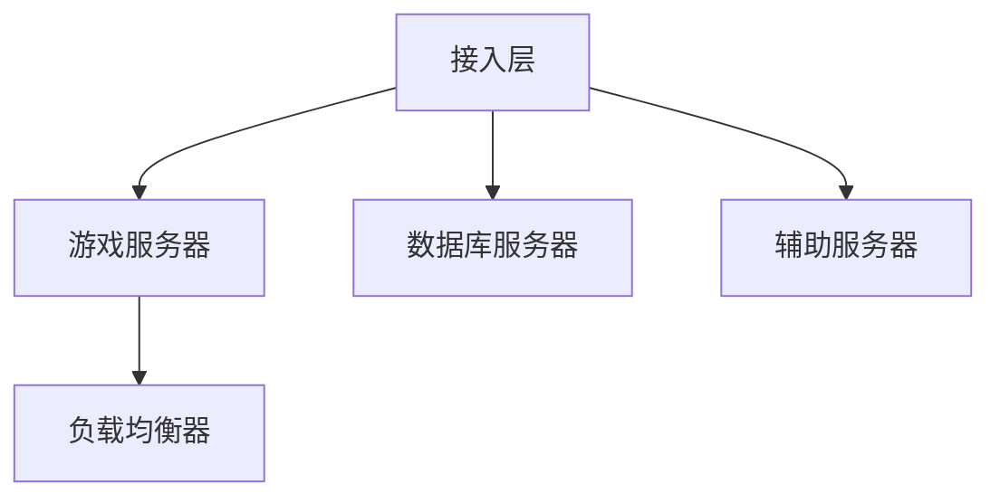
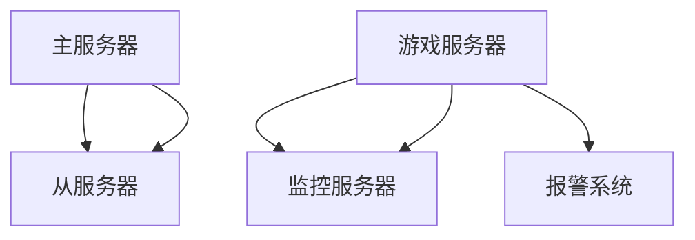
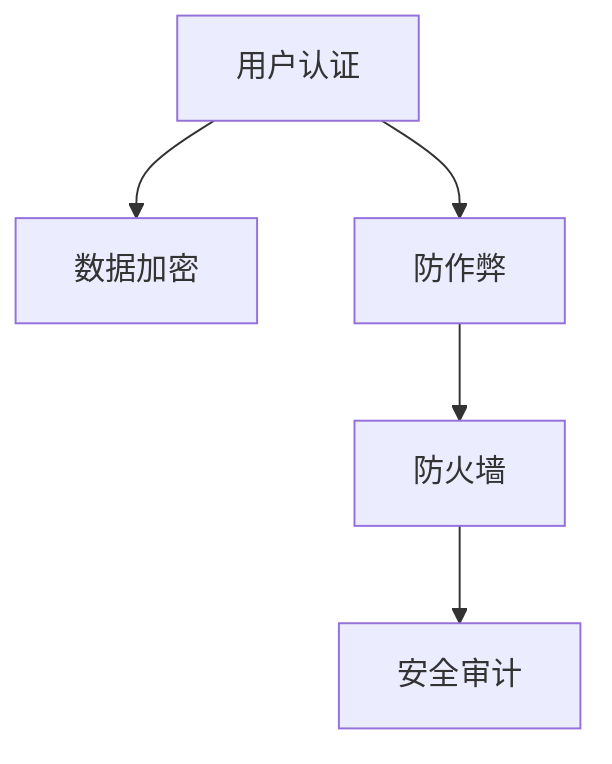
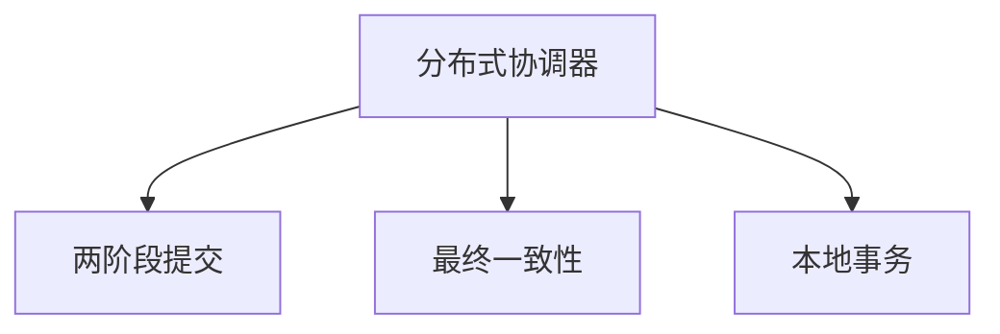
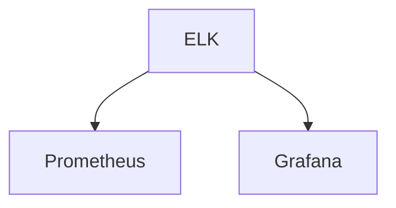
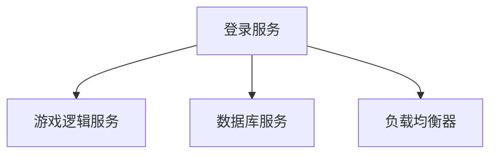
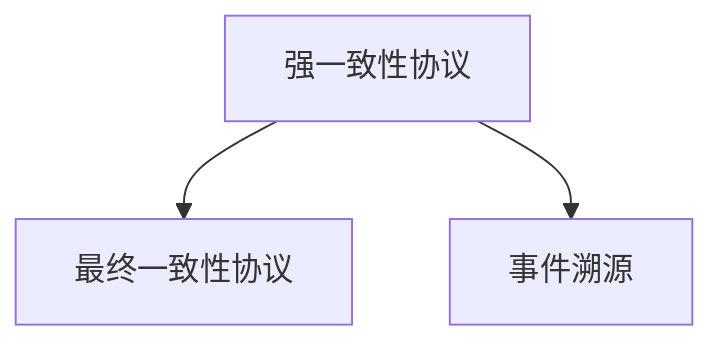

                 

### 腾讯2024校招游戏服务器开发工程师面试题解析：经典高频问题及算法编程题详解

#### 1. 游戏服务器性能优化策略

**题目：** 请列举至少三种游戏服务器性能优化的策略。

**答案：**

- **网络优化：** 采用高效的序列化和反序列化机制，减少数据包大小；使用二进制协议代替文本协议；进行网络压缩。
- **并发处理：** 利用多线程或协程实现并发处理，减少等待时间；利用异步IO，减少阻塞；使用线程池或协程池，避免频繁创建和销毁线程。
- **缓存机制：** 使用缓存减少数据库访问；使用本地缓存，如LRU缓存、内存缓存等。
- **负载均衡：** 使用负载均衡器，如Nginx、LVS等，将请求分发到多个服务器。

**举例：**

```go
// Go语言实现简单线程池
type ThreadPool struct {
    workers []*Worker
    taskQueue chan *Task
    done chan bool
}

type Worker struct {
    id int
    stop chan bool
}

type Task func()

func NewThreadPool(size int) *ThreadPool {
    pool := &ThreadPool{
        workers:  make([]*Worker, size),
        taskQueue: make(chan *Task),
        done:     make(chan bool),
    }

    for i := 0; i < size; i++ {
        pool.workers[i] = &Worker{
            id:        i,
            stop:      make(chan bool),
        }
    }

    for i := 0; i < size; i++ {
        go pool.worker(pool.workers[i])
    }

    return pool
}

func (pool *ThreadPool) worker(worker *Worker) {
    for {
        select {
        case task := <-pool.taskQueue:
            task()
        case <-worker.stop:
            return
        }
    }
}

func (pool *ThreadPool) Submit(task Task) {
    pool.taskQueue <- task
}

func (pool *ThreadPool) Shutdown() {
    for _, worker := range pool.workers {
        worker.stop <- true
    }

    close(pool.done)
}

// 使用示例
func main() {
    pool := NewThreadPool(10)

    for i := 0; i < 100; i++ {
        pool.Submit(func() {
            fmt.Println("处理任务")
        })
    }

    <-pool.done
}
```

**解析：** 通过线程池实现，提交任务到任务队列，多个线程轮询任务队列，执行任务，提高并发处理能力。

#### 2. 游戏服务器架构设计

**题目：** 请描述游戏服务器的基本架构，并简要说明各个部分的作用。

**答案：**

- **接入层（Login Server）：** 负责用户登录验证，将用户认证信息转发到其他服务器。
- **游戏服务器（Game Server）：** 负责处理游戏逻辑，如角色创建、移动、战斗等。
- **数据库服务器（Database Server）：** 负责存储游戏数据，如角色信息、游戏数据等。
- **辅助服务器（Auxiliary Server）：** 负责处理特定功能，如排行榜、邮件系统等。
- **负载均衡器（Load Balancer）：** 负责将用户请求分配到不同的游戏服务器。

**举例：**



**解析：** 通过接入层接收用户请求，游戏服务器处理游戏逻辑，数据库服务器存储数据，辅助服务器处理特定功能，负载均衡器分配请求，形成完整的游戏服务器架构。

#### 3. 游戏服务器高可用性设计

**题目：** 请列举至少三种游戏服务器高可用性设计的方法。

**答案：**

- **主从复制：** 使用主从复制，保证数据库服务器的高可用性，当主服务器故障时，从服务器可以自动切换为主服务器。
- **集群部署：** 将游戏服务器部署在多个服务器上，实现负载均衡和故障转移。
- **备份和恢复：** 定期备份游戏数据，发生故障时，可以快速恢复。
- **监控和报警：** 实时监控服务器状态，发现故障时，及时报警并进行处理。

**举例：**



**解析：** 通过主从复制、集群部署、备份和恢复、监控和报警，实现游戏服务器的高可用性。

#### 4. 游戏服务器安全性设计

**题目：** 请描述游戏服务器安全性设计的关键点。

**答案：**

- **用户认证：** 实现用户登录验证，防止未授权访问。
- **数据加密：** 对敏感数据进行加密，如用户密码、游戏数据等。
- **防作弊：** 采用多种手段防止作弊，如验证码、反作弊系统等。
- **防火墙：** 设置防火墙规则，限制非法访问。
- **安全审计：** 定期进行安全审计，发现安全隐患及时处理。

**举例：**



**解析：** 通过用户认证、数据加密、防作弊、防火墙和安全审计，确保游戏服务器安全。

#### 5. 游戏服务器缓存策略

**题目：** 请列举至少三种游戏服务器缓存策略。

**答案：**

- **内存缓存：** 将经常访问的数据存储在内存中，提高访问速度。
- **分布式缓存：** 将缓存存储在分布式系统中，提高缓存的可扩展性和可用性。
- **本地缓存：** 将缓存存储在本地文件或内存中，减轻数据库压力。

**举例：**

```go
// Go语言实现简单内存缓存
type MemoryCache struct {
    cache map[string]interface{}
    maxAge time.Duration
}

func NewMemoryCache(maxAge time.Duration) *MemoryCache {
    return &MemoryCache{
        cache:  make(map[string]interface{}),
        maxAge: maxAge,
    }
}

func (c *MemoryCache) Get(key string) (interface{}, bool) {
    item, exists := c.cache[key]
    if !exists {
        return nil, false
    }
    return item, true
}

func (c *MemoryCache) Set(key string, value interface{}) {
    c.cache[key] = value
    go func() {
        time.Sleep(c.maxAge)
        delete(c.cache, key)
    }()
}

func main() {
    cache := NewMemoryCache(10 * time.Minute)

    cache.Set("user", &User{
        ID:   1,
        Name: "Alice",
    })

    user, _ := cache.Get("user")
    fmt.Println(user.(*User).Name)
}
```

**解析：** 通过内存缓存、分布式缓存和本地缓存，提高游戏服务器数据访问速度和系统性能。

#### 6. 游戏服务器分布式事务处理

**题目：** 请描述游戏服务器分布式事务处理的方案。

**答案：**

- **两阶段提交（2PC）：** 通过分布式协调器实现两阶段提交，保证分布式事务的原子性。
- **最终一致性：** 使用分布式缓存、消息队列等实现最终一致性，保证数据的一致性。
- **本地事务：** 将分布式事务拆分为多个本地事务，每个本地事务保证原子性，最终实现分布式事务。

**举例：**



**解析：** 通过分布式协调器、两阶段提交、最终一致性和本地事务，实现游戏服务器分布式事务处理。

#### 7. 游戏服务器网络优化

**题目：** 请列举至少三种游戏服务器网络优化策略。

**答案：**

- **数据压缩：** 对传输数据进行压缩，减少网络开销。
- **长连接：** 采用长连接，减少建立连接和断开连接的开销。
- **多线程：** 使用多线程，提高网络处理能力。
- **负载均衡：** 使用负载均衡器，将请求分发到多个服务器，提高网络吞吐量。

**举例：**

```go
// Go语言实现长连接
func Connect(addr string) (*net.TCPConn, error) {
    tcpConn, err := net.Dial("tcp", addr)
    if err != nil {
        return nil, err
    }

    tcpConn.SetKeepAlive(true)
    tcpConn.SetKeepAlivePeriod(time.Minute)

    return tcpConn, nil
}

func main() {
    conn, err := Connect("127.0.0.1:8080")
    if err != nil {
        log.Fatal(err)
    }

    conn.Write([]byte("Hello, World!"))
    conn.Close()
}
```

**解析：** 通过数据压缩、长连接、多线程和负载均衡，提高游戏服务器网络性能。

#### 8. 游戏服务器监控与日志

**题目：** 请描述游戏服务器监控与日志的重要性，并列举至少三种监控与日志工具。

**答案：**

- **监控重要性：** 监控可以帮助及时发现服务器故障、性能瓶颈等问题，提高服务器可用性和稳定性。
- **日志工具：** 
  - **ELK（Elasticsearch、Logstash、Kibana）：** 用于收集、存储、分析和展示服务器日志。
  - **Prometheus：** 用于监控服务器性能指标，如CPU、内存、网络等。
  - **Grafana：** 用于可视化Prometheus数据。

**举例：**



**解析：** 通过监控和日志工具，实现游戏服务器性能监控和问题排查。

#### 9. 游戏服务器内存管理

**题目：** 请描述游戏服务器内存管理的重要性，并列举至少三种内存管理策略。

**答案：**

- **内存管理重要性：** 内存管理对于游戏服务器性能和稳定性至关重要，合理的内存管理可以减少内存泄漏和内存溢出。
- **内存管理策略：**
  - **内存池：** 使用内存池管理内存，减少内存分配和释放的开销。
  - **对象池：** 使用对象池管理对象，减少对象的创建和销毁。
  - **内存碎片化：** 定期进行内存碎片化，优化内存分配。

**举例：**

```go
// Go语言实现简单内存池
type MemoryPool struct {
    size   int
    capacity int
    buf   []byte
}

func NewMemoryPool(size, capacity int) *MemoryPool {
    return &MemoryPool{
        size:   size,
        capacity: capacity,
        buf:   make([]byte, capacity),
    }
}

func (p *MemoryPool) Allocate() *byte {
    if len(p.buf) < p.size {
        return nil
    }
    result := p.buf[len(p.buf)-p.size:]
    p.buf = p.buf[:len(p.buf)-p.size]
    return &result[0]
}

func (p *MemoryPool) Release(b *byte) {
    p.buf = append(p.buf, *b...)
}

func main() {
    pool := NewMemoryPool(4, 16)

    b := pool.Allocate()
    if b != nil {
        *b = 1
        fmt.Println(*b)
    }

    pool.Release(b)
}
```

**解析：** 通过内存池、对象池和内存碎片化，实现游戏服务器内存管理。

#### 10. 游戏服务器负载测试

**题目：** 请描述游戏服务器负载测试的重要性，并列举至少三种负载测试工具。

**答案：**

- **负载测试重要性：** 负载测试可以帮助评估游戏服务器的性能和稳定性，确保服务器在高并发场景下的表现。
- **负载测试工具：**
  - **Apache JMeter：** 用于模拟大量用户请求，评估服务器性能。
  - **Gatling：** 用于高性能负载测试，支持多种协议。
  - **loadtest：** 用于简单快速的负载测试。

**举例：**

```shell
# Apache JMeter测试示例
jmeter -n -t test_plan.jmx -l result.jtl

# Gatling测试示例
gatling.sh -s path/to/scenario
```

**解析：** 通过负载测试工具，实现游戏服务器性能评估。

#### 11. 游戏服务器性能调优

**题目：** 请列举至少三种游戏服务器性能调优的方法。

**答案：**

- **数据库优化：** 对数据库进行索引优化、查询优化、分库分表等。
- **网络优化：** 对网络进行带宽优化、延迟优化、丢包优化等。
- **代码优化：** 对代码进行算法优化、数据结构优化、并行处理等。

**举例：**

```go
// Go语言代码优化示例
func Sum(s []int) int {
    sum := 0
    for _, v := range s {
        sum += v
    }
    return sum
}

// 使用并发处理优化Sum函数
func SumConcurrent(s []int) int {
    var sum int
    var wg sync.WaitGroup
    wg.Add(len(s))

    for _, v := range s {
        go func(value int) {
            defer wg.Done()
            sum += value
        }(v)
    }

    wg.Wait()
    return sum
}
```

**解析：** 通过数据库优化、网络优化和代码优化，提高游戏服务器性能。

#### 12. 游戏服务器分布式架构设计

**题目：** 请描述游戏服务器分布式架构设计的关键点。

**答案：**

- **服务拆分：** 将游戏服务器拆分为多个独立的服务，如登录服务、游戏逻辑服务、数据库服务等。
- **服务发现：** 实现服务发现机制，方便服务之间进行通信。
- **数据一致：** 保证分布式系统中数据的一致性，如使用分布式事务、最终一致性等。
- **负载均衡：** 使用负载均衡器，将请求分发到不同的服务器。

**举例：**



**解析：** 通过服务拆分、服务发现、数据一致和负载均衡，实现游戏服务器分布式架构。

#### 13. 游戏服务器缓存一致性

**题目：** 请描述游戏服务器缓存一致性的解决方案。

**答案：**

- **缓存一致性协议：** 采用缓存一致性协议，如MESI、MOESI等，保证缓存的一致性。
- **分布式锁：** 使用分布式锁，保证对共享数据的并发访问一致性。
- **版本号：** 采用版本号，每次更新数据时，增加版本号，确保缓存数据的一致性。

**举例：**

```go
// Go语言实现简单分布式锁
type DistributedLock struct {
    lock     sync.Mutex
    resource string
}

func (l *DistributedLock) Lock() {
    l.lock.Lock()
    l.resource = "locked"
}

func (l *DistributedLock) Unlock() {
    l.lock.Unlock()
    l.resource = "unlocked"
}

func main() {
    lock := DistributedLock{}

    lock.Lock()
    fmt.Println("Lock acquired:", lock.resource)

    // 执行共享操作

    lock.Unlock()
    fmt.Println("Lock released:", lock.resource)
}
```

**解析：** 通过缓存一致性协议、分布式锁和版本号，实现游戏服务器缓存一致性。

#### 14. 游戏服务器分布式事务管理

**题目：** 请描述游戏服务器分布式事务管理的解决方案。

**答案：**

- **分布式事务框架：** 使用分布式事务框架，如Seata、TCC等，实现分布式事务。
- **本地事务：** 将分布式事务拆分为多个本地事务，每个本地事务保证原子性。
- **补偿事务：** 使用补偿事务，实现分布式事务的最终一致性。

**举例：**

```go
// Go语言实现TCC分布式事务
type TCCService struct {
    localService *LocalService
    remoteService *RemoteService
}

func (s *TCCService) Action() error {
    // 对本地服务执行业务操作
    if err := s.localService.DoBusiness(); err != nil {
        return err
    }

    // 对远程服务执行业务操作
    if err := s.remoteService.DoBusiness(); err != nil {
        // 如果远程服务失败，执行本地服务的回滚操作
        s.localService.RollbackBusiness()
        return err
    }

    return nil
}

func (s *TCCService) Confirm() error {
    // 对远程服务执行确认操作
    if err := s.remoteService.ConfirmBusiness(); err != nil {
        // 如果远程服务确认失败，执行本地服务的回滚操作
        s.localService.RollbackBusiness()
        return err
    }

    return nil
}

func (s *TCCService) Cancel() error {
    // 对远程服务执行取消操作
    if err := s.remoteService.CancelBusiness(); err != nil {
        // 如果远程服务取消失败，执行本地服务的回滚操作
        s.localService.RollbackBusiness()
        return err
    }

    return nil
}
```

**解析：** 通过分布式事务框架、本地事务和补偿事务，实现游戏服务器分布式事务管理。

#### 15. 游戏服务器数据一致性保证

**题目：** 请描述游戏服务器数据一致性保证的方案。

**答案：**

- **强一致性：** 采用强一致性协议，如两阶段提交、最终一致性等，保证数据的一致性。
- **最终一致性：** 通过分布式缓存、消息队列等实现最终一致性，保证数据的一致性。
- **事件溯源：** 使用事件溯源，记录数据的变更历史，保证数据的一致性。

**举例：**



**解析：** 通过强一致性协议、最终一致性协议和事件溯源，实现游戏服务器数据一致性保证。

#### 16. 游戏服务器数据库设计

**题目：** 请描述游戏服务器数据库设计的关键点。

**答案：**

- **数据模型：** 设计合适的数据模型，如关系型数据库、NoSQL数据库等。
- **索引设计：** 设计合理的索引，提高查询性能。
- **分库分表：** 对海量数据进行分库分表，提高系统性能。
- **读写分离：** 实现读写分离，提高系统可用性和性能。

**举例：**

```sql
-- MySQL关系型数据库示例
CREATE TABLE users (
    id INT PRIMARY KEY,
    name VARCHAR(100),
    age INT,
    created_at DATETIME
);

CREATE INDEX idx_users_name ON users (name);

-- MongoDB NoSQL数据库示例
db.users.insert({
    _id: ObjectId("5f659b98e8fada9a3e000001"),
    name: "Alice",
    age: 30,
    created_at: ISODate("2021-01-01T00:00:00Z")
});
```

**解析：** 通过数据模型、索引设计、分库分表和读写分离，实现游戏服务器数据库设计。

#### 17. 游戏服务器日志管理

**题目：** 请描述游戏服务器日志管理的重要性，并列举至少三种日志管理工具。

**答案：**

- **日志管理重要性：** 日志管理对于游戏服务器问题排查、性能优化和安全性保障至关重要。
- **日志管理工具：**
  - **ELK（Elasticsearch、Logstash、Kibana）：** 用于收集、存储、分析和展示服务器日志。
  - **GrayLog：** 用于收集、存储、分析和展示服务器日志。
  - **Log4j：** 用于日志收集和输出。

**举例：**

```java
// Log4j日志收集示例
import org.apache.log4j.Logger;

public class LogExample {
    private static final Logger logger = Logger.getLogger(LogExample.class);

    public void logMessage() {
        logger.info("This is an info message");
        logger.error("This is an error message");
    }
}
```

**解析：** 通过日志管理工具，实现游戏服务器日志收集、存储和分析。

#### 18. 游戏服务器安全性设计

**题目：** 请描述游戏服务器安全性设计的关键点。

**答案：**

- **用户认证：** 实现用户登录验证，防止未授权访问。
- **数据加密：** 对敏感数据进行加密，如用户密码、游戏数据等。
- **防作弊：** 采用多种手段防止作弊，如验证码、反作弊系统等。
- **防火墙：** 设置防火墙规则，限制非法访问。
- **安全审计：** 定期进行安全审计，发现安全隐患及时处理。

**举例：**

```java
// Java实现MD5加密
import java.security.MessageDigest;
import java.security.NoSuchAlgorithmException;

public class MD5Util {
    public static String encrypt(String str) {
        try {
            MessageDigest md = MessageDigest.getInstance("MD5");
            byte[] digest = md.digest(str.getBytes());
            StringBuilder sb = new StringBuilder();
            for (byte b : digest) {
                sb.append(String.format("%02x", b));
            }
            return sb.toString();
        } catch (NoSuchAlgorithmException e) {
            e.printStackTrace();
            return null;
        }
    }

    public static void main(String[] args) {
        System.out.println(encrypt("password"));
    }
}
```

**解析：** 通过用户认证、数据加密、防作弊、防火墙和安全审计，实现游戏服务器安全性设计。

#### 19. 游戏服务器消息队列使用

**题目：** 请描述游戏服务器消息队列的使用场景和优势。

**答案：**

- **使用场景：** 
  - **异步处理：** 用于处理耗时的操作，如邮件发送、任务调度等。
  - **解耦：** 用于实现服务之间的解耦，如用户服务、订单服务、库存服务等。
  - **削峰填谷：** 用于应对突发流量，如活动高峰期的请求处理。

- **优势：**
  - **异步处理：** 提高系统性能，减少请求响应时间。
  - **解耦：** 降低服务之间的依赖，提高系统可扩展性。
  - **削峰填谷：** 平衡系统负载，提高系统稳定性。

**举例：**

```java
// Java使用RabbitMQ消息队列
import com.rabbitmq.client.*;

public class RabbitMQExample {
    public static void main(String[] args) {
        try {
            ConnectionFactory factory = new ConnectionFactory();
            factory.setHost("localhost");
            Connection connection = factory.newConnection();
            Channel channel = connection.createChannel();

            String queueName = "my_queue";
            channel.queueDeclare(queueName, false, false, false, null);

            String message = "Hello, RabbitMQ!";
            channel.basicPublish("", queueName, null, message.getBytes());

            System.out.println(" [x] Sent '" + message + "'");

            channel.close();
            connection.close();
        } catch (IOException | TimeoutException e) {
            e.printStackTrace();
        }
    }
}
```

**解析：** 通过消息队列，实现游戏服务器异步处理、解耦和削峰填谷。

#### 20. 游戏服务器分布式锁

**题目：** 请描述游戏服务器分布式锁的解决方案。

**答案：**

- **基于数据库的分布式锁：** 使用数据库行锁，保证数据的唯一性。
- **基于Redis的分布式锁：** 使用Redis的SETNX命令，实现分布式锁。
- **基于ZooKeeper的分布式锁：** 使用ZooKeeper的锁机制，实现分布式锁。

**举例：**

```go
// Go语言实现基于Redis的分布式锁
package main

import (
    "github.com/go-redis/redis/v8"
    "time"
)

var redisClient *redis.Client

func init() {
    redisClient = redis.NewClient(&redis.Options{
        Addr:     "localhost:6379",
        Password: "",
        DB:       0,
    })
}

func lock(key string, ttl time.Duration) bool {
    return redisClient.SetNX(key, "1", ttl).Val()
}

func unlock(key string) bool {
    return redisClient.Expire(key, 0).Val()
}

func main() {
    key := "my_lock"
    ttl := 10 * time.Second

    if lock(key, ttl) {
        fmt.Println("Lock acquired")
        // 执行业务逻辑

        unlock(key)
    } else {
        fmt.Println("Lock not acquired")
    }
}
```

**解析：** 通过基于数据库、Redis和ZooKeeper的分布式锁，实现游戏服务器分布式锁。

#### 21. 游戏服务器性能监控

**题目：** 请描述游戏服务器性能监控的重要性，并列举至少三种性能监控工具。

**答案：**

- **性能监控重要性：** 性能监控对于游戏服务器性能优化和问题排查至关重要。
- **性能监控工具：**
  - **Prometheus：** 用于监控服务器性能指标，如CPU、内存、网络等。
  - **Grafana：** 用于可视化Prometheus数据。
  - **StatsD：** 用于收集服务器性能数据。

**举例：**

```go
// Go语言实现StatsD性能监控
package main

import (
    "github.com/shirou/gopsutil/v3/mem"
    "github.com/shirou/gopsutil/v3/cpu"
    "github.com/shirou/gopsutil/v3/net"
    "github.com/shirou/ansitostatic"
    "github.com/shirou/ansiterm"
    "github.com/shirou/ansicolor"
    "github.com/shirou/statsd"
)

func main() {
    statsd.DefaultReporterAddress = "localhost:8125"

    client := statsd.NewClient()

    go func() {
        memInfo, _ := mem.VirtualMemory()
        client.Gauge("memory.used", float64(memInfo.Total-memInfo.Free)/1e9)

        cpuInfo, _ := cpu.Times(false)
        client.Gauge("cpu.usage", float64(cpuInfo.TotalUsage)/1e9)
    }()

    term := ansiterm.NewTerminal()
    terminal := ansicolor.NewColorANSI(term)
    writer := ansistatic.NewStaticColorAnsiWriter(terminal, ansistatic.Colors{
        "DEBUG":   "Magenta",
        "INFO":    "Green",
        "WARNING": "Yellow",
        "ERROR":   "Red",
    })

    for {
        b := make([]byte, 1)
        n, _ := os.Stdin.Read(b)
        if n > 0 {
            writer.Write(b)
        }
    }
}
```

**解析：** 通过Prometheus、Grafana和StatsD，实现游戏服务器性能监控。

#### 22. 游戏服务器负载均衡

**题目：** 请描述游戏服务器负载均衡的重要性，并列举至少三种负载均衡算法。

**答案：**

- **负载均衡重要性：** 负载均衡对于游戏服务器性能优化和稳定性至关重要。
- **负载均衡算法：**
  - **轮询算法：** 依次将请求分配到每个服务器。
  - **最小连接数算法：** 将请求分配到连接数最少的服务器。
  - **哈希算法：** 根据请求的来源IP或请求内容，将请求分配到服务器。

**举例：**

```shell
# Nginx实现轮询算法负载均衡
http {
    upstream myapp {
        server server1;
        server server2;
        server server3;
    }

    server {
        listen 80;

        location / {
            proxy_pass http://myapp;
        }
    }
}
```

**解析：** 通过轮询、最小连接数和哈希算法，实现游戏服务器负载均衡。

#### 23. 游戏服务器缓存策略

**题目：** 请描述游戏服务器缓存策略的重要性，并列举至少三种缓存策略。

**答案：**

- **缓存策略重要性：** 缓存策略对于游戏服务器性能优化和降低数据库压力至关重要。
- **缓存策略：**
  - **本地缓存：** 在服务器本地缓存常用数据，减少数据库访问。
  - **分布式缓存：** 在分布式系统中缓存数据，提高缓存的可扩展性和可用性。
  - **过期缓存：** 设置缓存数据过期时间，确保缓存数据的有效性。

**举例：**

```python
# Python实现本地缓存
import time

def get_data(key):
    if key in cache:
        return cache[key]
    else:
        data = query_db(key)
        cache[key] = data
        return data

def set_data(key, value):
    cache[key] = value
    time_to_live = 60
    time_to_expire = time.time() + time_to_live
    cache_expired[key] = time_to_expire

cache = {}
cache_expired = {}

def clear_expired_data():
    current_time = time.time()
    keys_to_delete = [key for key, expire_time in cache_expired.items() if expire_time < current_time]
    for key in keys_to_delete:
        del cache[key]
        del cache_expired[key]
```

**解析：** 通过本地缓存、分布式缓存和过期缓存，实现游戏服务器缓存策略。

#### 24. 游戏服务器并发处理

**题目：** 请描述游戏服务器并发处理的重要性，并列举至少三种并发处理策略。

**答案：**

- **并发处理重要性：** 并发处理对于游戏服务器性能优化和响应速度至关重要。
- **并发处理策略：**
  - **多线程：** 使用多线程处理并发请求，提高系统性能。
  - **协程：** 使用协程实现并发处理，降低线程切换开销。
  - **非阻塞IO：** 使用非阻塞IO，避免线程阻塞，提高系统性能。

**举例：**

```go
// Go语言实现协程并发处理
func main() {
    for i := 0; i < 10; i++ {
        go func() {
            fmt.Println("处理任务", i)
        }()
    }

    time.Sleep(10 * time.Second)
}
```

**解析：** 通过多线程、协程和非阻塞IO，实现游戏服务器并发处理。

#### 25. 游戏服务器安全防护

**题目：** 请描述游戏服务器安全防护的重要性，并列举至少三种安全防护手段。

**答案：**

- **安全防护重要性：** 安全防护对于游戏服务器的安全稳定运行至关重要。
- **安全防护手段：**
  - **防火墙：** 设置防火墙规则，限制非法访问。
  - **安全审计：** 定期进行安全审计，发现安全隐患及时处理。
  - **安全加固：** 对服务器进行安全加固，如升级系统、安装安全补丁等。

**举例：**

```shell
# 设置防火墙规则
iptables -A INPUT -p tcp --dport 80 -j ACCEPT
iptables -A INPUT -p tcp --dport 443 -j ACCEPT
iptables -A INPUT -j DROP
```

**解析：** 通过防火墙、安全审计和安全加固，实现游戏服务器安全防护。

#### 26. 游戏服务器弹性伸缩

**题目：** 请描述游戏服务器弹性伸缩的重要性，并列举至少三种弹性伸缩策略。

**答案：**

- **弹性伸缩重要性：** 弹性伸缩对于游戏服务器应对流量波动、提高资源利用率至关重要。
- **弹性伸缩策略：**
  - **水平伸缩：** 增加或减少服务器数量，实现负载均衡。
  - **垂直伸缩：** 增加或减少服务器资源，如CPU、内存等。
  - **自动伸缩：** 根据负载自动调整服务器数量，实现弹性伸缩。

**举例：**

```shell
# Kubernetes实现自动伸缩
apiVersion: autoscaling/v2beta2
kind: HorizontalPodAutoscaler
metadata:
  name: myapp-hpa
spec:
  scaleTargetRef:
    apiVersion: apps/v1
    kind: Deployment
    name: myapp
  minReplicas: 1
  maxReplicas: 10
  targetCPUUtilizationPercentage: 50
```

**解析：** 通过水平伸缩、垂直伸缩和自动伸缩，实现游戏服务器弹性伸缩。

#### 27. 游戏服务器缓存一致性

**题目：** 请描述游戏服务器缓存一致性方案。

**答案：**

- **缓存一致性方案：**
  - **最终一致性：** 通过分布式缓存和消息队列实现最终一致性。
  - **强一致性：** 使用缓存一致性协议，如MESI、MOESI等。
  - **版本号：** 使用版本号，每次更新数据时，增加版本号，确保缓存数据的一致性。

**举例：**

```java
// Java实现缓存一致性（最终一致性）
public class Cache一致性 {
    private final ConcurrentHashMap<String, String> cache = new ConcurrentHashMap<>();
    private final MessageQueue messageQueue = new ActiveMQMessageQueue();

    public String get(String key) {
        String value = cache.get(key);
        if (value == null) {
            value = fetchDataFromDatabase(key);
            cache.put(key, value);
        }
        return value;
    }

    public void update(String key, String value) {
        cache.put(key, value);
        messageQueue.sendMessage(new Message(key, value));
    }

    public void handleMessage(Message message) {
        cache.put(message.getKey(), message.getValue());
    }

    private String fetchDataFromDatabase(String key) {
        // 从数据库中获取数据
        return "data";
    }
}
```

**解析：** 通过最终一致性、强一致性和版本号，实现游戏服务器缓存一致性。

#### 28. 游戏服务器存储设计

**题目：** 请描述游戏服务器存储设计的关键点。

**答案：**

- **存储设计关键点：**
  - **数据分层：** 将数据分层存储，如缓存层、磁盘层、数据库层等。
  - **数据持久化：** 选择合适的存储方式，如关系型数据库、NoSQL数据库、文件存储等。
  - **数据一致性：** 保证数据的一致性，如使用分布式事务、最终一致性等。

**举例：**

```sql
-- MySQL关系型数据库示例
CREATE TABLE users (
    id INT PRIMARY KEY,
    name VARCHAR(100),
    age INT,
    created_at DATETIME
);

CREATE TABLE logs (
    id INT PRIMARY KEY,
    user_id INT,
    action VARCHAR(100),
    created_at DATETIME,
    FOREIGN KEY (user_id) REFERENCES users (id)
);
```

**解析：** 通过数据分层、数据持久化和数据一致性，实现游戏服务器存储设计。

#### 29. 游戏服务器性能调优

**题目：** 请描述游戏服务器性能调优的关键点。

**答案：**

- **性能调优关键点：**
  - **数据库优化：** 对数据库进行索引优化、查询优化、分库分表等。
  - **网络优化：** 对网络进行带宽优化、延迟优化、丢包优化等。
  - **代码优化：** 对代码进行算法优化、数据结构优化、并行处理等。

**举例：**

```go
// Go语言实现代码优化
func sum(s []int) int {
    sum := 0
    for _, v := range s {
        sum += v
    }
    return sum
}

// 使用并发处理优化Sum函数
func sumConcurrent(s []int) int {
    var sum int
    var wg sync.WaitGroup
    wg.Add(len(s))

    for _, v := range s {
        go func(value int) {
            defer wg.Done()
            sum += value
        }(v)
    }

    wg.Wait()
    return sum
}
```

**解析：** 通过数据库优化、网络优化和代码优化，实现游戏服务器性能调优。

#### 30. 游戏服务器分布式缓存设计

**题目：** 请描述游戏服务器分布式缓存设计的关键点。

**答案：**

- **分布式缓存设计关键点：**
  - **缓存一致性：** 使用缓存一致性协议，如MESI、MOESI等。
  - **缓存分区：** 对缓存进行分区，提高缓存访问速度。
  - **缓存淘汰策略：** 选择合适的缓存淘汰策略，如LRU、FIFO等。
  - **缓存持久化：** 将缓存数据持久化到磁盘或数据库，保证数据不丢失。

**举例：**

```java
// Java实现分布式缓存
import java.util.concurrent.ConcurrentHashMap;

public class DistributedCache {
    private final ConcurrentHashMap<String, Object> cache = new ConcurrentHashMap<>();

    public void set(String key, Object value) {
        cache.put(key, value);
    }

    public Object get(String key) {
        return cache.get(key);
    }

    public void evict(String key) {
        cache.remove(key);
    }
}
```

**解析：** 通过缓存一致性、缓存分区、缓存淘汰策略和缓存持久化，实现游戏服务器分布式缓存设计。

### 总结

通过对腾讯2024校招游戏服务器开发工程师面试题的解析，我们了解了游戏服务器开发中常见的问题和解决方案。游戏服务器开发涉及网络编程、分布式系统、数据库设计、缓存策略、安全性设计等多个方面。掌握这些关键技术和策略，将有助于开发高性能、高可用、高安全性的游戏服务器。在实际开发过程中，需要根据具体需求和场景，灵活运用各种技术和策略，实现游戏服务器的优化和提升。希望本文对您的游戏服务器开发之路有所帮助。如果您有更多问题或想法，欢迎在评论区留言交流。

