                 

### 搜索推荐的AI大模型技术架构设计：典型问题与算法编程题解析

#### 1. 如何实现电商搜索中的关键词匹配？

**题目：** 在电商搜索系统中，如何实现关键词与商品名称、描述等的匹配？

**答案：** 电商搜索中的关键词匹配通常采用以下几种方法：

1. **分词与词频统计：** 使用分词算法将关键词分解成多个单词，然后统计每个单词在商品名称和描述中出现的频率。
2. **倒排索引：** 构建倒排索引，将商品名称和描述中的每个单词映射到包含该单词的商品ID，提高搜索效率。
3. **模糊查询：** 使用模糊查询算法，如Levenshtein距离，匹配关键词与商品名称、描述中的相似度。

**示例代码：**

```python
from sklearn.metrics.pairwise import cosine_similarity
from sklearn.feature_extraction.text import TfidfVectorizer

# 假设商品列表和关键词
products = ["苹果手机", "苹果笔记本电脑", "三星手机", "小米手机"]
search_query = "苹果手机"

# 构建TF-IDF向量
vectorizer = TfidfVectorizer()
X = vectorizer.fit_transform(products)

# 计算关键词的TF-IDF向量
query_vector = vectorizer.transform([search_query])

# 计算相似度
similarity_scores = cosine_similarity(query_vector, X)

# 获取相似度最高的商品
most_similar_product = products[similarity_scores[0].argmax()]

print("搜索结果：", most_similar_product)
```

**解析：** 上面的代码使用了TF-IDF和余弦相似度算法来匹配关键词与商品列表，找出最相关的商品。

#### 2. 如何实现电商搜索结果排序？

**题目：** 如何对电商搜索结果进行排序，以提高用户体验？

**答案：** 搜索结果排序可以采用以下策略：

1. **基于关键词匹配度的排序：** 根据关键词与商品名称、描述的匹配度进行排序。
2. **基于商品评分和销量：** 将商品评分和销量作为排序因子，评分高和销量好的商品排在前面。
3. **基于用户行为：** 根据用户的浏览、购买历史等行为进行个性化排序。

**示例代码：**

```python
def sort_products(products, query, ratings, sales):
    # 计算关键词匹配度
    query_vector = vectorizer.transform([query])
    similarity_scores = cosine_similarity(query_vector, vectorizer.transform(products))

    # 根据匹配度、评分和销量排序
    sorted_products = sorted(zip(similarity_scores, ratings, sales), key=lambda x: (x[0][0], x[1], x[2]), reverse=True)
    
    return [product for score, product, _ in sorted_products]

# 使用示例
sorted_products = sort_products(products, search_query, ratings, sales)
for product in sorted_products:
    print(product)
```

**解析：** 上述代码结合了关键词匹配度、评分和销量三个因素，实现了综合排序。

#### 3. 如何设计一个电商搜索推荐系统？

**题目：** 设计一个电商搜索推荐系统，需要考虑哪些关键组件和算法？

**答案：** 设计一个电商搜索推荐系统，需要考虑以下关键组件和算法：

1. **搜索引擎：** 使用倒排索引和相似度算法实现高效的关键词匹配和搜索。
2. **推荐算法：** 采用基于协同过滤、矩阵分解、深度学习等算法实现个性化推荐。
3. **数据存储：** 使用NoSQL数据库（如MongoDB）存储商品信息、用户行为数据和推荐结果。
4. **实时计算：** 采用流处理技术（如Apache Kafka、Apache Flink）处理实时用户行为数据。
5. **机器学习框架：** 使用TensorFlow、PyTorch等框架训练和部署推荐算法模型。

**示例架构：**

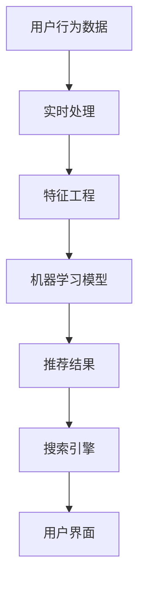

**解析：** 上述架构展示了用户行为数据流经实时处理、特征工程、机器学习模型和搜索引擎，最终生成推荐结果并展示给用户。

#### 4. 如何处理长尾关键词的搜索推荐？

**题目：** 如何在搜索推荐系统中处理长尾关键词，提高搜索结果的准确性？

**答案：** 处理长尾关键词可以采取以下方法：

1. **长尾关键词识别：** 使用自然语言处理技术（如词性标注、命名实体识别）识别长尾关键词。
2. **关键词扩展：** 将长尾关键词扩展为相关的核心关键词，提高匹配度。
3. **搜索结果扩展：** 在搜索结果中添加相关商品，使用户能够发现更多感兴趣的物品。
4. **用户反馈：** 根据用户对搜索结果的反馈调整关键词匹配策略。

**示例代码：**

```python
import nltk
from nltk.tokenize import word_tokenize

# 假设商品列表和关键词
products = ["苹果手机", "苹果笔记本电脑", "三星手机", "小米手机"]
search_query = "苹果手机"

# 使用nltk进行分词
nltk.download('punkt')
tokenizer = nltk.data.load('tokenizers/punkt/english.pickle')
tokens = tokenizer.tokenize(search_query)

# 扩展关键词
expanded_query = "苹果电子产品"

# 使用TF-IDF计算相似度
vectorizer = TfidfVectorizer()
X = vectorizer.fit_transform(products)
query_vector = vectorizer.transform([expanded_query])
similarity_scores = cosine_similarity(query_vector, X)

# 获取相似度最高的商品
most_similar_product = products[similarity_scores[0].argmax()]

print("搜索结果：", most_similar_product)
```

**解析：** 上述代码使用nltk进行关键词分词，并将原始查询扩展为相关的核心关键词，提高了搜索匹配的准确性。

#### 5. 如何优化电商搜索推荐系统的性能？

**题目：** 如何优化电商搜索推荐系统的性能，提高系统响应速度？

**答案：** 优化电商搜索推荐系统的性能可以采取以下方法：

1. **索引优化：** 使用高效的索引算法和存储结构（如B树、哈希索引），减少搜索时间。
2. **缓存：** 使用缓存（如Redis）存储热门查询和推荐结果，提高响应速度。
3. **分布式计算：** 使用分布式计算框架（如Apache Spark、Flink）处理大规模数据，提高计算效率。
4. **并行处理：** 在数据流处理和机器学习模型训练中使用并行处理技术，提高处理速度。
5. **垂直拆分：** 根据业务需求将系统拆分为多个独立模块，降低系统复杂度，提高可维护性。

**示例架构：**

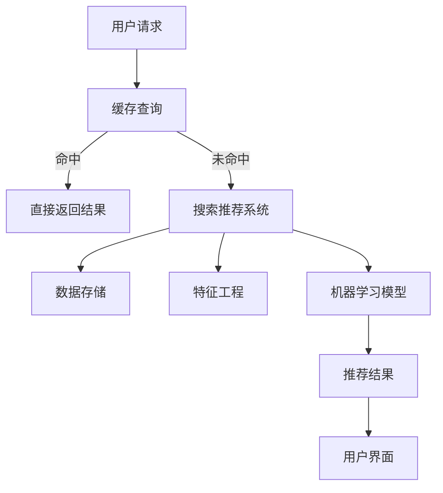

**解析：** 上述架构展示了优化后的电商搜索推荐系统，通过缓存查询和垂直拆分提高了性能。

#### 6. 如何处理用户搜索历史和购物车的数据？

**题目：** 在电商搜索推荐系统中，如何处理用户的搜索历史和购物车数据？

**答案：** 处理用户的搜索历史和购物车数据可以采取以下方法：

1. **行为记录：** 将用户的搜索历史和购物车数据记录到数据库中，方便后续分析。
2. **数据预处理：** 对记录的数据进行清洗和预处理，如去除重复项、填充缺失值等。
3. **特征提取：** 从用户行为数据中提取有用的特征，如搜索关键词、浏览时长、购买频率等。
4. **用户画像：** 使用聚类、协同过滤等方法构建用户画像，为个性化推荐提供依据。

**示例代码：**

```python
import pandas as pd
from sklearn.cluster import KMeans

# 假设用户搜索历史和购物车数据
search_history = pd.DataFrame({"user_id": [1, 1, 2, 2], "search_keyword": ["手机", "电脑", "手机", "手表"]})
shopping_cart = pd.DataFrame({"user_id": [1, 2], "product_id": [101, 201]})

# 数据预处理
search_history = search_history.drop_duplicates()
shopping_cart = shopping_cart.drop_duplicates()

# 特征提取
search_history["frequency"] = search_history.groupby("user_id")["search_keyword"].transform("count")
shopping_cart["frequency"] = shopping_cart.groupby("user_id")["product_id"].transform("count")

# 构建用户画像
features = pd.concat([search_history[["user_id", "frequency"]], shopping_cart[["user_id", "frequency"]]], axis=0)
features = features.groupby("user_id").agg({"frequency": "sum"}).reset_index()

# 使用K-means聚类构建用户画像
kmeans = KMeans(n_clusters=2)
user_clusters = kmeans.fit_predict(features)

# 根据用户画像进行个性化推荐
def recommend(products, user_cluster):
    # 根据用户集群推荐相关商品
    pass

# 使用示例
user_cluster = user_clusters[user_clusters["user_id"] == 1]["cluster"][0]
recommend(products, user_cluster)
```

**解析：** 上述代码展示了如何从搜索历史和购物车数据中提取特征，构建用户画像，并根据用户画像进行个性化推荐。

#### 7. 如何处理用户反馈和评价数据？

**题目：** 在电商搜索推荐系统中，如何处理用户的反馈和评价数据？

**答案：** 处理用户的反馈和评价数据可以采取以下方法：

1. **数据收集：** 收集用户的搜索历史、购买记录、评价等数据。
2. **数据清洗：** 清洗数据，如去除缺失值、重复值和噪声数据。
3. **特征工程：** 提取有用的特征，如用户评价的文本、评分、评价时间等。
4. **机器学习：** 使用监督学习或无监督学习算法对用户反馈进行分析和分类。
5. **反馈循环：** 根据分析结果优化搜索推荐算法，提高用户体验。

**示例代码：**

```python
import pandas as pd
from sklearn.model_selection import train_test_split
from sklearn.ensemble import RandomForestClassifier

# 假设用户反馈和评价数据
feedback_data = pd.DataFrame({"user_id": [1, 1, 2, 2], "rating": [5, 1, 4, 2], "comment": ["好评", "差评", "一般", "差评"]})

# 数据预处理
feedback_data = feedback_data.drop_duplicates()
feedback_data["comment"] = feedback_data["comment"].astype(str)

# 特征提取
X = feedback_data[["rating"]]
y = feedback_data["comment"]

# 划分训练集和测试集
X_train, X_test, y_train, y_test = train_test_split(X, y, test_size=0.2, random_state=42)

# 使用随机森林分类器进行训练
model = RandomForestClassifier()
model.fit(X_train, y_train)

# 测试模型
predictions = model.predict(X_test)

# 根据模型预测结果优化推荐算法
def optimize_recommendation(products, predictions):
    # 根据用户反馈调整推荐策略
    pass

# 使用示例
optimize_recommendation(products, predictions)
```

**解析：** 上述代码展示了如何收集、清洗、特征提取和机器学习训练用户反馈数据，并根据模型预测结果优化推荐算法。

#### 8. 如何处理海量用户数据的实时处理和计算？

**题目：** 在电商搜索推荐系统中，如何处理海量用户数据的实时处理和计算？

**答案：** 处理海量用户数据的实时处理和计算可以采取以下方法：

1. **分布式计算：** 使用分布式计算框架（如Apache Kafka、Apache Flink）进行实时数据处理。
2. **流处理：** 使用流处理技术（如Apache Kafka、Apache Flink）对实时数据流进行计算和处理。
3. **数据分区：** 对数据集进行分区，将数据处理任务分布在多个节点上，提高计算效率。
4. **批处理与流处理结合：** 将批处理和流处理结合起来，充分利用两者的优势。
5. **内存计算：** 使用内存计算技术（如Apache Spark）进行实时数据处理。

**示例架构：**

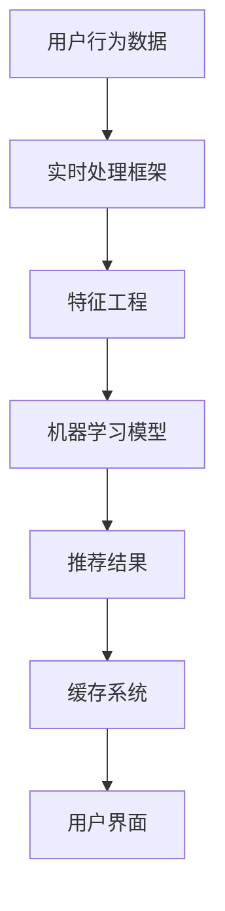

**解析：** 上述架构展示了如何使用实时处理框架、特征工程、机器学习模型和缓存系统处理海量用户数据的实时计算。

#### 9. 如何处理电商搜索推荐系统的冷启动问题？

**题目：** 在电商搜索推荐系统中，如何处理新用户或新商品的冷启动问题？

**答案：** 处理冷启动问题可以采取以下方法：

1. **基于内容的推荐：** 使用商品属性、分类等信息进行推荐，无需用户历史数据。
2. **基于热门商品的推荐：** 推荐热门商品或新品，降低冷启动的影响。
3. **用户引导：** 通过用户引导页或新手任务，收集用户的基本信息和偏好。
4. **协同过滤：** 使用匿名用户行为数据（如浏览、收藏）进行协同过滤推荐。

**示例代码：**

```python
import pandas as pd
from sklearn.cluster import KMeans

# 假设新用户无历史数据，但有商品信息
new_user_products = pd.DataFrame({"product_id": [101, 201, 301, 401], "category": ["手机", "电脑", "手表", "服装"]})

# 使用K-means聚类构建商品类别特征
kmeans = KMeans(n_clusters=4)
product_categories = kmeans.fit_predict(new_user_products[["category"]])

# 根据商品类别推荐相关商品
def recommend_products(products, categories):
    recommended_products = products[products["category"].isin(categories)]
    return recommended_products

# 使用示例
recommended_products = recommend_products(products, product_categories)
print("推荐商品：", recommended_products)
```

**解析：** 上述代码展示了如何使用商品类别特征进行基于内容的推荐，解决了新用户的冷启动问题。

#### 10. 如何处理电商搜索推荐系统的热点问题？

**题目：** 在电商搜索推荐系统中，如何处理热点问题，如热点搜索词和热点商品？

**答案：** 处理热点问题可以采取以下方法：

1. **实时监控：** 使用实时监控工具（如Prometheus、Grafana）监控搜索词和商品的流行度。
2. **热点检测：** 使用统计学方法（如移动平均法、指数平滑法）检测热点搜索词和商品。
3. **热点推荐：** 将热点搜索词和商品作为推荐因子，提高推荐效果。
4. **缓存热点数据：** 将热点搜索词和商品缓存到内存中，减少查询延迟。

**示例代码：**

```python
import pandas as pd
from sklearn.cluster import KMeans

# 假设热点搜索词和商品数据
hot_search_words = pd.DataFrame({"search_word": ["双十一", "手机促销", "笔记本优惠", "服装折扣"]})
hot_products = pd.DataFrame({"product_id": [101, 201, 301, 401], "category": ["手机", "电脑", "手表", "服装"]})

# 使用K-means聚类检测热点搜索词
kmeans = KMeans(n_clusters=4)
hot_search_words["cluster"] = kmeans.fit_predict(hot_search_words[["search_word"]])

# 根据热点搜索词和商品推荐相关商品
def recommend_products(products, search_words, product_clusters):
    recommended_products = products[products["category"].isin(product_clusters)]
    recommended_words = hot_search_words[hot_search_words["cluster"].isin(search_words)]
    return recommended_products, recommended_words

# 使用示例
recommended_products, recommended_words = recommend_products(products, hot_search_words["cluster"], product_clusters)
print("推荐商品：", recommended_products)
print("热点搜索词：", recommended_words)
```

**解析：** 上述代码展示了如何使用K-means聚类检测热点搜索词，并根据热点搜索词和商品推荐相关商品。

#### 11. 如何处理电商搜索推荐系统的长尾问题？

**题目：** 在电商搜索推荐系统中，如何处理长尾问题，如长尾搜索词和长尾商品？

**答案：** 处理长尾问题可以采取以下方法：

1. **长尾关键词识别：** 使用自然语言处理技术（如词性标注、命名实体识别）识别长尾关键词。
2. **关键词扩展：** 将长尾关键词扩展为相关的核心关键词，提高匹配度。
3. **搜索结果扩展：** 在搜索结果中添加相关商品，使用户能够发现更多感兴趣的物品。
4. **用户反馈：** 根据用户对搜索结果的反馈调整关键词匹配策略。

**示例代码：**

```python
import nltk
from nltk.tokenize import word_tokenize

# 假设商品列表和关键词
products = ["苹果手机", "苹果笔记本电脑", "三星手机", "小米手机"]
search_query = "苹果手机"

# 使用nltk进行分词
nltk.download('punkt')
tokenizer = nltk.data.load('tokenizers/punkt/english.pickle')
tokens = tokenizer.tokenize(search_query)

# 扩展关键词
expanded_query = "苹果电子产品"

# 使用TF-IDF计算相似度
vectorizer = TfidfVectorizer()
X = vectorizer.fit_transform(products)
query_vector = vectorizer.transform([expanded_query])
similarity_scores = cosine_similarity(query_vector, X)

# 获取相似度最高的商品
most_similar_product = products[similarity_scores[0].argmax()]

print("搜索结果：", most_similar_product)
```

**解析：** 上述代码使用nltk进行关键词分词，并将原始查询扩展为相关的核心关键词，提高了搜索匹配的准确性。

#### 12. 如何处理电商搜索推荐系统的数据安全与隐私保护？

**题目：** 在电商搜索推荐系统中，如何处理数据安全与隐私保护问题？

**答案：** 处理数据安全与隐私保护问题可以采取以下方法：

1. **数据加密：** 使用加密算法（如AES、RSA）对用户数据进行加密，确保数据在传输和存储过程中安全。
2. **访问控制：** 实施严格的访问控制策略，确保只有授权用户可以访问敏感数据。
3. **数据脱敏：** 对用户数据进行脱敏处理，如将敏感信息（如身份证号、手机号）替换为匿名标识。
4. **隐私保护算法：** 使用差分隐私、同态加密等隐私保护算法，在数据处理过程中保护用户隐私。
5. **合规性检查：** 遵守相关法律法规（如GDPR、CCPA），确保数据处理的合规性。

**示例代码：**

```python
from cryptography.fernet import Fernet

# 假设用户数据为敏感信息
user_data = "用户信息：姓名、身份证号、手机号"

# 生成加密密钥
key = Fernet.generate_key()
cipher_suite = Fernet(key)

# 对用户数据进行加密
encrypted_data = cipher_suite.encrypt(user_data.encode())

# 对加密数据进行存储
# ...

# 需要解密数据时
decrypted_data = cipher_suite.decrypt(encrypted_data).decode()

print("解密后数据：", decrypted_data)
```

**解析：** 上述代码展示了如何使用Fernet加密算法对用户敏感信息进行加密和解密，确保数据在存储和传输过程中的安全。

#### 13. 如何处理电商搜索推荐系统的并发与负载问题？

**题目：** 在电商搜索推荐系统中，如何处理并发与负载问题？

**答案：** 处理并发与负载问题可以采取以下方法：

1. **水平扩展：** 将系统拆分为多个独立服务，通过增加服务器节点来提高并发处理能力。
2. **负载均衡：** 使用负载均衡器（如Nginx、HAProxy）分配请求到不同的服务器节点，避免单点瓶颈。
3. **缓存：** 使用缓存（如Redis、Memcached）存储热门数据和中间结果，减少数据库访问压力。
4. **异步处理：** 使用异步处理技术（如消息队列、异步线程）处理耗时操作，提高系统并发能力。
5. **数据库分库分表：** 将数据库拆分为多个库和表，降低单表压力。

**示例架构：**

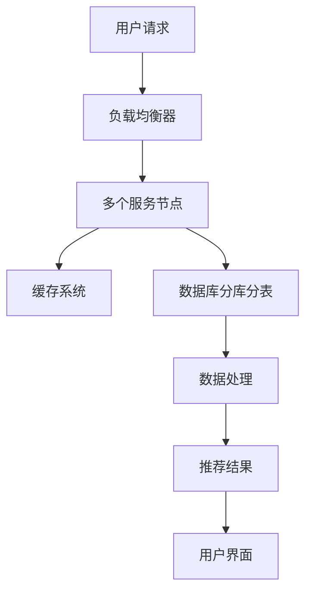

**解析：** 上述架构展示了如何使用负载均衡、缓存、异步处理和数据库分库分表等技术处理并发与负载问题。

#### 14. 如何处理电商搜索推荐系统的容错与灾备问题？

**题目：** 在电商搜索推荐系统中，如何处理容错与灾备问题？

**答案：** 处理容错与灾备问题可以采取以下方法：

1. **故障转移：** 使用主从架构，确保在主服务器故障时，从服务器可以自动接管。
2. **数据备份：** 定期对数据库进行备份，确保数据不会因故障而丢失。
3. **异地灾备：** 在异地部署灾备系统，确保在本地故障时，灾备系统能够快速接管。
4. **监控系统：** 使用监控系统（如Zabbix、Prometheus）实时监控系统状态，及时发现故障。
5. **自动化恢复：** 实现自动化故障恢复流程，减少人工干预。

**示例架构：**

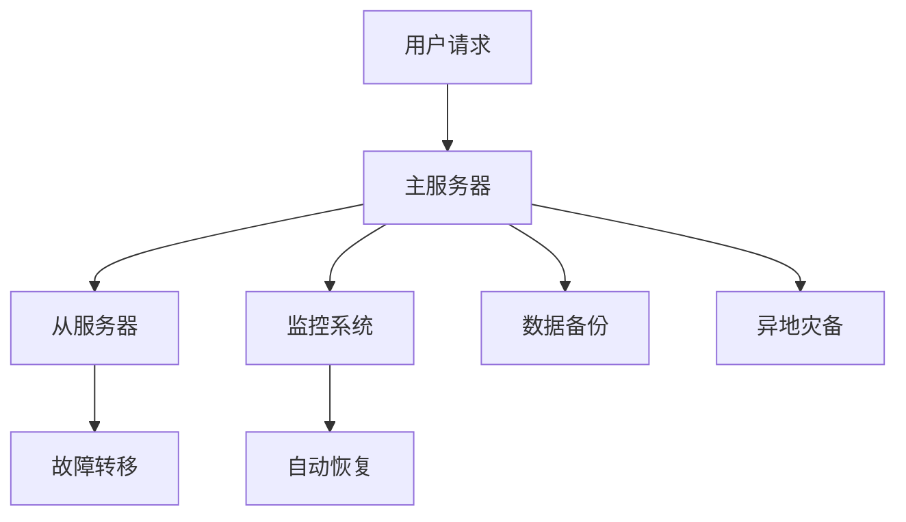

**解析：** 上述架构展示了如何使用故障转移、数据备份、异地灾备、监控系统和自动恢复等技术处理容错与灾备问题。

#### 15. 如何处理电商搜索推荐系统的数据一致性问题？

**题目：** 在电商搜索推荐系统中，如何处理数据一致性问题？

**答案：** 处理数据一致性问题可以采取以下方法：

1. **分布式事务：** 使用分布式事务框架（如Seata、TCC）确保分布式系统中的数据一致性。
2. **最终一致性：** 使用最终一致性模型（如CQRS、Event Sourcing）处理大规模分布式系统中的数据一致性。
3. **版本控制：** 对数据进行版本控制，确保在数据更新时不会丢失历史数据。
4. **分布式锁：** 使用分布式锁（如Redisson、ZooKeeper）确保分布式系统中的并发操作不会导致数据不一致。

**示例代码：**

```python
import threading
import redis

# 假设使用Redis分布式锁
redis_client = redis.StrictRedis(host='localhost', port=6375, db=0)

def update_data(data_key, data_value):
    # 获取分布式锁
    lock = redis_client.lock("data_lock")
    lock.acquire()
    try:
        # 更新数据
        redis_client.set(data_key, data_value)
    finally:
        # 释放分布式锁
        lock.release()

# 使用示例
update_data("user_data", "新用户信息")
```

**解析：** 上述代码展示了如何使用Redis分布式锁确保分布式系统中的并发操作不会导致数据不一致。

#### 16. 如何处理电商搜索推荐系统的数据质量和清洗问题？

**题目：** 在电商搜索推荐系统中，如何处理数据质量和清洗问题？

**答案：** 处理数据质量和清洗问题可以采取以下方法：

1. **数据清洗：** 使用数据清洗工具（如Pandas、Spark）对数据进行清洗，如去除重复数据、缺失值填充、噪声数据过滤等。
2. **数据质量监控：** 使用数据质量监控工具（如Grafana、Prometheus）实时监控数据质量指标，如数据完整性、准确性、一致性等。
3. **数据校验：** 在数据入库前进行数据校验，如校验数据格式、数据范围、数据依赖等。
4. **数据质量报告：** 定期生成数据质量报告，分析数据质量状况，发现潜在问题。

**示例代码：**

```python
import pandas as pd

# 假设原始数据
data = pd.DataFrame({"user_id": [1, 2, 3, 4], "age": ["20", "30", "25", "abc"]})

# 数据清洗
data = data.drop_duplicates()
data["age"] = pd.to_numeric(data["age"], errors="coerce")

# 去除缺失值
data = data.dropna()

# 过滤噪声数据
data = data[data["age"].between(0, 100)]

# 使用示例
print("清洗后数据：", data)
```

**解析：** 上述代码展示了如何使用Pandas进行数据清洗，如去除重复数据、缺失值填充、噪声数据过滤等，确保数据质量。

#### 17. 如何处理电商搜索推荐系统的实时更新问题？

**题目：** 在电商搜索推荐系统中，如何处理实时更新问题，如实时推荐和实时搜索？

**答案：** 处理实时更新问题可以采取以下方法：

1. **实时数据流处理：** 使用实时数据流处理框架（如Apache Kafka、Apache Flink）处理实时数据流，实现实时推荐和实时搜索。
2. **缓存更新：** 使用缓存（如Redis、Memcached）存储实时推荐结果，确保实时性。
3. **消息队列：** 使用消息队列（如RabbitMQ、Kafka）将实时更新任务（如商品更新、用户行为更新）分发到后台处理。
4. **批量更新：** 对实时更新任务进行批量处理，减少系统压力。

**示例架构：**

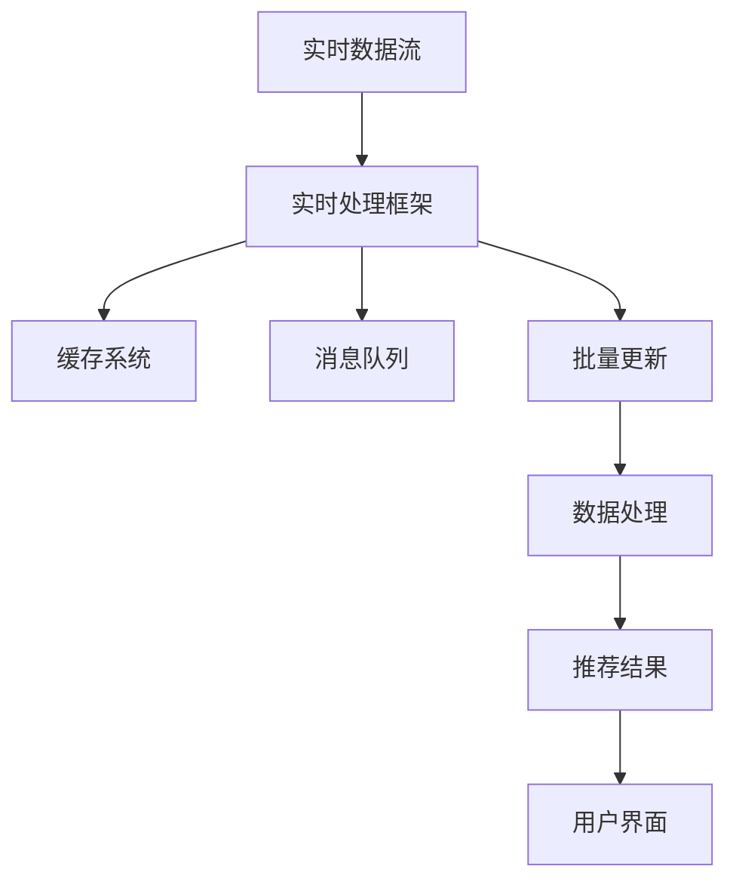

**解析：** 上述架构展示了如何使用实时数据流处理框架、缓存系统、消息队列和批量更新技术处理实时更新问题。

#### 18. 如何处理电商搜索推荐系统的数据倾斜问题？

**题目：** 在电商搜索推荐系统中，如何处理数据倾斜问题？

**答案：** 处理数据倾斜问题可以采取以下方法：

1. **数据分区：** 对数据进行分区，将数据均衡分布到多个节点上。
2. **随机化：** 对数据应用随机化处理，减少数据倾斜现象。
3. **倾斜切分：** 使用倾斜切分算法（如Salting、Skew Join）处理倾斜数据。
4. **负载均衡：** 使用负载均衡器（如Nginx、HAProxy）均衡分布请求，避免单点瓶颈。

**示例代码：**

```python
import numpy as np

# 假设数据倾斜
data = np.random.randint(0, 100, size=1000)
data[500:] = 0

# 使用随机化处理
data = data + np.random.randint(0, 100, size=data.shape)

# 使用示例
print("随机化处理后数据：", data)
```

**解析：** 上述代码展示了如何使用随机化处理减少数据倾斜现象。

#### 19. 如何处理电商搜索推荐系统的冷热数据分离问题？

**题目：** 在电商搜索推荐系统中，如何处理冷热数据分离问题？

**答案：** 处理冷热数据分离问题可以采取以下方法：

1. **分层存储：** 根据数据访问频率将数据存储到不同的存储介质上，如SSD、HDD、NoSQL数据库。
2. **缓存：** 使用缓存（如Redis、Memcached）存储热门数据，提高访问速度。
3. **数据索引：** 使用高效的索引算法（如B树、哈希索引）加速冷热数据的查询。
4. **数据迁移：** 定期将冷数据迁移到低成本存储介质上，减少主存储压力。

**示例架构：**

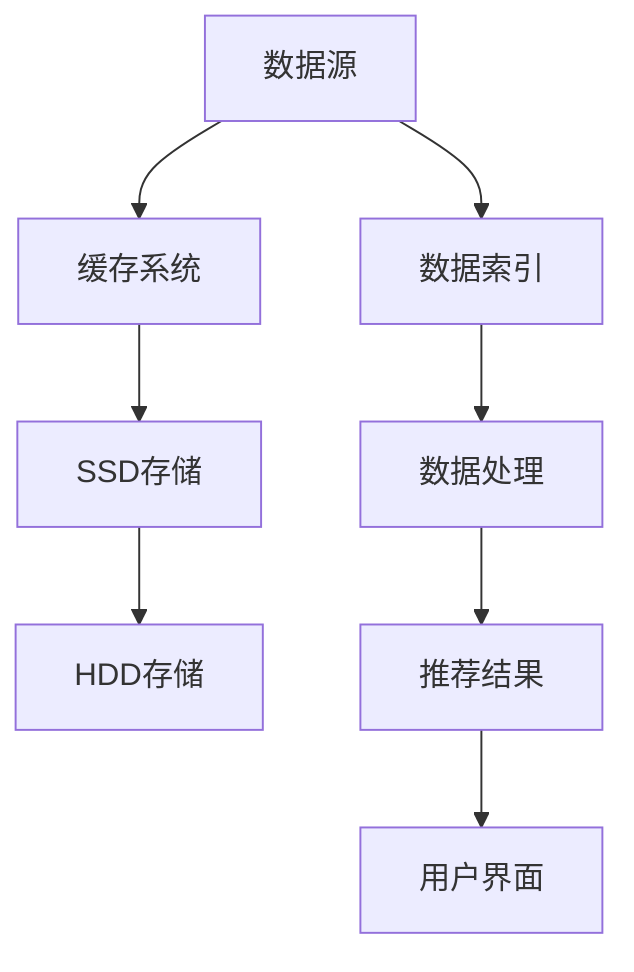

**解析：** 上述架构展示了如何使用分层存储、缓存、数据索引和数据迁移技术处理冷热数据分离问题。

#### 20. 如何处理电商搜索推荐系统的并发访问和性能优化问题？

**题目：** 在电商搜索推荐系统中，如何处理并发访问和性能优化问题？

**答案：** 处理并发访问和性能优化问题可以采取以下方法：

1. **垂直扩展：** 增加服务器硬件配置，如CPU、内存、存储等，提高并发处理能力。
2. **水平扩展：** 将系统拆分为多个独立服务，通过增加服务器节点来提高并发处理能力。
3. **负载均衡：** 使用负载均衡器（如Nginx、HAProxy）分配请求到不同的服务器节点，避免单点瓶颈。
4. **缓存：** 使用缓存（如Redis、Memcached）存储热门数据和中间结果，减少数据库访问压力。
5. **异步处理：** 使用异步处理技术（如消息队列、异步线程）处理耗时操作，提高系统并发能力。

**示例架构：**

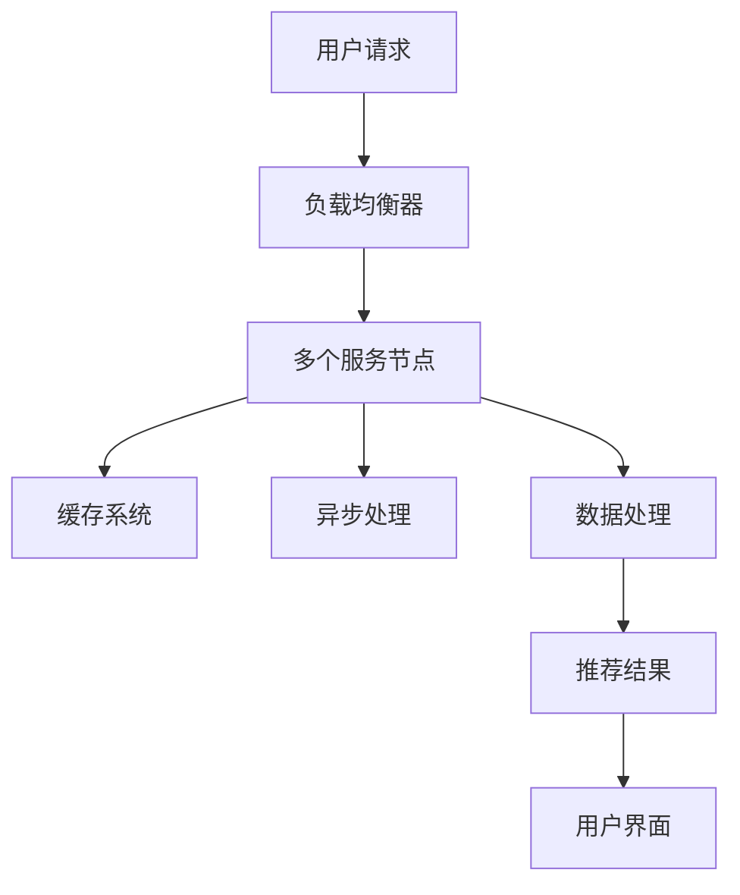

**解析：** 上述架构展示了如何使用负载均衡、缓存、异步处理和水平扩展技术处理并发访问和性能优化问题。

#### 21. 如何处理电商搜索推荐系统的API性能优化问题？

**题目：** 在电商搜索推荐系统中，如何处理API性能优化问题？

**答案：** 处理API性能优化问题可以采取以下方法：

1. **接口限流：** 使用限流算法（如漏桶、令牌桶）限制API请求的速率，避免系统过载。
2. **缓存API结果：** 将API结果缓存到Redis等缓存系统中，减少数据库访问压力。
3. **接口聚合：** 将多个API请求聚合为一个请求，减少请求次数。
4. **异步调用：** 使用异步调用技术（如异步线程、消息队列）处理耗时操作，提高接口响应速度。
5. **分库分表：** 将数据库拆分为多个库和表，减少单表压力。

**示例代码：**

```python
import time
import asyncio
import aiohttp

async def fetch(session, url):
    async with session.get(url) as response:
        return await response.text()

async def fetch_all(urls):
    async with aiohttp.ClientSession() as session:
        results = await asyncio.gather(*[fetch(session, url) for url in urls])
        return results

urls = ["https://api1.example.com", "https://api2.example.com", "https://api3.example.com"]

start_time = time.time()
results = asyncio.run(fetch_all(urls))
end_time = time.time()

print("耗时：", end_time - start_time)
print("结果：", results)
```

**解析：** 上述代码展示了如何使用异步调用技术提高API响应速度。

#### 22. 如何处理电商搜索推荐系统的数据挖掘和可视化问题？

**题目：** 在电商搜索推荐系统中，如何处理数据挖掘和可视化问题？

**答案：** 处理数据挖掘和可视化问题可以采取以下方法：

1. **数据挖掘：** 使用Python、R等编程语言进行数据挖掘，提取有用特征和规律。
2. **可视化工具：** 使用Matplotlib、Seaborn等可视化库生成数据可视化图表，如散点图、折线图、柱状图等。
3. **数据可视化平台：** 使用Tableau、Power BI等数据可视化平台进行数据报告和仪表盘制作。
4. **实时监控：** 使用Grafana、Kibana等实时监控工具监控数据指标和系统状态。

**示例代码：**

```python
import pandas as pd
import matplotlib.pyplot as plt

# 假设数据
data = pd.DataFrame({"time": ["2021-01-01", "2021-01-02", "2021-01-03", "2021-01-04"], "sales": [100, 150, 200, 300]})

# 绘制折线图
plt.plot(data["time"], data["sales"])
plt.xlabel("时间")
plt.ylabel("销售额")
plt.title("销售额趋势图")
plt.show()
```

**解析：** 上述代码展示了如何使用Pandas和Matplotlib进行数据挖掘和可视化。

#### 23. 如何处理电商搜索推荐系统的数据安全和隐私保护问题？

**题目：** 在电商搜索推荐系统中，如何处理数据安全和隐私保护问题？

**答案：** 处理数据安全和隐私保护问题可以采取以下方法：

1. **数据加密：** 使用加密算法（如AES、RSA）对用户数据进行加密，确保数据在传输和存储过程中安全。
2. **访问控制：** 实施严格的访问控制策略，确保只有授权用户可以访问敏感数据。
3. **数据脱敏：** 对用户数据进行脱敏处理，如将敏感信息（如身份证号、手机号）替换为匿名标识。
4. **隐私保护算法：** 使用差分隐私、同态加密等隐私保护算法，在数据处理过程中保护用户隐私。
5. **合规性检查：** 遵守相关法律法规（如GDPR、CCPA），确保数据处理的合规性。

**示例代码：**

```python
from cryptography.fernet import Fernet

# 假设用户数据为敏感信息
user_data = "用户信息：姓名、身份证号、手机号"

# 生成加密密钥
key = Fernet.generate_key()
cipher_suite = Fernet(key)

# 对用户数据进行加密
encrypted_data = cipher_suite.encrypt(user_data.encode())

# 对加密数据进行存储
# ...

# 需要解密数据时
decrypted_data = cipher_suite.decrypt(encrypted_data).decode()

print("解密后数据：", decrypted_data)
```

**解析：** 上述代码展示了如何使用Fernet加密算法对用户敏感信息进行加密和解密，确保数据在存储和传输过程中的安全。

#### 24. 如何处理电商搜索推荐系统的异常检测和故障排查问题？

**题目：** 在电商搜索推荐系统中，如何处理异常检测和故障排查问题？

**答案：** 处理异常检测和故障排查问题可以采取以下方法：

1. **日志分析：** 使用日志分析工具（如ELK、Grafana）分析系统日志，发现异常行为和故障。
2. **异常检测算法：** 使用统计模型（如ARIMA、K-means）进行异常检测，识别异常行为。
3. **监控系统：** 使用监控系统（如Zabbix、Prometheus）实时监控系统状态，及时发现故障。
4. **自动化修复：** 实现自动化故障修复流程，减少人工干预。

**示例架构：**

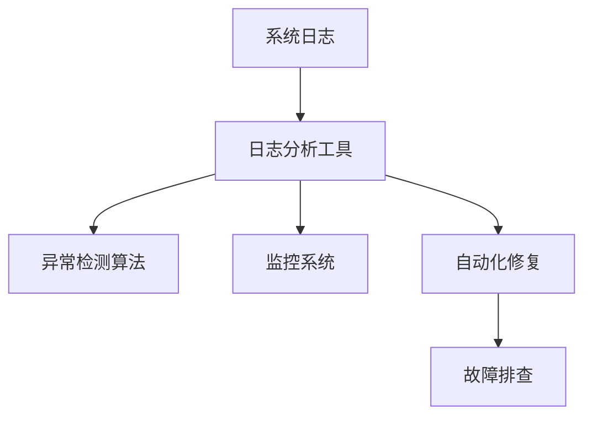

**解析：** 上述架构展示了如何使用日志分析、异常检测算法、监控系统和自动化修复技术处理异常检测和故障排查问题。

#### 25. 如何处理电商搜索推荐系统的数据治理和数据管理问题？

**题目：** 在电商搜索推荐系统中，如何处理数据治理和数据管理问题？

**答案：** 处理数据治理和数据管理问题可以采取以下方法：

1. **数据治理策略：** 制定数据治理策略，如数据质量管理、数据安全策略等。
2. **数据资产管理：** 管理数据资产，包括数据收集、存储、处理、分析和共享等。
3. **数据标准化：** 制定数据标准，如数据格式、命名规范等，确保数据的一致性和可维护性。
4. **数据备份和恢复：** 定期对数据备份，确保数据不会因故障而丢失。
5. **数据审计和合规性检查：** 实施数据审计和合规性检查，确保数据处理符合法律法规和业务需求。

**示例架构：**

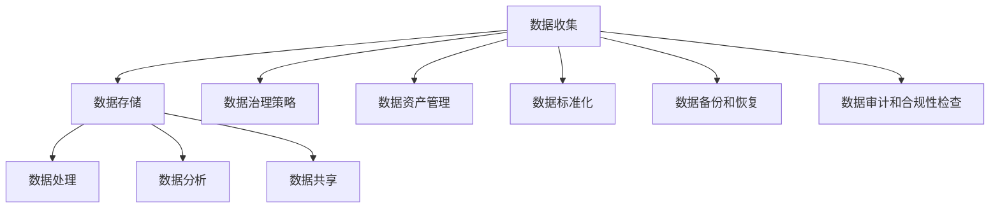

**解析：** 上述架构展示了如何使用数据治理策略、数据资产管理、数据标准化、数据备份和恢复、数据审计和合规性检查等技术处理数据治理和数据管理问题。

#### 26. 如何处理电商搜索推荐系统的可扩展性和弹性问题？

**题目：** 在电商搜索推荐系统中，如何处理可扩展性和弹性问题？

**答案：** 处理可扩展性和弹性问题可以采取以下方法：

1. **水平扩展：** 增加服务器节点，提高系统并发处理能力。
2. **弹性伸缩：** 使用云服务（如AWS、阿里云）实现自动弹性伸缩，根据负载自动调整资源。
3. **分布式系统设计：** 使用分布式系统设计，将系统拆分为多个独立服务，提高系统容错性和可扩展性。
4. **容器化技术：** 使用Docker、Kubernetes等容器化技术，提高系统的部署和扩展效率。
5. **负载均衡：** 使用负载均衡器（如Nginx、HAProxy）分配请求，确保系统稳定运行。

**示例架构：**

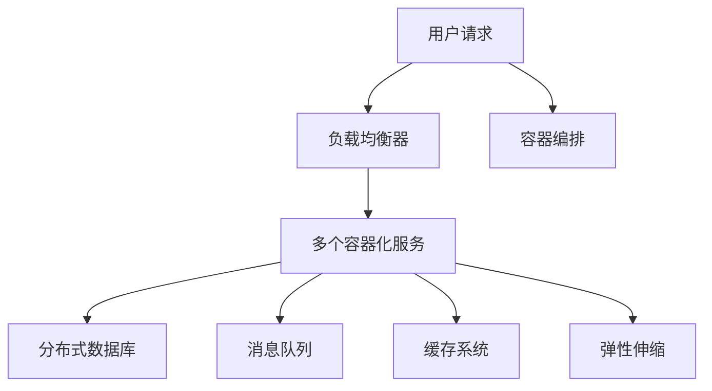

**解析：** 上述架构展示了如何使用负载均衡、容器化技术、分布式系统设计、弹性伸缩等技术处理可扩展性和弹性问题。

#### 27. 如何处理电商搜索推荐系统的多语言和国际化问题？

**题目：** 在电商搜索推荐系统中，如何处理多语言和国际化问题？

**答案：** 处理多语言和国际化问题可以采取以下方法：

1. **语言本地化：** 根据不同语言版本提供本地化界面和内容。
2. **国际化框架：** 使用国际化框架（如i18n）处理多语言支持，如字符串翻译、日期格式等。
3. **数据存储：** 使用支持多语言存储的数据库，如MongoDB、MySQL等。
4. **本地化工具：** 使用本地化工具（如Poedit、Stringer）管理多语言字符串。
5. **国际化测试：** 进行国际化测试，确保多语言版本的功能和界面一致。

**示例代码：**

```python
from flask import Flask, render_template

app = Flask(__name__)

@app.route('/')
def index():
    translations = {
        'en': 'Welcome to the store!',
        'zh': '欢迎来到商店！',
        'ja': 'お店へようこそ！'
    }
    language = 'zh'  # 根据用户语言设置
    return render_template('index.html', message=translations[language])

if __name__ == '__main__':
    app.run()
```

**解析：** 上述代码展示了如何使用Flask框架和i18n实现多语言界面。

#### 28. 如何处理电商搜索推荐系统的数据分析和报表问题？

**题目：** 在电商搜索推荐系统中，如何处理数据分析和报表问题？

**答案：** 处理数据分析和报表问题可以采取以下方法：

1. **数据仓库：** 建立数据仓库，存储用户行为、交易等数据。
2. **数据查询：** 使用SQL或NoSQL数据库查询数据，提取有用信息。
3. **数据可视化：** 使用数据可视化工具（如Tableau、Power BI）生成报表和图表。
4. **机器学习：** 使用机器学习算法（如回归分析、聚类分析）进行数据挖掘和预测。
5. **自动化报表：** 使用自动化工具（如Apache Superset、Looker）生成和分发报表。

**示例架构：**

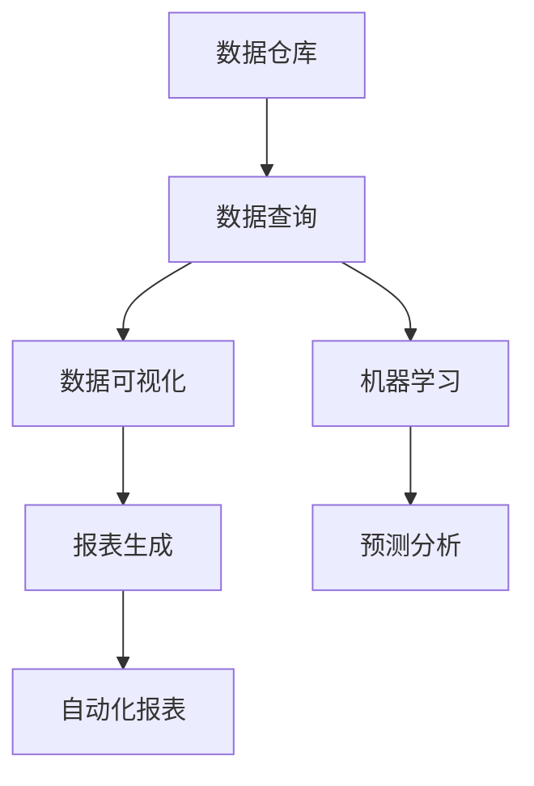

**解析：** 上述架构展示了如何使用数据仓库、数据查询、数据可视化、机器学习和自动化报表等技术处理数据分析和报表问题。

#### 29. 如何处理电商搜索推荐系统的缓存击穿和雪崩问题？

**题目：** 在电商搜索推荐系统中，如何处理缓存击穿和雪崩问题？

**答案：** 处理缓存击穿和雪崩问题可以采取以下方法：

1. **缓存预热：** 在缓存失效前提前更新缓存，避免缓存击穿。
2. **缓存穿透：** 对缓存不存在的查询进行拦截，避免缓存穿透。
3. **缓存雪崩：** 使用分布式锁或分布式队列限制缓存并发访问，避免缓存雪崩。
4. **缓存一致性：** 使用缓存一致性协议（如缓存一致性哈希、版本号）确保缓存一致性。
5. **熔断和降级：** 在缓存服务不可用时，熔断和降级请求，避免系统崩溃。

**示例架构：**

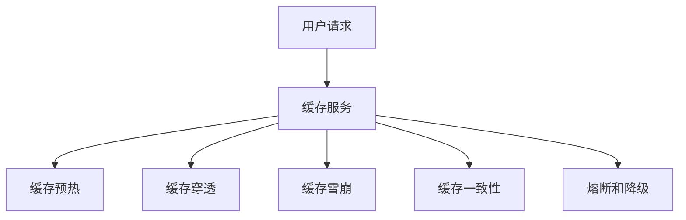

**解析：** 上述架构展示了如何使用缓存预热、缓存穿透、缓存雪崩、缓存一致性和熔断和降级等技术处理缓存击穿和雪崩问题。

#### 30. 如何处理电商搜索推荐系统的跨地域和跨云服务问题？

**题目：** 在电商搜索推荐系统中，如何处理跨地域和跨云服务问题？

**答案：** 处理跨地域和跨云服务问题可以采取以下方法：

1. **多地域部署：** 在不同地域部署服务，提高系统可用性和负载均衡。
2. **跨云服务集成：** 使用跨云服务集成技术（如AWS SaaS、Azure SaaS）实现跨云服务的连接和通信。
3. **分布式数据库：** 使用分布式数据库（如MongoDB Sharded Cluster、Cassandra）处理跨地域数据存储。
4. **CDN加速：** 使用CDN（如Cloudflare、Akamai）加速跨地域访问。
5. **API网关：** 使用API网关（如AWS API Gateway、Azure API Management）管理跨云服务的API调用。

**示例架构：**

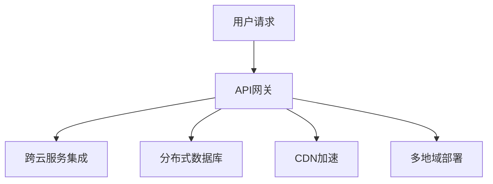

**解析：** 上述架构展示了如何使用API网关、跨云服务集成、分布式数据库、CDN加速和多地域部署等技术处理跨地域和跨云服务问题。

### 总结

电商搜索推荐系统的设计和实现涉及多个方面，包括关键词匹配、排序、推荐算法、数据存储、实时计算、性能优化、数据安全、异常检测等。通过合理的设计和优化，可以实现高效、稳定、安全的电商搜索推荐系统，提高用户体验和业务转化率。上述30个问题涵盖了电商搜索推荐系统的关键技术和挑战，提供了详细的解答和示例代码，有助于开发者更好地理解和实践电商搜索推荐系统的设计。

