                 

### 注意力资本市场:元宇宙经济的核心交易所

#### 1. 元宇宙交易所的架构设计是什么？

**题目：** 元宇宙交易所的架构设计应该考虑哪些关键点？

**答案：** 元宇宙交易所的架构设计需要考虑以下几个关键点：

1. **高并发处理能力：** 鉴于元宇宙交易所在高峰期可能面临的大量并发交易请求，需要具备强大的处理能力，以保证系统稳定。
2. **可扩展性：** 架构应具备良好的可扩展性，以便能够轻松地添加新的功能或适应增长的用户数量。
3. **安全性：** 交易数据的完整性和安全性至关重要，架构设计应包括高级的安全措施，如加密、访问控制等。
4. **高可用性：** 确保系统在遭遇故障时能够快速恢复，减少对用户体验的影响。
5. **数据一致性：** 确保交易数据的一致性和准确性，防止出现双花等问题。

**举例：**

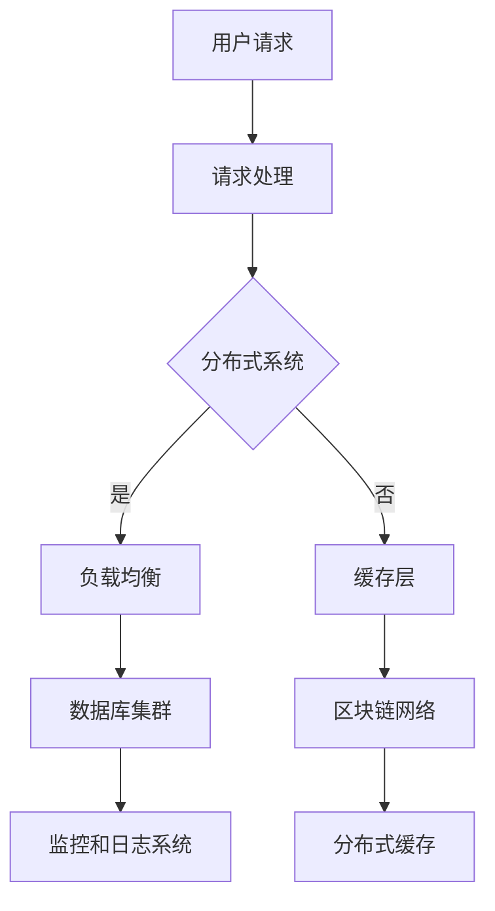

**解析：** 该架构示例展示了如何通过分布式系统、负载均衡、缓存层、区块链网络、数据库集群和监控日志系统来构建元宇宙交易所。各层之间相互协作，确保高并发、安全、可用性和数据一致性。

#### 2. 如何处理元宇宙交易所的并发交易请求？

**题目：** 元宇宙交易所如何处理大量并发交易请求？

**答案：** 元宇宙交易所可以通过以下几种方式处理大量并发交易请求：

1. **水平扩展：** 通过增加更多的服务器节点来提高系统的处理能力。
2. **负载均衡：** 使用负载均衡器将请求分布到不同的服务器节点上，避免单个节点过载。
3. **异步处理：** 将一些耗时较长的操作异步化，如账单生成、交易验证等，以减少主线程的负担。
4. **缓存：** 使用缓存来存储经常访问的数据，减少数据库的访问压力。
5. **数据库分片：** 将数据库拆分为多个分片，以分布式的形式存储数据，提高查询性能。

**举例：**

```python
# 使用 Python 代码实现简单的并发处理
import asyncio

async def process_trade_request(request):
    # 处理交易请求的代码
    print("Processing trade request:", request)

async def main():
    requests = ["Request 1", "Request 2", "Request 3"]
    tasks = [asyncio.create_task(process_trade_request(request)) for request in requests]
    await asyncio.wait(tasks)

asyncio.run(main())
```

**解析：** 该代码示例展示了如何使用 Python 的 asyncio 库处理并发交易请求。通过异步处理，可以提高系统的并发处理能力。

#### 3. 元宇宙交易所如何保证交易数据的一致性和安全性？

**题目：** 元宇宙交易所应如何确保交易数据的一致性和安全性？

**答案：** 元宇宙交易所可以通过以下措施来保证交易数据的一致性和安全性：

1. **分布式事务：** 使用分布式事务管理，确保多个操作要么全部成功，要么全部失败。
2. **区块链技术：** 利用区块链技术来记录交易数据，确保数据的不可篡改性。
3. **加密：** 使用加密算法来保护交易数据，防止数据泄露。
4. **访问控制：** 实施严格的访问控制策略，确保只有授权用户可以访问交易数据。
5. **监控和审计：** 对交易系统进行实时监控和审计，及时发现潜在的安全威胁。

**举例：**

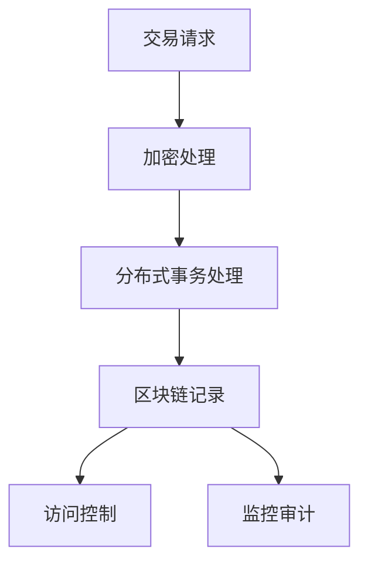

**解析：** 该架构示例展示了如何通过加密、分布式事务处理、区块链记录、访问控制和监控审计来确保交易数据的一致性和安全性。

#### 4. 元宇宙交易所如何处理用户身份验证和权限管理？

**题目：** 元宇宙交易所应如何处理用户身份验证和权限管理？

**答案：** 元宇宙交易所可以通过以下方式处理用户身份验证和权限管理：

1. **多因素认证：** 使用多因素认证（MFA）来增强用户身份验证的安全性。
2. **OAuth2.0：** 使用 OAuth2.0 协议来授权第三方应用访问用户账户。
3. **角色基权限控制：** 使用角色基权限控制（RBAC）来管理用户权限，确保用户只能访问授权的资源和功能。
4. **日志记录：** 对用户操作进行日志记录，以便在出现问题时进行审计。

**举例：**

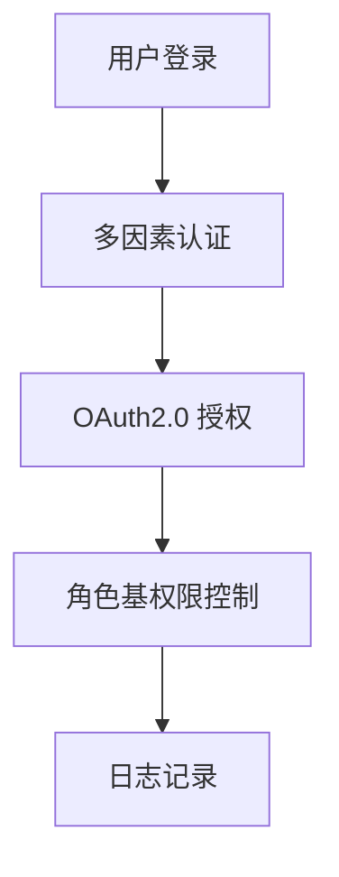

**解析：** 该架构示例展示了如何通过多因素认证、OAuth2.0 授权、角色基权限控制和日志记录来处理用户身份验证和权限管理。

#### 5. 元宇宙交易所应如何处理异常交易和风险控制？

**题目：** 元宇宙交易所应如何处理异常交易和风险控制？

**答案：** 元宇宙交易所可以通过以下措施来处理异常交易和风险控制：

1. **交易监控：** 实时监控交易行为，及时发现异常交易。
2. **风险评分：** 为每个交易分配风险评分，根据评分来决定是否执行交易。
3. **撤销交易：** 在发现异常交易时，可以撤销交易以防止损失。
4. **交易保险：** 提供交易保险，以减轻用户因异常交易造成的损失。

**举例：**

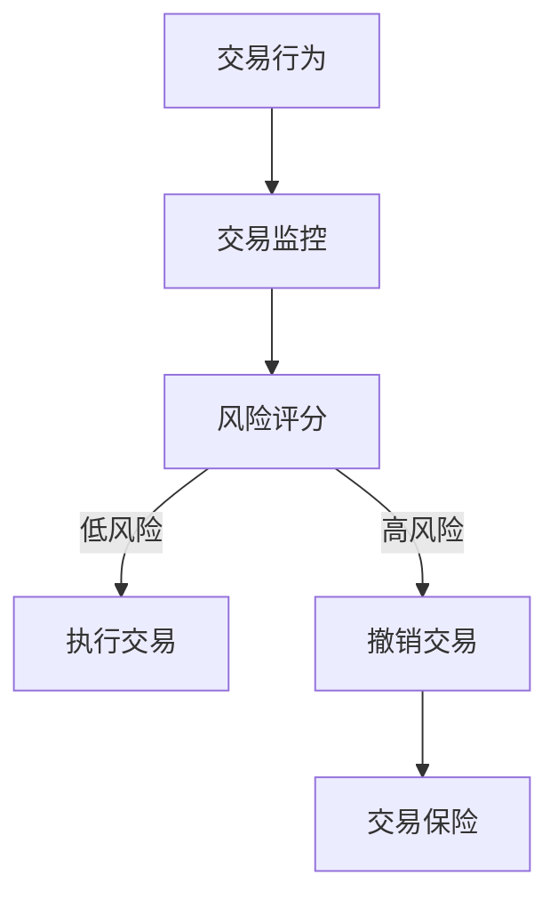

**解析：** 该架构示例展示了如何通过交易监控、风险评分、撤销交易和交易保险来处理异常交易和风险控制。

#### 6. 元宇宙交易所应如何处理交易数据的存储和查询？

**题目：** 元宇宙交易所应如何处理交易数据的存储和查询？

**答案：** 元宇宙交易所可以通过以下方式处理交易数据的存储和查询：

1. **分布式数据库：** 使用分布式数据库来存储交易数据，提高查询性能和扩展性。
2. **索引：** 使用索引来优化查询速度，确保快速访问交易数据。
3. **缓存：** 使用缓存来存储经常访问的交易数据，减少数据库的访问压力。
4. **分库分表：** 将交易数据拆分为多个数据库或表，以分布式的形式存储，提高查询性能。

**举例：**

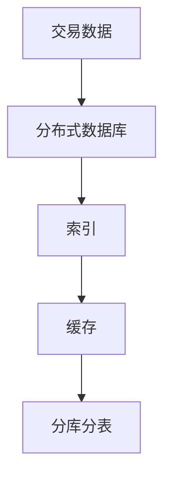

**解析：** 该架构示例展示了如何通过分布式数据库、索引、缓存和分库分表来处理交易数据的存储和查询。

#### 7. 元宇宙交易所如何确保数据隐私和安全？

**题目：** 元宇宙交易所应如何确保数据隐私和安全？

**答案：** 元宇宙交易所可以通过以下措施来确保数据隐私和安全：

1. **数据加密：** 使用加密算法来保护存储和传输的数据。
2. **访问控制：** 实施严格的访问控制策略，确保只有授权用户可以访问敏感数据。
3. **安全审计：** 定期进行安全审计，发现并修复安全漏洞。
4. **数据备份：** 定期备份数据，以防数据丢失。

**举例：**

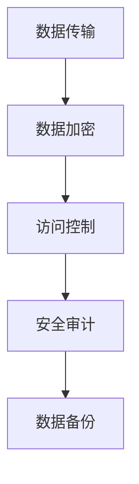

**解析：** 该架构示例展示了如何通过数据加密、访问控制、安全审计和数据备份来确保数据隐私和安全。

#### 8. 元宇宙交易所如何处理订单冲突和交易确认？

**题目：** 元宇宙交易所应如何处理订单冲突和交易确认？

**答案：** 元宇宙交易所可以通过以下措施来处理订单冲突和交易确认：

1. **顺序确保：** 通过确保订单的顺序来避免冲突。
2. **去中心化确认：** 利用区块链技术来去中心化地确认交易，确保交易的公正性。
3. **多重签名：** 使用多重签名来确保交易的合法性。
4. **定时确认：** 设置合理的确认时间，确保交易能够在规定时间内被确认。

**举例：**

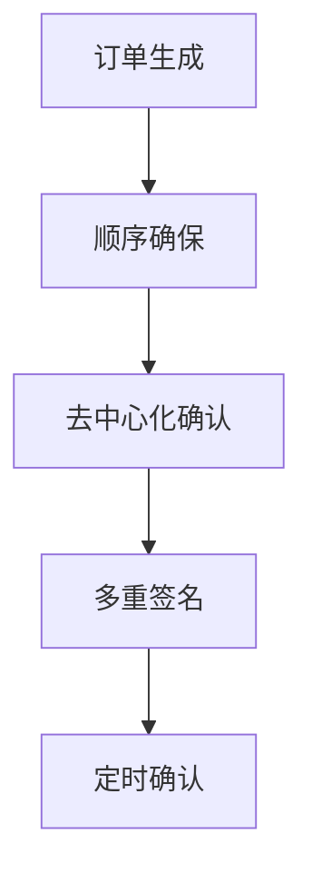

**解析：** 该架构示例展示了如何通过顺序确保、去中心化确认、多重签名和定时确认来处理订单冲突和交易确认。

#### 9. 元宇宙交易所应如何处理用户退款和争议解决？

**题目：** 元宇宙交易所应如何处理用户退款和争议解决？

**答案：** 元宇宙交易所可以通过以下措施来处理用户退款和争议解决：

1. **退款流程：** 设计清晰的退款流程，确保用户能够及时获得退款。
2. **争议解决机制：** 建立争议解决机制，如仲裁或调解，以解决用户之间的纠纷。
3. **用户反馈：** 提供用户反馈渠道，及时响应用户的需求和问题。
4. **合规性检查：** 定期检查交易合规性，防止欺诈和非法交易。

**举例：**

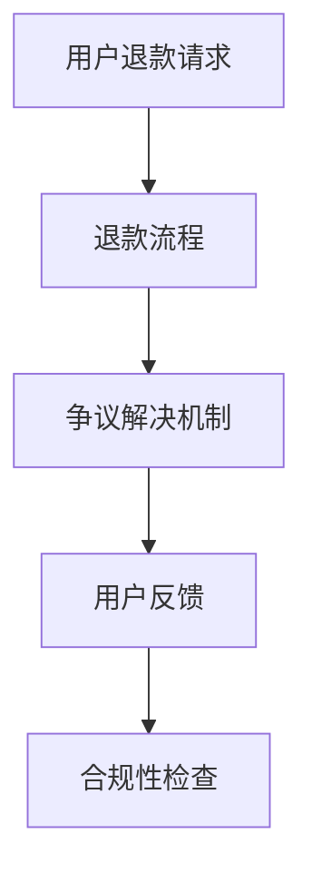

**解析：** 该架构示例展示了如何通过退款流程、争议解决机制、用户反馈和合规性检查来处理用户退款和争议解决。

#### 10. 元宇宙交易所应如何处理高频交易和机器人交易？

**题目：** 元宇宙交易所应如何处理高频交易和机器人交易？

**答案：** 元宇宙交易所可以通过以下措施来处理高频交易和机器人交易：

1. **流量控制：** 对高频交易和机器人交易进行流量控制，防止恶意攻击。
2. **交易规则：** 制定合理的交易规则，限制高频交易和机器人交易的行为。
3. **监控系统：** 实时监控高频交易和机器人交易的行为，及时发现并阻止异常交易。
4. **反作弊机制：** 引入反作弊机制，识别和阻止机器人交易。

**举例：**

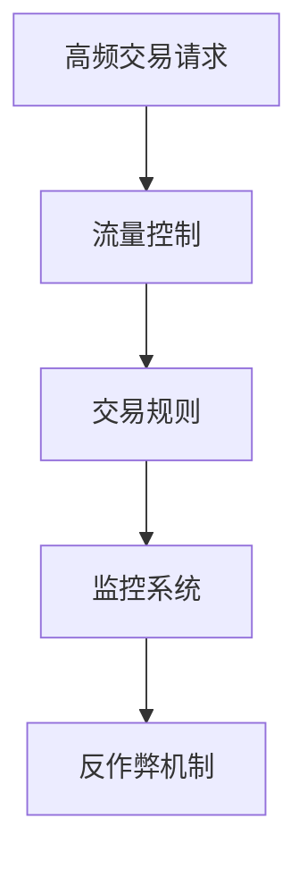

**解析：** 该架构示例展示了如何通过流量控制、交易规则、监控系统和反作弊机制来处理高频交易和机器人交易。

#### 11. 元宇宙交易所如何实现交易自动化和智能合约？

**题目：** 元宇宙交易所应如何实现交易自动化和智能合约？

**答案：** 元宇宙交易所可以通过以下措施来实现交易自动化和智能合约：

1. **API 接口：** 提供API接口，允许开发者创建和执行智能合约。
2. **区块链网络：** 利用区块链技术来记录交易，确保智能合约的可信性和不可篡改性。
3. **去中心化交易引擎：** 开发去中心化交易引擎，实现自动化交易。
4. **安全审计：** 对智能合约进行安全审计，确保合约的可靠性和安全性。

**举例：**

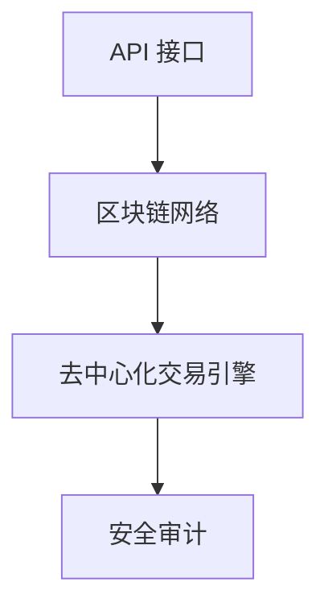

**解析：** 该架构示例展示了如何通过API接口、区块链网络、去中心化交易引擎和安全审计来实现交易自动化和智能合约。

#### 12. 元宇宙交易所应如何处理市场波动和风险管理？

**题目：** 元宇宙交易所应如何处理市场波动和风险管理？

**答案：** 元宇宙交易所可以通过以下措施来处理市场波动和风险管理：

1. **风险监控：** 实时监控市场波动，及时发现风险。
2. **风险预警：** 建立风险预警机制，提前通知可能的风险。
3. **风险控制策略：** 制定相应的风险控制策略，如止损、止盈等。
4. **保险：** 提供交易保险，降低用户因市场波动造成的损失。

**举例：**

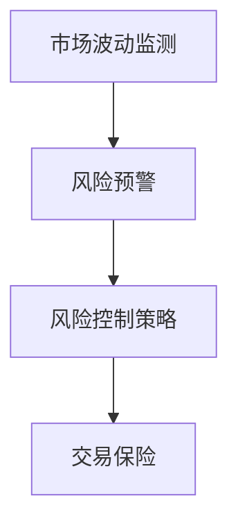

**解析：** 该架构示例展示了如何通过市场波动监测、风险预警、风险控制策略和交易保险来处理市场波动和风险管理。

#### 13. 元宇宙交易所应如何处理跨境交易和支付？

**题目：** 元宇宙交易所应如何处理跨境交易和支付？

**答案：** 元宇宙交易所可以通过以下措施来处理跨境交易和支付：

1. **跨境支付网关：** 开发跨境支付网关，支持多种货币的支付和结算。
2. **汇率管理：** 实时更新汇率信息，确保交易的公正性。
3. **合规性检查：** 遵守各国的金融法规，确保跨境交易的合法性。
4. **跨国合作：** 与国际金融机构合作，提高跨境交易的安全性。

**举例：**

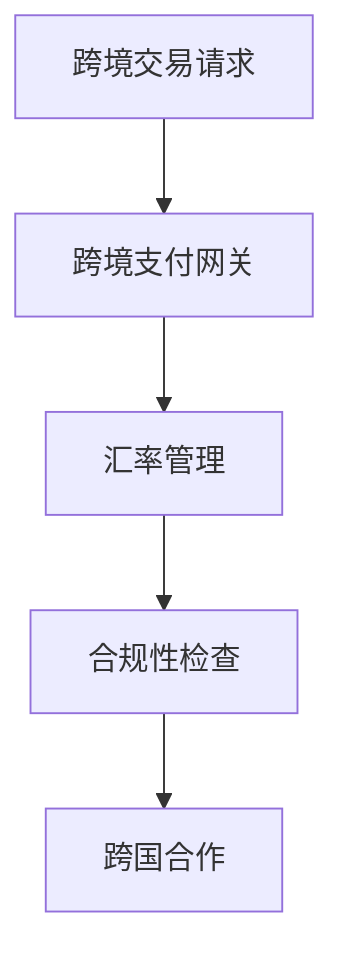

**解析：** 该架构示例展示了如何通过跨境支付网关、汇率管理、合规性检查和跨国合作来处理跨境交易和支付。

#### 14. 元宇宙交易所如何处理订单的执行和取消？

**题目：** 元宇宙交易所应如何处理订单的执行和取消？

**答案：** 元宇宙交易所可以通过以下措施来处理订单的执行和取消：

1. **订单执行机制：** 设计合理的订单执行机制，确保订单能够及时执行。
2. **订单取消机制：** 提供订单取消功能，允许用户取消未执行的订单。
3. **超时处理：** 设置订单的超时时间，超过超时时间的订单将被自动取消。
4. **反馈机制：** 提供订单执行和取消的反馈机制，确保用户及时了解订单状态。

**举例：**

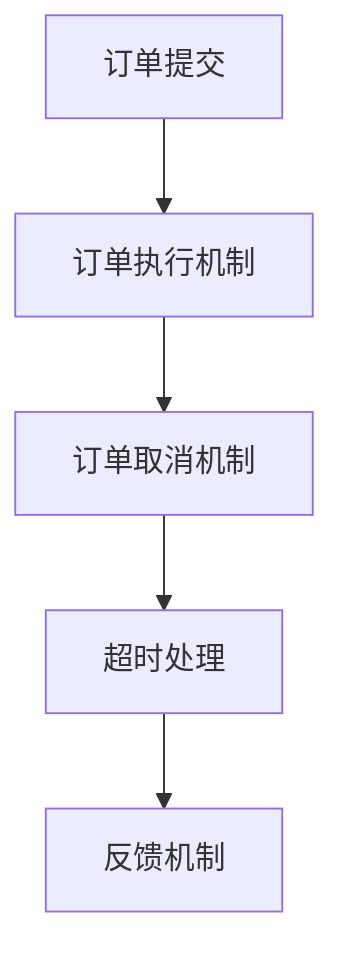

**解析：** 该架构示例展示了如何通过订单执行机制、订单取消机制、超时处理和反馈机制来处理订单的执行和取消。

#### 15. 元宇宙交易所应如何处理用户投诉和客服支持？

**题目：** 元宇宙交易所应如何处理用户投诉和客服支持？

**答案：** 元宇宙交易所可以通过以下措施来处理用户投诉和客服支持：

1. **投诉处理流程：** 设计清晰的投诉处理流程，确保用户的问题能够及时得到解决。
2. **客服系统：** 建立完善的客服系统，提供在线客服和电话客服等多种服务方式。
3. **反馈机制：** 提供用户反馈渠道，收集用户对交易所的意见和建议。
4. **培训和支持：** 定期为客服团队提供培训，提高客服质量。

**举例：**

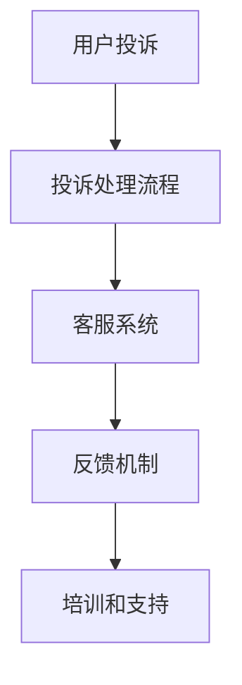

**解析：** 该架构示例展示了如何通过投诉处理流程、客服系统、反馈机制和培训支持来处理用户投诉和客服支持。

#### 16. 元宇宙交易所应如何处理数据分析和报告？

**题目：** 元宇宙交易所应如何处理数据分析和报告？

**答案：** 元宇宙交易所可以通过以下措施来处理数据分析和报告：

1. **数据分析工具：** 使用数据分析工具，如 Excel、Python 等，对交易数据进行深入分析。
2. **报告生成：** 定期生成交易报告，包括交易量、交易对、用户行为等。
3. **可视化：** 使用可视化工具，如 Tableau、Power BI 等，将数据以图表和报表的形式展示。
4. **用户自定义报告：** 提供用户自定义报告功能，满足用户对特定数据的分析需求。

**举例：**

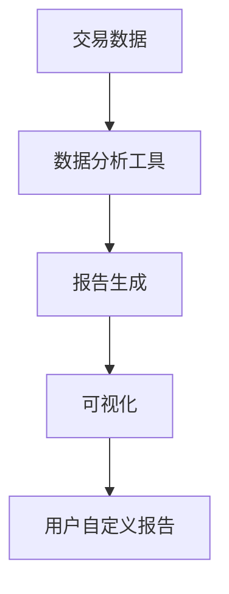

**解析：** 该架构示例展示了如何通过数据分析工具、报告生成、可视化和用户自定义报告来处理数据分析和报告。

#### 17. 元宇宙交易所应如何处理网络安全和防护？

**题目：** 元宇宙交易所应如何处理网络安全和防护？

**答案：** 元宇宙交易所可以通过以下措施来处理网络安全和防护：

1. **网络安全系统：** 建立网络安全系统，包括防火墙、入侵检测系统等。
2. **数据加密：** 使用数据加密技术，保护交易数据的隐私和安全。
3. **安全审计：** 定期进行安全审计，发现并修复潜在的安全漏洞。
4. **应急响应：** 制定应急预案，确保在发生安全事件时能够迅速响应。

**举例：**

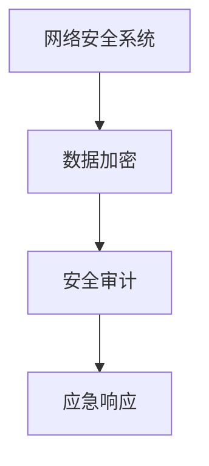

**解析：** 该架构示例展示了如何通过网络安全系统、数据加密、安全审计和应急响应来处理网络安全和防护。

#### 18. 元宇宙交易所应如何处理用户教育和培训？

**题目：** 元宇宙交易所应如何处理用户教育和培训？

**答案：** 元宇宙交易所可以通过以下措施来处理用户教育和培训：

1. **在线教程：** 提供在线教程，帮助用户了解交易所的功能和使用方法。
2. **培训课程：** 定期举办培训课程，提高用户对交易策略和市场分析的理解。
3. **用户论坛：** 建立用户论坛，鼓励用户交流和分享经验。
4. **客服支持：** 提供专业的客服支持，帮助用户解决使用过程中的问题。

**举例：**

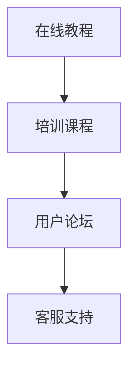

**解析：** 该架构示例展示了如何通过在线教程、培训课程、用户论坛和客服支持来处理用户教育和培训。

#### 19. 元宇宙交易所应如何处理交易税和合规性？

**题目：** 元宇宙交易所应如何处理交易税和合规性？

**答案：** 元宇宙交易所可以通过以下措施来处理交易税和合规性：

1. **税务合规性：** 与税务机构合作，确保交易的税务合规性。
2. **合规性检查：** 定期进行合规性检查，确保交易所的运营符合相关法律法规。
3. **税务报告：** 定期生成税务报告，向税务机构报告交易情况。
4. **用户认证：** 对用户进行认证，确保交易的合法性和透明性。

**举例：**

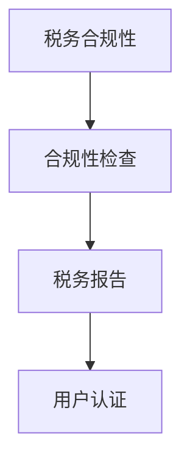

**解析：** 该架构示例展示了如何通过税务合规性、合规性检查、税务报告和用户认证来处理交易税和合规性。

#### 20. 元宇宙交易所如何处理用户账户安全？

**题目：** 元宇宙交易所应如何处理用户账户安全？

**答案：** 元宇宙交易所可以通过以下措施来处理用户账户安全：

1. **双因素认证：** 引入双因素认证（2FA），提高账户的安全性。
2. **账户锁定机制：** 在账户出现异常活动时，自动锁定账户，防止未经授权的访问。
3. **安全审计：** 定期进行安全审计，发现并修复安全漏洞。
4. **密码策略：** 制定严格的密码策略，要求用户使用复杂密码。

**举例：**

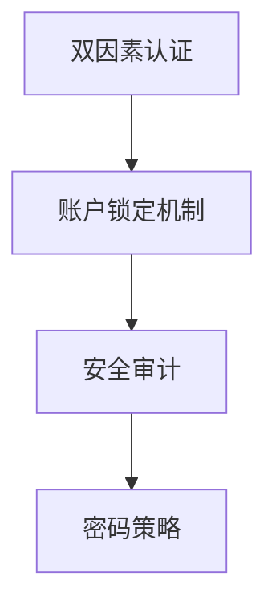

**解析：** 该架构示例展示了如何通过双因素认证、账户锁定机制、安全审计和密码策略来处理用户账户安全。

#### 21. 元宇宙交易所应如何处理交易速度和延迟？

**题目：** 元宇宙交易所应如何处理交易速度和延迟？

**答案：** 元宇宙交易所可以通过以下措施来处理交易速度和延迟：

1. **网络优化：** 优化交易所的网络架构，提高交易速度。
2. **缓存机制：** 使用缓存机制，减少数据的重复处理，降低延迟。
3. **负载均衡：** 使用负载均衡器，将交易请求分配到不同的服务器上，减少单点延迟。
4. **分布式处理：** 将交易处理分布到多个节点上，提高并发处理能力。

**举例：**

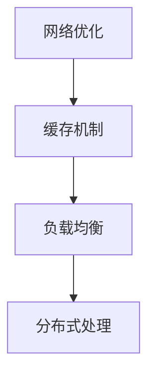

**解析：** 该架构示例展示了如何通过网络优化、缓存机制、负载均衡和分布式处理来处理交易速度和延迟。

#### 22. 元宇宙交易所应如何处理数据备份和恢复？

**题目：** 元宇宙交易所应如何处理数据备份和恢复？

**答案：** 元宇宙交易所可以通过以下措施来处理数据备份和恢复：

1. **定期备份：** 定期对交易数据进行备份，确保数据的安全性和完整性。
2. **异地备份：** 在不同的地理位置进行数据备份，防止因自然灾害等原因导致的数据丢失。
3. **恢复策略：** 制定数据恢复策略，确保在数据丢失或损坏时能够迅速恢复。
4. **测试和验证：** 定期测试备份和恢复策略，确保其有效性。

**举例：**

```mermaid
graph TD
    A[定期备份] --> B[异地备份]
    B --> C[恢复策略]
    C --> D[测试和验证]
```

**解析：** 该架构示例展示了如何通过定期备份、异地备份、恢复策略和测试验证来处理数据备份和恢复。

#### 23. 元宇宙交易所应如何处理交易纠纷和争议解决？

**题目：** 元宇宙交易所应如何处理交易纠纷和争议解决？

**答案：** 元宇宙交易所可以通过以下措施来处理交易纠纷和争议解决：

1. **争议解决机制：** 建立争议解决机制，如仲裁或调解，帮助用户解决交易纠纷。
2. **用户反馈：** 提供用户反馈渠道，收集用户对交易所的意见和建议。
3. **透明度：** 提高交易所运营的透明度，让用户了解交易过程和结果。
4. **法律支持：** 提供法律支持，协助用户解决复杂的交易纠纷。

**举例：**

```mermaid
graph TD
    A[争议解决机制] --> B[用户反馈]
    B --> C[透明度]
    C --> D[法律支持]
```

**解析：** 该架构示例展示了如何通过争议解决机制、用户反馈、透明度和法律支持来处理交易纠纷和争议解决。

#### 24. 元宇宙交易所如何处理冷热钱包管理？

**题目：** 元宇宙交易所应如何处理冷热钱包管理？

**答案：** 元宇宙交易所可以通过以下措施来处理冷热钱包管理：

1. **冷钱包：** 将大部分资产存储在冷钱包中，确保资产的安全。
2. **热钱包：** 将少量资产存储在热钱包中，用于日常交易和支付。
3. **备份：** 对冷钱包和热钱包进行备份，确保在出现问题时能够迅速恢复。
4. **安全措施：** 对冷钱包和热钱包进行安全措施，如双因素认证、加密等。

**举例：**

```mermaid
graph TD
    A[冷钱包] --> B[热钱包]
    B --> C[备份]
    C --> D[安全措施]
```

**解析：** 该架构示例展示了如何通过冷钱包、热钱包、备份和安全措施来处理冷热钱包管理。

#### 25. 元宇宙交易所应如何处理用户资金保护？

**题目：** 元宇宙交易所应如何处理用户资金保护？

**答案：** 元宇宙交易所可以通过以下措施来处理用户资金保护：

1. **资金隔离：** 将用户资金与交易所资金隔离，确保用户资金的安全。
2. **保险：** 提供交易保险，降低用户因交易所问题造成的资金损失。
3. **监管：** 遵守相关金融监管法规，确保交易所的合法性和合规性。
4. **用户认证：** 对用户进行认证，确保用户的资金来源合法。

**举例：**

```mermaid
graph TD
    A[资金隔离] --> B[保险]
    B --> C[监管]
    C --> D[用户认证]
```

**解析：** 该架构示例展示了如何通过资金隔离、保险、监管和用户认证来处理用户资金保护。

#### 26. 元宇宙交易所如何处理交易订单的取消和修改？

**题目：** 元宇宙交易所应如何处理交易订单的取消和修改？

**答案：** 元宇宙交易所可以通过以下措施来处理交易订单的取消和修改：

1. **订单取消：** 提供订单取消功能，允许用户在订单执行前取消订单。
2. **订单修改：** 提供订单修改功能，允许用户在订单执行前修改订单参数。
3. **超时处理：** 设置订单的超时时间，超过超时时间的订单将被自动取消或修改。
4. **用户通知：** 在订单取消或修改后，及时通知用户。

**举例：**

```mermaid
graph TD
    A[订单提交] --> B[订单取消]
    B --> C[订单修改]
    C --> D[超时处理]
    D --> E[用户通知]
```

**解析：** 该架构示例展示了如何通过订单取消、订单修改、超时处理和用户通知来处理交易订单的取消和修改。

#### 27. 元宇宙交易所应如何处理交易对和交易市场？

**题目：** 元宇宙交易所应如何处理交易对和交易市场？

**答案：** 元宇宙交易所可以通过以下措施来处理交易对和交易市场：

1. **交易对：** 提供多种交易对，满足不同用户的需求。
2. **交易市场：** 建立完善的市场体系，包括交易区、行情中心等。
3. **交易规则：** 制定合理的交易规则，确保交易的公平和透明。
4. **市场监控：** 实时监控市场动态，及时发现市场异常。

**举例：**

```mermaid
graph TD
    A[交易对] --> B[交易市场]
    B --> C[交易规则]
    C --> D[市场监控]
```

**解析：** 该架构示例展示了如何通过交易对、交易市场、交易规则和市场监控来处理交易对和交易市场。

#### 28. 元宇宙交易所如何处理交易费用和提成？

**题目：** 元宇宙交易所应如何处理交易费用和提成？

**答案：** 元宇宙交易所可以通过以下措施来处理交易费用和提成：

1. **交易费用：** 设定合理的交易费用，包括交易对费用、提现费用等。
2. **提成制度：** 对交易所的贡献者，如交易员、推广员等，设定提成制度。
3. **透明度：** 提高交易费用和提成的透明度，让用户了解费用和提成的计算方式。
4. **优化：** 定期评估交易费用和提成制度，根据市场情况进行优化。

**举例：**

```mermaid
graph TD
    A[交易费用] --> B[提成制度]
    B --> C[透明度]
    C --> D[优化]
```

**解析：** 该架构示例展示了如何通过交易费用、提成制度、透明度和优化来处理交易费用和提成。

#### 29. 元宇宙交易所如何处理用户教育和市场推广？

**题目：** 元宇宙交易所应如何处理用户教育和市场推广？

**答案：** 元宇宙交易所可以通过以下措施来处理用户教育和市场推广：

1. **在线教育：** 提供在线教育课程，帮助用户了解交易所和交易策略。
2. **市场推广：** 通过广告、社交媒体、线下活动等方式进行市场推广。
3. **用户社区：** 建立用户社区，促进用户之间的交流和互动。
4. **合作伙伴：** 与其他元宇宙平台合作，扩大用户基础。

**举例：**

```mermaid
graph TD
    A[在线教育] --> B[市场推广]
    B --> C[用户社区]
    C --> D[合作伙伴]
```

**解析：** 该架构示例展示了如何通过在线教育、市场推广、用户社区和合作伙伴来处理用户教育和市场推广。

#### 30. 元宇宙交易所如何处理交易分析和研究？

**题目：** 元宇宙交易所应如何处理交易分析和研究？

**答案：** 元宇宙交易所可以通过以下措施来处理交易分析和研究：

1. **数据分析：** 利用大数据和人工智能技术进行交易数据分析，发现市场趋势。
2. **研究报告：** 定期发布研究报告，分析市场动态和交易趋势。
3. **技术分析：** 提供技术分析工具，帮助用户进行交易决策。
4. **研究团队：** 组建专业的交易研究团队，进行市场研究和策略开发。

**举例：**

```mermaid
graph TD
    A[数据分析] --> B[研究报告]
    B --> C[技术分析]
    C --> D[研究团队]
```

**解析：** 该架构示例展示了如何通过数据分析、研究报告、技术分析和研究团队来处理交易分析和研究。

