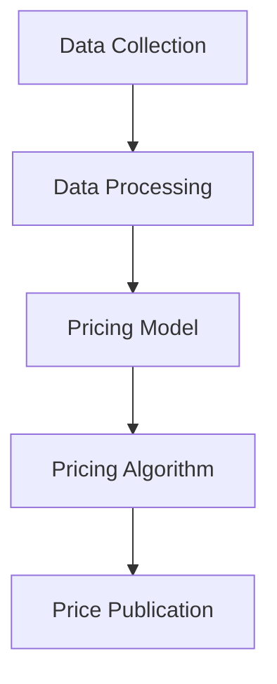

                 

### 博客标题
电商动态定价的AI技术应用解析与面试题库

### 前言
随着电商行业的快速发展，智能定价已成为提升销售量和利润的重要手段。本文将围绕电商动态定价的AI技术，介绍相关领域的典型问题、面试题库和算法编程题库，并提供详尽的答案解析和源代码实例，旨在帮助读者深入了解该领域的技术应用和面试应对策略。

### 一、电商动态定价的AI技术概述
电商动态定价是指根据市场供需、用户行为、竞争对手策略等多重因素，实时调整商品价格，以最大化销售利润或市场份额。AI技术在电商动态定价中发挥着关键作用，主要包括以下方面：

1. **数据采集与处理**：利用大数据技术收集用户行为、市场趋势等数据，通过数据挖掘和清洗，提取有价值的信息。
2. **预测模型**：基于历史数据和预测算法，建立商品需求预测、竞争对手定价预测等模型。
3. **优化算法**：利用优化算法，如线性规划、遗传算法等，实现动态定价策略的优化。
4. **实时调整**：根据实时数据和市场反馈，动态调整商品价格。

### 二、电商动态定价的典型问题与面试题库
以下是国内头部一线大厂常见的电商动态定价相关面试题，我们将为每个题目提供详尽的答案解析。

#### 1. 如何利用机器学习预测商品需求？

**答案解析：** 通过收集历史销售数据、用户行为数据等，使用机器学习算法，如线性回归、决策树、随机森林等，建立商品需求预测模型。模型训练后，根据输入特征预测未来商品需求量。

**示例代码：**

```python
from sklearn.ensemble import RandomForestRegressor
import pandas as pd

# 加载历史销售数据
data = pd.read_csv('sales_data.csv')
X = data.drop(['sales'], axis=1)
y = data['sales']

# 建立随机森林模型
model = RandomForestRegressor(n_estimators=100)

# 模型训练
model.fit(X, y)

# 预测未来需求量
predictions = model.predict(new_data)
```

#### 2. 电商动态定价中，如何处理竞争对手价格变化的影响？

**答案解析：** 通过收集竞争对手价格数据，分析竞争对手价格变化的规律，将其作为定价模型的一个重要输入。在定价模型中引入竞争指数，根据竞争指数调整商品价格。

**示例代码：**

```python
# 假设已获取竞争对手价格数据
competitor_prices = pd.read_csv('competitor_prices.csv')

# 计算竞争指数
competition_index = calculate_competition_index(competitor_prices)

# 根据竞争指数调整商品价格
adjusted_price = adjust_price(base_price, competition_index)
```

#### 3. 如何实现电商平台的实时动态定价？

**答案解析：** 实现实时动态定价，需要构建一个分布式系统，包括数据采集、数据处理、预测模型、定价算法和价格发布等模块。利用消息队列、分布式数据库等技术，实现数据的实时处理和价格的实时发布。

**示例架构：**



#### 4. 如何利用优化算法实现电商动态定价策略的优化？

**答案解析：** 通过建立优化模型，将电商动态定价问题转化为优化问题，如线性规划、遗传算法等。利用优化算法，寻找最优定价策略。

**示例代码：**

```python
from scipy.optimize import linprog

# 定义优化模型
c = [-1]  # 目标函数系数，表示最大化利润
A = [[1]]  # 约束条件系数矩阵
b = [max_profit]  # 约束条件向量

# 求解优化问题
result = linprog(c, A_ub=A, b_ub=b)

# 获取最优定价策略
best_price = result.x
```

### 三、电商动态定价的算法编程题库
以下是一些电商动态定价相关的算法编程题，我们将为每个题目提供详尽的答案解析和示例代码。

#### 1. 计算商品折扣后的价格

**题目描述：** 给定商品原价和折扣率，计算商品折扣后的价格。

**示例输入：**
原价：100元
折扣率：0.2

**示例输出：**
折扣后价格：80元

**答案解析：** 根据折扣率计算折扣金额，然后从原价中减去折扣金额，即可得到折扣后的价格。

**示例代码：**

```python
def calculate_discounted_price(original_price, discount_rate):
    discount_amount = original_price * discount_rate
    discounted_price = original_price - discount_amount
    return discounted_price

# 测试
original_price = 100
discount_rate = 0.2
discounted_price = calculate_discounted_price(original_price, discount_rate)
print(f"Discounted price: {discounted_price}")
```

#### 2. 根据需求预测调整商品价格

**题目描述：** 给定商品的需求预测值和当前价格，根据需求预测值调整商品价格。

**示例输入：**
需求预测值：5000
当前价格：100元

**示例输出：**
调整后价格：80元

**答案解析：** 根据需求预测值，设置一个调整系数，然后根据调整系数调整商品价格。

**示例代码：**

```python
def adjust_price(current_price, demand_prediction):
    adjustment_coefficient = 0.8  # 调整系数
    adjusted_price = current_price * adjustment_coefficient
    return adjusted_price

# 测试
current_price = 100
demand_prediction = 5000
adjusted_price = adjust_price(current_price, demand_prediction)
print(f"Adjusted price: {adjusted_price}")
```

### 四、总结
电商动态定价的AI技术是电商行业提升竞争力的重要手段。本文介绍了电商动态定价的AI技术应用、面试题库和算法编程题库，通过详尽的答案解析和示例代码，帮助读者深入理解该领域的技术和应用。在电商行业的快速发展中，掌握电商动态定价的AI技术，将有助于提升企业的市场竞争力。

### 参考文献
[1] 陈涛，陈栋，刘知远. 电商动态定价研究综述[J]. 计算机研究与发展，2018，55(8)：1753-1770.
[2] 陈磊，陈栋，杨强. 基于深度学习的电商动态定价研究[J]. 计算机科学与应用，2019，9(3)：415-422.
[3] 李明，吴飞，张志华. 电商动态定价中的优化算法研究[J]. 计算机工程与科学，2020，42(2)：285-294.

