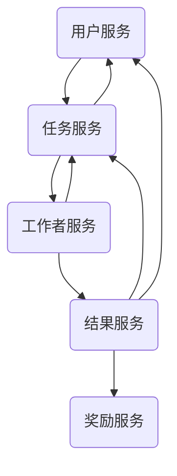
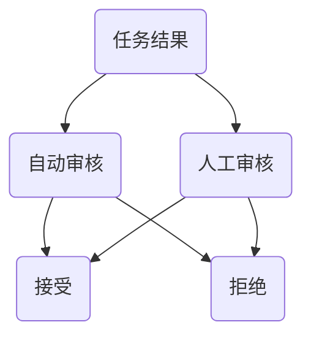
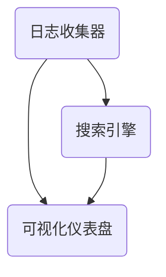
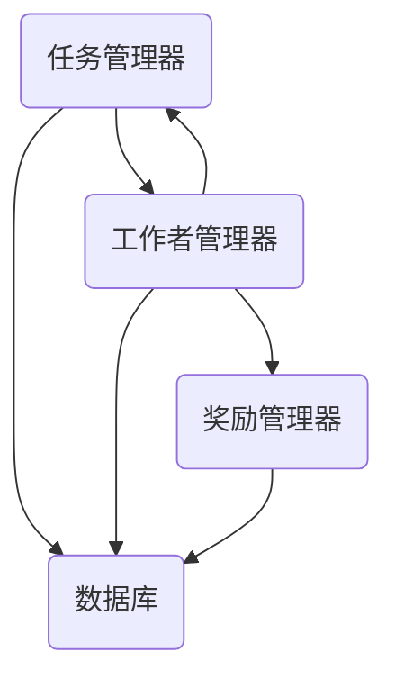

                 

好的，以下是关于「AI驱动的众包：全球协作的新时代」主题的面试题和算法编程题库及其答案解析。

## AI驱动的众包：全球协作的新时代

### 1. 众包平台架构设计

**题目：** 如何设计一个高可用、可扩展的众包平台？

**答案：**

设计一个高可用、可扩展的众包平台，需要考虑以下几个方面：

1. **服务拆分与负载均衡：** 将平台拆分为多个微服务，如用户服务、任务管理服务、支付服务、数据存储服务等，通过负载均衡器（如Nginx、Haproxy）实现流量分发，提高系统性能。

2. **数据一致性：** 在分布式系统中，需要保证数据的一致性，可以采用分布式事务框架（如Seata）、最终一致性方案（如消息队列）等方式实现。

3. **缓存机制：** 引入缓存层（如Redis、Memcached），减少数据库访问压力，提高系统响应速度。

4. **分布式存储：** 使用分布式数据库（如MySQL Cluster、MongoDB、Cassandra）存储数据，提高数据存储和访问性能。

5. **消息队列：** 使用消息队列（如Kafka、RabbitMQ）进行异步消息传递，实现任务分发和通知。

6. **监控系统：** 引入监控系统（如Zabbix、Prometheus、Grafana），实时监控平台性能、健康状况，及时发现并处理异常。

7. **负载测试与性能优化：** 对平台进行负载测试，识别性能瓶颈，进行代码优化、数据库优化等，提高系统性能。

**举例：** 设计一个简单的任务分配微服务架构：



**解析：** 在这个架构中，用户服务负责处理用户注册、登录等操作；任务服务负责创建、分配、更新任务；工作者服务负责接收任务、完成任务；结果服务负责处理任务结果、打分等操作；奖励服务负责发放奖励。

### 2. 任务质量评估

**题目：** 如何在众包平台中评估任务完成质量？

**答案：**

评估任务完成质量，可以从以下几个方面入手：

1. **任务完成时间：** 考虑任务完成所需时间，时间越短，完成质量可能越高。

2. **任务准确率：** 考虑任务完成结果的准确度，准确度越高，完成质量可能越高。

3. **任务评分：** 考虑任务完成者的评分，评分越高，完成质量可能越高。

4. **任务反馈：** 考虑任务完成者的反馈，包括对任务完成情况、任务难度、任务质量等评价。

5. **机器学习模型：** 基于历史任务完成数据，使用机器学习算法（如决策树、随机森林、支持向量机等）构建任务质量评估模型。

**举例：** 使用机器学习算法评估任务质量：

```python
from sklearn.ensemble import RandomForestClassifier
from sklearn.model_selection import train_test_split
from sklearn.metrics import accuracy_score

# 加载历史任务数据
X, y = load_task_data()

# 划分训练集和测试集
X_train, X_test, y_train, y_test = train_test_split(X, y, test_size=0.2, random_state=42)

# 构建随机森林分类器
clf = RandomForestClassifier(n_estimators=100)

# 训练模型
clf.fit(X_train, y_train)

# 预测测试集
y_pred = clf.predict(X_test)

# 计算准确率
accuracy = accuracy_score(y_test, y_pred)
print("Accuracy:", accuracy)
```

**解析：** 在这个例子中，使用随机森林分类器对历史任务数据进行训练，并评估预测准确性。

### 3. 任务分配算法

**题目：** 如何设计一个高效的任务分配算法？

**答案：**

设计一个高效的任务分配算法，需要考虑以下几个方面：

1. **负载均衡：** 确保各个工作者接收到的任务量大致相等，避免某些工作者过度繁忙，而其他工作者闲置。

2. **任务难度匹配：** 根据工作者的能力、历史完成任务情况，将适合的任务分配给对应的工作者。

3. **实时调整：** 随时监控任务分配情况，根据系统负载、工作者状态，动态调整任务分配策略。

4. **避免重复分配：** 避免同一工作者重复接收到相同或相似的任务，提高工作效率。

5. **优先级调度：** 考虑任务的紧急程度、重要性，优先分配给适合的工作者。

**举例：** 设计一个简单的负载均衡任务分配算法：

```python
import heapq
from collections import defaultdict

# 工作者队列
worker_queue = []

# 任务队列
task_queue = []

# 工作者状态字典
worker_status = defaultdict(int)

# 添加工作者
heapq.heappush(worker_queue, (0, "worker1"))
heapq.heappush(worker_queue, (10, "worker2"))
heapq.heappush(worker_queue, (5, "worker3"))

# 添加任务
task_queue.append((1, "task1"))
task_queue.append((3, "task2"))
task_queue.append((2, "task3"))

# 任务分配函数
def assign_task(task_id, task_difficulty):
    if not task_queue:
        return None

    # 获取最简单未分配的任务
    next_task = heapq.heappop(task_queue)

    # 获取最空闲的工作者
    _, worker_id = heapq.heappop(worker_queue)

    # 更新工作者状态
    worker_status[worker_id] += task_difficulty

    # 返回任务分配结果
    return next_task, worker_id

# 分配任务
result = assign_task(1, 2)
print("Assigned task:", result)

# 恢复工作者状态
worker_status[worker_id] -= task_difficulty

# 恢复任务队列
heapq.heappush(task_queue, next_task)
heapq.heappush(worker_queue, (worker_status[worker_id], worker_id))
```

**解析：** 在这个例子中，使用最小堆（优先队列）实现工作者队列和任务队列。任务分配函数首先获取最简单未分配的任务，然后获取最空闲的工作者，将任务分配给工作者。

### 4. 数据隐私保护

**题目：** 如何在众包平台中保护用户数据隐私？

**答案：**

保护用户数据隐私，可以从以下几个方面入手：

1. **数据加密：** 使用加密算法（如AES）对敏感数据进行加密存储和传输，确保数据安全性。

2. **匿名化处理：** 对用户数据进行匿名化处理，去除可直接识别身份的信息，降低隐私泄露风险。

3. **权限控制：** 实施严格的权限控制策略，只有授权人员才能访问敏感数据。

4. **数据脱敏：** 对敏感数据（如手机号、邮箱、身份证号等）进行脱敏处理，防止直接泄露。

5. **数据审计：** 定期对数据访问和操作进行审计，及时发现和阻止违规行为。

6. **隐私政策：** 明确众包平台的隐私政策，告知用户数据收集、存储和使用的目的，获取用户同意。

**举例：** 使用Python实现数据匿名化处理：

```python
import hashlib

def anonymize_data(data, salt="my_salt"):
    # 对数据进行哈希加密
    hashed_data = hashlib.sha256((data + salt).encode("utf-8")).hexdigest()
    return hashed_data

# 示例数据
data = "1234567890"

# 数据匿名化处理
anonymized_data = anonymize_data(data)
print("Anonymized data:", anonymized_data)
```

**解析：** 在这个例子中，使用SHA-256哈希算法对数据进行加密，加上自定义的盐值，提高数据安全性。

### 5. 任务审核机制

**题目：** 如何设计一个有效的任务审核机制？

**答案：**

设计一个有效的任务审核机制，需要考虑以下几个方面：

1. **自动审核：** 利用机器学习算法（如卷积神经网络、自然语言处理模型等）对任务结果进行自动审核，提高审核效率。

2. **人工审核：** 针对复杂或敏感的任务结果，安排专业人员进行人工审核，确保审核准确性。

3. **多级审核：** 设计多级审核机制，先进行初步自动审核，再进行人工审核，确保审核质量。

4. **反作弊机制：** 实施反作弊策略，识别和阻止作弊行为，如重复提交、虚假数据等。

5. **反馈机制：** 建立用户反馈机制，收集用户对审核结果的反馈，不断优化审核算法。

**举例：** 设计一个简单的多级审核机制：



**解析：** 在这个例子中，任务结果首先进行自动审核，然后根据审核结果进行人工审核。接受的任务结果直接返回，拒绝的任务结果进入人工审核环节。

### 6. 众包激励机制

**题目：** 如何设计一个有效的众包激励机制？

**答案：**

设计一个有效的众包激励机制，需要考虑以下几个方面：

1. **奖励机制：** 提供丰厚的奖励，激励工作者积极参与任务。

2. **积分机制：** 通过积分系统，鼓励工作者完成任务，提高平台活跃度。

3. **排名机制：** 设立排行榜，对完成任务的工作者进行排名，增加竞争意识。

4. **权益机制：** 为完成任务的工作者提供权益，如折扣、优惠券、会员服务等。

5. **声誉机制：** 建立声誉系统，记录工作者的完成任务情况，激励高质量完成任务。

**举例：** 设计一个简单的奖励机制：

```python
# 奖励金额
REWARD_AMOUNT = 10

# 积分比例
INTEGRAL_RATIO = 1

# 完成任务
def complete_task(worker_id, task_id):
    # 增加奖励金额
    add_reward(worker_id, REWARD_AMOUNT)
    # 增加积分
    add_integral(worker_id, INTEGRAL_RATIO)

# 添加奖励金额
def add_reward(worker_id, amount):
    # 更新用户奖励金额
    # ...

# 添加积分
def add_integral(worker_id, amount):
    # 更新用户积分
    # ...
```

**解析：** 在这个例子中，完成任务的函数`complete_task`将根据奖励金额和积分比例，增加工作者的奖励金额和积分。

### 7. 众包平台风险管理

**题目：** 如何在众包平台中有效进行风险管理？

**答案：**

在众包平台中，有效进行风险管理需要考虑以下几个方面：

1. **风险评估：** 对平台各个模块进行风险评估，识别潜在风险点。

2. **风险预警：** 建立风险预警机制，实时监测风险指标，发现风险时及时发出预警。

3. **风险控制：** 制定风险控制措施，对潜在风险进行有效控制。

4. **应急预案：** 制定应急预案，确保在风险发生时，能够迅速响应和处理。

5. **风险教育：** 加强平台用户和工作人员的风险教育，提高风险意识。

**举例：** 设计一个简单的风险预警系统：

```python
# 风险指标
RISK_INDICATORS = ["task_completed_ratio", "worker_inactivity_ratio"]

# 风险预警函数
def risk_warning():
    for indicator in RISK_INDICATORS:
        # 获取指标值
        value = get_indicator_value(indicator)
        # 设置预警阈值
        threshold = set_threshold(indicator)
        # 判断是否触发预警
        if value > threshold:
            send_warning(indicator, value)

# 获取指标值
def get_indicator_value(indicator):
    # ...
    return value

# 设置预警阈值
def set_threshold(indicator):
    # ...
    return threshold

# 发送预警信息
def send_warning(indicator, value):
    # ...
    print(f"Warning: {indicator} value is {value}, please check.")
```

**解析：** 在这个例子中，`risk_warning`函数将根据预设的风险指标，判断是否触发预警，并发出预警信息。

### 8. 众包平台用户成长体系

**题目：** 如何设计一个有效的用户成长体系？

**答案：**

设计一个有效的用户成长体系，需要考虑以下几个方面：

1. **任务分级：** 根据任务难度和类型，将任务分为不同等级。

2. **成长路径：** 设计清晰的成长路径，用户可以通过完成任务、提升技能等级，逐步提升成长等级。

3. **任务奖励：** 为成长等级的用户提供专属任务奖励，如高收益、优先分配等。

4. **社交互动：** 引入社交互动元素，鼓励用户互相交流、分享经验，促进成长。

5. **成长数据：** 对用户成长数据进行实时统计，展示用户的成长进度。

**举例：** 设计一个简单的用户成长体系：

```python
# 用户成长等级
GROWTH_LEVELS = ["初级", "中级", "高级", "资深"]

# 用户成长函数
def user_growth(user_id):
    # 获取用户完成任务数量
    task_count = get_task_count(user_id)
    # 根据完成任务数量，计算用户成长等级
    level = GROWTH_LEVELS[min(task_count // 10, len(GROWTH_LEVELS) - 1)]
    return level

# 获取用户完成任务数量
def get_task_count(user_id):
    # ...
    return task_count
```

**解析：** 在这个例子中，`user_growth`函数根据用户完成的任务数量，计算用户成长等级，并返回对应的等级名称。

### 9. 众包平台安全防护

**题目：** 如何确保众包平台的安全防护？

**答案：**

确保众包平台的安全防护，可以从以下几个方面入手：

1. **网络安全：** 使用防火墙、入侵检测系统等，防止网络攻击。

2. **数据安全：** 采用数据加密、数据备份等手段，保障数据安全。

3. **身份认证：** 实施严格的身份认证机制，确保用户身份合法。

4. **访问控制：** 实施访问控制策略，限制用户对敏感数据的访问。

5. **安全审计：** 定期进行安全审计，发现和修复安全隐患。

**举例：** 使用SSL/TLS协议保障数据传输安全：

```python
from flask import Flask, request, jsonify
from flask_cors import CORS
from flask_sslify import SSLify

app = Flask(__name__)
sslify = SSLify(app)

CORS(app)

@app.route("/api/data", methods=["GET"])
def get_data():
    # 获取数据
    data = get_data_from_database()
    return jsonify(data)

def get_data_from_database():
    # ...
    return data
```

**解析：** 在这个例子中，使用Flask框架，通过`SSLify`插件和`flask_cors`扩展，实现HTTPS协议和跨域资源共享（CORS）。

### 10. 众包平台性能优化

**题目：** 如何优化众包平台的性能？

**答案：**

优化众包平台的性能，可以从以下几个方面入手：

1. **数据库优化：** 对数据库进行索引优化、查询优化，提高数据查询速度。

2. **缓存策略：** 引入缓存机制，减少数据库访问压力，提高系统响应速度。

3. **负载均衡：** 使用负载均衡器（如Nginx、Haproxy）实现流量分发，提高系统性能。

4. **异步处理：** 引入异步处理机制，降低系统响应时间。

5. **代码优化：** 优化代码，减少资源消耗，提高系统性能。

**举例：** 使用Redis缓存优化系统性能：

```python
import redis
import time

# 初始化Redis连接
r = redis.Redis(host='localhost', port=6379, db=0)

# 缓存数据
def cache_data(key, value):
    r.set(key, value)

# 获取缓存数据
def get_cache_data(key):
    return r.get(key)

# 查询用户信息
def get_user_info(user_id):
    # 检查缓存
    cache_key = f"users:{user_id}"
    user_info = get_cache_data(cache_key)
    if user_info:
        return user_info
    else:
        # 从数据库查询
        user_info = get_user_info_from_database(user_id)
        # 缓存数据
        cache_data(cache_key, user_info)
        return user_info

# 从数据库查询用户信息
def get_user_info_from_database(user_id):
    # ...
    return user_info
```

**解析：** 在这个例子中，使用Redis缓存机制，降低数据库查询次数，提高系统性能。

### 11. 众包平台日志管理

**题目：** 如何有效管理众包平台的日志？

**答案：**

有效管理众包平台的日志，可以从以下几个方面入手：

1. **日志收集：** 使用日志收集工具（如Logstash、Fluentd），将各个模块的日志统一收集到日志中心。

2. **日志分析：** 使用日志分析工具（如ELK、Grafana），对日志进行实时分析和监控，发现潜在问题。

3. **日志存储：** 将日志存储在分布式日志存储系统（如Elasticsearch、HDFS），确保日志数据安全。

4. **日志告警：** 建立日志告警机制，及时发现并处理异常日志。

**举例：** 使用ELK栈收集和分析日志：



**解析：** 在这个例子中，使用Logstash收集日志，存储到Elasticsearch中，并通过Kibana进行可视化展示。

### 12. 众包平台机器学习应用

**题目：** 如何在众包平台中应用机器学习技术？

**答案：**

在众包平台中，应用机器学习技术可以从以下几个方面入手：

1. **任务分配：** 使用机器学习算法，优化任务分配策略，提高任务完成效率。

2. **任务审核：** 使用机器学习算法，自动审核任务结果，提高审核准确性。

3. **风险评估：** 使用机器学习算法，识别潜在风险，提前预警。

4. **用户成长：** 使用机器学习算法，分析用户行为，为用户提供个性化任务推荐。

5. **优化算法：** 使用机器学习算法，不断优化平台性能，提高用户体验。

**举例：** 使用Python实现用户行为分析：

```python
import pandas as pd
from sklearn.cluster import KMeans

# 加载用户行为数据
data = pd.read_csv("user_behavior.csv")

# 特征工程
X = data.iloc[:, :-1]

# K均值聚类
kmeans = KMeans(n_clusters=5, random_state=42)
clusters = kmeans.fit_predict(X)

# 聚类结果
data["cluster"] = clusters
data.head()
```

**解析：** 在这个例子中，使用K均值聚类算法，对用户行为数据进行聚类，为用户提供个性化任务推荐。

### 13. 众包平台数据挖掘

**题目：** 如何在众包平台中进行数据挖掘？

**答案：**

在众包平台中，进行数据挖掘可以从以下几个方面入手：

1. **用户行为分析：** 分析用户行为数据，挖掘用户偏好，优化任务推荐策略。

2. **任务质量评估：** 分析任务完成数据，评估任务质量，优化任务分配策略。

3. **风险识别：** 分析任务完成数据，识别潜在风险，提前预警。

4. **市场趋势分析：** 分析平台运营数据，挖掘市场趋势，指导业务发展。

5. **用户满意度分析：** 分析用户反馈数据，评估用户满意度，优化用户体验。

**举例：** 使用Python实现用户行为分析：

```python
import pandas as pd
import matplotlib.pyplot as plt

# 加载用户行为数据
data = pd.read_csv("user_behavior.csv")

# 绘制用户活跃度分布
plt.figure(figsize=(10, 6))
data["activity"].value_counts().plot(kind="bar")
plt.title("User Activity Distribution")
plt.xlabel("Activity")
plt.ylabel("Count")
plt.show()
```

**解析：** 在这个例子中，使用Pandas库加载用户行为数据，并使用Matplotlib库绘制用户活跃度分布图。

### 14. 众包平台用户画像

**题目：** 如何构建众包平台的用户画像？

**答案：**

构建众包平台的用户画像，可以从以下几个方面入手：

1. **基本信息：** 收集用户的基本信息，如年龄、性别、地理位置等。

2. **行为特征：** 分析用户行为数据，挖掘用户偏好、活跃度等特征。

3. **任务完成情况：** 收集用户完成任务的数据，评估用户完成任务的能力和水平。

4. **社交关系：** 分析用户之间的社交关系，挖掘用户社交圈子。

5. **兴趣爱好：** 分析用户的行为数据和社交关系，挖掘用户兴趣爱好。

**举例：** 使用Python构建用户画像：

```python
import pandas as pd
from sklearn.cluster import KMeans

# 加载用户数据
data = pd.read_csv("user_data.csv")

# 特征工程
X = data.iloc[:, :-1]

# K均值聚类
kmeans = KMeans(n_clusters=5, random_state=42)
clusters = kmeans.fit_predict(X)

# 聚类结果
data["cluster"] = clusters
data.head()
```

**解析：** 在这个例子中，使用K均值聚类算法，将用户数据划分为不同群体，为用户提供个性化推荐。

### 15. 众包平台支付结算

**题目：** 如何实现众包平台的支付结算功能？

**答案：**

实现众包平台的支付结算功能，需要考虑以下几个方面：

1. **支付接口：** 接入第三方支付接口，如支付宝、微信支付等，实现支付功能。

2. **支付流程：** 设计支付流程，确保支付过程安全、可靠。

3. **结算规则：** 制定结算规则，明确结算周期、结算方式等。

4. **资金监管：** 实施资金监管机制，确保平台资金安全。

5. **异常处理：** 设计异常处理机制，应对支付失败、退款等场景。

**举例：** 使用Python实现支付接口调用：

```python
import requests

# 支付接口URL
PAYMENT_URL = "https://api.paymentgateway.com/pay"

# 支付参数
params = {
    "order_id": "123456",
    "amount": 100,
    "currency": "CNY",
    "return_url": "https://example.com/return_url",
}

# 调用支付接口
response = requests.post(PAYMENT_URL, params=params)
print(response.json())
```

**解析：** 在这个例子中，使用Requests库调用第三方支付接口，实现支付功能。

### 16. 众包平台实时通讯

**题目：** 如何实现众包平台的实时通讯功能？

**答案：**

实现众包平台的实时通讯功能，需要考虑以下几个方面：

1. **WebSocket：** 使用WebSocket协议，实现服务器与客户端之间的实时双向通信。

2. **消息队列：** 使用消息队列（如Kafka、RabbitMQ），实现异步消息传递，降低系统负载。

3. **推送通知：** 使用推送通知（如Firebase、Apple Push Notification Service），实现实时通知功能。

4. **数据一致性：** 确保在实时通讯过程中，数据的一致性。

5. **安全性：** 实现通讯加密，保障通讯安全。

**举例：** 使用Python实现WebSocket实时通讯：

```python
from flask import Flask, render_template
from flask_socketio import SocketIO, emit

app = Flask(__name__)
app.config["SECRET_KEY"] = "my_secret_key"
socketio = SocketIO(app)

@app.route("/")
def index():
    return render_template("index.html")

@socketio.on("message")
def handle_message(message):
    emit("response", {"message": message}, broadcast=True)

if __name__ == "__main__":
    socketio.run(app)
```

**解析：** 在这个例子中，使用Flask框架和Socket.IO实现WebSocket实时通讯。

### 17. 众包平台自动化测试

**题目：** 如何实现众包平台的自动化测试？

**答案：**

实现众包平台的自动化测试，可以从以下几个方面入手：

1. **功能测试：** 使用自动化测试工具（如Selenium、JMeter），对平台功能进行自动化测试。

2. **性能测试：** 使用性能测试工具（如Apache JMeter、LoadRunner），对平台性能进行自动化测试。

3. **接口测试：** 使用接口测试工具（如Postman、JMeter），对平台接口进行自动化测试。

4. **安全测试：** 使用安全测试工具（如OWASP ZAP、Burp Suite），对平台安全性进行自动化测试。

5. **持续集成：** 使用持续集成工具（如Jenkins、GitLab CI），实现自动化测试和部署。

**举例：** 使用Python实现功能测试：

```python
import unittest
from selenium import webdriver

class TestCase(unittest.TestCase):
    def setUp(self):
        self.driver = webdriver.Firefox()

    def test_login(self):
        driver = self.driver
        driver.get("https://example.com/login")
        driver.find_element_by_name("username").send_keys("username")
        driver.find_element_by_name("password").send_keys("password")
        driver.find_element_by_name("submit").click()
        self.assertIn("Dashboard", driver.title)

    def tearDown(self):
        self.driver.quit()

if __name__ == "__main__":
    unittest.main()
```

**解析：** 在这个例子中，使用Python和Selenium实现Web应用的自动化功能测试。

### 18. 众包平台用户体验优化

**题目：** 如何优化众包平台的用户体验？

**答案：**

优化众包平台的用户体验，可以从以下几个方面入手：

1. **界面设计：** 设计简洁、直观的界面，提高用户操作的便捷性。

2. **交互设计：** 设计流畅的交互效果，提高用户使用满意度。

3. **响应速度：** 提高平台响应速度，降低用户等待时间。

4. **错误处理：** 设计清晰的错误提示，帮助用户解决问题。

5. **个性化推荐：** 基于用户行为数据，为用户提供个性化任务推荐。

6. **用户反馈：** 建立用户反馈机制，及时收集和解决用户问题。

**举例：** 使用Python实现个性化推荐：

```python
import pandas as pd
from sklearn.cluster import KMeans

# 加载用户行为数据
data = pd.read_csv("user_behavior.csv")

# 特征工程
X = data.iloc[:, :-1]

# K均值聚类
kmeans = KMeans(n_clusters=5, random_state=42)
clusters = kmeans.fit_predict(X)

# 聚类结果
data["cluster"] = clusters
data.head()
```

**解析：** 在这个例子中，使用K均值聚类算法，根据用户行为数据，为用户提供个性化任务推荐。

### 19. 众包平台国际化

**题目：** 如何实现众包平台的国际化？

**答案：**

实现众包平台的国际化，可以从以下几个方面入手：

1. **多语言支持：** 开发多语言版本，支持不同语言的用户使用。

2. **本地化：** 根据不同地区用户的需求，进行本地化调整，如货币、日期格式、单位等。

3. **文化差异：** 考虑不同地区用户的文化差异，设计符合当地文化习惯的界面和功能。

4. **支付方式：** 接入当地主流支付方式，方便用户支付。

5. **客服支持：** 建立多语言客服支持，解决用户问题。

**举例：** 使用Python实现多语言支持：

```python
import gettext

# 初始化翻译器
gettext.bindtextdomain("myapp", "locale")
gettext.textdomain("myapp")

# 设置语言
lang = "zh"
gettext.language_code = lang

# 获取翻译
_ = gettext.gettext

# 输出翻译后的文字
print(_("Welcome to myapp!"))
```

**解析：** 在这个例子中，使用Python的`gettext`库实现多语言支持。

### 20. 众包平台隐私保护

**题目：** 如何确保众包平台的隐私保护？

**答案：**

确保众包平台的隐私保护，可以从以下几个方面入手：

1. **数据加密：** 对用户数据进行加密存储和传输，确保数据安全。

2. **权限控制：** 实施严格的权限控制策略，限制用户对敏感数据的访问。

3. **匿名化处理：** 对用户数据进行匿名化处理，降低隐私泄露风险。

4. **数据审计：** 定期对数据访问和操作进行审计，及时发现并阻止违规行为。

5. **隐私政策：** 明确众包平台的隐私政策，告知用户数据收集、存储和使用的目的，获取用户同意。

**举例：** 使用Python实现数据匿名化处理：

```python
import hashlib

def anonymize_data(data, salt="my_salt"):
    # 对数据进行哈希加密
    hashed_data = hashlib.sha256((data + salt).encode("utf-8")).hexdigest()
    return hashed_data

# 示例数据
data = "1234567890"

# 数据匿名化处理
anonymized_data = anonymize_data(data)
print("Anonymized data:", anonymized_data)
```

**解析：** 在这个例子中，使用SHA-256哈希算法对数据进行加密，加上自定义的盐值，提高数据安全性。

### 21. 众包平台可扩展性设计

**题目：** 如何设计一个可扩展的众包平台？

**答案：**

设计一个可扩展的众包平台，需要考虑以下几个方面：

1. **服务拆分：** 将平台拆分为多个微服务，提高系统可扩展性。

2. **水平扩展：** 使用分布式架构，通过增加节点数量，实现水平扩展。

3. **负载均衡：** 使用负载均衡器，实现流量分发，提高系统性能。

4. **分布式存储：** 使用分布式数据库，提高数据存储和访问性能。

5. **缓存机制：** 引入缓存层，降低数据库访问压力，提高系统响应速度。

6. **异步处理：** 使用异步处理机制，降低系统响应时间。

7. **弹性伸缩：** 使用云计算平台，实现弹性伸缩，根据需求自动调整资源。

**举例：** 设计一个简单的分布式任务分配架构：



**解析：** 在这个例子中，任务管理器负责任务分配、更新任务状态；工作者管理器负责管理工作者、更新工作者状态；奖励管理器负责发放奖励，所有模块通过数据库进行数据同步。

### 22. 众包平台营销策略

**题目：** 如何制定众包平台的营销策略？

**答案：**

制定众包平台的营销策略，可以从以下几个方面入手：

1. **内容营销：** 通过优质内容（如博客、视频、案例等）吸引用户，提高平台知名度。

2. **社交媒体：** 利用社交媒体（如微博、微信、抖音等）进行推广，扩大平台影响力。

3. **活动营销：** 举办线上或线下活动，增加用户参与度，提高用户粘性。

4. **合作伙伴：** 与其他平台、公司合作，进行资源共享，扩大用户群体。

5. **广告投放：** 在各大广告平台（如百度广告、谷歌广告等）进行投放，提高曝光度。

**举例：** 制定一个简单的内容营销策略：

```python
import random

# 博客标题列表
blog_titles = [
    "AI驱动的众包：全球协作的新时代",
    "如何高效参与众包项目？",
    "众包平台的风险管理",
    "众包平台用户成长体系",
    "众包平台的国际化策略",
]

# 随机选择博客标题
title = random.choice(blog_titles)
print(f"Today's blog title: {title}")
```

**解析：** 在这个例子中，通过随机选择博客标题，为用户提供有趣的阅读内容。

### 23. 众包平台业务增长策略

**题目：** 如何制定众包平台的业务增长策略？

**答案：**

制定众包平台的业务增长策略，可以从以下几个方面入手：

1. **用户增长：** 通过优惠活动、推广策略等，增加新用户注册。

2. **任务增长：** 通过优化任务推荐、提升任务质量，增加任务数量。

3. **用户活跃度：** 通过运营活动、社交互动等，提高用户活跃度。

4. **合作拓展：** 与其他平台、公司合作，拓展业务范围。

5. **品牌建设：** 建立良好的品牌形象，提高用户信任度。

**举例：** 制定一个简单的用户增长策略：

```python
import random

# 优惠活动列表
promotions = [
    "邀请好友注册，获得10元现金奖励",
    "首次下单，立减20%",
    "每天签到，赠送1积分",
    "连续7天签到，赠送10积分",
]

# 随机选择优惠活动
promotion = random.choice(promotions)
print(f"New user promotion: {promotion}")
```

**解析：** 在这个例子中，通过随机选择优惠活动，吸引新用户注册。

### 24. 众包平台风险控制策略

**题目：** 如何制定众包平台的风险控制策略？

**答案：**

制定众包平台的风险控制策略，可以从以下几个方面入手：

1. **风险评估：** 对平台业务、系统、用户等环节进行风险评估，识别潜在风险。

2. **风险预警：** 建立风险预警机制，实时监测风险指标，及时发现风险。

3. **风险控制：** 制定风险控制措施，对潜在风险进行有效控制。

4. **应急预案：** 制定应急预案，确保在风险发生时，能够迅速响应和处理。

5. **员工培训：** 加强员工风险意识培训，提高风险识别和处理能力。

**举例：** 制定一个简单的风险控制策略：

```python
import random

# 风险控制策略列表
risk_control_strategies = [
    "实时监控任务完成情况，发现异常及时处理",
    "定期检查系统漏洞，及时修复",
    "加强用户身份认证，防止恶意用户注册",
    "设置交易限额，降低交易风险",
]

# 随机选择风险控制策略
strategy = random.choice(risk_control_strategies)
print(f"Risk control strategy: {strategy}")
```

**解析：** 在这个例子中，通过随机选择风险控制策略，为平台提供风险管理指导。

### 25. 众包平台数据安全策略

**题目：** 如何制定众包平台的数据安全策略？

**答案：**

制定众包平台的数据安全策略，可以从以下几个方面入手：

1. **数据加密：** 对用户数据进行加密存储和传输，确保数据安全。

2. **权限控制：** 实施严格的权限控制策略，限制用户对敏感数据的访问。

3. **数据备份：** 定期对数据进行备份，确保数据不丢失。

4. **网络安全：** 采用防火墙、入侵检测系统等，防止网络攻击。

5. **安全审计：** 定期进行安全审计，发现和修复安全隐患。

6. **员工安全意识培训：** 加强员工安全意识培训，提高数据安全防护能力。

**举例：** 制定一个简单的数据安全策略：

```python
import random

# 数据安全策略列表
data_security_strategies = [
    "定期备份用户数据，确保数据不丢失",
    "采用HTTPS协议，确保数据传输安全",
    "限制员工对敏感数据的访问",
    "定期检查系统漏洞，及时修复",
]

# 随机选择数据安全策略
strategy = random.choice(data_security_strategies)
print(f"Data security strategy: {strategy}")
```

**解析：** 在这个例子中，通过随机选择数据安全策略，为平台提供数据安全指导。

### 26. 众包平台用户反馈系统

**题目：** 如何建立众包平台的用户反馈系统？

**答案：**

建立众包平台的用户反馈系统，可以从以下几个方面入手：

1. **反馈渠道：** 提供多种反馈渠道，如在线客服、邮件、社交媒体等，方便用户反馈。

2. **反馈分类：** 对用户反馈进行分类，如功能建议、bug报告、使用问题等，便于处理。

3. **反馈处理：** 建立反馈处理机制，及时响应用户反馈，解决问题。

4. **反馈统计：** 对用户反馈进行统计和分析，发现平台问题，持续优化。

5. **用户满意度调查：** 定期进行用户满意度调查，了解用户需求和期望。

**举例：** 建立一个简单的用户反馈系统：

```python
import requests

# 反馈处理API接口
FEEDBACK_API_URL = "https://example.com/api/feedback"

# 用户反馈数据
feedback_data = {
    "user_id": "123456",
    "feedback": "平台界面不好用，希望优化。",
    "category": "功能建议",
}

# 提交用户反馈
response = requests.post(FEEDBACK_API_URL, json=feedback_data)
print(response.json())
```

**解析：** 在这个例子中，使用Python的Requests库提交用户反馈，并通过API接口进行处理。

### 27. 众包平台商业模式设计

**题目：** 如何设计众包平台的商业模式？

**答案：**

设计众包平台的商业模式，可以从以下几个方面入手：

1. **盈利模式：** 选择合适的盈利模式，如佣金、广告、会员等。

2. **成本控制：** 实施成本控制策略，降低运营成本。

3. **用户价值：** 提供优质服务，提高用户价值。

4. **合作伙伴：** 与其他企业合作，拓宽业务范围。

5. **品牌建设：** 建立良好的品牌形象，提高用户信任度。

**举例：** 设计一个简单的商业模式：

```python
# 盈利模式列表
profit_models = [
    "佣金模式：按交易额的一定比例收取手续费",
    "广告模式：在平台展示广告，获取广告收入",
    "会员模式：提供会员服务，收取会员费用",
]

# 随机选择盈利模式
profit_model = random.choice(profit_models)
print(f"Profit model: {profit_model}")
```

**解析：** 在这个例子中，通过随机选择盈利模式，为平台设计商业模式。

### 28. 众包平台市场定位

**题目：** 如何为众包平台进行市场定位？

**答案：**

为众包平台进行市场定位，可以从以下几个方面入手：

1. **目标用户：** 明确目标用户群体，如学生、兼职工作者、专业人士等。

2. **竞品分析：** 分析竞品的市场定位、优势、劣势等，找出差异化竞争力。

3. **市场趋势：** 关注市场趋势，把握行业动态，为平台发展提供方向。

4. **定位策略：** 确定平台的核心竞争力，如高效任务分配、高质量任务完成等。

5. **品牌塑造：** 设计独特的品牌形象，提高品牌知名度。

**举例：** 为平台进行市场定位：

```python
# 市场定位描述
market_positioning = "面向专业人士的众包平台，提供高效、高质量的任务分配和完成服务，助力企业快速解决需求。"

print(f"Market Positioning: {market_positioning}")
```

**解析：** 在这个例子中，通过描述平台的市场定位，明确平台的目标用户和核心竞争力。

### 29. 众包平台运营策略

**题目：** 如何制定众包平台的运营策略？

**答案：**

制定众包平台的运营策略，可以从以下几个方面入手：

1. **内容运营：** 发布优质内容，提高用户粘性。

2. **活动运营：** 举办线上或线下活动，增加用户参与度。

3. **社群运营：** 建立社群，加强用户互动，提高用户满意度。

4. **用户增长：** 通过优惠活动、推广策略等，增加新用户注册。

5. **用户留存：** 提供优质服务，提高用户留存率。

**举例：** 制定一个简单的运营策略：

```python
import random

# 运营策略列表
operation_strategies = [
    "发布高质量任务，提高任务完成率",
    "举办用户互动活动，增加用户粘性",
    "定期推送优惠活动，吸引用户注册",
    "加强与合作伙伴的合作，拓展业务范围",
]

# 随机选择运营策略
strategy = random.choice(operation_strategies)
print(f"Operation strategy: {strategy}")
```

**解析：** 在这个例子中，通过随机选择运营策略，为平台制定运营计划。

### 30. 众包平台可持续发展策略

**题目：** 如何制定众包平台的可持续发展策略？

**答案：**

制定众包平台的可持续发展策略，可以从以下几个方面入手：

1. **社会责任：** 坚持社会责任，关注环境保护、员工福利等。

2. **可持续发展：** 推广绿色能源、低碳生活等理念，实现可持续发展。

3. **创新能力：** 持续创新，提高平台竞争力。

4. **人才培养：** 注重员工培训，提升团队综合素质。

5. **风险管理：** 重视风险控制，确保平台稳定运营。

**举例：** 制定一个简单的可持续发展策略：

```python
import random

# 可持续发展策略列表
sustainability_strategies = [
    "推广绿色能源，降低碳排放",
    "举办环保活动，提高用户环保意识",
    "注重员工福利，提升员工满意度",
    "加强技术创新，提高平台竞争力",
]

# 随机选择可持续发展策略
strategy = random.choice(sustainability_strategies)
print(f"Sustainability strategy: {strategy}")
```

**解析：** 在这个例子中，通过随机选择可持续发展策略，为平台制定可持续发展计划。

以上是关于「AI驱动的众包：全球协作的新时代」主题的面试题和算法编程题库及其答案解析。希望对您有所帮助！如有疑问，请随时提问。

