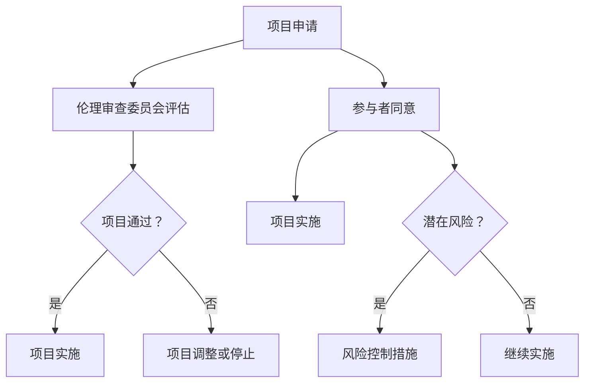

                 

### 1. AI时代的人类增强：伦理审查的重要性

#### 题目：
在AI时代，人类增强技术的迅速发展引发了一系列伦理问题。请问，什么是伦理审查？为什么伦理审查在人类增强技术发展中至关重要？

#### 答案：
伦理审查是一种系统性的评估方法，旨在评估某项研究、项目或技术应用可能带来的道德、伦理和社会影响。在AI时代，人类增强技术涉及到人体生理、心理、认知等多方面的改变，因此伦理审查显得尤为重要。

**解析：**

1. **保障人权与尊严**：伦理审查确保人类增强技术的研究和应用尊重人的基本权利和尊严，避免因技术滥用而侵犯个人隐私、自由等权利。

2. **防止不当实验**：伦理审查可以避免在人类增强技术领域进行不负责任的实验，如未经充分研究或风险评估的实验，从而减少对参与者和公众的潜在风险。

3. **促进透明度**：伦理审查促使研究者和开发者公开其研究目的、方法、结果等信息，增加公众对人类增强技术的理解和信任。

4. **平衡利益与风险**：伦理审查在评估人类增强技术的潜在利益和风险时，注重平衡各方利益，确保技术应用不会造成社会不公或加剧现有不平等。

5. **推动规范与标准**：伦理审查有助于制定和推广人类增强技术的伦理规范和标准，为技术的健康发展提供指导。

**实例代码：**（伦理审查流程示意图）



**答案解析：** 通过伦理审查流程，可以确保人类增强技术的研究和应用遵循伦理原则，避免潜在的社会风险，保障参与者权益，并推动技术的健康、可持续发展。

### 2. 人类增强技术的隐私问题

#### 题目：
人类增强技术涉及大量的生物信息和个人隐私数据。请问，人类增强技术可能带来哪些隐私问题？如何保护个人隐私？

#### 答案：
人类增强技术可能带来的隐私问题包括但不限于：

1. **数据泄露**：生物信息和隐私数据可能因系统漏洞、网络攻击等导致泄露。
2. **基因歧视**：个人基因信息的泄露可能引发就业、保险、健康等方面的歧视。
3. **行为监控**：通过监控人体生理、心理和行为数据，可能侵犯个人自由和隐私。

为了保护个人隐私，可以采取以下措施：

1. **数据加密**：使用高级加密算法确保数据在传输和存储过程中的安全性。
2. **匿名化处理**：对个人数据进行匿名化处理，使其无法与个人身份关联。
3. **隐私保护协议**：制定并遵守隐私保护协议，如数据最小化、目的限定、数据销毁等。
4. **用户知情同意**：确保用户在提供个人信息前充分知情，并获得明确的同意。

**实例代码：**（隐私保护措施示例）

```python
import hashlib
import json

def encrypt_data(data, key):
    """加密数据"""
    encrypted_data = hashlib.sha256(data.encode() + key.encode()).hexdigest()
    return encrypted_data

def anonymize_data(data):
    """匿名化处理数据"""
    anonymized_data = json.loads(data)
    anonymized_data['id'] = 'ANONYMOUS'
    return json.dumps(anonymized_data)

# 示例数据
data = {
    'id': '12345',
    'name': 'John Doe',
    'age': 30
}

# 加密数据
encrypted_data = encrypt_data(json.dumps(data), 'secret_key')
print("Encrypted Data:", encrypted_data)

# 匿名化数据
anonymized_data = anonymize_data(json.dumps(data))
print("Anonymized Data:", anonymized_data)
```

**答案解析：** 通过上述代码示例，可以实现对数据的加密和匿名化处理，从而有效保护个人隐私。此外，确保用户在提供数据前知情并同意，也是保护隐私的重要措施。

### 3. 人类增强技术对就业的影响

#### 题目：
随着人类增强技术的发展，人们开始担心技术可能会取代某些工作。请问，人类增强技术如何影响就业市场？企业应该如何应对这一挑战？

#### 答案：
人类增强技术可能对就业市场产生如下影响：

1. **取代传统工作**：增强技术可能使某些职业或技能变得过时，导致相关就业岗位减少。
2. **技能要求变化**：增强技术可能提高对员工技能的要求，导致劳动力市场出现新的需求。
3. **职业分化**：增强技术可能会加剧职业分化，一方面产生高技能岗位，另一方面产生低技能岗位。

为了应对这一挑战，企业可以采取以下策略：

1. **培训与再教育**：提供培训和再教育机会，帮助员工适应新技术带来的变化。
2. **工作转型**：鼓励员工根据技术发展进行职业转型，开发新的技能和职业路径。
3. **技术整合**：利用增强技术提升企业效率和创新能力，同时创造新的工作机会。
4. **灵活工作安排**：提供灵活的工作时间和工作地点，以适应员工的新需求和生活方式。

**实例代码：**（员工技能提升培训计划示例）

```python
def train_employee(employee, skill):
    """培训员工"""
    print(f"{employee['name']} 已开始 {skill} 培训")
    # 在这里可以添加培训的具体内容和流程
    print(f"{employee['name']} {skill} 培训已完成")

def promote_employee(employee, new_role):
    """晋升员工"""
    print(f"{employee['name']} 已晋升为 {new_role}")
    employee['role'] = new_role

# 示例员工数据
employees = [
    {'name': 'Alice', 'role': '工程师', 'skills': ['编程', '测试']},
    {'name': 'Bob', 'role': '设计师', 'skills': ['UI设计', 'UX设计']}
]

# 培训工程师
train_employee(employees[0], '项目管理')
# 晋升设计师
promote_employee(employees[1], '高级设计师')

print(employees)
```

**答案解析：** 通过代码示例，可以展示企业如何通过培训和晋升来帮助员工适应技术变化，从而应对就业市场的挑战。这有助于企业在技术发展的同时保持竞争力，并保持员工的职业发展。

### 4. 人类增强技术的监管

#### 题目：
随着人类增强技术的发展，各国政府面临监管挑战。请问，政府在监管人类增强技术时需要考虑哪些关键因素？如何制定有效的监管政策？

#### 答案：
政府在监管人类增强技术时需要考虑的关键因素包括：

1. **安全性**：确保增强技术对人体健康、环境等无负面影响。
2. **隐私保护**：保护个人隐私数据，防止数据滥用。
3. **公平性**：防止因技术滥用导致社会不公，如基因歧视、就业不平等。
4. **透明度**：确保技术研究和应用过程的公开、透明，增加公众信任。
5. **国际合作**：与其他国家合作，制定国际标准和监管框架。

为了制定有效的监管政策，政府可以采取以下措施：

1. **立法与规范**：制定相关法律法规，明确人类增强技术的监管要求和法律责任。
2. **建立监管机构**：成立专门机构，负责人类增强技术的评估、监管和合规检查。
3. **公众参与**：通过公众咨询、听证会等方式，征求公众意见，确保监管政策符合社会需求。
4. **风险评估**：定期对人类增强技术进行风险评估，及时识别和应对潜在风险。
5. **国际合作**：与其他国家和国际组织合作，共同制定全球性的人类增强技术监管框架。

**实例代码：**（监管政策草案示例）

```python
class RegulatoryPolicy:
    def __init__(self, safety_rules, privacy_protections, fairness_requirements):
        self.safety_rules = safety_rules
        self.privacy_protections = privacy_protections
        self.fairness_requirements = fairness_requirements

    def display_policy(self):
        print("监管政策草案：")
        print("安全性规则：", self.safety_rules)
        print("隐私保护措施：", self.privacy_protections)
        print("公平性要求：", self.fairness_requirements)

# 安全性规则
safety_rules = [
    "确保增强技术对人体无害",
    "对增强技术进行充分测试和评估",
    "制定紧急应对计划以应对潜在风险"
]

# 隐私保护措施
privacy_protections = [
    "对个人数据实施加密和匿名化处理",
    "明确用户知情同意原则",
    "禁止未经授权的数据共享和传播"
]

# 公平性要求
fairness_requirements = [
    "防止基因歧视和就业不平等",
    "确保技术应用的透明度和公正性",
    "推动技术普及，减少社会不公"
]

policy = RegulatoryPolicy(safety_rules, privacy_protections, fairness_requirements)
policy.display_policy()
```

**答案解析：** 通过代码示例，可以展示一个简单的监管政策草案，涵盖安全性、隐私保护和公平性等多个方面。政府可以在此基础上不断完善和细化，制定具体、有效的监管政策。

### 5. 人类增强技术的伦理辩论

#### 题目：
人类增强技术引发了广泛的伦理辩论。请问，有哪些主要的伦理观点支持或反对人类增强技术？这些观点如何相互平衡？

#### 答案：
支持人类增强技术的伦理观点包括：

1. **技术进步**：认为人类增强技术是人类技术进步的体现，有助于提升人类生活质量。
2. **个人自由**：认为个人有权自主决定是否接受增强技术，实现自我提升。
3. **社会进步**：认为人类增强技术有助于推动社会发展和创新。

反对人类增强技术的伦理观点包括：

1. **道德风险**：认为人类增强技术可能带来不可预测的道德风险，如滥用、歧视等。
2. **伦理困境**：认为人类增强技术可能导致新的伦理困境，如人类与机器人的关系、人类尊严等。
3. **社会不公**：认为人类增强技术可能加剧社会不平等，导致贫富差距扩大。

平衡这些观点，需要：

1. **伦理审查**：在人类增强技术研究和应用前进行严格的伦理审查，确保符合道德和社会价值观。
2. **公众参与**：通过公众咨询、听证会等方式，让社会各界参与伦理辩论，共同制定政策。
3. **技术规范**：制定明确的技术规范和伦理指导原则，确保人类增强技术的合法、合规应用。
4. **国际合作**：与其他国家和国际组织合作，共同应对全球性的人类增强技术挑战。

**实例代码：**（伦理辩论模拟）

```python
class EthicalView:
    def __init__(self, name, arguments):
        self.name = name
        self.arguments = arguments

    def present_case(self):
        print(f"{self.name}的观点：")
        for argument in self.arguments:
            print(f"- {argument}")

# 支持人类增强技术的观点
pro_view = EthicalView("支持派", [
    "技术进步是人类发展的必然趋势",
    "个人有权自主决定接受增强技术",
    "人类增强技术有助于社会进步"
])

# 反对人类增强技术的观点
con_view = EthicalView("反对派", [
    "道德风险不可忽视",
    "人类增强技术可能导致新的伦理困境",
    "社会不公可能会因技术滥用而加剧"
])

pro_view.present_case()
print("\n")
con_view.present_case()
```

**答案解析：** 通过代码示例，可以展示不同伦理观点在人类增强技术辩论中的立场和论据。通过公众参与和伦理审查，可以平衡不同观点，制定合理的政策和规范。

### 6. 人类增强技术与人工智能的互动

#### 题目：
人类增强技术（如智能眼镜、增强现实等）与人工智能技术（如机器学习、自然语言处理等）正在快速发展。请问，这两者的结合将如何影响未来的社会和工作方式？可能带来哪些挑战？

#### 答案：
人类增强技术（HET）与人工智能（AI）的结合将带来深远的影响，包括以下几个方面：

**积极影响：**

1. **提高工作效率**：智能眼镜等增强设备可以提供实时信息，帮助工作者更高效地完成任务。
2. **增强认知能力**：AI辅助工具可以增强人类的记忆、分析能力，提高决策质量。
3. **改善生活质量**：智能家居、健康监测等技术使得人们的生活更加便捷和健康。
4. **促进创新**：AI和HET的结合为科学家、设计师等提供了新的工具，加速创新进程。

**挑战：**

1. **隐私和安全问题**：AI和HET的结合可能导致大量个人数据的收集和监控，增加隐私泄露和安全风险。
2. **伦理道德问题**：增强技术可能加剧社会不平等，如财富差距、健康差距等。
3. **就业冲击**：某些工作岗位可能会因自动化而消失，导致就业压力。
4. **技术依赖**：过度依赖AI和HET可能导致人类技能退化，降低社会灵活性。

**实例代码：**（AI与HET结合应用示例）

```python
import cv2
import numpy as np

def detect_objects(image, model_path):
    """使用AI模型检测图像中的物体"""
    model = cv2.dnn.readNetFromTensorFlow(model_path)
    blob = cv2.dnn.blobFromImage(image, 1.0, (224, 224), (104.0, 117.0, 123.0))
    model.setInput(blob)
    detections = model.forward()
    return detections

def highlight_objects(image, detections):
    """在图像中突出显示检测到的物体"""
    h, w, _ = image.shape
    for i in range(detections.shape[2]):
        confidence = detections[0, 0, i, 2]
        if confidence > 0.5:
            class_id = int(detections[0, 0, i, 1])
            label = labels[class_id]
            box = detections[0, 0, i, 3:7] * np.array([w, h, w, h])
            (x, y, x2, y2) = box.astype("int")
            cv2.rectangle(image, (x, y), (x2, y2), (0, 255, 0), 2)
            cv2.putText(image, label, (x, y - 10), cv2.FONT_HERSHEY_SIMPLEX, 0.5, (0, 255, 0), 2)
    return image

labels = ["background", "aeroplane", "bicycle", "bird", "boat", "bottle", "bus", "car", "cat", "chair", "cow", "diningtable", "dog", "horse", "motorbike", "person", "pottedplant", "sheep", "sofa", "train", "tvmonitor"]

image = cv2.imread("image.jpg")
detections = detect_objects(image, "model_path")
image = highlight_objects(image, detections)
cv2.imshow("Output", image)
cv2.waitKey(0)
```

**答案解析：** 通过代码示例，展示了如何使用AI模型检测图像中的物体，并在图像中突出显示检测结果。这种AI与HET结合的应用可以用于多种场景，如自动驾驶、安防监控、医疗辅助等，显著提高工作效率和安全性。然而，随着技术的普及，也带来了隐私和安全等问题，需要制定相应的法律法规和政策进行监管。

### 7. 身体增强技术的医学伦理

#### 题目：
身体增强技术（如基因编辑、增强肌肉等）在医学领域具有巨大潜力，但同时也引发了伦理争议。请问，在医学领域应用身体增强技术时需要考虑哪些伦理问题？如何确保这些技术的安全性和合理性？

#### 答案：
在医学领域应用身体增强技术时，需要考虑以下伦理问题：

1. **知情同意**：确保患者充分了解身体增强技术的潜在风险、效果和可能的副作用，并自愿同意接受治疗。
2. **安全性**：确保身体增强技术的长期安全性和有效性，进行充分的前期研究和临床试验。
3. **公正性**：避免因身体增强技术导致的社会不公，如贫富差距、种族歧视等。
4. **隐私保护**：保护患者个人隐私和数据安全，避免数据滥用和泄露。
5. **透明度**：公开身体增强技术的研发和应用过程，增加公众信任。

为了确保这些技术的安全性和合理性，可以采取以下措施：

1. **严格的审批流程**：建立严格的审批流程，对新的身体增强技术进行全面的评估和审批。
2. **伦理审查**：在技术研究和应用前进行伦理审查，评估其道德和社会影响。
3. **定期评估**：定期对已上市的身体增强技术进行安全性和有效性评估，确保其持续符合医学标准。
4. **公众咨询**：通过公众咨询、听证会等方式，广泛征求公众意见，确保技术应用符合社会需求。
5. **国际合作**：与其他国家和国际组织合作，制定全球性的身体增强技术标准和规范。

**实例代码：**（医学伦理审查流程示例）

```python
class EthicsReviewBoard:
    def __init__(self, members):
        self.members = members

    def review_application(self, application):
        print("伦理审查委员会开始审查申请...")
        for member in self.members:
            print(f"{member}正在审查申请...")
        if self.is_safe_and_ethical(application):
            print("申请通过伦理审查！")
        else:
            print("申请未通过伦理审查。")

    def is_safe_and_ethical(self, application):
        # 这里可以添加复杂的审查逻辑，如评估安全性、公正性等
        return True

# 示例成员
members = ["Dr. Smith", "Dr. Johnson", "Dr. Brown"]

# 申请示例
application = {
    "technology": "gene editing",
    "purpose": "treatment of genetic diseases",
    "risks": "potential off-target effects",
    "ethics": "ensuring patient autonomy and informed consent"
}

review_board = EthicsReviewBoard(members)
review_board.review_application(application)
```

**答案解析：** 通过代码示例，可以展示一个简单的医学伦理审查流程，包括审查申请、评估安全性、公正性等。伦理审查委员会通过评估申请，确保身体增强技术的研究和应用符合医学伦理标准，从而保障患者权益和社会利益。

### 8. 人类增强技术的社会影响

#### 题目：
人类增强技术（如智能穿戴设备、基因编辑等）的发展对社会产生了深远影响。请问，这些技术如何影响人际关系、社会结构和就业市场？如何应对这些挑战？

#### 答案：
人类增强技术对人际关系、社会结构和就业市场产生了以下影响：

**人际关系：**

1. **增强沟通效率**：智能穿戴设备可以提供实时信息，提高沟通效率。
2. **改变社交习惯**：如虚拟现实技术可能导致人们更加依赖线上社交，减少面对面交流。
3. **增强自我意识**：基因编辑等技术可能改变人们的身体特征，影响自我认同和社交互动。

**社会结构：**

1. **加剧不平等**：由于成本和可获得性的差异，人类增强技术可能导致社会分层，加剧贫富差距。
2. **改变劳动力市场**：某些工作可能因自动化而消失，同时产生新的就业机会。
3. **影响社会制度**：如基因编辑可能导致婚姻、家庭、法律等领域的新问题。

**就业市场：**

1. **技能需求变化**：人类增强技术可能提高对某些技能的需求，如数据分析、编程等。
2. **职业分化**：可能加剧高技能与低技能岗位的分化。
3. **就业压力**：某些职业可能因技术替代而减少就业机会，增加就业压力。

**应对措施：**

1. **教育培训**：提供针对性的教育培训，帮助劳动力适应技术变革。
2. **政策调整**：制定相关政策，如税收优惠、就业保障等，缓解技术变革带来的冲击。
3. **公平监管**：确保人类增强技术的应用不会加剧社会不平等，进行公平监管。
4. **社会参与**：鼓励公众参与讨论，共同制定技术应用和社会政策。

**实例代码：**（应对技术变革的培训计划）

```python
class TrainingProgram:
    def __init__(self, name, courses):
        self.name = name
        self.courses = courses

    def display_program(self):
        print(f"{self.name}培训计划：")
        for course in self.courses:
            print(f"- {course['name']}（{course['duration']}天）")

    def enroll(self, participant):
        print(f"{participant} 已报名 {self.name}培训计划。")

# 培训计划示例
training_program = TrainingProgram("技术变革应对培训", [
    {"name": "数据分析基础", "duration": "5天"},
    {"name": "编程入门", "duration": "7天"},
    {"name": "人工智能简介", "duration": "3天"}
])

# 参与者示例
participants = ["Alice", "Bob", "Charlie"]

# 报名培训
for participant in participants:
    training_program.enroll(participant)
    training_program.display_program()
```

**答案解析：** 通过代码示例，可以展示一个应对技术变革的培训计划，包括数据分析、编程、人工智能等课程。教育培训有助于提高劳动力适应技术变革的能力，缓解就业市场的压力。

### 9. 人类增强技术的法律框架

#### 题目：
随着人类增强技术的发展，各国需要制定相应的法律框架来规范这些技术的研发和应用。请问，在制定法律框架时需要考虑哪些关键要素？如何确保这些法律的有效性和实施？

#### 答案：
在制定人类增强技术的法律框架时，需要考虑以下关键要素：

1. **安全性**：确保人类增强技术对人体、环境和公共安全无害。
2. **隐私保护**：明确个人数据的收集、使用和共享规范，防止隐私侵犯。
3. **公平性**：防止技术滥用导致社会不公，确保技术的公平、公正应用。
4. **透明度**：确保人类增强技术的研发和应用过程公开透明，增加公众信任。
5. **国际合作**：与其他国家和国际组织合作，制定全球性的法律框架。

确保法律的有效性和实施，可以采取以下措施：

1. **严格的审批和监管**：建立严格的审批流程和监管机制，对人类增强技术进行全程监管。
2. **公众参与**：通过公众咨询、听证会等方式，广泛征求公众意见，确保法律符合社会需求。
3. **法律培训**：加强对法律执行人员的培训，确保他们了解和执行法律。
4. **国际合作**：与其他国家和国际组织合作，制定全球性的法律标准和框架。

**实例代码：**（法律框架草案示例）

```python
class LegalFramework:
    def __init__(self, safety_requirements, privacy_protections, fairness_requirements):
        self.safety_requirements = safety_requirements
        self.privacy_protections = privacy_protections
        self.fairness_requirements = fairness_requirements

    def display_framework(self):
        print("法律框架草案：")
        print("安全性要求：", self.safety_requirements)
        print("隐私保护措施：", self.privacy_protections)
        print("公平性要求：", self.fairness_requirements)

# 安全性要求
safety_requirements = [
    "确保人类增强技术对人体无害",
    "对人类增强技术进行充分测试和评估",
    "制定紧急应对计划以应对潜在风险"
]

# 隐私保护措施
privacy_protections = [
    "对个人数据实施加密和匿名化处理",
    "明确用户知情同意原则",
    "禁止未经授权的数据共享和传播"
]

# 公平性要求
fairness_requirements = [
    "防止基因歧视和就业不平等",
    "确保技术应用的透明度和公正性",
    "推动技术普及，减少社会不公"
]

legal_framework = LegalFramework(safety_requirements, privacy_protections, fairness_requirements)
legal_framework.display_framework()
```

**答案解析：** 通过代码示例，可以展示一个简单的法律框架草案，涵盖安全性、隐私保护和公平性等多个方面。这有助于确保人类增强技术的合法、合规应用，同时保护公众利益。

### 10. 人类增强技术与心理健康

#### 题目：
人类增强技术（如脑机接口、虚拟现实等）在提高生活质量和工作效率的同时，也可能对心理健康产生影响。请问，这些技术如何影响心理健康？如何应对这些潜在的心理健康问题？

#### 答案：
人类增强技术对心理健康的影响主要包括：

**积极影响：**

1. **缓解疼痛**：如使用脑机接口控制虚拟现实环境中的温度和光线，帮助缓解慢性疼痛。
2. **治疗心理疾病**：如虚拟现实疗法（VRT）治疗恐惧症、焦虑症等。
3. **提高心理健康**：如通过增强现实（AR）技术进行心理训练，提高情绪调节能力。

**负面影响：**

1. **增加心理压力**：过度依赖增强技术可能导致心理依赖，增加焦虑和压力。
2. **隐私侵犯**：如增强现实设备可能侵犯个人隐私，导致心理困扰。
3. **现实感缺失**：长时间沉浸在虚拟环境中，可能导致现实感缺失，影响心理健康。

**应对措施：**

1. **心理干预**：对使用增强技术的用户进行心理健康评估和干预，提供心理支持和治疗。
2. **技术优化**：通过技术优化减少隐私侵犯，提高用户体验，减少心理压力。
3. **健康教育和培训**：普及心理健康知识，提高公众对增强技术可能带来的心理健康问题的认识。
4. **建立支持体系**：建立心理健康支持体系，为用户提供心理咨询和治疗服务。

**实例代码：**（心理健康评估和干预示例）

```python
class MentalHealthAssessment:
    def __init__(self, symptoms):
        self.symptoms = symptoms

    def assess(self):
        print("心理健康评估：")
        for symptom in self.symptoms:
            print(f"- {symptom}")
        if self.is_positive():
            print("评估结果：心理健康良好。")
        else:
            print("评估结果：心理健康存在问题，建议寻求专业帮助。")

    def is_positive(self):
        # 这里可以添加复杂的评估逻辑，如分析症状严重程度
        return True

# 示例症状
symptoms = ["情绪低落", "睡眠障碍", "焦虑"]

assessment = MentalHealthAssessment(symptoms)
assessment.assess()
```

**答案解析：** 通过代码示例，可以展示一个简单的心理健康评估工具。这有助于识别用户的心理健康问题，并提供相应的支持和干预。

### 11. 人类增强技术的教育与培训

#### 题目：
随着人类增强技术的普及，教育和培训领域面临新的挑战。请问，教育者和培训者应如何应对这些挑战？如何设计适应人类增强技术的新教育模式？

#### 答案：
教育者和培训者应采取以下措施应对人类增强技术的挑战：

1. **更新课程内容**：将人类增强技术的相关知识和应用纳入课程，提高学生的技术素养。
2. **培训教师**：提供针对人类增强技术的专业培训，帮助教师掌握相关技术和教学方法。
3. **实践与体验**：通过实验、项目等方式，让学生在实践中体验人类增强技术，提高他们的实践能力。
4. **跨学科教育**：鼓励跨学科合作，将人类增强技术与其他领域相结合，培养复合型人才。

**适应人类增强技术的新教育模式设计：**

1. **个性化学习**：利用增强技术提供个性化的学习体验，根据学生的兴趣和能力进行个性化教学。
2. **混合学习**：结合线上和线下教学，利用增强技术提供沉浸式的学习体验。
3. **协作学习**：利用虚拟现实、增强现实等技术，促进学生的协作和互动。
4. **终身学习**：建立终身学习体系，为学生提供持续的学习机会和资源。

**实例代码：**（适应人类增强技术的新教育模式示例）

```python
class EducationalMode:
    def __init__(self, name, features):
        self.name = name
        self.features = features

    def display_mode(self):
        print(f"{self.name}教育模式：")
        for feature in self.features:
            print(f"- {feature}")

# 示例新教育模式
mode = EducationalMode("个性化混合学习模式", [
    "根据学生兴趣和能力提供个性化学习内容",
    "结合线上和线下教学，提供沉浸式学习体验",
    "利用虚拟现实和增强现实技术促进协作学习",
    "建立终身学习体系，提供持续学习机会"
])

mode.display_mode()
```

**答案解析：** 通过代码示例，可以展示一个适应人类增强技术的新教育模式。这种模式结合了个性化学习、混合学习、协作学习和终身学习等多个特点，有助于提高教育质量和学生的综合素质。

### 12. 人类增强技术的未来发展趋势

#### 题目：
随着科技的不断进步，人类增强技术（如脑机接口、基因编辑等）在未来有哪些可能的发展趋势？这些趋势可能对社会和经济产生哪些影响？

#### 答案：
未来人类增强技术的发展趋势包括：

1. **智能化与个性化**：增强技术将更加智能化和个性化，根据个体的需求和特点进行定制化增强。
2. **跨学科融合**：增强技术与生物科学、神经科学、计算机科学等领域的深度融合，推动技术的创新和发展。
3. **普及化**：随着成本的降低和技术的成熟，增强技术将逐渐普及，成为人们日常生活中的一部分。
4. **伦理和法规的完善**：随着技术的进步，相关伦理和法规问题将得到更深入的探讨和解决。

**可能对社会和经济产生的影响：**

1. **经济结构变化**：增强技术的普及可能导致传统行业受到冲击，同时产生新的就业机会和产业。
2. **社会不平等**：如果增强技术只服务于富裕阶层，可能导致社会不平等加剧。
3. **教育变革**：增强技术将改变教育模式，提高教育质量和效率，促进知识普及。
4. **医疗进步**：增强技术在医疗领域的应用将提高医疗水平，改善患者的生活质量。

**实例代码：**（未来发展趋势预测示例）

```python
class TechnologyTrend:
    def __init__(self, name, impact):
        self.name = name
        self.impact = impact

    def display_trend(self):
        print(f"{self.name}发展趋势：")
        print(f"可能对社会和经济产生的影响：")
        for impact in self.impact:
            print(f"- {impact}")

# 示例发展趋势
trends = [
    TechnologyTrend("智能化与个性化", [
        "提高生产效率",
        "推动个性化医疗服务",
        "促进个性化教育"
    ]),
    TechnologyTrend("跨学科融合", [
        "推动科技创新",
        "促进产业升级",
        "增加就业机会"
    ]),
    TechnologyTrend("普及化", [
        "降低社会不平等",
        "提高全民生活质量",
        "促进技术普及"
    ]),
    TechnologyTrend("伦理和法规的完善", [
        "保障技术安全",
        "促进技术健康发展",
        "增强公众信任"
    ])
]

for trend in trends:
    trend.display_trend()
    print("\n")
```

**答案解析：** 通过代码示例，可以展示未来人类增强技术可能的发展趋势及其对社会和经济的影响。这有助于我们预见未来，为相关政策和规划提供参考。

### 13. 人类增强技术的国际合作

#### 题目：
随着人类增强技术的发展，各国需要加强国际合作，共同应对技术带来的挑战。请问，国际合作在人类增强技术领域有哪些重要意义？如何促进国际合作？

#### 答案：
国际合作在人类增强技术领域具有重要意义，包括：

1. **共享资源与知识**：通过国际合作，各国可以共享研发资源、数据和技术知识，加速技术进步。
2. **规范和标准**：国际合作有助于制定全球性的技术规范和标准，确保技术的合法、合规应用。
3. **应对全球性挑战**：人类增强技术可能带来全球性的伦理、法律和社会问题，需要各国共同应对。
4. **促进公平与包容**：国际合作可以促进技术普及，减少社会不平等，推动全球可持续发展。

**促进国际合作的方法：**

1. **政府间合作**：通过政府间的协议、合作项目等方式，加强各国在人类增强技术领域的合作。
2. **国际组织**：利用国际组织（如联合国、世界卫生组织等）的平台，推动全球性的人类增强技术政策和规范。
3. **民间合作**：鼓励企业和研究机构之间的国际合作，促进技术交流和共享。
4. **公众参与**：通过公众咨询、国际论坛等方式，增加公众对人类增强技术的参与，推动国际合作。

**实例代码：**（国际合作项目示例）

```python
class InternationalProject:
    def __init__(self, name, countries, objectives):
        self.name = name
        self.countries = countries
        self.objectives = objectives

    def display_project(self):
        print(f"{self.name}国际合作项目：")
        print("参与国家：", self.countries)
        print("项目目标：")
        for objective in self.objectives:
            print(f"- {objective}")

# 示例国际合作项目
project = InternationalProject("全球健康增强计划", ["中国", "美国", "欧盟", "印度"], [
    "提高医疗技术水平",
    "推广个性化医疗服务",
    "促进全球医疗资源均衡发展"
])

project.display_project()
```

**答案解析：** 通过代码示例，可以展示一个国际合作项目的示例，包括参与国家、项目目标等信息。这有助于展示国际合作在人类增强技术领域的实际应用。

### 14. 人类增强技术的长期影响

#### 题目：
人类增强技术（如基因编辑、脑机接口等）的长期影响尚不明确，存在诸多未知风险。请问，如何评估和应对这些长期风险？如何确保技术的长期可持续性？

#### 答案：
**评估长期风险的方法：**

1. **长期研究**：进行长期的临床观察和实验研究，评估增强技术的长期效果和潜在风险。
2. **建模和模拟**：利用计算机模型和模拟技术，预测增强技术在不同环境和条件下的表现和影响。
3. **系统分析**：对增强技术的整个生命周期进行系统分析，包括研发、应用、废弃等各个环节。
4. **跨学科合作**：结合生物学、医学、工程学等多个领域的知识，全面评估增强技术的潜在风险。

**应对长期风险的方法：**

1. **风险评估和预警**：建立风险评估和预警机制，及时发现和应对潜在风险。
2. **安全标准和规范**：制定严格的安全标准和规范，确保增强技术的研发和应用符合安全要求。
3. **公众参与和沟通**：增加公众对增强技术的了解和参与，通过有效的沟通机制，提高公众的接受度和信任度。
4. **国际合作**：与其他国家和国际组织合作，共同制定全球性的增强技术规范和标准。

**确保技术长期可持续性的方法：**

1. **可持续发展原则**：在增强技术的设计和应用中，遵循可持续发展原则，确保技术对环境和社会的长期影响最小。
2. **生命周期管理**：对增强技术进行全生命周期管理，包括研发、应用、废弃和回收等环节，确保技术的可持续性。
3. **技术更新和迭代**：随着技术的发展和变化，不断更新和改进增强技术，以适应新的需求和挑战。
4. **持续监测和评估**：对增强技术进行持续的监测和评估，确保其长期性能和安全性。

**实例代码：**（长期风险评估和可持续性管理示例）

```python
class LongTermImpact:
    def __init__(self, technology, risks, sustainability_practices):
        self.technology = technology
        self.risks = risks
        self.sustainability_practices = sustainability_practices

    def assess_impact(self):
        print(f"{self.technology}长期影响评估：")
        print("潜在风险：")
        for risk in self.risks:
            print(f"- {risk}")
        print("可持续性实践：")
        for practice in self.sustainability_practices:
            print(f"- {practice}")

# 示例技术
technology = "基因编辑"

# 潜在风险
risks = [
    "长期基因突变的风险",
    "遗传信息泄露的风险",
    "社会不平等的风险"
]

# 可持续性实践
sustainability_practices = [
    "遵循伦理审查和监管规定",
    "开展长期研究以监测技术影响",
    "推广公平、公正的技术应用"
]

impact = LongTermImpact(technology, risks, sustainability_practices)
impact.assess_impact()
```

**答案解析：** 通过代码示例，可以展示一个关于基因编辑技术的长期影响评估，包括潜在风险和可持续性实践。这有助于全面了解技术的长期影响，并为确保其可持续性提供指导。

### 15. 人类增强技术与可持续发展

#### 题目：
人类增强技术的快速发展给可持续发展带来了新的机遇和挑战。请问，这些技术如何影响可持续发展？如何实现人类增强技术与可持续发展的协调？

#### 答案：
**影响可持续发展：**

1. **资源消耗**：增强技术的研发和应用可能增加对自然资源和能源的消耗。
2. **环境污染**：如基因编辑技术的实验可能导致生物污染和环境破坏。
3. **社会不平等**：如果增强技术主要服务于富裕阶层，可能导致社会不平等加剧，影响可持续发展。
4. **经济结构**：增强技术可能改变传统产业和就业结构，影响经济发展模式。

**实现协调的方法：**

1. **技术创新**：通过技术创新，提高增强技术的能效和可持续性，减少对环境和资源的消耗。
2. **政策引导**：制定相关政策，鼓励增强技术的可持续发展，如税收优惠、补贴等。
3. **公众参与**：增加公众对增强技术的参与，提高公众的环保意识和可持续性意识。
4. **国际合作**：与其他国家和国际组织合作，共同应对增强技术带来的全球性可持续发展挑战。

**实例代码：**（增强技术可持续性评估示例）

```python
class SustainabilityEvaluation:
    def __init__(self, technology, impacts, sustainability_practices):
        self.technology = technology
        self.impacts = impacts
        self.sustainability_practices = sustainability_practices

    def evaluate_sustainability(self):
        print(f"{self.technology}可持续性评估：")
        print("技术影响：")
        for impact in self.impacts:
            print(f"- {impact}")
        print("可持续性实践：")
        for practice in self.sustainability_practices:
            print(f"- {practice}")

# 示例技术
technology = "增强肌肉技术"

# 技术影响
impacts = [
    "提高工作效率，减少劳动力需求",
    "可能增加对能源和资源的消耗",
    "影响传统产业和就业结构"
]

# 可持续性实践
sustainability_practices = [
    "研发高效能源消耗的增强技术",
    "推广环保型增强技术",
    "支持传统产业转型和就业安置"
]

evaluation = SustainabilityEvaluation(technology, impacts, sustainability_practices)
evaluation.evaluate_sustainability()
```

**答案解析：** 通过代码示例，可以展示一个关于增强肌肉技术的可持续性评估，包括技术影响和可持续性实践。这有助于全面了解技术的可持续性，并为实现可持续发展提供指导。

### 16. 人类增强技术的安全性与隐私保护

#### 题目：
人类增强技术的广泛应用带来了巨大的安全性和隐私保护挑战。请问，如何确保人类增强技术的安全性？如何保护个人隐私数据？

#### 答案：
**确保人类增强技术的安全性：**

1. **安全设计**：在增强技术的设计阶段，充分考虑安全性因素，如数据加密、访问控制等。
2. **安全测试**：对增强技术进行严格的安全测试，包括漏洞扫描、渗透测试等，确保技术无安全漏洞。
3. **安全监管**：建立完善的安全监管机制，对增强技术进行实时监控和评估，确保其符合安全标准。
4. **安全培训**：对技术研发人员、用户进行安全培训，提高他们的安全意识和应对能力。

**保护个人隐私数据：**

1. **数据匿名化**：在收集和使用个人数据时，进行数据匿名化处理，确保无法与个人身份关联。
2. **数据加密**：对存储和传输的个人数据进行加密处理，防止数据泄露。
3. **隐私保护协议**：制定并遵守隐私保护协议，如数据最小化、目的限定、数据销毁等。
4. **用户知情同意**：确保用户在提供个人信息前充分知情并同意，提高数据收集和使用过程的透明度。

**实例代码：**（安全性和隐私保护示例）

```python
import hashlib
import json

def encrypt_data(data, key):
    """加密数据"""
    encrypted_data = hashlib.sha256(data.encode() + key.encode()).hexdigest()
    return encrypted_data

def anonymize_data(data):
    """匿名化处理数据"""
    anonymized_data = json.loads(data)
    anonymized_data['id'] = 'ANONYMOUS'
    return json.dumps(anonymized_data)

# 示例数据
data = {
    'id': '12345',
    'name': 'John Doe',
    'age': 30
}

# 加密数据
encrypted_data = encrypt_data(json.dumps(data), 'secret_key')
print("Encrypted Data:", encrypted_data)

# 匿名化数据
anonymized_data = anonymize_data(json.dumps(data))
print("Anonymized Data:", anonymized_data)
```

**答案解析：** 通过代码示例，展示了如何使用数据加密和匿名化处理技术来保护个人隐私数据。这些技术有助于确保数据在存储和传输过程中的安全性，从而提高人类增强技术的安全性和隐私保护水平。

### 17. 人类增强技术与人工智能的融合

#### 题目：
人类增强技术与人工智能（AI）的融合正在快速发展，这种融合如何影响人类生活和社会发展？请分析可能带来的好处和挑战。

#### 答案：
**好处：**

1. **提升工作效率**：AI与人类增强技术的结合，可以提供更智能、更高效的工具，帮助人们更快地完成工作任务。
2. **增强认知能力**：AI可以辅助人类增强技术，如通过智能眼镜提供实时信息，提高决策质量和认知能力。
3. **改善生活质量**：AI与人类增强技术的融合，可以带来更便捷、更舒适的生活体验，如智能家居、智能医疗等。
4. **推动创新**：AI技术可以为人类增强技术提供更强大的支持，推动科技创新和产业发展。

**挑战：**

1. **伦理和道德问题**：AI与人类增强技术的结合，可能引发新的伦理和道德问题，如隐私侵犯、公平性问题等。
2. **技术滥用**：AI和人类增强技术的结合，可能导致技术滥用，如侵犯隐私、造成安全隐患等。
3. **社会不平等**：如果技术主要服务于富裕阶层，可能导致社会不平等加剧。
4. **就业冲击**：AI和人类增强技术的融合，可能导致某些工作岗位被取代，增加就业压力。

**实例代码：**（AI与人类增强技术结合应用示例）

```python
import cv2
import numpy as np

def detect_objects(image, model_path):
    """使用AI模型检测图像中的物体"""
    model = cv2.dnn.readNetFromTensorFlow(model_path)
    blob = cv2.dnn.blobFromImage(image, 1.0, (224, 224), (104.0, 117.0, 123.0))
    model.setInput(blob)
    detections = model.forward()
    return detections

def highlight_objects(image, detections):
    """在图像中突出显示检测到的物体"""
    h, w, _ = image.shape
    for i in range(detections.shape[2]):
        confidence = detections[0, 0, i, 2]
        if confidence > 0.5:
            class_id = int(detections[0, 0, i, 1])
            label = labels[class_id]
            box = detections[0, 0, i, 3:7] * np.array([w, h, w, h])
            (x, y, x2, y2) = box.astype("int")
            cv2.rectangle(image, (x, y), (x2, y2), (0, 255, 0), 2)
            cv2.putText(image, label, (x, y - 10), cv2.FONT_HERSHEY_SIMPLEX, 0.5, (0, 255, 0), 2)
    return image

labels = ["background", "aeroplane", "bicycle", "bird", "boat", "bottle", "bus", "car", "cat", "chair", "cow", "diningtable", "dog", "horse", "motorbike", "person", "pottedplant", "sheep", "sofa", "train", "tvmonitor"]

image = cv2.imread("image.jpg")
detections = detect_objects(image, "model_path")
image = highlight_objects(image, detections)
cv2.imshow("Output", image)
cv2.waitKey(0)
```

**答案解析：** 通过代码示例，展示了如何使用AI模型检测图像中的物体，并在图像中突出显示检测结果。这种AI与人类增强技术的结合应用，可以用于多种场景，如自动驾驶、安防监控、医疗辅助等，显著提高工作效率和安全性。然而，这种融合也带来了隐私和安全等问题，需要制定相应的法律法规和政策进行监管。

### 18. 人类增强技术的伦理与法律挑战

#### 题目：
人类增强技术的快速发展带来了众多伦理和法律挑战。请问，这些挑战包括哪些方面？如何应对这些挑战？

#### 答案：
**挑战方面：**

1. **隐私权**：人类增强技术可能收集和存储大量个人生物信息，引发隐私权问题。
2. **公平性**：增强技术可能导致社会不平等，加剧贫富差距。
3. **伦理问题**：如基因编辑可能引发伦理争议，涉及人类尊严、自主权等问题。
4. **法律规范**：现有法律体系可能无法完全适应人类增强技术的发展，需要更新和完善。
5. **安全风险**：增强技术可能存在安全漏洞，导致数据泄露和滥用。

**应对方法：**

1. **立法和政策**：制定相关法律法规，规范人类增强技术的研究和应用。
2. **伦理审查**：建立伦理审查机制，对增强技术进行伦理评估和监督。
3. **公众参与**：增加公众对增强技术的参与，提高透明度和公众信任。
4. **国际合作**：与其他国家和国际组织合作，共同应对全球性的伦理和法律挑战。
5. **教育和培训**：加强对公众和从业者的教育和培训，提高对伦理和法律问题的认识。

**实例代码：**（伦理审查流程示例）

```python
class EthicsReviewBoard:
    def __init__(self, members):
        self.members = members

    def review_application(self, application):
        print("伦理审查委员会开始审查申请...")
        for member in self.members:
            print(f"{member}正在审查申请...")
        if self.is_ethical(application):
            print("申请通过伦理审查！")
        else:
            print("申请未通过伦理审查。")

    def is_ethical(self, application):
        # 这里可以添加复杂的审查逻辑，如评估伦理风险和影响
        return True

# 示例成员
members = ["Dr. Smith", "Dr. Johnson", "Dr. Brown"]

# 申请示例
application = {
    "technology": "gene editing",
    "purpose": "treatment of genetic diseases",
    "risks": "potential off-target effects",
    "ethics": "ensuring patient autonomy and informed consent"
}

review_board = EthicsReviewBoard(members)
review_board.review_application(application)
```

**答案解析：** 通过代码示例，展示了伦理审查委员会如何审查一项基因编辑技术的伦理申请。这种审查机制有助于确保人类增强技术的伦理合规性，从而降低潜在的社会风险。

### 19. 人类增强技术对军事领域的影响

#### 题目：
人类增强技术在军事领域的应用正在不断拓展，请问这些技术如何改变现代战争的面貌？请分析可能带来的积极影响和潜在风险。

#### 答案：
**积极影响：**

1. **提高战斗力**：人类增强技术可以提升士兵的身体素质、反应速度和战斗技能，提高整体战斗力。
2. **增强生存能力**：如智能防护装备可以提供实时信息，帮助士兵在复杂环境中生存。
3. **提升情报收集能力**：人类增强技术可以增强士兵的感官能力，提高情报收集效率。
4. **降低伤亡率**：通过增强士兵的身体和认知能力，可以减少战场伤亡。

**潜在风险：**

1. **军事不平衡**：技术先进的国家可能获得军事优势，加剧国际军事力量的不平衡。
2. **隐私和安全问题**：军事增强技术可能涉及大量敏感数据的收集和处理，存在隐私和安全风险。
3. **伦理和道德问题**：如增强士兵的战斗能力可能引发伦理和道德争议。
4. **军备竞赛**：人类增强技术的应用可能引发新的军备竞赛，增加军事紧张局势。

**实例代码：**（军事增强技术评估示例）

```python
class MilitaryEnhancement:
    def __init__(self, technology, benefits, risks):
        self.technology = technology
        self.benefits = benefits
        self.risks = risks

    def assess_impact(self):
        print(f"{self.technology}军事增强技术评估：")
        print("积极影响：")
        for benefit in self.benefits:
            print(f"- {benefit}")
        print("潜在风险：")
        for risk in self.risks:
            print(f"- {risk}")

# 示例军事增强技术
technology = "智能防护装备"

# 积极影响
benefits = [
    "提高士兵生存能力",
    "增强情报收集效率",
    "降低战场伤亡率"
]

# 潜在风险
risks = [
    "隐私和安全问题",
    "可能引发军备竞赛",
    "加剧军事不平衡"
]

enhancement = MilitaryEnhancement(technology, benefits, risks)
enhancement.assess_impact()
```

**答案解析：** 通过代码示例，展示了如何评估一项军事增强技术的积极影响和潜在风险。这种评估有助于确保军事增强技术的合理、合规应用，同时降低潜在的社会风险。

### 20. 人类增强技术与人类尊严

#### 题目：
人类增强技术的快速发展引发了关于人类尊严的讨论。请问，人类增强技术如何影响人类尊严？如何平衡技术进步与人类尊严之间的关系？

#### 答案：
**影响人类尊严：**

1. **身体完整性的改变**：如基因编辑和身体改造技术可能改变人类身体的自然状态，影响人类对自身身体完整性的认知。
2. **自主权的挑战**：增强技术可能削弱人类的自主权，如脑机接口技术可能限制个人的自由意志。
3. **社会认同**：增强技术可能导致社会对人类自然形态的认同感减弱，影响人类在社会中的地位和尊严。

**平衡技术进步与人类尊严的关系：**

1. **伦理审查**：在增强技术的研究和应用前进行严格的伦理审查，确保尊重人类的尊严和自主权。
2. **公众参与**：增加公众对增强技术的参与，提高透明度和公众信任，确保技术应用符合社会价值观。
3. **技术规范**：制定明确的技术规范，确保增强技术的合法、合规应用，防止技术滥用。
4. **教育和宣传**：加强对公众的教育和宣传，提高公众对增强技术可能对人类尊严的影响的认识。
5. **法律保障**：建立相关法律体系，保护人类尊严和自主权，对侵犯人类尊严的行为进行制裁。

**实例代码：**（伦理审查与法律保障示例）

```python
class EthicsAndLegalProtection:
    def __init__(self, technology, ethical_review, legal_provisions):
        self.technology = technology
        self.ethical_review = ethical_review
        self.legal_provisions = legal_provisions

    def assess_protection(self):
        print(f"{self.technology}伦理和法律保障评估：")
        print("伦理审查：")
        for review in self.ethical_review:
            print(f"- {review}")
        print("法律保障：")
        for provision in self.legal_provisions:
            print(f"- {provision}")

# 示例增强技术
technology = "基因编辑"

# 伦理审查
ethical_review = [
    "确保基因编辑技术的安全性",
    "保护患者的知情同意权",
    "防止基因编辑技术滥用"
]

# 法律保障
legal_provisions = [
    "禁止未经授权的基因编辑",
    "确保基因编辑技术的合法合规应用",
    "对违反法律的行为进行严厉处罚"
]

protection = EthicsAndLegalProtection(technology, ethical_review, legal_provisions)
protection.assess_protection()
```

**答案解析：** 通过代码示例，展示了如何评估一项基因编辑技术的伦理和法律保障。这种评估有助于确保技术在尊重人类尊严的前提下进行，同时通过法律手段保护人类的尊严和权益。

### 21. 人类增强技术与社会公正

#### 题目：
人类增强技术的快速发展可能影响社会公正。请问，这些技术如何影响社会公正？如何确保增强技术的公平应用？

#### 答案：
**影响社会公正：**

1. **资源分配不均**：增强技术的研发和应用可能集中在富裕国家或阶层，加剧资源分配不均。
2. **就业市场变化**：增强技术可能导致某些工作岗位消失，增加就业压力，影响社会稳定。
3. **社会分层**：增强技术可能加剧社会分层，如富裕阶层通过技术获得优势，而低收入阶层则难以享受技术带来的好处。

**确保公平应用的方法：**

1. **公平立法**：制定相关法律法规，确保增强技术的研发和应用符合公平原则。
2. **政策支持**：通过政策支持，如税收优惠、补贴等，鼓励增强技术在低收入和偏远地区的应用。
3. **公众参与**：增加公众对增强技术的参与，提高透明度和公众信任，确保技术应用符合社会需求。
4. **技术普及**：推动增强技术的普及，减少社会不平等，提高全民受益。
5. **教育和培训**：提供教育和培训机会，帮助劳动力适应技术变革，提高其竞争能力。

**实例代码：**（公平应用政策示例）

```python
class FairnessPolicy:
    def __init__(self, resource_distribution, employment_impact, social_inequality):
        self.resource_distribution = resource_distribution
        self.employment_impact = employment_impact
        self.social_inequality = social_inequality

    def display_policy(self):
        print("公平应用政策：")
        print("资源分配：")
        for distribution in self.resource_distribution:
            print(f"- {distribution}")
        print("就业影响：")
        for impact in self.employment_impact:
            print(f"- {impact}")
        print("社会不平等：")
        for inequality in self.social_inequality:
            print(f"- {inequality}")

# 示例资源分配
resource_distribution = [
    "推动增强技术在低收入地区的应用",
    "增加对科技教育的投资",
    "鼓励跨国合作，共享技术资源"
]

# 就业影响
employment_impact = [
    "提供职业培训和再教育机会",
    "推动技术创造新的就业机会",
    "支持传统产业的转型升级"
]

# 社会不平等
social_inequality = [
    "减少技术滥用，防止社会分层",
    "推动社会公平，减少贫富差距",
    "确保全民享受技术发展成果"
]

policy = FairnessPolicy(resource_distribution, employment_impact, social_inequality)
policy.display_policy()
```

**答案解析：** 通过代码示例，展示了如何制定一项公平应用政策，涵盖资源分配、就业影响和社会不平等等方面。这种政策有助于确保增强技术的公平应用，减少社会不平等，推动社会公正。

### 22. 人类增强技术与人类自我认同

#### 题目：
人类增强技术的快速发展引发了关于人类自我认同的讨论。请问，这些技术如何影响人类的自我认同？如何平衡技术进步与人类自我认同之间的关系？

#### 答案：
**影响人类自我认同：**

1. **身体形态的改变**：如基因编辑和身体改造技术可能改变人类的外貌和身体特征，影响人类对自身身体形态的认知。
2. **认知能力的改变**：如智能增强技术可能改变人类的认知能力，影响人类对自身智力和能力的认知。
3. **社会角色和身份**：增强技术可能改变人类在社会中的角色和身份，如职业、社会地位等，影响人类的自我认同。

**平衡技术进步与人类自我认同的关系：**

1. **尊重个体选择**：尊重个体选择是否接受增强技术，确保个体有自主权决定自己的身体和认知状态。
2. **伦理审查**：在增强技术的研究和应用前进行严格的伦理审查，确保技术不会对人类自我认同产生负面影响。
3. **公众参与**：增加公众对增强技术的参与，提高透明度和公众信任，确保技术应用符合社会价值观。
4. **教育和宣传**：加强对公众的教育和宣传，提高公众对增强技术可能对人类自我认同的影响的认识。
5. **法律保障**：建立相关法律体系，保护人类的自我认同和自主权，对侵犯人类自我认同的行为进行制裁。

**实例代码：**（自我认同保护措施示例）

```python
class SelfIdentityProtection:
    def __init__(self, technology, ethical_review, legal_protections):
        self.technology = technology
        self.ethical_review = ethical_review
        self.legal_protections = legal_protections

    def assess_protection(self):
        print(f"{self.technology}自我认同保护措施评估：")
        print("伦理审查：")
        for review in self.ethical_review:
            print(f"- {review}")
        print("法律保障：")
        for protection in self.legal_protections:
            print(f"- {protection}")

# 示例增强技术
technology = "智能增强"

# 伦理审查
ethical_review = [
    "确保智能增强技术的安全性",
    "保护用户的知情同意权",
    "防止智能增强技术滥用"
]

# 法律保障
legal_protections = [
    "禁止未经授权的智能增强",
    "确保智能增强技术的合法合规应用",
    "对违反法律的行为进行严厉处罚"
]

protection = SelfIdentityProtection(technology, ethical_review, legal_protections)
protection.assess_protection()
```

**答案解析：** 通过代码示例，展示了如何评估一项智能增强技术的自我认同保护措施。这种评估有助于确保技术在尊重人类自我认同的前提下进行，同时通过法律手段保护人类的自我认同。

### 23. 人类增强技术与社会稳定

#### 题目：
人类增强技术的快速发展可能对社会稳定产生影响。请问，这些技术如何影响社会稳定？如何确保增强技术的社会稳定性？

#### 答案：
**影响社会稳定：**

1. **社会不平等**：增强技术可能导致社会不平等加剧，如贫富差距、教育和就业机会的不平等等。
2. **就业市场变化**：增强技术可能取代某些工作岗位，导致就业市场不稳定，增加失业率。
3. **社会分层**：增强技术可能导致社会分层，如通过技术获得优势的精英阶层与未获利的普通民众之间的差异。
4. **道德和伦理问题**：增强技术可能引发道德和伦理问题，如隐私侵犯、自主权削弱等，影响社会信任和稳定。

**确保社会稳定性的方法：**

1. **公平立法**：制定相关法律法规，确保增强技术的研发和应用符合公平原则。
2. **政策支持**：通过政策支持，如税收优惠、补贴等，鼓励增强技术在低收入和偏远地区的应用。
3. **公众参与**：增加公众对增强技术的参与，提高透明度和公众信任，确保技术应用符合社会需求。
4. **教育和培训**：提供教育和培训机会，帮助劳动力适应技术变革，提高其竞争能力。
5. **社会监督**：加强对增强技术的社会监督，及时发现和解决潜在的社会问题。

**实例代码：**（社会稳定性评估示例）

```python
class SocialStabilityEvaluation:
    def __init__(self, technology, impacts, stability_measures):
        self.technology = technology
        self.impacts = impacts
        self.stability_measures = stability_measures

    def evaluate_stability(self):
        print(f"{self.technology}社会稳定性评估：")
        print("潜在影响：")
        for impact in self.impacts:
            print(f"- {impact}")
        print("稳定性措施：")
        for measure in self.stability_measures:
            print(f"- {measure}")

# 示例增强技术
technology = "智能医疗"

# 潜在影响
impacts = [
    "可能加剧社会不平等",
    "可能导致就业市场不稳定",
    "可能引发道德和伦理问题"
]

# 稳定性措施
stability_measures = [
    "确保智能医疗技术的公平应用",
    "提供职业培训和再教育机会",
    "加强社会监督和风险预警机制"
]

evaluation = SocialStabilityEvaluation(technology, impacts, stability_measures)
evaluation.evaluate_stability()
```

**答案解析：** 通过代码示例，展示了如何评估一项智能医疗技术的潜在社会影响和稳定性措施。这种评估有助于确保增强技术在社会稳定的前提下进行，同时通过政策和社会监督等措施减少潜在的社会风险。

### 24. 人类增强技术与教育公平

#### 题目：
人类增强技术在教育领域的应用可能影响教育公平。请问，这些技术如何影响教育公平？如何确保教育公平？

#### 答案：
**影响教育公平：**

1. **资源分配**：增强技术可能加剧教育资源的不平等，如先进技术主要服务于富裕家庭和学校。
2. **技术门槛**：技术要求可能导致教育机会的不平等，如缺乏技术支持的学校和教育资源匮乏的地区。
3. **学习成果**：增强技术可能使部分学生获得优势，而缺乏技术的学生则难以竞争。
4. **教育评估**：增强技术可能影响教育评估的公正性，如通过人工智能评估可能忽视个体差异。

**确保教育公平的方法：**

1. **政策支持**：通过政府政策和财政支持，确保教育资源公平分配。
2. **技术普及**：推动增强技术在贫困地区和学校的普及，减少技术差距。
3. **教育改革**：改革教育体系，确保所有学生都能获得高质量的教育。
4. **职业培训**：为教师提供技术培训，提高教师的技术素养和教学能力。
5. **监管与评估**：建立监管机制，确保增强技术的公正和公平应用。

**实例代码：**（教育公平政策示例）

```python
class EducationFairnessPolicy:
    def __init__(self, resource分配，technology_access，education_reform，teacher_training，regulation_and_evaluation):
        self.resource_distribution = resource_distribution
        self.technology_access = technology_access
        self.education_reform = education_reform
        self.teacher_training = teacher_training
        self.regulation_and_evaluation = regulation_and_evaluation

    def display_policy(self):
        print("教育公平政策：")
        print("资源分配：")
        for distribution in self.resource_distribution:
            print(f"- {distribution}")
        print("技术访问：")
        for access in self.technology_access:
            print(f"- {access}")
        print("教育改革：")
        for reform in self.education_reform:
            print(f"- {reform}")
        print("教师培训：")
        for training in self.teacher_training:
            print(f"- {training}")
        print("监管与评估：")
        for evaluation in self.regulation_and_evaluation:
            print(f"- {evaluation}")

# 示例资源分配
resource_distribution = [
    "增加对贫困地区学校的财政支持",
    "推广信息技术在教育中的应用",
    "确保教育资源公平分配"
]

# 技术访问
technology_access = [
    "为贫困地区学校提供技术设备",
    "培训教师掌握信息技术",
    "降低技术使用的门槛"
]

# 教育改革
education_reform = [
    "改革教育体系，提高教育质量",
    "推广个性化教育，关注个体差异",
    "促进教育资源的共享和交流"
]

# 教师培训
teacher_training = [
    "提供信息技术培训课程",
    "鼓励教师参与教学创新",
    "提高教师的教育技能和素养"
]

# 监管与评估
regulation_and_evaluation = [
    "建立监管机制，确保教育公平",
    "定期评估教育公平状况",
    "对违反教育公平的行为进行处罚"
]

policy = EducationFairnessPolicy(resource_distribution, technology_access, education_reform, teacher_training, regulation_and_evaluation)
policy.display_policy()
```

**答案解析：** 通过代码示例，展示了如何制定一项确保教育公平的政策，涵盖资源分配、技术访问、教育改革、教师培训以及监管与评估等方面。这种政策有助于减少教育不公平，推动教育资源的均衡发展。

### 25. 人类增强技术与人类心理

#### 题目：
人类增强技术的应用可能对人类心理产生深远影响。请问，这些技术如何影响人类心理？如何应对这些影响？

#### 答案：
**影响人类心理：**

1. **认知负担**：增强技术可能导致人类在处理信息和任务时面临更大的认知负担，如智能眼镜提供的过量信息可能分散注意力。
2. **心理压力**：增强技术可能加剧工作压力和生活压力，如增强肌肉技术可能导致高强度工作环境。
3. **心理健康问题**：增强技术可能导致心理健康问题，如过度依赖增强设备可能导致社交障碍。
4. **自我认同**：增强技术可能影响人类的自我认同，如基因编辑可能导致对自身身份的认知变化。

**应对措施：**

1. **心理健康支持**：提供专业的心理健康支持和咨询服务，帮助人们应对增强技术带来的心理压力。
2. **教育和培训**：加强对公众和从业者的教育和培训，提高对增强技术可能带来的心理影响的认识。
3. **技术优化**：通过技术优化减少增强技术对心理健康的负面影响，如设计更人性化的界面和交互方式。
4. **社会支持**：建立社会支持体系，为受到增强技术影响的人群提供帮助，如失业保险和职业培训。
5. **心理评估**：在增强技术的研究和应用前进行心理评估，确保技术应用不会对心理健康产生负面影响。

**实例代码：**（心理健康支持系统示例）

```python
class MentalHealthSupportSystem:
    def __init__(self, counseling_services, education_and_training, technical_optimization, social_support, psychological_evaluation):
        self.counseling_services = counseling_services
        self.education_and_training = education_and_training
        self.technical_optimization = technical_optimization
        self.social_support = social_support
        self.psychological_evaluation = psychological_evaluation

    def display_support_system(self):
        print("心理健康支持系统：")
        print("咨询服务：")
        for service in self.counseling_services:
            print(f"- {service}")
        print("教育和培训：")
        for training in self.education_and_training:
            print(f"- {training}")
        print("技术优化：")
        for optimization in self.technical_optimization:
            print(f"- {optimization}")
        print("社会支持：")
        for support in self.social_support:
            print(f"- {support}")
        print("心理评估：")
        for evaluation in self.psychological_evaluation:
            print(f"- {evaluation}")

# 示例咨询服务
counseling_services = [
    "提供心理咨询服务",
    "开设心理健康讲座",
    "提供心理健康热线"
]

# 教育和培训
education_and_training = [
    "推广心理健康知识",
    "培训公众应对增强技术的心理压力",
    "提供技术使用指南"
]

# 技术优化
technical_optimization = [
    "设计人性化的技术界面",
    "优化技术以减少认知负担",
    "提高技术使用的便捷性"
]

# 社会支持
social_support = [
    "提供失业保险和职业培训",
    "建立心理健康支持社区",
    "开展心理健康宣传活动"
]

# 心理评估
psychological_evaluation = [
    "在增强技术应用前进行心理评估",
    "定期监测心理健康状况",
    "及时干预心理问题"
]

support_system = MentalHealthSupportSystem(counseling_services, education_and_training, technical_optimization, social_support, psychological_evaluation)
support_system.display_support_system()
```

**答案解析：** 通过代码示例，展示了如何构建一个心理健康支持系统，包括咨询服务、教育和培训、技术优化、社会支持以及心理评估等方面。这种系统有助于应对增强技术对人类心理的负面影响，提高公众的心理健康水平。

### 26. 人类增强技术与医疗伦理

#### 题目：
人类增强技术在医疗领域的应用引发了伦理问题。请问，这些技术如何影响医疗伦理？如何确保医疗伦理的遵循？

#### 答案：
**影响医疗伦理：**

1. **知情同意**：增强技术在医疗中的应用可能影响患者的知情同意权，如基因编辑技术可能涉及复杂的伦理问题。
2. **公平性**：增强技术的应用可能加剧医疗资源的不平等，影响医疗公平性。
3. **患者隐私**：增强技术可能涉及大量个人医疗数据，存在隐私泄露的风险。
4. **人类尊严**：增强技术的应用可能影响患者的尊严和自我认同，如身体改造技术可能引发伦理争议。

**确保医疗伦理的遵循：**

1. **伦理审查**：在增强技术的医疗应用前进行严格的伦理审查，评估其伦理影响。
2. **法律法规**：制定相关法律法规，规范增强技术的医疗应用，确保符合伦理要求。
3. **患者参与**：确保患者充分参与决策过程，尊重患者的知情同意权。
4. **隐私保护**：采取严格的隐私保护措施，确保患者数据的安全和隐私。
5. **专业培训**：为医疗从业人员提供专业培训，提高其伦理意识和医疗伦理知识。

**实例代码：**（医疗伦理审查流程示例）

```python
class MedicalEthicsReviewBoard:
    def __init__(self, members):
        self.members = members

    def review_application(self, application):
        print("医疗伦理审查委员会开始审查申请...")
        for member in self.members:
            print(f"{member}正在审查申请...")
        if self.is_ethical(application):
            print("申请通过医疗伦理审查！")
        else:
            print("申请未通过医疗伦理审查。")

    def is_ethical(self, application):
        # 这里可以添加复杂的审查逻辑，如评估伦理风险和影响
        return True

# 示例成员
members = ["Dr. Smith", "Dr. Johnson", "Dr. Brown"]

# 申请示例
application = {
    "technology": "gene editing",
    "purpose": "treatment of genetic diseases",
    "risks": "potential off-target effects",
    "ethics": "ensuring patient autonomy and informed consent"
}

review_board = MedicalEthicsReviewBoard(members)
review_board.review_application(application)
```

**答案解析：** 通过代码示例，展示了医疗伦理审查委员会如何审查一项基因编辑技术的医疗应用申请。这种审查机制有助于确保医疗应用符合伦理要求，保障患者的权益和尊严。

### 27. 人类增强技术与动物福利

#### 题目：
人类增强技术的应用不仅影响人类，也可能对动物福利产生影响。请问，这些技术如何影响动物福利？如何确保增强技术对动物福利的影响最小化？

#### 答案：
**影响动物福利：**

1. **实验动物的使用**：增强技术可能需要使用实验动物进行研究和测试，影响动物的福利。
2. **野生动物的干扰**：如基因编辑技术可能对野生动物种群和生态平衡产生影响。
3. **动物产品的需求**：增强技术可能导致动物产品（如肉类、皮革等）的需求增加，影响动物福利。

**确保影响最小化的方法：**

1. **伦理审查**：在增强技术的研究和应用前进行严格的伦理审查，评估对动物福利的影响。
2. **替代实验方法**：推广使用替代实验方法，减少对实验动物的需求。
3. **环保措施**：采取环保措施，如减少野生动物干扰、推广可持续的动物产品生产方式。
4. **公众教育**：加强对公众的教育和宣传，提高对动物福利问题的认识。
5. **法律保护**：制定相关法律法规，保护动物的福利和权益。

**实例代码：**（动物福利评估示例）

```python
class AnimalWelfareAssessment:
    def __init__(self, technology, impacts, welfare_measures):
        self.technology = technology
        self.impacts = impacts
        self.welfare_measures = welfare_measures

    def assess_welfare(self):
        print(f"{self.technology}动物福利评估：")
        print("潜在影响：")
        for impact in self.impacts:
            print(f"- {impact}")
        print("福利措施：")
        for measure in self.welfare_measures:
            print(f"- {measure}")

# 示例增强技术
technology = "基因编辑"

# 潜在影响
impacts = [
    "可能对实验动物造成伤害",
    "可能对野生动物种群产生负面影响",
    "可能增加动物产品的需求"
]

# 福利措施
welfare_measures = [
    "推广替代实验方法，减少对实验动物的需求",
    "采取环保措施，减少野生动物干扰",
    "制定法律法规，保护动物的福利和权益"
]

assessment = AnimalWelfareAssessment(technology, impacts, welfare_measures)
assessment.assess_welfare()
```

**答案解析：** 通过代码示例，展示了如何评估一项基因编辑技术对动物福利的影响，并提出了相应的福利措施。这种评估有助于确保增强技术对动物福利的影响最小化，促进人与自然的和谐发展。

### 28. 人类增强技术与社会文化

#### 题目：
人类增强技术的快速发展可能影响社会文化。请问，这些技术如何影响社会文化？如何平衡技术进步与社会文化之间的关系？

#### 答案：
**影响社会文化：**

1. **传统价值观的挑战**：增强技术可能挑战传统的价值观和信仰，如基因编辑技术可能引发关于人类本质和生命伦理的讨论。
2. **社会认同感**：增强技术可能导致人们对自身和社会认同感的变化，如身体改造技术可能影响人们的身份认同。
3. **文化多样性的影响**：增强技术可能导致文化多样性的减少，如通过基因编辑技术统一人类的基因特征。
4. **社会规范的变化**：增强技术可能影响社会规范和道德观念，如智能增强技术可能改变人们对工作和生活的态度。

**平衡技术进步与社会文化的关系：**

1. **尊重文化多样性**：在增强技术的研发和应用中，尊重和保护文化多样性，避免文化同质化。
2. **公众参与**：增加公众对增强技术的参与，提高透明度和公众信任，确保技术应用符合社会价值观。
3. **教育和宣传**：加强对公众的教育和宣传，提高公众对增强技术可能对社会文化的影响的认识。
4. **文化融合**：鼓励不同文化之间的交流和融合，通过文化创新推动社会文化的进步。
5. **法律保障**：建立相关法律体系，保护社会文化和道德价值观，对违反法律的行为进行制裁。

**实例代码：**（文化多样性保护措施示例）

```python
class CulturalDiversityProtection:
    def __init__(self, technology, cultural_impact, protection_measures):
        self.technology = technology
        self.cultural_impact = cultural_impact
        self.protection_measures = protection_measures

    def display_protection_measures(self):
        print(f"{self.technology}文化多样性保护措施：")
        print("潜在影响：")
        for impact in self.cultural_impact:
            print(f"- {impact}")
        print("保护措施：")
        for measure in self.protection_measures:
            print(f"- {measure}")

# 示例增强技术
technology = "基因编辑"

# 潜在影响
cultural_impact = [
    "可能挑战传统价值观",
    "可能影响社会认同感",
    "可能减少文化多样性"
]

# 保护措施
protection_measures = [
    "尊重和保护文化多样性",
    "鼓励文化创新和交流",
    "制定相关法律法规，保护社会文化和道德价值观"
]

protection = CulturalDiversityProtection(technology, cultural_impact, protection_measures)
protection.display_protection_measures()
```

**答案解析：** 通过代码示例，展示了如何保护增强技术可能影响的文化多样性，包括潜在影响和保护措施。这种措施有助于确保技术在尊重社会文化的前提下进行，促进社会文化的繁荣发展。

### 29. 人类增强技术与环境保护

#### 题目：
人类增强技术的快速发展可能对环境产生影响。请问，这些技术如何影响环境？如何确保增强技术的环境保护？

#### 答案：
**影响环境：**

1. **资源消耗**：增强技术可能增加对能源和自然资源的需求，如生产基因编辑技术所需的设备和技术。
2. **污染**：增强技术可能产生新的污染源，如基因编辑实验可能导致生物污染。
3. **生态系统干扰**：增强技术可能对生态系统产生干扰，如基因编辑技术可能影响野生动植物的基因多样性。
4. **气候变化**：增强技术可能加剧气候变化，如生产增强技术所需的能源消耗可能导致温室气体排放增加。

**确保环境保护的方法：**

1. **绿色技术**：研发和应用绿色技术，减少增强技术对环境的影响，如开发可再生能源。
2. **环境评估**：在增强技术的研究和应用前进行环境评估，评估其环境影响，并采取相应的减缓措施。
3. **可持续性原则**：在增强技术的研发和应用中，遵循可持续性原则，减少对环境的负面影响。
4. **公众参与**：增加公众对增强技术环境保护问题的参与，提高透明度和公众信任。
5. **国际合作**：与其他国家和国际组织合作，制定全球性的环境保护标准和政策。

**实例代码：**（环境保护评估示例）

```python
class EnvironmentalProtectionAssessment:
    def __init__(self, technology, impacts, protection_measures):
        self.technology = technology
        self.impacts = impacts
        self.protection_measures = protection_measures

    def assess_protection(self):
        print(f"{self.technology}环境保护评估：")
        print("潜在影响：")
        for impact in self.impacts:
            print(f"- {impact}")
        print("保护措施：")
        for measure in self.protection_measures:
            print(f"- {measure}")

# 示例增强技术
technology = "基因编辑"

# 潜在影响
impacts = [
    "可能增加能源和资源消耗",
    "可能产生生物污染",
    "可能影响野生动植物的基因多样性"
]

# 保护措施
protection_measures = [
    "研发和应用绿色技术",
    "进行环境评估和减缓措施",
    "遵循可持续性原则"
]

assessment = EnvironmentalProtectionAssessment(technology, impacts, protection_measures)
assessment.assess_protection()
```

**答案解析：** 通过代码示例，展示了如何评估一项基因编辑技术对环境的影响，并提出相应的保护措施。这种评估有助于确保增强技术在尊重环境的前提下进行，促进环境保护和可持续发展。

### 30. 人类增强技术与经济发展

#### 题目：
人类增强技术的快速发展可能对经济发展产生深远影响。请问，这些技术如何影响经济发展？如何确保增强技术对经济发展的积极作用？

#### 答案：
**影响经济发展：**

1. **创新驱动**：增强技术可以推动科技创新，促进新兴产业的发展，如生物工程、人工智能等领域。
2. **产业升级**：增强技术可以帮助传统产业转型升级，提高生产效率和质量，增强竞争力。
3. **就业机会**：增强技术可能创造新的就业机会，如增强技术相关的研发、生产和维护等。
4. **经济增长**：增强技术可以促进经济增长，通过提高生产效率、创造新产业和就业机会等途径。

**确保积极作用的方法：**

1. **政策支持**：制定相关政策，鼓励增强技术的发展和应用，提供财政支持和税收优惠。
2. **教育和培训**：提供针对增强技术的教育和培训，提高劳动力的技能水平，适应技术变革。
3. **技术研发**：加大研发投入，推动增强技术的创新和进步，提高技术水平和竞争力。
4. **国际合作**：与其他国家和国际组织合作，共同推动增强技术的发展和应用，共享技术和市场资源。

**实例代码：**（增强技术经济影响评估示例）

```python
class EconomicImpactAssessment:
    def __init__(self, technology, impacts, positive_effects):
        self.technology = technology
        self.impacts = impacts
        self.positive_effects = positive_effects

    def assess_impact(self):
        print(f"{self.technology}经济影响评估：")
        print("潜在影响：")
        for impact in self.impacts:
            print(f"- {impact}")
        print("积极作用：")
        for effect in self.positive_effects:
            print(f"- {effect}")

# 示例增强技术
technology = "人工智能"

# 潜在影响
impacts = [
    "可能推动科技创新",
    "可能促进产业升级",
    "可能创造新的就业机会"
]

# 积极作用
positive_effects = [
    "促进经济增长",
    "提高生产效率",
    "增强产业竞争力"
]

assessment = EconomicImpactAssessment(technology, impacts, positive_effects)
assessment.assess_impact()
```

**答案解析：** 通过代码示例，展示了如何评估一项增强技术对经济的影响，并突出其积极作用。这种评估有助于确保增强技术对经济发展产生积极影响，推动经济的持续健康发展。

