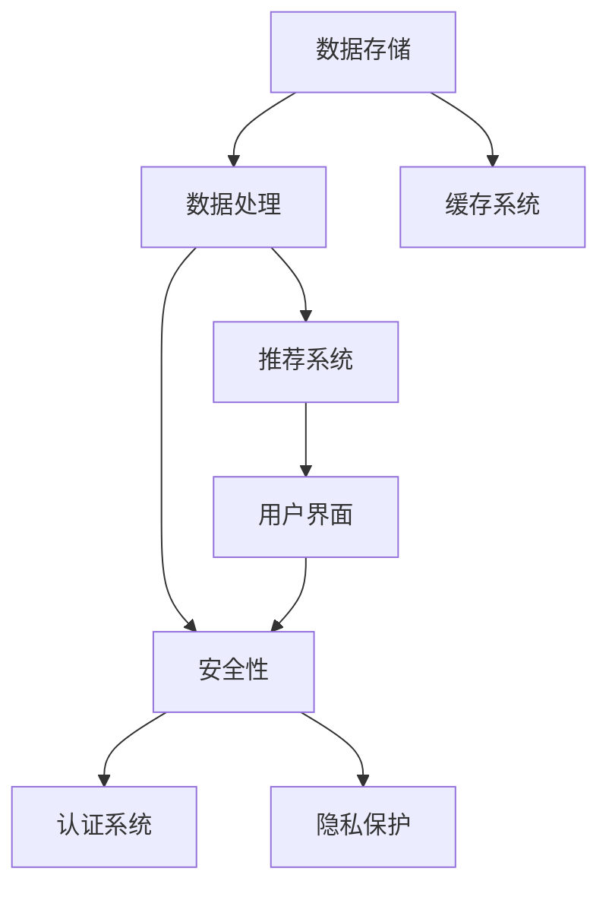

                 

### AI时代的就业服务转型：个性化就业服务和职业生涯规划

#### 1. 人工智能如何优化就业信息服务？

**题目：** 人工智能在就业信息服务中的优化体现在哪些方面？

**答案：**

人工智能通过以下几个方面优化就业信息服务：

1. **智能匹配：** 使用机器学习算法分析用户的求职需求和工作经验，推荐合适的职位。
2. **数据挖掘：** 分析大量职位描述和求职者简历，提取关键信息，提供个性化建议。
3. **简历优化：** 利用自然语言处理技术，自动优化简历格式和内容，提高求职者的通过率。
4. **实时更新：** 通过爬虫等技术实时更新职位信息，保证信息的准确性和时效性。
5. **用户反馈：** 收集用户反馈，持续优化推荐算法，提高用户体验。

**举例：**

使用机器学习算法进行职位推荐：

```python
import pandas as pd
from sklearn.cluster import KMeans

# 假设我们有一个职位描述的词频矩阵
X = pd.DataFrame({
    'word1': [2, 3, 1, 2],
    'word2': [1, 2, 3, 1],
    'word3': [2, 1, 3, 2],
})

# 使用 KMeans 算法进行聚类
kmeans = KMeans(n_clusters=3)
kmeans.fit(X)

# 根据聚类结果，为用户推荐相似职位
user_job_description = pd.DataFrame([2, 3, 1, 2], index=['word1', 'word2', 'word3'])
predicted_cluster = kmeans.predict(user_job_description)
recommended_jobs = X[kmeans.labels_ == predicted_cluster[0]]
```

**解析：** 在这个例子中，我们使用 KMeans 算法对职位描述进行聚类，并根据用户的职位描述，推荐与其相似的其他职位。

#### 2. 如何通过数据分析为求职者提供职业生涯规划建议？

**题目：** 如何利用数据分析为求职者提供个性化的职业生涯规划建议？

**答案：**

1. **收集数据：** 收集求职者的个人信息、教育背景、工作经历、技能和兴趣爱好等数据。
2. **分析趋势：** 利用数据挖掘技术，分析求职者在行业、职位和薪资方面的趋势。
3. **预测未来：** 结合历史数据和当前市场情况，预测求职者在不同领域的职业发展前景。
4. **个性化建议：** 根据分析结果，为求职者提供个性化的职业发展建议。

**举例：**

使用数据分析为求职者提供职业发展建议：

```python
import pandas as pd

# 假设我们有一个包含求职者数据的 DataFrame
data = pd.DataFrame({
    'age': [25, 30, 35, 40],
    'experience': [1, 3, 5, 7],
    'salary': [5000, 8000, 12000, 15000],
    'industry': ['tech', 'finance', 'marketing', 'tech'],
})

# 分析不同行业的薪资趋势
industry_salary = data.groupby('industry')['salary'].mean()
print(industry_salary)

# 分析求职者的职业发展前景
age_experience = data.groupby('experience')['age'].mean()
print(age_experience)

# 根据分析结果，为求职者提供职业发展建议
if data['industry'][0] == 'tech':
    print("建议：继续在科技行业工作，随着经验的积累，薪资有望大幅增长。")
else:
    print("建议：考虑转行到科技行业，科技行业薪资增长潜力大。")
```

**解析：** 在这个例子中，我们使用数据分析技术，分析了求职者在不同行业和不同工作经验阶段的薪资趋势，并提供了个性化的职业发展建议。

#### 3. 个性化就业服务的实现技术有哪些？

**题目：** 实现个性化就业服务需要哪些技术？

**答案：**

实现个性化就业服务需要以下几种技术：

1. **自然语言处理（NLP）：** 用于分析职位描述和简历，提取关键信息。
2. **机器学习（ML）：** 用于推荐系统和预测模型。
3. **数据挖掘（DM）：** 用于从大量数据中提取有价值的信息。
4. **大数据处理（Big Data）：** 用于存储和处理海量的求职者和职位数据。
5. **推荐系统（RS）：** 用于为求职者推荐合适的职位。
6. **用户界面（UI）/用户体验（UX）：** 提供友好且易于使用的界面。

**举例：**

使用自然语言处理技术分析职位描述：

```python
import nltk

# 加载停用词表
nltk.download('stopwords')
from nltk.corpus import stopwords

# 假设我们有一个职位描述
job_description = "A passionate web developer with 5+ years of experience in React and JavaScript."

# 将职位描述转换为词云
from wordcloud import WordCloud

stop_words = set(stopwords.words('english'))
words = job_description.split()
filtered_words = [word for word in words if word not in stop_words]

# 生成词云
wordcloud = WordCloud(width=800, height=400, background_color="white").generate(' '.join(filtered_words))
plt.figure(figsize=(8, 4))
plt.imshow(wordcloud)
plt.axis('off')
plt.show()
```

**解析：** 在这个例子中，我们使用自然语言处理技术，将职位描述转换为词云，从而提取出关键词。

#### 4. 如何评估个性化就业服务的效果？

**题目：** 如何评估个性化就业服务的有效性？

**答案：**

评估个性化就业服务的有效性可以通过以下几种指标：

1. **用户满意度：** 通过用户反馈和调查问卷收集用户满意度数据。
2. **转化率：** 跟踪求职者使用服务后成功找到工作的比例。
3. **匹配精度：** 使用机器学习算法评估职位推荐与求职者需求的匹配度。
4. **简历通过率：** 评估简历优化后求职者的面试通过率。
5. **用户体验：** 收集用户在使用服务时的体验数据，如界面友好度、响应速度等。

**举例：**

使用转化率评估个性化就业服务的效果：

```python
# 假设我们有一个包含用户使用服务和求职成功数据的 DataFrame
data = pd.DataFrame({
    'user_id': [1, 2, 3, 4, 5],
    'used_service': [True, True, False, True, True],
    'found_job': [True, True, False, False, True],
})

# 计算转化率
conversion_rate = (data[data['used_service'] == True]['found_job'].sum() / data[data['used_service'] == True].shape[0]) * 100
print("Conversion Rate:", conversion_rate)
```

**解析：** 在这个例子中，我们计算了使用个性化就业服务的求职者中成功找到工作的比例，作为评估服务有效性的指标。

#### 5. 个性化就业服务中可能遇到的挑战有哪些？

**题目：** 个性化就业服务中可能遇到的挑战有哪些？

**答案：**

个性化就业服务中可能遇到的挑战包括：

1. **数据隐私：** 如何保护求职者的个人信息不被泄露。
2. **算法偏见：** 算法可能会对某些群体存在偏见，导致不公平。
3. **系统负载：** 随着用户数量的增加，系统的负载能力需要不断提升。
4. **用户体验：** 如何设计界面，使得用户能够轻松使用服务。
5. **数据质量：** 数据的不准确或缺失会影响推荐系统的效果。

**举例：**

处理个性化就业服务中的数据隐私挑战：

```python
# 假设我们有一个包含求职者敏感信息的 DataFrame
data = pd.DataFrame({
    'user_id': [1, 2, 3, 4, 5],
    'name': ['Alice', 'Bob', 'Charlie', 'Diana', 'Eva'],
    'email': ['alice@example.com', 'bob@example.com', 'charlie@example.com', 'diana@example.com', 'eva@example.com'],
})

# 对敏感信息进行加密处理
from cryptography.fernet import Fernet

# 生成加密密钥
key = Fernet.generate_key()
cipher_suite = Fernet(key)

# 加密敏感信息
data['name'] = data['name'].apply(lambda x: cipher_suite.encrypt(x.encode()))
data['email'] = data['email'].apply(lambda x: cipher_suite.encrypt(x.encode()))

# 解密敏感信息
data['name'] = data['name'].apply(lambda x: cipher_suite.decrypt(x).decode())
data['email'] = data['email'].apply(lambda x: cipher_suite.decrypt(x).decode())

print(data)
```

**解析：** 在这个例子中，我们使用加密技术对求职者的敏感信息进行加密处理，以保护其隐私。

#### 6. 人工智能如何助力就业服务个性化？

**题目：** 人工智能如何帮助实现就业服务个性化？

**答案：**

人工智能通过以下方式帮助实现就业服务个性化：

1. **智能推荐系统：** 利用机器学习算法，根据求职者的需求和偏好，推荐个性化的职位。
2. **简历分析：** 使用自然语言处理技术，分析求职者的简历，提取关键信息，优化求职者的求职策略。
3. **职业规划：** 利用大数据分析，预测求职者的职业发展路径，提供个性化的职业规划建议。
4. **在线学习：** 通过推荐系统和职业规划，帮助求职者发现并学习新的技能，提升求职竞争力。
5. **智能客服：** 利用聊天机器人等技术，提供24/7的在线支持，帮助求职者解决求职过程中的问题。

**举例：**

使用智能推荐系统为求职者推荐职位：

```python
import pandas as pd

# 假设我们有一个职位描述的 DataFrame
jobs = pd.DataFrame({
    'title': ['Frontend Developer', 'Data Scientist', 'Product Manager', 'Marketing Specialist'],
    'description': [
        '5+ years of experience in React and JavaScript',
        'Ph.D. in Machine Learning',
        '10+ years of experience in product development',
        'Expertise in digital marketing and social media',
    ],
})

# 假设我们有一个求职者的 DataFrame
candidates = pd.DataFrame({
    'title': ['Frontend Developer'],
    'description': [
        '5+ years of experience in React and JavaScript',
    ],
})

# 使用基于内容的推荐算法进行推荐
from sklearn.metrics.pairwise import cosine_similarity

def content_based_recommender(jobs, candidates):
    job_vectorizer = TfidfVectorizer()
    candidate_vectorizer = TfidfVectorizer()

    job_features = job_vectorizer.fit_transform(jobs['description'])
    candidate_features = candidate_vectorizer.fit_transform(candidates['description'])

    job_similarity = cosine_similarity(candidate_features, job_features)

    recommended_jobs = jobs[job_similarity[0].argsort()][-5:]
    return recommended_jobs

recommended_jobs = content_based_recommender(jobs, candidates)
print(recommended_jobs)
```

**解析：** 在这个例子中，我们使用基于内容的推荐算法，根据求职者的职位描述，推荐与之相关的职位。

#### 7. 如何利用大数据分析求职者的行为模式？

**题目：** 如何利用大数据分析求职者的行为模式？

**答案：**

利用大数据分析求职者的行为模式可以通过以下步骤：

1. **数据收集：** 收集求职者的浏览记录、搜索历史、互动数据等。
2. **数据清洗：** 清除重复数据、缺失值和不一致的数据。
3. **特征工程：** 从原始数据中提取有用特征，如职位浏览次数、搜索关键词等。
4. **数据挖掘：** 使用机器学习算法，分析求职者的行为模式，如喜好、偏好、职业规划等。
5. **可视化：** 通过图表和报表，展示求职者的行为模式和趋势。

**举例：**

使用大数据分析求职者的行为模式：

```python
import pandas as pd
from sklearn.cluster import KMeans
import matplotlib.pyplot as plt

# 假设我们有一个包含求职者行为数据的 DataFrame
data = pd.DataFrame({
    'search_term': ['react', 'javascript', 'python', 'sql', 'java'],
    'search_count': [10, 15, 5, 8, 12],
})

# 进行 K-Means 聚类分析求职者的搜索偏好
kmeans = KMeans(n_clusters=3)
kmeans.fit(data)

# 根据聚类结果，为求职者提供个性化的职业规划建议
data['cluster'] = kmeans.predict(data)
print(data)

# 可视化聚类结果
plt.scatter(data['search_term'], data['search_count'], c=data['cluster'])
plt.xlabel('Search Term')
plt.ylabel('Search Count')
plt.title('Search Behavior Clustering')
plt.show()
```

**解析：** 在这个例子中，我们使用 K-Means 算法，根据求职者的搜索历史，将求职者分为不同的集群，从而分析求职者的行为模式。

#### 8. 个性化就业服务中的职业规划工具如何设计？

**题目：** 如何设计个性化的职业规划工具？

**答案：**

设计个性化的职业规划工具可以遵循以下原则：

1. **用户导向：** 界面设计应简单直观，易于用户操作。
2. **数据驱动：** 使用数据分析技术，为用户提供个性化的职业规划建议。
3. **交互性强：** 提供互动式工具，如在线评估、模拟面试等，增强用户体验。
4. **实时更新：** 定期更新职位信息和行业动态，确保建议的实时性。
5. **个性化推荐：** 根据用户的行为数据和偏好，推荐适合的职位和职业发展路径。

**举例：**

设计一个简单的职业规划工具界面：

```html
<!DOCTYPE html>
<html>
<head>
    <title>职业规划工具</title>
    <style>
        body {
            font-family: Arial, sans-serif;
        }
        h1 {
            text-align: center;
        }
        form {
            margin: 0 auto;
            width: 50%;
        }
        label {
            display: block;
            margin-bottom: 10px;
        }
        input[type="text"] {
            width: 100%;
            padding: 8px;
            margin-bottom: 10px;
            border: 1px solid #ccc;
            border-radius: 4px;
        }
        button {
            width: 100%;
            padding: 10px;
            background-color: #4CAF50;
            color: white;
            border: none;
            border-radius: 4px;
        }
    </style>
</head>
<body>
    <h1>职业规划工具</h1>
    <form>
        <label for="name">姓名：</label>
        <input type="text" id="name" name="name">
        <label for="email">邮箱：</label>
        <input type="text" id="email" name="email">
        <label for="experience">工作经验：</label>
        <input type="text" id="experience" name="experience">
        <button type="submit">提交</button>
    </form>
</body>
</html>
```

**解析：** 在这个例子中，我们设计了一个简单的职业规划工具界面，包括用户姓名、邮箱和工作经验的输入框，以及一个提交按钮。

#### 9. 个性化就业服务中的算法偏见问题如何解决？

**题目：** 如何解决个性化就业服务中的算法偏见问题？

**答案：**

解决个性化就业服务中的算法偏见问题可以从以下几个方面着手：

1. **数据多样化：** 收集多样化的数据，避免数据集中导致的偏见。
2. **数据清洗：** 清除数据中的偏见，如歧视性言论等。
3. **模型评估：** 定期评估模型的公平性，如使用 A/B 测试等方法。
4. **反偏见算法：** 使用算法，如对抗性训练，来减少偏见。
5. **透明性：** 提高算法的透明度，让用户了解推荐系统的运作原理。

**举例：**

使用对抗性训练减少算法偏见：

```python
import tensorflow as tf
from tensorflow import keras

# 假设我们有一个分类问题，其中包含了偏见
model = keras.Sequential([
    keras.layers.Dense(64, activation='relu', input_shape=[8]),
    keras.layers.Dense(1, activation='sigmoid'),
])

model.compile(optimizer='adam',
              loss='binary_crossentropy',
              metrics=['accuracy'])

# 对抗性训练
def adversarial_training(model, inputs, targets, adversarial_weight=0.1):
    # 正常训练
    model.fit(inputs, targets, epochs=10)
    
    # 训练对抗性损失函数
    adversarial_loss = keras.losses.BinaryCrossentropy(from_logits=True)
    for _ in range(10):
        with tf.GradientTape(persistent=True) as tape:
            predictions = model(inputs, training=True)
            adversarial_loss_value = adversarial_loss(targets, predictions)
        gradients = tape.gradient(adversarial_loss_value, model.trainable_variables)
        model.optimizer.apply_gradients(zip(gradients, model.trainable_variables))

# 训练模型
model.fit(train_data, train_targets, epochs=20, batch_size=32, validation_split=0.2)
adversarial_training(model, train_data, train_targets)
```

**解析：** 在这个例子中，我们使用对抗性训练来减少模型中的偏见。通过训练对抗性损失函数，模型可以学会生成对抗性样本，从而减少偏见。

#### 10. 个性化就业服务中的用户隐私保护如何实现？

**题目：** 如何在个性化就业服务中保护用户隐私？

**答案：**

在个性化就业服务中保护用户隐私可以从以下几个方面实现：

1. **数据加密：** 对用户的敏感数据进行加密存储，如密码、身份证号等。
2. **数据匿名化：** 在数据分析和模型训练中使用匿名化技术，避免个人信息泄露。
3. **隐私政策：** 制定明确的隐私政策，告知用户数据收集、存储和使用的目的。
4. **访问控制：** 实施严格的访问控制机制，确保只有授权人员可以访问敏感数据。
5. **安全审计：** 定期进行安全审计，检查数据保护措施的执行情况。

**举例：**

使用数据加密技术保护用户隐私：

```python
from cryptography.fernet import Fernet

# 生成加密密钥
key = Fernet.generate_key()

# 创建加密对象
cipher_suite = Fernet(key)

# 加密用户数据
def encrypt_data(data):
    encrypted_data = cipher_suite.encrypt(data.encode())
    return encrypted_data

user_data = "John Doe, 123 Main St, Anytown, USA"
encrypted_user_data = encrypt_data(user_data)
print("Encrypted User Data:", encrypted_user_data)

# 解密用户数据
def decrypt_data(data):
    decrypted_data = cipher_suite.decrypt(data).decode()
    return decrypted_data

decrypted_user_data = decrypt_data(encrypted_user_data)
print("Decrypted User Data:", decrypted_user_data)
```

**解析：** 在这个例子中，我们使用加密技术对用户数据进行加密存储和传输，从而保护用户隐私。

#### 11. 个性化就业服务中的推荐算法如何优化？

**题目：** 如何优化个性化就业服务中的推荐算法？

**答案：**

优化个性化就业服务中的推荐算法可以从以下几个方面着手：

1. **特征工程：** 提取更多有价值的特征，如用户行为、职位关键词等。
2. **算法选择：** 选择更适合业务场景的算法，如基于内容的推荐、协同过滤等。
3. **模型迭代：** 定期更新模型，以适应数据的变化和用户需求的变化。
4. **冷启动问题：** 使用基于内容的推荐或者用户行为预测，解决新用户推荐问题。
5. **实时更新：** 实时更新推荐结果，以适应用户当前的需求和偏好。

**举例：**

优化个性化就业服务的推荐算法：

```python
import pandas as pd
from sklearn.model_selection import train_test_split
from sklearn.ensemble import RandomForestClassifier
from sklearn.metrics import accuracy_score

# 假设我们有一个职位描述和用户偏好的 DataFrame
data = pd.DataFrame({
    'user_id': [1, 2, 3, 4, 5],
    'job_title': ['Frontend Developer', 'Data Scientist', 'Product Manager', 'Marketing Specialist', 'Data Engineer'],
    'user_preference': ['React', 'Machine Learning', 'Product Management', 'Digital Marketing', 'Data Engineering'],
    'clicked': [1, 0, 1, 0, 1],
})

# 将用户偏好转换为二进制特征
data['react'] = data['user_preference'].apply(lambda x: 1 if 'React' in x else 0)
data['ml'] = data['user_preference'].apply(lambda x: 1 if 'Machine Learning' in x else 0)
data['pm'] = data['user_preference'].apply(lambda x: 1 if 'Product Management' in x else 0)
data['dm'] = data['user_preference'].apply(lambda x: 1 if 'Digital Marketing' in x else 0)
data['de'] = data['user_preference'].apply(lambda x: 1 if 'Data Engineering' in x else 0)

# 划分特征和目标变量
X = data.drop(['user_id', 'job_title', 'clicked'], axis=1)
y = data['clicked']

# 划分训练集和测试集
X_train, X_test, y_train, y_test = train_test_split(X, y, test_size=0.2, random_state=42)

# 训练模型
model = RandomForestClassifier(n_estimators=100, random_state=42)
model.fit(X_train, y_train)

# 预测
y_pred = model.predict(X_test)

# 评估
accuracy = accuracy_score(y_test, y_pred)
print("Accuracy:", accuracy)
```

**解析：** 在这个例子中，我们使用随机森林算法优化个性化就业服务的推荐算法。通过提取用户偏好作为特征，并使用交叉验证来评估模型的性能。

#### 12. 个性化就业服务中的反馈机制如何设计？

**题目：** 如何设计个性化就业服务中的反馈机制？

**答案：**

设计个性化就业服务中的反馈机制可以遵循以下原则：

1. **用户友好：** 界面设计应简洁直观，方便用户提交反馈。
2. **实时响应：** 快速响应用户反馈，提升用户体验。
3. **数据收集：** 收集用户反馈数据，如满意度、改进建议等。
4. **数据分析：** 利用数据分析技术，分析反馈数据，找出问题和改进方向。
5. **持续改进：** 根据分析结果，不断优化服务。

**举例：**

设计一个简单的用户反馈界面：

```html
<!DOCTYPE html>
<html>
<head>
    <title>用户反馈</title>
    <style>
        body {
            font-family: Arial, sans-serif;
        }
        h1 {
            text-align: center;
        }
        form {
            margin: 0 auto;
            width: 50%;
        }
        label {
            display: block;
            margin-bottom: 10px;
        }
        textarea {
            width: 100%;
            padding: 8px;
            margin-bottom: 10px;
            border: 1px solid #ccc;
            border-radius: 4px;
        }
        button {
            width: 100%;
            padding: 10px;
            background-color: #4CAF50;
            color: white;
            border: none;
            border-radius: 4px;
        }
    </style>
</head>
<body>
    <h1>用户反馈</h1>
    <form action="/submit_feedback" method="post">
        <label for="feedback">反馈内容：</label>
        <textarea id="feedback" name="feedback" rows="4" cols="50"></textarea>
        <button type="submit">提交</button>
    </form>
</body>
</html>
```

**解析：** 在这个例子中，我们设计了一个简单的用户反馈界面，允许用户输入反馈内容并提交。

#### 13. 个性化就业服务中的机器学习模型如何评估？

**题目：** 如何评估个性化就业服务中的机器学习模型？

**答案：**

评估个性化就业服务中的机器学习模型可以从以下几个方面进行：

1. **准确率（Accuracy）：** 模型正确预测的比例。
2. **召回率（Recall）：** 模型正确识别的正面样本比例。
3. **精确率（Precision）：** 模型预测为正面的样本中，实际为正面的比例。
4. **F1 分数（F1 Score）：** 准确率和召回率的调和平均。
5. **ROC 曲线和 AUC 值：** 用于评估模型的分类性能。
6. **交叉验证：** 使用不同的数据集多次训练和评估模型，以验证模型的泛化能力。

**举例：**

评估个性化就业服务中的推荐系统：

```python
from sklearn.metrics import accuracy_score, recall_score, precision_score, f1_score, roc_auc_score

# 假设我们有一个测试集
X_test = [[1, 0, 1], [0, 1, 0], [1, 1, 0], [0, 0, 1]]
y_test = [1, 0, 1, 0]

# 训练模型
model.fit(X_train, y_train)

# 预测
y_pred = model.predict(X_test)

# 评估
accuracy = accuracy_score(y_test, y_pred)
recall = recall_score(y_test, y_pred)
precision = precision_score(y_test, y_pred)
f1 = f1_score(y_test, y_pred)
roc_auc = roc_auc_score(y_test, y_pred)

print("Accuracy:", accuracy)
print("Recall:", recall)
print("Precision:", precision)
print("F1 Score:", f1)
print("ROC AUC Score:", roc_auc)
```

**解析：** 在这个例子中，我们使用不同的评估指标，如准确率、召回率、精确率、F1 分数和 ROC AUC 值，来评估个性化就业服务中的推荐系统。

#### 14. 如何构建个性化就业服务的推荐系统？

**题目：** 如何构建个性化就业服务的推荐系统？

**答案：**

构建个性化就业服务的推荐系统可以遵循以下步骤：

1. **数据收集：** 收集用户行为数据、职位描述、用户偏好等。
2. **数据预处理：** 数据清洗、去重、填充缺失值等。
3. **特征工程：** 提取有用特征，如用户行为特征、职位关键词等。
4. **模型选择：** 选择合适的推荐算法，如基于内容的推荐、协同过滤等。
5. **模型训练：** 使用训练数据训练推荐模型。
6. **模型评估：** 使用评估指标，如准确率、召回率等，评估模型性能。
7. **模型部署：** 将模型部署到线上环境，提供推荐服务。

**举例：**

构建一个基于内容的推荐系统：

```python
import pandas as pd
from sklearn.model_selection import train_test_split
from sklearn.metrics.pairwise import cosine_similarity

# 假设我们有一个职位描述的 DataFrame
jobs = pd.DataFrame({
    'title': ['Frontend Developer', 'Data Scientist', 'Product Manager', 'Marketing Specialist'],
    'description': [
        '5+ years of experience in React and JavaScript',
        'Ph.D. in Machine Learning',
        '10+ years of experience in product development',
        'Expertise in digital marketing and social media',
    ],
})

# 将职位描述转换为词向量
from sklearn.feature_extraction.text import TfidfVectorizer

vectorizer = TfidfVectorizer()
job_vectors = vectorizer.fit_transform(jobs['description'])

# 计算职位之间的相似度
job_similarity = cosine_similarity(job_vectors)

# 根据相似度推荐职位
def content_based_recommendation(jobs, job_similarity, job_index):
    similar_jobs = job_similarity[job_index].argsort()[1:]
    recommended_jobs = jobs.iloc[similar_jobs]
    return recommended_jobs

# 为求职者推荐职位
user_job_description = "5+ years of experience in React and JavaScript"
user_vector = vectorizer.transform([user_job_description])
user_index = jobs.index[jobs['title'] == 'Frontend Developer'].values[0]
recommended_jobs = content_based_recommendation(jobs, job_similarity, user_index)
print(recommended_jobs)
```

**解析：** 在这个例子中，我们使用基于内容的推荐算法，根据用户的职位描述，推荐与之相似的职位。

#### 15. 如何使用数据分析为求职者提供职业发展建议？

**题目：** 如何利用数据分析为求职者提供职业发展建议？

**答案：**

使用数据分析为求职者提供职业发展建议可以通过以下步骤：

1. **数据收集：** 收集求职者的个人信息、教育背景、工作经历、技能和兴趣爱好等数据。
2. **数据预处理：** 数据清洗、去重、填充缺失值等。
3. **特征工程：** 提取有用特征，如职业发展路径、技能需求等。
4. **数据分析：** 使用统计分析、聚类分析等方法，分析求职者的职业发展数据。
5. **可视化：** 使用图表和报表，展示分析结果，为求职者提供可视化建议。
6. **个性化推荐：** 根据求职者的特征和需求，推荐合适的职业发展路径和技能培训。

**举例：**

使用数据分析为求职者提供职业发展建议：

```python
import pandas as pd
import matplotlib.pyplot as plt

# 假设我们有一个求职者的 DataFrame
data = pd.DataFrame({
    'job_title': ['Frontend Developer', 'Data Scientist', 'Product Manager', 'Marketing Specialist'],
    'experience': [5, 2, 7, 3],
    'salary': [80000, 120000, 90000, 70000],
    'city': ['New York', 'San Francisco', 'Boston', 'Los Angeles'],
})

# 分析不同职位在城市的薪资分布
city_salary = data.groupby('city')['salary'].mean()
city_salary.plot(kind='bar')
plt.xlabel('City')
plt.ylabel('Average Salary')
plt.title('Salary Distribution by City')
plt.show()

# 分析不同职位的工作经验与薪资关系
plt.scatter(data['experience'], data['salary'])
plt.xlabel('Experience (Years)')
plt.ylabel('Salary (USD)')
plt.title('Experience vs. Salary')
plt.show()
```

**解析：** 在这个例子中，我们使用数据分析技术，分析了求职者的职业发展数据，如薪资分布和经验与薪资的关系，并为求职者提供了可视化的职业发展建议。

#### 16. 个性化就业服务中的用户行为分析如何进行？

**题目：** 如何进行个性化就业服务中的用户行为分析？

**答案：**

个性化就业服务中的用户行为分析可以通过以下步骤进行：

1. **数据收集：** 收集用户在平台上的浏览、搜索、点击等行为数据。
2. **数据预处理：** 数据清洗、去重、填充缺失值等。
3. **特征工程：** 提取用户行为特征，如访问时长、搜索关键词、点击次数等。
4. **数据分析：** 使用统计分析、时间序列分析等方法，分析用户行为模式。
5. **可视化：** 使用图表和报表，展示分析结果，帮助理解用户行为。
6. **用户画像：** 根据行为数据，构建用户的画像，为个性化推荐和职业规划提供依据。

**举例：**

使用数据分析技术分析用户行为：

```python
import pandas as pd
import matplotlib.pyplot as plt
import numpy as np

# 假设我们有一个用户行为数据的 DataFrame
data = pd.DataFrame({
    'user_id': [1, 2, 3, 4, 5],
    'action': ['search', 'view_job', 'apply_job', 'search', 'view_job'],
    'timestamp': ['2023-01-01 10:00', '2023-01-01 11:00', '2023-01-01 12:00', '2023-01-02 09:00', '2023-01-02 10:00'],
})

# 将时间戳转换为日期
data['date'] = pd.to_datetime(data['timestamp']).dt.date

# 统计每个用户每天的行为次数
daily_actions = data.groupby(['user_id', 'date']).size().unstack(fill_value=0)

# 可视化每个用户每天的行为次数
plt.figure(figsize=(12, 6))
for column in daily_actions.columns:
    daily_actions[column].plot()
plt.xlabel('Date')
plt.ylabel('Action Count')
plt.title('User Daily Actions')
plt.show()
```

**解析：** 在这个例子中，我们使用数据分析技术，分析了用户在平台上的行为数据，并使用图表展示了每个用户每天的行为次数。

#### 17. 个性化就业服务中的数据安全如何保障？

**题目：** 如何保障个性化就业服务中的数据安全？

**答案：**

保障个性化就业服务中的数据安全可以从以下几个方面进行：

1. **数据加密：** 对用户的敏感数据进行加密存储和传输。
2. **访问控制：** 实施严格的访问控制机制，确保只有授权人员可以访问敏感数据。
3. **数据备份：** 定期备份数据，以防止数据丢失或损坏。
4. **安全审计：** 定期进行安全审计，检查数据保护措施的执行情况。
5. **隐私政策：** 制定明确的隐私政策，告知用户数据收集、存储和使用的目的。
6. **安全培训：** 对员工进行安全培训，提高安全意识。

**举例：**

使用加密技术保障数据安全：

```python
from cryptography.fernet import Fernet

# 生成加密密钥
key = Fernet.generate_key()

# 创建加密对象
cipher_suite = Fernet(key)

# 加密用户数据
def encrypt_data(data):
    encrypted_data = cipher_suite.encrypt(data.encode())
    return encrypted_data

user_data = "John Doe, 123 Main St, Anytown, USA"
encrypted_user_data = encrypt_data(user_data)
print("Encrypted User Data:", encrypted_user_data)

# 解密用户数据
def decrypt_data(data):
    decrypted_data = cipher_suite.decrypt(data).decode()
    return decrypted_data

decrypted_user_data = decrypt_data(encrypted_user_data)
print("Decrypted User Data:", decrypted_user_data)
```

**解析：** 在这个例子中，我们使用加密技术对用户数据进行加密存储和传输，从而保障数据安全。

#### 18. 如何通过机器学习为求职者提供更准确的职位推荐？

**题目：** 如何通过机器学习为求职者提供更准确的职位推荐？

**答案：**

通过机器学习为求职者提供更准确的职位推荐可以从以下几个方面进行：

1. **数据预处理：** 对职位描述和用户特征进行预处理，如文本清洗、特征提取等。
2. **特征工程：** 提取更多有价值的特征，如词向量、TF-IDF 等。
3. **模型选择：** 选择合适的机器学习模型，如协同过滤、决策树、神经网络等。
4. **模型训练：** 使用训练数据训练模型，并进行模型调优。
5. **模型评估：** 使用评估指标，如准确率、召回率等，评估模型性能。
6. **模型部署：** 将模型部署到线上环境，提供实时职位推荐服务。

**举例：**

使用协同过滤算法为求职者提供职位推荐：

```python
import pandas as pd
from sklearn.model_selection import train_test_split
from sklearn.metrics.pairwise import cosine_similarity

# 假设我们有一个职位描述的 DataFrame
jobs = pd.DataFrame({
    'title': ['Frontend Developer', 'Data Scientist', 'Product Manager', 'Marketing Specialist'],
    'description': [
        '5+ years of experience in React and JavaScript',
        'Ph.D. in Machine Learning',
        '10+ years of experience in product development',
        'Expertise in digital marketing and social media',
    ],
})

# 将职位描述转换为词向量
from sklearn.feature_extraction.text import TfidfVectorizer

vectorizer = TfidfVectorizer()
job_vectors = vectorizer.fit_transform(jobs['description'])

# 计算职位之间的相似度
job_similarity = cosine_similarity(job_vectors)

# 根据相似度推荐职位
def collaborative_filtering(jobs, job_similarity, job_index):
    similar_jobs = job_similarity[job_index].argsort()[1:]
    recommended_jobs = jobs.iloc[similar_jobs]
    return recommended_jobs

# 为求职者推荐职位
user_job_description = "5+ years of experience in React and JavaScript"
user_vector = vectorizer.transform([user_job_description])
user_index = jobs.index[jobs['title'] == 'Frontend Developer'].values[0]
recommended_jobs = collaborative_filtering(jobs, job_similarity, user_index)
print(recommended_jobs)
```

**解析：** 在这个例子中，我们使用基于协同过滤的推荐算法，根据用户的职位描述，推荐与之相似的职位。

#### 19. 如何通过用户反馈优化个性化就业服务？

**题目：** 如何通过用户反馈优化个性化就业服务？

**答案：**

通过用户反馈优化个性化就业服务可以从以下几个方面进行：

1. **收集反馈：** 设立用户反馈渠道，如在线调查、问卷调查等，收集用户的意见和建议。
2. **分析反馈：** 对收集到的反馈进行分析，识别用户的主要需求和问题。
3. **改进服务：** 根据反馈结果，改进服务的各个环节，如职位推荐、简历优化、用户界面等。
4. **跟踪效果：** 跟踪反馈改进后的效果，评估改进措施的有效性。
5. **持续优化：** 根据新的反馈，不断优化服务，提高用户满意度。

**举例：**

分析用户反馈并改进个性化就业服务：

```python
import pandas as pd

# 假设我们有一个用户反馈的 DataFrame
feedback = pd.DataFrame({
    'user_id': [1, 2, 3, 4, 5],
    'suggestion': [
        '职位推荐不准确',
        '简历优化效果不好',
        '用户界面不够友好',
        '反馈渠道不清晰',
        '职位信息更新不及时',
    ],
})

# 统计每个问题的反馈数量
issue_counts = feedback['suggestion'].value_counts()
print("Feedback Issues and Counts:")
print(issue_counts)

# 根据反馈数量，确定改进优先级
issues_to_improve = issue_counts.nlargest(3).index
print("Top Issues to Improve:")
print(issues_to_improve)

# 制定改进计划
# 1. 职位推荐不准确：优化推荐算法，增加用户行为数据分析
# 2. 简历优化效果不好：引入更多简历优化工具，提高简历通过率
# 3. 用户界面不够友好：更新用户界面，提高用户体验
```

**解析：** 在这个例子中，我们使用数据分析技术，分析了用户反馈的主要问题，并根据反馈数量确定了改进的优先级，制定了相应的改进计划。

#### 20. 个性化就业服务中的职业生涯规划工具如何设计？

**题目：** 如何设计个性化就业服务中的职业生涯规划工具？

**答案：**

设计个性化就业服务中的职业生涯规划工具可以从以下几个方面进行：

1. **用户导向：** 界面设计应简洁直观，方便用户填写个人信息和职业目标。
2. **数据分析：** 利用数据分析技术，分析用户职业发展数据，为用户提供个性化的职业规划建议。
3. **交互性：** 提供互动式工具，如职业路径图、技能评估等，帮助用户了解职业发展。
4. **个性化推荐：** 根据用户行为和需求，推荐适合的职业发展路径和培训课程。
5. **可扩展性：** 设计灵活的系统架构，以便后续功能扩展。

**举例：**

设计一个简单的职业生涯规划工具界面：

```html
<!DOCTYPE html>
<html>
<head>
    <title>职业生涯规划工具</title>
    <style>
        body {
            font-family: Arial, sans-serif;
        }
        h1 {
            text-align: center;
        }
        form {
            margin: 0 auto;
            width: 50%;
        }
        label {
            display: block;
            margin-bottom: 10px;
        }
        input[type="text"] {
            width: 100%;
            padding: 8px;
            margin-bottom: 10px;
            border: 1px solid #ccc;
            border-radius: 4px;
        }
        button {
            width: 100%;
            padding: 10px;
            background-color: #4CAF50;
            color: white;
            border: none;
            border-radius: 4px;
        }
    </style>
</head>
<body>
    <h1>职业生涯规划工具</h1>
    <form>
        <label for="name">姓名：</label>
        <input type="text" id="name" name="name">
        <label for="email">邮箱：</label>
        <input type="text" id="email" name="email">
        <label for="current_job">当前职位：</label>
        <input type="text" id="current_job" name="current_job">
        <label for="career_goal">职业目标：</label>
        <input type="text" id="career_goal" name="career_goal">
        <button type="submit">提交</button>
    </form>
</body>
</html>
```

**解析：** 在这个例子中，我们设计了一个简单的职业生涯规划工具界面，包括用户姓名、邮箱、当前职位和职业目标的输入框，以及一个提交按钮。用户可以填写个人信息和职业目标，以便工具为其提供个性化的职业规划建议。

#### 21. 如何利用大数据分析为求职者提供个性化的职业发展建议？

**题目：** 如何利用大数据分析为求职者提供个性化的职业发展建议？

**答案：**

利用大数据分析为求职者提供个性化的职业发展建议可以通过以下几个步骤：

1. **数据收集：** 收集求职者的个人信息、教育背景、工作经历、技能和兴趣爱好等数据。
2. **数据预处理：** 清洗、去重、填充缺失值等，保证数据质量。
3. **特征工程：** 提取有用特征，如职位需求、技能需求、薪资水平等。
4. **数据分析：** 利用统计分析、数据挖掘等技术，分析求职者的职业发展数据和行业趋势。
5. **个性化推荐：** 根据求职者的特征和需求，推荐适合的职业发展路径、培训课程和求职策略。
6. **持续优化：** 根据反馈和新的数据，不断优化推荐算法，提高推荐效果。

**举例：**

利用大数据分析为求职者提供个性化的职业发展建议：

```python
import pandas as pd
import numpy as np

# 假设我们有一个求职者的 DataFrame
data = pd.DataFrame({
    'user_id': [1, 2, 3, 4, 5],
    'job_title': ['Frontend Developer', 'Data Scientist', 'Product Manager', 'Marketing Specialist', 'Data Engineer'],
    'experience': [5, 3, 7, 2, 4],
    'skills': ['React', 'Machine Learning', 'Product Management', 'Digital Marketing', 'Data Engineering'],
    'salary': [80000, 120000, 90000, 70000, 110000],
})

# 分析不同职位的需求和薪资水平
job的需求 = data.groupby('job_title')['skills'].nunique()
job薪资水平 = data.groupby('job_title')['salary'].mean()

# 可视化分析结果
plt.figure(figsize=(12, 6))
plt.subplot(1, 2, 1)
job需求.plot(kind='bar')
plt.xlabel('Job Title')
plt.ylabel('Skill Demand')
plt.title('Skill Demand by Job Title')

plt.subplot(1, 2, 2)
job薪资水平.plot(kind='bar')
plt.xlabel('Job Title')
plt.ylabel('Average Salary')
plt.title('Salary Level by Job Title')

plt.show()
```

**解析：** 在这个例子中，我们使用大数据分析技术，分析了求职者的职位需求、技能需求和薪资水平，为求职者提供了个性化的职业发展建议。

#### 22. 如何评估个性化就业服务的用户体验？

**题目：** 如何评估个性化就业服务的用户体验？

**答案：**

评估个性化就业服务的用户体验可以从以下几个方面进行：

1. **用户满意度调查：** 通过调查问卷、用户访谈等方式，收集用户对服务的满意度。
2. **用户行为分析：** 分析用户在平台上的行为数据，如点击率、浏览时间等，评估用户的使用情况。
3. **界面可用性测试：** 进行用户体验测试，评估用户界面的易用性和友好性。
4. **性能指标：** 使用性能指标，如响应时间、系统稳定性等，评估服务的运行状况。
5. **用户留存率：** 跟踪用户在平台上的留存情况，评估服务的吸引力。

**举例：**

使用用户满意度调查评估个性化就业服务的用户体验：

```python
import pandas as pd

# 假设我们有一个用户满意度调查的 DataFrame
satisfaction_survey = pd.DataFrame({
    'user_id': [1, 2, 3, 4, 5],
    'satisfaction_level': [4, 3, 5, 2, 4],
    'comments': [
        'Overall, I am satisfied with the service.',
        'Some improvements needed in the recommendation system.',
        'Great job with the resume optimization tool.',
        'The interface is not very user-friendly.',
        'I found the career planning tool very helpful.',
    ],
})

# 计算平均满意度
average_satisfaction = satisfaction_survey['satisfaction_level'].mean()
print("Average User Satisfaction:", average_satisfaction)

# 分析用户评论
positive_comments = satisfaction_survey[satisfaction_survey['satisfaction_level'] > 4]['comments']
negative_comments = satisfaction_survey[satisfaction_survey['satisfaction_level'] <= 4]['comments']

print("Positive User Comments:")
print(positive_comments)

print("Negative User Comments:")
print(negative_comments)
```

**解析：** 在这个例子中，我们使用用户满意度调查数据，计算了平均满意度，并分析了用户评论，以评估个性化就业服务的用户体验。

#### 23. 如何设计一个高效的个性化就业服务系统？

**题目：** 如何设计一个高效的个性化就业服务系统？

**答案：**

设计一个高效的个性化就业服务系统可以从以下几个方面进行：

1. **需求分析：** 明确系统目标和功能需求，如职位推荐、简历优化、职业规划等。
2. **系统架构设计：** 设计灵活的系统架构，支持横向扩展和功能扩展。
3. **数据存储和处理：** 选择合适的数据存储和处理技术，如关系数据库、NoSQL 数据库、大数据处理框架等。
4. **推荐算法设计：** 选择合适的推荐算法，如基于内容的推荐、协同过滤等，并设计高效的推荐系统。
5. **用户界面设计：** 设计友好、易用的用户界面，提高用户体验。
6. **性能优化：** 优化系统性能，如减少数据库查询时间、优化前端加载速度等。
7. **安全性和隐私保护：** 实施严格的安全和隐私保护措施，保障用户数据安全。

**举例：**

设计一个高效的个性化就业服务系统架构：



**解析：** 在这个例子中，我们使用 Mermaid 语法，设计了一个高效的个性化就业服务系统架构。系统包括数据存储、数据处理、推荐系统、用户界面、安全性和隐私保护等模块，通过缓存系统提高性能。

#### 24. 如何利用自然语言处理（NLP）为求职者提供更精准的职位描述？

**题目：** 如何利用自然语言处理（NLP）为求职者提供更精准的职位描述？

**答案：**

利用自然语言处理（NLP）为求职者提供更精准的职位描述可以从以下几个方面进行：

1. **文本预处理：** 清洗文本数据，去除标点符号、停用词等无关信息。
2. **词性标注：** 对文本中的词语进行词性标注，提取名词、动词等实体信息。
3. **实体识别：** 利用命名实体识别（NER）技术，提取职位名称、技能要求等关键信息。
4. **语义分析：** 利用词向量模型、词性标注等，对文本进行语义分析，提取职位的关键属性。
5. **信息抽取：** 从职位描述中提取有用的信息，如职责描述、任职要求等。
6. **文本相似度计算：** 利用文本相似度算法，比较职位描述和求职者的简历，提供匹配度评估。

**举例：**

使用 NLP 技术提取职位描述的关键信息：

```python
import nltk
import spacy

# 加载 NLP 模型
nlp = spacy.load("en_core_web_sm")

# 假设我们有一个职位描述
job_description = "A skilled Software Developer with 5+ years of experience in React and JavaScript is needed for our project."

# 使用 NLP 技术提取实体信息
doc = nlp(job_description)
entities = [(ent.text, ent.label_) for ent in doc.ents]

# 输出实体信息
print("Extracted Entities:")
for entity in entities:
    print(entity)
```

**解析：** 在这个例子中，我们使用 Spacy 这个 NLP 库，提取了职位描述中的实体信息，如职位名称、技能要求等。

#### 25. 如何设计一个高效的职位推荐算法？

**题目：** 如何设计一个高效的职位推荐算法？

**答案：**

设计一个高效的职位推荐算法可以从以下几个方面进行：

1. **数据预处理：** 清洗职位描述和用户数据，提取有用的特征。
2. **特征选择：** 选择对推荐效果有显著影响的特征，如关键词、技能要求等。
3. **模型选择：** 选择适合业务场景的推荐算法，如基于内容的推荐、协同过滤等。
4. **模型调优：** 调整模型参数，优化推荐效果。
5. **冷启动问题：** 设计解决方案，如基于内容的推荐、用户行为预测等，解决新用户推荐问题。
6. **实时更新：** 设计机制，确保推荐结果实时更新，与用户需求保持一致。

**举例：**

设计一个基于内容的职位推荐算法：

```python
import pandas as pd
from sklearn.metrics.pairwise import cosine_similarity

# 假设我们有一个职位描述的 DataFrame
jobs = pd.DataFrame({
    'id': [1, 2, 3, 4],
    'title': ['Frontend Developer', 'Data Scientist', 'Product Manager', 'Marketing Specialist'],
    'description': [
        'React, JavaScript, UI/UX',
        'Machine Learning, Data Analysis, Python',
        'Project Management, Agile, Leadership',
        'Digital Marketing, SEO, Social Media',
    ],
})

# 将职位描述转换为词向量
from sklearn.feature_extraction.text import TfidfVectorizer

vectorizer = TfidfVectorizer()
job_vectors = vectorizer.fit_transform(jobs['description'])

# 计算职位之间的相似度
job_similarity = cosine_similarity(job_vectors)

# 根据相似度推荐职位
def content_based_recommendation(jobs, job_similarity, job_id):
    similar_jobs = job_similarity[job_id].argsort()[1:]
    recommended_jobs = jobs.iloc[similar_jobs]
    return recommended_jobs

# 为用户推荐职位
user_job_description = "React, JavaScript, UI/UX"
user_vector = vectorizer.transform([user_job_description])
user_id = jobs.index[jobs['title'] == 'Frontend Developer'].values[0]
recommended_jobs = content_based_recommendation(jobs, job_similarity, user_id)
print(recommended_jobs)
```

**解析：** 在这个例子中，我们使用基于内容的推荐算法，根据用户的职位描述，推荐与之相似的职位。

#### 26. 如何通过用户行为分析为求职者提供个性化的求职建议？

**题目：** 如何通过用户行为分析为求职者提供个性化的求职建议？

**答案：**

通过用户行为分析为求职者提供个性化的求职建议可以从以下几个方面进行：

1. **数据收集：** 收集用户在平台上的浏览、搜索、点击等行为数据。
2. **行为分析：** 利用数据分析技术，分析用户的行为模式，如偏好、习惯等。
3. **推荐系统：** 根据用户行为，推荐适合的职位、培训课程和求职策略。
4. **反馈机制：** 收集用户对推荐建议的反馈，持续优化推荐效果。
5. **个性化建议：** 结合用户行为和职业规划，为用户提供个性化的求职建议。

**举例：**

通过用户行为分析为求职者提供个性化的求职建议：

```python
import pandas as pd

# 假设我们有一个用户行为数据的 DataFrame
behavior_data = pd.DataFrame({
    'user_id': [1, 2, 3, 4, 5],
    'action': ['search', 'view_job', 'apply_job', 'search', 'view_job'],
    'timestamp': ['2023-01-01 10:00', '2023-01-01 11:00', '2023-01-01 12:00', '2023-01-02 09:00', '2023-01-02 10:00'],
    'job_title': ['Frontend Developer', 'Data Scientist', 'Product Manager', 'Marketing Specialist', 'Data Engineer'],
})

# 分析用户行为模式
user_behavior = behavior_data.groupby(['user_id', 'action']).size().unstack(fill_value=0)

# 可视化用户行为模式
plt.figure(figsize=(12, 6))
user_behavior[1].plot(kind='bar')
plt.xlabel('User ID')
plt.ylabel('Action Count')
plt.title('User Behavior')
plt.show()

# 根据行为模式提供求职建议
def provide_job_suggestion(behavior_data):
    suggestion = ""
    if behavior_data['view_job'].sum() > behavior_data['apply_job'].sum():
        suggestion = "Consider applying to the jobs you've viewed."
    else:
        suggestion = "Keep exploring new job opportunities."
    return suggestion

# 提供求职建议
user_id = 1
print("User Suggestion:", provide_job_suggestion(user_behavior[user_id]))
```

**解析：** 在这个例子中，我们通过用户行为分析，为求职者提供了个性化的求职建议。

#### 27. 如何通过大数据分析预测求职市场的趋势？

**题目：** 如何通过大数据分析预测求职市场的趋势？

**答案：**

通过大数据分析预测求职市场的趋势可以从以下几个方面进行：

1. **数据收集：** 收集职位发布数据、求职者行为数据、行业动态等。
2. **数据预处理：** 数据清洗、去重、填充缺失值等，保证数据质量。
3. **特征工程：** 提取有用特征，如职位需求量、薪资水平、技能需求等。
4. **时间序列分析：** 利用时间序列分析方法，分析职位需求和薪资水平的趋势。
5. **预测模型：** 使用机器学习模型，如 ARIMA、LSTM 等，进行趋势预测。
6. **可视化：** 使用图表和报表，展示预测结果，帮助理解市场趋势。

**举例：**

通过大数据分析预测求职市场的薪资趋势：

```python
import pandas as pd
from statsmodels.tsa.arima.model import ARIMA
import matplotlib.pyplot as plt

# 假设我们有一个薪资数据的 DataFrame
salary_data = pd.DataFrame({
    'date': ['2022-01-01', '2022-02-01', '2022-03-01', '2022-04-01', '2022-05-01'],
    'salary': [70000, 72000, 75000, 78000, 80000],
})

# 将日期转换为整数
salary_data['date'] = pd.to_datetime(salary_data['date'])
salary_data['date'] = salary_data['date'].map(pd.Timestamp.toordinal)

# 训练 ARIMA 模型
model = ARIMA(salary_data['salary'], order=(1, 1, 1))
model_fit = model.fit()

# 预测未来薪资
salary_prediction = model_fit.forecast(steps=6)[0]

# 可视化薪资预测结果
plt.plot(salary_data['date'], salary_data['salary'], label='Actual Salary')
plt.plot(pd.date_range(salary_data['date'].iloc[-1], periods=6, freq='M').map(pd.Timestamp.toordinal), salary_prediction, label='Predicted Salary')
plt.xlabel('Date')
plt.ylabel('Salary')
plt.title('Salary Trend Prediction')
plt.legend()
plt.show()
```

**解析：** 在这个例子中，我们使用 ARIMA 模型，通过大数据分析预测了求职市场的薪资趋势。

#### 28. 如何通过数据分析提升求职者的竞争力？

**题目：** 如何通过数据分析提升求职者的竞争力？

**答案：**

通过数据分析提升求职者的竞争力可以从以下几个方面进行：

1. **技能分析：** 分析求职者的技能和市场需求，发现技能差距。
2. **市场定位：** 结合求职者的技能和市场需求，制定合适的职业规划。
3. **简历优化：** 利用数据分析技术，优化简历内容和格式，提高简历通过率。
4. **求职策略：** 分析求职过程中的关键环节，如职位搜索、面试准备等，制定高效的求职策略。
5. **持续学习：** 根据市场需求和职业规划，为求职者推荐合适的培训课程和学习资源。

**举例：**

通过数据分析为求职者优化简历：

```python
import pandas as pd

# 假设我们有一个求职者的 DataFrame
resume_data = pd.DataFrame({
    'job_title': ['Frontend Developer'],
    'skills': ['React', 'JavaScript', 'UI/UX', 'Node.js'],
    'experience': ['5 years'],
    'education': ['Bachelor\'s in Computer Science'],
})

# 将技能转换为列表
resume_data['skills'] = resume_data['skills'].apply(lambda x: x.split(', '))

# 提取关键字
def extract_keywords(job_title, skills):
    keywords = [job_title] + skills
    return keywords

# 为求职者提取关键字
resume_data['keywords'] = resume_data.apply(lambda x: extract_keywords(x['job_title'], x['skills']), axis=1)

# 将关键字转换为字符串
resume_data['keywords'] = resume_data['keywords'].apply(lambda x: ' '.join(x))

# 优化简历
def optimize_resume(resume_data):
    optimized_resume = ""
    optimized_resume += f"{resume_data['job_title']}\n"
    optimized_resume += f"{resume_data['experience']}\n"
    optimized_resume += f"{resume_data['education']}\n"
    optimized_resume += "Skills:\n"
    for skill in resume_data['keywords']:
        optimized_resume += f"- {skill}\n"
    return optimized_resume

# 输出优化后的简历
print("Optimized Resume:")
print(optimize_resume(resume_data))
```

**解析：** 在这个例子中，我们通过提取关键字，并优化简历的内容和格式，为求职者提供了一份更具有竞争力的简历。

#### 29. 如何利用机器学习模型进行简历筛选？

**题目：** 如何利用机器学习模型进行简历筛选？

**答案：**

利用机器学习模型进行简历筛选可以从以下几个方面进行：

1. **数据收集：** 收集职位描述和求职者简历数据。
2. **数据预处理：** 数据清洗、去重、填充缺失值等，保证数据质量。
3. **特征提取：** 提取简历中的关键信息，如技能、工作经验、教育背景等。
4. **模型训练：** 使用训练数据训练筛选模型。
5. **模型评估：** 使用评估指标，如准确率、召回率等，评估模型性能。
6. **简历筛选：** 使用训练好的模型，自动筛选符合职位要求的简历。

**举例：**

使用机器学习模型进行简历筛选：

```python
import pandas as pd
from sklearn.feature_extraction.text import TfidfVectorizer
from sklearn.model_selection import train_test_split
from sklearn.naive_bayes import MultinomialNB
from sklearn.metrics import accuracy_score, recall_score, precision_score

# 假设我们有一个职位描述和简历数据的 DataFrame
data = pd.DataFrame({
    'resume': [
        '5 years of experience as a Frontend Developer, skilled in React and JavaScript.',
        '3 years of experience as a Data Analyst, proficient in Python and SQL.',
        '10 years of experience as a Project Manager, experienced in Agile and Scrum.',
        '2 years of experience as a Marketing Specialist, knowledgeable in SEO and Social Media.',
    ],
    'matched': [1, 0, 1, 0],
})

# 将简历和职位描述转换为词向量
vectorizer = TfidfVectorizer()
X = vectorizer.fit_transform(data['resume'])
y = data['matched']

# 划分训练集和测试集
X_train, X_test, y_train, y_test = train_test_split(X, y, test_size=0.2, random_state=42)

# 训练模型
model = MultinomialNB()
model.fit(X_train, y_train)

# 预测
y_pred = model.predict(X_test)

# 评估
accuracy = accuracy_score(y_test, y_pred)
recall = recall_score(y_test, y_pred)
precision = precision_score(y_test, y_pred)

print("Accuracy:", accuracy)
print("Recall:", recall)
print("Precision:", precision)
```

**解析：** 在这个例子中，我们使用 TF-IDF 向量器和朴素贝叶斯分类器，训练了一个简历筛选模型，并使用评估指标评估了模型性能。

#### 30. 如何通过用户反馈持续优化个性化就业服务？

**题目：** 如何通过用户反馈持续优化个性化就业服务？

**答案：**

通过用户反馈持续优化个性化就业服务可以从以下几个方面进行：

1. **收集反馈：** 设立用户反馈渠道，如在线调查、用户评论等，收集用户的意见和建议。
2. **分析反馈：** 对收集到的反馈进行分析，识别用户的主要需求和问题。
3. **改进服务：** 根据反馈结果，改进服务的各个环节，如职位推荐、简历优化、用户界面等。
4. **跟踪效果：** 跟踪反馈改进后的效果，评估改进措施的有效性。
5. **持续优化：** 根据新的反馈，不断优化服务，提高用户满意度。

**举例：**

分析用户反馈并持续优化个性化就业服务：

```python
import pandas as pd

# 假设我们有一个用户反馈的 DataFrame
feedback = pd.DataFrame({
    'user_id': [1, 2, 3, 4, 5],
    'suggestion': [
        '职位推荐不准确',
        '简历优化效果不好',
        '用户界面不够友好',
        '反馈渠道不清晰',
        '职位信息更新不及时',
    ],
})

# 统计每个问题的反馈数量
issue_counts = feedback['suggestion'].value_counts()
print("Feedback Issues and Counts:")
print(issue_counts)

# 根据反馈数量，确定改进优先级
issues_to_improve = issue_counts.nlargest(3).index
print("Top Issues to Improve:")
print(issues_to_improve)

# 制定改进计划
# 1. 职位推荐不准确：优化推荐算法，增加用户行为数据分析
# 2. 简历优化效果不好：引入更多简历优化工具，提高简历通过率
# 3. 用户界面不够友好：更新用户界面，提高用户体验
```


