                 

### 1. 如何在大模型中实现对话式交互？

**题目：** 如何在大模型中实现对话式交互？请详细描述实现方法和流程。

**答案：** 在大模型中实现对话式交互通常包括以下几个步骤：

1. **初始化大模型：** 首先需要加载预训练的大模型，例如GPT-3、BERT等，这些模型已经在大量数据上进行了训练，具备较强的语言理解和生成能力。

2. **接收用户输入：** 通过用户界面（如文本框）接收用户的输入，可以是自然语言文本。

3. **预处理输入：** 对用户输入进行预处理，包括去除无关符号、分词、Token化等操作，以便大模型能够正确理解和处理。

4. **模型预测：** 将预处理后的输入文本传递给大模型，大模型会根据训练数据生成可能的回复。

5. **后处理：** 对模型生成的回复进行后处理，包括去噪、文本润色、格式化等，以提供更符合用户期望的回复。

6. **输出回复：** 将处理后的回复显示在用户界面上，或者通过其他方式（如语音合成）反馈给用户。

**流程：**

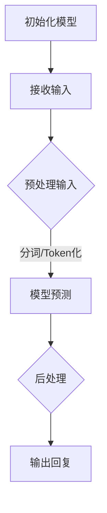

**解析：** 这个过程可以通过循环实现，每次用户输入一段文本，系统就进行一次预测和回复，形成一个对话循环。为了保证对话的质量和连贯性，模型通常需要根据上下文信息进行预测，这在实际应用中是一个复杂的任务。

### 2. 对话式交互中的上下文管理

**题目：** 在对话式交互中，如何管理上下文信息，以保持对话的连贯性？

**答案：** 为了保持对话的连贯性，需要有效地管理上下文信息。以下是一些常用的上下文管理方法：

1. **会话控制：** 使用唯一的会话标识符（如会话ID）来跟踪每个用户的对话状态，确保同一用户的上下文信息不会丢失。

2. **上下文窗口：** 在模型中设定一个上下文窗口，只考虑最近一段时间内的对话历史作为上下文信息。这样可以避免对话历史过长导致模型性能下降。

3. **状态跟踪：** 利用深度学习模型中的循环神经网络（RNN）或变换器（Transformer）的内部状态来存储和利用上下文信息。

4. **内存网络：** 引入外部内存网络结构，将对话历史存储在内存中，并在模型预测时查询相关历史信息。

**示例：** 使用会话控制来管理上下文信息：

```python
session_id = "user_123"
context_window = 10

# 假设我们有一个对话历史字典
dialog_history = {
    "user_123": [
        "你好，我想买一台笔记本电脑。",
        "好的，您需要什么配置的？",
        "我要一台性价比高的，价格在5000-8000之间。",
        # ...
    ]
}

# 接收新用户输入
user_input = "我想了解一下最新的游戏本推荐。"

# 更新对话历史
dialog_history[session_id].append(user_input)

# 使用最近10条对话历史作为上下文信息
context = " ".join(dialog_history[session_id][-context_window:])

# 传递上下文信息给大模型
response = large_model.predict(context)

# 输出回复
print(response)
```

**解析：** 通过会话控制，我们可以确保每个用户的对话历史不会与他人的对话历史混淆，同时使用上下文窗口来优化模型的性能和对话的连贯性。

### 3. 对话式交互中的自然语言理解（NLU）

**题目：** 在对话式交互中，自然语言理解（NLU）的作用是什么？请简要描述NLU的主要任务。

**答案：** 自然语言理解（NLU）是人工智能领域的一个重要分支，其核心任务是让计算机能够理解和解释人类语言。在对话式交互中，NLU的作用是：

1. **意图识别：** 识别用户输入的文本背后的意图，例如查询信息、请求帮助、购物咨询等。

2. **实体抽取：** 从文本中提取出关键信息，如人名、地点、时间、数量等实体。

3. **情感分析：** 理解用户的情感倾向，如正面、负面或中性。

4. **语境理解：** 分析文本中的隐含意义和语境，以便更准确地理解和响应用户。

NLU的主要任务包括：

- **分词（Tokenization）：** 将文本分割成单词或短语。
- **词性标注（Part-of-Speech Tagging）：** 为每个单词标注词性，如名词、动词、形容词等。
- **命名实体识别（Named Entity Recognition）：** 识别文本中的实体，如人名、组织名、地理位置等。
- **依赖分析（Dependency Parsing）：** 理解词语之间的依赖关系，如图宾关系、主谓关系等。
- **语义角色标注（Semantic Role Labeling）：** 标注句子中的语义角色，如施事、受事、工具等。

**示例：** 假设我们有一个用户输入的句子：“明天下午3点，我在中关村开会。”使用NLU技术，可以完成以下任务：

1. **分词：** “明天”、“下午3点”、“我”、“在”、“中关村”、“开会”。
2. **词性标注：** “明天”（名词）、“下午3点”（名词）、“我”（代词）、“在”（介词）、“中关村”（名词）、“开会”（动词）。
3. **命名实体识别：** “中关村”（地点）、“开会”（事件）。
4. **依赖分析：** “我”（主语），“开会”（谓语），“在”（介词），指向“中关村”（地点）。

**解析：** 通过NLU技术，系统可以更准确地理解用户的意图和需求，从而生成更恰当的回复。

### 4. 对话式交互中的自然语言生成（NLG）

**题目：** 在对话式交互中，自然语言生成（NLG）的作用是什么？请简要描述NLG的主要任务。

**答案：** 自然语言生成（NLG）是人工智能领域的一个分支，其核心任务是让计算机能够生成自然流畅的语言文本。在对话式交互中，NLG的作用是：

1. **回复生成：** 根据用户输入和对话上下文，生成合适的回复文本。

2. **文本摘要：** 从长文本中提取关键信息，生成简明扼要的摘要。

3. **情感生成：** 生成具有特定情感色彩的语言文本。

4. **文本润色：** 对原始文本进行优化，使其更流畅、更具吸引力。

NLG的主要任务包括：

- **语法生成：** 生成符合语法规则的语言文本。
- **语义生成：** 生成具有实际意义和逻辑连贯性的文本。
- **风格生成：** 生成具有特定风格的语言文本。
- **对话生成：** 生成符合对话逻辑和上下文的交互文本。

**示例：** 假设用户输入：“明天下午3点，我在中关村开会。”NLG系统可以生成以下回复：

- **简单回复：** “好的，我会提醒您明天下午3点在中关村开会。”
- **详细回复：** “好的，明天下午3点您将在中关村参加会议，我已经为您记录了这个安排。”
- **情感回复：** “好的，我会确保您在明天下午3点的会议中一切顺利。”

**解析：** 通过NLG技术，系统能够生成具有个性化、自然流畅的语言回复，提升用户体验。

### 5. 对话式交互中的多轮对话处理

**题目：** 在对话式交互中，如何处理多轮对话？请详细描述多轮对话的流程和关键技术。

**答案：** 多轮对话是指用户和系统之间进行的多个回合的交互。处理多轮对话的关键技术包括：

1. **对话状态跟踪：** 使用变量或数据结构来记录对话的状态，如用户的意图、已回答的问题、上下文信息等。

2. **上下文感知：** 在每个回合中，系统需要利用对话历史和上下文信息来生成合适的回复。

3. **意图识别：** 在每个回合中，系统需要识别用户的意图，以便提供更相关的回复。

4. **对话管理：** 系统需要根据对话状态和用户的意图，动态调整对话策略。

**流程：**

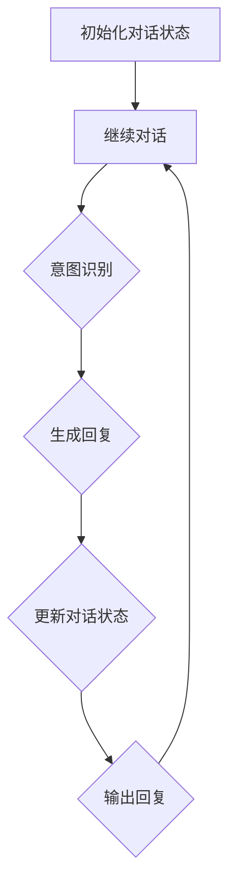

**关键技术：**

- **对话状态跟踪：** 可以使用字典、列表或图结构来存储对话状态。

- **上下文感知：** 使用深度学习模型，如Transformer，来处理上下文信息。

- **意图识别：** 使用机器学习算法，如决策树、随机森林或神经网络，来识别用户的意图。

- **对话管理：** 结合用户意图和对话历史，动态调整对话策略。

**示例：** 假设用户和系统之间的对话如下：

用户：你好，我想订一张从北京到上海的机票。

系统：您好，请问您需要什么时间的机票？

用户：我需要明天下午的机票。

系统：好的，我为您找到了从北京到上海明天下午3点的航班，请问您需要预订吗？

用户：是的，请帮我预订。

系统：好的，您的机票已经预订成功，请问还有其他需求吗？

用户：没有了，谢谢。

**解析：** 通过上述示例，可以看到系统在不同回合中根据用户的输入和意图，生成相应的回复，并更新对话状态。这样，系统能够与用户进行有效的多轮对话。

### 6. 对话式交互中的数据隐私保护

**题目：** 在对话式交互中，如何保护用户数据隐私？请列举几种常见的隐私保护措施。

**答案：** 对话式交互中，保护用户数据隐私至关重要。以下是一些常见的隐私保护措施：

1. **数据加密：** 对用户数据进行加密处理，确保数据在传输和存储过程中不会被未授权访问。

2. **匿名化处理：** 在数据分析和存储过程中，对用户身份信息进行匿名化处理，去除可直接识别用户身份的信息。

3. **访问控制：** 设定严格的访问控制策略，仅允许授权用户访问敏感数据。

4. **数据脱敏：** 对敏感数据（如银行卡号、身份证号等）进行脱敏处理，使其无法被直接解读。

5. **隐私政策：** 明确告知用户数据收集、使用和存储的方式，获取用户的知情同意。

6. **日志审计：** 记录数据访问和操作日志，以便在出现问题时进行审计和追溯。

**示例：**

- **数据加密：** 使用AES算法对用户数据进行加密存储。

- **匿名化处理：** 在用户数据存储前，将用户姓名、邮箱等直接识别信息替换为唯一标识符。

- **访问控制：** 对数据库进行权限控制，只有特定角色（如管理员）才能访问敏感数据。

- **数据脱敏：** 对用户输入的电话号码进行掩码处理，仅显示前三位。

- **隐私政策：** 在用户注册时，详细说明数据收集和使用目的，并提供同意按钮。

**解析：** 通过这些措施，可以有效地保护用户数据隐私，避免数据泄露和滥用。

### 7. 对话式交互中的多语言支持

**题目：** 在对话式交互中，如何实现多语言支持？请详细描述实现方法和流程。

**答案：** 实现对话式交互中的多语言支持需要考虑以下几个方面：

1. **多语言模型训练：** 使用多语言数据集对大模型进行训练，使其能够理解并生成多种语言。

2. **语言检测：** 在对话开始时，对用户输入的语言进行检测，以便选择合适的模型。

3. **翻译功能：** 在需要时，使用机器翻译模型将用户输入和系统回复翻译成目标语言。

4. **本地化处理：** 根据目标语言的语法和表达习惯，对生成的文本进行本地化处理。

**流程：**

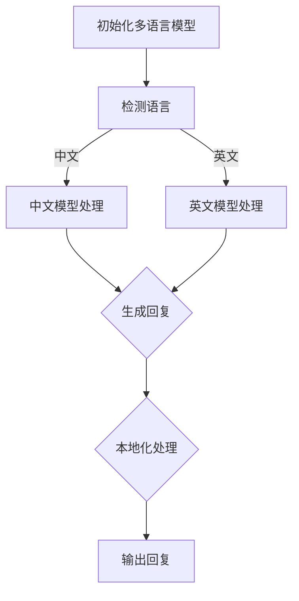

**实现方法：**

- **多语言模型训练：** 使用含有多种语言的训练数据集，对大模型进行训练。

- **语言检测：** 使用语言检测API（如Google语言检测API），对用户输入进行语言检测。

- **翻译功能：** 使用机器翻译模型（如Google翻译API），将用户输入和系统回复翻译成目标语言。

- **本地化处理：** 根据目标语言的语法和表达习惯，调整生成的文本。

**示例：**

- **多语言模型训练：** 使用含有中文、英文、西班牙文等多语言的文本数据进行模型训练。

- **语言检测：** 用户输入：“Bonjour, comment ça va？”系统检测到输入语言为法语。

- **翻译功能：** 系统将用户输入翻译为中文：“你好，最近怎么样？”

- **本地化处理：** 系统生成的中文回复：“你好，最近怎么样？”

**解析：** 通过上述方法，系统能够支持多种语言，为用户提供更加便捷和个性化的服务。

### 8. 对话式交互中的自适应学习能力

**题目：** 对话式交互中的自适应学习能力是什么？如何通过自适应学习提升用户体验？

**答案：** 对话式交互中的自适应学习能力是指系统能够根据用户的反馈和交互历史，自动调整和优化对话策略，以提高用户体验。以下是通过自适应学习提升用户体验的方法：

1. **意图识别优化：** 通过分析用户的历史交互，不断优化意图识别模型，提高识别准确性。

2. **对话策略调整：** 根据用户对不同回复的反馈，调整对话策略，提高对话的连贯性和相关性。

3. **情感分析：** 通过情感分析技术，识别用户的情感倾向，并生成符合情感色彩的回复。

4. **个性化推荐：** 根据用户的偏好和历史交互，提供个性化的对话内容和推荐。

**示例：**

- **意图识别优化：** 假设用户多次询问天气，系统可以优化意图识别模型，提高对“天气”相关的意图识别准确性。

- **对话策略调整：** 用户对某个回复表示满意，系统可以加强该回复的生成频率，提高用户的满意度。

- **情感分析：** 用户输入：“今天好冷啊。”系统识别到用户情绪较低落，生成回复：“天气确实挺冷的，多穿点衣服。”

- **个性化推荐：** 用户多次询问餐厅推荐，系统根据用户的历史评价，推荐符合用户口味的餐厅。

**解析：** 通过自适应学习，系统能够不断优化和调整，以提供更加个性化、相关性和连贯性的对话服务，从而提升用户体验。

### 9. 对话式交互中的多模态支持

**题目：** 在对话式交互中，如何实现多模态支持？请详细描述实现方法和流程。

**答案：** 对话式交互中的多模态支持是指系统能够处理和整合多种类型的信息，如文本、语音、图像等，以提供更丰富的交互体验。以下是实现多模态支持的方法：

1. **文本处理：** 使用自然语言处理（NLP）技术，对用户输入的文本进行处理和理解。

2. **语音识别：** 使用语音识别（ASR）技术，将用户的语音输入转换为文本。

3. **语音合成：** 使用语音合成（TTS）技术，将系统回复转换为自然流畅的语音。

4. **图像识别：** 使用计算机视觉（CV）技术，对用户上传的图像进行分析和理解。

5. **多模态融合：** 将不同模态的信息进行融合，以生成更全面的理解和更自然的回复。

**流程：**

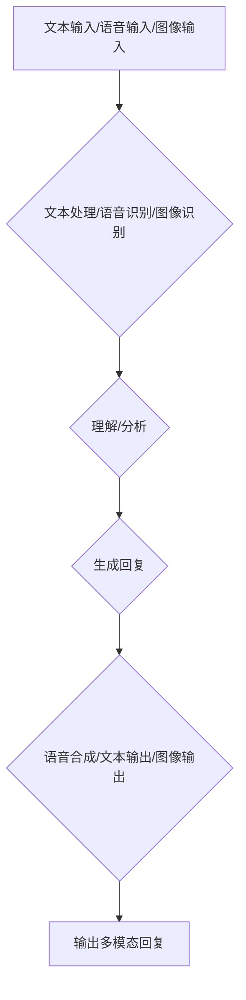

**实现方法：**

- **文本处理：** 使用NLP技术，如词性标注、命名实体识别等，对文本输入进行理解。

- **语音识别：** 使用ASR技术，如Google语音识别API，将语音输入转换为文本。

- **语音合成：** 使用TTS技术，如Google语音合成API，将文本回复转换为语音。

- **图像识别：** 使用CV技术，如OpenCV库，对图像输入进行分析和理解。

- **多模态融合：** 使用深度学习技术，如Transformer，将不同模态的信息进行融合。

**示例：**

- **文本输入：** 用户输入：“今天天气怎么样？”
- **语音识别：** 用户语音输入：“今天天气怎么样？”
- **图像输入：** 用户上传一张风景图片。
- **理解/分析：** 系统对文本、语音和图像进行综合理解。
- **生成回复：** 系统生成回复：“今天的天气非常好，非常适合外出。”
- **语音合成：** 将文本回复转换为语音输出。
- **图像输出：** 将天气相关的图像显示给用户。

**解析：** 通过多模态支持，系统能够提供更丰富的交互方式，满足不同用户的需求，提升用户体验。

### 10. 对话式交互中的错误处理和恢复机制

**题目：** 在对话式交互中，如何实现错误处理和恢复机制？请详细描述实现方法和流程。

**答案：** 对话式交互中的错误处理和恢复机制是指系统能够识别和应对对话过程中的错误，并提供有效的解决方案，以保持对话的流畅性和用户的满意度。以下是实现方法和流程：

1. **错误检测：** 在对话过程中，系统需要实时监测对话状态和用户输入，以识别可能的错误。

2. **错误分类：** 对识别出的错误进行分类，例如语法错误、语义错误、意图错误等。

3. **错误处理：** 根据错误类型，采取不同的处理策略，如提供修正建议、重新理解输入、询问用户更多信息等。

4. **错误恢复：** 在错误处理完成后，系统需要恢复对话流程，以继续提供正常的交互服务。

**流程：**

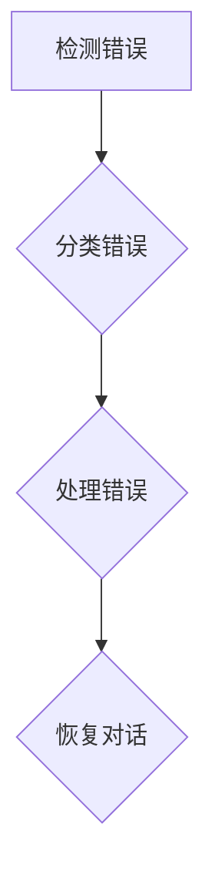

**实现方法：**

- **错误检测：** 使用自然语言处理（NLP）技术，如语法检查、语义分析等，实时监测用户输入。

- **错误分类：** 基于规则或机器学习模型，对错误进行分类，以便采取相应的处理策略。

- **错误处理：** 根据错误类型，采取修正建议、重新理解输入、询问用户更多信息等策略。

- **错误恢复：** 在错误处理后，系统需要引导用户回到正确的对话轨道，例如通过提示、引导性问题等方式。

**示例：**

- **错误检测：** 用户输入：“明天的天气好吗？”
- **错误分类：** 系统识别出语法错误，例如“明天”应改为“明天呢”。
- **错误处理：** 系统提供修正建议：“您是想问‘明天呢，天气好吗？’吗？”
- **错误恢复：** 用户确认修正，对话继续进行。

**解析：** 通过有效的错误处理和恢复机制，系统能够降低错误率，提高对话质量，提升用户体验。

### 11. 对话式交互中的可解释性和透明度

**题目：** 对话式交互中的可解释性和透明度是什么？为什么重要？请举例说明。

**答案：** 对话式交互中的可解释性和透明度是指用户能够理解系统是如何生成回复的，以及系统是如何做出决策的。这对于用户信任和满意度至关重要。

**重要性：**

1. **增强用户信任：** 用户了解系统的决策过程，会增加对系统的信任感。

2. **改善用户体验：** 用户能够理解系统的回复，有助于提供更好的交互体验。

3. **合规性和安全性：** 对话系统的可解释性有助于满足合规性和安全性的要求。

**举例：**

- **可解释性：** 系统生成回复：“今天的天气非常好，非常适合外出。”用户可以了解到系统是根据天气预报数据生成的这个回复。

- **透明度：** 系统在生成回复时，显示相关的数据来源和算法，如：“我们的天气预报基于XX气象局的数据，使用XX算法生成。”

**解析：** 通过提高可解释性和透明度，用户可以更信任和接受对话系统，从而提升用户体验和满意度。

### 12. 对话式交互中的个性化推荐

**题目：** 在对话式交互中，如何实现个性化推荐？请详细描述实现方法和流程。

**答案：** 在对话式交互中，个性化推荐能够根据用户的偏好和历史行为，提供更相关和个性化的推荐。以下是实现方法和流程：

1. **用户画像构建：** 收集用户的偏好、历史行为、兴趣等信息，构建用户画像。

2. **推荐算法：** 使用机器学习算法，如协同过滤、矩阵分解等，对用户画像进行分析，生成个性化推荐。

3. **实时反馈：** 在对话过程中，收集用户的实时反馈，如点击、点赞等行为，优化推荐算法。

4. **推荐生成：** 根据用户画像和实时反馈，生成个性化的推荐列表。

5. **对话融合：** 将推荐列表与对话内容融合，生成更自然的对话推荐。

**流程：**

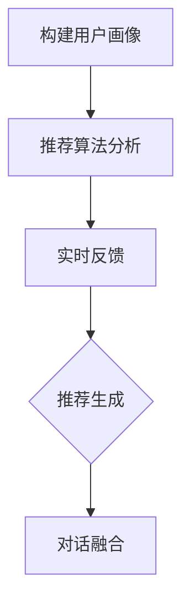

**实现方法：**

- **用户画像构建：** 通过用户注册信息、历史交互数据等，构建用户画像。

- **推荐算法：** 使用协同过滤、矩阵分解等算法，分析用户画像，生成个性化推荐。

- **实时反馈：** 收集用户在对话中的实时行为，如点击、评论等，优化推荐算法。

- **推荐生成：** 根据用户画像和实时反馈，生成个性化的推荐列表。

- **对话融合：** 将推荐列表与对话内容自然融合，提供个性化推荐。

**示例：**

- **用户画像构建：** 用户喜欢阅读科技类文章，搜索过旅游目的地。
- **推荐算法：** 基于用户画像，推荐与科技相关的旅游书籍。
- **实时反馈：** 用户在对话中提到对历史感兴趣的旅游城市。
- **推荐生成：** 更新推荐列表，添加与历史相关的科技旅游书籍。
- **对话融合：** 系统回复：“除了科技类的书籍，还有一本关于历史旅游的书籍《科技探索之旅》，您感兴趣吗？”

**解析：** 通过个性化推荐，系统能够根据用户偏好和历史行为，提供更相关和个性化的对话服务，提升用户体验。

### 13. 对话式交互中的情境感知

**题目：** 对话式交互中的情境感知是什么？为什么重要？请举例说明。

**答案：** 对话式交互中的情境感知是指系统能够根据对话的上下文环境，如时间、地点、事件等，生成更合适和自然的回复。

**重要性：**

1. **提高交互质量：** 情境感知能够使系统生成的回复更符合当前对话环境，提高交互质量。

2. **增强用户体验：** 情境感知能够提供更个性化的服务，满足用户在不同情境下的需求。

3. **优化资源分配：** 情境感知有助于系统更有效地分配计算资源和时间，提高整体性能。

**举例：**

- **时间感知：** 用户输入：“明天下午3点，我在中关村开会。”系统回复：“好的，我已经将您的会议安排在明天下午3点，请注意时间。”

- **地点感知：** 用户输入：“我下周去北京。”系统回复：“好的，北京是个美丽的城市，您计划去哪里玩呢？”

- **事件感知：** 用户输入：“我生日快到了。”系统回复：“生日快乐！您有什么特别的庆祝计划吗？”

**解析：** 通过情境感知，系统能够根据对话的上下文环境，提供更自然、相关和个性化的回复，提升用户体验。

### 14. 对话式交互中的情感分析

**题目：** 对话式交互中的情感分析是什么？请详细描述实现方法和流程。

**答案：** 对话式交互中的情感分析是指通过自然语言处理（NLP）技术，分析用户输入的情感倾向，如正面、负面或中性。

**实现方法和流程：**

1. **情感词典：** 构建包含情感词汇和对应的情感倾向的词典。

2. **情感分类模型：** 使用机器学习算法（如SVM、CNN、RNN等）训练情感分类模型。

3. **文本预处理：** 对用户输入进行分词、词性标注等预处理操作。

4. **情感分析：** 将预处理后的文本输入情感分类模型，得到情感倾向。

5. **情感回复：** 根据分析结果，生成相应的情感回复。

**流程：**

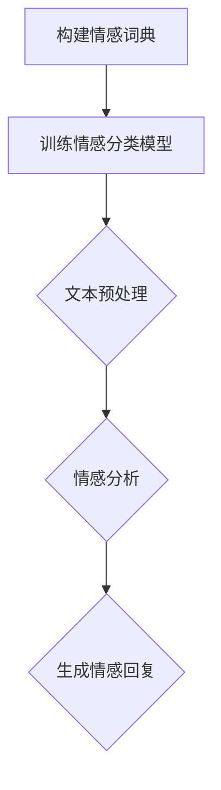

**实现方法：**

- **情感词典：** 收集情感词汇，如“开心”、“难过”、“愤怒”等，并标注情感倾向。

- **情感分类模型：** 使用大规模标注数据集，如IMDB电影评论数据集，训练情感分类模型。

- **文本预处理：** 使用NLP工具（如NLTK、spaCy等），对文本进行分词、词性标注等预处理。

- **情感分析：** 将预处理后的文本输入情感分类模型，得到情感倾向。

- **情感回复：** 根据情感倾向，生成相应的情感回复。

**示例：**

- **情感词典：** 包含“开心”、“难过”、“愤怒”等情感词汇。

- **情感分类模型：** 基于情感词典，训练得到一个情感分类模型。

- **文本预处理：** 用户输入：“我昨天考试没考好，很难过。”系统进行分词、词性标注等预处理。

- **情感分析：** 系统分析文本，识别出负面情感。

- **情感回复：** 系统回复：“考试没考好确实很难过，加油，下次一定会更好。”

**解析：** 通过情感分析，系统可以识别用户的情感倾向，生成更符合用户情感需求的回复，提升用户体验。

### 15. 对话式交互中的对话评估与优化

**题目：** 对话式交互中的对话评估与优化是什么？请详细描述实现方法和流程。

**答案：** 对话式交互中的对话评估与优化是指通过评估对话的质量和效果，不断优化对话系统，以提高用户体验。

**实现方法和流程：**

1. **评估指标：** 确定对话评估的指标，如回复准确性、对话连贯性、用户满意度等。

2. **评估方法：** 使用自动化评估工具和人工评估，对对话进行评估。

3. **反馈收集：** 收集用户和专家的反馈，分析对话中的问题和不足。

4. **优化策略：** 根据评估结果和反馈，制定优化策略，如调整模型参数、改进算法等。

5. **迭代优化：** 对对话系统进行迭代优化，提高对话质量。

**流程：**

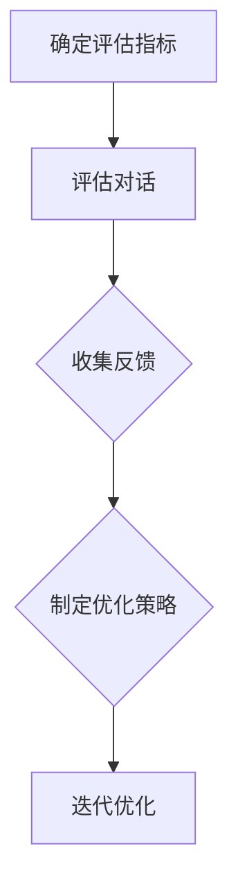

**实现方法：**

- **评估指标：** 回复准确性、对话连贯性、用户满意度等。

- **评估方法：** 使用自动化评估工具（如BLEU、ROUGE等）和人工评估。

- **反馈收集：** 通过用户调查、用户反馈等方式收集反馈。

- **优化策略：** 调整模型参数、改进算法、增加数据集等。

- **迭代优化：** 对对话系统进行迭代优化，提高对话质量。

**示例：**

- **评估指标：** 回复准确性90%，对话连贯性85%，用户满意度90%。

- **评估方法：** 使用BLEU评分和用户满意度调查。

- **反馈收集：** 用户反馈：“对话中的某些回答不太相关。”

- **优化策略：** 增加相关领域的训练数据，改进意图识别算法。

- **迭代优化：** 对对话系统进行迭代优化，提高对话连贯性。

**解析：** 通过对话评估与优化，系统可以不断改进对话质量，提升用户体验。

### 16. 对话式交互中的对话历史管理

**题目：** 对话式交互中的对话历史管理是什么？请详细描述实现方法和流程。

**答案：** 对话式交互中的对话历史管理是指对用户和系统之间的对话记录进行存储、查询和利用，以提供更好的交互体验。

**实现方法和流程：**

1. **对话历史存储：** 将对话记录存储在数据库中，以便查询和利用。

2. **对话历史查询：** 提供对话历史查询接口，允许用户查看和检索过去的对话记录。

3. **对话上下文利用：** 利用对话历史中的上下文信息，提高对话的连贯性和相关性。

4. **对话历史清理：** 定期清理过期或无用的对话历史记录，以优化存储空间。

**流程：**

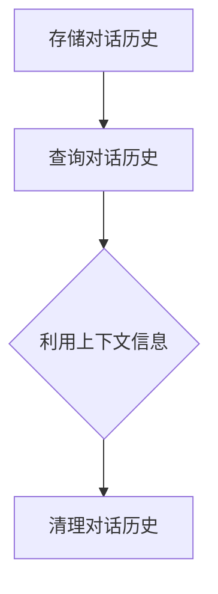

**实现方法：**

- **对话历史存储：** 使用数据库（如MySQL、MongoDB等）存储对话记录。

- **对话历史查询：** 提供RESTful API或GraphQL接口，允许用户查询对话历史。

- **对话上下文利用：** 在对话生成过程中，利用对话历史中的上下文信息，提高对话连贯性。

- **对话历史清理：** 设置定期任务，删除过期或无用的对话记录。

**示例：**

- **对话历史存储：** 将对话记录存储在MongoDB数据库中。

- **对话历史查询：** 用户通过API查询过去的一次对话记录。

- **对话上下文利用：** 系统利用对话历史中的信息，回答用户关于之前讨论的话题。

- **对话历史清理：** 每月清理一次过期对话记录。

**解析：** 通过对话历史管理，系统可以提供更好的交互体验，提高用户满意度。

### 17. 对话式交互中的对话打断和继续

**题目：** 对话式交互中的对话打断和继续是什么？请详细描述实现方法和流程。

**答案：** 对话式交互中的对话打断和继续是指用户可以在对话过程中中断当前的交互，并稍后继续未完成的对话。

**实现方法和流程：**

1. **对话打断：** 用户通过特定的指令或行为（如发送“中断”或“暂停”）告知系统要中断对话。

2. **对话存储：** 将对话状态和上下文信息存储在数据库或缓存中，以便后续继续。

3. **对话继续：** 用户通过特定的指令或行为（如发送“继续”或“重启”）告知系统要继续之前的对话。

4. **对话恢复：** 系统根据存储的对话状态和上下文信息，恢复对话。

**流程：**

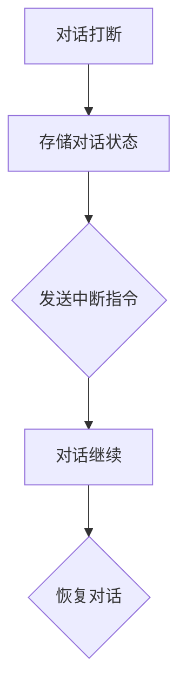

**实现方法：**

- **对话打断：** 用户发送“中断”指令，系统存储当前对话状态。

- **对话存储：** 使用数据库或缓存存储对话状态和上下文信息。

- **对话继续：** 用户发送“继续”指令，系统恢复对话。

- **对话恢复：** 系统根据存储的对话状态和上下文信息，生成回复并继续对话。

**示例：**

- **对话打断：** 用户发送：“我需要中断对话，稍后再继续。”

- **对话存储：** 系统将当前对话状态存储在数据库中。

- **对话继续：** 用户发送：“我想继续之前的对话。”

- **对话恢复：** 系统回复：“好的，让我们继续之前的对话。您的问题是关于什么？”

**解析：** 通过对话打断和继续功能，用户可以在不丢失对话上下文的情况下，灵活地管理对话流程。

### 18. 对话式交互中的用户意图识别

**题目：** 对话式交互中的用户意图识别是什么？请详细描述实现方法和流程。

**答案：** 对话式交互中的用户意图识别是指通过自然语言处理（NLP）技术，从用户输入的文本中识别出用户的意图。

**实现方法和流程：**

1. **分词和词性标注：** 对用户输入进行分词和词性标注，提取关键信息。

2. **命名实体识别：** 识别文本中的命名实体，如人名、地名等。

3. **句法分析：** 对文本进行句法分析，提取句法结构。

4. **意图分类：** 使用机器学习算法，如决策树、支持向量机等，对文本进行意图分类。

5. **意图生成：** 根据分类结果，生成对应的意图。

**流程：**

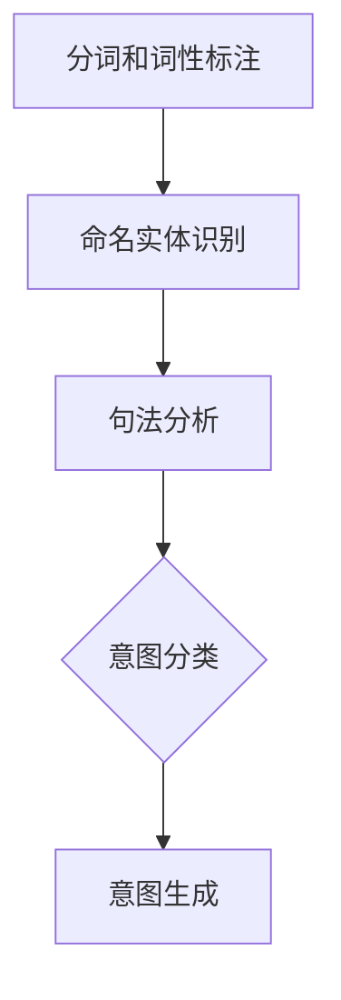

**实现方法：**

- **分词和词性标注：** 使用NLP库（如NLTK、spaCy等），对文本进行分词和词性标注。

- **命名实体识别：** 使用预训练的命名实体识别模型，如BERT。

- **句法分析：** 使用语法分析工具，如Stanford NLP。

- **意图分类：** 使用机器学习算法，训练得到意图分类模型。

- **意图生成：** 根据分类结果，生成对应的意图。

**示例：**

- **分词和词性标注：** 用户输入：“明天下午3点，我在中关村开会。”系统分词为：“明天”、“下午3点”、“我”、“在”、“中关村”、“开会”，词性标注为：“时间”、“时间”、“代词”、“介词”、“地点”、“动词”。

- **命名实体识别：** 系统识别出“中关村”为地点实体。

- **句法分析：** 系统分析句子结构，确定“我在中关村开会”为主句，时间为“明天下午3点”。

- **意图分类：** 系统分类结果为“会议安排”。

- **意图生成：** 系统生成意图为“会议安排”。

**解析：** 通过用户意图识别，系统能够更好地理解用户的意图，提供更准确的回复。

### 19. 对话式交互中的对话策略学习

**题目：** 对话式交互中的对话策略学习是什么？请详细描述实现方法和流程。

**答案：** 对话式交互中的对话策略学习是指通过机器学习技术，使系统能够根据用户的反馈和历史交互，自动调整对话策略，以提高用户体验。

**实现方法和流程：**

1. **数据收集：** 收集用户交互数据，包括用户输入、系统回复、用户反馈等。

2. **特征提取：** 从交互数据中提取关键特征，如用户意图、情感、对话历史等。

3. **策略模型训练：** 使用机器学习算法，如强化学习、生成对抗网络等，训练对话策略模型。

4. **策略评估：** 对训练好的策略模型进行评估，如通过模拟对话或实际用户测试。

5. **策略优化：** 根据评估结果，调整模型参数，优化策略模型。

6. **策略部署：** 将优化后的策略模型部署到生产环境中。

**流程：**

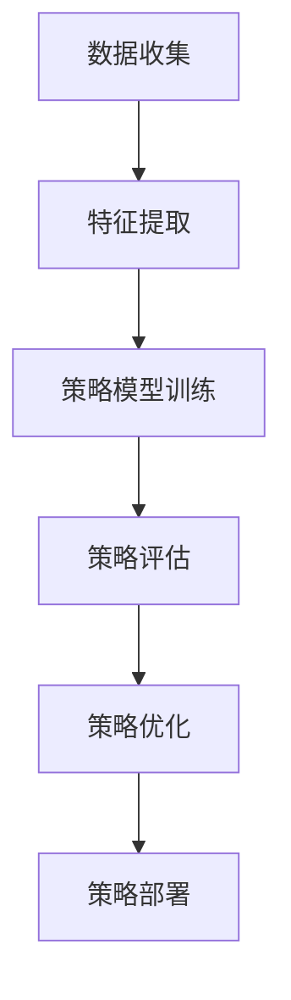

**实现方法：**

- **数据收集：** 使用日志记录工具，收集用户交互数据。

- **特征提取：** 使用NLP技术，提取用户意图、情感等特征。

- **策略模型训练：** 使用强化学习算法，如Q-learning、DQN等，训练对话策略模型。

- **策略评估：** 使用模拟对话或实际用户测试，评估策略模型的性能。

- **策略优化：** 调整模型参数，优化策略模型。

- **策略部署：** 部署到生产环境，实时更新策略。

**示例：**

- **数据收集：** 收集用户与系统的对话数据，包括输入、回复和用户反馈。

- **特征提取：** 提取用户意图（如查询、咨询、投诉等）和情感（如正面、负面、中性）。

- **策略模型训练：** 使用强化学习算法，训练对话策略模型。

- **策略评估：** 通过模拟对话评估策略模型的表现，调整模型参数。

- **策略优化：** 根据评估结果，优化模型参数。

- **策略部署：** 将优化后的策略模型部署到生产环境。

**解析：** 通过对话策略学习，系统能够根据用户反馈和交互历史，自动调整对话策略，提供更个性化、相关性和自然的交互体验。

### 20. 对话式交互中的用户个性化服务

**题目：** 对话式交互中的用户个性化服务是什么？请详细描述实现方法和流程。

**答案：** 对话式交互中的用户个性化服务是指根据用户的个性化需求和偏好，提供定制化的交互体验和服务。

**实现方法和流程：**

1. **用户画像构建：** 收集用户的偏好、行为、兴趣等信息，构建用户画像。

2. **个性化推荐：** 使用个性化推荐算法，根据用户画像推荐符合用户兴趣的内容和服务。

3. **对话个性化：** 在对话过程中，根据用户画像和实时交互信息，提供个性化的回复和互动。

4. **反馈调整：** 收集用户反馈，调整和优化个性化服务。

**流程：**

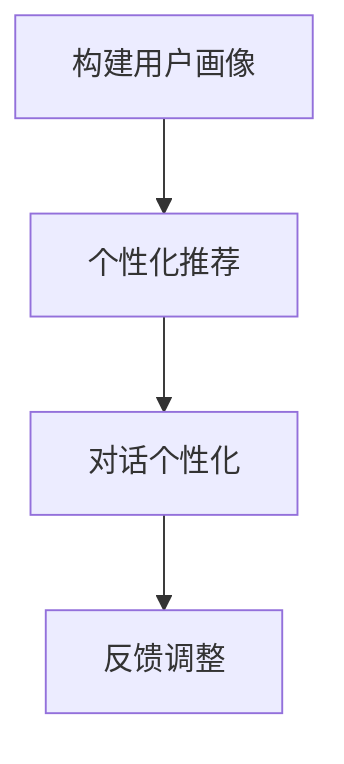

**实现方法：**

- **用户画像构建：** 通过用户注册信息、历史交互数据等，构建用户画像。

- **个性化推荐：** 使用协同过滤、基于内容的推荐等算法，生成个性化推荐。

- **对话个性化：** 在对话生成过程中，利用用户画像和实时交互信息，提供个性化回复。

- **反馈调整：** 根据用户反馈，优化推荐和交互策略。

**示例：**

- **用户画像构建：** 用户喜欢阅读科技、历史类文章，经常询问旅游信息。

- **个性化推荐：** 系统推荐与科技、历史相关的文章和旅游信息。

- **对话个性化：** 系统根据用户画像，提供与用户兴趣相符的回复。

- **反馈调整：** 用户反馈喜欢阅读旅游信息，系统增加旅游相关的回复。

**解析：** 通过用户个性化服务，系统能够更好地满足用户需求，提升用户体验。

### 21. 对话式交互中的多轮对话管理

**题目：** 对话式交互中的多轮对话管理是什么？请详细描述实现方法和流程。

**答案：** 对话式交互中的多轮对话管理是指系统在处理用户多轮输入时，能够维护对话上下文，确保对话连贯性和用户满意度。

**实现方法和流程：**

1. **上下文存储：** 在每次交互后，将对话上下文（如用户意图、历史对话等）存储在内存或数据库中。

2. **上下文利用：** 在后续交互中，利用存储的上下文信息，生成相关和连贯的回复。

3. **对话轮次管理：** 记录对话轮次，以便在需要时回溯对话历史。

4. **对话结束判断：** 根据对话轮次和用户输入，判断对话是否结束。

**流程：**

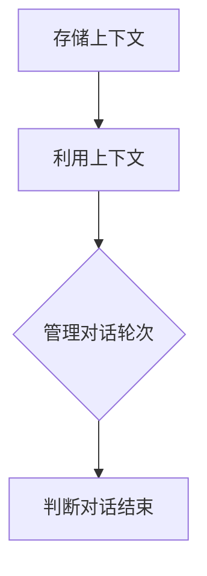

**实现方法：**

- **上下文存储：** 使用键值对存储结构，如Redis，存储对话上下文。

- **上下文利用：** 在对话生成过程中，查询和利用存储的上下文信息。

- **对话轮次管理：** 使用计数器或列表记录对话轮次。

- **对话结束判断：** 根据用户输入和对话轮次，判断是否结束对话。

**示例：**

- **上下文存储：** 系统存储用户输入：“我想订一张北京到上海的机票。”

- **上下文利用：** 系统利用上下文信息，生成回复：“请问您需要什么时间的机票？”

- **对话轮次管理：** 记录对话轮次为第1轮。

- **对话结束判断：** 用户输入：“明天下午的机票。”系统判断对话未结束，继续交互。

**解析：** 通过多轮对话管理，系统能够维护对话上下文，确保对话连贯性，提高用户满意度。

### 22. 对话式交互中的对话情感分析

**题目：** 对话式交互中的对话情感分析是什么？请详细描述实现方法和流程。

**答案：** 对话式交互中的对话情感分析是指通过自然语言处理（NLP）技术，分析用户输入的情感倾向，如正面、负面或中性。

**实现方法和流程：**

1. **情感词典构建：** 收集情感词汇和对应的情感倾向，构建情感词典。

2. **情感分类模型训练：** 使用机器学习算法（如SVM、CNN、RNN等）训练情感分类模型。

3. **文本预处理：** 对用户输入进行分词、词性标注等预处理操作。

4. **情感分析：** 将预处理后的文本输入情感分类模型，得到情感倾向。

5. **情感回复生成：** 根据情感倾向，生成相应的情感回复。

**流程：**


**实现方法：**

- **情感词典构建：** 收集情感词汇，如“开心”、“难过”、“愤怒”等，并标注情感倾向。

- **情感分类模型训练：** 使用大规模标注数据集，如IMDB电影评论数据集，训练情感分类模型。

- **文本预处理：** 使用NLP工具（如NLTK、spaCy等），对文本进行分词、词性标注等预处理。

- **情感分析：** 将预处理后的文本输入情感分类模型，得到情感倾向。

- **情感回复生成：** 根据情感倾向，生成相应的情感回复。

**示例：**

- **情感词典构建：** 包含“开心”、“难过”、“愤怒”等情感词汇。

- **情感分类模型训练：** 基于情感词典，训练得到一个情感分类模型。

- **文本预处理：** 用户输入：“我昨天考试没考好，很难过。”系统进行分词、词性标注等预处理。

- **情感分析：** 系统分析文本，识别出负面情感。

- **情感回复生成：** 系统生成回复：“考试没考好确实很难过，加油，下次一定会更好。”

**解析：** 通过对话情感分析，系统可以识别用户的情感倾向，生成更符合用户情感需求的回复，提升用户体验。

### 23. 对话式交互中的对话纠错

**题目：** 对话式交互中的对话纠错是什么？请详细描述实现方法和流程。

**答案：** 对话式交互中的对话纠错是指系统在识别到用户输入错误时，能够自动识别和纠正错误，以保持对话的流畅性和正确性。

**实现方法和流程：**

1. **错误检测：** 在对话过程中，系统实时检测用户输入的语法、拼写等错误。

2. **错误纠正：** 使用自然语言处理（NLP）技术，如语法检查、拼写纠正等，对错误进行自动纠正。

3. **错误反馈：** 将纠正后的文本展示给用户，并提示用户错误已被纠正。

4. **用户确认：** 用户确认错误是否已被正确纠正。

**流程：**

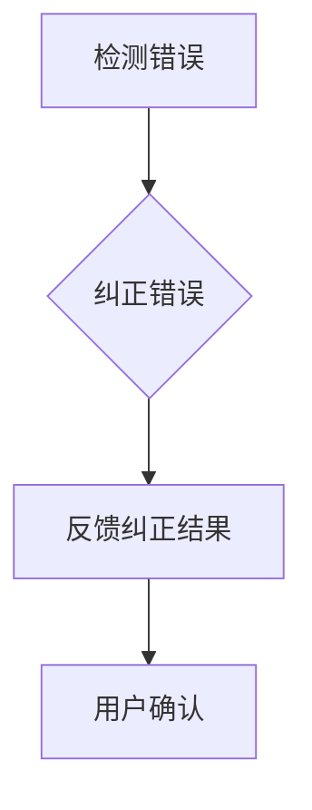

**实现方法：**

- **错误检测：** 使用语法检查工具（如LINT）和拼写纠正工具（如Spell Checker），检测用户输入错误。

- **错误纠正：** 使用NLP技术，如规则匹配、概率模型等，自动纠正错误。

- **错误反馈：** 将纠正后的文本展示给用户，并提示用户错误已被纠正。

- **用户确认：** 用户确认错误是否已被正确纠正。

**示例：**

- **错误检测：** 用户输入：“我昨天考试没考好，真的很难过。”系统检测到“真的”应为“确实”。

- **错误纠正：** 系统将“真的”更正为“确实”，生成回复：“我昨天考试没考好，确实很难过。”

- **错误反馈：** 系统展示纠正后的文本，并提示用户“错误已被纠正”。

- **用户确认：** 用户确认错误已被正确纠正。

**解析：** 通过对话纠错，系统可以自动识别和纠正用户输入错误，提高对话质量，提升用户体验。

### 24. 对话式交互中的多轮对话纠错

**题目：** 对话式交互中的多轮对话纠错是什么？请详细描述实现方法和流程。

**答案：** 对话式交互中的多轮对话纠错是指在多轮对话中，系统能够识别和纠正用户输入的错误，并保持对话的连贯性和正确性。

**实现方法和流程：**

1. **对话历史存储：** 在每次交互后，将对话历史（如用户输入、系统回复等）存储在数据库或缓存中。

2. **错误检测：** 在对话过程中，系统实时检测用户输入的语法、拼写等错误。

3. **错误纠正：** 使用自然语言处理（NLP）技术，如语法检查、拼写纠正等，对错误进行自动纠正。

4. **对话恢复：** 在纠正错误后，系统根据对话历史，生成连贯和正确的回复。

5. **用户确认：** 用户确认错误是否已被正确纠正。

**流程：**

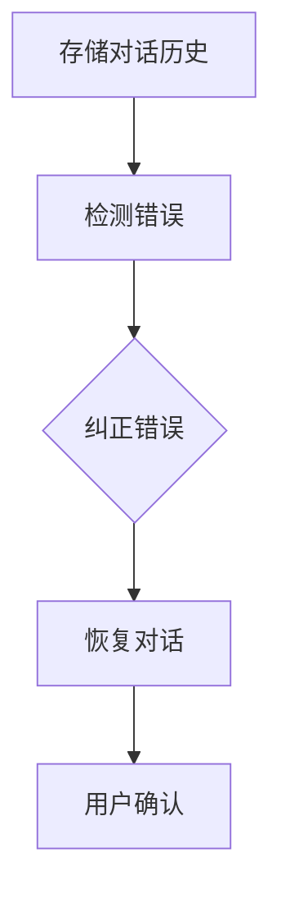

**实现方法：**

- **对话历史存储：** 使用键值对存储结构，如Redis，存储对话历史。

- **错误检测：** 使用语法检查工具（如LINT）和拼写纠正工具（如Spell Checker），检测用户输入错误。

- **错误纠正：** 使用NLP技术，如规则匹配、概率模型等，自动纠正错误。

- **对话恢复：** 根据对话历史，生成连贯和正确的回复。

- **用户确认：** 用户确认错误是否已被正确纠正。

**示例：**

- **对话历史存储：** 系统存储用户输入：“我昨天考试没考好，真的很气。”系统回复：“不用担心，下次一定会更好。”

- **错误检测：** 系统检测到“真的很气”中的“气”应为“恼火”。

- **错误纠正：** 系统将“气”更正为“恼火”，生成回复：“我昨天考试没考好，真的很恼火。”

- **对话恢复：** 系统根据对话历史，生成连贯的回复：“不用担心，下次一定会更好。”

- **用户确认：** 用户确认错误已被正确纠正。

**解析：** 通过多轮对话纠错，系统能够在多轮对话中识别和纠正用户输入错误，保持对话的连贯性和正确性，提升用户体验。

### 25. 对话式交互中的对话评估与优化

**题目：** 对话式交互中的对话评估与优化是什么？请详细描述实现方法和流程。

**答案：** 对话式交互中的对话评估与优化是指通过评估对话的效果和质量，不断优化对话系统，以提高用户体验。

**实现方法和流程：**

1. **评估指标设定：** 确定对话评估的指标，如回复准确性、对话连贯性、用户满意度等。

2. **评估方法选择：** 选择合适的评估方法，如自动化评估工具、人工评估等。

3. **评估实施：** 对对话系统进行评估，收集评估数据。

4. **优化策略制定：** 根据评估结果，制定优化策略，如改进算法、增加数据集等。

5. **迭代优化：** 对对话系统进行迭代优化，提高对话质量。

**流程：**

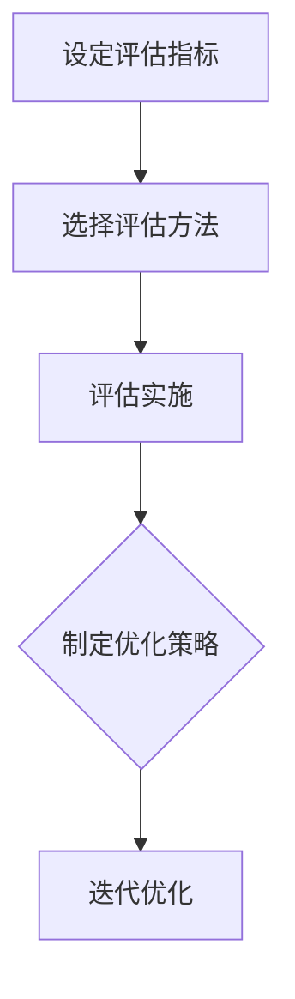

**实现方法：**

- **评估指标设定：** 回复准确性90%，对话连贯性85%，用户满意度90%。

- **评估方法选择：** 使用BLEU评分和用户满意度调查。

- **评估实施：** 对对话系统进行实际用户测试，收集评估数据。

- **优化策略制定：** 根据评估结果，调整模型参数、改进算法等。

- **迭代优化：** 对对话系统进行迭代优化，提高对话质量。

**示例：**

- **评估指标设定：** 回复准确性90%，对话连贯性85%，用户满意度90%。

- **评估方法选择：** 使用BLEU评分和用户满意度调查。

- **评估实施：** 进行实际用户测试，收集评估数据。

- **优化策略制定：** 根据评估结果，调整模型参数，增加训练数据等。

- **迭代优化：** 对对话系统进行迭代优化，提高对话质量。

**解析：** 通过对话评估与优化，系统可以不断改进对话质量，提升用户体验。

### 26. 对话式交互中的对话情绪检测

**题目：** 对话式交互中的对话情绪检测是什么？请详细描述实现方法和流程。

**答案：** 对话式交互中的对话情绪检测是指通过自然语言处理（NLP）技术，分析用户输入的情感倾向，如正面、负面或中性。

**实现方法和流程：**

1. **情感词典构建：** 收集情感词汇和对应的情感倾向，构建情感词典。

2. **情感分类模型训练：** 使用机器学习算法（如SVM、CNN、RNN等）训练情感分类模型。

3. **文本预处理：** 对用户输入进行分词、词性标注等预处理操作。

4. **情感分析：** 将预处理后的文本输入情感分类模型，得到情感倾向。

5. **情绪回复生成：** 根据情感倾向，生成相应的情绪回复。

**流程：**


**实现方法：**

- **情感词典构建：** 收集情感词汇，如“开心”、“难过”、“愤怒”等，并标注情感倾向。

- **情感分类模型训练：** 使用大规模标注数据集，如IMDB电影评论数据集，训练情感分类模型。

- **文本预处理：** 使用NLP工具（如NLTK、spaCy等），对文本进行分词、词性标注等预处理。

- **情感分析：** 将预处理后的文本输入情感分类模型，得到情感倾向。

- **情绪回复生成：** 根据情感倾向，生成相应的情绪回复。

**示例：**

- **情感词典构建：** 包含“开心”、“难过”、“愤怒”等情感词汇。

- **情感分类模型训练：** 基于情感词典，训练得到一个情感分类模型。

- **文本预处理：** 用户输入：“我昨天考试没考好，很难过。”系统进行分词、词性标注等预处理。

- **情感分析：** 系统分析文本，识别出负面情感。

- **情绪回复生成：** 系统生成回复：“考试没考好确实很难过，加油，下次一定会更好。”

**解析：** 通过对话情绪检测，系统可以识别用户的情感倾向，生成更符合用户情感需求的回复，提升用户体验。

### 27. 对话式交互中的对话轮数控制

**题目：** 对话式交互中的对话轮数控制是什么？请详细描述实现方法和流程。

**答案：** 对话式交互中的对话轮数控制是指系统根据对话的复杂性和用户需求，合理控制对话轮数，以保持对话的有效性和效率。

**实现方法和流程：**

1. **轮数限制设定：** 根据业务需求和用户体验，设定对话轮数的上限。

2. **对话状态跟踪：** 在对话过程中，系统实时跟踪对话轮数。

3. **对话轮数监控：** 系统监控对话轮数，确保不超过设定的上限。

4. **对话结束判断：** 在达到对话轮数上限时，系统判断对话是否结束。

5. **对话结束策略：** 根据对话结束判断，系统采取合适的结束策略，如引导用户结束对话或提供额外帮助。

**流程：**

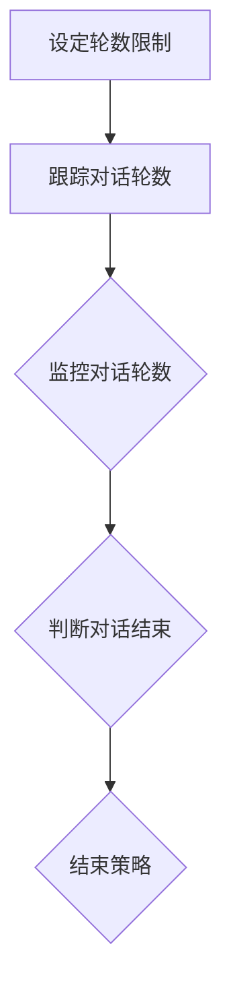

**实现方法：**

- **轮数限制设定：** 根据业务需求，设定对话轮数的上限，如5轮。

- **对话状态跟踪：** 使用计数器或列表记录对话轮数。

- **对话轮数监控：** 在每次交互后，更新对话轮数。

- **对话结束判断：** 当对话轮数达到上限时，系统判断对话是否结束。

- **结束策略：** 提供引导用户结束对话或提供额外帮助的回复。

**示例：**

- **轮数限制设定：** 设定对话轮数的上限为5轮。

- **对话状态跟踪：** 记录对话轮数为1。

- **对话轮数监控：** 用户输入问题，系统更新对话轮数为2。

- **对话结束判断：** 当对话轮数达到5轮时，系统判断对话是否结束。

- **结束策略：** 系统生成回复：“感谢您的提问，我们已经进行了5轮对话。如果您还有其他问题，请随时联系。”

**解析：** 通过对话轮数控制，系统可以避免对话过长，提高对话效率和用户体验。

### 28. 对话式交互中的对话目标检测

**题目：** 对话式交互中的对话目标检测是什么？请详细描述实现方法和流程。

**答案：** 对话式交互中的对话目标检测是指通过自然语言处理（NLP）技术，从用户输入的文本中识别出对话的目标，如查询信息、请求帮助等。

**实现方法和流程：**

1. **目标词典构建：** 收集对话目标相关的词汇和短语，构建目标词典。

2. **目标分类模型训练：** 使用机器学习算法（如SVM、CNN、RNN等）训练目标分类模型。

3. **文本预处理：** 对用户输入进行分词、词性标注等预处理操作。

4. **目标检测：** 将预处理后的文本输入目标分类模型，得到对话目标。

5. **目标处理：** 根据检测到的对话目标，生成相应的回复或执行相应的操作。

**流程：**

```mermaid
graph TB
A[构建目标词典] --> B[训练目标分类模型]
B --> C{文本预处理}
C --> D{目标检测}
D --> E{目标处理}
```

**实现方法：**

- **目标词典构建：** 收集对话目标相关的词汇和短语，如“查询天气”、“预订机票”等。

- **目标分类模型训练：** 使用大规模标注数据集，如公开的对话数据集，训练目标分类模型。

- **文本预处理：** 使用NLP工具（如NLTK、spaCy等），对文本进行分词、词性标注等预处理。

- **目标检测：** 将预处理后的文本输入目标分类模型，得到对话目标。

- **目标处理：** 根据检测到的对话目标，生成相应的回复或执行相应的操作。

**示例：**

- **目标词典构建：** 包含“查询天气”、“预订机票”、“请求帮助”等对话目标。

- **目标分类模型训练：** 基于目标词典，训练得到一个目标分类模型。

- **文本预处理：** 用户输入：“请问今天的天气怎么样？”系统进行分词、词性标注等预处理。

- **目标检测：** 系统检测到对话目标为“查询天气”。

- **目标处理：** 系统生成回复：“今天的天气是晴朗的，气温约为25摄氏度。”

**解析：** 通过对话目标检测，系统可以快速识别用户的对话目标，提供更精准和高效的回复。

### 29. 对话式交互中的对话引导策略

**题目：** 对话式交互中的对话引导策略是什么？请详细描述实现方法和流程。

**答案：** 对话式交互中的对话引导策略是指系统根据用户的意图和对话状态，采取合适的策略来引导对话方向，以达到更好的交互效果。

**实现方法和流程：**

1. **意图识别：** 在对话开始时，系统识别用户的意图。

2. **对话状态跟踪：** 在对话过程中，系统实时跟踪对话状态。

3. **策略选择：** 根据用户的意图和对话状态，选择合适的对话引导策略。

4. **策略执行：** 系统执行所选策略，引导对话方向。

5. **策略评估：** 对策略执行效果进行评估，并根据评估结果调整策略。

**流程：**

```mermaid
graph TB
A[意图识别] --> B[跟踪对话状态]
B --> C{选择策略}
C --> D{执行策略}
D --> E{评估策略}
```

**实现方法：**

- **意图识别：** 使用NLP技术，如BERT模型，识别用户的意图。

- **对话状态跟踪：** 使用状态机或图结构记录对话状态。

- **策略选择：** 根据用户意图和对话状态，选择如确认、澄清、引导等策略。

- **策略执行：** 根据所选策略，生成相应的回复或执行相应的操作。

- **策略评估：** 根据对话效果和用户反馈，评估策略的有效性。

**示例：**

- **意图识别：** 用户输入：“我想订一张去北京的机票。”系统识别到用户意图为“订票”。

- **对话状态跟踪：** 系统记录对话状态为“询问目的地”。

- **策略选择：** 选择“引导”策略，询问用户“请问您需要什么时间的机票？”

- **策略执行：** 系统生成回复：“请问您需要什么时间的机票？”

- **策略评估：** 用户回复后，系统根据用户反馈评估策略的有效性。

**解析：** 通过对话引导策略，系统可以更好地引导对话方向，提升用户体验。

### 30. 对话式交互中的对话生成模型

**题目：** 对话式交互中的对话生成模型是什么？请详细描述实现方法和流程。

**答案：** 对话式交互中的对话生成模型是指使用机器学习技术，如深度学习，生成自然、连贯和相关的对话回复。

**实现方法和流程：**

1. **数据收集与预处理：** 收集对话数据，并进行数据预处理，如分词、去噪、标准化等。

2. **模型选择：** 选择合适的对话生成模型，如GPT-3、BERT、Transformer等。

3. **模型训练：** 使用训练数据集，训练对话生成模型。

4. **模型评估：** 对训练好的模型进行评估，如使用BLEU、ROUGE等指标。

5. **模型优化：** 根据评估结果，调整模型参数，优化模型性能。

6. **模型部署：** 将优化后的模型部署到生产环境中。

**流程：**

```mermaid
graph TB
A[数据收集与预处理] --> B[模型选择]
B --> C[模型训练]
C --> D[模型评估]
D --> E[模型优化]
E --> F[模型部署]
```

**实现方法：**

- **数据收集与预处理：** 收集公开的对话数据集，如DailyDialog、DailyDialogSmall等，进行数据预处理。

- **模型选择：** 选择预训练的对话生成模型，如GPT-3。

- **模型训练：** 使用训练数据集，训练对话生成模型。

- **模型评估：** 使用BLEU、ROUGE等指标评估模型性能。

- **模型优化：** 调整模型参数，如学习率、批量大小等，优化模型性能。

- **模型部署：** 将优化后的模型部署到生产环境中。

**示例：**

- **数据收集与预处理：** 收集DailyDialog数据集，进行分词、去噪、标准化等预处理。

- **模型选择：** 选择预训练的GPT-3模型。

- **模型训练：** 使用预处理后的数据集，训练GPT-3模型。

- **模型评估：** 使用BLEU指标评估模型性能。

- **模型优化：** 调整学习率，优化模型性能。

- **模型部署：** 将优化后的模型部署到生产环境中。

**解析：** 通过对话生成模型，系统能够生成自然、连贯和相关的对话回复，提升用户体验。

