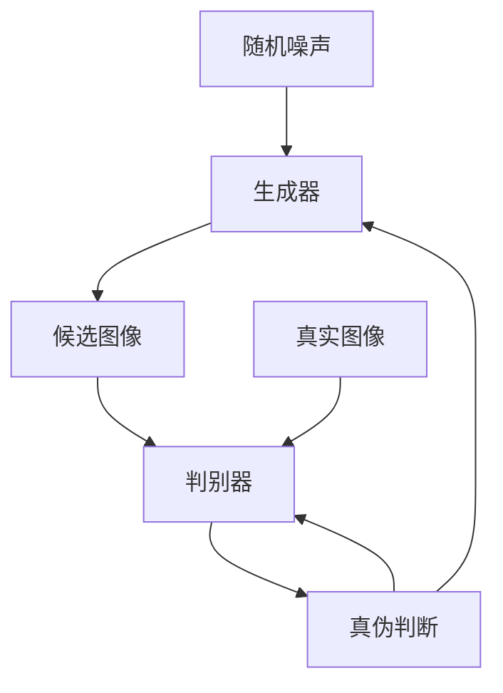
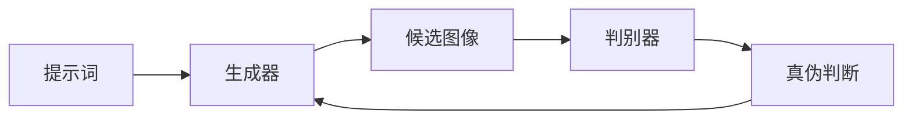

# AIGC从入门到实战：揭秘 Midjourney 的提示词写作技巧

## 1.背景介绍

### 1.1 AIGC的兴起

人工智能生成内容(AIGC)近年来风靡全球,成为科技领域的一股重要力量。AIGC技术可以基于人工智能模型,通过文本或图像等输入,生成高质量的内容输出,如文字、图像、视频、音频等。AIGC的崛起,不仅为创作者提供了新的工具和方式,也为各行业带来了新的机遇和挑战。

### 1.2 Midjourney的崛起

在AIGC图像生成领域,Midjourney是一款备受瞩目的AI工具。它基于先进的生成式对抗网络(GAN)模型,能够根据用户的文本描述生成逼真的图像。自2022年7月正式发布以来,Midjourney因其卓越的图像质量和创意表现力,迅速在艺术家和设计师中流行开来。

### 1.3 提示词的重要性

要发挥Midjourney的强大功能,编写高质量的提示词是关键。提示词是用户输入给AI模型的文本描述,决定了生成图像的内容、风格和细节。掌握提示词的写作技巧,可以极大提高图像生成的质量和创意性,助力创作者释放无限想象力。

## 2.核心概念与联系

### 2.1 生成式对抗网络(GAN)

Midjourney的核心技术是生成式对抗网络(GAN)。GAN由两个神经网络组成:生成器(Generator)和判别器(Discriminator)。生成器从随机噪声中生成候选图像,判别器则判断该图像是真实图像还是生成图像。两个网络相互对抗,生成器不断努力生成能够欺骗判别器的图像,判别器也在不断提高区分真伪的能力。这种对抗训练可以促进生成器生成越来越逼真的图像。



### 2.2 提示词与图像生成

在Midjourney中,用户输入的提示词被用于"启发"生成器,指导其生成符合描述的图像。提示词中的关键词、修饰词和上下文信息,都会影响生成图像的内容、风格和细节。通过精心设计提示词,创作者可以控制图像的构图、物体、环境、光影等多个方面,实现自己的创意想象。



### 2.3 迭代优化

由于GAN模型的不确定性,单次生成的图像可能无法完全满足要求。因此,Midjourney提供了迭代优化的功能,允许用户根据初始生成的图像,通过修改提示词来指导模型进行多次迭代,逐步优化图像质量和细节。这种交互式的优化过程,可以充分发挥人机协作的优势,实现创作者的艺术想象。

## 3.核心算法原理具体操作步骤

Midjourney的图像生成过程可以概括为以下几个核心步骤:

1. **文本编码**:将用户输入的提示词通过Transformer编码器转换为文本嵌入向量。
2. **噪声采样**:从高斯分布中采样一个随机噪声向量,作为生成器的初始输入。
3. **上采样**:将噪声向量通过一系列上采样卷积层逐步放大,生成初始低分辨率图像。
4. **注意力融合**:将文本嵌入向量与图像特征进行注意力融合,指导图像生成符合文本描述。
5. **渲染上采样**:通过多次上采样和注意力融合,逐步提高图像分辨率和细节质量。
6. **判别器评估**:将生成的图像输入判别器,评估其真实性和质量。
7. **反向传播**:根据判别器的评估结果,计算生成器的损失函数,并通过反向传播优化生成器的参数。
8. **迭代优化**:重复上述步骤,直到生成满意的图像或达到最大迭代次数。

这个过程中,注意力融合机制是关键,它使生成器能够有效地融合文本和图像信息,生成符合描述的高质量图像。

## 4.数学模型和公式详细讲解举例说明

### 4.1 生成器损失函数

生成器的目标是生成能够欺骗判别器的逼真图像。因此,生成器的损失函数可以定义为:

$$\mathcal{L}_G = \mathbb{E}_{z\sim p(z)}[\log(1-D(G(z)))]$$

其中,$z$是从噪声分布$p(z)$采样的随机向量,$G(z)$是生成器输出的候选图像,$D(G(z))$是判别器对该图像的真实性评分。生成器的目标是最小化这个损失函数,使得生成的图像能够最大程度地欺骗判别器。

### 4.2 判别器损失函数

判别器的目标是正确区分真实图像和生成图像。因此,判别器的损失函数可以定义为:

$$\mathcal{L}_D = \mathbb{E}_{x\sim p(x)}[\log D(x)] + \mathbb{E}_{z\sim p(z)}[\log(1-D(G(z)))]$$

其中,$x$是真实图像样本,$p(x)$是真实图像的分布。判别器的目标是最大化这个损失函数,提高对真实图像和生成图像的区分能力。

### 4.3 对抗训练

生成器和判别器通过对抗训练相互优化,形成一个极小极大游戏:

$$\min_G\max_D\mathcal{L}(D,G) = \mathbb{E}_{x\sim p(x)}[\log D(x)] + \mathbb{E}_{z\sim p(z)}[\log(1-D(G(z)))]$$

生成器$G$试图最小化这个损失函数,以生成能够欺骗判别器的逼真图像;而判别器$D$则试图最大化这个损失函数,以提高区分真伪的能力。这种对抗训练可以促进双方不断提高,最终使生成器生成出高质量的图像。

### 4.4 注意力融合

为了使生成器能够有效地融合文本和图像信息,Midjourney采用了注意力融合机制。具体来说,将文本嵌入向量$t$与图像特征$f$进行注意力加权求和:

$$\tilde{f} = \textrm{Attention}(f,t) = \sum_{i=1}^N \alpha_i f_i$$

其中,$\alpha_i$是注意力权重,反映了文本嵌入对图像特征$f_i$的重要性。通过这种注意力融合,生成器可以selectively地关注文本描述中的关键信息,并将其融入到图像生成过程中。

以上是Midjourney核心算法的数学模型和公式,体现了GAN、对抗训练和注意力机制等关键技术。这些技术的创新应用,使Midjourney能够根据文本描述生成出逼真且富有创意的图像。

## 5.项目实践:代码实例和详细解释说明

虽然Midjourney的底层实现代码未公开,但我们可以通过一些简化的代码示例,来理解其核心算法的工作原理。以下是一个使用PyTorch实现的简化GAN模型:

```python
import torch
import torch.nn as nn

# 生成器
class Generator(nn.Module):
    def __init__(self, z_dim, img_channels):
        super().__init__()
        self.net = nn.Sequential(
            nn.ConvTranspose2d(z_dim, 512, 4, 1, 0, bias=False),
            nn.BatchNorm2d(512),
            nn.ReLU(True),
            # 更多上采样和卷积层
            nn.ConvTranspose2d(512, img_channels, 4, 2, 1, bias=False),
            nn.Tanh()
        )

    def forward(self, z):
        return self.net(z)

# 判别器
class Discriminator(nn.Module):
    def __init__(self, img_channels):
        super().__init__()
        self.net = nn.Sequential(
            nn.Conv2d(img_channels, 64, 4, 2, 1, bias=False),
            nn.LeakyReLU(0.2, inplace=True),
            # 更多卷积和下采样层
            nn.Conv2d(512, 1, 4, 1, 0, bias=False),
            nn.Sigmoid()
        )

    def forward(self, img):
        return self.net(img).view(-1, 1).squeeze(1)

# 训练
z_dim = 100
img_channels = 3
G = Generator(z_dim, img_channels)
D = Discriminator(img_channels)
criterion = nn.BCELoss()

for epoch in range(num_epochs):
    # 训练判别器
    real_imgs = ...  # 加载真实图像
    z = torch.randn(batch_size, z_dim, 1, 1)  # 随机噪声
    fake_imgs = G(z)  # 生成假图像
    
    D_real = D(real_imgs)
    D_fake = D(fake_imgs.detach())
    D_loss = criterion(D_real, torch.ones_like(D_real)) + \
             criterion(D_fake, torch.zeros_like(D_fake))
    D_loss.backward()
    
    # 训练生成器
    z = torch.randn(batch_size, z_dim, 1, 1)
    fake_imgs = G(z)
    D_fake = D(fake_imgs)
    G_loss = criterion(D_fake, torch.ones_like(D_fake))
    G_loss.backward()
    
    # 更新模型参数
    ...
```

这个示例代码实现了一个基本的GAN模型,包括生成器、判别器、损失函数计算和模型训练过程。其中:

- 生成器`Generator`是一个上采样卷积网络,从随机噪声生成假图像。
- 判别器`Discriminator`是一个下采样卷积网络,判断输入图像是真是假。
- 训练过程中,先固定生成器,训练判别器提高区分能力;再固定判别器,训练生成器生成更逼真的图像。
- 通过对抗训练,生成器和判别器相互优化,最终达到生成高质量图像的目标。

虽然这个示例代码相对简单,但它揭示了GAN模型的核心思想和训练过程。在实际的Midjourney系统中,还涉及了注意力融合、迭代优化等更复杂的技术,以提高图像质量和创意性。

## 6.实际应用场景

Midjourney的AIGC图像生成技术在多个领域都有广泛的应用前景:

### 6.1 艺术创作

艺术家可以利用Midjourney激发创意灵感,快速生成草图和概念图像。通过不断优化提示词,艺术家可以与AI进行互动创作,探索新颖的视觉风格和表现形式。

### 6.2 设计领域

平面设计师、UI/UX设计师、产品设计师等,都可以使用Midjourney生成各种视觉元素,如图标、插图、界面原型等,大大提高工作效率。此外,Midjourney还可用于创意设计的探索性工作。

### 6.3 营销与广告

营销人员可以借助Midjourney快速生成产品图像、海报、Banner等营销素材,降低成本。此外,Midjourney在视觉内容个性化方面也有巨大潜力。

### 6.4 教育与培训

Midjourney可以生成各种教学示例图像,辅助知识学习和技能培训。此外,Midjourney在视觉化抽象概念方面也有独特优势。

### 6.5 娱乐与游戏

Midjourney可用于生成游戏场景、角色造型等游戏资产,提高游戏视觉质量。此外,Midjourney在虚拟现实、影视特效等领域也有广阔前景。

总的来说,Midjourney为创意工作者提供了强大的辅助工具,可以催生新的创作模式和商业机会。未来,AIGC技术的不断发展,必将深刻影响各行业的运作方式。

## 7.工具和资源推荐

要充分发挥Midjourney的潜力,掌握相关工具和资源是很有帮助的:

### 7.1 Midjourney Discord社区

Midjourney的官方Discord社区是学习交流的绝佳平台。在这里,你可以获取最新的使用技巧