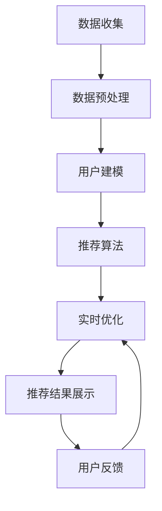

# AI人工智能代理工作流AI Agent WorkFlow：智能代理在内容推荐系统中的运用

## 1.背景介绍

在当今信息爆炸的时代，内容推荐系统已经成为各大互联网平台的核心技术之一。无论是电商平台的商品推荐，还是社交媒体的内容推送，推荐系统都在帮助用户发现他们感兴趣的内容。然而，传统的推荐系统在面对海量数据和复杂用户行为时，往往显得力不从心。随着人工智能技术的飞速发展，智能代理（AI Agent）作为一种新兴的技术手段，正在逐步改变内容推荐系统的设计和实现方式。

智能代理是一种能够自主感知环境、做出决策并执行任务的计算机程序。它们可以通过学习和适应，不断优化自身的行为，以达到预定的目标。在内容推荐系统中，智能代理可以通过分析用户行为数据，预测用户的兴趣和需求，从而提供更加个性化和精准的推荐服务。

## 2.核心概念与联系

### 2.1 智能代理

智能代理是一种能够自主感知环境、做出决策并执行任务的计算机程序。它们通常具备以下几个特征：
- **自主性**：能够独立完成任务，无需人工干预。
- **感知能力**：能够感知环境中的变化，并根据这些变化调整自身行为。
- **学习能力**：能够通过学习和适应，不断优化自身的行为。
- **协作能力**：能够与其他代理或系统进行协作，共同完成复杂任务。

### 2.2 内容推荐系统

内容推荐系统是一种通过分析用户行为数据，预测用户兴趣和需求，从而向用户推荐相关内容的系统。常见的推荐算法包括协同过滤、基于内容的推荐、混合推荐等。

### 2.3 智能代理与内容推荐系统的联系

智能代理在内容推荐系统中的应用主要体现在以下几个方面：
- **用户行为分析**：智能代理可以通过分析用户的历史行为数据，预测用户的兴趣和需求。
- **个性化推荐**：智能代理可以根据用户的兴趣和需求，提供个性化的推荐服务。
- **实时优化**：智能代理可以通过实时学习和适应，不断优化推荐算法，提高推荐的准确性和用户满意度。

## 3.核心算法原理具体操作步骤

### 3.1 数据收集与预处理

数据是推荐系统的基础。智能代理需要收集用户的行为数据，包括浏览记录、点击记录、购买记录等。数据收集完成后，需要对数据进行预处理，包括数据清洗、数据归一化、特征提取等。

### 3.2 用户建模

用户建模是推荐系统的核心步骤之一。智能代理通过分析用户的行为数据，构建用户的兴趣模型。常见的用户建模方法包括基于用户的协同过滤、基于内容的推荐、混合推荐等。

### 3.3 推荐算法

推荐算法是推荐系统的核心。智能代理可以采用多种推荐算法，包括协同过滤、基于内容的推荐、混合推荐等。推荐算法的选择取决于具体的应用场景和数据特点。

### 3.4 实时优化

智能代理可以通过实时学习和适应，不断优化推荐算法。常见的实时优化方法包括在线学习、强化学习等。

### 3.5 推荐结果展示

推荐结果展示是推荐系统的最后一步。智能代理需要将推荐结果展示给用户，并根据用户的反馈，不断优化推荐算法。

以下是一个智能代理在内容推荐系统中的工作流程图：



## 4.数学模型和公式详细讲解举例说明

### 4.1 协同过滤算法

协同过滤算法是推荐系统中最常用的一种算法。它通过分析用户的历史行为数据，预测用户的兴趣和需求。协同过滤算法可以分为基于用户的协同过滤和基于物品的协同过滤。

#### 4.1.1 基于用户的协同过滤

基于用户的协同过滤算法通过计算用户之间的相似度，找到与目标用户相似的用户，并根据这些相似用户的行为数据，向目标用户推荐内容。常见的相似度计算方法包括余弦相似度、皮尔逊相关系数等。

余弦相似度的计算公式为：

$$
\text{sim}(u, v) = \frac{\sum_{i \in I_{uv}} r_{ui} \cdot r_{vi}}{\sqrt{\sum_{i \in I_{uv}} r_{ui}^2} \cdot \sqrt{\sum_{i \in I_{uv}} r_{vi}^2}}
$$

其中，$u$ 和 $v$ 分别表示两个用户，$I_{uv}$ 表示用户 $u$ 和用户 $v$ 都评分过的物品集合，$r_{ui}$ 和 $r_{vi}$ 分别表示用户 $u$ 和用户 $v$ 对物品 $i$ 的评分。

#### 4.1.2 基于物品的协同过滤

基于物品的协同过滤算法通过计算物品之间的相似度，找到与目标物品相似的物品，并根据这些相似物品的评分数据，向用户推荐内容。常见的相似度计算方法包括余弦相似度、皮尔逊相关系数等。

余弦相似度的计算公式为：

$$
\text{sim}(i, j) = \frac{\sum_{u \in U_{ij}} r_{ui} \cdot r_{uj}}{\sqrt{\sum_{u \in U_{ij}} r_{ui}^2} \cdot \sqrt{\sum_{u \in U_{ij}} r_{uj}^2}}
$$

其中，$i$ 和 $j$ 分别表示两个物品，$U_{ij}$ 表示对物品 $i$ 和物品 $j$ 都评分过的用户集合，$r_{ui}$ 和 $r_{uj}$ 分别表示用户 $u$ 对物品 $i$ 和物品 $j$ 的评分。

### 4.2 基于内容的推荐算法

基于内容的推荐算法通过分析物品的内容特征，找到与用户兴趣相匹配的物品，并向用户推荐这些物品。常见的内容特征包括物品的类别、标签、描述等。

基于内容的推荐算法的核心是计算物品与用户兴趣之间的相似度。常见的相似度计算方法包括余弦相似度、TF-IDF 等。

TF-IDF 的计算公式为：

$$
\text{tf-idf}(t, d) = \text{tf}(t, d) \cdot \text{idf}(t)
$$

其中，$\text{tf}(t, d)$ 表示词 $t$ 在文档 $d$ 中出现的频率，$\text{idf}(t)$ 表示词 $t$ 的逆文档频率，计算公式为：

$$
\text{idf}(t) = \log \frac{N}{|\{d \in D : t \in d\}|}
$$

其中，$N$ 表示文档集合 $D$ 中的文档总数，$|\{d \in D : t \in d\}|$ 表示包含词 $t$ 的文档数量。

### 4.3 混合推荐算法

混合推荐算法通过结合多种推荐算法的优点，提供更加精准的推荐服务。常见的混合推荐方法包括加权法、级联法、切换法等。

#### 4.3.1 加权法

加权法通过对多种推荐算法的结果进行加权平均，得到最终的推荐结果。加权法的计算公式为：

$$
\text{score}(u, i) = \sum_{k=1}^K w_k \cdot \text{score}_k(u, i)
$$

其中，$\text{score}(u, i)$ 表示用户 $u$ 对物品 $i$ 的最终评分，$K$ 表示推荐算法的数量，$w_k$ 表示第 $k$ 种推荐算法的权重，$\text{score}_k(u, i)$ 表示第 $k$ 种推荐算法对用户 $u$ 和物品 $i$ 的评分。

#### 4.3.2 级联法

级联法通过将多种推荐算法按顺序级联起来，逐步筛选推荐结果。级联法的核心思想是先使用一种推荐算法筛选出候选物品，然后再使用另一种推荐算法对候选物品进行排序，最终得到推荐结果。

#### 4.3.3 切换法

切换法通过在不同的场景下切换不同的推荐算法，以提供更加精准的推荐服务。切换法的核心思想是根据用户的行为特征和推荐场景，选择最适合的推荐算法。

## 5.项目实践：代码实例和详细解释说明

在本节中，我们将通过一个具体的项目实例，展示如何使用智能代理实现内容推荐系统。我们将使用 Python 语言和常见的机器学习库，如 scikit-learn、pandas、numpy 等。

### 5.1 数据收集与预处理

首先，我们需要收集用户的行为数据，并对数据进行预处理。以下是一个简单的数据收集与预处理的代码示例：

```python
import pandas as pd
import numpy as np

# 读取用户行为数据
data = pd.read_csv('user_behavior.csv')

# 数据清洗
data = data.dropna()

# 数据归一化
data['rating'] = (data['rating'] - data['rating'].min()) / (data['rating'].max() - data['rating'].min())

# 特征提取
user_features = data[['user_id', 'item_id', 'rating']]
```

### 5.2 用户建模

接下来，我们需要对用户进行建模。以下是一个基于用户的协同过滤算法的用户建模代码示例：

```python
from sklearn.metrics.pairwise import cosine_similarity

# 构建用户-物品评分矩阵
user_item_matrix = user_features.pivot(index='user_id', columns='item_id', values='rating').fillna(0)

# 计算用户相似度矩阵
user_similarity = cosine_similarity(user_item_matrix)

# 将相似度矩阵转换为 DataFrame
user_similarity_df = pd.DataFrame(user_similarity, index=user_item_matrix.index, columns=user_item_matrix.index)
```

### 5.3 推荐算法

然后，我们需要实现推荐算法。以下是一个基于用户的协同过滤算法的推荐代码示例：

```python
def recommend(user_id, user_similarity_df, user_item_matrix, top_n=10):
    # 获取与目标用户相似的用户
    similar_users = user_similarity_df[user_id].sort_values(ascending=False).index[1:]

    # 获取相似用户的评分数据
    similar_users_ratings = user_item_matrix.loc[similar_users]

    # 计算推荐评分
    recommend_scores = similar_users_ratings.mean(axis=0)

    # 排序并获取前 top_n 个推荐物品
    recommend_items = recommend_scores.sort_values(ascending=False).index[:top_n]

    return recommend_items

# 获取推荐结果
recommend_items = recommend(user_id=1, user_similarity_df=user_similarity_df, user_item_matrix=user_item_matrix)
print(recommend_items)
```

### 5.4 实时优化

为了提高推荐的准确性，我们可以通过实时学习和适应，不断优化推荐算法。以下是一个简单的实时优化代码示例：

```python
from sklearn.model_selection import train_test_split
from sklearn.metrics import mean_squared_error

# 划分训练集和测试集
train_data, test_data = train_test_split(user_features, test_size=0.2, random_state=42)

# 训练模型
user_item_matrix_train = train_data.pivot(index='user_id', columns='item_id', values='rating').fillna(0)
user_similarity_train = cosine_similarity(user_item_matrix_train)
user_similarity_df_train = pd.DataFrame(user_similarity_train, index=user_item_matrix_train.index, columns=user_item_matrix_train.index)

# 预测评分
test_user_item_matrix = test_data.pivot(index='user_id', columns='item_id', values='rating').fillna(0)
predicted_ratings = np.dot(user_similarity_df_train, test_user_item_matrix)

# 计算均方误差
mse = mean_squared_error(test_user_item_matrix.values.flatten(), predicted_ratings.flatten())
print(f'Mean Squared Error: {mse}')
```

### 5.5 推荐结果展示

最后，我们需要将推荐结果展示给用户。以下是一个简单的推荐结果展示代码示例：

```python
def display_recommendations(user_id, recommend_items):
    print(f'User {user_id} Recommendations:')
    for item in recommend_items:
        print(f'Item {item}')

# 展示推荐结果
display_recommendations(user_id=1, recommend_items=recommend_items)
```

## 6.实际应用场景

智能代理在内容推荐系统中的应用场景非常广泛，以下是几个典型的应用场景：

### 6.1 电商平台

在电商平台中，智能代理可以通过分析用户的浏览记录、购买记录等行为数据，预测用户的购物需求，并向用户推荐相关商品。例如，亚马逊的推荐系统就是一个典型的应用案例。

### 6.2 社交媒体

在社交媒体中，智能代理可以通过分析用户的点赞、评论、分享等行为数据，预测用户的兴趣和偏好，并向用户推荐相关内容。例如，Facebook 和 Twitter 的推荐系统就是典型的应用案例。

### 6.3 视频平台

在视频平台中，智能代理可以通过分析用户的观看记录、点赞、评论等行为数据，预测用户的观影偏好，并向用户推荐相关视频。例如，Netflix 和 YouTube 的推荐系统就是典型的应用案例。

### 6.4 音乐平台

在音乐平台中，智能代理可以通过分析用户的播放记录、点赞、评论等行为数据，预测用户的音乐偏好，并向用户推荐相关歌曲。例如，Spotify 和 Apple Music 的推荐系统就是典型的应用案例。

## 7.工具和资源推荐

在实现智能代理和内容推荐系统的过程中，我们可以使用以下工具和资源：

### 7.1 编程语言

- **Python**：Python 是实现智能代理和内容推荐系统的首选编程语言。它拥有丰富的机器学习库和数据处理库，如 scikit-learn、pandas、numpy 等。

### 7.2 机器学习库

- **scikit-learn**：scikit-learn 是一个简单高效的机器学习库，适用于数据挖掘和数据分析。
- **TensorFlow**：TensorFlow 是一个开源的机器学习框架，适用于深度学习和神经网络模型的构建和训练。
- **PyTorch**：PyTorch 是一个开源的深度学习框架，具有灵活性和易用性，适用于研究和生产环境。

### 7.3 数据处理库

- **pandas**：pandas 是一个强大的数据处理和分析库，适用于结构化数据的处理和分析。
- **numpy**：numpy 是一个高性能的科学计算库，适用于数值计算和矩阵运算。

### 7.4 数据可视化库

- **matplotlib**：matplotlib 是一个强大的数据可视化库，适用于生成各种类型的图表和可视化效果。
- **seaborn**：seaborn 是一个基于 matplotlib 的数据可视化库，提供了更加美观和高级的可视化效果。

### 7.5 在线资源

- **Kaggle**：Kaggle 是一个数据科学竞赛平台，提供了丰富的数据集和竞赛项目，适合进行数据分析和机器学习模型的训练和评估。
- **Coursera**：Coursera 是一个在线教育平台，提供了丰富的机器学习和人工智能课程，适合学习和提升相关技能。

## 8.总结：未来发展趋势与挑战

智能代理在内容推荐系统中的应用前景广阔，但也面临一些挑战。以下是几个未来的发展趋势和挑战：

### 8.1 发展趋势

#### 8.1.1 深度学习的应用

随着深度学习技术的不断发展，越来越多的推荐系统开始采用深度学习模型，如神经协同过滤、卷积神经网络、循环神经网络等。这些模型能够更好地捕捉用户行为数据中的复杂模式，提高推荐的准确性和用户满意度。

#### 8.1.2 强化学习的应用

强化学习是一种通过与环境交互，不断优化决策策略的机器学习方法。在推荐系统中，强化学习可以通过实时学习和适应，不断优化推荐算法，提高推荐的准确性和用户满意度。

#### 8.1.3 多模态数据的融合

随着数据来源的多样化，推荐系统需要处理和融合多种类型的数据，如文本、图像、音频、视频等。多模态数据的融合可以提高推荐的准确性和用户满意度。

### 8.2 挑战

#### 8.2.1 数据隐私和安全

在推荐系统中，用户行为数据是核心资源。然而，数据隐私和安全问题也成为一个重要的挑战。如何在保护用户隐私的前提下，充分利用用户行为数据，是推荐系统面临的重要问题。

#### 8.2.2 算法公平性和透明性

推荐系统的算法公平性和透明性问题也备受关注。如何确保推荐算法的公平性，避免算法偏见，以及如何提高推荐算法的透明性，让用户理解推荐结果，是推荐系统面临的重要问题。

#### 8.2.3 用户体验和满意度

推荐系统的最终目标是提高用户体验和满意度。然而，如何平衡推荐的准确性和用户的多样化