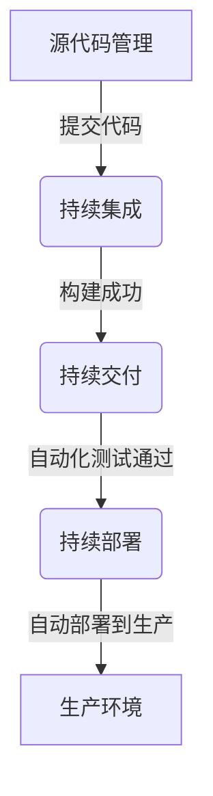

# AI系统持续部署原理与代码实战案例讲解

## 1.背景介绍

在当今快节奏的软件开发环境中,AI系统的持续部署已成为确保高效、可靠和安全交付的关键。传统的手动部署方式已无法满足快速迭代和频繁发布的需求,而自动化持续部署流程则可以显著提高效率、减少人为错误,并确保一致的部署质量。

AI系统的持续部署包括从源代码管理到构建、测试、部署和监控的全流程自动化。这不仅使开发团队能够快速响应需求变化,还能及时发现和修复问题,从而提高系统的可靠性和稳定性。

## 2.核心概念与联系

### 2.1 持续集成(Continuous Integration)

持续集成(CI)是一种软件开发实践,开发人员频繁地将代码集成到共享代码库中。每一次集成都通过自动化构建(包括编译、打包、单元测试等)来验证,从而尽早发现集成错误。CI确保了代码的一致性和可靠性。

### 2.2 持续交付(Continuous Delivery)

持续交付(CD)在持续集成的基础上,将软件的发布过程自动化。通过自动化的构建、测试和部署流程,可以随时将软件版本发布到生产或测试环境。持续交付确保了软件可以随时安全地部署到生产环境。

### 2.3 持续部署(Continuous Deployment)

持续部署是持续交付的进一步扩展,它将通过自动化测试的软件版本直接部署到生产环境,无需人工干预。这种做法可以最大程度地减少发布周期,实现真正的自动化交付。

上述三个概念紧密相连,共同构建了现代软件交付的最佳实践。持续集成确保代码的可集成性,持续交付使交付过程自动化,而持续部署则实现了真正的自动化发布。



## 3.核心算法原理具体操作步骤

持续部署的核心算法原理可以概括为以下几个步骤:

1. **代码提交**: 开发人员将新的代码更改提交到版本控制系统(如Git)中的共享代码库。

2. **持续集成**:
   - 版本控制系统检测到新的代码提交
   - 触发自动化构建和测试流程
   - 执行代码编译、单元测试、代码质量检查等操作
   - 如果所有检查通过,则将构建的软件包推送到制品库(Artifact Repository)

3. **持续交付**:
   - 从制品库中获取通过测试的软件包
   - 自动化地部署到预发布或测试环境
   - 执行一系列自动化测试(功能测试、集成测试、性能测试等)
   - 如果所有测试通过,则标记该版本为可部署状态

4. **持续部署**:
   - 监控生产环境的运行状况和指标
   - 根据预定的部署策略(如蓝绿部署、滚动部署等)自动将新版本部署到生产环境
   - 执行smoke测试,验证部署是否成功
   - 如果部署成功,则自动切换流量到新版本
   - 如果出现问题,则自动回滚到上一个稳定版本

5. **监控和反馈**:
   - 持续监控生产环境的性能、错误率、日志等指标
   - 根据监控数据自动扩缩容或执行其他操作
   - 将监控数据和用户反馈反馈给开发团队,用于下一个迭代

该算法的核心在于通过自动化流程实现端到端的持续交付和部署,从而确保软件的快速迭代、高质量交付和可靠运行。

## 4.数学模型和公式详细讲解举例说明

在持续部署过程中,我们需要考虑多种数学模型和公式,以优化部署策略、资源利用和性能指标。

### 4.1 蓝绿部署模型

蓝绿部署是一种无停机部署策略,它通过运行两个相同的生产环境(蓝环境和绿环境),来实现平滑的版本升级和回滚。

假设我们有一个Web服务,其流量符合泊松分布,平均每秒请求数为$\lambda$。我们希望确保在部署新版本时,系统的可用性不低于$p$。

令$\mu$为单个服务实例的最大处理能力(请求数/秒),$n$为实例数量。根据队列论中的M/M/n模型,系统的阻塞概率$P_B$可以计算如下:

$$
P_B = \frac{(n\rho)^n\rho}{n!(1-\rho)}\cdot\frac{1}{1-\rho^{n+1}}
$$

其中$\rho = \lambda/(n\mu)$表示系统的利用率。

为了满足可用性要求$1-P_B \geq p$,我们可以求解出所需的最小实例数量$n$。在蓝绿部署过程中,我们可以先在绿环境启动新版本的$n$个实例,待所有实例就绪后,再将流量从蓝环境切换到绿环境,从而实现无停机部署。

### 4.2 滚动部署模型

滚动部署是另一种常见的部署策略,它通过逐步替换旧版本的实例来实现平滑升级。我们可以使用马尔可夫决策过程(MDP)来建模和优化滚动部署过程。

令$s_t$表示第$t$个时间步的系统状态,包括新旧版本实例的数量。令$a_t$表示第$t$步的动作(如增加新版本实例、减少旧版本实例等)。我们的目标是找到一个策略$\pi$,使得在满足约束条件(如可用性要求)的前提下,最小化部署成本。

我们可以定义状态转移概率$P(s_{t+1}|s_t, a_t)$和即时成本函数$c(s_t, a_t)$,并求解以下优化问题:

$$
\min_\pi \mathbb{E}_\pi\left[\sum_{t=0}^{T}c(s_t, a_t)\right]
$$

$$
\text{s.t.} \quad P(s_t \text{ 满足约束}) \geq p, \forall t
$$

该优化问题可以使用动态规划或强化学习等算法求解。通过优化滚动部署策略,我们可以在保证可用性的同时,最小化部署成本和停机时间。

上述模型和公式只是持续部署中数学建模的一个示例,在实际应用中还可以根据具体需求构建更加复杂的模型,以优化部署过程和资源利用。

## 5.项目实践:代码实例和详细解释说明

为了更好地理解持续部署的实现,我们将通过一个基于Kubernetes和GitLab CI/CD的实践案例进行讲解。

### 5.1 环境准备

- Kubernetes集群
- GitLab代码仓库和CI/CD runner
- Docker镜像仓库(如Docker Hub)
- Helm包管理工具

### 5.2 代码结构

我们的示例项目是一个基于Python Flask的简单Web应用,其代码结构如下:

```
app/
├── app.py
├── requirements.txt
├── templates/
│   └── index.html
├── tests/
│   └── test_app.py
├── .gitlab-ci.yml
└── charts/
    └── web-app/
        ├── Chart.yaml
        ├── values.yaml
        └── templates/
            ├── deployment.yaml
            ├── service.yaml
            └── ingress.yaml
```

- `app.py`: Flask应用程序入口
- `requirements.txt`: Python依赖包列表
- `templates/`: HTML模板文件
- `tests/`: 单元测试脚本
- `.gitlab-ci.yml`: GitLab CI/CD配置文件
- `charts/web-app/`: Helm包,用于在Kubernetes上部署应用

### 5.3 持续集成流程

当开发人员向GitLab代码仓库推送新的代码提交时,GitLab CI/CD runner会自动执行以下步骤:

1. 拉取代码
2. 构建Docker镜像
3. 运行单元测试
4. 如果测试通过,则将Docker镜像推送到Docker Hub

`.gitlab-ci.yml`文件中的相关配置如下:

```yaml
image: docker:latest

services:
  - docker:dind

stages:
  - build
  - test
  - release

build:
  stage: build
  script:
    - docker build -t $CI_REGISTRY_IMAGE:$CI_COMMIT_SHORT_SHA .
    - docker push $CI_REGISTRY_IMAGE:$CI_COMMIT_SHORT_SHA

test:
  stage: test
  script:
    - docker run $CI_REGISTRY_IMAGE:$CI_COMMIT_SHORT_SHA python -m unittest discover tests/

release:
  stage: release
  script:
    - docker pull $CI_REGISTRY_IMAGE:$CI_COMMIT_SHORT_SHA
    - docker tag $CI_REGISTRY_IMAGE:$CI_COMMIT_SHORT_SHA $DOCKER_HUB_REPO:$CI_COMMIT_SHORT_SHA
    - docker push $DOCKER_HUB_REPO:$CI_COMMIT_SHORT_SHA
  only:
    - main
```

### 5.4 持续部署流程

在持续集成阶段成功后,我们将使用GitLab CI/CD runner自动触发部署到Kubernetes集群。部署过程如下:

1. 从Docker Hub拉取最新的Docker镜像
2. 使用Helm升级或安装应用程序
3. 执行smoke测试,验证部署是否成功
4. 如果测试通过,则自动切换流量到新版本
5. 如果出现问题,则自动回滚到上一个稳定版本

`.gitlab-ci.yml`文件中的相关配置如下:

```yaml
deploy:
  stage: deploy
  script:
    - kubectl create ns ${KUBE_NAMESPACE} --dry-run=client -o yaml | kubectl apply -f -
    - helm upgrade --install web-app ./charts/web-app --namespace=${KUBE_NAMESPACE} --set image.tag=$CI_COMMIT_SHORT_SHA
    - kubectl rollout status deployment/web-app --namespace=${KUBE_NAMESPACE}
    - kubectl get svc --namespace=${KUBE_NAMESPACE}
  environment:
    name: production
    url: http://${KUBE_INGRESS}
  only:
    - main
```

在这个示例中,我们使用Helm来管理Kubernetes应用程序的部署。`charts/web-app/`目录中的YAML文件定义了Deployment、Service和Ingress等Kubernetes资源。

通过上述流程,我们实现了从代码提交到生产环境的自动化持续部署,确保了快速、可靠和一致的交付。

## 6.实际应用场景

持续部署在各种AI系统的开发和运维中都有广泛的应用,例如:

1. **机器学习模型服务**: 通过持续部署,我们可以快速地将新训练的模型投入生产环境,并根据实时性能数据进行调优和迭代。

2. **自然语言处理系统**: NLP系统通常需要频繁更新语料库和模型,持续部署可以确保这些更新及时地反映到线上系统中。

3. **计算机视觉应用**:在自动驾驶、安防监控等领域,计算机视觉算法和模型需要持续优化和升级,持续部署可以实现无缝升级。

4. **推荐系统**:推荐算法的改进和个性化策略的调整需要快速地反映到线上系统,持续部署可以满足这一需求。

5. **大数据分析平台**: 随着数据量和算法的不断变化,大数据分析平台需要频繁升级和扩展,持续部署可以实现无缝扩容和版本升级。

除了AI系统之外,持续部署同样适用于传统的Web应用、移动应用、微服务架构等多种场景,帮助企业加快交付速度,提高效率和质量。

## 7.工具和资源推荐

实施持续部署需要一系列工具和平台的支持,下面是一些常用的工具和资源:

1. **版本控制系统**: Git、GitLab、GitHub、Bitbucket等
2. **持续集成工具**: Jenkins、GitLab CI/CD、Travis CI、CircleCI等
3. **容器化平台**: Docker、Kubernetes、Amazon ECS等
4. **配置管理工具**: Ansible、Puppet、Chef、Terraform等
5. **包管理工具**: Helm、Kustomize、Carvel等
6. **监控和日志工具**: Prometheus、Grafana、ELK Stack、Splunk等
7. **自动化测试框架**: Selenium、Appium、Robot Framework等
8. **部署策略工具**: Spinnaker、Argo CD、Flagger等
9. **在线学习资源**: Coursera、U