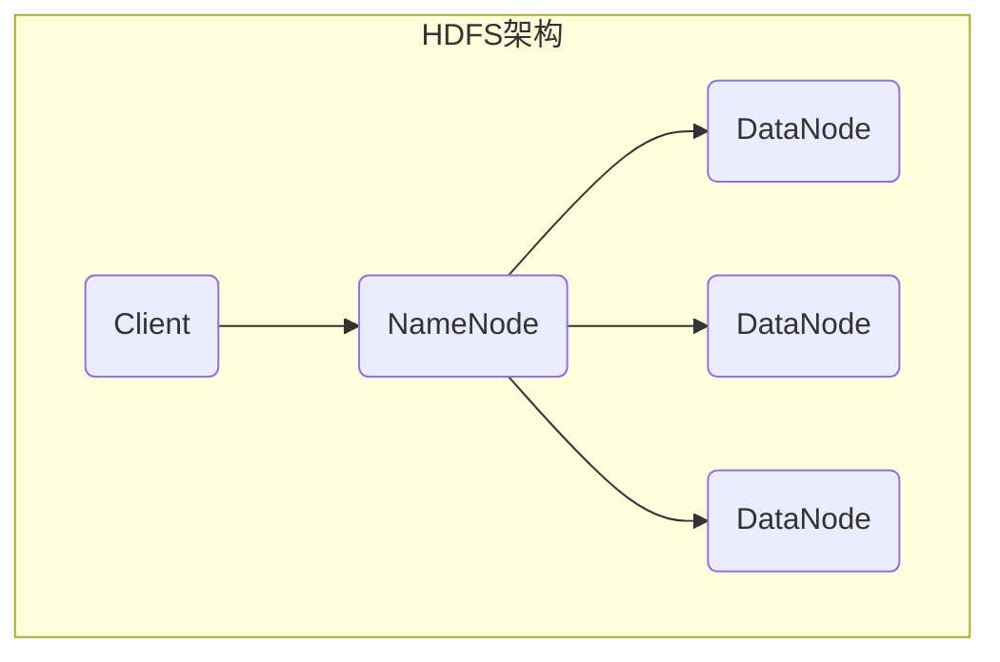
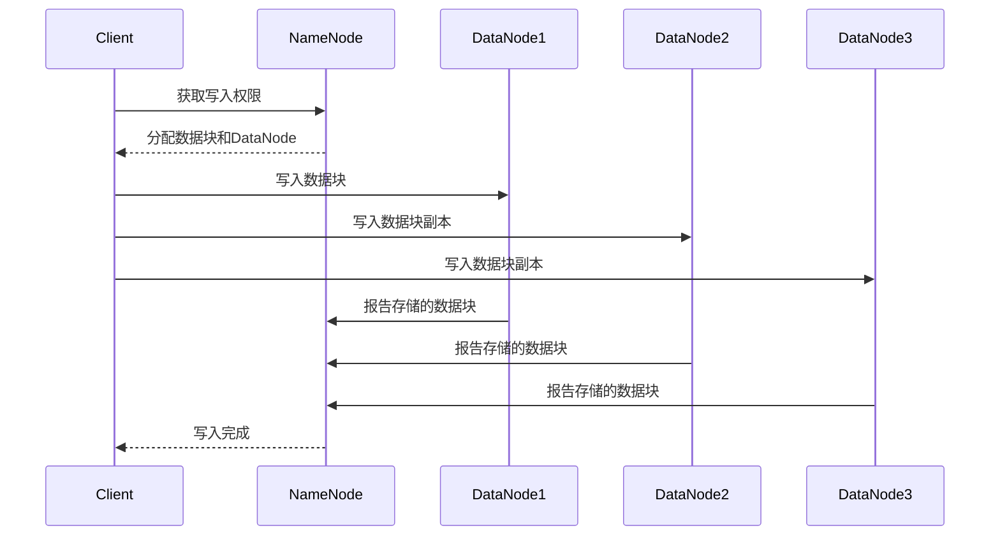
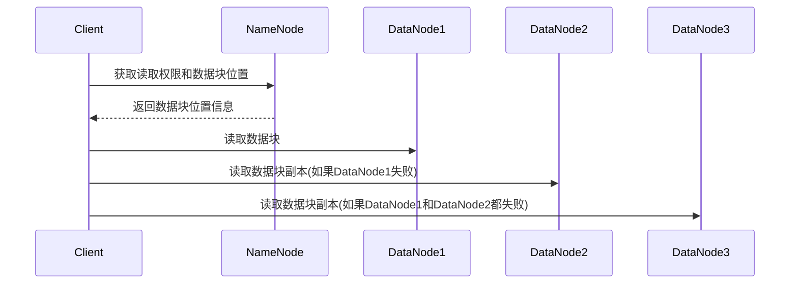

# HDFS原理与代码实例讲解

## 1.背景介绍

### 1.1 大数据时代的到来

随着互联网、移动互联网、物联网的快速发展,海量的数据不断产生和积累。这些数据来自于各种渠道,包括网络日志、社交媒体、物联网设备等。传统的数据存储和处理系统已经无法满足当前大数据时代的需求。因此,一种能够存储和处理大规模数据集的分布式文件系统应运而生,这就是HDFS(Hadoop Distributed File System)。

### 1.2 HDFS的由来

HDFS是Apache Hadoop项目的核心组件之一,最初由Doug Cutting等人在2006年设计和实现。它是一个高度容错的分布式文件系统,能够运行在廉价的硬件集群上,并提供高吞吐量的数据访问。HDFS的设计理念是基于Google的GFS(Google File System)文件系统,但做了适当的修改和优化,使其更加适合运行在商用硬件集群上。

## 2.核心概念与联系

### 2.1 HDFS的架构

HDFS采用主从架构,由一个NameNode(名称节点)和多个DataNode(数据节点)组成。NameNode负责管理文件系统的命名空间和客户端对文件的访问,而DataNode负责存储实际的文件数据块。



### 2.2 文件块

HDFS将文件划分为一个个大小相等的数据块(Block),默认大小为128MB。这些数据块分散存储在不同的DataNode上,以提供数据冗余和容错能力。

### 2.3 副本机制

为了保证数据的可靠性,HDFS采用了副本机制。每个数据块都会有多个副本(默认为3个),分散存储在不同的DataNode上。当某个DataNode发生故障时,HDFS可以从其他DataNode上获取数据块的副本,从而保证数据的可用性。

## 3.核心算法原理具体操作步骤

### 3.1 写数据流程

当客户端向HDFS写入数据时,会经历以下步骤:

1. 客户端与NameNode通信,获取文件的写入权限。
2. NameNode确定文件将被划分为多个数据块,并为每个数据块分配一组DataNode用于存储数据块及其副本。
3. 客户端直接与DataNode通信,将数据块写入指定的DataNode。
4. 当数据块写入完成后,DataNode会向NameNode报告已存储的数据块信息。
5. NameNode记录文件到数据块的映射信息,以及每个数据块的位置信息。



### 3.2 读数据流程

当客户端从HDFS读取数据时,会经历以下步骤:

1. 客户端与NameNode通信,获取文件的读取权限和数据块位置信息。
2. NameNode返回文件的数据块位置信息,包括每个数据块所在的DataNode列表。
3. 客户端直接与DataNode通信,从最近的DataNode读取数据块。
4. 如果某个DataNode发生故障,客户端会从其他DataNode获取数据块的副本。



## 4.数学模型和公式详细讲解举例说明

### 4.1 数据块放置策略

HDFS采用一种智能的数据块放置策略,以实现数据的本地化和负载均衡。该策略可以用以下公式表示:

$$
\begin{aligned}
\text{Score}(Node_i) &= \frac{1}{(\text{Node_i.Remaining_Capacity} \times \text{Node_i.Rack_Transfer_Rate})} \\
&+ \frac{1}{(\text{Node_i.Remaining_Capacity} \times \text{Node_i.Node_Transfer_Rate})}
\end{aligned}
$$

其中:

- $\text{Node_i.Remaining_Capacity}$ 表示节点 $i$ 的剩余存储空间。
- $\text{Node_i.Rack_Transfer_Rate}$ 表示节点 $i$ 与同一机架内其他节点之间的传输速率。
- $\text{Node_i.Node_Transfer_Rate}$ 表示节点 $i$ 与不同机架节点之间的传输速率。

HDFS会选择得分最低的节点来存储数据块,这样可以实现以下目标:

1. 优先选择剩余存储空间较大的节点,以实现负载均衡。
2. 优先选择与客户端位于同一机架内的节点,以减少跨机架传输开销。
3. 如果无法在同一机架内找到合适的节点,则选择与客户端不同机架但传输速率较高的节点。

### 4.2 数据块副本放置策略

为了提高数据可靠性和可用性,HDFS采用了数据块副本放置策略。该策略可以用以下公式表示:

$$
\begin{aligned}
\text{Score}(Node_i, Rack_j) &= \frac{1}{(\text{Node_i.Remaining_Capacity} \times \text{Node_i.Node_Transfer_Rate})} \\
&+ \frac{1}{(\text{Rack_j.Remaining_Capacity} \times \text{Rack_j.Rack_Transfer_Rate})}
\end{aligned}
$$

其中:

- $\text{Node_i.Remaining_Capacity}$ 表示节点 $i$ 的剩余存储空间。
- $\text{Node_i.Node_Transfer_Rate}$ 表示节点 $i$ 与不同机架节点之间的传输速率。
- $\text{Rack_j.Remaining_Capacity}$ 表示机架 $j$ 的剩余存储空间。
- $\text{Rack_j.Rack_Transfer_Rate}$ 表示机架 $j$ 与其他机架之间的传输速率。

HDFS会选择得分最低的节点和机架来存储数据块副本,这样可以实现以下目标:

1. 优先选择剩余存储空间较大的节点和机架,以实现负载均衡。
2. 优先选择与已存储数据块的节点和机架不同的节点和机架,以提高数据可靠性。
3. 如果无法在不同机架中找到合适的节点,则选择与已存储数据块的节点位于同一机架但传输速率较高的节点。

通过这种策略,HDFS可以将数据块及其副本分散存储在不同的节点和机架上,从而提高数据的可靠性和可用性。

## 5.项目实践:代码实例和详细解释说明

### 5.1 HDFS Java API示例

以下是使用HDFS Java API读写文件的示例代码:

```java
import org.apache.hadoop.conf.Configuration;
import org.apache.hadoop.fs.FileSystem;
import org.apache.hadoop.fs.Path;

public class HDFSExample {
    public static void main(String[] args) throws Exception {
        // 配置HDFS文件系统
        Configuration conf = new Configuration();
        conf.set("fs.defaultFS", "hdfs://namenode:9000");
        FileSystem fs = FileSystem.get(conf);

        // 写入文件
        Path filePath = new Path("/user/example/data.txt");
        byte[] data = "Hello, HDFS!".getBytes();
        fs.create(filePath).write(data);

        // 读取文件
        byte[] buffer = new byte[data.length];
        fs.open(filePath).read(buffer);
        System.out.println(new String(buffer));

        // 关闭文件系统
        fs.close();
    }
}
```

代码解释:

1. 首先创建一个`Configuration`对象,用于配置HDFS文件系统的相关参数,如NameNode的地址。
2. 使用`FileSystem.get(conf)`方法获取HDFS文件系统实例。
3. 创建一个`Path`对象,表示要写入或读取的文件路径。
4. 使用`fs.create(filePath)`方法创建一个输出流,并写入数据。
5. 使用`fs.open(filePath)`方法创建一个输入流,并读取数据。
6. 最后,调用`fs.close()`方法关闭文件系统。

### 5.2 HDFS命令行示例

HDFS也提供了命令行工具,用于管理和操作文件系统。以下是一些常用命令:

```bash
# 列出HDFS上的文件和目录
hdfs dfs -ls /user/example

# 创建目录
hdfs dfs -mkdir /user/example/data

# 上传本地文件到HDFS
hdfs dfs -put local_file.txt /user/example/data/

# 从HDFS下载文件到本地
hdfs dfs -get /user/example/data/file.txt local_file.txt

# 删除HDFS上的文件或目录
hdfs dfs -rm /user/example/data/file.txt
hdfs dfs -rm -r /user/example/data
```

这些命令可以方便地管理HDFS上的文件和目录,包括创建、上传、下载和删除操作。

## 6.实际应用场景

HDFS作为一种分布式文件系统,在大数据领域有着广泛的应用场景:

1. **大数据处理**: HDFS与Hadoop生态系统中的其他组件(如MapReduce、Spark等)紧密集成,用于存储和处理大规模数据集。
2. **数据湖**: HDFS可以作为企业数据湖的底层存储层,存储来自各种来源的原始数据,供数据分析和机器学习等应用使用。
3. **日志分析**: HDFS可以存储大量的日志数据,如网站访问日志、应用程序日志等,用于日志分析和监控。
4. **备份和归档**: HDFS可以用于存储大量的备份数据和归档数据,提供高可靠性和高吞吐量的存储解决方案。
5. **物联网数据存储**: HDFS可以存储来自物联网设备的海量数据,如传感器数据、视频流数据等,为物联网应用提供数据存储支持。

## 7.工具和资源推荐

### 7.1 HDFS相关工具

- **Apache Hadoop**: HDFS是Apache Hadoop项目的核心组件,提供了完整的HDFS实现。
- **Apache Ambari**: 一个开源的大数据集群管理工具,可以方便地部署和管理HDFS集群。
- **Apache Hive**: 一个基于HDFS的数据仓库工具,提供了SQL接口来查询和分析存储在HDFS上的数据。
- **Apache Spark**: 一个快速、通用的大数据处理引擎,可以与HDFS无缝集成,用于处理存储在HDFS上的数据。

### 7.2 学习资源

- **Apache Hadoop官方文档**: https://hadoop.apache.org/docs/stable/
- **HDFS架构设计文档**: https://hadoop.apache.org/docs/stable/hadoop-project-dist/hadoop-hdfs/HdfsDesign.html
- **HDFS权威指南(第4版)**: 由Doug Cutting等人编写的HDFS权威指南,全面介绍了HDFS的架构、设计和实现细节。
- **Coursera HDFS课程**: https://www.coursera.org/learn/hadoop
- **edX HDFS课程**: https://www.edx.org/course/introduction-to-hadoop-and-mapreduce

## 8.总结:未来发展趋势与挑战

### 8.1 未来发展趋势

1. **异构存储支持**: HDFS未来可能会支持更多种类的异构存储设备,如SSD、NVMe等,以提高存储性能和效率。
2. **智能数据管理**: HDFS可能会引入更智能的数据管理策略,如自动数据迁移、数据压缩和去重等,以优化存储利用率和性能。
3. **安全性和隐私保护**:随着数据隐私和安全性要求的不断