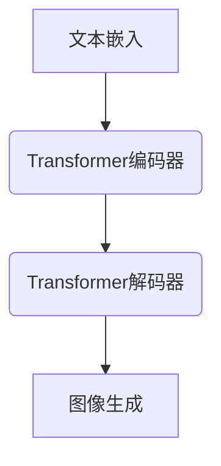

# Imagen的多模态生成:融合多种信息源的综合能力

## 1.背景介绍

随着人工智能技术的不断发展,多模态学习(Multimodal Learning)逐渐成为了一个热门的研究领域。传统的机器学习模型通常只关注单一模态的数据,如文本或图像。然而,现实世界中的信息通常以多种形式存在,包括文本、图像、视频、音频等。多模态学习旨在从多种模态的数据中学习,并利用不同模态之间的相关性和互补性来提高模型的性能。

谷歌(Google)最新推出的Imagen就是一个多模态生成模型,它能够根据文本描述生成相应的图像。Imagen的出现标志着多模态生成技术取得了重大突破,为人工智能系统赋予了更强大的理解和表达能力。

### 1.1 多模态生成的重要性

多模态生成技术的重要性主要体现在以下几个方面:

1. **丰富的信息表达**:通过融合多种模态,模型可以更加生动、直观地表达信息,提高人机交互的效率和质量。
2. **泛化能力增强**:利用多模态数据训练的模型能够更好地捕捉数据的内在规律,从而具有更强的泛化能力。
3. **多领域应用**:多模态生成技术可以应用于多个领域,如虚拟现实、辅助交互、内容创作等,拓展了人工智能的应用场景。

### 1.2 Imagen的关键创新

Imagen在多模态生成领域取得了以下关键创新:

1. **大规模预训练**:Imagen在大量的文本-图像对数据上进行了预训练,获得了强大的多模态表示能力。
2. **高质量图像生成**:Imagen生成的图像质量高,细节丰富,能够捕捉文本描述的关键信息。
3. **语义理解能力强**:Imagen能够深入理解文本描述的语义信息,生成与描述高度相关的图像。

## 2.核心概念与联系

### 2.1 多模态学习

多模态学习(Multimodal Learning)是一种利用多种模态数据(如文本、图像、视频等)进行联合建模和学习的范式。它旨在从不同模态之间的相互作用中捕获更丰富的信息,从而提高模型的性能。

多模态学习的核心思想是利用不同模态之间的相关性和互补性,通过模态融合(Modal Fusion)将多个模态的信息整合在一起,从而获得更加全面和准确的数据表示。

### 2.2 多模态生成

多模态生成(Multimodal Generation)是多模态学习的一个重要分支,它旨在根据一种或多种模态的输入,生成另一种模态的输出。例如,根据文本描述生成相应的图像或视频,或者根据图像生成相应的文本描述。

多模态生成模型通常由两个主要组件组成:编码器(Encoder)和解码器(Decoder)。编码器将输入模态编码为潜在表示,而解码器则根据这些潜在表示生成目标模态的输出。

### 2.3 Imagen模型架构

Imagen是一种基于Transformer的多模态生成模型,它的核心架构如下所示:



1. **文本嵌入(Text Embedding)**:将输入的文本描述转换为向量表示。
2. **Transformer编码器(Transformer Encoder)**:对文本嵌入进行编码,获得文本的上下文表示。
3. **Transformer解码器(Transformer Decoder)**:根据文本的上下文表示,逐步生成图像的像素值。
4. **图像生成(Image Generation)**:将解码器生成的像素值转换为最终的图像输出。

## 3.核心算法原理具体操作步骤

Imagen的核心算法原理可以分为以下几个主要步骤:

### 3.1 文本编码

1. 将输入的文本描述tokenize为一系列token序列。
2. 使用预训练的文本编码器(如BERT)将token序列编码为文本嵌入向量序列。

### 3.2 条件图像生成

1. 将文本嵌入向量序列输入到Transformer编码器中,获得文本的上下文表示。
2. 使用Transformer解码器逐步生成图像的像素值:
   - 初始化解码器的起始状态,包括起始像素值和文本的上下文表示。
   - 在每一步,解码器根据当前的状态和文本的上下文表示,预测下一个像素值。
   - 将预测的像素值添加到生成的图像中,并更新解码器的状态。
   - 重复上述步骤,直到生成完整的图像。

### 3.3 损失函数和优化

1. 定义像素值的损失函数,例如交叉熵损失。
2. 使用反向传播算法计算模型参数的梯度。
3. 使用优化算法(如Adam)更新模型参数,最小化损失函数。

### 3.4 采样和后处理

1. 在推理阶段,可以使用采样技术(如顶端采样)来提高生成图像的多样性。
2. 对生成的图像进行后处理,如去噪、上色等,以提高图像质量。

## 4.数学模型和公式详细讲解举例说明

### 4.1 Transformer编码器

Transformer编码器用于编码输入的文本序列,获得其上下文表示。其核心公式如下:

$$
H^l = \text{Transformer-Block}(H^{l-1}) \\
H^0 = \text{Embedding}(X)
$$

其中:

- $X$是输入的token序列
- $H^l$是第$l$层的输出向量序列
- $\text{Transformer-Block}$包含多头注意力机制和前馈神经网络
- $\text{Embedding}$是token嵌入函数

多头注意力机制的公式为:

$$
\text{MultiHead}(Q, K, V) = \text{Concat}(head_1, \dots, head_h)W^O \\
\text{where } head_i = \text{Attention}(QW_i^Q, KW_i^K, VW_i^V)
$$

其中$Q$、$K$、$V$分别是查询(Query)、键(Key)和值(Value)向量。$W_i^Q$、$W_i^K$、$W_i^V$和$W^O$是可学习的权重矩阵。

### 4.2 Transformer解码器

Transformer解码器用于根据文本的上下文表示逐步生成图像的像素值。其核心公式如下:

$$
P(y_t | y_{<t}, x) = \text{Transformer-Decoder}(y_{<t}, H^L)
$$

其中:

- $y_t$是时间步$t$的像素值
- $y_{<t}$是之前时间步生成的像素值序列
- $x$是输入的文本序列
- $H^L$是Transformer编码器的最终输出,即文本的上下文表示

解码器使用掩码多头注意力机制,以确保每个时间步只关注之前的像素值。

### 4.3 损失函数

Imagen通常使用交叉熵损失函数来优化像素值的预测。对于RGB图像,损失函数可以表示为:

$$
\mathcal{L} = -\frac{1}{N} \sum_{i=1}^N \sum_{c=1}^3 y_{i,c} \log p_{i,c}
$$

其中:

- $N$是像素数量
- $c$是RGB通道索引
- $y_{i,c}$是真实的像素值
- $p_{i,c}$是模型预测的像素值概率

## 5.项目实践:代码实例和详细解释说明

以下是一个使用Imagen进行文本到图像生成的Python代码示例:

```python
import torch
from imagen import Imagen

# 初始化Imagen模型
model = Imagen.from_pretrained("google/imagen-text-to-image")

# 定义输入文本描述
text = "A beautiful sunset over a tropical beach with palm trees."

# 生成图像
image = model.generate_image(text)

# 保存生成的图像
image.save("generated_image.png")
```

代码解释:

1. 导入必要的库和Imagen模型。
2. 使用`from_pretrained`方法加载预训练的Imagen模型。
3. 定义输入的文本描述。
4. 调用`generate_image`方法,将文本描述作为输入,生成相应的图像。
5. 使用`save`方法将生成的图像保存到本地文件。

### 5.1 Imagen模型初始化

```python
model = Imagen.from_pretrained("google/imagen-text-to-image")
```

`from_pretrained`方法用于加载预训练的Imagen模型。它接受一个字符串参数,指定预训练模型的路径或名称。在这个示例中,我们使用谷歌官方提供的预训练模型`"google/imagen-text-to-image"`。

### 5.2 图像生成

```python
image = model.generate_image(text)
```

`generate_image`方法用于根据输入的文本描述生成相应的图像。它接受一个字符串参数`text`,表示输入的文本描述。

该方法内部执行以下主要步骤:

1. 将输入的文本描述tokenize并编码为向量表示。
2. 使用Transformer编码器获得文本的上下文表示。
3. 使用Transformer解码器逐步生成图像的像素值。
4. 将生成的像素值转换为最终的图像输出。

返回值`image`是一个PIL Image对象,表示生成的图像。

### 5.3 图像保存

```python
image.save("generated_image.png")
```

`save`方法用于将生成的图像保存到本地文件。它接受一个字符串参数,指定保存文件的路径和文件名。在这个示例中,我们将图像保存为`"generated_image.png"`。

## 6.实际应用场景

Imagen的多模态生成能力为人工智能系统带来了广泛的应用前景,包括但不限于以下几个领域:

### 6.1 内容创作

Imagen可以用于辅助内容创作,如插画、概念艺术、故事板等。作者只需提供文本描述,Imagen就能生成相应的图像,大大提高了创作效率。

### 6.2 虚拟现实和游戏

在虚拟现实和游戏领域,Imagen可以根据用户的语音或文本输入,实时生成相应的虚拟环境和场景,增强沉浸式体验。

### 6.3 辅助交互

Imagen可以与聊天机器人、虚拟助手等系统集成,根据用户的文本输入生成相应的图像,提高人机交互的效率和质量。

### 6.4 无障碍辅助

对于视障人士,Imagen可以将文本描述转换为图像,帮助他们更好地理解周围环境。同时,它也可以用于图像到文本的转换,为盲人提供图像描述。

### 6.5 教育和培训

在教育和培训领域,Imagen可以根据教学内容生成相应的插图和示意图,帮助学生更好地理解抽象概念。

## 7.工具和资源推荐

### 7.1 Imagen模型库

- **Imagen官方库**:谷歌提供的Imagen模型库,包含预训练模型和相关工具。
  - GitHub链接: https://github.com/google-research/imagen

- **Imagen第三方库**:一些开源社区提供的Imagen模型库,可能包含更多功能和示例。
  - Hugging Face Transformers库: https://huggingface.co/models?pipeline_tag=text-to-image

### 7.2 数据集

- **COCO数据集**:常用于图像描述和多模态任务的大型数据集,包含120万张图像和对应的描述。
  - 链接: https://cocodataset.org/

- **Conceptual Captions**:包含330万张图像和对应的描述,用于多模态学习。
  - 链接: https://ai.google.com/research/ConceptualCaptioning/

### 7.3 在线演示

- **Imagen在线演示**:谷歌提供的Imagen在线演示,可以直接输入文本生成图像。
  - 链接: https://imagen.research.google/

- **DALL-E在线演示**:OpenAI推出的DALL-E模型的在线演示,也支持文本到图像生成。
  - 链接: https://labs.openai.com/

### 7.4 教程和文档

- **Imagen官方文档**:谷歌提供的Imagen模型文档,包含安装、使用和API说明。
  - 链接: https://imagen.research.google/

- **Imagen教程**:一些第三方提供的Imagen使用教程和示例代码