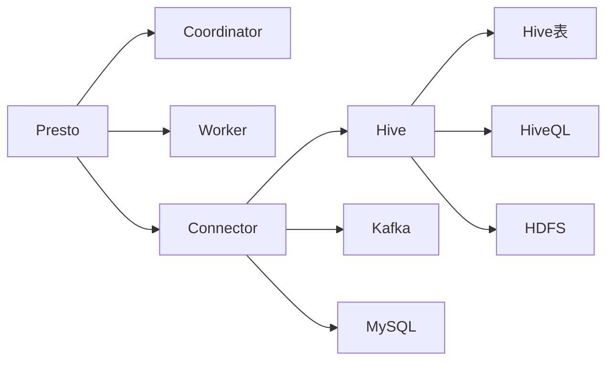

# Presto与Hive的优缺点比较

## 1. 背景介绍
### 1.1 大数据分析的重要性
在当今大数据时代,企业每天都会产生海量的数据。如何高效地存储、处理和分析这些数据,已成为企业面临的重大挑战。大数据分析技术的应用,可以帮助企业从海量数据中挖掘出有价值的信息,洞察业务趋势,优化业务流程,提升企业竞争力。

### 1.2 Hadoop生态圈概述
Hadoop作为大数据领域的重要基础设施,为大数据存储和分析提供了强大的支持。Hadoop生态圈包含了一系列开源工具和框架,如HDFS分布式文件系统、MapReduce分布式计算框架、Hive数据仓库工具、HBase列式数据库等。这些工具相互配合,构建了一个完整的大数据处理平台。

### 1.3 Presto与Hive的定位
在Hadoop生态圈中,Hive和Presto都是重要的SQL-on-Hadoop工具,它们在大数据分析领域扮演着不同的角色:

- Hive: 基于Hadoop的数据仓库工具,主要用于海量结构化数据的存储和批处理分析。
- Presto: 基于内存的分布式SQL查询引擎,主要用于海量数据的交互式查询和实时分析。

本文将从多个角度对Presto和Hive进行比较,分析它们的优缺点,帮助读者更好地理解和选择适合自己的大数据分析工具。

## 2. 核心概念与联系
### 2.1 Hive核心概念
#### 2.1.1 Hive表
Hive采用类SQL语法来定义表,支持各种数据类型。Hive表可以分为内部表和外部表两种:
- 内部表:数据存储在Hive自己的数据仓库目录下,删除表时会同时删除数据。
- 外部表:数据存储在HDFS等外部存储系统中,删除表只会删除元数据,不会删除实际数据。

#### 2.1.2 HiveQL
HiveQL是Hive提供的类SQL查询语言,支持SELECT、JOIN、GROUP BY等常见SQL操作。HiveQL会被Hive编译器转换为一系列MapReduce任务执行。

#### 2.1.3 Hive的数据存储
Hive的数据以文件形式存储在HDFS等分布式文件系统中。Hive支持多种文件格式,如TextFile、SequenceFile、RCFile、ORC、Parquet等。

### 2.2 Presto核心概念
#### 2.2.1 Presto的架构
Presto采用多层架构设计,主要包括Coordinator、Worker和Connector三个组件:
- Coordinator:负责接收客户端请求,解析SQL语句,生成执行计划,协调任务调度。
- Worker:负责执行具体的任务,访问底层数据源,进行数据处理和计算。
- Connector:负责与不同的数据源进行连接,如Hive、Kafka、MySQL等。

#### 2.2.2 Presto的内存计算
与Hive依赖MapReduce进行磁盘计算不同,Presto采用内存计算引擎,数据在内存中以列式存储,可以实现高效的数据压缩和编码。Presto通过Pipeline的方式在内存中传递数据,避免了不必要的磁盘IO,大大提升了查询性能。

#### 2.2.3 Presto的SQL支持
Presto支持标准的ANSI SQL语法,包括复杂的分析函数、窗口函数等。Presto还支持跨数据源的联邦查询,可以同时查询Hive、MySQL、Kafka等异构数据源。

### 2.3 Presto与Hive的联系
Presto和Hive在大数据分析领域各有优势,它们可以互补配合使用:
- Presto可以直接访问Hive的元数据和数据,对Hive表进行实时查询和分析。
- Hive可以作为Presto的数据源之一,为Presto提供数据支持。
- Presto可以将分析结果写回Hive表,与Hive形成数据闭环。

下图展示了Presto与Hive的核心概念与联系:


## 3. 核心算法原理与具体操作步骤
### 3.1 Hive的MapReduce计算过程
Hive基于Hadoop MapReduce进行数据处理和分析,其核心计算过程如下:
1. HiveQL被Hive编译器解析成一系列MapReduce任务。
2. Hive启动MapReduce Job,将计算分解到不同的节点执行。
3. Map阶段从HDFS读取数据,进行过滤、转换、聚合等操作,输出中间结果。
4. Reduce阶段对Map的中间结果进行合并、排序、聚合等操作,输出最终结果。
5. 结果数据写回HDFS或Hive表。

### 3.2 Presto的内存计算过程
Presto采用内存计算引擎,避免了MapReduce的磁盘IO开销,其核心计算过程如下:
1. Presto的Coordinator解析SQL,生成执行计划。
2. Coordinator将执行计划分解成一系列Stage,每个Stage包含多个Task。
3. Task被分发到不同的Worker节点并发执行。
4. Worker通过Connector访问底层数据源,将数据以列式格式加载到内存。
5. 数据在内存中以Pipeline的方式在Operator之间流转,进行过滤、投影、聚合等操作。
6. 计算结果通过Exchange在Worker之间流转,最终返回给Coordinator。
7. Coordinator将最终结果返回给客户端或写入数据源。

## 4. 数学模型和公式详细讲解举例说明
在Presto和Hive的查询优化中,都用到了一些重要的数学模型和算法,如布隆过滤器、最小成本生成树等。

### 4.1 布隆过滤器
布隆过滤器是一种概率数据结构,用于快速判断一个元素是否在集合中。它的原理如下:
1. 初始化一个m位的位数组,所有位初始化为0。
2. 选择k个独立的哈希函数,每个函数将元素映射到1到m之间的一个位置。
3. 对于集合中的每个元素,用k个哈希函数计算出k个位置,将位数组中对应的位置置为1。
4. 检查一个元素是否在集合中时,用k个哈希函数计算出k个位置,如果所有位置都为1,则认为元素在集合中。

布隆过滤器的数学模型如下:
- 位数组大小:$m$
- 哈希函数个数:$k$
- 集合元素个数:$n$
- 假阳性概率:$P=\left(1-\left(1-\frac{1}{m}\right)^{kn}\right)^k$

通过合理设置m和k的值,可以在较小的空间开销下,实现较低的假阳性概率。Presto和Hive都利用布隆过滤器对中间结果进行过滤,避免不必要的IO和计算。

### 4.2 最小成本生成树
最小成本生成树是一种用于查询优化的动态规划算法,目标是找到一个Join顺序,使得总的Join代价最小。设有n个表$T_1,T_2,…,T_n$,Join代价函数为$C(S)$,其中S为表的子集。则最小成本生成树的数学模型为:

$$
DP(S)=
\begin{cases}
0 & S=\emptyset \\
\min\limits_{s\subseteq S,s\neq\emptyset}\{C(s)+DP(S-s)\} & otherwise
\end{cases}
$$

算法的核心思想是:对于一个表集合S,枚举它的所有子集s,选择代价$C(s)+DP(S-s)$最小的s,作为最后一次Join的分割点。Presto和Hive都采用最小成本生成树算法对多表Join进行优化,选择最优的Join顺序。

## 5. 项目实践:代码实例和详细解释说明
下面通过一个具体的项目实践,演示Presto和Hive的使用方法和代码实现。

### 5.1 Hive实例
#### 5.1.1 创建Hive表
```sql
CREATE TABLE user_logs (
  user_id INT,
  visit_time STRING,
  url STRING
) ROW FORMAT DELIMITED
FIELDS TERMINATED BY ',';
```
这段代码创建了一个名为user_logs的Hive表,包含user_id、visit_time和url三个字段,字段之间用逗号分隔。

#### 5.1.2 加载数据到Hive表
```sql
LOAD DATA INPATH '/path/to/user_logs.txt' 
OVERWRITE INTO TABLE user_logs;
```
这段代码将HDFS上的数据文件user_logs.txt加载到Hive表user_logs中,如果表中已有数据会被覆盖。

#### 5.1.3 Hive查询示例
```sql
SELECT user_id, count(*) as visits 
FROM user_logs
WHERE visit_time BETWEEN '2022-01-01' AND '2022-01-31'
GROUP BY user_id
ORDER BY visits DESC
LIMIT 10;
```
这段代码统计2022年1月访问量最高的10个用户,并按访问量从高到低排序。查询会被转换为MapReduce任务执行。

### 5.2 Presto实例
#### 5.2.1 Presto连接Hive
首先需要在Presto中配置Hive Connector,修改`etc/catalog/hive.properties`:
```properties
connector.name=hive-hadoop2
hive.metastore.uri=thrift://hive-metastore:9083
```
这段配置指定了Presto连接Hive的元数据服务地址。

#### 5.2.2 Presto查询Hive数据
```sql
SELECT user_id, count(*) as visits
FROM hive.default.user_logs
WHERE visit_time BETWEEN '2022-01-01' AND '2022-01-31'
GROUP BY user_id
ORDER BY visits DESC
LIMIT 10;
```
这段查询与5.1.3中的Hive查询等价,但是会通过Presto的内存计算引擎执行,不需要启动MapReduce任务,响应速度更快。

#### 5.2.3 Presto跨数据源联邦查询
```sql
SELECT a.user_id, a.visits, b.user_name
FROM (
  SELECT user_id, count(*) AS visits
  FROM hive.default.user_logs
  WHERE visit_time BETWEEN '2022-01-01' AND '2022-01-31'
  GROUP BY user_id
) a
JOIN mysql.user_db.user_info b 
ON a.user_id = b.user_id
ORDER BY a.visits DESC
LIMIT 10;
```
这段查询展示了Presto的强大之处,可以同时查询Hive和MySQL两个数据源,并将结果进行Join。查询首先统计Hive中的用户访问量,然后与MySQL的用户信息表进行Join,获取访问量最高的10个用户的姓名。

## 6. 实际应用场景
Presto和Hive在实际的大数据分析项目中有广泛的应用,下面列举几个典型场景。

### 6.1 日志分析
互联网公司每天会产生海量的用户访问日志,如点击日志、搜索日志等。这些日志蕴含了用户行为模式、兴趣偏好等重要信息。通过Hive和Presto,可以对日志数据进行存储、清洗、分析,挖掘出有价值的洞察,指导产品优化和运营策略。

### 6.2 用户行为分析
电商、社交等互联网应用会收集大量的用户行为数据,如浏览、收藏、购买、评论等。利用Hive和Presto对这些数据进行多维度分析,可以刻画用户画像,预测用户需求,进行精准营销和个性化推荐。

### 6.3 业务数据分析
传统企业的业务系统也会积累大量的交易数据、客户数据、财务数据等。通过Hive和Presto,可以将这些异构数据进行整合分析,挖掘业务规律,优化业务流程,提升经营效率。

### 6.4 数据仓库与BI
Hive可以作为企业级数据仓库的存储引擎,支持PB级别的海量数据存储。Presto作为数据仓库的查询引擎,可以对Hive数据进行实时的交互式查询。再结合BI工具如Tableau、PowerBI等,可以实现数据可视化和自助分析,赋能业务决策。

## 7. 工具和资源推荐
### 7.1 Presto官方