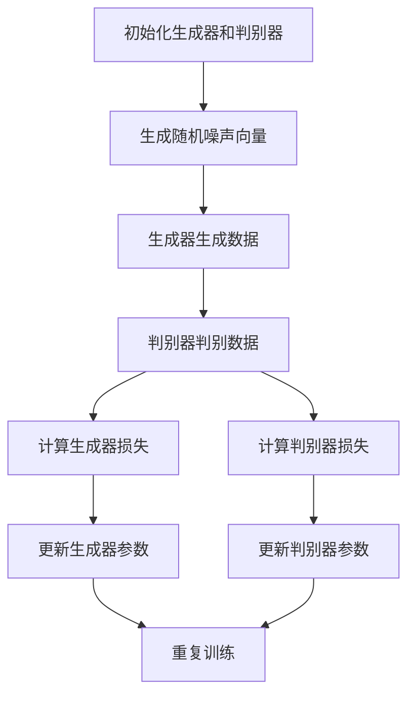

# Python机器学习实战：生成对抗网络(GAN)的原理与应用

## 1.背景介绍

生成对抗网络（Generative Adversarial Networks，简称GAN）自2014年由Ian Goodfellow等人提出以来，迅速成为机器学习和人工智能领域的热门研究方向。GAN的独特之处在于其通过两个神经网络——生成器（Generator）和判别器（Discriminator）之间的对抗训练，能够生成高质量的、以假乱真的数据。GAN在图像生成、数据增强、风格迁移等多个领域展现了强大的应用潜力。

## 2.核心概念与联系

### 2.1 生成器（Generator）

生成器的任务是从随机噪声中生成逼真的数据。它接受一个随机向量作为输入，通过一系列的神经网络层，输出一个与真实数据分布相似的样本。

### 2.2 判别器（Discriminator）

判别器的任务是区分真实数据和生成数据。它接受一个数据样本作为输入，通过一系列的神经网络层，输出一个概率值，表示该样本是真实数据的概率。

### 2.3 对抗训练

生成器和判别器通过对抗训练的方式进行优化。生成器试图欺骗判别器，使其认为生成的数据是真实的；而判别器则试图提高其区分真实数据和生成数据的能力。这个过程可以用一个零和博弈来描述。

### 2.4 损失函数

GAN的损失函数由生成器和判别器的损失函数组成。生成器的目标是最小化判别器的输出，而判别器的目标是最大化其输出。具体的损失函数将在后续章节详细介绍。

## 3.核心算法原理具体操作步骤

### 3.1 初始化

初始化生成器和判别器的参数。生成器的输入是一个随机噪声向量，判别器的输入是一个数据样本。

### 3.2 生成数据

生成器接受随机噪声向量作为输入，生成一个数据样本。

### 3.3 判别数据

判别器接受真实数据和生成数据作为输入，输出两个概率值，分别表示输入数据是真实数据的概率。

### 3.4 计算损失

计算生成器和判别器的损失。生成器的损失是判别器对生成数据的输出，判别器的损失是对真实数据和生成数据的输出之和。

### 3.5 更新参数

使用梯度下降法更新生成器和判别器的参数。生成器的参数更新方向是最小化其损失，判别器的参数更新方向是最大化其损失。

### 3.6 重复训练

重复上述步骤，直到生成器能够生成高质量的数据，判别器无法区分真实数据和生成数据。



## 4.数学模型和公式详细讲解举例说明

### 4.1 生成器的损失函数

生成器的目标是最小化判别器对生成数据的输出。生成器的损失函数可以表示为：

$$
L_G = -\mathbb{E}_{z \sim p_z(z)} [\log D(G(z))]
$$

其中，$G(z)$ 是生成器生成的数据，$D(G(z))$ 是判别器对生成数据的输出，$p_z(z)$ 是随机噪声的分布。

### 4.2 判别器的损失函数

判别器的目标是最大化其对真实数据和生成数据的输出。判别器的损失函数可以表示为：

$$
L_D = -\mathbb{E}_{x \sim p_{data}(x)} [\log D(x)] - \mathbb{E}_{z \sim p_z(z)} [\log (1 - D(G(z)))]
$$

其中，$D(x)$ 是判别器对真实数据的输出，$p_{data}(x)$ 是真实数据的分布。

### 4.3 总损失函数

GAN的总损失函数是生成器和判别器损失函数的和：

$$
L_{GAN} = L_G + L_D
$$

### 4.4 举例说明

假设我们有一个简单的GAN模型，生成器和判别器都是由全连接层组成。生成器接受一个100维的随机噪声向量，输出一个28x28的图像；判别器接受一个28x28的图像，输出一个概率值。

生成器的损失函数为：

$$
L_G = -\mathbb{E}_{z \sim p_z(z)} [\log D(G(z))]
$$

判别器的损失函数为：

$$
L_D = -\mathbb{E}_{x \sim p_{data}(x)} [\log D(x)] - \mathbb{E}_{z \sim p_z(z)} [\log (1 - D(G(z)))]
$$

## 5.项目实践：代码实例和详细解释说明

### 5.1 环境准备

首先，我们需要安装必要的Python库：

```bash
pip install tensorflow numpy matplotlib
```

### 5.2 数据准备

我们使用MNIST数据集作为训练数据：

```python
import tensorflow as tf
from tensorflow.keras.datasets import mnist

# 加载数据
(x_train, _), (_, _) = mnist.load_data()
x_train = x_train / 255.0
x_train = x_train.reshape(x_train.shape[0], 28, 28, 1).astype('float32')
```

### 5.3 构建生成器

生成器是一个简单的卷积神经网络：

```python
from tensorflow.keras import layers

def build_generator():
    model = tf.keras.Sequential()
    model.add(layers.Dense(7*7*256, use_bias=False, input_shape=(100,)))
    model.add(layers.BatchNormalization())
    model.add(layers.LeakyReLU())
    
    model.add(layers.Reshape((7, 7, 256)))
    model.add(layers.Conv2DTranspose(128, (5, 5), strides=(1, 1), padding='same', use_bias=False))
    model.add(layers.BatchNormalization())
    model.add(layers.LeakyReLU())
    
    model.add(layers.Conv2DTranspose(64, (5, 5), strides=(2, 2), padding='same', use_bias=False))
    model.add(layers.BatchNormalization())
    model.add(layers.LeakyReLU())
    
    model.add(layers.Conv2DTranspose(1, (5, 5), strides=(2, 2), padding='same', use_bias=False, activation='tanh'))
    
    return model

generator = build_generator()
```

### 5.4 构建判别器

判别器是一个简单的卷积神经网络：

```python
def build_discriminator():
    model = tf.keras.Sequential()
    model.add(layers.Conv2D(64, (5, 5), strides=(2, 2), padding='same', input_shape=[28, 28, 1]))
    model.add(layers.LeakyReLU())
    model.add(layers.Dropout(0.3))
    
    model.add(layers.Conv2D(128, (5, 5), strides=(2, 2), padding='same'))
    model.add(layers.LeakyReLU())
    model.add(layers.Dropout(0.3))
    
    model.add(layers.Flatten())
    model.add(layers.Dense(1))
    
    return model

discriminator = build_discriminator()
```

### 5.5 构建GAN模型

将生成器和判别器组合成一个GAN模型：

```python
from tensorflow.keras.optimizers import Adam

# 判别器优化器
discriminator_optimizer = Adam(1e-4)
discriminator.compile(loss='binary_crossentropy', optimizer=discriminator_optimizer)

# 冻结判别器参数
discriminator.trainable = False

# GAN模型
gan_input = layers.Input(shape=(100,))
generated_image = generator(gan_input)
gan_output = discriminator(generated_image)
gan = tf.keras.Model(gan_input, gan_output)

# GAN优化器
gan_optimizer = Adam(1e-4)
gan.compile(loss='binary_crossentropy', optimizer=gan_optimizer)
```

### 5.6 训练模型

定义训练函数：

```python
import numpy as np

def train_gan(gan, generator, discriminator, x_train, epochs, batch_size):
    for epoch in range(epochs):
        for _ in range(batch_size):
            # 训练判别器
            noise = np.random.normal(0, 1, (batch_size, 100))
            generated_images = generator.predict(noise)
            real_images = x_train[np.random.randint(0, x_train.shape[0], batch_size)]
            
            combined_images = np.concatenate([generated_images, real_images])
            labels = np.concatenate([np.zeros((batch_size, 1)), np.ones((batch_size, 1))])
            
            d_loss = discriminator.train_on_batch(combined_images, labels)
            
            # 训练生成器
            noise = np.random.normal(0, 1, (batch_size, 100))
            misleading_targets = np.ones((batch_size, 1))
            g_loss = gan.train_on_batch(noise, misleading_targets)
        
        print(f'Epoch {epoch + 1}/{epochs}, Discriminator Loss: {d_loss}, Generator Loss: {g_loss}')

# 开始训练
train_gan(gan, generator, discriminator, x_train, epochs=10000, batch_size=64)
```

### 5.7 生成图像

训练完成后，我们可以使用生成器生成图像：

```python
import matplotlib.pyplot as plt

def generate_and_save_images(model, epoch, test_input):
    predictions = model.predict(test_input)
    
    fig = plt.figure(figsize=(4, 4))
    
    for i in range(predictions.shape[0]):
        plt.subplot(4, 4, i + 1)
        plt.imshow(predictions[i, :, :, 0] * 127.5 + 127.5, cmap='gray')
        plt.axis('off')
    
    plt.savefig(f'image_at_epoch_{epoch:04d}.png')
    plt.show()

# 生成图像
seed = np.random.normal(0, 1, (16, 100))
generate_and_save_images(generator, 10000, seed)
```

## 6.实际应用场景

### 6.1 图像生成

GAN在图像生成领域有着广泛的应用。例如，StyleGAN可以生成高质量的人脸图像，CycleGAN可以实现图像风格迁移。

### 6.2 数据增强

在数据不足的情况下，GAN可以用于数据增强，生成更多的训练数据。例如，在医学图像分析中，GAN可以生成更多的病理图像。

### 6.3 图像修复

GAN可以用于图像修复，例如去除图像中的噪声、修复损坏的图像等。

### 6.4 超分辨率重建

GAN可以用于图像的超分辨率重建，将低分辨率图像转换为高分辨率图像。

## 7.工具和资源推荐

### 7.1 开源框架

- TensorFlow：一个开源的机器学习框架，支持GAN的实现。
- PyTorch：另一个流行的开源机器学习框架，支持GAN的实现。

### 7.2 数据集

- MNIST：一个手写数字数据集，常用于GAN的训练。
- CelebA：一个包含大量人脸图像的数据集，常用于人脸生成。

### 7.3 参考书籍

- 《深度学习》：Ian Goodfellow等人编写的经典教材，详细介绍了GAN的原理和应用。
- 《生成对抗网络》：一本专门介绍GAN的书籍，包含大量的实例和代码。

## 8.总结：未来发展趋势与挑战

### 8.1 发展趋势

GAN在图像生成、数据增强等领域展现了巨大的潜力。未来，GAN有望在更多的领域得到应用，例如自然语言处理、音频生成等。

### 8.2 挑战

尽管GAN取得了显著的成果，但仍然面临一些挑战。例如，GAN的训练过程不稳定，容易出现模式崩溃（Mode Collapse）现象。此外，GAN生成的数据质量仍有待提高。

## 9.附录：常见问题与解答

### 9.1 GAN的训练为什么不稳定？

GAN的训练过程涉及生成器和判别器的对抗训练，容易出现梯度消失或爆炸的问题。可以通过调整网络结构、使用更好的优化器等方法来缓解这些问题。

### 9.2 什么是模式崩溃（Mode Collapse）？

模式崩溃是指生成器生成的样本缺乏多样性，集中在某几个模式上。可以通过使用改进的损失函数、引入正则化等方法来缓解模式崩溃问题。

### 9.3 如何评估GAN的生成效果？

评估GAN的生成效果可以通过定量和定性两种方法。定量方法包括计算生成样本的FID（Fréchet Inception Distance）等指标；定性方法包括人工观察生成样本的质量。

---

作者：禅与计算机程序设计艺术 / Zen and the Art of Computer Programming