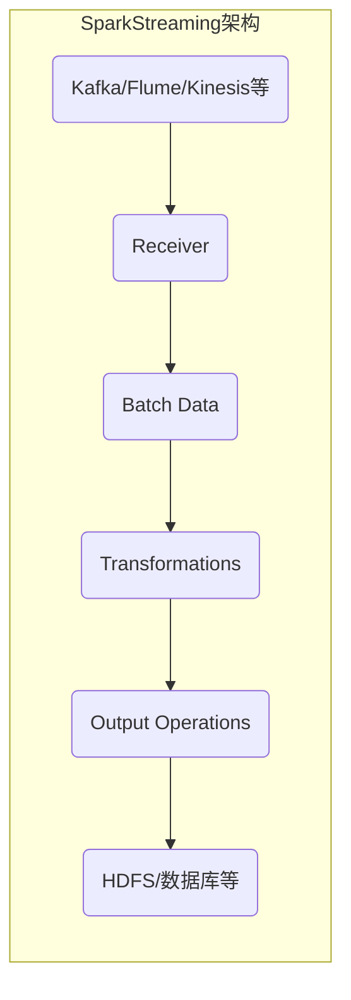
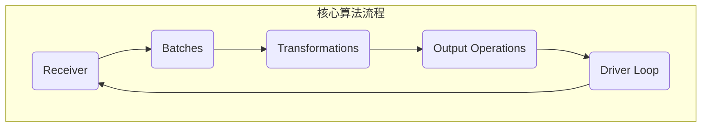

# **SparkStreaming的最佳实践案例分享**

## 1.背景介绍

在当今数据密集型应用的时代，实时数据处理和分析已经成为许多企业和组织的核心需求。Apache Spark是一个开源的大数据处理框架,它提供了一个统一的环境来进行批处理、交互式查询和流式计算。Spark Streaming作为Spark生态系统中的一个重要组成部分,专门用于实时数据流的处理,可以从多种数据源(如Kafka、Flume、Kinesis等)获取实时数据流,并对其进行高吞吐量、容错的流式计算。

在本文中,我们将探讨Spark Streaming的最佳实践,包括其核心概念、架构原理、关键算法、数学模型,以及实际应用场景和案例分析。我们还将分享一些有用的工具和资源,以帮助您更好地利用Spark Streaming进行实时数据处理。

## 2.核心概念与联系

在深入探讨Spark Streaming之前,让我们先了解一些核心概念:

### 2.1 Spark Streaming架构

Spark Streaming的架构基于Spark Core的RDD(Resilient Distributed Dataset,弹性分布式数据集)抽象,将实时数据流视为一系列不断到达的小批量数据。每个批次数据都被表示为一个RDD,Spark Streaming将这些RDD进行合并和处理,最终生成最终结果流。



### 2.2 DStream(Discretized Stream)

DStream(Discretized Stream,离散化流)是Spark Streaming中的基本抽象,表示一个连续的数据流。DStream由一系列连续的RDD组成,每个RDD包含一定时间间隔内的数据。

### 2.3 Window操作

Window操作允许您在一段滑动时间范围内对数据进行操作,例如滑动计数或滑动聚合。这对于捕获时间相关的模式和行为非常有用。

### 2.4 状态管理和检查点(Checkpointing)

由于流式计算通常是无界的,因此需要有状态管理和检查点机制来确保容错性和一致性。Spark Streaming支持多种状态存储和检查点机制,如基于HDFS的检查点或使用Redis等外部状态存储。

## 3.核心算法原理具体操作步骤

Spark Streaming的核心算法是基于微批次(micro-batching)的工作原理。具体操作步骤如下:

1. **数据接收**: Spark Streaming从数据源(如Kafka、Flume等)接收实时数据流,并将其分成小的批次。
2. **批次创建**: 每个批次数据都被表示为一个RDD。
3. **RDD转换**: 对每个批次的RDD执行所需的转换操作(如map、filter、join等)。
4. **输出操作**: 将转换后的RDD通过输出操作(如foreach)保存到外部系统(如HDFS、数据库等)。
5. **驱动程序循环**: 上述步骤在驱动程序中循环执行,直到流被手动停止。



## 4.数学模型和公式详细讲解举例说明

在Spark Streaming中,一些常见的数学模型和公式包括:

### 4.1 滑动窗口计算

滑动窗口计算是一种常见的流式计算模式,用于在一段时间范围内对数据进行聚合或其他操作。假设我们有一个DStream `inputStream`,我们想计算最近10秒内的数据计数。我们可以使用`window`操作:

$$
windowedStream = inputStream.window(Duration(10, TimeUnit.SECONDS))
$$

其中,`window`函数接受一个时间范围作为参数,并返回一个新的DStream `windowedStream`,其中包含在该时间范围内的所有数据。然后,我们可以在`windowedStream`上执行聚合操作,如:

$$
counts = windowedStream.count()
$$

这将计算出最近10秒内的数据计数。

### 4.2 状态管理和更新

在某些情况下,我们需要维护一些状态信息,并根据新到达的数据不断更新该状态。例如,我们想要计算一个键的运行计数。我们可以使用`updateStateByKey`操作:

$$
updatedStream = inputStream.map(lambda x: (x.key, (x.value, None)))
                            .updateStateByKey(updateFunction)
$$

其中,`updateFunction`是一个用户定义的函数,用于根据新值和旧状态计算新状态。例如:

```python
def updateFunction(newValues, runningCount):
    if runningCount is None:
        runningCount = 0
    return sum(newValues, runningCount)
```

这个函数将新值与旧状态(运行计数)相加,得到新的运行计数。

## 5.项目实践:代码实例和详细解释说明

让我们通过一个实际的项目案例来演示如何使用Spark Streaming进行实时数据处理。在这个示例中,我们将从Kafka消费实时日志数据,并对其进行一些基本的分析和处理。

### 5.1 设置Spark Streaming环境

首先,我们需要设置Spark Streaming环境,包括创建SparkContext和StreamingContext对象:

```python
from pyspark import SparkContext
from pyspark.streaming import StreamingContext

# 创建SparkContext
sc = SparkContext("local[2]", "LogAnalyzer")

# 创建StreamingContext,批次间隔为5秒
ssc = StreamingContext(sc, 5)
```

### 5.2 从Kafka消费数据

接下来,我们需要从Kafka消费实时日志数据流。我们将使用`KafkaUtils.createDirectStream`方法创建一个DStream:

```python
from pyspark.streaming.kafka import KafkaUtils

# Kafka主题和broker列表
topic = "log_topic"
kafkaBrokers = "localhost:9092"

# 创建DStream
logStream = KafkaUtils.createDirectStream(ssc, [topic], {"metadata.broker.list": kafkaBrokers})
```

### 5.3 数据处理和分析

现在,我们可以对日志数据流进行各种转换和操作。例如,我们可以统计每个级别的日志计数:

```python
# 提取日志级别
logLevels = logStream.map(lambda log: log[1].split(",")[2])

# 统计每个级别的日志计数
logCounts = logLevels.countByValue()

# 打印结果
def printLogCounts(counts):
    for level, count in counts.items():
        print(f"Log Level: {level}, Count: {count}")

logCounts.pprint()
```

在这个示例中,我们首先从每条日志记录中提取日志级别,然后使用`countByValue`操作统计每个级别的日志计数。最后,我们定义了一个`printLogCounts`函数来打印结果。

### 5.4 启动和停止流式计算

最后,我们需要启动流式计算,并等待它完成或手动停止:

```python
# 启动流式计算
logCounts.pprint()
ssc.start()

# 等待流式计算完成或手动停止
ssc.awaitTermination()
```

在这个示例中,我们启动了流式计算,并使用`awaitTermination`方法等待它完成或手动停止。您可以根据需要添加更多的转换和操作,以满足您的实际需求。

## 6.实际应用场景

Spark Streaming在许多实际应用场景中都发挥着重要作用,例如:

1. **日志处理和监控**: 从各种来源(如Web服务器、应用程序等)收集和处理实时日志数据,用于监控、故障排除和安全分析。
2. **物联网(IoT)数据处理**: 处理来自各种传感器和设备的实时数据流,用于实时监控、预测维护和优化。
3. **实时数据分析**: 对实时数据流(如社交媒体数据、金融交易数据等)进行实时分析,以获取及时的洞察力。
4. **实时机器学习**: 使用Spark Streaming和Spark MLlib进行实时机器学习模型训练和预测。
5. **实时报警和异常检测**: 监控实时数据流,检测异常模式并触发相应的警报或操作。
6. **实时推荐系统**: 基于用户的实时行为和偏好,生成个性化的实时推荐。

## 7.工具和资源推荐

在使用Spark Streaming进行实时数据处理时,以下工具和资源可能会很有用:

1. **Apache Kafka**: 一个分布式流式处理平台,常用作Spark Streaming的数据源。
2. **Apache Flume**: 一个分布式、可靠、可用的服务,用于高效地收集、聚合和移动大量日志数据。
3. **Apache Zookeeper**: 一个开源的分布式协调服务,用于管理和协调分布式应用程序。
4. **Spark Streaming Kafka Integration Guide**: Spark官方提供的Kafka集成指南,包含了使用Kafka作为Spark Streaming数据源的详细说明。
5. **Spark Streaming Programming Guide**: Spark官方提供的Spark Streaming编程指南,包含了各种API和概念的详细说明。
6. **Spark Streaming: A Hands-On Tutorial**: 一本免费的在线教程,提供了Spark Streaming的实践指导。

## 8.总结:未来发展趋势与挑战

Spark Streaming已经成为实时数据处理领域的一个重要工具,但它仍然面临一些挑战和未来发展趋势:

1. **低延迟和近乎实时处理**: 虽然Spark Streaming已经提供了较低的延迟,但对于某些应用场景(如金融交易),需要进一步降低延迟,实现近乎实时的处理。
2. **流式机器学习**: 将机器学习模型应用于实时数据流是一个新兴的研究领域,需要解决诸如模型更新、数据偏移等挑战。
3. **流式处理和批处理的统一**: 未来可能会看到流式处理和批处理的进一步融合,提供一个统一的框架来处理有界和无界数据。
4. **流式处理和人工智能的结合**: 将人工智能技术(如深度学习)与实时数据流相结合,可以带来更智能和更高级的实时分析和决策能力。
5. **流式处理的可解释性和可审计性**:随着实时数据处理在关键任务中的应用越来越广泛,确保其可解释性和可审计性将变得越来越重要。

## 9.附录:常见问题与解答

### 9.1 Spark Streaming和Apache Storm有什么区别?

Apache Storm是另一个流式处理框架,它采用了不同的设计理念。Storm基于记录级别的模型,而Spark Streaming基于微批次模型。Storm通常被认为更适合低延迟的场景,而Spark Streaming则更适合需要与Spark生态系统集成的场景。

### 9.2 如何选择合适的批次间隔?

选择合适的批次间隔是一个权衡的过程。较小的批次间隔可以提供更低的延迟,但也会增加系统开销。较大的批次间隔可以提高吞吐量,但延迟会增加。您需要根据您的具体需求和数据量来选择合适的批次间隔。

### 9.3 Spark Streaming如何确保容错性?

Spark Streaming通过检查点机制来确保容错性。它会定期将流计算的状态保存到可靠的存储系统(如HDFS)中,以便在发生故障时能够从最近的检查点恢复。您还可以配置多个工作节点来实现高可用性。

### 9.4 如何监控和调试Spark Streaming应用程序?

Spark提供了多种工具和指标来监控和调试Spark Streaming应用程序,包括Spark Web UI、Spark Metrics、Spark历史服务器等。您还可以使用日志记录和外部监控工具(如Prometheus、Grafana等)来收集和可视化相关指标。

### 9.5 Spark Streaming是否支持事务和exactly-once语义?

Spark Streaming本身不直接支持事务和exactly-once语义,但您可以通过集成外部系统(如Kafka或其他支持事务的消息队列)来实现这些功能。Spark还提供了一些实验性的exactly-once语义支持,但需要进行额外的配置和