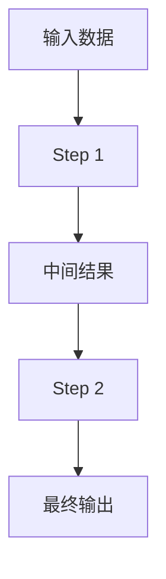
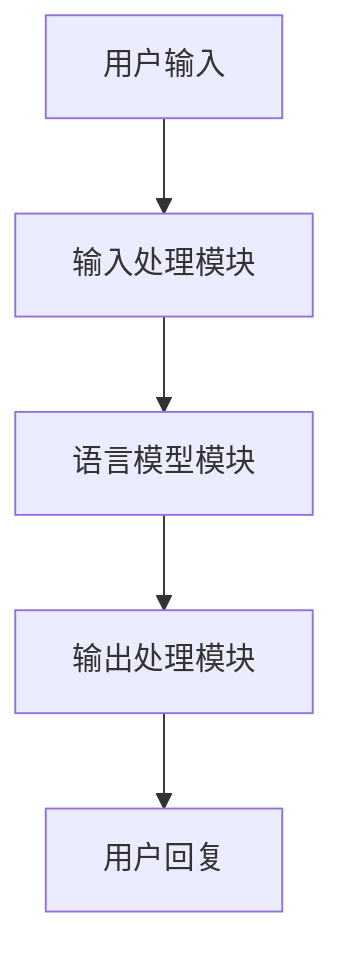

# 【LangChain编程：从入门到实践】Chain接口调用

## 1.背景介绍

在当今的人工智能和自然语言处理领域，LangChain作为一个强大的工具，正在迅速崛起。LangChain提供了一种灵活且高效的方式来构建和管理复杂的语言模型链。无论是用于对话系统、文本生成还是其他自然语言处理任务，LangChain都能提供强大的支持。

LangChain的核心在于其Chain接口，它允许开发者将多个语言模型和处理步骤串联起来，形成一个强大的处理链。通过这种方式，开发者可以轻松地实现复杂的语言处理任务，而无需手动管理每个步骤的细节。

## 2.核心概念与联系

在深入探讨Chain接口之前，我们需要了解一些核心概念：

### 2.1 Chain

Chain是LangChain的核心组件之一。它代表了一系列串联在一起的处理步骤，每个步骤都可以是一个独立的语言模型或处理函数。通过Chain接口，开发者可以将这些步骤组合在一起，形成一个完整的处理链。

### 2.2 Step

Step是Chain中的基本单元。每个Step可以是一个独立的语言模型、处理函数或其他处理步骤。Step之间可以通过数据流进行通信，从而实现复杂的处理逻辑。

### 2.3 Data Flow

Data Flow是Chain中各个Step之间的数据传递方式。每个Step的输出可以作为下一个Step的输入，从而形成一个完整的数据处理链。

### 2.4 Execution Context

Execution Context是Chain执行时的上下文信息。它包含了Chain执行过程中所需的所有信息，包括输入数据、中间结果和配置参数。

### 2.5 Chain接口

Chain接口是LangChain的核心接口之一。它提供了一组方法和属性，用于管理和执行Chain。通过Chain接口，开发者可以轻松地创建、配置和执行Chain。

## 3.核心算法原理具体操作步骤

在了解了核心概念之后，我们来详细探讨一下Chain接口的核心算法原理和具体操作步骤。

### 3.1 创建Chain

创建Chain的第一步是定义各个Step。每个Step可以是一个独立的语言模型或处理函数。以下是一个简单的示例：

```python
from langchain import Chain, Step

# 定义Step
step1 = Step(model="gpt-3", input="Hello, world!")
step2 = Step(model="gpt-3", input="How are you?")

# 创建Chain
chain = Chain(steps=[step1, step2])
```

### 3.2 配置Chain

创建Chain之后，我们需要对其进行配置。配置Chain的主要步骤包括设置输入数据、配置参数和执行上下文。以下是一个示例：

```python
# 设置输入数据
chain.set_input(data="Hello, world!")

# 配置参数
chain.set_params(params={"temperature": 0.7})

# 设置执行上下文
chain.set_context(context={"user_id": 12345})
```

### 3.3 执行Chain

配置完成之后，我们可以执行Chain。执行Chain的主要步骤包括执行各个Step、处理中间结果和生成最终输出。以下是一个示例：

```python
# 执行Chain
result = chain.execute()

# 处理结果
print(result)
```

### 3.4 Mermaid流程图

为了更好地理解Chain接口的工作原理，我们可以使用Mermaid流程图来展示Chain的执行流程：



## 4.数学模型和公式详细讲解举例说明

在LangChain中，数学模型和公式在处理自然语言任务时起着至关重要的作用。以下是一些关键的数学模型和公式的详细讲解和举例说明。

### 4.1 语言模型

语言模型是LangChain的核心组件之一。它通过统计和机器学习方法来预测文本中的下一个单词或短语。常见的语言模型包括n-gram模型、马尔可夫链和神经网络模型。

#### 4.1.1 n-gram模型

n-gram模型是一种基于统计的方法，用于预测文本中的下一个单词。它通过计算n个连续单词的联合概率来进行预测。以下是n-gram模型的公式：

$$
P(w_i | w_{i-n+1}, \ldots, w_{i-1}) = \frac{C(w_{i-n+1}, \ldots, w_i)}{C(w_{i-n+1}, \ldots, w_{i-1})}
$$

其中，$P(w_i | w_{i-n+1}, \ldots, w_{i-1})$表示在给定前n-1个单词的情况下，第i个单词的概率，$C(w_{i-n+1}, \ldots, w_i)$表示n个连续单词的联合出现次数。

#### 4.1.2 马尔可夫链

马尔可夫链是一种基于状态转移的模型，用于预测系统的下一个状态。在自然语言处理中，马尔可夫链可以用于建模文本中的单词序列。以下是马尔可夫链的公式：

$$
P(w_i | w_{i-1}) = P(w_i | S_i)
$$

其中，$P(w_i | w_{i-1})$表示在给定前一个单词的情况下，第i个单词的概率，$S_i$表示系统的当前状态。

#### 4.1.3 神经网络模型

神经网络模型是一种基于深度学习的方法，用于预测文本中的下一个单词。常见的神经网络模型包括循环神经网络（RNN）、长短期记忆网络（LSTM）和变换器（Transformer）。以下是神经网络模型的公式：

$$
h_t = f(W_h h_{t-1} + W_x x_t + b)
$$

其中，$h_t$表示第t个时间步的隐藏状态，$W_h$和$W_x$表示权重矩阵，$x_t$表示第t个时间步的输入，$b$表示偏置项，$f$表示激活函数。

### 4.2 数据流模型

数据流模型是LangChain中各个Step之间的数据传递方式。它通过定义数据的输入、处理和输出来实现复杂的处理逻辑。以下是数据流模型的公式：

$$
y = f(x)
$$

其中，$y$表示输出数据，$x$表示输入数据，$f$表示处理函数。

### 4.3 执行上下文模型

执行上下文模型是Chain执行时的上下文信息。它包含了Chain执行过程中所需的所有信息，包括输入数据、中间结果和配置参数。以下是执行上下文模型的公式：

$$
C = \{x, y, p, r\}
$$

其中，$C$表示执行上下文，$x$表示输入数据，$y$表示输出数据，$p$表示配置参数，$r$表示中间结果。

## 5.项目实践：代码实例和详细解释说明

在这一部分，我们将通过一个具体的项目实例来展示如何使用LangChain的Chain接口。我们将构建一个简单的对话系统，该系统能够根据用户输入生成相应的回复。

### 5.1 项目需求分析

我们的对话系统需要具备以下功能：

1. 接收用户输入的文本。
2. 使用语言模型生成回复。
3. 将回复返回给用户。

### 5.2 项目架构设计

我们的对话系统将由以下几个部分组成：

1. 输入处理模块：接收用户输入的文本。
2. 语言模型模块：使用语言模型生成回复。
3. 输出处理模块：将回复返回给用户。

以下是项目的架构设计图：



### 5.3 代码实现

以下是对话系统的代码实现：

```python
from langchain import Chain, Step

# 定义输入处理模块
def input_processing(input_text):
    return {"input_text": input_text}

# 定义语言模型模块
def language_model(input_data):
    model = "gpt-3"
    response = model.generate(input_data["input_text"])
    return {"response": response}

# 定义输出处理模块
def output_processing(output_data):
    return output_data["response"]

# 创建Chain
input_step = Step(func=input_processing)
model_step = Step(func=language_model)
output_step = Step(func=output_processing)

chain = Chain(steps=[input_step, model_step, output_step])

# 执行Chain
user_input = "Hello, how are you?"
chain.set_input(data=user_input)
result = chain.execute()

# 打印结果
print(result)
```

### 5.4 详细解释说明

1. **输入处理模块**：接收用户输入的文本，并将其转换为字典格式。
2. **语言模型模块**：使用GPT-3语言模型生成回复。
3. **输出处理模块**：将语言模型生成的回复提取出来，并返回给用户。

## 6.实际应用场景

LangChain的Chain接口在实际应用中有着广泛的应用场景。以下是一些典型的应用场景：

### 6.1 对话系统

对话系统是LangChain的一个重要应用场景。通过Chain接口，开发者可以轻松地构建复杂的对话系统，实现自然语言理解和生成。

### 6.2 文本生成

文本生成是LangChain的另一个重要应用场景。通过Chain接口，开发者可以构建复杂的文本生成系统，实现自动化的文本生成任务。

### 6.3 情感分析

情感分析是LangChain的一个典型应用场景。通过Chain接口，开发者可以构建复杂的情感分析系统，实现对文本情感的自动化分析。

### 6.4 机器翻译

机器翻译是LangChain的一个重要应用场景。通过Chain接口，开发者可以构建复杂的机器翻译系统，实现高质量的自动化翻译任务。

## 7.工具和资源推荐

在使用LangChain的过程中，有一些工具和资源可以帮助开发者更高效地进行开发和调试。以下是一些推荐的工具和资源：

### 7.1 开发工具

1. **Jupyter Notebook**：Jupyter Notebook是一个强大的交互式开发工具，适用于LangChain的开发和调试。
2. **VS Code**：VS Code是一个流行的代码编辑器，支持多种编程语言和插件，适用于LangChain的开发。

### 7.2 资源推荐

1. **LangChain官方文档**：LangChain的官方文档提供了详细的API文档和使用指南，是开发者学习和使用LangChain的重要资源。
2. **GitHub示例项目**：LangChain的GitHub仓库中有许多示例项目，开发者可以参考这些示例项目来学习和使用LangChain。

## 8.总结：未来发展趋势与挑战

LangChain作为一个强大的语言处理工具，在未来有着广阔的发展前景。随着自然语言处理技术的不断进步，LangChain将会在更多的应用场景中发挥重要作用。

### 8.1 未来发展趋势

1. **多模态处理**：未来，LangChain将会支持多模态处理，实现对文本、图像、音频等多种数据的综合处理。
2. **自动化优化**：未来，LangChain将会引入更多的自动化优化技术，实现对Chain的自动化优化和调优。
3. **分布式处理**：未来，LangChain将会支持分布式处理，实现对大规模数据的高效处理。

### 8.2 挑战

1. **性能优化**：随着Chain的复杂度增加，性能优化将成为一个重要的挑战。开发者需要不断优化Chain的执行效率，以满足实际应用的需求。
2. **数据质量**：在实际应用中，数据质量是一个重要的问题。开发者需要确保输入数据的质量，以保证Chain的处理结果的准确性。
3. **安全性**：在处理敏感数据时，安全性是一个重要的挑战。开发者需要确保Chain的安全性，以保护用户的数据隐私。

## 9.附录：常见问题与解答

### 9.1 如何安装LangChain？

可以使用以下命令安装LangChain：

```bash
pip install langchain
```

### 9.2 如何创建自定义的Step？

可以通过继承Step类来创建自定义的Step。以下是一个示例：

```python
from langchain import Step

class CustomStep(Step):
    def __init__(self, func):
        super().__init__(func=func)

def custom_function(input_data):
    return {"output": input_data["input"] * 2}

custom_step = CustomStep(func=custom_function)
```

### 9.3 如何调试Chain？

可以使用Jupyter Notebook或VS Code等开发工具来调试Chain。通过逐步执行Chain的各个Step，可以方便地进行调试和排查问题。

### 9.4 如何优化Chain的性能？

可以通过以下几种方法来优化Chain的性能：

1. **减少Step的数量**：通过合并相似的Step，可以减少Chain的执行时间。
2. **优化Step的实现**：通过优化Step的实现，可以提高Chain的执行效率。
3. **使用分布式处理**：通过使用分布式处理，可以提高Chain的处理能力。

### 9.5 如何处理Chain中的错误？

可以通过捕获异常来处理Chain中的错误。以下是一个示例：

```python
try:
    result = chain.execute()
except Exception as e:
    print(f"Error: {e}")
```

作者：禅与计算机程序设计艺术 / Zen and the Art of Computer Programming